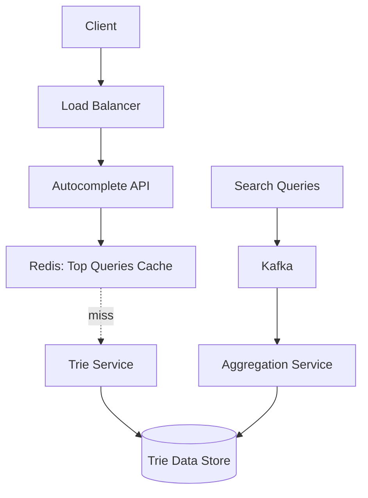

#system-design #case-study #intermediate

# Design Search Autocomplete

## The Question

> "Design Google's search autocomplete / typeahead suggestion system."

---

## Step 1: Requirements

**Functional:** As user types, show top 5-10 suggestions, ranked by popularity, updated with new search trends, support multiple languages
**Non-Functional:** <100ms latency (feels instant), high availability, handle 100K+ queries/sec

---

## Step 2: Estimation

| Metric | Value |
|--------|-------|
| Search queries/day | 5B |
| Unique queries | ~20% = 1B unique |
| Characters typed per query | avg 5 keystrokes |
| Autocomplete requests/day | 5B × 5 = 25B |
| Autocomplete requests/sec | ~290K |

---

## Step 3: High-Level Design



---

## Step 4: Deep Dive

### Trie Data Structure

A prefix tree where each node stores a character and popular completions:

```
         (root)
        /  |  \
       f   t   s
      /    |    \
     a     r     y
    /      |      \
  c(5)   e(8)   s(3)
  e      e      t
  b(5)   e(8)   e(3)
  o        |     m(3)
  o       (8)
  k(5)
```

Searching "tre" → traverse t→r→e → return top completions: ["tree", "trend", "trek"]

### Ranking Suggestions

Each prefix stores the top K suggestions pre-computed:
```
"fa" → [("facebook", 1B), ("facetime", 100M), ("face swap", 50M)]
"tre" → [("tree", 500M), ("trend", 400M), ("trek", 100M)]
```

Scoring factors:
- **Frequency:** How often this query is searched
- **Recency:** Recent searches weighted higher (trending)
- **Personalization:** User's own search history (optional)

### Updating the Trie

Don't update on every search (too expensive). Batch update:
```
Real-time searches → Kafka → Aggregation (every 15 minutes)
→ Compute top queries per prefix → Update trie
```

For trending topics, a separate real-time pipeline can inject fast-rising queries.

### Caching Strategy

```
Level 1: Browser cache (cache autocomplete responses for 1 hour)
Level 2: CDN cache (popular prefixes like "face", "goo")
Level 3: Redis (top 100K prefixes with their suggestions)
Level 4: Trie service (full trie for rare prefixes)
```

Most queries hit cache. "fac" → almost certainly in Redis cache.

### Optimization: Don't Query on Every Keystroke

- **Debounce:** Wait 50-100ms after user stops typing before sending request
- **Prefix reuse:** If "tre" results are cached, "tree" results are a subset — filter client-side
- **Minimum characters:** Don't query for 1-character prefixes (too broad)

### Multi-Language Support

Separate tries per language. Detect language from:
- User locale setting
- Input method (character set)
- Geographic location

---

## Interview Simulation

> **Interviewer:** Design Google's autocomplete.

> **Candidate:** The core data structure is a trie — a prefix tree where each node represents a character. For each prefix, we pre-compute and store the top 10 suggestions ranked by search frequency. When a user types "tre", we traverse the trie and return the pre-computed results in under 10ms.

> **Interviewer:** How do you keep the suggestions current?

> **Candidate:** I wouldn't update the trie on every search — that's too expensive. Instead, search queries stream into Kafka. An aggregation service processes them in batches every 15 minutes, recomputing the top queries per prefix. For truly trending topics, a faster pipeline can inject rising queries within minutes.

> **Candidate:** For latency: heavy caching at multiple levels. Popular prefixes cached in Redis, common ones at the CDN. The client debounces keystrokes — waits 50ms after the user pauses before sending a request. Client-side filtering reuses previous results when possible.

> **Interviewer:** At 290K requests/sec, how do you scale?

> **Candidate:** The trie is read-heavy and mostly static between updates. We can shard it by prefix range — server 1 handles a-f, server 2 handles g-n, etc. Each shard has multiple read replicas. With Redis caching handling 80%+ of requests, the actual trie servers see much less load.

---

## Building Blocks Used

| Component | Building Block |
|-----------|---------------|
| Trie storage | Custom data structure (in-memory) |
| Caching | [[02_building_blocks/caching]] (Redis, CDN) |
| Query aggregation | [[02_building_blocks/message_queues]] (Kafka) |
| Search ranking | Frequency + recency scoring |
