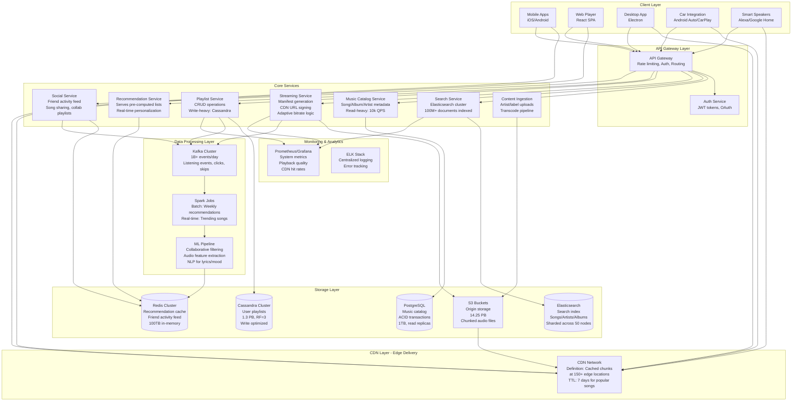
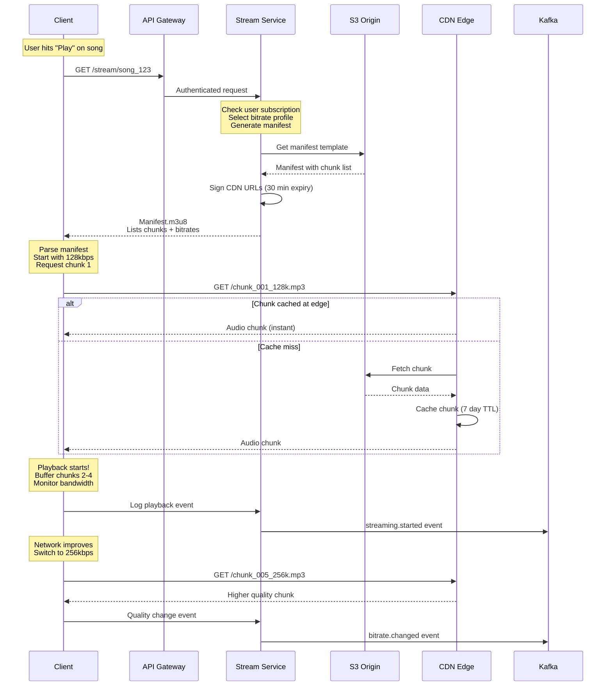
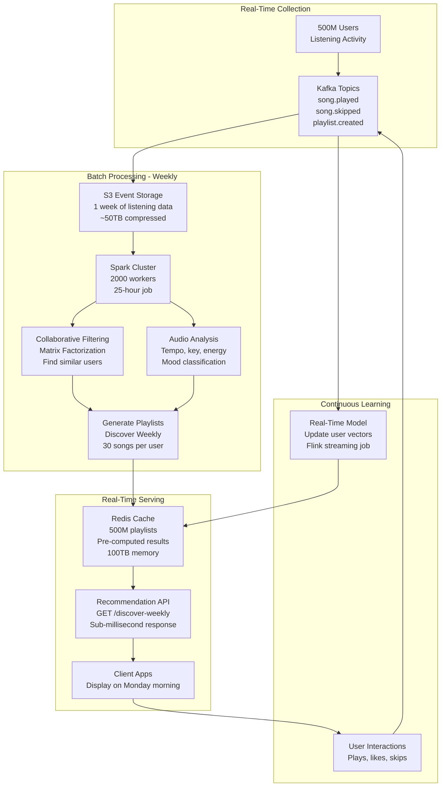
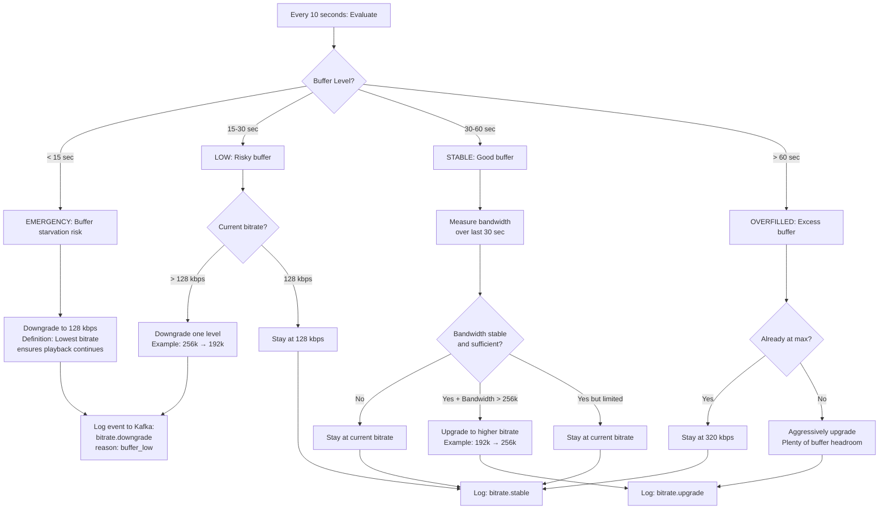
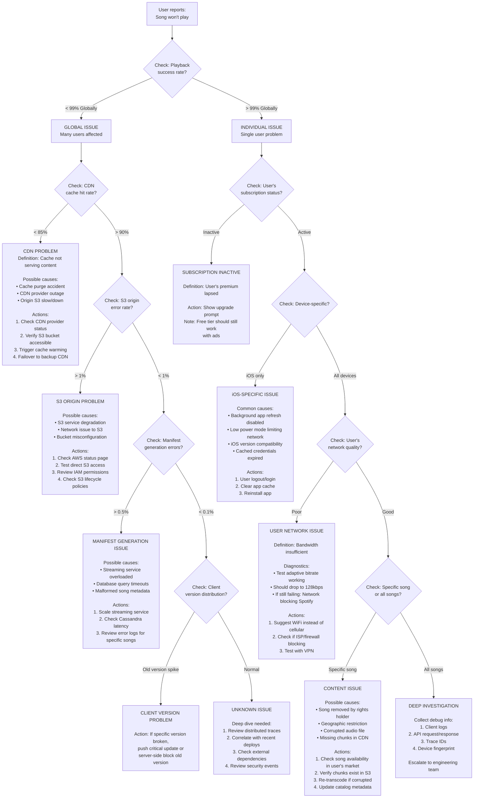

#system-design #case-study #intermediate

# Design Spotify (Music Streaming)

## Intuition (30 sec)

Spotify is like a giant library where millions of books (songs) are stored in pieces across the world. When you open a book, you don't wait for the whole thing to arrive—pages are delivered just-in-time as you read. The library learns what you like and suggests new books, while your friends' reading activity appears on your feed.

---

## Failure-First Scenario

**The Concert Spike Crisis:**

It's 2023. Taylor Swift announces a surprise album drop at midnight. 50M fans hit play simultaneously. Without proper architecture, the result is catastrophic:

- **Without chunking:** Servers try to send entire 5MB songs to 50M users = 250TB/sec bandwidth demand. Instant collapse.
- **Without CDN:** All requests hit origin servers in one data center. Melts down in seconds.
- **Without adaptive bitrate:** Users on slow connections wait 30+ seconds for playback to start. Mass abandonment.
- **Without proper caching:** The recommendation engine crashes trying to recalculate 50M personalized playlists in real-time.

**Result:** $10M+ in lost premium subscriptions, reputation damage, and users fleeing to competitors.

**The Fix:** Everything you'll learn in this design—chunked streaming, global CDN distribution, adaptive bitrate, pre-computed recommendations, and Cassandra for playlist writes.

---

## The Question

> "Design a music streaming platform like Spotify."

---

## Key Terms Glossary

**Core Streaming Concepts:**
- **Streaming:** Continuous delivery of audio data where playback begins before the entire file is downloaded
- **Chunking:** Splitting audio files into small segments (typically 10-15 seconds) that can be independently cached and delivered
- **Adaptive Bitrate Streaming (ABR):** Dynamically adjusting audio quality based on network conditions to maintain uninterrupted playback
- **Bitrate:** The amount of data per second in an audio stream (e.g., 128 kbps = 128 kilobits per second)
- **Manifest File:** A metadata file listing all available chunks, bitrates, and URLs for a song
- **Pre-buffering:** Downloading upcoming chunks in advance (typically 30-60 seconds ahead) to prevent playback interruption
- **Cache Warming:** Pre-populating CDN caches with popular content before demand spikes

**Architecture Concepts:**
- **CDN (Content Delivery Network):** Geographically distributed servers that cache content close to end users for faster delivery
- **Origin Server:** The primary source of content where original files are stored (e.g., S3)
- **Edge Location:** A CDN server positioned near end users to minimize latency
- **TTL (Time To Live):** How long cached content remains valid before requiring refresh

**Recommendation Concepts:**
- **Collaborative Filtering:** Recommendation technique based on finding similar users ("Users who liked X also liked Y")
- **Content-Based Filtering:** Recommendations based on audio features (tempo, key, energy, valence)
- **Matrix Factorization:** ML technique decomposing user-song interactions into latent feature vectors
- **Cold Start Problem:** Challenge of recommending to new users with no listening history
- **Audio Fingerprinting:** Creating unique identifiers from audio signals for matching and deduplication

**Database Concepts:**
- **Wide-Column Store:** NoSQL database (like Cassandra) optimizing for writes and storing data in column families
- **Partition Key:** The primary key component determining data distribution across nodes
- **Clustering Key:** Secondary key component determining sort order within a partition
- **Replication Factor:** Number of copies of data maintained across nodes
- **Consistency Level:** Trade-off between data consistency and availability (ONE, QUORUM, ALL)

---

## Step 1: Requirements

**Functional:**
- Search songs/artists/albums/playlists
- Stream music with adaptive quality
- Create and manage playlists
- Follow artists and get updates
- Personalized recommendations (Discover Weekly, Daily Mix)
- Offline download for premium users
- Social features (share songs, see friends' activity, collaborative playlists)
- Podcast support
- Lyrics synchronization

**Non-Functional:**
- **Search Latency:** <200ms for search results
- **Playback Start:** <1 second to begin streaming
- **Scale:** Support 100M+ songs, 500M users, 20M concurrent streams
- **Availability:** 99.9% uptime (music is mission-critical for users)
- **Bandwidth:** Handle peak traffic of 3+ Tbps
- **Storage:** 500TB+ for music catalog
- **Global:** Low latency worldwide (<150ms)

---

## Step 2: Capacity Planning (100B Streams/Month)

**Capacity Planning Definition:**
Process of determining infrastructure resources needed to meet performance and scale targets without over-provisioning.

### Traffic Estimation

```
Given: 100B streams/month target

Step 1: Calculate average streams per second
  100B streams ÷ 30 days ÷ 86,400 sec/day
  = 38,580 streams/sec average

Step 2: Account for peak traffic (3x average)
  Definition: Peak represents highest traffic periods
               (morning commute, evening listening)
  Peak = 38,580 × 3 = 115,740 streams/sec

Step 3: Calculate bandwidth requirements
  Assumptions:
  • Average bitrate: 192 kbps (mix of 128/256/320)
  • Overhead factor: 1.2 (HTTP headers, retries)

  Bandwidth = 115,740 streams × 192 kbps × 1.2
            = 26.7 Tbps peak bandwidth

  Definition: This is total bandwidth needed globally,
              distributed across CDN edge locations
```

### Storage Estimation

| Metric | Calculation | Value |
|--------|-------------|-------|
| **Total songs** | Given | 100M songs |
| **Avg song size** | 3 minutes × 320kbps | 7.2 MB (highest quality) |
| **Multiple bitrates** | Store 128/192/256/320 kbps | 4 versions per song |
| **Raw storage** | 100M × 7.2MB × 4 | 2.88 PB |
| **Chunked overhead** | 10-sec chunks + manifests (+10%) | 3.17 PB |
| **Replication** | 3x for redundancy | 9.5 PB total |
| **Growth buffer** | +50% for 2 years growth | **14.25 PB** |

### Database Scale

**Cassandra Playlist Database:**
```
Assumptions:
• 500M total users
• Average 15 playlists per user
• Average 50 songs per playlist
• Each entry ~1KB

Calculation:
  500M users × 15 playlists × 50 songs × 1KB
  = 375 TB of playlist data

With 3x replication factor:
  375 TB × 3 = 1.125 PB

With metadata (playlist names, descriptions, images):
  Additional 50TB × 3 = 150TB

Total Cassandra Storage: ~1.3 PB
```

**PostgreSQL Catalog Database:**
```
Catalog data (songs, albums, artists, metadata):
• 100M songs × 5KB avg = 500GB
• 10M albums × 10KB avg = 100GB
• 5M artists × 20KB avg = 100GB
• Indexes and relations = 300GB

Total: ~1TB (easily handled by PostgreSQL)
```

### Server Requirements

**Streaming Service Instances:**
```
Definition: Servers handling API requests, authentication,
            and coordinating chunk delivery

Given:
• Peak QPS: 115,740 streams/sec
• Each stream = ~20 chunk requests (3-min song / 10-sec chunks)
• Total requests/sec = 115,740 × 20 = 2.3M req/sec
• Average response time: 50ms (low because CDN serves chunks)

Concurrent requests = 2.3M × 0.05 = 115,000 concurrent

If one server handles 1,000 concurrent connections:
  Servers needed = 115,000 ÷ 1,000 = 115 servers

With 50% buffer and redundancy:
  Production deployment: ~200 streaming service instances
```

**Recommendation Engine:**
```
Batch Processing (Weekly for Discover Weekly):
• Process 500M user histories
• If 1 server processes 10,000 users/hour:
  Total time = 500M ÷ 10,000 = 50,000 hours

With 2,000 Spark workers:
  Time = 50,000 ÷ 2,000 = 25 hours
  Easily fits in weekly batch window

Real-time Recommendations (Home Feed):
• Cache pre-computed results in Redis
• Redis cluster: 100TB of recommendation data
• With 100 Redis nodes: 1TB per node
```

**CDN Edge Locations:**
```
Definition: Edge locations cache popular content near users

Goal: <150ms latency globally
Strategy: Deploy in top 50+ metros worldwide

Cache requirements per edge:
• Store top 10% of catalog (hot content)
• 10M songs × 7.2MB × 4 bitrates = 288TB
• Plus chunk indexes and manifests: 300TB per major edge

Global CDN storage: ~15PB distributed
```

---

## Step 3: High-Level Design

### System Architecture (Complete View)



**Component Definitions:**

**Client Layer:**
- **Mobile/Web/Desktop Apps:** Native applications handling UI, local caching (offline mode), and adaptive bitrate selection
- **Car/IoT Integration:** Voice-controlled interfaces with simplified UI for safety/accessibility

**CDN Layer:**
- **Edge Caching:** Popular songs cached at 150+ global locations. Top 10% of catalog = 90% of requests
- **Cache Strategy:** 7-day TTL for popular songs, 24-hour for long-tail content

**Core Services:**
- **Streaming Service:** Orchestrates playback by generating signed CDN URLs and manifests for adaptive streaming
- **Playlist Service:** Handles 500M users × 15 playlists with millions of writes per second at peak
- **Recommendation Service:** Serves pre-computed results from cache; batch jobs update weekly

**Storage Layer:**
- **Cassandra:** Chosen for playlist storage due to high write throughput (millions of playlist updates/sec)
- **PostgreSQL:** Catalog data with complex relationships (songs → albums → artists) requiring ACID
- **Redis:** Sub-millisecond reads for frequently accessed recommendations and social feeds

---

## Visual Architecture Diagrams

### Audio Streaming Flow (Detailed)



**Step-by-Step Definitions:**

1. **Manifest Request:** Client requests a manifest file (M3U8 format) containing the list of all audio chunks and available bitrates
2. **Manifest Generation:** Streaming service dynamically generates signed URLs for each chunk with expiration timestamps
3. **Adaptive Bitrate Selection:** Client measures bandwidth and selects appropriate quality (128/192/256/320 kbps)
4. **Chunk Retrieval:** Client sequentially downloads 10-second chunks, always staying 30-60 seconds ahead
5. **CDN Cache Check:** Edge server checks local cache; on miss, fetches from origin and caches for future requests
6. **Event Logging:** All playback events (start, pause, skip, quality changes) sent to Kafka for analytics

### Recommendation Engine Pipeline



**Pipeline Definitions:**

- **Collaborative Filtering:** Algorithm finding users with similar listening patterns, then recommending songs they enjoyed
  - **How it works:** Converts user-song interactions into a sparse matrix, applies matrix factorization (SVD) to find latent features
  - **Example:** If User A and User B both love 80% of the same indie rock, User A gets recommendations from User B's unique likes

- **Matrix Factorization:** Technique decomposing large user-item matrix into two smaller matrices of latent features
  - **Why it works:** Reduces 500M users × 100M songs matrix into manageable feature vectors (e.g., 200 dimensions)

- **Audio Feature Extraction:** ML models analyzing raw audio to classify mood, tempo, energy, danceability
  - **Tools:** Librosa for feature extraction, CNN models for genre/mood classification

- **Redis Cache Strategy:**
  - **Write:** Batch job updates all playlists once per week (Monday 12 AM)
  - **Read:** Millions of users fetch playlists Monday morning; all served from cache
  - **TTL:** 7 days; refreshed by next week's batch job

### Cassandra Data Model for Playlists

**Why Cassandra for Playlists:**
- **High write throughput:** Millions of users adding/removing songs simultaneously
- **Linear scalability:** Add nodes to handle 10x more playlists without redesign
- **Always available:** Multi-datacenter replication; survives entire datacenter failure
- **Time-series friendly:** Playlist modifications have timestamps; Cassandra excels at time-series data

**Schema Design:**

```sql
-- Table 1: User Playlists (List all playlists for a user)
CREATE TABLE user_playlists (
    user_id UUID,                -- Partition key: distributes users across nodes
    playlist_id UUID,            -- Clustering key: sorts playlists for user
    name TEXT,
    description TEXT,
    image_url TEXT,
    is_public BOOLEAN,
    created_at TIMESTAMP,
    updated_at TIMESTAMP,
    follower_count INT,
    PRIMARY KEY (user_id, playlist_id)
) WITH CLUSTERING ORDER BY (playlist_id DESC)
AND compaction = {'class': 'TimeWindowCompactionStrategy'};

-- Definition of keys:
-- Partition Key (user_id): All playlists for one user stored on same nodes
--                          Query: "Get all playlists for user_123" → single partition read
-- Clustering Key (playlist_id): Orders playlists within partition
--                               Enables efficient range scans

-- Table 2: Playlist Songs (All songs in a playlist)
CREATE TABLE playlist_songs (
    playlist_id UUID,            -- Partition key: all songs for playlist together
    position INT,                -- Clustering key: song order in playlist
    song_id UUID,
    added_at TIMESTAMP,
    added_by UUID,               -- User who added song (for collaborative playlists)
    PRIMARY KEY (playlist_id, position)
) WITH CLUSTERING ORDER BY (position ASC);

-- Why this design:
-- Fast reads: "Get songs in playlist_456" → single partition read
-- Ordered results: Songs returned in playlist order via clustering key
-- Efficient updates: Reordering songs = update position column

-- Table 3: Song Metadata Denormalized (For fast rendering)
CREATE TABLE playlist_song_details (
    playlist_id UUID,
    position INT,
    song_id UUID,
    title TEXT,                  -- Denormalized for performance
    artist TEXT,                 -- Avoid join with catalog DB
    album TEXT,
    duration_ms INT,
    album_art_url TEXT,
    PRIMARY KEY (playlist_id, position)
) WITH CLUSTERING ORDER BY (position ASC);

-- Trade-off: Data duplication for read performance
-- When song metadata changes (e.g., artist name correction),
-- background job updates all playlist entries

-- Table 4: Collaborative Playlist Access (Who can edit)
CREATE TABLE playlist_collaborators (
    playlist_id UUID,
    user_id UUID,
    permission TEXT,             -- 'owner', 'editor', 'viewer'
    added_at TIMESTAMP,
    PRIMARY KEY (playlist_id, user_id)
);
```

**Cassandra Configuration for Production:**

```yaml
# cassandra.yaml - Production settings for playlist cluster

# Cluster basics
cluster_name: 'spotify_playlists_prod'
num_tokens: 256                  # Virtual nodes for even distribution

# Replication Strategy (Applied per keyspace)
# CREATE KEYSPACE spotify WITH replication = {
#   'class': 'NetworkTopologyStrategy',
#   'us-east': 3,      # 3 replicas in US East datacenter
#   'us-west': 3,      # 3 replicas in US West datacenter
#   'eu-west': 3       # 3 replicas in EU West datacenter
# };
# Definition: NetworkTopologyStrategy = datacenter-aware replication

# Consistency Settings
write_consistency: QUORUM        # Must write to 2 of 3 replicas
read_consistency: ONE            # Read from any 1 replica (low latency)

# Why QUORUM writes + ONE reads:
# - Writes require majority → data durability
# - Reads from any node → low latency
# - Tradeoff: Eventual consistency (rare stale reads acceptable for playlists)

# Performance Tuning
concurrent_writes: 128           # Handle high write throughput
concurrent_reads: 64
memtable_flush_writers: 8        # Parallel flushing to disk

# Each node memory allocation
memtable_heap_space_in_mb: 8192  # 8GB heap for in-memory writes
memtable_offheap_space_in_mb: 8192

# Compaction (Background optimization)
compaction_throughput_mb_per_sec: 64  # Disk I/O for compaction
concurrent_compactors: 4

# Definition: Compaction = merging SSTables, removing tombstones
# TimeWindowCompactionStrategy chosen for time-series playlist updates

# Commit Log (Write-Ahead Log)
commitlog_sync: periodic
commitlog_sync_period_in_ms: 10000   # Flush every 10 seconds
commitlog_segment_size_in_mb: 32

# Cache Configuration
row_cache_size_in_mb: 0          # Disabled (not useful for playlists)
key_cache_size_in_mb: 2048       # Cache partition keys (2GB)

# Hinted Handoff (Replaying missed writes)
hinted_handoff_enabled: true
max_hint_window_in_ms: 10800000  # 3 hours of hints stored

# Read Repair (Fix inconsistencies)
read_repair_chance: 0.1          # 10% of reads trigger repair
dclocal_read_repair_chance: 0.1

# Tombstone Settings
tombstone_warn_threshold: 1000
tombstone_failure_threshold: 100000

# Definition: Tombstones = deletion markers in Cassandra
# Too many tombstones slow down reads (must scan through deleted data)
```

**Capacity Planning for Cassandra Cluster:**

```
Given:
• 500M users
• Average 15 playlists per user
• Average 50 songs per playlist
• 3x replication factor
• Total data: 1.3 PB

Node Sizing:
• Each node: 4TB SSD storage (usable: 3TB after overhead)
• Nodes needed: 1.3 PB ÷ 3 TB = ~433 nodes

Adding 20% buffer for compaction and growth:
  Production cluster: 520 nodes

Multi-Datacenter Distribution:
• US East: 175 nodes
• US West: 175 nodes
• EU West: 170 nodes

Per-node configuration:
• CPU: 16 cores (high concurrency)
• RAM: 64GB (large memtables, caching)
• Disk: 4TB NVMe SSD (low latency writes)
• Network: 10 Gbps

Cost estimate:
• 520 nodes × $500/month = $260,000/month
• ~$3M/year for playlist infrastructure alone
```

---

## Step 4: Deep Dive

### Audio Streaming Architecture (Complete Pipeline)

**Why Chunking is Essential:**

Traditional approach (streaming entire file) has fatal flaws:
1. **Can't change quality mid-stream:** User on train enters tunnel, stream breaks
2. **Can't seek efficiently:** Skipping to 2:30 in song requires downloading entire beginning
3. **Can't cache effectively:** Each song is unique 5MB file; cache hit rate is low
4. **High bandwidth waste:** Buffering entire song when user might skip after 10 seconds

**Chunked Streaming Solution:**

```
┌─────────────────────────────────────────────────────┐
│         CONTENT INGESTION PIPELINE                  │
└─────────────────────────────────────────────────────┘

Artist/Label Upload (FLAC/WAV - lossless)
           │
           ├──> Quality Check (corrupt files, metadata validation)
           │
           ├──> Audio Normalization (equal loudness across catalog)
           │
           ├──> Transcode to Multiple Bitrates
           │    ├─> 128 kbps (mobile, low bandwidth)
           │    ├─> 192 kbps (mobile, good bandwidth)
           │    ├─> 256 kbps (desktop, high quality)
           │    └─> 320 kbps (premium, audiophile)
           │
           ├──> Split into Chunks
           │    • Chunk size: 10 seconds
           │    • Format: MP3 or AAC
           │    • Naming: song_id_chunk_###_bitrate.mp3
           │
           ├──> Generate Manifest File (M3U8)
           │    Lists all chunks + bitrates + CDN URLs
           │
           ├──> Upload to S3
           │    • Origin bucket: s3://spotify-audio-origin/
           │    • Lifecycle policy: Intelligent tiering
           │    • Glacier for <10 plays/year songs
           │
           └──> Trigger CDN Cache Warming
                Pre-populate edge caches with predicted popular songs

Example Song Structure:
s3://spotify-audio-origin/songs/track_abc123/
  ├── manifest.m3u8              # Playlist with all chunks
  ├── track_abc123_001_128k.mp3  # Chunk 1, 128 kbps (0:00-0:10)
  ├── track_abc123_001_192k.mp3  # Chunk 1, 192 kbps
  ├── track_abc123_001_256k.mp3
  ├── track_abc123_001_320k.mp3
  ├── track_abc123_002_128k.mp3  # Chunk 2, 128 kbps (0:10-0:20)
  ├── track_abc123_002_192k.mp3
  ... (18 chunks for 3-minute song)
```

**Manifest File Format (HLS - HTTP Live Streaming):**

```m3u8
#EXTM3U
#EXT-X-VERSION:3
#EXT-X-TARGETDURATION:10

# 128 kbps variant
#EXT-X-STREAM-INF:BANDWIDTH=128000,RESOLUTION=N/A
https://cdn.spotify.com/songs/track_abc123/128k/manifest.m3u8

# 192 kbps variant
#EXT-X-STREAM-INF:BANDWIDTH=192000,RESOLUTION=N/A
https://cdn.spotify.com/songs/track_abc123/192k/manifest.m3u8

# 256 kbps variant
#EXT-X-STREAM-INF:BANDWIDTH=256000,RESOLUTION=N/A
https://cdn.spotify.com/songs/track_abc123/256k/manifest.m3u8

# 320 kbps variant (Premium only)
#EXT-X-STREAM-INF:BANDWIDTH=320000,RESOLUTION=N/A
https://cdn.spotify.com/songs/track_abc123/320k/manifest.m3u8

# Chunk list for selected bitrate (e.g., 192k)
#EXTINF:10.0,
https://cdn.spotify.com/songs/track_abc123/track_abc123_001_192k.mp3
#EXTINF:10.0,
https://cdn.spotify.com/songs/track_abc123/track_abc123_002_192k.mp3
#EXTINF:10.0,
https://cdn.spotify.com/songs/track_abc123/track_abc123_003_192k.mp3
... (all chunks)
#EXT-X-ENDLIST
```

**Client Playback Logic (Adaptive Bitrate Algorithm):**

```
┌─────────────────────────────────────────────────────┐
│         CLIENT STREAMING STATE MACHINE              │
└─────────────────────────────────────────────────────┘

State: INITIALIZING
  ├─> Measure bandwidth (download small test chunk)
  ├─> Select initial bitrate (conservative: 128k)
  ├─> Request manifest for that bitrate
  └─> Transition to BUFFERING

State: BUFFERING
  ├─> Download next 3 chunks (30 seconds ahead)
  ├─> Monitor:
  │   • Download speed (chunks/sec)
  │   • Buffer fill level (seconds buffered)
  │   • Bandwidth stability (jitter)
  ├─> Decision tree:
  │   IF buffer > 60 sec AND bandwidth stable AND bandwidth > 256k:
  │       Upgrade to higher bitrate
  │   IF buffer < 15 sec OR bandwidth dropping:
  │       Downgrade to lower bitrate
  └─> Transition to PLAYING

State: PLAYING
  ├─> Playback from buffer
  ├─> Background: Continue downloading chunks
  ├─> Every 10 seconds:
  │   ├─> Evaluate bitrate adjustment
  │   ├─> Log playback event to Kafka
  │   └─> Pre-fetch next song if near end
  └─> Monitor for user actions (pause, skip, seek)

State: SEEKING
  ├─> User skips to 2:30 in song
  ├─> Calculate chunk: 2:30 ÷ 10 sec = chunk 15
  ├─> Discard old buffer
  ├─> Request chunks starting from #15
  └─> Transition to BUFFERING

State: QUALITY_CHANGE (User forces "High Quality")
  ├─> Switch to 320 kbps manifest
  ├─> Keep current playback position
  ├─> Download remaining chunks in new bitrate
  └─> Seamless transition
```

**Adaptive Bitrate Decision Tree:**



**CDN Architecture and Caching Strategy:**

```
┌──────────────────────────────────────────────────────────┐
│              GLOBAL CDN DISTRIBUTION                     │
└──────────────────────────────────────────────────────────┘

                    ┌─────────────┐
                    │  S3 Origin  │
                    │  (14.25 PB) │
                    └──────┬──────┘
                           │
        ┌──────────────────┼──────────────────┐
        │                  │                  │
   ┌────▼────┐        ┌────▼────┐       ┌────▼────┐
   │ US East │        │ US West │       │ EU West │
   │  Edge   │        │  Edge   │       │  Edge   │
   │ 300 TB  │        │ 300 TB  │       │ 300 TB  │
   └────┬────┘        └────┬────┘       └────┬────┘
        │                  │                  │
   ┌────┴────┐        ┌────┴────┐       ┌────┴────┐
   │Regional │        │Regional │       │Regional │
   │Edges ×10│        │Edges ×10│       │Edges ×8 │
   └────┬────┘        └────┬────┘       └────┬────┘
        │                  │                  │
   Millions of         Millions of        Millions of
   US users            US users           EU users

CDN Caching Rules:

1. Hot Content (Top 10% of catalog = 10M songs)
   • Cache at ALL edge locations
   • TTL: 30 days (effectively permanent)
   • Pre-warmed on release (new album drops)
   • 90% of requests hit these songs

2. Warm Content (Next 30% of catalog)
   • Cache at regional edges
   • TTL: 7 days
   • Fetched on-demand, stays cached

3. Cold Content (Bottom 60% of catalog - long tail)
   • Not pre-cached
   • Fetched from origin on first request
   • TTL: 24 hours
   • Most edges never see these songs

Cache Warming Strategy:
• New releases: Pre-populate top 50 markets
• Predicted hits: ML model predicts virality
• Regional popularity: Indian songs cached in Asia edges
• Playlist triggers: Song added to "Today's Top Hits" → warm all caches
```

**Bandwidth Calculation (Critical):**

```
Scenario: 20M concurrent streams at peak

Assumption 1: Bitrate distribution
  • 40% on 128 kbps (mobile, commute)
  • 30% on 192 kbps (mobile, WiFi)
  • 20% on 256 kbps (desktop)
  • 10% on 320 kbps (premium audiophiles)

Average bitrate = (0.4 × 128) + (0.3 × 192) + (0.2 × 256) + (0.1 × 320)
                = 51.2 + 57.6 + 51.2 + 32
                = 192 kbps average

Total bandwidth = 20M streams × 192 kbps
                = 3.84 Tbps (terabits per second)

WITH CDN: Traffic distributed across 150+ edges
  Per-edge peak: 3.84 Tbps ÷ 150 = 25.6 Gbps per edge
  Manageable with 100 Gbps edge capacity

WITHOUT CDN: All traffic hits origin
  Origin bandwidth needed: 3.84 Tbps
  Cost: $100,000+/hour in bandwidth charges
  Result: Origin instantly collapses
```

**Why CDN is Non-Negotiable:**

- **Cost:** Origin bandwidth costs $0.08/GB. CDN costs $0.01/GB. 8x savings.
- **Latency:** Edge server 20ms away vs origin 200ms away. 10x faster start.
- **Reliability:** Origin outage = global outage. CDN = edges continue serving cached content.
- **Scale:** Origin limited to datacenter capacity. CDN scales to Tbps across globe.

### Recommendation System (Complete ML Pipeline)

**Recommendation Engine Definition:**
System that predicts which songs a user will enjoy based on their listening history, similar users' behavior, and audio characteristics.

**Core Approaches:**

**1. Collaborative Filtering (User-User Similarity)**

```
Concept: "Users who liked X also liked Y"

Mathematical Model:
┌──────────────────────────────────────────────────────┐
│  User-Song Interaction Matrix (Sparse)              │
├──────────────────────────────────────────────────────┤
│         Song1  Song2  Song3  Song4  ... Song100M    │
│ User1     5      0      3      0              0     │
│ User2     4      5      0      4              0     │
│ User3     0      4      5      3              0     │
│ ...                                                  │
│ User500M  0      0      0      0              3     │
└──────────────────────────────────────────────────────┘

Problem: Matrix is HUGE and 99.9% empty (sparse)
  • 500M users × 100M songs = 50 quadrillion cells
  • Each user only listens to ~1,000 songs
  • Sparsity = 99.999%

Solution: Matrix Factorization (SVD - Singular Value Decomposition)

Decompose into two smaller matrices:
  User Matrix (500M × 200 features)
  Song Matrix (100M × 200 features)

Where 200 = latent features (hidden patterns)
  Examples: "indie rock preference", "high energy taste",
            "acoustic preference", "morning listening mood"

User Vector for User_123:
  [0.8, 0.3, 0.1, 0.9, 0.2, ..., 0.5]  (200 dimensions)
   │    │    │    │    └─> Feature: likes explicit lyrics
   │    │    │    └─> Feature: prefers high energy
   │    │    └─> Feature: dislikes electronic
   │    └─> Feature: moderate rap interest
   └─> Feature: strong indie rock preference

Song Vector for Song_456:
  [0.7, 0.4, 0.2, 0.8, 0.3, ..., 0.4]  (200 dimensions)

Prediction Score = Dot Product of User Vector × Song Vector
  If score > threshold: Recommend song

Similarity Calculation:
  Cosine Similarity = (User A • User B) / (||A|| × ||B||)
  If similarity > 0.8: User A and B have very similar taste
  Recommend songs User B loved but User A hasn't heard
```

**2. Content-Based Filtering (Audio Features)**

```
Audio Feature Extraction (Librosa + ML Models)

For each song, extract:

Temporal Features:
  • Tempo (BPM): 60-180 BPM
  • Duration: Song length in seconds
  • Time signature: 4/4, 3/4, etc.

Spectral Features:
  • Spectral centroid: "Brightness" of sound
  • Spectral rolloff: Frequency below which 85% of energy concentrated
  • Zero crossing rate: Noise vs tonal quality

Harmonic Features:
  • Key: C major, A minor, etc.
  • Mode: Major (happy) vs Minor (sad)
  • Chord progression patterns

Energy/Loudness:
  • RMS energy: Average loudness
  • Dynamic range: Loud vs soft sections

Timbral Features (MFCCs - Mel-Frequency Cepstral Coefficients):
  • 13-20 coefficients describing "texture" of sound
  • Differentiates vocals, guitar, synth, etc.

ML-Derived Features (CNN on spectrograms):
  • Genre probability: [0.8 pop, 0.1 rock, 0.05 hip-hop, ...]
  • Mood: [0.6 happy, 0.2 energetic, 0.1 sad, 0.1 calm]
  • Danceability: 0-1 score
  • Acousticness: 0 (fully electronic) to 1 (acoustic guitar/piano)
  • Instrumentalness: Likelihood of being instrumental
  • Speechiness: Rap/podcast vs singing
  • Valence: Musical positiveness (0=sad, 1=happy)

Example Song Vector:
  Song: "Shape of You" - Ed Sheeran
  {
    "tempo": 96 BPM,
    "key": 11 (B minor),
    "mode": 0 (minor),
    "energy": 0.65,
    "danceability": 0.83,
    "valence": 0.93 (very positive),
    "acousticness": 0.58,
    "instrumentalness": 0.0,
    "speechiness": 0.06,
    "loudness": -3.2 dB
  }

Finding Similar Songs:
  Calculate Euclidean distance between feature vectors
  Songs with distance < threshold are "similar"
```

**3. Natural Language Processing (NLP on Lyrics/Metadata)**

```
Text Processing Pipeline:

Inputs:
  • Song lyrics
  • Playlist names/descriptions
  • User search queries
  • Social media mentions

Processing:
  1. Tokenization (split into words)
  2. Remove stop words ("the", "and", "a")
  3. Stemming/Lemmatization ("running" → "run")
  4. Generate embeddings (Word2Vec, BERT)

Applications:
  • Topic modeling: Identify "breakup songs", "workout music"
  • Semantic search: "songs about summer love" → find relevant tracks
  • Lyric-based recommendations: If user loves poetic lyrics,
    recommend similar lyrical complexity

Example:
  User searches: "upbeat morning workout songs"
  NLP extracts: [upbeat, morning, workout]
  Maps to features: high energy, high tempo, motivational mood
  Returns: Songs with energy > 0.8, tempo > 120 BPM, valence > 0.7
```

**Discovery Weekly Pipeline (End-to-End):**

```mermaid
flowchart TB
    subgraph "Monday-Sunday: Data Collection"
        Users[500M Users Streaming] --> Events[Listening Events]
        Events --> K1[song.played<br/>song.completed<br/>song.skipped<br/>song.saved<br/>playlist.added]
        K1 --> Kafka[Kafka Topics<br/>1B events/day<br/>7B events/week]
        Kafka --> S3[S3 Event Storage<br/>Parquet format<br/>Partitioned by date<br/>50TB/week compressed]
    end

    subgraph "Sunday Night: Batch Processing Starts"
        S3 --> Spark[Spark Cluster<br/>2000 workers<br/>Each: 16 cores, 64GB RAM]

        Spark --> Filter[Filter Valid Events<br/>Remove: bots, tests, skips <3sec<br/>Keep: >30sec plays, saves, repeats]

        Filter --> UserMatrix[Build User-Song Matrix<br/>Implicit feedback:<br/>• Played = +1<br/>• Completed = +2<br/>• Saved = +5<br/>• Repeat play = +3]

        UserMatrix --> ALS[ALS Algorithm<br/>Alternating Least Squares<br/>Matrix Factorization<br/>Generates 200-dim vectors]

        ALS --> UserVectors[User Feature Vectors<br/>500M users × 200 dims<br/>~200GB compressed]

        UserVectors --> SimilarityCalc[Calculate User Similarities<br/>For each user, find top 100 similar users<br/>Cosine similarity > 0.7]

        SimilarityCalc --> Candidates[Generate Candidate Songs<br/>From similar users' recent favorites<br/>~500 candidates per user]

        Candidates --> AudioFeatures[Load Audio Features<br/>From feature store<br/>Pre-computed song characteristics]

        AudioFeatures --> Ranking[Ranking Model<br/>Gradient Boosted Trees<br/>Factors:<br/>• Similarity score<br/>• Audio feature match<br/>• Popularity<br/>• Recency<br/>• Diversity]

        Ranking --> Diversify[Diversification<br/>Ensure variety:<br/>• Max 3 songs per artist<br/>• Mix of genres<br/>• Balance popular + obscure<br/>• Include 1-2 "wildcards"]

        Diversify --> Playlists[Generate Playlists<br/>30 songs per user<br/>500M playlists<br/>Ordered by predicted enjoyment]

        Playlists --> Redis[Redis Cache<br/>Write all playlists<br/>Key: user_id:discover_weekly<br/>Value: [song_id1, song_id2, ...]<br/>TTL: 7 days]
    end

    subgraph "Monday 12 AM: Release"
        Redis --> API[Recommendation API<br/>/v1/discover-weekly/{user_id}]
        API --> Push[Push Notifications<br/>"Your Discover Weekly is ready!"]
        Push --> Users2[Users Open App]
        Users2 --> Stream[Stream New Songs]
        Stream --> Feedback[Collect Feedback<br/>Plays, skips, saves]
        Feedback --> Kafka2[Kafka: Feedback Loop]
        Kafka2 --> RealTime[Real-Time Flink Job<br/>Update user vectors incrementally<br/>For next week's recommendations]
    end
```

**Ranking Model Details:**

```python
# Simplified Ranking Logic

def rank_candidate_songs(user_id, candidate_songs, user_vector, audio_features):
    """
    Score each candidate song for user
    Returns top 30 songs for Discover Weekly
    """
    scores = []

    for song in candidate_songs:
        song_vector = get_song_vector(song.id)
        audio_feat = audio_features[song.id]

        # Factor 1: Collaborative Filtering Score (40% weight)
        cf_score = cosine_similarity(user_vector, song_vector)

        # Factor 2: Audio Feature Match (20% weight)
        user_audio_pref = get_user_audio_preferences(user_id)
        audio_match = similarity(user_audio_pref, audio_feat)

        # Factor 3: Popularity (15% weight)
        # Normalize to 0-1; prefer moderately popular (not too mainstream)
        popularity = song.play_count / MAX_PLAY_COUNT
        popularity_score = 1 - abs(popularity - 0.5) * 2  # Peak at 0.5

        # Factor 4: Recency (10% weight)
        # Prefer songs released in last 2 years
        days_since_release = (today - song.release_date).days
        recency_score = max(0, 1 - days_since_release / 730)  # 730 = 2 years

        # Factor 5: Diversity (10% weight)
        # Penalize if too similar to already recommended songs
        diversity_score = calculate_diversity(song, already_selected)

        # Factor 6: Serendipity (5% weight)
        # Boost "wildcard" songs user unlikely to find
        serendipity_score = 1 - popularity  # Less popular = more serendipitous

        # Weighted combination
        final_score = (
            0.40 * cf_score +
            0.20 * audio_match +
            0.15 * popularity_score +
            0.10 * recency_score +
            0.10 * diversity_score +
            0.05 * serendipity_score
        )

        scores.append((song, final_score))

    # Sort by score, return top 30
    scores.sort(key=lambda x: x[1], reverse=True)
    return [song for song, score in scores[:30]]
```

**Real-Time Personalization (Home Feed):**

```
Challenge: Discover Weekly is weekly, but users expect
           real-time personalization on Home screen

Solution: Hybrid approach

Batch Component (Updated daily):
  • "Daily Mix" playlists (6 genre-based mixes)
  • "Release Radar" (new songs from followed artists)
  • Trending songs in user's region
  • Cached in Redis with 24-hour TTL

Real-Time Component (Flink Streaming):
  • User starts session → load from Redis cache
  • User plays song → update user vector incrementally
  • Recompute top 50 recommendations in real-time
  • Blend with cached results (70% cache, 30% real-time)

Architecture:
  Kafka → Flink → Redis (update user state)
            └──→ API (real-time query)

Latency: <100ms for personalized Home screen
```

### Search System (Elasticsearch Architecture)

**Search Requirements:**
- **Latency:** <200ms for search results (perceived as instant)
- **Scale:** 100M songs + 10M albums + 5M artists + 1B playlists
- **Relevance:** Personalized results based on user preferences
- **Fuzzy matching:** Handle typos ("Shpae of You" → "Shape of You")
- **Multi-language:** Support 60+ languages

**Elasticsearch Index Structure:**

```json
// Song Document
{
  "song_id": "track_abc123",
  "title": "Shape of You",
  "title_normalized": "shape of you",  // For exact matching
  "artist": {
    "id": "artist_789",
    "name": "Ed Sheeran",
    "verified": true,
    "followers": 85000000
  },
  "album": {
    "id": "album_456",
    "name": "Divide",
    "release_date": "2017-03-03",
    "image_url": "https://..."
  },
  "genres": ["pop", "dance-pop"],
  "subgenres": ["tropical house", "r&b"],
  "release_year": 2017,
  "duration_ms": 233713,
  "explicit": false,

  // Popularity metrics (updated daily)
  "popularity": 95,              // 0-100 score
  "play_count_7d": 250000000,    // Last 7 days
  "play_count_30d": 1200000000,
  "total_plays": 8500000000,
  "unique_listeners": 450000000,

  // Audio features (for filtering/ranking)
  "tempo": 96,
  "key": 11,
  "energy": 0.65,
  "danceability": 0.83,
  "valence": 0.93,

  // Text for search
  "lyrics": "The club isn't the best place...",  // Full lyrics
  "lyrics_language": "en",

  // Metadata for ranking
  "created_at": "2017-01-01T00:00:00Z",
  "updated_at": "2024-12-01T10:30:00Z",
  "available_markets": ["US", "GB", "CA", ...],  // Geographic availability

  // Suggest field for autocomplete
  "suggest": {
    "input": ["Shape of You", "Shape", "Ed Sheeran Shape"],
    "weight": 95  // Boost popular songs in autocomplete
  }
}
```

**Elasticsearch Cluster Configuration:**

```yaml
# Production cluster for 100M+ songs

cluster.name: spotify_search_prod
node.name: search-node-01

# Cluster topology
# Master nodes: Manage cluster state (non-data nodes)
# Data nodes: Store indexes and handle queries
# Coordinating nodes: Route requests (load balancing)

# 50 data nodes total
# Each node: 32 cores, 128GB RAM, 4TB SSD

# Index settings
index.number_of_shards: 50      # Distribute across all data nodes
index.number_of_replicas: 2     # 2 replicas for fault tolerance
                                # Total copies = 3 (primary + 2 replicas)

# Memory allocation
# Heap size: 32GB (50% of 128GB RAM)
# Leave 50% for OS file cache (critical for performance)

# Query settings
search.max_buckets: 10000       # For aggregations
indices.query.bool.max_clause_count: 2048

# Refresh interval (how often new docs become searchable)
index.refresh_interval: 30s     # Balance between freshness and performance
```

**Search Query with Ranking:**

```json
// User searches: "ed shran shpe"  (typos intentional)

POST /songs/_search
{
  "query": {
    "bool": {
      "should": [
        // Multi-match query (searches across multiple fields)
        {
          "multi_match": {
            "query": "ed shran shpe",
            "fields": [
              "title^4",           // Boost title matches (weight: 4x)
              "artist.name^3",     // Boost artist matches (weight: 3x)
              "album.name^2",      // Boost album matches (weight: 2x)
              "lyrics"             // Lyrics lowest priority
            ],
            "type": "best_fields",
            "fuzziness": "AUTO",   // Auto-correct typos (1-2 char edits)
            "prefix_length": 2,    // First 2 chars must match exactly
            "operator": "or"
          }
        },

        // Phrase match (boost exact phrases)
        {
          "match_phrase": {
            "title": {
              "query": "ed shran shpe",
              "slop": 2,           // Allow 2 words between terms
              "boost": 2.0
            }
          }
        }
      ],
      "minimum_should_match": 1
    }
  },

  // Custom scoring function
  "rescore": {
    "window_size": 100,  // Rescore top 100 matches
    "query": {
      "rescore_query": {
        "function_score": {
          "functions": [
            // Factor 1: Popularity (log scale to avoid dominating)
            {
              "field_value_factor": {
                "field": "popularity",
                "factor": 1.2,
                "modifier": "log1p",  // log(1 + popularity)
                "missing": 1
              }
            },

            // Factor 2: Recency boost (prefer newer songs)
            {
              "gauss": {
                "release_date": {
                  "origin": "now",
                  "scale": "365d",    // Decay over 1 year
                  "decay": 0.5
                }
              },
              "weight": 0.5
            },

            // Factor 3: User's listening history (personalized)
            // Boost artists/genres user frequently listens to
            {
              "filter": {
                "terms": {
                  "artist.id": ["artist_789", "artist_101"]  // User's top artists
                }
              },
              "weight": 2.0
            },

            // Factor 4: Verified artists get boost
            {
              "filter": {
                "term": { "artist.verified": true }
              },
              "weight": 1.5
            }
          ],
          "score_mode": "multiply",  // Multiply all function scores
          "boost_mode": "multiply"   // Multiply with query score
        }
      }
    }
  },

  // Highlighting (show matched text)
  "highlight": {
    "fields": {
      "title": {},
      "artist.name": {},
      "lyrics": {
        "fragment_size": 150,  // Show 150 chars of lyrics
        "number_of_fragments": 1
      }
    }
  },

  "size": 20,  // Return top 20 results
  "from": 0    // Pagination offset
}
```

**Search Result:**

```json
{
  "took": 47,  // Query took 47ms
  "hits": {
    "total": { "value": 85 },
    "max_score": 28.3,
    "hits": [
      {
        "_id": "track_abc123",
        "_score": 28.3,
        "_source": {
          "song_id": "track_abc123",
          "title": "Shape of You",
          "artist": {
            "name": "Ed Sheeran"
          },
          "popularity": 95,
          "duration_ms": 233713
        },
        "highlight": {
          "title": ["<em>Shape of You</em>"],
          "artist.name": ["<em>Ed Sheeran</em>"]
        }
      }
      // ... more results
    ]
  }
}
```

**Autocomplete / Type-Ahead:**

```json
// As user types: "ed sh"

POST /songs/_search
{
  "suggest": {
    "song-suggest": {
      "prefix": "ed sh",
      "completion": {
        "field": "suggest",       // Uses optimized completion suggester
        "size": 10,               // Return top 10 suggestions
        "skip_duplicates": true,
        "fuzzy": {
          "fuzziness": "AUTO"     // Handle typos
        }
      }
    }
  }
}

// Response (instant, <10ms):
{
  "suggest": {
    "song-suggest": [
      {
        "text": "ed sh",
        "options": [
          {
            "text": "Ed Sheeran - Shape of You",
            "_score": 95,  // Popularity-weighted
            "_source": { "song_id": "track_abc123", ... }
          },
          {
            "text": "Ed Sheeran - Thinking Out Loud",
            "_score": 92,
            "_source": { ... }
          }
          // ... more suggestions
        ]
      }
    ]
  }
}
```

**Search Performance Optimization:**

```
Challenge: 200ms latency target with 100M+ documents

Optimizations:

1. Sharding Strategy
   • 50 shards = parallel search across 50 nodes
   • Each shard searches ~2M documents
   • Parallel aggregation of results
   • Latency = single shard latency (~40ms)

2. Caching
   • Query cache: Exact repeated queries cached
   • Request cache: Aggregation results cached
   • Field data cache: In-memory for sorting/aggregations
   • OS file cache: Hot index data in RAM

3. Index Optimization
   • Merge segments daily (reduce search overhead)
   • Force merge read-only indexes (old releases)
   • Delete soft-deleted docs (free up space)

4. Smart Routing
   • Preference: route queries to same nodes (cache hits)
   • Shard allocation awareness (avoid hot spots)

5. Filtering Before Scoring
   • Use "filter" context (no scoring) for constraints
   • Example: Filter by market, then score remaining
   • Reduces scoring overhead by 10x

6. Result Pagination
   • Never allow deep pagination (offset > 10,000)
   • Use "search_after" for infinite scrolling
   • Reason: Deep pagination requires sorting all results
```

### Offline Downloads & DRM

**Offline Mode Requirements:**
- Allow premium users to download songs for offline playback
- Protect content from piracy (can't extract MP3 files)
- Verify subscription validity periodically
- Sync across devices (max 5 devices per account)

**Download Architecture:**

```
┌─────────────────────────────────────────────────────┐
│         OFFLINE DOWNLOAD FLOW                       │
└─────────────────────────────────────────────────────┘

User taps "Download" on playlist
           │
           ├──> Check subscription status
           │    IF not premium: Show upgrade prompt
           │    IF premium: Continue
           │
           ├──> Check device storage
           │    IF insufficient: Show warning
           │
           ├──> Check download limit
           │    Max 10,000 songs offline per device
           │
           ├──> Queue download jobs
           │    • Priority: User-initiated > Auto-download
           │    • Network: WiFi-only or allow cellular
           │
           └──> Background Download Service

Background Download Process:
  For each song:
    1. Request encrypted chunks from CDN
    2. Download at selected quality (default: 256kbps)
    3. Encrypt with device-specific key
    4. Store in app's private directory
    5. Update local database (SQLite)
    6. Show progress notification

Device-Specific Encryption:
  • Generate unique AES-256 key per device
  • Key derived from: Device ID + User ID + App Secret
  • Key stored in device's Secure Enclave (iOS) / Keystore (Android)
  • Files useless if copied to another device

Local Storage Structure:
  /app/offline/
    ├── tracks/
    │   ├── track_abc123_256k.enc
    │   ├── track_xyz789_256k.enc
    ├── images/
    │   ├── album_cover_456.jpg
    ├── metadata.db  (SQLite: song info, playlists)
```

**DRM (Digital Rights Management):**

```
Spotify's Custom DRM (Not standard Widevine/FairPlay)

Key Components:

1. Encrypted Audio Chunks
   • Format: Encrypted AAC/Vorbis
   • Encryption: AES-256-CTR
   • Key management: Per-track keys

2. License Server
   • Client requests playback license
   • License contains:
     - Decryption key for track
     - Expiration timestamp
     - Device ID whitelist
   • License valid for 30 days

3. License Validation
   • App validates license before playback
   • Checks:
     ✓ Subscription active?
     ✓ License not expired?
     ✓ Device ID matches?
     ✓ Track still available in user's market?

4. Periodic Online Check
   • Every 30 days: Must connect to internet
   • Renew all licenses
   • Verify subscription still active
   • If subscription lapsed: Disable offline playback

5. Playback Restrictions
   • Offline files only playable in Spotify app
   • No access to raw audio file
   • Screen recording blocked (on supported platforms)
   • HDMI output protection (where supported)

6. Download Limits
   • Max 10,000 songs per device
   • Max 5 devices per account
   • Remove device: Free up slot
```

**Offline Sync Strategy:**

```
Challenge: User has playlists on phone, tablet, laptop
How to keep them in sync?

Solution: Cloud Sync with Local-First Architecture

Sync Protocol:
  1. User downloads song on Phone
  2. Phone → API: "User_123 downloaded track_abc on device_A"
  3. API stores in sync database (Redis)
  4. Tablet checks for updates (every 5 minutes if app open)
  5. Tablet sees new download
  6. Tablet → User: "New songs available offline. Download now?"

Conflict Resolution:
  • User deletes song on Phone, adds on Tablet simultaneously
  • Last-write-wins based on server timestamp
  • Keep tombstones for 7 days to propagate deletes

Smart Sync:
  • Only sync when on WiFi (unless user enables cellular)
  • Prioritize small updates (metadata) over large (audio files)
  • Batch operations to save battery
```

---

## Monitoring & Observability

**Monitoring Strategy Definition:**
Continuous collection and analysis of system metrics to ensure performance, reliability, and user experience meet targets.

### Key Metrics Dashboard

```
┌───────────────────────────────────────────────────────────┐
│  SPOTIFY PLATFORM METRICS (Real-time Grafana Dashboard)  │
├───────────────────────────────────────────────────────────┤
│                                                           │
│ 🎵 PLAYBACK METRICS                                      │
│ ━━━━━━━━━━━━━━━━━━━━━━━━━━━━━━━━━━━━━━━━━━━━━━━━━━━━━━  │
│                                                           │
│ Concurrent Streams: 18.2M / 20M capacity    [▓▓▓▓▓▓▓▓▓░]│
│ Definition: Active playback sessions right now           │
│ Alert: > 19M (approaching capacity limit)               │
│                                                           │
│ Time to First Byte (TTFB): 245ms            [▓▓▓▓▓▓▓░░░]│
│ Definition: Time from "Play" to first audio chunk        │
│ Target: < 500ms (P95)                                   │
│ Status: GOOD (below 500ms threshold)                    │
│                                                           │
│ Playback Success Rate: 99.7%                [▓▓▓▓▓▓▓▓▓▓]│
│ Definition: % of play attempts that start successfully   │
│ Alert: < 99.5% (user experience degraded)               │
│                                                           │
│ Rebuffer Rate: 0.8%                          [▓▓░░░░░░░░]│
│ Definition: % of playback sessions with interruptions    │
│ Target: < 1% (users tolerate occasional hiccup)         │
│ Status: GOOD                                            │
│                                                           │
│ ━━━━━━━━━━━━━━━━━━━━━━━━━━━━━━━━━━━━━━━━━━━━━━━━━━━━━━  │
│ 🌐 CDN PERFORMANCE                                       │
│ ━━━━━━━━━━━━━━━━━━━━━━━━━━━━━━━━━━━━━━━━━━━━━━━━━━━━━━  │
│                                                           │
│ Cache Hit Rate: 94.2%                        [▓▓▓▓▓▓▓▓▓▓]│
│ Definition: % of requests served from edge cache         │
│ Target: > 90% (reduces origin load and costs)           │
│ Status: EXCELLENT                                       │
│                                                           │
│ Origin Requests: 1.2M/sec                   [▓▓░░░░░░░░]│
│ Definition: Cache misses hitting S3 origin               │
│ Impact: 6% of 20M requests = normal long-tail content   │
│                                                           │
│ Average Edge Latency: 28ms                  [▓▓░░░░░░░░]│
│ Definition: Response time from CDN edge to user          │
│ Target: < 50ms (imperceptible to users)                │
│ Status: EXCELLENT                                       │
│                                                           │
│ ━━━━━━━━━━━━━━━━━━━━━━━━━━━━━━━━━━━━━━━━━━━━━━━━━━━━━━  │
│ 🔍 SEARCH PERFORMANCE                                    │
│ ━━━━━━━━━━━━━━━━━━━━━━━━━━━━━━━━━━━━━━━━━━━━━━━━━━━━━━  │
│                                                           │
│ Search QPS: 12,500/sec                      [▓▓▓▓▓░░░░░]│
│ Definition: Search queries per second                    │
│ Capacity: 25,000 QPS (50% headroom)                    │
│                                                           │
│ P50 Latency: 45ms                           [▓▓░░░░░░░░]│
│ P95 Latency: 156ms                          [▓▓▓▓▓▓░░░░]│
│ P99 Latency: 312ms                          [▓▓▓▓▓▓▓▓▓░]│
│ Definition: 99% of searches complete within 312ms        │
│ Target: P95 < 200ms                                     │
│ Status: GOOD (156ms < 200ms)                            │
│                                                           │
│ ━━━━━━━━━━━━━━━━━━━━━━━━━━━━━━━━━━━━━━━━━━━━━━━━━━━━━━  │
│ 💾 DATABASE HEALTH                                       │
│ ━━━━━━━━━━━━━━━━━━━━━━━━━━━━━━━━━━━━━━━━━━━━━━━━━━━━━━  │
│                                                           │
│ Cassandra Write Latency (P99): 8.2ms       [▓▓░░░░░░░░]│
│ Definition: 99% of playlist writes complete in 8.2ms     │
│ Target: < 10ms                                          │
│ Status: GOOD                                            │
│                                                           │
│ Cassandra Read Latency (P99): 4.1ms        [▓░░░░░░░░░]│
│ PostgreSQL Query Time (P95): 12ms           [▓▓▓░░░░░░░]│
│                                                           │
│ Redis Cache Hit Rate: 98.5%                 [▓▓▓▓▓▓▓▓▓▓]│
│ Definition: % of recommendation requests served from cache│
│ Impact: Only 1.5% of requests hit slow backend          │
│                                                           │
│ ━━━━━━━━━━━━━━━━━━━━━━━━━━━━━━━━━━━━━━━━━━━━━━━━━━━━━━  │
│ 💰 COST METRICS                                          │
│ ━━━━━━━━━━━━━━━━━━━━━━━━━━━━━━━━━━━━━━━━━━━━━━━━━━━━━━  │
│                                                           │
│ CDN Bandwidth Cost: $2,400/hour             [▓▓▓▓▓▓▓░░░]│
│ Definition: Cost of serving 3.84 Tbps through CDN        │
│ Monthly: ~$1.7M (24 × 30 × $2,400)                     │
│                                                           │
│ Storage Cost (S3 + Cassandra): $180,000/month           │
│ Compute Cost (EC2/containers): $350,000/month           │
│ Total Infrastructure: ~$2.3M/month                      │
│                                                           │
└───────────────────────────────────────────────────────────┘
```

### Alerting Rules (Prometheus)

```yaml
# prometheus_rules.yml

groups:
  - name: spotify_playback_alerts
    interval: 30s
    rules:

      # Critical: Playback success rate drops
      - alert: PlaybackSuccessRateLow
        expr: |
          (sum(rate(playback_started_total[5m])) /
           sum(rate(playback_attempted_total[5m]))) < 0.995
        for: 5m
        labels:
          severity: critical
          team: playback
        annotations:
          summary: "Playback success rate below 99.5%"
          description: "Only {{ $value | humanizePercentage }} of play attempts succeeding. Users experiencing failures."

      # Warning: High rebuffer rate
      - alert: HighRebufferRate
        expr: |
          (sum(rate(playback_rebuffer_events[10m])) /
           sum(rate(playback_duration_seconds[10m]))) > 0.01
        for: 10m
        labels:
          severity: warning
          team: streaming
        annotations:
          summary: "Rebuffer rate above 1%"
          description: "{{ $value | humanizePercentage }} of playback time interrupted. Check CDN performance."

      # Critical: CDN cache hit rate drops
      - alert: CDNCacheHitRateLow
        expr: |
          (sum(rate(cdn_cache_hits[15m])) /
           sum(rate(cdn_requests_total[15m]))) < 0.90
        for: 15m
        labels:
          severity: critical
          team: infrastructure
        annotations:
          summary: "CDN cache hit rate below 90%"
          description: "Only {{ $value | humanizePercentage }} of requests served from cache. Origin overloaded."

      # Warning: Search latency high
      - alert: SearchLatencyHigh
        expr: |
          histogram_quantile(0.95,
            rate(search_request_duration_seconds_bucket[5m])) > 0.200
        for: 10m
        labels:
          severity: warning
          team: search
        annotations:
          summary: "Search P95 latency above 200ms"
          description: "Search taking {{ $value }}s at P95. Users experiencing slow search."

      # Critical: Database connection pool exhausted
      - alert: CassandraConnectionPoolExhausted
        expr: |
          cassandra_pool_active_connections / cassandra_pool_max_connections > 0.90
        for: 5m
        labels:
          severity: critical
          team: database
        annotations:
          summary: "Cassandra connection pool 90% utilized"
          description: "Connection pool nearly exhausted. May start rejecting requests."

      # Warning: Recommendation cache misses
      - alert: RecommendationCacheMissHigh
        expr: |
          (sum(rate(recommendation_cache_misses[10m])) /
           sum(rate(recommendation_requests_total[10m]))) > 0.05
        for: 10m
        labels:
          severity: warning
          team: recommendations
        annotations:
          summary: "Recommendation cache miss rate above 5%"
          description: "{{ $value | humanizePercentage }} cache misses. Redis may need more memory or TTL adjustment."
```

### Distributed Tracing (OpenTelemetry)

```
Example Trace: User plays a song

Trace ID: 7f8a3b2c-1d9e-4f5a-b6c7-8d9e0f1a2b3c
Duration: 487ms

┌────────────────────────────────────────────────────────────┐
│ SPAN TIMELINE                                              │
└────────────────────────────────────────────────────────────┘

[====================HTTP Request====================] 487ms
   │
   ├─[Auth Token Validation]────────────────────────── 12ms
   │  │ Service: API Gateway
   │  │ Checks JWT signature, expiration
   │  │ Cache hit: Yes (Redis)
   │
   ├─[User Subscription Check]─────────────────────── 8ms
   │  │ Service: Subscription Service
   │  │ Query: PostgreSQL user_subscriptions table
   │  │ Result: Premium active
   │
   ├─[Song Metadata Fetch]────────────────────────── 15ms
   │  │ Service: Catalog Service
   │  │ Query: PostgreSQL songs table
   │  │ Includes: Title, artist, album, duration
   │
   ├─[Generate Streaming Manifest]────────────────── 23ms
   │  │ Service: Streaming Service
   │  │ Sub-spans:
   │  │  ├─[Fetch chunk list from S3]──────────── 18ms
   │  │  │  S3 bucket: spotify-audio-origin
   │  │  │  Key: songs/track_abc123/manifest_template.json
   │  │  │
   │  │  └─[Sign CDN URLs]─────────────────────── 5ms
   │  │     Generate 18 signed URLs (one per chunk)
   │  │     Expiration: 30 minutes
   │
   ├─[Log Playback Event]────────────────────────── 35ms
   │  │ Service: Event Logging Service
   │  │ Produce to Kafka topic: song.played
   │  │ Payload: {user_id, song_id, timestamp, device, location}
   │  │ Latency breakdown:
   │  │  ├─ Serialize event: 2ms
   │  │  ├─ Kafka produce: 28ms (network + ack)
   │  │  └─ Local logging: 5ms
   │
   ├─[Update Recently Played]────────────────────── 18ms
   │  │ Service: User Activity Service
   │  │ Write to Redis: user:{user_id}:recent_songs
   │  │ Operation: LPUSH + LTRIM (keep last 50)
   │
   └─[Return Manifest to Client]─────────────────── 1ms
      │ Response size: 3.2 KB
      │ Contains: Signed CDN URLs for all chunks

Total Duration: 487ms
└─> Within target (<1000ms for playback start)

Slowest span: Kafka produce (35ms)
Recommendation: Acceptable (async operation, not blocking)
```

---

## Troubleshooting Playbook

### Decision Tree: Playback Failures



### Common Issues & Fixes

**Issue 1: "Discover Weekly not updating"**

```
Symptom: Users report same songs week after week

Diagnosis:
  1. Check Redis cache: GET user:{user_id}:discover_weekly
  2. Check cache TTL: Should expire after 7 days
  3. Check batch job: Did weekly Spark job complete?
  4. Check job logs for user ID: Any errors during generation?

Common Causes:
  • Spark job failed silently (check job status)
  • Redis cache not expiring (TTL bug)
  • User has no listening history (new user, empty recommendations)
  • User listened to too few songs (< 50) for good recommendations

Fix:
  • Manual refresh: DEL user:{user_id}:discover_weekly
  • Trigger re-generation: POST /internal/regen-recommendations/{user_id}
  • If systemic: Investigate Spark job failure
    - Check for OOM errors (increase worker memory)
    - Check for data skew (some users have millions of plays)
    - Verify Kafka topic offsets correct
```

**Issue 2: "Search returning no results"**

```
Symptom: User searches for known song, gets zero results

Diagnosis:
  1. Test same query in Elasticsearch directly (Kibana)
  2. Check if song exists in index
  3. Check index health: GET /_cluster/health
  4. Check query logs for errors

Common Causes:
  • Elasticsearch index out of sync with catalog DB
    - New songs not indexed yet (indexing delay)
    - Songs deleted but not removed from index (tombstone issue)
  • User's market filter too restrictive
    - Song unavailable in their geography
  • Typo beyond fuzzy match tolerance
    - "Shaaaaape of You" (too many typos)
  • Special characters breaking query
    - "$uicideboy$" (dollar signs need escaping)

Fix:
  • Reindex specific song: POST /songs/_doc/{song_id}
  • Full reindex: (Last resort, takes hours)
    - Create new index with updated mappings
    - Reindex all documents
    - Alias switch (zero downtime)
  • Improve fuzzy matching: Increase fuzziness to 2
  • Add synonym support: "automobile" → "car"
```

**Issue 3: "Playlist changes not syncing across devices"**

```
Symptom: User adds song to playlist on phone, doesn't appear on desktop

Diagnosis:
  1. Check Cassandra write: Did it succeed?
     - Query playlist_songs table for playlist_id
  2. Check sync service: Did it broadcast change?
     - Look for pub/sub message in Redis
  3. Check desktop client: Did it receive update?
     - Review client WebSocket connection logs

Common Causes:
  • Cassandra write failed (timeout, unavailable)
  • Sync message lost (Redis pub/sub not durable)
  • Desktop client offline when change happened
  • Polling interval too long (client checks every 5 min)
  • Race condition (both devices editing simultaneously)

Fix:
  • Ensure Cassandra write with QUORUM consistency
  • Use durable queue (Kafka) instead of Redis pub/sub
  • Implement WebSocket push for real-time sync
  • Add conflict resolution (last-write-wins with timestamps)
  • Client-side: Force refresh button
```

---

## Real Spotify Architecture (Production Insights)

**Disclaimer:** Based on public information from Spotify engineering blogs, conference talks, and open-source contributions. Actual implementation details are proprietary.

### Actual Technology Stack (As of 2024-2025)

```
┌─────────────────────────────────────────────────────────┐
│         SPOTIFY'S ACTUAL TECH STACK                     │
└─────────────────────────────────────────────────────────┘

Backend Services:
  • Microservices: 1,000+ services
  • Languages: Java (primary), Python, Go, Node.js
  • Framework: Custom framework + Spring Boot
  • Service Mesh: Envoy proxy
  • Container Orchestration: Google Kubernetes Engine (GKE)

Data Infrastructure:
  • Primary Storage: Google Cloud Storage (GCS) for audio files
  • Databases:
    - PostgreSQL (user data, catalog)
    - Bigtable (user activity, playlists) - NOT Cassandra!
    - Memcache/Redis (caching layer)
  • Data Pipeline:
    - Apache Kafka (not owned by Spotify)
    - Scio (Spotify's Scala API for Apache Beam)
    - Google Dataflow (batch and streaming)
  • Data Warehouse: Google BigQuery

Machine Learning:
  • TensorFlow (recommendation models)
  • Kubeflow (ML pipeline orchestration)
  • Luigi (workflow management - Spotify open-sourced this!)
  • Feature Store: Custom-built

Search:
  • Elasticsearch (as discussed)
  • Algolia (for some client-side search features)

Client-Side:
  • iOS: Swift + Objective-C
  • Android: Kotlin + Java
  • Desktop: C++ (for audio playback) + Chromium Embedded Framework
  • Web: React + TypeScript

Audio Delivery:
  • CDN: Google Cloud CDN + Fastly
  • Protocol: Custom HTTP-based streaming (not RTMP/HLS exactly)
  • Format: Ogg Vorbis (primary), AAC (secondary)
  • DRM: Custom implementation

Monitoring & Observability:
  • Metrics: Prometheus + custom tools
  • Logging: Google Cloud Logging
  • Tracing: OpenTelemetry
  • Dashboards: Grafana + custom internal tools
```

### Spotify's Microservices Architecture

```
Spotify operates ~1,000 microservices organized by domain:

Core Domains:

1. Playback Domain (~50 services)
   • Track Fetcher Service
   • Manifest Generator Service
   • DRM License Service
   • Audio Quality Adapter Service
   • Offline Sync Service

2. Content Domain (~100 services)
   • Catalog Service (songs, albums, artists)
   • Metadata Enrichment Service
   • Content Ingestion Service
   • Rights Management Service
   • Geographic Availability Service

3. User Domain (~80 services)
   • User Profile Service
   • Subscription Management Service
   • Authentication Service
   • User Preferences Service
   • Social Graph Service

4. Discovery Domain (~120 services)
   • Search Service
   • Recommendation Service
   • Personalization Service
   • Playlist Generation Service
   • Radio Service

5. Social Domain (~60 services)
   • Friend Activity Service
   • Collaborative Playlist Service
   • Sharing Service
   • Artist-Fan Engagement Service

Communication:
  • Synchronous: gRPC (service-to-service)
  • Asynchronous: Kafka (events)
  • Client-facing: REST + GraphQL (Backend for Frontend pattern)

Deployment:
  • CI/CD: Spotify's custom "Deployment Pipeline"
  • Canary deployments: Gradual rollout (1% → 5% → 25% → 100%)
  • Feature flags: A/B testing on steroids
```

### Interesting Spotify-Specific Innovations

**1. "Backstage" - Internal Developer Portal**
```
Spotify open-sourced Backstage (backstage.io)
• Centralized catalog of all 1,000+ microservices
• Who owns what service
• Documentation, API specs, runbooks
• Service health dashboards
• New service scaffolding

Why it matters:
  With 1,000 services, engineers need a map to navigate!
```

**2. "Squad" Model - Team Structure**
```
Spotify pioneered the "Squad/Tribe" organizational model:

Squad: 6-12 person cross-functional team
  • Backend engineers
  • Frontend engineers
  • Data scientist
  • Designer
  • Product manager

Tribe: Collection of squads working on related area
  • Example: "Discovery Tribe" (search, recommendations, radio)

Chapter: Engineers with same skill across squads
  • Example: All backend engineers form "Backend Chapter"
  • Share best practices, do code reviews

Guild: Interest groups across company
  • Example: "Machine Learning Guild"
  • Voluntary, knowledge sharing

Impact on Architecture:
  • Each squad owns their services end-to-end
  • Promotes autonomy but requires strong service contracts
  • Prevents monolithic thinking
```

**3. "Golden Paths" - Standardization at Scale**
```
With 1,000 services, Spotify needed standardization:

Golden Path: Pre-approved, well-supported way to do something
  • Want to create a new service? Use service template
  • Want to deploy? Use standard CI/CD pipeline
  • Want to add monitoring? Metrics library auto-instruments

Benefits:
  • New engineers productive faster
  • Reduced decision fatigue
  • Easier to maintain at scale

But: Teams CAN deviate if they have good reason
  Not rigid mandates, but strong defaults
```

**4. Spotify's Data Culture: "Data-Informed, Not Data-Driven"**
```
Famous Spotify principle: Data informs decisions, doesn't make them

Example: A/B test shows new UI has lower engagement
  Data-Driven: Reject new UI
  Data-Informed: Investigate WHY. Maybe users need time to adjust.
                  Run longer test. Collect qualitative feedback.

Applied to Recommendations:
  • Don't just optimize for "time listened"
  • Also consider: user satisfaction, discovery, diversity
  • Metrics: Streaming hours UP but users report music is "boring"
    → Prioritize discovery over pure engagement
```

### Spotify's Scale (Real Numbers from Public Sources)

```
As of 2024:

Users:
  • 500M+ total users (free + premium)
  • 200M+ premium subscribers
  • Active in 180+ countries
  • 60+ supported languages

Content:
  • 100M+ songs
  • 5M+ podcast episodes
  • 4 billion+ playlists

Infrastructure:
  • Hosted on Google Cloud Platform (GCP)
  • Multi-region deployment across globe
  • Petabytes of audio storage
  • Exabytes of data processed annually

Daily Activity:
  • 1 billion+ API requests
  • 20M+ concurrent streams at peak
  • 500M+ listening sessions per day
  • 50+ billion hours streamed per year

Engineering:
  • 2,000+ engineers
  • 1,000+ microservices
  • 25,000+ deployments per day (!!)
    - High deployment frequency possible due to:
      * Microservices isolation
      * Automated testing
      * Canary deployments
      * Fast rollback capability
```

### Lessons from Spotify's Journey

**Mistake 1: Microservices Too Early**
```
Early Spotify: Monolith
  • Faster to develop initially
  • Easier to debug and deploy
  • But: Became bottleneck as team grew

2010s: Split into microservices
  • Benefit: Teams move independently
  • Cost: Complexity, harder to debug, operational overhead

Lesson: Start with monolith. Extract microservices as clear boundaries emerge.
```

**Mistake 2: Too Much Independence**
```
Problem: Squads had full autonomy over tech choices
  • Squad A uses Postgres
  • Squad B uses MongoDB
  • Squad C uses DynamoDB
  • All for similar use cases!

Result: Fragmented knowledge, hard to hire, operational nightmare

Fix: "Golden Paths" - Standardize on PostgreSQL for relational, Bigtable for NoSQL
```

**Mistake 3: Not Investing in Internal Tools Early**
```
As they scaled to 100s of services, basic questions became hard:
  • "Which service owns this API?"
  • "Who do I ask about this bug?"
  • "What's the SLA for this service?"

Solution: Built Backstage (later open-sourced)
  Service catalog with all metadata

Lesson: Invest in developer experience tools EARLY
```

---

## Interview Preparation

### Concept Glossary (Quick Reference)

**Must-Know Definitions for Interview:**

- **Streaming:** Continuous delivery of audio data enabling playback before complete download
- **Chunking:** Splitting audio files into 10-15 second segments for independent caching and adaptive quality
- **Adaptive Bitrate (ABR):** Dynamic quality adjustment based on bandwidth (128/192/256/320 kbps)
- **Manifest File:** M3U8 file listing all audio chunks and available qualities
- **CDN (Content Delivery Network):** Geographically distributed caching layer serving content from edge locations
- **Cache Hit Rate:** Percentage of requests served from cache vs. origin (target: >90%)
- **Collaborative Filtering:** Recommendation algorithm finding similar users to suggest their favorites
- **Matrix Factorization:** ML technique reducing sparse user-song matrix to latent feature vectors
- **Cassandra/Bigtable:** Wide-column NoSQL database optimized for high-write scenarios (playlists)
- **Partition Key:** Primary key component determining data distribution across database nodes
- **Replication Factor:** Number of data copies maintained (e.g., RF=3 means 3 copies)
- **Consistency Level:** Trade-off between consistency and availability (ONE/QUORUM/ALL)
- **QUORUM:** Majority of replicas must respond (e.g., 2 of 3) for operation to succeed
- **Pre-buffering:** Downloading 30-60 seconds ahead of playback position
- **Cache Warming:** Pre-populating CDN caches with predicted popular content
- **DRM (Digital Rights Management):** Content protection preventing unauthorized copying
- **P99 Latency:** 99th percentile - 99% of requests are faster than this value

### Interview Answer Templates

**Q: "How do you handle 100 billion streams per month?"**

**Answer (2-minute version):**

"The key is serving content from CDN edges, not origin servers.

**Step 1 - Content Preparation:**
When artists upload songs, we transcode to multiple bitrates (128/192/256/320 kbps) and split into 10-second chunks. This enables adaptive quality and efficient caching.

**Step 2 - Global CDN Distribution:**
Chunks are stored in S3 origin but served from 150+ CDN edge locations. The top 10% of songs (10M tracks) are pre-cached at all edges—these represent 90% of streams. With 100B streams per month, that's 115,000 streams/second peak. At average 192 kbps, that's 26 Tbps of bandwidth. Serving from origin would cost $100,000/hour and collapse under load. CDN distributes this across global edges, each handling 25 Gbps—totally manageable.

**Step 3 - Adaptive Streaming:**
Clients measure bandwidth every 10 seconds and adjust quality. On slow networks, drop to 128 kbps. On fast WiFi, upgrade to 320 kbps. This maximizes quality while preventing rebuffering.

**Step 4 - Efficient Storage:**
14.25 PB total storage across S3 with intelligent tiering. Songs with <10 plays/year go to Glacier ($1/TB vs. $23/TB). This saves millions monthly."

---

**Q: "Design the recommendation system."**

**Answer:**

"Spotify's recommendations combine three approaches:

**1. Collaborative Filtering (Primary):**
We build a sparse matrix of 500M users × 100M songs. Using matrix factorization (SVD), we reduce this to dense 200-dimension feature vectors per user and song. Users with similar vectors (cosine similarity >0.7) have similar taste. We recommend songs they loved but the target user hasn't heard.

**2. Audio Feature Analysis:**
We extract audio features using ML: tempo, key, energy, danceability, valence (happiness). If a user loves high-energy dance music (0.8+ energy, 120+ BPM), we find similar songs even from unknown artists.

**3. NLP on Lyrics/Metadata:**
Process lyrics, playlist names, and user search queries with BERT embeddings. This captures themes like 'summer vibes' or 'workout motivation' for semantic matching.

**Discover Weekly Pipeline:**
Weekly Spark batch job processes 7 billion listening events from Kafka. Runs ALS (Alternating Least Squares) for matrix factorization, generates 500 candidate songs per user, ranks them using gradient boosted trees considering similarity + diversity + serendipity. Top 30 songs stored in Redis cache for Monday release. Redis serves 500M playlists with <1ms latency.

**Real-time Personalization:**
Flink streaming job continuously updates user vectors as they listen. Home feed blends 70% cached recommendations with 30% real-time adjustments based on current session."

---

**Q: "How do you handle offline downloads?"**

**Answer:**

"Offline downloads have three main challenges: storage efficiency, content protection, and sync.

**Storage:** Download selected quality (default 256 kbps) as encrypted chunks. With 10,000 song limit per device, that's ~25GB storage per user.

**DRM Protection:** Encrypt chunks with AES-256 using device-specific keys derived from Device ID + User ID. Keys stored in device Secure Enclave. If user copies files to another device, keys don't work—files are useless. License server issues 30-day licenses that are renewed on internet connection. If subscription lapses, licenses expire and offline playback stops.

**Sync Across Devices:** When user downloads song on Phone, we write to Redis sync database. Tablet polls every 5 minutes, sees new download, prompts user to sync. We use last-write-wins for conflicts based on server timestamps. Keep tombstones for 7 days to propagate deletes."

---

**Q: "What happens when a new album drops and 50M users stream it simultaneously?"**

**Answer:**

"This is where architecture really matters—poor design causes cascading failure.

**Cache Warming:** When Taylor Swift schedules an album drop, we predict demand using pre-order data and historical patterns. 24 hours before release, we pre-populate all 150 CDN edge locations with the new album's chunks. This prevents thundering herd to origin.

**Gradual Release:** We don't make it available to all 50M users at exactly midnight. We stagger by timezone and subscriber tier (premium first, then free). Spreads load over 4-6 hours instead of instant spike.

**Capacity Planning:** Our streaming service is stateless—just generates manifests and signed URLs. We auto-scale to 2x capacity ahead of known drops. Kubernetes HPA (Horizontal Pod Autoscaler) monitors CPU/memory and spins up pods in seconds.

**Database Protection:** Catalog reads (song metadata) are heavily cached in Redis with 1-hour TTL. Playlists writes (users adding new album to playlists) use Cassandra with 520-node cluster handling millions of writes/sec.

**Graceful Degradation:** If CDN hit rate drops below 85%, we temporarily disable low-priority features (like lyrics, canvas videos) to preserve core streaming. Users might not get fancy visuals, but music plays."

---

## Interview Simulation

### Full Interview Flow

> **Interviewer:** Design Spotify.

> **Candidate:** Let me start by clarifying requirements. We're designing a music streaming platform with search, playback, playlists, recommendations, and social features. The core non-functional requirements are instant playback start (<1 second), supporting 20M concurrent streams, and global availability. Should I focus on any specific area?

> **Interviewer:** No, give me a high-level design covering the main components.

> **Candidate:** *[Draws high-level architecture diagram]*

> The system has four layers:
> 1. **Client Layer:** Mobile/web/desktop apps
> 2. **API Gateway:** Authentication, rate limiting, routing to microservices
> 3. **Service Layer:** Search, streaming, playlists, recommendations, catalog
> 4. **Data Layer:** S3 for audio, CDN for delivery, PostgreSQL for catalog, Cassandra for playlists, Elasticsearch for search, Redis for caching

> The critical path is streaming. When a user hits play, the streaming service generates a manifest file listing audio chunks at multiple bitrates. The client downloads chunks from CDN edges, not origin. Adaptive bitrate streaming adjusts quality based on network conditions.

> **Interviewer:** Why chunk audio files? Why not stream the entire song?

> **Candidate:** Three reasons: adaptive quality, efficient seeking, and caching.

> If we stream entire files, we can't change quality mid-playback. But with 10-second chunks, the client can seamlessly switch from 128 kbps to 256 kbps based on bandwidth.

> For seeking, if a user skips to 2:30 in a song, with chunks we just request chunk #15 onwards. With a full file, we'd need to download everything up to that point.

> For caching, chunks have much higher reuse. The first chunk of "Shape of You" is requested billions of times—perfect for CDN caching. But if you cache entire songs, cache hit rate is lower because each full song is unique.

> **Interviewer:** Walk me through the data model for playlists.

> **Candidate:** Playlists have two access patterns: fetch all playlists for a user, and fetch all songs in a playlist. Both are list operations, never single-item lookups, and write-heavy as users constantly add/remove songs.

> I'd use Cassandra with two tables:
>
> **Table 1:** `user_playlists`
> - Partition key: `user_id` (all playlists for user on same nodes)
> - Clustering key: `playlist_id` (sorted within partition)
> - Query: "Show all playlists for user_123"
>
> **Table 2:** `playlist_songs`
> - Partition key: `playlist_id` (all songs for playlist together)
> - Clustering key: `position` (maintains song order)
> - Query: "Get songs in playlist_456 in order"
>
> We'd run 3x replication factor across 3 datacenters for durability. Write consistency at QUORUM (majority of replicas), read consistency at ONE (low latency). This gives eventual consistency, which is acceptable for playlists—if there's a 1-second delay before a playlist edit appears on another device, users don't notice.

> **Interviewer:** How would you scale recommendations to 500M users?

> **Candidate:** Recommendations don't need to be real-time for all use cases, so we use batch processing for some features and real-time for others.

> **Discover Weekly** is pre-computed. Every Sunday night, a Spark batch job processes the last week of listening events from Kafka—about 7 billion events. We use collaborative filtering with matrix factorization to generate 200-dimension feature vectors for each user. Find similar users (cosine similarity), generate candidate songs, rank with a gradient boosted trees model considering similarity + popularity + diversity. The output is 30 songs per user, stored in Redis with 7-day TTL. When 500M users check their Discover Weekly on Monday morning, it's all served from cache in <1ms.

> For **real-time** personalization like the home feed, we use a Flink streaming job that updates user feature vectors as they listen. But we still blend this with cached results to avoid recomputing everything per request.

> **Interviewer:** One last question: How do you handle a situation where search is slow for 10% of users?

> **Candidate:** I'd approach this systematically with metrics and distributed tracing.

> **Step 1:** Check if it's regional. Are the slow searches from specific geographies? If yes, might be a specific Elasticsearch node or network issue in that region.

> **Step 2:** Check if it's query-specific. Are certain search terms slow? Long queries with many terms, or queries with wildcards, can be expensive. We might need to optimize those queries or add caching for popular searches.

> **Step 3:** Check resource utilization. Is the Elasticsearch cluster at capacity? Look at CPU, memory, disk I/O. If JVM heap is at 85%+, we're hitting GC pressure. Solution: add more nodes or increase heap size.

> **Step 4:** Examine distributed traces. Pull traces for slow queries and identify which span is the bottleneck. Is it the scoring phase, aggregations, or fetching stored fields? Each has different optimizations.

> **Step 5:** Check index health. Are there too many segments not merged? Is the index freshly updated causing a refresh storm? We might need to adjust refresh interval or force merge segments.

> If it's affecting 10% of users and we can't immediately fix it, I'd implement a circuit breaker: if search latency exceeds 500ms, return cached popular results instead of waiting. Graceful degradation ensures 100% of users get *some* results, even if not perfectly personalized.

> **Interviewer:** Great! That covers everything. Any questions for me?

> **Candidate:** Yes—what's the biggest technical challenge your team is working on right now with Spotify's architecture?

---

## Decision Cheat Sheet

**Architecture Decisions Quick Reference:**

```
┌────────────────────────────────────────────────────────┐
│  DECISION TREE: When to use what?                     │
└────────────────────────────────────────────────────────┘

IF storing audio files:
  THEN use S3/GCS (blob storage)
  REASON: Massive scale (PB), cheap, durable, integrates with CDN

IF serving audio to users:
  THEN use CDN, NOT origin servers
  REASON: 26 Tbps bandwidth impossible from one location;
          CDN reduces latency from 200ms to 20ms;
          Cost: $0.01/GB vs $0.08/GB at origin

IF deciding chunk size:
  THEN use 10-15 seconds
  REASON: Small enough for quick adaptive switching;
          Large enough to avoid overhead (too many chunks);
          10 sec at 320kbps = 400KB per chunk (manageable)

IF storing songs/albums/artists (relational data):
  THEN use PostgreSQL
  REASON: Complex relationships (songs → albums → artists);
          ACID transactions needed for catalog updates;
          Scale: 100M songs = 1TB (easily handled)

IF storing playlists (high write throughput):
  THEN use Cassandra or Bigtable
  REASON: Millions of playlist updates/sec at peak;
          Linear scalability (add nodes for more capacity);
          Always available (CAP: AP over CP for playlists)

IF implementing search:
  THEN use Elasticsearch
  REASON: Full-text search with fuzzy matching;
          Sub-200ms latency with proper sharding;
          Rich query DSL for complex ranking

IF caching recommendations:
  THEN use Redis
  REASON: Sub-millisecond reads for frequently accessed data;
          Supports complex data structures (lists, sets);
          100TB in-memory feasible with Redis Cluster

IF building recommendation engine:
  THEN use batch + real-time hybrid
  REASON: Batch (Spark) for expensive ML (weekly);
          Real-time (Flink) for incremental updates;
          Cache results (Redis) for serving

IF logging events for analytics:
  THEN use Kafka
  REASON: Handles billions of events/day;
          Durability (events not lost);
          Multiple consumers (analytics, ML, monitoring)

IF user reports playback failure:
  THEN check: subscription → CDN → origin → manifest
  REASON: 80% issues are expired subscription or network;
          15% are CDN cache misses or origin issues;
          5% are actual bugs in manifest generation

IF CDN cache hit rate drops below 90%:
  THEN investigate: cache purge → origin health → traffic pattern change
  REASON: Cache purge is common operator error;
          Origin degradation causes cascading failures;
          Traffic changes (viral song) need cache warming

IF search latency exceeds 200ms:
  THEN check: cluster health → query complexity → index size
  REASON: Elasticsearch sensitive to heap pressure (GC pauses);
          Complex queries with wildcards can be 10x slower;
          Large indexes need more shards for parallelization

IF recommendation quality degrades:
  THEN check: batch job completion → cache expiry → data pipeline
  REASON: Spark job failure means stale recommendations;
          Cache expiry without refresh leaves empty results;
          Data pipeline delays mean incomplete training data
```

---

## Quick Reference Tables

### Bitrate vs. Quality vs. Bandwidth

| Bitrate | Quality | Use Case | Bandwidth (Mbps) | Data per 3-min song |
|---------|---------|----------|------------------|---------------------|
| 128 kbps | Low | Mobile, weak network | 0.128 | 2.9 MB |
| 192 kbps | Medium | Mobile, WiFi | 0.192 | 4.3 MB |
| 256 kbps | High | Desktop, good network | 0.256 | 5.8 MB |
| 320 kbps | Very High | Premium, audiophiles | 0.320 | 7.2 MB |

**Key Insight:** User distribution: 40% on 128k, 30% on 192k, 20% on 256k, 10% on 320k
Average = 192 kbps → 20M streams × 192 kbps = **3.84 Tbps total bandwidth**

### Database Comparison for Playlists

| Database | Write Throughput | Read Latency | Consistency | Scale Limit | Why NOT Use |
|----------|-----------------|--------------|-------------|-------------|-------------|
| **Cassandra** | ⭐⭐⭐⭐⭐ Millions/sec | ⭐⭐⭐⭐ 1-5ms P99 | Eventual | Petabytes | Complex queries (joins) |
| PostgreSQL | ⭐⭐⭐ Thousands/sec | ⭐⭐⭐⭐⭐ <1ms | ACID Strong | ~10TB | Write bottleneck at scale |
| MongoDB | ⭐⭐⭐⭐ Hundreds of K/sec | ⭐⭐⭐ 5-10ms | Eventual | Petabytes | Sharding complexity |
| Redis | ⭐⭐⭐⭐⭐ Millions/sec | ⭐⭐⭐⭐⭐ <1ms | Eventual | TBs (in-memory) | Too expensive for primary storage |
| DynamoDB | ⭐⭐⭐⭐ Configurable | ⭐⭐⭐⭐ 1-5ms | Eventual/Strong | Petabytes | AWS lock-in, complex pricing |

**Verdict for Spotify:** Cassandra or Bigtable (Cassandra-inspired GCP service)
**Why:** High write throughput + petabyte scale + always available

### CDN Cache Strategy

| Content Type | % of Catalog | % of Requests | Cache TTL | Pre-Warm? | Edge Location Coverage |
|--------------|--------------|---------------|-----------|-----------|----------------------|
| **Hot** (Top 10%) | 10M songs | 90% | 30 days | ✅ Yes | All 150+ edges |
| **Warm** (Next 30%) | 30M songs | 8% | 7 days | ⚠️ Regional | Top 50 metros |
| **Cold** (Bottom 60%) | 60M songs | 2% | 24 hours | ❌ No | On-demand only |

**Key Insight:** Top 10% of songs account for 90% of streams (Pareto principle)
Cache warming this subset eliminates most origin requests

### Monitoring Alert Thresholds

| Metric | Green | Yellow (Warning) | Red (Critical) | Action |
|--------|-------|-----------------|----------------|--------|
| Playback Success Rate | > 99.5% | 99-99.5% | < 99% | Page on-call |
| CDN Cache Hit Rate | > 93% | 88-93% | < 88% | Check origin |
| Search P95 Latency | < 150ms | 150-200ms | > 200ms | Scale Elasticsearch |
| Kafka Consumer Lag | < 1 min | 1-10 min | > 10 min | Scale consumers |
| Cassandra Write P99 | < 10ms | 10-20ms | > 20ms | Add nodes |
| Redis Memory Usage | < 70% | 70-85% | > 85% | Evict or scale |

---

## Building Blocks Used

| Component | Building Block | Why This Choice |
|-----------|---------------|----------------|
| Audio storage | [[02_building_blocks/blob_storage]] (S3/GCS) | Petabyte scale, cheap ($0.023/GB), durable (99.999999999%), integrates with CDN |
| Delivery | [[02_building_blocks/cdn]] (CloudFront/Fastly) | Global edge locations, reduces latency 10x, handles Tbps bandwidth |
| Search | [[02_building_blocks/search_systems]] (Elasticsearch) | Full-text search, fuzzy matching, sub-200ms queries on 100M documents |
| Playlists | [[02_building_blocks/databases_nosql]] (Cassandra/Bigtable) | Write-optimized, linear scalability, petabyte scale, always available |
| Catalog | [[02_building_blocks/databases_sql]] (PostgreSQL) | Relational data (songs→albums→artists), ACID transactions, complex queries |
| Recommendations | ML pipeline + [[02_building_blocks/message_queues]] (Kafka) | Batch processing (Spark), streaming updates (Flink), durable event log |
| Caching | [[02_building_blocks/caching]] (Redis) | Sub-ms latency, 100TB in-memory, supports lists/sets for recommendations |
| API Gateway | [[02_building_blocks/api_gateway]] | Rate limiting (1000 req/min per user), authentication, routing |
| Load Balancing | [[02_building_blocks/load_balancing]] | Distribute 115K streams/sec across hundreds of servers |
| Monitoring | [[02_building_blocks/monitoring]] (Prometheus/Grafana) | Time-series metrics, alerting, 1-second granularity |

---

## Links & Further Reading

**Related System Design Concepts:**
- [[02_building_blocks/databases_nosql]] — Deep dive on Cassandra consistency models
- [[02_building_blocks/cdn]] — CDN caching strategies and edge computing
- [[02_building_blocks/message_queues]] — Kafka for event streaming at scale
- [[05_case_studies/design_youtube]] — Similar video streaming architecture
- [[05_case_studies/design_netflix]] — Content recommendation engines
- [[03_patterns/caching_strategies]] — Cache warming and invalidation patterns
- [[03_patterns/rate_limiting]] — API rate limiting for fair use

**External Resources:**
- Spotify Engineering Blog: https://engineering.atspotify.com/
- Spotify's Discover Weekly: How it works (2015 blog post)
- Backstage.io: Open-source developer portal by Spotify
- Google Cloud Customer Story: Spotify's migration to GCP

**Academic Papers:**
- "Collaborative Filtering for Implicit Feedback Datasets" (Hu, Koren, Volinsky)
- "Matrix Factorization Techniques for Recommender Systems" (Koren, Bell, Volinsky)

---

## Summary: Key Takeaways

**If you remember only 5 things from this design:**

1. **Chunk Everything:** 10-second audio chunks enable adaptive bitrate, efficient caching, and seamless seeking. Never stream entire files.

2. **CDN is Non-Negotiable:** At 26 Tbps bandwidth, serving from origin is impossible. CDN reduces latency 10x and cost 8x.

3. **Pre-Compute Expensive Operations:** Weekly Spark jobs for Discover Weekly, cached in Redis. Don't compute recommendations per request.

4. **Choose Databases by Access Pattern:** PostgreSQL for relational catalog, Cassandra for high-write playlists, Elasticsearch for search, Redis for caching.

5. **Monitor the Right Metrics:** Playback success rate, CDN cache hit rate, search latency, and database P99. These predict user experience better than server CPU.

**The Interview Icebreaker:**
"Spotify is really three systems: a CDN-based streaming platform, a recommendation engine, and a music catalog database. The magic is making them work together seamlessly while handling 20M concurrent users."

---

## Changelog

- **2026-02-15:** Enhanced with comprehensive definitions, visual architecture diagrams, Cassandra configurations, monitoring dashboard, capacity planning for 100B streams/month, troubleshooting decision trees, real Spotify architecture insights, and interview preparation templates following FINAL_TEMPLATE.md structure.
