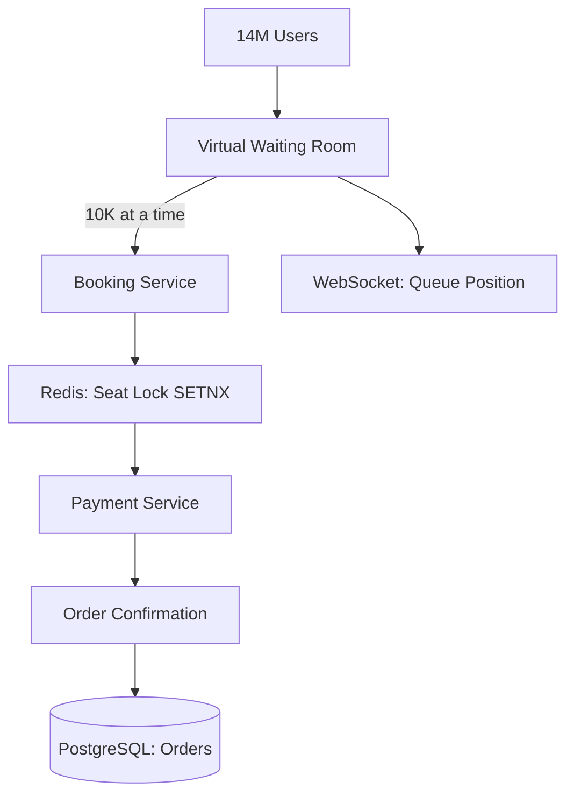

#system-design #case-study #advanced

# Design Ticketmaster (Event Ticket Booking)

## The Question
> "Design a ticket booking system for concerts and events like Ticketmaster."

---

## Why This Is Different from BookMyShow

- **Scale:** Taylor Swift Eras Tour: 14M people trying to buy tickets simultaneously
- **Inventory:** Fixed, non-fungible (specific seat in a specific venue)
- **Fairness:** Queue system to prevent bots from buying everything

## Core Design



### Virtual Waiting Room (The Key)
```
12:00:00 — Sale opens. 14M users hit the page.
12:00:00 — Each user assigned random queue position (fair lottery, NOT first-come)
12:00:01 — First 10,000 users admitted to browse/select seats
12:00:30 — Batch 2 (next 10,000) admitted as first batch completes
...
12:05:00 — Sold out. Remaining users notified.
```

**Why random, not FIFO?** FIFO rewards fastest internet/closest server. Random is fairer. This is how Ticketmaster actually works.

### Seat Locking
Same as [[design_flash_sale]] — Redis `SETNX` with 5-minute TTL. Seat locked while user pays. Released on timeout.

### Bot Prevention (Critical for Ticketmaster)
- Queue position assigned randomly (bots can't game first-come)
- CAPTCHA before entering queue
- Device fingerprinting + behavioral analysis
- IP rate limiting (max 2 connections per IP)
- Account purchase limits (max 4 tickets per account)
- Credit card matching (same card can't buy for different events in rapid succession)

## Interview Tip
> "The core challenge isn't the booking itself — it's the virtual waiting room handling 14M concurrent users. I'd use a serverless queue backed by Redis, admitting users in randomized batches. Only admitted users interact with the booking backend, keeping the load manageable."

## Links
- [[design_flash_sale]] — Similar concurrent purchase problem
- [[../10_hld/examples/hld_ticket_booking]] — BookMyShow/IRCTC HLD
- [[../02_building_blocks/rate_limiter]] — Bot prevention
