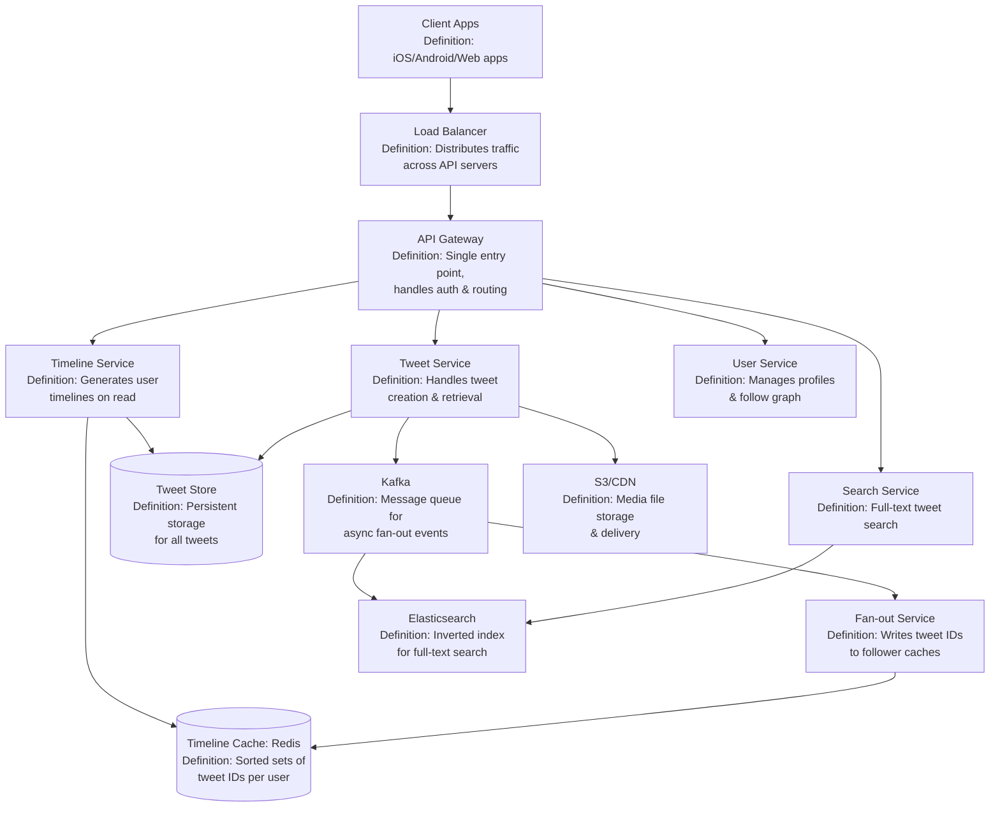
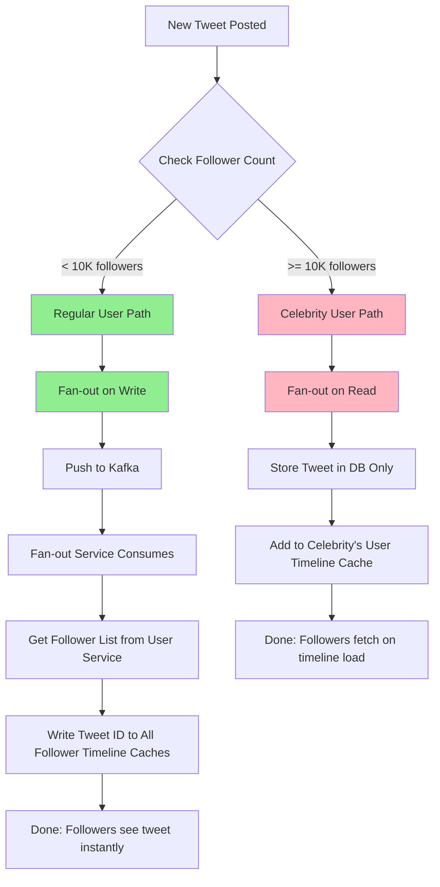
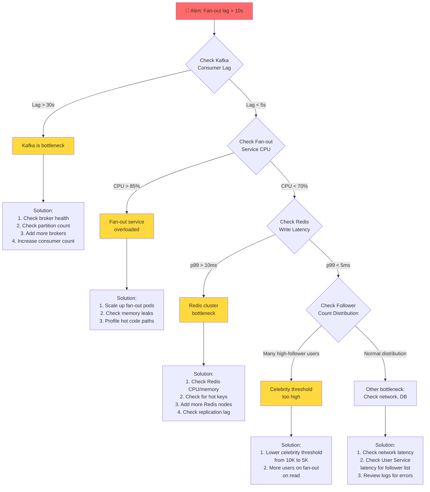
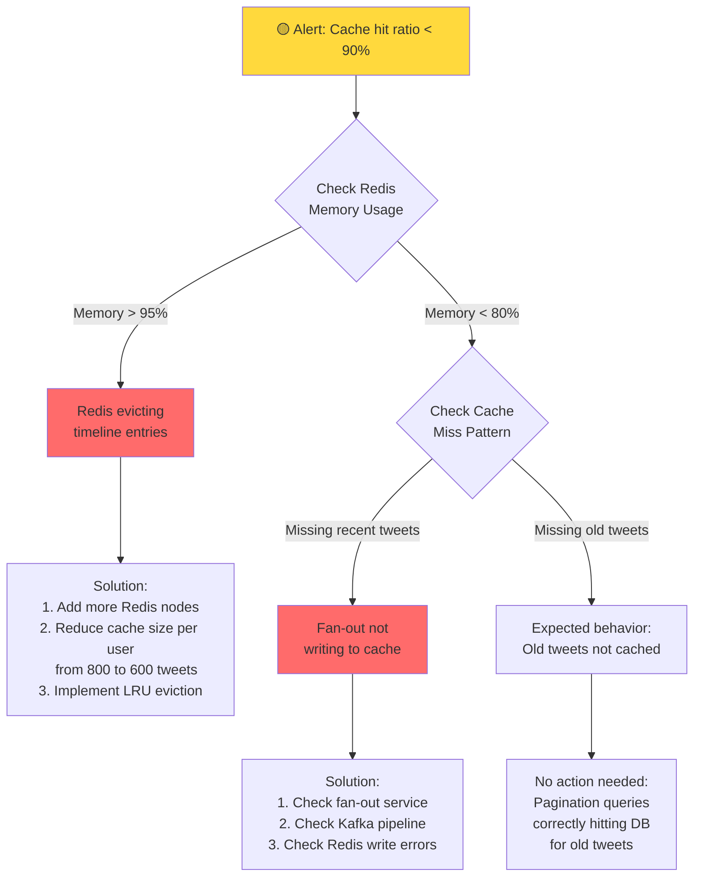
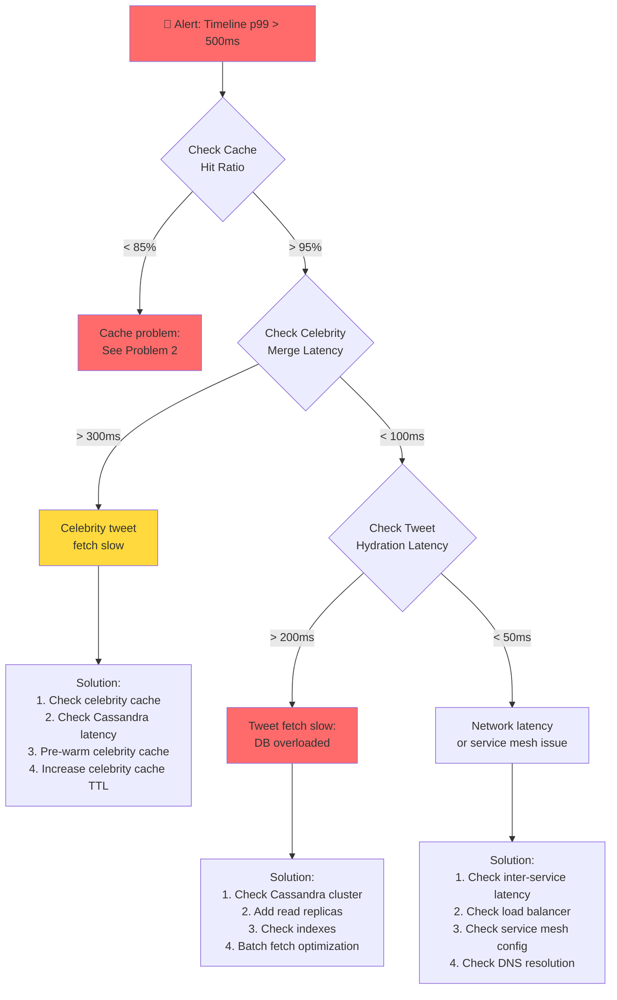
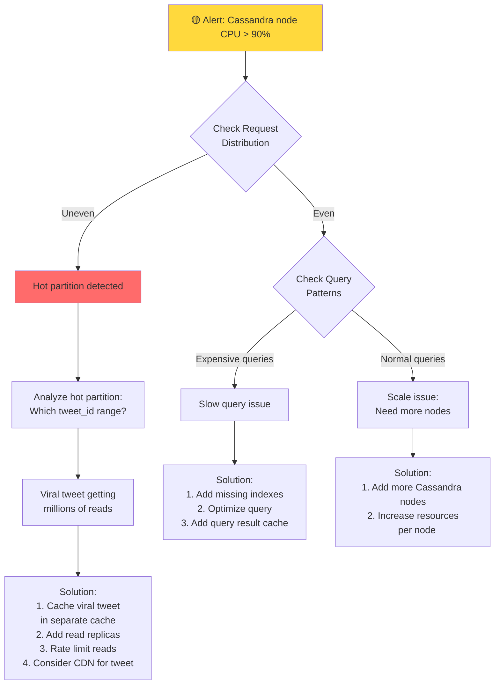

#system-design #case-study #intermediate

# Design Twitter / X Timeline

## Intuition (30 sec)

Think of Twitter's timeline like a high school cafeteria bulletin board. When someone posts a flyer (tweet), should we:
1. Run around and personally deliver a copy to every friend's locker (fan-out on write)?
2. Have each friend walk to the bulletin board and collect flyers from people they follow (fan-out on read)?
3. For popular kids with 1000+ friends, keep flyers on the board and let friends pick them up, but for regular students, deliver directly to lockers (hybrid)?

Twitter uses option 3. This is the core insight that makes Twitter's feed scale to billions of timeline views per day.

---

## Failure-First Scenario

**The Day Celebrity Tweets Crashed the Timeline:**

Year 2009, Twitter's early days. Oprah joins Twitter and tweets for the first time. Within minutes, 500,000 people follow her. She tweets again.

The system tries to deliver this tweet to 500,000 timeline caches. The fan-out service writes to Redis: write, write, write... 500,000 cache writes for ONE tweet. Meanwhile, 10 other celebrities tweet. That's 5 million cache writes in seconds.

Redis queue backs up. Timeline generation lags. User timelines show tweets from 5 minutes ago. The write amplification is killing the system. One celebrity tweet costs as much as 500,000 regular tweets.

**The lesson:** You can't treat all tweets equally. The fan-out strategy must adapt to follower count.

---

## The Question

> "Design a social media service like Twitter where users post tweets, follow other users, and see a personalized home timeline."

---

## Step 1: Requirements Clarification

### Functional Requirements

**Core Features:**
- Post tweets (text, 280 characters max, with images/videos)
- Follow/unfollow users
- Home timeline: see tweets from people you follow, sorted by time
- User timeline: see a specific user's tweets
- Search tweets by keywords/hashtags
- Trending topics

**Key Terms:**
- **Tweet:** A short message (up to 280 characters) posted by a user, optionally including media attachments
- **Timeline:** A chronologically ordered feed of tweets
  - **Home Timeline:** Tweets from users you follow
  - **User Timeline:** All tweets from a specific user
- **Follower Graph:** The social graph representing who follows whom (directed graph where edge A→B means "A follows B")
- **Follow:** A one-way relationship where User A subscribes to see User B's tweets

### Non-Functional Requirements

- **Timeline load latency:** < 200ms (p99)
- **Consistency:** Eventual consistency acceptable (a few seconds delay is fine for timeline updates)
- **Availability:** High availability required - timeline MUST load even if some services are down
- **Write volume:** High - millions of tweets per day
- **Read:Write ratio:** 100:1 (reading timelines is far more common than posting tweets)
- **Scale:** Support hundreds of millions of users

**Key Metrics Defined:**
- **p99 latency:** 99% of requests complete within this time (99th percentile)
- **Eventual consistency:** System state will become consistent eventually, but may be temporarily inconsistent
- **High availability:** System remains operational even with partial failures (typically 99.9%+ uptime)

---

## Step 2: Back-of-Envelope Estimation

### Capacity Planning with Detailed Calculations

**User Metrics:**

| Metric | Value | Calculation |
|--------|-------|-------------|
| Total users | 500M | Given assumption |
| Daily active users (DAU) | 200M | 40% of total users |
| Average follows per user | 200 | Median user following count |

**Write Load (Tweet Creation):**

| Metric | Value | Calculation |
|--------|-------|-------------|
| Tweets/day | 400M | 200M DAU × 2 tweets/day |
| Tweets/sec (average) | 4,630 | 400M ÷ 86,400 seconds |
| Tweets/sec (peak) | 13,900 | Average × 3 (peak factor) |
| Tweet size | 1 KB | 280 chars + metadata + IDs |
| Media attachment rate | 30% | 30% of tweets have media |
| Media storage/tweet | 200 KB | Average image/video size |

**Read Load (Timeline Views):**

| Metric | Value | Calculation |
|--------|-------|-------------|
| Timeline reads/day | 1 billion | 200M DAU × 5 refreshes/day |
| Timeline reads/sec (average) | 11,574 | 1B ÷ 86,400 seconds |
| Timeline reads/sec (peak) | 34,722 | Average × 3 |
| Tweets per timeline load | 20 | First page of timeline |

**Storage Calculations:**

```
Daily Tweet Storage:
= Tweets/day × Tweet size
= 400M × 1KB = 400GB/day = 146TB/year (just tweets)

Daily Media Storage:
= Tweets/day × Media rate × Media size
= 400M × 0.3 × 200KB = 24TB/day = 8.7PB/year

Total 5-year storage:
= (146TB + 8760TB) × 5 = 44.5PB
```

**Fan-out Calculations:**

```
Regular User (1,000 followers):
Write amplification = 1 tweet → 1,000 cache writes
Daily load = 380M regular tweets × 1,000 = 380B cache writes/day
Average = 4.4M cache writes/second

Celebrity (10M followers) with fan-out on write:
Write amplification = 1 tweet → 10M cache writes
If 1% of tweets are from celebrities:
= 4M celebrity tweets/day × 10M = 40 trillion cache writes/day
= 463M cache writes/second (UNSUSTAINABLE)

Conclusion: Must use hybrid approach for celebrities
```

**Memory Requirements (Timeline Cache):**

```
Cache Entry Size:
= Tweet ID (8 bytes) + Timestamp (8 bytes) = 16 bytes

Per-User Timeline Cache:
= 800 tweets × 16 bytes = 12.8KB per user

Total Cache Memory:
= 200M active users × 12.8KB = 2.56TB
With replication (3×): 7.68TB Redis memory
```

---

## Step 3: High-Level Design

### Core Components Defined



**Component Glossary:**

- **Load Balancer:** A reverse proxy that distributes incoming requests across multiple API servers for horizontal scaling
- **API Gateway:** Single entry point for all client requests, responsible for authentication, rate limiting, and routing to backend services
- **Tweet Service:** Microservice responsible for creating new tweets and retrieving tweet content by ID
- **Timeline Service:** Microservice that generates user timelines by merging cached timeline (fan-out on write) with celebrity tweets (fan-out on read)
- **Fan-out Service:** Asynchronous service that receives new tweet events and writes tweet IDs to all followers' timeline caches
- **Timeline Cache (Redis):** In-memory cache storing sorted sets of tweet IDs for each user's home timeline
- **Tweet Store:** Persistent database (Cassandra/DynamoDB) storing tweet content, sharded by tweet ID
- **Kafka:** Distributed message queue providing async communication between Tweet Service and Fan-out/Search services
- **Elasticsearch:** Search engine with inverted index for full-text search on tweet content and hashtags

---

## Step 4: Deep Dive

### The Fan-Out Problem (Core Challenge)

**Problem Definition:**

When User A posts a tweet, how do their followers see it in their home timelines? This is called the **fan-out problem** - one write must propagate to many reads.

**Key Terms:**

- **Fan-out:** The process of propagating one event (a new tweet) to multiple destinations (follower timelines)
- **Fan-out on Write (Push Model):** Tweet is written to all follower timeline caches immediately upon creation
- **Fan-out on Read (Pull Model):** Tweet is fetched from the author's timeline when followers load their home timeline
- **Write Amplification:** One write operation results in multiple write operations (e.g., 1 tweet → 1M cache writes)
- **Hot User/Celebrity:** A user with an exceptionally high follower count (typically > 10K followers)
- **Celebrity Threshold:** The follower count above which fan-out on write becomes inefficient (Twitter uses ~10K)

### Fan-Out Approaches Visualized

#### Approach 1: Fan-Out on Write (Push Model)

```
┌─────────────────────────────────────────────────────────┐
│ USER A (1,000 followers) POSTS TWEET                    │
└────────────────┬────────────────────────────────────────┘
                 │
                 ▼
        ┌────────────────┐
        │ Tweet Service  │
        │ Writes to DB   │
        └────────┬───────┘
                 │
                 ▼
        ┌────────────────┐
        │     Kafka      │
        │  (Async Queue) │
        └────────┬───────┘
                 │
                 ▼
        ┌────────────────┐
        │  Fan-out Svc   │  Reads follower list (1,000 users)
        │  (Consumer)    │
        └────────┬───────┘
                 │
                 ├──────────┬──────────┬──────────┬─────────┐
                 ▼          ▼          ▼          ▼         ▼
         ┌───────────┐ ┌────────┐ ┌────────┐ ┌────────┐ ...
         │ Timeline  │ │Timeline│ │Timeline│ │Timeline│ (1,000 writes)
         │ Cache     │ │ Cache  │ │ Cache  │ │ Cache  │
         │ User B    │ │User C  │ │User D  │ │User E  │
         └───────────┘ └────────┘ └────────┘ └────────┘

RESULT: Timeline read is FAST (pre-computed, just read from cache)
COST: Write amplification = 1,000 cache writes per tweet
```

**Pros:**
- Fast timeline reads (O(1) cache lookup)
- Simple timeline generation logic
- Consistent read latency

**Cons:**
- High write amplification for popular users
- Wasted work if follower never reads timeline
- Expensive for inactive users (writing to caches that are never read)

**Use When:** User has < 10K followers (low write amplification)

#### Approach 2: Fan-Out on Read (Pull Model)

```
┌─────────────────────────────────────────────────────────┐
│ USER B OPENS THEIR HOME TIMELINE                        │
└────────────────┬────────────────────────────────────────┘
                 │
                 ▼
        ┌────────────────┐
        │ Timeline Svc   │  User B follows 200 users
        │                │
        └────────┬───────┘
                 │
                 ├──────┬──────┬──────┬──────┬──────┐
                 ▼      ▼      ▼      ▼      ▼      ▼
         ┌────────┐ ┌────┐ ┌────┐ ┌────┐ ┌────┐ ...
         │User A  │ │User│ │User│ │User│ │User│ (200 queries)
         │Timeline│ │ C  │ │ D  │ │ E  │ │ F  │
         │in DB   │ │    │ │    │ │    │ │    │
         └───┬────┘ └──┬─┘ └──┬─┘ └──┬─┘ └──┬─┘
             │         │      │      │      │
             └─────────┴──────┴──────┴──────┴────────┐
                                                      ▼
                                            ┌──────────────────┐
                                            │  Merge & Sort    │
                                            │  by timestamp    │
                                            │  (in memory)     │
                                            └─────────┬────────┘
                                                      ▼
                                            ┌──────────────────┐
                                            │  Return top 20   │
                                            │  tweets to User B│
                                            └──────────────────┘

RESULT: No write amplification (zero fan-out cost)
COST: Timeline read is SLOW (query 200 users + merge sort)
```

**Pros:**
- No write amplification
- No wasted work (only compute when needed)
- Scales well for users with many followers

**Cons:**
- Slow timeline reads (many DB queries + merge)
- Complex read logic
- Higher read latency (200-500ms+)

**Use When:** User has > 10K followers (celebrity)

#### Approach 3: Hybrid (Twitter's Solution)

```
┌──────────────────────────────────────────────────────────────┐
│ HYBRID FAN-OUT: Split by follower count                     │
└──────────────────────────────────────────────────────────────┘

Regular User Posts (< 10K followers):
────────────────────────────────────────
Alice (1,000 followers) → Fan-out on WRITE
Tweet written to 1,000 follower caches immediately


Celebrity Posts (> 10K followers):
───────────────────────────────────
Elon (100M followers) → Fan-out on READ
Tweet stored in DB only, fetched when followers load timeline


USER B OPENS TIMELINE (follows 5 celebs + 195 regular users):
═══════════════════════════════════════════════════════════════

Step 1: Load Pre-Computed Timeline (Fan-out on Write Results)
┌─────────────────────┐
│ Timeline Cache      │  FAST: O(1) cache lookup
│ (Redis Sorted Set)  │  Contains: Tweets from 195 regular users
│                     │
│ User B's Timeline:  │
│ - tweet_123 (Alice) │
│ - tweet_124 (Bob)   │
│ - tweet_125 (Carol) │
│ ...                 │
└─────────────────────┘

Step 2: Fetch Celebrity Tweets (Fan-out on Read)
┌────────────┬────────────┬────────────┬────────────┬────────────┐
│ Elon       │ Taylor     │ Cristiano  │ Selena     │ Biden      │
│ Latest 20  │ Latest 20  │ Latest 20  │ Latest 20  │ Latest 20  │
└────────────┴────────────┴────────────┴────────────┴────────────┘
MODERATE COST: 5 DB queries (celebrity tweets cached separately)

Step 3: Merge Both Sources
┌─────────────────────────────────────────┐
│  In-Memory Merge Sort                   │
│  - Pre-computed tweets (195 users)      │
│  - Celebrity tweets (5 users)           │
│  Sort by timestamp                      │
└─────────────┬───────────────────────────┘
              ▼
      ┌───────────────┐
      │  Return top   │
      │  20 tweets    │
      └───────────────┘

RESULT: Fast timeline reads (< 200ms) with manageable write load
```

**Decision Tree for Fan-Out Strategy:**



**Hybrid Approach Metrics:**

| Metric | Value | Reasoning |
|--------|-------|-----------|
| Celebrity threshold | 10K followers | Balance between write cost and read complexity |
| % of tweets from celebrities | ~1% | Small % of users, but high visibility |
| Write amplification (avg) | ~200 | Average follower count for regular users |
| Timeline read latency | < 200ms | Pre-computed cache + 5-10 celebrity fetches |
| Cache writes/sec | 4.4M | 4,630 tweets/sec × 200 followers (manageable) |

### Timeline Cache Design (Redis)

**Cache Structure:**

```
Key: timeline:{user_id}
Type: Sorted Set (ZSET)
Score: Tweet timestamp (used for sorting)
Value: Tweet ID

Example:
timeline:user_12345
├─ Score: 1707856800  Value: tweet_98765432  (most recent)
├─ Score: 1707856750  Value: tweet_98765431
├─ Score: 1707856700  Value: tweet_98765430
├─ Score: 1707856650  Value: tweet_98765429
└─ ... (up to 800 entries)

Redis Commands:
──────────────

Add tweet to timeline:
ZADD timeline:user_12345 1707856800 tweet_98765432

Get latest 20 tweets:
ZREVRANGE timeline:user_12345 0 19 WITHSCORES

Get tweets in time range:
ZREVRANGEBYSCORE timeline:user_12345 1707856800 1707800000 LIMIT 0 20

Remove old tweets (keep last 800):
ZREMRANGEBYRANK timeline:user_12345 0 -801
```

**Why Sorted Sets?**

- **Definition:** Sorted Set (ZSET) is a Redis data structure that maintains unique elements sorted by a score
- **Automatic sorting:** Tweets stay sorted by timestamp without manual sorting
- **O(log N) insertion:** Efficient even with 800 tweets per timeline
- **Range queries:** Can fetch "tweets between time T1 and T2" efficiently
- **Memory efficient:** Stores only tweet IDs (8 bytes) + scores (8 bytes) = 16 bytes per tweet

**Cache Capacity:**

```
Per-User Timeline Size:
= 800 tweets × 16 bytes = 12.8 KB

Total Cache Size (200M active users):
= 200M × 12.8 KB = 2.56 TB

With 3x replication:
= 2.56 TB × 3 = 7.68 TB Redis memory

Redis Cluster Configuration:
= 7.68 TB ÷ 64 GB per node = 120 nodes
With sharding by user_id (hash-based)
```

**Cache Eviction Policy:**

```
Timeline Size Limit: 800 tweets per user
Reason: Balance between memory usage and timeline depth

Eviction Strategy:
1. Keep last 800 tweets only
2. Older tweets still in DB, fetched on pagination
3. Automatic cleanup via ZREMRANGEBYRANK

Cache TTL: None (timeline is active data)
Invalidation: Only on unfollow (remove user's tweets from follower timeline)
```

### Tweet Storage Schema

**Tweet Table (Cassandra/DynamoDB):**

```sql
Table: tweets
Partition Key: tweet_id (Snowflake ID)
Sort Key: none

Columns:
┌─────────────────┬──────────────┬─────────────────────────────────────┐
│ Column          │ Type         │ Description                         │
├─────────────────┼──────────────┼─────────────────────────────────────┤
│ tweet_id (PK)   │ bigint       │ Snowflake ID (64-bit, time-sorted)  │
│ user_id         │ bigint       │ Author's user ID                    │
│ text            │ varchar(280) │ Tweet content                       │
│ media_urls      │ list<text>   │ S3 URLs for images/videos           │
│ created_at      │ timestamp    │ Creation timestamp                  │
│ reply_to        │ bigint       │ Parent tweet ID (null if not reply) │
│ retweet_of      │ bigint       │ Original tweet ID (null if not RT)  │
│ like_count      │ int          │ Denormalized like count             │
│ retweet_count   │ int          │ Denormalized retweet count          │
│ reply_count     │ int          │ Denormalized reply count            │
└─────────────────┴──────────────┴─────────────────────────────────────┘

Example Row:
tweet_id:      1234567890123456789
user_id:       987654321
text:          "Just shipped a new feature!"
media_urls:    ["s3://twitter-media/abc123.jpg"]
created_at:    2026-02-14 10:30:00 UTC
reply_to:      null
retweet_of:    null
like_count:    42
retweet_count: 7
reply_count:   3
```

**Snowflake ID Deep Dive:**

```
Snowflake ID Structure (64 bits):
═══════════════════════════════════════════════════════════════

├─────────────────────────┬──────────────┬──────────────────┐
│   Timestamp (41 bits)   │ Machine ID   │  Sequence (12)   │
│                         │   (10 bits)  │                  │
├─────────────────────────┼──────────────┼──────────────────┤
│ Milliseconds since      │ Data center  │ Counter for IDs  │
│ custom epoch            │ + machine ID │ within same ms   │
│ (2^41 ms = 69 years)    │ (1024 machines)│ (4096 IDs/ms)  │
└─────────────────────────┴──────────────┴──────────────────┘

Example Breakdown:
──────────────────
Tweet ID: 1234567890123456789 (decimal)

In binary: 0001000100100000100100100010101000100000000000000101
           ├─────────────┬─────┬─────┘
           │ Timestamp   │ DC  │ Seq

Timestamp bits: Milliseconds since epoch → sortable by time
Machine bits:   Which server generated this ID → no collisions
Sequence bits:  Counter reset every millisecond → 4096 IDs/ms/machine

Benefits:
✓ Time-sortable: IDs naturally ordered by creation time
✓ No coordination: Each machine generates IDs independently
✓ Globally unique: Timestamp + Machine + Sequence = unique
✓ Scalable: 4096 IDs per millisecond per machine = 4M IDs/sec per machine
✓ Embeds metadata: Can extract creation time from ID
```

**Why Snowflake IDs?**

- **Definition:** Snowflake ID is a 64-bit identifier that encodes timestamp, machine ID, and sequence number
- **Invented by Twitter:** Specifically designed for distributed tweet ID generation
- **Time-sortable:** IDs are naturally sorted by creation time without needing a created_at index
- **No coordination:** Each server generates IDs independently (no central ID service bottleneck)
- **Globally unique:** Timestamp + Machine ID + Sequence guarantees uniqueness across all servers

**User Timeline Table:**

```sql
Table: user_timeline
Partition Key: user_id
Sort Key: tweet_id (descending)

Purpose: Fetch all tweets from a specific user
Optimized for: "Show me @elonmusk's latest tweets"

Denormalized: Tweet content duplicated here for fast user timeline queries
```

**Sharding Strategy:**

```
Tweets Table Sharding:
Shard Key: tweet_id (hash-based)
Reason: Uniform distribution, no hot shards
Shard Count: 100 shards initially

Shard Selection:
shard_id = hash(tweet_id) % 100

Example:
tweet_id = 1234567890123456789
shard_id = hash(1234567890123456789) % 100 = 47
Store in shard_047

Advantages:
✓ Uniform distribution (hash prevents hotspots)
✓ Scales horizontally (add more shards)
✓ No resharding needed (consistent hashing)
```

### Media Storage (S3 + CDN)

**Media Upload Flow:**

```
┌───────────┐
│  Client   │  User uploads image with tweet
└─────┬─────┘
      │
      │ 1. Request signed URL for upload
      ▼
┌─────────────┐
│ Tweet Svc   │  Generate S3 signed URL (valid for 5 min)
└─────┬───────┘
      │
      │ 2. Return signed URL
      ▼
┌───────────┐
│  Client   │  Upload image directly to S3 (no backend bottleneck)
└─────┬─────┘
      │
      │ 3. Upload to signed URL
      ▼
┌─────────────┐
│  S3 Bucket  │  Store original image
│ (Regional)  │  Key: media/{user_id}/{uuid}.jpg
└─────┬───────┘
      │
      │ 4. Lambda trigger on S3 upload
      ▼
┌──────────────┐
│ Image Proc   │  Generate thumbnails, compress, format conversion
│ (Lambda)     │  Sizes: 150x150, 600x600, 1200x1200
└─────┬────────┘
      │
      │ 5. Store thumbnails
      ▼
┌─────────────┐
│  S3 Bucket  │  Store processed images
│ (Regional)  │
└─────┬───────┘
      │
      │ 6. Replicate to CDN
      ▼
┌─────────────┐
│  CloudFront │  Distribute globally
│     CDN     │  Cache at edge locations
└─────────────┘
```

**Media Storage Design:**

- **Original storage:** S3 standard (regional)
- **Processed storage:** S3 + CloudFront CDN (global edge caching)
- **Naming convention:** `media/{user_id}/{yyyy-mm-dd}/{uuid}.{ext}`
- **Access pattern:** 99% reads, 1% writes (perfect for CDN)
- **CDN cache TTL:** 1 year (images never change)

### Search System (Elasticsearch)

**Tweet Indexing:**

```json
Elasticsearch Index: tweets
Document Structure:
{
  "tweet_id": 1234567890123456789,
  "user_id": 987654321,
  "username": "alice",
  "text": "Just deployed the new search feature! #elasticsearch #devops",
  "hashtags": ["elasticsearch", "devops"],
  "mentions": ["bob", "charlie"],
  "created_at": "2026-02-14T10:30:00Z",
  "language": "en",
  "has_media": true,
  "like_count": 42,
  "retweet_count": 7
}

Index Settings:
{
  "number_of_shards": 50,
  "number_of_replicas": 2,
  "refresh_interval": "1s"  // Near real-time indexing
}

Analyzers:
- Standard analyzer for general text
- Hashtag analyzer (lowercase, no tokenization)
- Username analyzer (lowercase, no tokenization)
```

**Indexing Pipeline:**

```
Tweet Created → Kafka (tweet.created event) → ES Consumer → Elasticsearch

Latency: 1-2 seconds from tweet creation to searchable
Throughput: 4,630 tweets/sec = 4,630 ES index operations/sec
```

**Search Queries:**

```
Full-text search:
GET /tweets/_search
{
  "query": {
    "multi_match": {
      "query": "machine learning",
      "fields": ["text^2", "hashtags", "username"]
    }
  },
  "sort": [{"created_at": "desc"}],
  "size": 20
}

Hashtag search:
GET /tweets/_search
{
  "query": {
    "term": {"hashtags": "machinelearning"}
  },
  "sort": [{"created_at": "desc"}]
}
```

### Trending Topics System

**Architecture:**

```
Tweet Stream → Kafka → Stream Processor (Flink) → Trending Topics Cache → API

Stream Processing Logic:
1. Extract hashtags and keywords from tweets
2. Count occurrences in sliding windows (1 hour, 6 hours, 24 hours)
3. Calculate velocity (rate of increase)
4. Rank by velocity, not just total count
5. Filter by geography (trends per region)
```

**Trending Algorithm:**

```
Trend Score = (Current Hour Count) / (Previous Hour Count) × log(Total Count)

Why this formula?
- Velocity-based: Rewards rapid growth (viral topics)
- Log scaling: Prevents mega-trends from dominating
- Recency: 1-hour window captures breaking news

Example:
Hashtag #earthquake
- Previous hour: 100 tweets
- Current hour: 10,000 tweets
- Velocity: 10,000 / 100 = 100x
- Total: 10,100 tweets
- Score: 100 × log(10,100) = 100 × 4 = 400

Hashtag #goodmorning
- Previous hour: 50,000 tweets
- Current hour: 51,000 tweets
- Velocity: 51,000 / 50,000 = 1.02x
- Total: 101,000 tweets
- Score: 1.02 × log(101,000) = 1.02 × 5 = 5.1

Result: #earthquake trends higher despite fewer total tweets
```

---

## Step 5: Production Architecture (Fully Annotated)

```
                           INTERNET
                              │
                              ▼
                 ┌────────────────────────┐
                 │   Global DNS (Route53) │
                 │                        │
                 │ Definition: Routes      │
                 │ users to nearest region│
                 └───────────┬────────────┘
                             │
              ┌──────────────┼──────────────┐
              │              │              │
         ┌────▼────┐    ┌───▼────┐    ┌───▼────┐
         │ US-East │    │US-West │    │  EU    │
         │ Region  │    │ Region │    │ Region │
         └────┬────┘    └────────┘    └────────┘
              │
              │ (Focus on one region)
              ▼
    ┌──────────────────────┐
    │   Load Balancer      │  Application Load Balancer (ALB)
    │   (ALB)              │  Routes to healthy API servers
    │                      │  SSL termination
    │ Health checks: /ping │  Connection draining
    └──────────┬───────────┘
               │
               │ Round-robin + least connections
               ▼
    ┌──────────────────────────────────────────┐
    │         API Gateway Layer                │
    │  (Kong/Apigee)                           │
    │                                          │
    │  Responsibilities:                       │
    │  • Authentication (JWT validation)       │
    │  • Rate limiting (300 req/min per user)  │
    │  • Request routing                       │
    │  • API versioning (v1, v2)               │
    └─────┬──────────┬──────────┬──────────────┘
          │          │          │
   ┌──────▼──┐  ┌───▼────┐ ┌──▼─────┐
   │ Tweet   │  │Timeline│ │  User  │
   │ Service │  │Service │ │ Service│
   │         │  │        │ │        │
   │ 50 pods │  │30 pods │ │20 pods │
   └────┬────┘  └───┬────┘ └───┬────┘
        │           │          │
        │           │          │
   ┌────▼───────────▼──────────▼───────┐
   │      Service Mesh (Istio)         │
   │                                   │
   │  • Service discovery              │
   │  • Load balancing (L7)            │
   │  • Circuit breaking               │
   │  • Mutual TLS                     │
   │  • Distributed tracing            │
   └───────────────┬───────────────────┘
                   │
        ┌──────────┼─────────────┐
        │          │             │
   ┌────▼────┐ ┌──▼──────┐ ┌───▼─────────┐
   │ Tweet   │ │Timeline │ │   Kafka     │
   │ Store   │ │ Cache   │ │   Cluster   │
   │         │ │(Redis)  │ │             │
   │Cassandra│ │         │ │ 20 brokers  │
   │100 nodes│ │120 nodes│ │ 3x replica  │
   │         │ │         │ │             │
   │Repl: 3x │ │Repl: 3x │ │ 100 topics  │
   └─────────┘ └─────────┘ └──────┬──────┘
                                  │
                      ┌───────────┼────────────┐
                      │           │            │
                 ┌────▼─────┐ ┌──▼──────┐ ┌──▼──────┐
                 │Fan-out   │ │  Search │ │Analytics│
                 │Service   │ │ Indexer │ │Consumer │
                 │          │ │         │ │         │
                 │20 pods   │ │10 pods  │ │5 pods   │
                 └────┬─────┘ └────┬────┘ └─────────┘
                      │            │
                      │            │
                 ┌────▼────┐  ┌───▼────────┐
                 │Timeline │  │Elasticsearch│
                 │ Cache   │  │             │
                 │(Redis)  │  │  50 nodes   │
                 └─────────┘  │  2x replica │
                              └─────────────┘
```

**Component Annotations:**

- **API Gateway (Kong):** Centralized entry point, handles cross-cutting concerns (auth, rate limiting, logging)
- **Service Mesh (Istio):** Manages service-to-service communication, provides observability and security
- **Cassandra:** Wide-column NoSQL database, optimized for high write throughput and linear scalability
- **Redis Cluster:** In-memory data store, used for timeline caching with automatic sharding by user_id
- **Kafka:** Distributed event streaming platform, decouples tweet creation from fan-out and indexing
- **Circuit Breaker:** Prevents cascading failures by failing fast when downstream service is unhealthy

---

## Step 6: Scaling Strategies

### Horizontal Scaling Breakdown

**API Layer Scaling:**

```
Current: 50 Tweet Service pods
Scale trigger: CPU > 70% for 5 min
Scale action: Add 10 more pods
Max: 200 pods

Autoscaling config:
- Min replicas: 20
- Max replicas: 200
- Target CPU: 70%
- Target Memory: 80%
- Scale up: Add 20% more pods
- Scale down: Remove 10% of pods (gradual)
```

**Database Scaling:**

```
Cassandra Cluster:
────────────────
Sharding: Hash-based on tweet_id
Replication: 3x (RF=3)
Consistency: Quorum (W=2, R=2)

Current: 100 nodes
Per-node capacity: 1TB SSD
Total capacity: 100TB (raw), 33TB (effective with 3x replication)

Scale trigger: Disk > 70% or Latency > 10ms (p99)
Scale action: Add 20 more nodes, rebalance data

Rebalancing:
- Cassandra automatically redistributes data
- No downtime during rebalancing
- Gradual process over hours
```

**Redis Cluster Scaling:**

```
Current: 120 nodes (64GB each)
Sharding: Hash slot-based (16,384 slots)
Replication: 3x (1 master + 2 replicas per shard)

Effective shards: 40 (120 nodes ÷ 3 replicas)
Per-shard capacity: 64GB
Total capacity: 2.56TB (timeline cache)

Adding capacity:
1. Add new master-replica set (3 nodes)
2. Rebalance hash slots
3. Migrate keys to new shard
4. Done (zero downtime)
```

**Kafka Scaling:**

```
Current: 20 brokers
Topics: 100 (tweet.created, user.followed, etc.)
Partitions per topic: 50
Replication: 3x

Write throughput per broker: 100MB/s
Total write throughput: 2GB/s (20 brokers)
Current load: 400MB/s (20% capacity)

Scale trigger: Throughput > 70% or Lag > 10 sec
Scale action: Add 5 more brokers, rebalance partitions
```

### Celebrity Handling

**Celebrity Detection:**

```
Definition: User with > 10K followers

Detection mechanism:
1. User Service maintains follower count
2. When follower count crosses threshold (10K):
   - Set user.is_celebrity = true
   - Switch fan-out strategy to read-based
3. Periodic batch job verifies celebrity status (daily)

Celebrity tiers:
- Tier 1: 10K - 100K followers → Fan-out on read
- Tier 2: 100K - 1M followers → Fan-out on read + Separate cache
- Tier 3: 1M+ followers → Fan-out on read + Pre-computed aggregations
```

**Celebrity Tweet Cache:**

```
Separate Redis cache for celebrity tweets:
Key: celebrity_timeline:{user_id}
TTL: 5 minutes (shorter TTL, high churn)

When follower loads timeline:
1. Load regular timeline from main cache (fan-out on write)
2. Load celebrity tweets from celebrity cache (fan-out on read)
3. Merge in memory, sort by timestamp
4. Return top 20

Celebrity cache miss handling:
- Fetch from Cassandra user_timeline table
- Cache for 5 minutes
- Return to user
```

### Multi-Region Deployment

**Global Architecture:**

```
Region: US-East (Primary)
- Full read/write capability
- Master for global data (user profiles, follows)

Region: US-West (Secondary)
- Full read/write capability
- Async replication from US-East

Region: EU (Secondary)
- Full read/write capability
- Async replication from US-East

Region: Asia (Secondary)
- Full read/write capability
- Async replication from US-East

Data Replication:
──────────────
Tweets: Replicated across all regions (async, <1 sec lag)
Timelines: Region-local (not replicated, generated locally)
User data: Globally replicated (eventual consistency)
```

**Conflict Resolution:**

```
Scenario: User posts from US-East, then immediately views timeline from EU

Problem: Tweet not yet replicated to EU region

Solution:
1. Timeline Service checks local region first
2. If tweet not found, fetch from origin region (US-East)
3. Cache locally for future reads
4. Wait for replication to complete (1-2 seconds)

Trade-off: Slight latency increase for cross-region reads vs. data consistency
```

---

## Step 7: Monitoring & Observability

### Monitoring Dashboard

```
┌─────────────────────────────────────────────────────────────┐
│  TWITTER TIMELINE MONITORING DASHBOARD                      │
├─────────────────────────────────────────────────────────────┤
│                                                             │
│  CRITICAL METRICS                                           │
│  ════════════════                                           │
│                                                             │
│  Timeline Load Latency (p99):  ████████░░ 145ms            │
│  Definition: 99% of timeline requests complete within       │
│              this time                                      │
│  Target: < 200ms                                            │
│  Alert: > 300ms                                             │
│                                                             │
│  Fan-out Lag:  ██░░░░░░░░ 1.2 sec                          │
│  Definition: Time from tweet creation to appearing in       │
│              follower timeline cache                        │
│  Target: < 3 seconds                                        │
│  Alert: > 10 seconds                                        │
│                                                             │
│  Timeline Cache Hit Ratio:  ████████████ 97.5%             │
│  Definition: Percentage of timeline requests served from    │
│              cache (vs. DB)                                 │
│  Target: > 95%                                              │
│  Alert: < 90%                                               │
│                                                             │
│  Tweet Write Throughput:  4,630 tweets/sec                 │
│  Definition: Number of tweets created per second            │
│  Capacity: 15,000 tweets/sec                                │
│  Alert: > 12,000 tweets/sec (80% capacity)                  │
│                                                             │
│  ─────────────────────────────────────────────────────────  │
│                                                             │
│  SERVICE HEALTH                                             │
│  ══════════════                                             │
│                                                             │
│  ┌─────────────┐  ┌─────────────┐  ┌─────────────┐        │
│  │ Tweet Svc   │  │ Timeline Svc│  │ Fanout Svc  │        │
│  │   🟢 UP     │  │   🟢 UP     │  │   🟢 UP     │        │
│  │ 45/50 pods  │  │ 28/30 pods  │  │ 18/20 pods  │        │
│  │ CPU: 65%    │  │ CPU: 72%    │  │ CPU: 58%    │        │
│  │ Mem: 70%    │  │ Mem: 68%    │  │ Mem: 65%    │        │
│  │ P99: 50ms   │  │ P99: 145ms  │  │ Lag: 1.2s   │        │
│  └─────────────┘  └─────────────┘  └─────────────┘        │
│                                                             │
│  ─────────────────────────────────────────────────────────  │
│                                                             │
│  INFRASTRUCTURE                                             │
│  ═══════════════                                            │
│                                                             │
│  Redis Cluster:  🟢 UP - 120/120 nodes                     │
│  • Memory usage: 1.8TB / 7.68TB (23%)                      │
│  • Ops/sec: 45,000                                          │
│  • Hit ratio: 97.5%                                         │
│  • Replication lag: 12ms                                    │
│                                                             │
│  Cassandra Cluster:  🟢 UP - 100/100 nodes                 │
│  • Disk usage: 22TB / 100TB (22%)                          │
│  • Write latency (p99): 8ms                                 │
│  • Read latency (p99): 12ms                                 │
│  • Pending compactions: 3                                   │
│                                                             │
│  Kafka Cluster:  🟢 UP - 20/20 brokers                     │
│  • Messages/sec: 15,000                                     │
│  • Consumer lag: 1.2 sec (fanout-consumer-group)           │
│  • Disk usage: 800GB / 20TB (4%)                           │
│  • Under-replicated partitions: 0                           │
│                                                             │
│  ─────────────────────────────────────────────────────────  │
│                                                             │
│  ALERTS (Last 24h)                                          │
│  ═══════════════════                                        │
│                                                             │
│  🔴 CRITICAL: 0                                             │
│  🟡 WARNING:  3                                             │
│     • Timeline cache hit ratio dropped to 92% (10:30 UTC)  │
│     • Fanout lag increased to 8s (14:15 UTC)               │
│     • Redis node redis-47 CPU at 95% (18:22 UTC)           │
│  🟢 INFO:     12                                            │
│                                                             │
└─────────────────────────────────────────────────────────────┘
```

**Metric Definitions:**

- **Timeline Load Latency:** Time from API request to response, including cache lookup, tweet hydration, and celebrity merge
- **Fan-out Lag:** Time between tweet creation and completion of fan-out writes to all followers' caches
- **Cache Hit Ratio:** Percentage of timeline requests fully served from Redis cache without Cassandra queries
- **Write Throughput:** Number of tweets successfully created and persisted per second
- **Consumer Lag:** Number of seconds behind Kafka consumers are from the latest message
- **Replication Lag:** Time delay between write to master and replication to replicas

### Key Metrics & Alerts

```
┌──────────────────────────────────────────────────────────────┐
│ METRIC                  │ TARGET    │ WARNING   │ CRITICAL   │
├─────────────────────────┼───────────┼───────────┼────────────┤
│ Timeline p99 latency    │ < 200ms   │ > 300ms   │ > 500ms    │
│ Fan-out lag             │ < 3s      │ > 10s     │ > 30s      │
│ Cache hit ratio         │ > 95%     │ < 90%     │ < 85%      │
│ Tweet write success     │ > 99.9%   │ < 99.5%   │ < 99%      │
│ API error rate          │ < 0.1%    │ > 1%      │ > 5%       │
│ Kafka consumer lag      │ < 5s      │ > 30s     │ > 60s      │
│ Redis memory usage      │ < 70%     │ > 85%     │ > 95%      │
│ Cassandra disk usage    │ < 70%     │ > 85%     │ > 95%      │
│ Service CPU usage       │ < 70%     │ > 85%     │ > 95%      │
│ Celebrity tweet latency │ < 100ms   │ > 200ms   │ > 500ms    │
└─────────────────────────┴───────────┴───────────┴────────────┘
```

**Alert Actions:**

```
Timeline p99 latency > 500ms (CRITICAL):
1. Page on-call engineer
2. Check cache hit ratio (if low, investigate cache)
3. Check celebrity merge latency (if high, investigate DB)
4. Check service CPU/memory (if high, scale up)
5. Enable degraded mode: Serve stale cache if fresh data unavailable

Fan-out lag > 30s (CRITICAL):
1. Page on-call engineer
2. Check Kafka consumer lag
3. Check Redis write latency
4. Check fan-out service CPU/memory
5. Scale up fan-out service pods
6. Consider pausing fan-out for low-priority users

Cache hit ratio < 85% (CRITICAL):
1. Check cache memory usage (if high, eviction happening)
2. Check cache TTL settings
3. Check Redis cluster health
4. Scale up Redis cluster
5. Temporarily increase cache size limit per user
```

### Distributed Tracing

```
Trace Example: Timeline Load Request

Trace ID: abc-123-def-456
Duration: 147ms

Span 1: API Gateway (3ms)
├─ Operation: route_request
└─ Result: Routed to Timeline Service

Span 2: Timeline Service - Load Cache (45ms)
├─ Operation: redis_get
├─ Key: timeline:user_12345
├─ Result: Cache HIT (800 tweet IDs)
└─ Cache hit ratio: 97.5%

Span 3: Timeline Service - Fetch Celebrity Tweets (68ms)
├─ Operation: fetch_celebrity_tweets
├─ Celebrities followed: 5
│   ├─ Celebrity 1 (elon): 12ms (cache hit)
│   ├─ Celebrity 2 (taylor): 15ms (cache hit)
│   ├─ Celebrity 3 (cristiano): 50ms (cache MISS, DB query)
│   ├─ Celebrity 4 (selena): 10ms (cache hit)
│   └─ Celebrity 5 (biden): 11ms (cache hit)
└─ Bottleneck: Celebrity 3 cache miss

Span 4: Cassandra Query (48ms)
├─ Operation: select_user_timeline
├─ User: cristiano
├─ Query: SELECT * FROM user_timeline WHERE user_id = ? LIMIT 20
└─ Result: 20 tweets

Span 5: Timeline Service - Merge & Sort (18ms)
├─ Operation: merge_timelines
├─ Cached tweets: 800
├─ Celebrity tweets: 100
├─ Merged total: 900
├─ Sorted by timestamp
└─ Returned top: 20

Span 6: Tweet Service - Hydrate Tweets (13ms)
├─ Operation: batch_fetch_tweets
├─ Tweet IDs: 20
├─ Batch size: 20
└─ Result: 20 full tweet objects

Total: 147ms (within 200ms target)
Bottleneck: Celebrity 3 cache miss (50ms)
Action: Investigate why celebrity timeline cache missed
```

---

## Step 8: Troubleshooting Guide

### Problem 1: Fan-out Lag Increasing



**Detailed Troubleshooting Steps:**

```
PROBLEM: Fan-out lag increasing from 1s to 15s

Step 1: Identify the bottleneck
──────────────────────────────
$ kubectl top pods -n twitter | grep fanout
fanout-service-1  950m  2048Mi  (95% CPU, 80% memory)
fanout-service-2  920m  2024Mi  (92% CPU, 79% memory)
...

Diagnosis: Fan-out service CPU at 95% → Overloaded

Step 2: Check consumer lag
──────────────────────────
$ kafka-consumer-groups --bootstrap-server kafka:9092 --describe --group fanout-consumer

GROUP           TOPIC           LAG
fanout-consumer tweet.created   125000  ← Lagging 125K messages

Diagnosis: Consumers can't keep up with tweet rate

Step 3: Scale up fan-out service
────────────────────────────────
$ kubectl scale deployment fanout-service --replicas=30
deployment.apps/fanout-service scaled (was 20, now 30)

Result: CPU drops to 65%, lag starts decreasing

Step 4: Monitor improvement
───────────────────────────
Wait 5 minutes, check lag again:
$ kafka-consumer-groups --bootstrap-server kafka:9092 --describe --group fanout-consumer

GROUP           TOPIC           LAG
fanout-consumer tweet.created   5000  ← Improved! Down to 5K

Wait 10 more minutes:
LAG: 0  ← Caught up!

Step 5: Set autoscaling to prevent recurrence
─────────────────────────────────────────────
$ kubectl autoscale deployment fanout-service --min=20 --max=50 --cpu-percent=70
```

### Problem 2: Timeline Cache Hit Ratio Drops



**Detailed Troubleshooting Steps:**

```
PROBLEM: Cache hit ratio dropped from 97% to 88%

Step 1: Check Redis memory
──────────────────────────
$ redis-cli info memory | grep used_memory_human
used_memory_human:7.2TB

$ redis-cli info memory | grep maxmemory_human
maxmemory_human:7.68TB

Diagnosis: Memory usage at 94% → Near capacity, evictions starting

Step 2: Check eviction stats
────────────────────────────
$ redis-cli info stats | grep evicted
evicted_keys:1250000

Diagnosis: 1.25M timeline entries evicted in last hour

Step 3: Check which timelines are being evicted
──────────────────────────────────────────────
$ redis-cli --scan --pattern "timeline:*" | xargs redis-cli ZCARD

timeline:user_12345: 800
timeline:user_67890: 350  ← Partially evicted
timeline:user_11111: 0    ← Fully evicted

Diagnosis: Inactive users' timelines evicted first (expected)

Step 4: Add more Redis capacity
──────────────────────────────
$ kubectl scale statefulset redis --replicas=150
(Add 30 more nodes = 1.92TB more memory)

New total memory: 9.6TB
Usage: 7.2TB / 9.6TB = 75% (healthy)

Step 5: Monitor cache hit ratio recovery
────────────────────────────────────────
Wait 1 hour:
Cache hit ratio: 95% ← Recovered!

No more evictions occurring.
```

### Problem 3: Timeline Load Latency Spike



**Detailed Troubleshooting Steps:**

```
PROBLEM: Timeline p99 latency spiked from 150ms to 550ms

Step 1: Break down latency by component
───────────────────────────────────────
Check distributed traces for slow requests:

Trace ID: xyz-789
Total: 548ms
├─ API Gateway: 3ms
├─ Timeline cache read: 45ms ✓ Normal
├─ Celebrity tweet fetch: 478ms ← BOTTLENECK
└─ Tweet hydration: 22ms ✓ Normal

Diagnosis: Celebrity tweet fetch is the bottleneck (478ms)

Step 2: Dive into celebrity fetch
─────────────────────────────────
Check celebrity cache hit ratio:
$ redis-cli get "stats:celebrity_cache_hit_ratio"
"68%"  ← Should be > 90%

Diagnosis: Celebrity cache hit ratio dropped, more DB queries

Step 3: Check celebrity cache
────────────────────────────
$ redis-cli ttl "celebrity_timeline:123456"
(integer) -2  ← Key doesn't exist (should have 300 second TTL)

$ redis-cli keys "celebrity_timeline:*" | wc -l
45  ← Only 45 celebrity timelines cached (should be 500+)

Diagnosis: Celebrity timeline cache is not being populated

Step 4: Check celebrity cache population service
────────────────────────────────────────────────
$ kubectl logs celebrity-cache-warmer-xyz

ERROR: Failed to connect to Redis celebrity cache cluster
ERROR: Connection timeout after 5 seconds

Diagnosis: Celebrity cache warmer can't connect to Redis

Step 5: Fix Redis connection
────────────────────────────
$ kubectl get svc redis-celebrity-cache
Error from server (NotFound): service "redis-celebrity-cache" not found

Diagnosis: Redis service for celebrity cache is down!

$ kubectl get pods -l app=redis-celebrity-cache
NAME                                  STATUS
redis-celebrity-cache-0               Running
redis-celebrity-cache-1               Running
redis-celebrity-cache-2               CrashLoopBackOff  ← Problem!

$ kubectl describe pod redis-celebrity-cache-2
...
OOMKilled: Memory limit exceeded

Diagnosis: Celebrity cache Redis pod OOM killed

Step 6: Fix OOM issue and restart service
─────────────────────────────────────────
$ kubectl edit statefulset redis-celebrity-cache
# Increase memory limit from 32GB to 64GB

$ kubectl delete pod redis-celebrity-cache-2
pod "redis-celebrity-cache-2" deleted

$ kubectl get pods -l app=redis-celebrity-cache
NAME                                  STATUS
redis-celebrity-cache-0               Running
redis-celebrity-cache-1               Running
redis-celebrity-cache-2               Running  ← Fixed!

Step 7: Verify latency recovery
──────────────────────────────
Wait 5 minutes for cache to warm up:

$ redis-cli get "stats:celebrity_cache_hit_ratio"
"94%"  ← Recovered!

Timeline p99 latency: 145ms ← Back to normal!
```

### Problem 4: Hot Partition (Cassandra)



---

## Step 9: Interview Simulation

> **Interviewer:** Design the Twitter feed system.

> **Candidate:** Let me start with requirements. We need tweet posting, following, and a home timeline. What scale are we designing for?

> **Interviewer:** 200M daily active users, 500M total.

> **Candidate:** Great. Let me clarify some terms first. By **home timeline**, I mean the feed showing tweets from users you follow, sorted chronologically. And by **follower graph**, I mean the directed graph where an edge from A to B means "A follows B." Is that correct?

> **Interviewer:** Yes, exactly.

> **Candidate:** Perfect. Let me do some back-of-the-envelope calculations. 200M daily active users posting an average of 2 tweets per day gives us 400M tweets/day, which is about 4,600 tweets per second. For timeline reads, if each user refreshes their timeline 5 times per day, that's 1 billion timeline reads per day, or about 11,500 reads per second. So we have roughly a 100:1 read-to-write ratio.

> **Candidate:** The core challenge here is what I call the **fan-out problem**. When a user posts a tweet, how do we get that tweet into all their followers' timelines? This is critical because it determines our entire architecture.

> **Interviewer:** What are the options for solving fan-out?

> **Candidate:** There are two main approaches: **fan-out on write** and **fan-out on read**. Let me define these clearly:

> **Candidate:** **Fan-out on write** means when a user posts a tweet, we immediately write that tweet ID to all their followers' timeline caches. For example, if Alice has 1,000 followers and posts a tweet, we perform 1,000 cache writes to push that tweet into each follower's timeline. The benefit is that timeline reads are extremely fast - just a single cache lookup. The downside is **write amplification** - one tweet creates 1,000 writes.

> **Candidate:** **Fan-out on read** means we don't pre-compute timelines. Instead, when a user loads their timeline, we fetch the latest tweets from all users they follow and merge them in real-time. If Bob follows 200 users, we query those 200 users' recent tweets and sort them by timestamp. This has zero write amplification, but timeline reads are much slower - requiring 200 queries plus a merge sort.

> **Interviewer:** Why not just fan-out on write for everyone?

> **Candidate:** The celebrity problem. If Elon Musk with 100 million followers tweets, that's 100 million cache writes for a single tweet. At 4,600 tweets per second, if even 1% are from celebrities, that could be 4.6 billion cache writes per second. That's unsustainable - both in terms of write throughput and cost.

> **Candidate:** So Twitter uses a **hybrid approach**. We define a **celebrity threshold** - let's say 10,000 followers. Users below that threshold use fan-out on write. Users above it use fan-out on read. This is also called the **hot user** optimization.

> **Interviewer:** How does timeline loading work with the hybrid approach?

> **Candidate:** When you load your timeline, we do three steps:

> **Candidate:** First, we load your pre-computed timeline from Redis cache. This is a sorted set keyed by `timeline:{user_id}`, scored by timestamp, containing tweet IDs from all regular users you follow. This is an O(1) cache lookup and returns maybe 800 tweet IDs.

> **Candidate:** Second, we fetch tweets from celebrities you follow using fan-out on read. We query a separate celebrity timeline cache or the database for the latest 20 tweets from each celebrity. If you follow 5 celebrities, that's 5 quick queries.

> **Candidate:** Third, we merge both sources in memory, sort by timestamp, and return the top 20 tweets. The entire process takes under 200 milliseconds.

> **Interviewer:** How do you store tweets themselves?

> **Candidate:** Tweets are stored in a NoSQL database like Cassandra, sharded by **tweet_id**. The tweet_id is a **Snowflake ID** - a 64-bit identifier that encodes timestamp, machine ID, and sequence number. The key benefit is that Snowflake IDs are time-sortable without needing to read a created_at field.

> **Candidate:** The schema is simple: tweet_id as primary key, plus user_id, text (280 chars max), media URLs, timestamps, and counters for likes and retweets. We shard by hash of tweet_id for uniform distribution.

> **Interviewer:** What about the fan-out process itself?

> **Candidate:** The fan-out process is asynchronous via Kafka. When a tweet is created, the Tweet Service writes it to the database and publishes a `tweet.created` event to Kafka. The Fan-out Service consumes these events, checks if the user is below the celebrity threshold, and if so, fetches their follower list from the User Service. It then writes the tweet ID to each follower's timeline cache in Redis.

> **Candidate:** This means there's a small delay - usually 1-3 seconds - between tweet creation and appearance in follower timelines. But that's acceptable because Twitter guarantees only eventual consistency, not immediate consistency.

> **Interviewer:** How do you handle scaling?

> **Candidate:** Each layer scales independently. API servers scale horizontally behind a load balancer. Cassandra scales by adding nodes and rebalancing. Redis timeline cache is sharded by user_id across a cluster. Kafka scales by adding brokers and partitions. The fan-out service scales by adding consumer instances.

> **Candidate:** For celebrities, we use a separate cache with shorter TTL and pre-warmed entries. For media, we use S3 plus CloudFront CDN. For search, we use Elasticsearch with real-time indexing via Kafka.

> **Interviewer:** Great. What are the key metrics you'd monitor?

> **Candidate:** I'd track four critical metrics:

> **Candidate:** **Timeline load latency** (p99 < 200ms) - the time from API request to response. **Fan-out lag** (< 3 seconds) - time from tweet creation to cache writes completing. **Cache hit ratio** (> 95%) - percentage of timeline requests served from cache. **Write throughput** (4,600 tweets/sec average, 14,000 peak) - ensuring we don't hit capacity limits.

> **Candidate:** For alerts, I'd set up critical alerts for timeline latency over 500ms, fan-out lag over 30 seconds, and cache hit ratio below 85%.

> **Interviewer:** Excellent. One last question - how would you debug if fan-out lag suddenly increased from 1 second to 30 seconds?

> **Candidate:** I'd follow a systematic troubleshooting flow. First, check Kafka consumer lag - if it's high, the problem is either Kafka itself or the fan-out consumers can't keep up. Second, check fan-out service CPU and memory - if over 85%, scale up. Third, check Redis write latency - if over 10ms, Redis is the bottleneck. Fourth, check the follower count distribution - maybe too many high-follower users are set to fan-out on write instead of read.

> **Candidate:** In most cases, it's the fan-out service being overloaded. The fix is to scale up the number of fan-out consumer pods, which increases parallelism and processes the Kafka backlog faster.

---

## Step 10: Building Blocks Used

| Component | Building Block | Link |
|-----------|---------------|------|
| Tweet storage | Sharded NoSQL database (Cassandra) | [[02_building_blocks/databases_nosql]] |
| Timeline cache | In-memory cache (Redis sorted sets) | [[02_building_blocks/caching]] |
| Fan-out events | Message queue (Kafka) | [[02_building_blocks/message_queues]] |
| Media storage | Blob storage (S3) + CDN (CloudFront) | [[02_building_blocks/blob_storage]], [[02_building_blocks/cdn]] |
| Search | Full-text search (Elasticsearch) | [[02_building_blocks/search_systems]] |
| ID generation | Snowflake (distributed unique IDs) | [[02_building_blocks/distributed_id_generation]] |
| Load balancing | Application Load Balancer | [[02_building_blocks/load_balancing]] |
| Service mesh | Istio (service discovery, circuit breaking) | [[02_building_blocks/service_mesh]] |

---

## Quick Reference

### Glossary

| Term | Definition | When You'll See It |
|------|------------|-------------------|
| **Tweet** | A short message (up to 280 characters) posted by a user | Core data model |
| **Timeline** | Chronologically ordered feed of tweets (home or user) | Primary user interface |
| **Follower Graph** | Directed graph where edge A→B means "A follows B" | Social relationships |
| **Fan-out** | Propagating one event (new tweet) to multiple destinations (followers) | Core challenge |
| **Fan-out on Write** | Pre-computing timelines by writing tweet IDs to follower caches | Regular users |
| **Fan-out on Read** | Computing timelines on-demand by querying followed users | Celebrities |
| **Write Amplification** | One write operation causing multiple downstream writes | Scaling challenge |
| **Hot User/Celebrity** | User with exceptionally high follower count (> 10K) | Special handling |
| **Snowflake ID** | 64-bit time-sortable unique identifier (timestamp + machine + sequence) | Tweet IDs |
| **Timeline Cache** | Redis sorted set storing tweet IDs per user, scored by timestamp | Performance optimization |
| **Celebrity Threshold** | Follower count above which fan-out switches from write to read | Decision boundary |
| **Fan-out Lag** | Time from tweet creation to appearance in follower timelines | Consistency metric |
| **Cache Hit Ratio** | Percentage of timeline requests served from cache vs. DB | Performance metric |

### Decision Cheat Sheet

```
IF user.follower_count < 10,000
  THEN use fan-out on write
  REASON: Low write amplification, fast timeline reads

IF user.follower_count >= 10,000
  THEN use fan-out on read
  REASON: Write amplification too high, acceptable read latency increase

IF timeline cache hit ratio < 90%
  THEN investigate cache capacity or fan-out pipeline
  REASON: Too many DB queries, timeline latency increases

IF fan-out lag > 10 seconds
  THEN check Kafka lag, scale fan-out consumers, check Redis latency
  REASON: Timelines becoming stale, user experience degraded

IF timeline p99 latency > 300ms
  THEN check cache hit ratio, celebrity merge latency, tweet hydration
  REASON: User experience threshold exceeded

IF celebrity cache hit ratio < 90%
  THEN pre-warm celebrity cache, increase TTL, add cache warming service
  REASON: Celebrity tweet fetches hitting DB, slowing timeline loads
```

---

## Common Mistakes

### Mistake 1: Not Discussing Fan-Out
**Error:** Jumping straight to database design without addressing how tweets reach follower timelines.

**Why it's wrong:** Fan-out is the core challenge that determines the entire architecture. Missing this shows lack of understanding of the problem.

**Correct approach:** Start with "When Alice posts a tweet, how do her 1,000 followers see it?" and discuss fan-out on write vs. read.

### Mistake 2: Using Only Fan-Out on Write
**Error:** Designing a system where every tweet is fanned out to all followers, regardless of follower count.

**Why it's wrong:** This doesn't scale for celebrities. A user with 50M followers creates 50M writes per tweet - unsustainable.

**Correct approach:** Use hybrid approach with celebrity threshold. Users with < 10K followers use fan-out on write, others use fan-out on read.

### Mistake 3: Storing Full Tweet Content in Timeline Cache
**Error:** Caching complete tweet objects (text, media URLs, metadata) in timeline cache.

**Why it's wrong:** Wastes cache memory. A timeline with 800 tweets would be 800KB vs. 12.8KB if storing only IDs.

**Correct approach:** Timeline cache stores only tweet IDs and timestamps. Hydrate full tweet content from database using batch fetch.

### Mistake 4: Forgetting Media Storage and CDN
**Error:** Not discussing how images and videos are stored and delivered.

**Why it's wrong:** Media represents 30% of tweets and is the largest storage component (8.7PB/year vs. 146TB for text).

**Correct approach:** Use S3 for storage, CloudFront CDN for delivery, with image processing pipeline for thumbnails.

### Mistake 5: Synchronous Fan-Out
**Error:** Performing fan-out writes synchronously during tweet creation API call.

**Why it's wrong:** Tweet creation would take seconds (waiting for 1,000 cache writes), poor user experience.

**Correct approach:** Tweet creation writes to DB and publishes to Kafka, returns immediately. Fan-out happens asynchronously via Kafka consumers.

### Mistake 6: No Celebrity Distinction
**Error:** Treating all users identically regardless of follower count.

**Why it's wrong:** 1% of users (celebrities) cause 99% of fan-out load. Must optimize for this pattern.

**Correct approach:** Define celebrity threshold (10K followers) and handle separately with fan-out on read and dedicated cache.

### Mistake 7: Forgetting About Eventual Consistency
**Error:** Designing for immediate consistency (tweet appears in all follower timelines instantly).

**Why it's wrong:** Immediate consistency is expensive and unnecessary. Users accept 1-3 second delay.

**Correct approach:** Embrace eventual consistency. Use async fan-out via Kafka, tolerate 1-3 second lag, much simpler and cheaper.

### Mistake 8: No Monitoring or Troubleshooting Discussion
**Error:** Ending the design without discussing how to monitor health or debug issues.

**Why it's wrong:** Production systems fail. Interviewer wants to know you think about operations.

**Correct approach:** Discuss key metrics (timeline latency, fan-out lag, cache hit ratio) and troubleshooting approaches for common failures.

---

## Related Concepts

- [[02_building_blocks/caching]] - Timeline cache is the core performance optimization
- [[02_building_blocks/databases_nosql]] - Tweet storage and sharding strategies
- [[02_building_blocks/message_queues]] - Kafka for async fan-out pipeline
- [[02_building_blocks/cdn]] - Media delivery via CloudFront
- [[05_case_studies/design_instagram]] - Similar feed system with photos
- [[05_case_studies/design_facebook_newsfeed]] - Uses similar hybrid fan-out approach
- [[03_patterns/read_heavy_systems]] - Twitter is read-heavy (100:1 read:write ratio)
- [[03_patterns/write_heavy_systems]] - Fan-out creates write amplification
- [[02_building_blocks/distributed_id_generation]] - Snowflake ID generation
- [[02_building_blocks/search_systems]] - Elasticsearch for tweet search

---

**Last Updated:** 2026-02-14
**Difficulty:** Intermediate
**Estimated Interview Time:** 45-60 minutes
