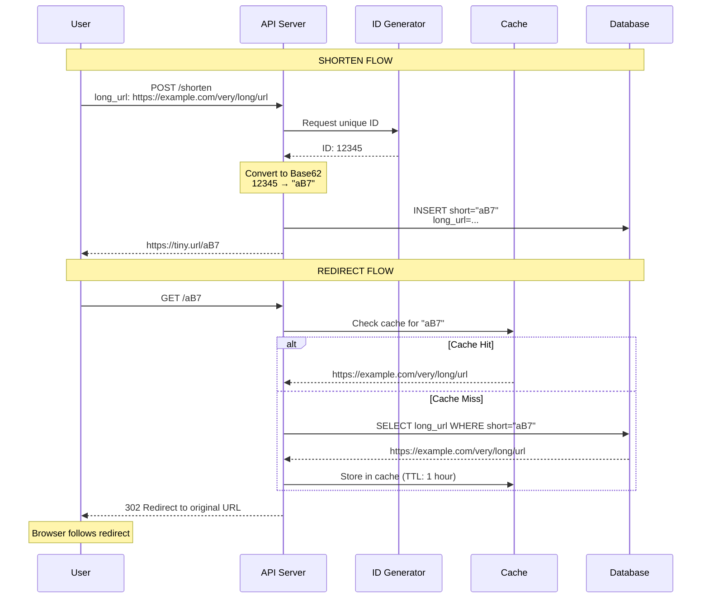
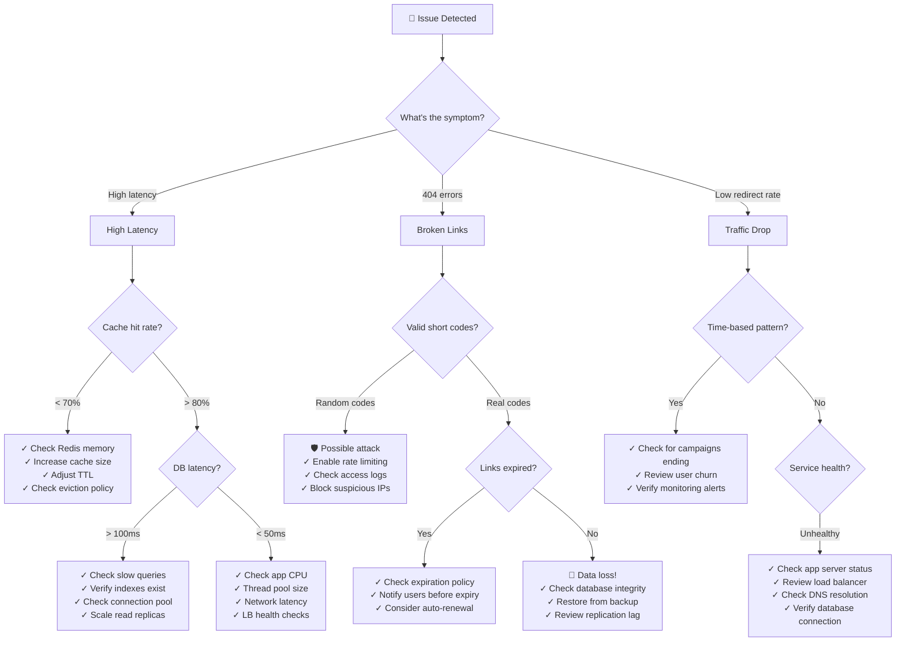

#system-design #case-study #url-shortener #distributed-systems

# Design a URL Shortener (TinyURL / bit.ly)

## Intuition (30 sec)

A URL shortener is like a business card for websites. Instead of saying "Go to https://www.example.com/blog/2024/jan/how-to-build-scalable-systems-part-1", you say "Go to tiny.url/x7B9k". Same destination, much shorter path. The system maintains a giant lookup table: short code → original URL.

---

## Failure-First Scenario

> Your startup creates a URL shortener. You launch on Product Hunt. One link goes viral on Twitter. Suddenly, 50,000 people click it simultaneously. Your single server crashes. Users see "Connection timeout." Your database has 3 duplicate short URLs pointing to different destinations because of race conditions. One user's link expires mid-campaign, breaking their email to 100,000 subscribers. **You need to understand collision handling, caching, database design, and redirect semantics.**

---

## Working Knowledge (5 min)

### Core Concept - Definition First

**URL Shortener:**
- **Definition:** A service that generates a short, unique alias for a long URL and redirects users from the short URL to the original destination
- **Purpose:** Makes links shareable, trackable, and memorable (especially for social media, SMS, print media)
- **How it works:** Maps a short code (like "aB7x2") to a long URL in a database, performs lookup on each access, and redirects the user

**Key Terms:**
- **Short Code/Key:** The unique identifier in the shortened URL (e.g., "aB7x2" in tiny.url/aB7x2)
- **Base62 Encoding:** Encoding scheme using [a-z, A-Z, 0-9] = 62 characters, maximizes uniqueness in minimal space
- **Collision:** When two different URLs generate the same short code, must be detected and resolved
- **301 Redirect:** HTTP "Moved Permanently" - browser caches, fewer analytics but faster
- **302 Redirect:** HTTP "Found" (temporary) - every click hits server, enables analytics
- **Hash Function:** Algorithm that converts input (URL) to fixed-size output (e.g., MD5, SHA-256)
- **Counter:** Auto-incrementing number used to generate sequential unique IDs
- **TTL (Time To Live):** Expiration time for a shortened URL (optional feature)

### Visual Model: URL Shortening Flow



### Comparison Table: ID Generation Strategies

| Strategy | How It Works | Pros | Cons | Best For |
|----------|--------------|------|------|----------|
| **Hash-Based** | Hash long URL, take first N chars | Deterministic (same URL = same short code) | Collisions possible, need collision detection | Deduplication scenarios |
| **Counter-Based** | Auto-increment counter, convert to Base62 | No collisions, simple | Predictable, sequential | High-volume services (bit.ly) |
| **Random** | Generate random string, check uniqueness | Unpredictable | Collision check needed, multiple retries possible | Security-sensitive links |
| **Pre-Generated Keys** | Generate millions of keys upfront, mark as used | Zero collision, instant generation | Key pool management complexity | Enterprise systems |

---

## Layer 1: Conceptual Precision (15 min)

### Base62 Encoding - Deep Definitions

**Base62:**
- **Formal Definition:** A numeral system using 62 symbols [a-z, A-Z, 0-9] to represent numbers, providing compact encoding for IDs
- **Simple Definition:** Like counting, but instead of 0-9 (10 digits), you use 62 characters (letters + numbers)
- **Analogy:** Regular counting uses 10 fingers (0-9). Base62 uses 62 "fingers" - more symbols mean shorter representations
- **Related Terms:**
  - Base64 includes special characters (+, /, =) - used for binary encoding
  - Base62 excludes special chars - better for URLs (no encoding needed)
  - Base10 (decimal) - what humans use naturally

**Why Base62 matters:**
Without Base62, a 7-digit ID could only represent 10,000,000 URLs (10^7). With Base62, the same 7 characters represent 3,521,614,606,208 URLs (62^7) - over 350,000x more capacity!

**The Math:**
```
Base10 (regular numbers):
  0, 1, 2, 3, 4, 5, 6, 7, 8, 9
  7 digits = 10^7 = 10 million combinations

Base62 (alphanumeric):
  a-z (26) + A-Z (26) + 0-9 (10) = 62 characters
  7 characters = 62^7 = 3.5 trillion combinations

Conversion Example:
  Decimal: 12345
  Base62: 3d7 (3×62² + 13×62¹ + 7×62⁰)

  Process:
  12345 ÷ 62 = 199 remainder 7  → '7'
  199 ÷ 62 = 3 remainder 13     → 'd' (13th letter)
  3 ÷ 62 = 0 remainder 3        → '3'

  Result: "3d7"
```

**Length vs Capacity:**
```
┌──────────────────────────────────────┐
│  Short Code Length vs Capacity       │
├──────────────────────────────────────┤
│ 4 chars: 62^4  = 14 million         │
│ 5 chars: 62^5  = 916 million        │
│ 6 chars: 62^6  = 56 billion         │
│ 7 chars: 62^7  = 3.5 trillion  ⭐    │
│ 8 chars: 62^8  = 218 trillion       │
└──────────────────────────────────────┘

7 characters is the sweet spot:
• Short enough to type/share
• Enough capacity for billions of users
• Industry standard (bit.ly, TinyURL)
```

### Collision Handling - The Core Challenge

**Collision:**
- **Definition:** When two different inputs produce the same output (same short code for different URLs)
- **Why it occurs:** Hash functions compress infinite input space into finite output space
- **Impact:** Without handling, users would be redirected to wrong destinations - catastrophic!

**Collision Detection & Resolution:**

```
Approach 1: Check-and-Retry (Hash-Based)
═══════════════════════════════════════

Step 1: Hash the URL
  URL: "https://example.com/page1"
  MD5 Hash: "5d41402abc4b2a76b9719d911017c592"
  Take first 7 chars: "5d41402"

Step 2: Check if exists in database
  SELECT count(*) FROM urls WHERE short_key = '5d41402'

  If count = 0:
    ✓ No collision, use "5d41402"

  If count > 0:
    ✗ Collision detected!
    Add salt and retry:
      Hash("https://example.com/page1" + "salt1")
      → Try "7b3f8a9"

    Still collision? Try again:
      Hash("https://example.com/page1" + "salt2")
      → Try "9e2c4f7"

Problem: Multiple database queries on collision
Maximum retries: Usually 3-5 attempts before failure

Approach 2: Counter-Based (No Collisions)
═════════════════════════════════════════

Uses a centralized counter (never repeats):

┌─────────────────────────────────────┐
│  Counter Service (e.g., Redis)      │
│  ────────────────────────────────   │
│  INCR url_counter → 12345           │
│  INCR url_counter → 12346           │
│  INCR url_counter → 12347           │
└─────────────────────────────────────┘
        │
        ▼
Convert to Base62:
  12345 → "3d7"
  12346 → "3d8"
  12347 → "3d9"

✓ Guaranteed unique (counter never decrements)
✓ No database collision check needed
✗ Single point of failure (counter service)
✗ Predictable (users can guess next URLs)

Solution to predictability:
  Combine counter with random offset:
    ID = (counter × large_prime) + random_offset
    12345 → Mix with 999983 → "xK7pQ2"
```

### Redirect: 301 vs 302 - Critical Decision

**HTTP 301 (Moved Permanently):**
- **Definition:** Indicates the resource has permanently moved to a new location; browser should cache this redirect
- **Browser behavior:** Stores redirect in cache, subsequent visits go directly to destination (bypassing your server)
- **Use case:** Permanent domain changes, canonical URLs

**HTTP 302 (Found / Temporary Redirect):**
- **Definition:** Indicates the resource temporarily resides at a different location; don't cache
- **Browser behavior:** Always hits your server for every click, allowing analytics
- **Use case:** A/B testing, click tracking, URL shorteners

**The Trade-off (Visual):**

```
301 Redirect (Permanent):
═════════════════════════

First Visit:
  User → tiny.url/aB7 → Your Server → example.com
                         (logged)

Second Visit:
  User ───────────────────────────────→ example.com
  (Browser cached, bypasses your server)

Result:
  ✓ Faster (no server roundtrip)
  ✗ Lost analytics after first visit
  ✗ Can't update destination
  ✗ Can't track click counts


302 Redirect (Temporary):
══════════════════════════

First Visit:
  User → tiny.url/aB7 → Your Server → example.com
                         (logged)

Second Visit:
  User → tiny.url/aB7 → Your Server → example.com
                         (logged again)

Every Visit:
  User → tiny.url/aB7 → Your Server → example.com
                         (always logged)

Result:
  ✓ Full analytics on every click
  ✓ Can update destination anytime
  ✓ Track individual users
  ✗ Slower (extra server hop)
  ✗ Higher server load


Decision Matrix:
────────────────
Need analytics?     → Use 302
Need click counts?  → Use 302
Permanent redirect? → Use 301
Performance critical & no tracking? → Use 301

URL Shorteners ALWAYS use 302 ⭐
```

### ID Generation Strategies Comparison (Visual)

```
┌─────────────────────────────────────────────────────────┐
│          ID GENERATION DECISION TREE                    │
└─────────────────────────────────────────────────────────┘

                    Start
                      │
        ┌─────────────┴──────────────┐
        │                            │
   Need deduplication?          Just need unique?
   (same URL = same short)            │
        │                             │
        │                    ┌────────┴─────────┐
     Hash-Based              │                  │
        │              High volume?      Low volume?
        │              (>1M URLs/day)    (<1K URLs/day)
        ▼                    │                  │
┌──────────────┐             │                  │
│  Hash + Check│        Counter-Based      Random + Check
│              │             │                  │
│ Pros:        │             ▼                  ▼
│ • Same URL   │    ┌──────────────┐   ┌──────────────┐
│   reuses key │    │ Redis INCR   │   │ UUID/Random  │
│ • No counter │    │              │   │              │
│   needed     │    │ Pros:        │   │ Pros:        │
│              │    │ • No collis  │   │ • Simple     │
│ Cons:        │    │ • Fast       │   │ • Secure     │
│ • Collision  │    │ • Scalable   │   │              │
│   possible   │    │              │   │ Cons:        │
│ • Check req  │    │ Cons:        │   │ • Check DB   │
└──────────────┘    │ • Predictable│   │ • Retries    │
                    │ • SPOF       │   └──────────────┘
                    └──────────────┘


Real-World Usage:
─────────────────
bit.ly:      Counter-Based (with obfuscation)
TinyURL:     Counter-Based
goo.gl:      Hash-Based (Google's infrastructure)
Custom/API:  Pre-generated Keys (enterprise)
```

### Architecture Evolution (MVP to Scale)

```
Phase 1: MVP (Prototype)
════════════════════════
        ┌─────────────┐
        │   Browser   │
        └──────┬──────┘
               │
        ┌──────▼──────┐
        │Single Server│
        │  • Node.js  │
        │  • SQLite   │
        └─────────────┘

Capacity: ~1K URLs, <10 QPS
Latency: 20-50ms
Cost: $5/month (DigitalOcean droplet)

Problems:
✗ Single point of failure
✗ No caching
✗ SQLite locks on writes
✗ No redundancy

        │ Growth
        ▼

Phase 2: Basic Scale (Startup)
═══════════════════════════════
        ┌─────────────┐
        │   Browser   │
        └──────┬──────┘
               │
        ┌──────▼──────┐
        │Load Balancer│
        └──┬────────┬─┘
    ┌──────▼──┐  ┌──▼─────┐
    │ App 1   │  │ App 2  │
    │(Node.js)│  │(Node.js)│
    └────┬────┘  └────┬───┘
         └────────────┘
                │
         ┌──────▼──────┐
         │ PostgreSQL  │
         │  (Primary)  │
         └─────────────┘

Capacity: ~1M URLs, ~100 QPS
Latency: 30-80ms
Cost: $100/month

Improvements:
✓ Multiple app servers (redundancy)
✓ Relational DB (ACID guarantees)
✓ Load balancing

Still Problems:
✗ Database is bottleneck
✗ No caching (every read hits DB)
✗ DB single point of failure

        │ More growth
        ▼

Phase 3: Optimized (Production)
════════════════════════════════
        ┌─────────────┐
        │   Browser   │
        └──────┬──────┘
               │
        ┌──────▼──────┐
        │Load Balancer│
        └──┬────────┬─┘
    ┌──────▼──┐  ┌──▼─────┐
    │ App 1   │  │ App 2  │
    └────┬────┘  └────┬───┘
         │            │
         │       ┌────▼────────┐
         │       │Redis Cache  │
         │       │ (Read-Heavy)│
         │       └────┬────────┘
         │            │ (miss)
         └────────────┤
                      │
         ┌────────────▼────────┐
         │   PostgreSQL        │
         │   Primary (Write)   │
         └──────┬──────────────┘
                │ Replication
         ┌──────┴──────┐
         │             │
    ┌────▼────┐   ┌────▼────┐
    │Replica 1│   │Replica 2│
    │ (Read)  │   │ (Read)  │
    └─────────┘   └─────────┘

Capacity: ~100M URLs, ~10K QPS
Latency: 5-20ms (with cache)
Cost: $500/month

Improvements:
✓ Redis cache (80%+ hit rate)
✓ Read replicas (scale reads)
✓ Fast redirects (<10ms from cache)

Problems at this scale:
⚠ Write throughput limited by primary DB
⚠ Single region (global latency varies)

        │ Massive scale
        ▼

Phase 4: Global Scale (bit.ly level)
═════════════════════════════════════

            🌍 Internet
                 │
        ┌────────▼────────┐
        │  DNS (Route53)  │
        │  Geo-routing    │
        └────────┬────────┘
                 │
    ┌────────────┼────────────┐
    │            │            │
┌───▼───┐   ┌────▼───┐   ┌───▼───┐
│US-East│   │US-West │   │  EU   │
└───┬───┘   └────┬───┘   └───┬───┘
    │            │            │
[Complete stack in each region]
    │            │            │
 ┌──▼──┐      ┌──▼──┐     ┌──▼──┐
 │ LB  │      │ LB  │     │ LB  │
 └──┬──┘      └──┬──┘     └──┬──┘
    │            │            │
  Apps         Apps         Apps
    │            │            │
  Cache        Cache        Cache
    │            │            │
 ┌──▼──────────────────────────▼──┐
 │  Global Database Cluster        │
 │  (Cassandra/DynamoDB)           │
 │  • Multi-region replication     │
 │  • Eventual consistency         │
 └─────────────────────────────────┘

Capacity: Billions of URLs, 100K+ QPS
Latency: <10ms globally
Cost: $10K+/month

Features:
✓ Global presence (low latency everywhere)
✓ 99.99% availability
✓ Handles traffic spikes
✓ Multi-region failover

Challenges:
⚠ Complex deployment
⚠ Data consistency across regions
⚠ Operational complexity
```

---

## Layer 2: Technology-Specific Examples (20 min)

### Database Schema Design

**Option 1: SQL (PostgreSQL)**

```sql
-- Main URLs table
CREATE TABLE urls (
    id BIGSERIAL PRIMARY KEY,           -- Auto-increment ID
    short_key VARCHAR(10) UNIQUE NOT NULL,  -- "aB7x2k"
    long_url TEXT NOT NULL,             -- Original URL
    user_id VARCHAR(50),                -- Optional: track owner
    created_at TIMESTAMP DEFAULT NOW(),
    expires_at TIMESTAMP,               -- Optional expiration
    click_count INTEGER DEFAULT 0,      -- Track popularity

    INDEX idx_short_key (short_key),    -- Fast lookup
    INDEX idx_user_id (user_id),        -- User's URLs
    INDEX idx_created_at (created_at)   -- Time-based queries
);

-- Analytics table (separate for write performance)
CREATE TABLE clicks (
    id BIGSERIAL PRIMARY KEY,
    short_key VARCHAR(10) NOT NULL,
    clicked_at TIMESTAMP DEFAULT NOW(),
    ip_address INET,
    user_agent TEXT,
    referrer TEXT,
    country VARCHAR(2),

    INDEX idx_short_key (short_key),
    INDEX idx_clicked_at (clicked_at)
);

-- Why this design?
-- ────────────────
-- • short_key is unique constraint (prevents duplicates)
-- • Separate clicks table (avoid lock contention on urls table)
-- • Indexes on short_key for O(1) lookup
-- • BIGSERIAL supports 9 quintillion IDs (never runs out)
```

**Option 2: NoSQL (DynamoDB/Cassandra)**

```javascript
// DynamoDB table structure
{
  TableName: "urls",
  KeySchema: [
    { AttributeName: "short_key", KeyType: "HASH" }  // Partition key
  ],
  AttributeDefinitions: [
    { AttributeName: "short_key", AttributeType: "S" },
    { AttributeName: "user_id", AttributeType: "S" },
    { AttributeName: "created_at", AttributeType: "N" }
  ],
  GlobalSecondaryIndexes: [
    {
      IndexName: "UserIndex",
      KeySchema: [
        { AttributeName: "user_id", KeyType: "HASH" },
        { AttributeName: "created_at", KeyType: "RANGE" }
      ]
    }
  ],
  BillingMode: "PAY_PER_REQUEST"  // Auto-scaling
}

// Item structure:
{
  "short_key": "aB7x2k",        // Partition key (distributed)
  "long_url": "https://example.com/very/long/url",
  "user_id": "user_12345",
  "created_at": 1706745600,     // Unix timestamp
  "expires_at": 1709337600,     // Optional
  "click_count": 1247
}

// Why NoSQL?
// ──────────
// • Simple key-value lookup (perfect for this use case)
// • Horizontal scaling (add more nodes)
// • No complex joins needed
// • High write throughput
// • Built-in replication
```

**SQL vs NoSQL Decision Tree:**

```
         What's your priority?
                 │
    ┌────────────┴────────────┐
    │                         │
Consistency                 Scale
Analytics                   Simplicity
Complex queries             Speed
    │                         │
    ▼                         ▼
┌─────────┐              ┌──────────┐
│   SQL   │              │  NoSQL   │
│         │              │          │
│ ✓ ACID  │              │ ✓ Fast   │
│ ✓ Joins │              │ ✓ Simple │
│ ✓ Reports│             │ ✓ Scales │
│         │              │          │
│ Use:    │              │ Use:     │
│ • Pg    │              │ • DynamoDB│
│ • MySQL │              │ • Cassandra│
└─────────┘              └──────────┘

URL shortener → NoSQL wins
  • Simple key-value lookup
  • No joins needed
  • Reads >>> Writes (10:1)
  • Need horizontal scaling
```

### API Design & Implementation

**API Endpoints:**

```yaml
# API Specification (OpenAPI)

POST /api/v1/shorten:
  description: Create a shortened URL
  request:
    body:
      long_url: "https://example.com/very/long/url"
      custom_alias: "my-link"  # Optional
      expires_in: 86400        # Optional (seconds)
  response:
    201 Created:
      short_url: "https://tiny.url/aB7x2k"
      short_key: "aB7x2k"
      created_at: "2024-02-14T10:30:00Z"
      expires_at: "2024-02-15T10:30:00Z"
    400 Bad Request:
      error: "Invalid URL format"
    409 Conflict:
      error: "Custom alias already taken"

GET /{short_key}:
  description: Redirect to original URL
  parameters:
    - short_key: "aB7x2k"
  response:
    302 Found:
      Location: "https://example.com/very/long/url"
    404 Not Found:
      error: "Short URL not found"
    410 Gone:
      error: "Short URL has expired"

GET /api/v1/stats/{short_key}:
  description: Get analytics for a short URL
  response:
    200 OK:
      short_key: "aB7x2k"
      long_url: "https://example.com/..."
      click_count: 1247
      created_at: "2024-02-14T10:30:00Z"
      recent_clicks: [...]
```

**Implementation (Node.js/Express):**

```javascript
// shorten.js
const express = require('express');
const redis = require('redis');
const { Pool } = require('pg');

const app = express();
const cache = redis.createClient();
const db = new Pool({ /* config */ });

// Character set for Base62
const BASE62 = 'abcdefghijklmnopqrstuvwxyzABCDEFGHIJKLMNOPQRSTUVWXYZ0123456789';

// Convert number to Base62 string
function toBase62(num) {
  if (num === 0) return BASE62[0];
  let result = '';
  while (num > 0) {
    result = BASE62[num % 62] + result;
    num = Math.floor(num / 62);
  }
  return result;
}

// POST /api/v1/shorten - Create short URL
app.post('/api/v1/shorten', async (req, res) => {
  const { long_url, custom_alias, expires_in } = req.body;

  // Validate URL
  try {
    new URL(long_url);
  } catch (e) {
    return res.status(400).json({ error: 'Invalid URL' });
  }

  let short_key;

  if (custom_alias) {
    // Use custom alias if provided
    const exists = await db.query(
      'SELECT 1 FROM urls WHERE short_key = $1',
      [custom_alias]
    );
    if (exists.rows.length > 0) {
      return res.status(409).json({ error: 'Alias already taken' });
    }
    short_key = custom_alias;
  } else {
    // Generate using counter
    const id = await cache.incr('url_counter');
    short_key = toBase62(id);
  }

  // Calculate expiration
  const expires_at = expires_in
    ? new Date(Date.now() + expires_in * 1000)
    : null;

  // Insert into database
  await db.query(
    `INSERT INTO urls (short_key, long_url, expires_at)
     VALUES ($1, $2, $3)`,
    [short_key, long_url, expires_at]
  );

  res.status(201).json({
    short_url: `https://tiny.url/${short_key}`,
    short_key,
    created_at: new Date(),
    expires_at
  });
});

// GET /{short_key} - Redirect
app.get('/:short_key', async (req, res) => {
  const { short_key } = req.params;

  // Check cache first (fast path)
  let long_url = await cache.get(short_key);

  if (!long_url) {
    // Cache miss - query database
    const result = await db.query(
      `SELECT long_url, expires_at
       FROM urls
       WHERE short_key = $1`,
      [short_key]
    );

    if (result.rows.length === 0) {
      return res.status(404).json({ error: 'Not found' });
    }

    const row = result.rows[0];

    // Check expiration
    if (row.expires_at && new Date(row.expires_at) < new Date()) {
      return res.status(410).json({ error: 'Link expired' });
    }

    long_url = row.long_url;

    // Store in cache (TTL: 1 hour)
    await cache.setex(short_key, 3600, long_url);
  }

  // Log click asynchronously (don't block redirect)
  setImmediate(() => {
    db.query(
      `UPDATE urls SET click_count = click_count + 1
       WHERE short_key = $1`,
      [short_key]
    );
    db.query(
      `INSERT INTO clicks (short_key, ip_address, user_agent)
       VALUES ($1, $2, $3)`,
      [short_key, req.ip, req.get('user-agent')]
    );
  });

  // Redirect (302 = temporary, enables tracking)
  res.redirect(302, long_url);
});

// GET /api/v1/stats/{short_key} - Analytics
app.get('/api/v1/stats/:short_key', async (req, res) => {
  const { short_key } = req.params;

  const result = await db.query(
    `SELECT u.*, COUNT(c.id) as total_clicks
     FROM urls u
     LEFT JOIN clicks c ON u.short_key = c.short_key
     WHERE u.short_key = $1
     GROUP BY u.id`,
    [short_key]
  );

  if (result.rows.length === 0) {
    return res.status(404).json({ error: 'Not found' });
  }

  res.json(result.rows[0]);
});

app.listen(8080);
```

### Caching Strategy (Visual)

```
Cache Architecture:
═══════════════════

        User Request
             │
             ▼
    ┌────────────────┐
    │  App Server    │
    └────────┬───────┘
             │
        Check cache
             │
      ┌──────┴──────┐
      │             │
   Cache HIT    Cache MISS
      │             │
      ▼             ▼
   Return     ┌──────────┐
   (fast!)    │ Database │
              └────┬─────┘
                   │
              Store in cache
                   │
                   ▼
                Return


Cache Configuration:
────────────────────
Type: Redis (in-memory, fast)
TTL: 1 hour (3600 seconds)
Eviction: LRU (Least Recently Used)
Max Memory: 4GB
Expected Hit Rate: 80-90%

Key Pattern:
  short:aB7x2k → "https://example.com/..."

Performance Impact:
───────────────────
Database query: 20-50ms
Cache hit: 1-2ms
Speedup: 10-50x faster!

Cache Hit Rate Calculation:
──────────────────────────
If 90% hit rate with 1000 QPS:
• 900 requests → Cache (1-2ms)
• 100 requests → Database (20-50ms)

Average latency:
  (900 × 2ms + 100 × 30ms) ÷ 1000
  = (1800 + 3000) ÷ 1000
  = 4.8ms average

Without cache (100% database):
  1000 × 30ms = 30ms average

Improvement: 6x faster!
```

---

## Layer 3: Production-Ready Details (30 min)

### Capacity Planning (Complete Math)

**Given Requirements:**
```
┌─────────────────────────────────────┐
│ Business Requirements:              │
│ • 100M new URLs per month           │
│ • 10:1 read-to-write ratio          │
│ • 5-year retention                  │
│ • <50ms P99 latency                 │
│ • 99.9% availability                │
└─────────────────────────────────────┘
```

**Step 1: Calculate QPS (Queries Per Second)**

```
Write Operations:
─────────────────
100M URLs/month ÷ 30 days ÷ 86,400 sec/day
= 100,000,000 ÷ 2,592,000
= 38.6 URLs/sec
≈ 40 writes/sec (peak might be 2-3x)

Read Operations:
────────────────
Read:Write = 10:1
Reads = 40 × 10 = 400 reads/sec

Peak traffic (assume 3x average):
──────────────────────────────────
Peak writes: 40 × 3 = 120 writes/sec
Peak reads: 400 × 3 = 1,200 reads/sec

Daily Active Pattern:
────────────────────
┌─────────────────────────────────┐
│   QPS throughout day            │
│                                 │
│1200│         ┌─┐                │
│    │        ┌┘ └┐               │
│ 800│      ┌─┘   └─┐             │
│    │    ┌─┘       └─┐           │
│ 400│ ┌──┘           └──┐        │
│    │─┘                 └────    │
│   0├──────────────────────────  │
│    0  6  12  18  24 (hour)      │
└─────────────────────────────────┘

Result: Plan for 1,200 QPS peak
```

**Step 2: Storage Estimation**

```
Per URL Storage:
────────────────
short_key:    10 bytes   (VARCHAR)
long_url:     500 bytes  (average URL length)
user_id:      50 bytes
created_at:   8 bytes    (TIMESTAMP)
expires_at:   8 bytes
click_count:  4 bytes    (INTEGER)
indexes:      100 bytes  (overhead)
─────────────────────────
Total:        680 bytes ≈ 700 bytes per URL

Monthly Storage:
────────────────
100M URLs × 700 bytes = 70,000 MB = 70 GB/month

Yearly Storage:
───────────────
70 GB × 12 = 840 GB/year

5-Year Storage:
───────────────
840 GB × 5 = 4,200 GB = 4.2 TB

Add 50% buffer for indexes, backups:
4.2 TB × 1.5 = 6.3 TB total

Analytics (clicks table):
─────────────────────────
10:1 read ratio, but not all reads need logging
Assume 50% of reads logged:
  400 reads/sec × 0.5 = 200 clicks/sec logged

Per click: ~200 bytes
200 clicks/sec × 86,400 sec × 30 days = 518M clicks/month
518M × 200 bytes = 103 GB/month
1.2 TB/year
6 TB for 5 years

Total Storage:
──────────────
URLs:      6.3 TB
Analytics: 6.0 TB
──────────────
Total:     12.3 TB (plan for 15 TB with buffer)
```

**Step 3: Bandwidth Estimation**

```
Ingress (Writes):
──────────────────
Payload per write: ~1 KB (URL + metadata)
40 writes/sec × 1 KB = 40 KB/sec
= 0.04 MB/sec
= 3.5 GB/month (negligible)

Egress (Reads):
───────────────
Payload per read: ~500 bytes (just the long URL)
400 reads/sec × 500 bytes = 200 KB/sec
= 0.2 MB/sec
= 17.3 GB/day
= 520 GB/month

With 80% cache hit rate:
  Only 20% hits database
  = 520 GB × 0.2 = 104 GB/month actual DB egress

Result: ~150 GB/month bandwidth (comfortable)
```

**Step 4: Server Capacity**

```
Concurrent Requests:
────────────────────
Formula: Concurrent = QPS × Latency

Target latency: 50ms = 0.05 seconds
Peak QPS: 1,200

Concurrent = 1,200 × 0.05 = 60 concurrent requests

If 1 server handles 100 concurrent:
───────────────────────────────────
Servers needed = 60 ÷ 100 = 0.6 → 1 server

Add redundancy (N+1):
────────────────────
Minimum: 2 servers (one can fail)
Recommended: 3 servers (N+2 for deployments)

With cache (80% hit rate):
──────────────────────────
Cache latency: 2ms
DB latency: 30ms

Average latency:
= (0.8 × 2ms) + (0.2 × 30ms)
= 1.6ms + 6ms
= 7.6ms

New concurrent:
= 1,200 × 0.0076 = 9.12 concurrent

1 server easily handles this!
But keep 3 for redundancy.

Final Architecture:
───────────────────
┌────────────────────────────────┐
│ 3 App Servers (8 vCPU, 16GB)  │
│ Cost: 3 × $100 = $300/month    │
└────────────────────────────────┘
         │
┌────────────────────────────────┐
│ Redis Cache (16GB)             │
│ Cost: $50/month                │
└────────────────────────────────┘
         │
┌────────────────────────────────┐
│ PostgreSQL (100GB SSD)         │
│ Primary + 2 Read Replicas      │
│ Cost: $150/month               │
└────────────────────────────────┘

Total: ~$500/month for 100M URLs
```

### Monitoring Dashboard (Visual Metrics)

```
╔══════════════════════════════════════════════════════╗
║         URL SHORTENER MONITORING DASHBOARD           ║
╠══════════════════════════════════════════════════════╣
║                                                      ║
║  🔵 Redirect Rate (Primary Metric)                   ║
║  ▬▬▬▬▬▬▬▬▬▬▬▬▬▬▬▬▬▬▬▬▬▬▬▬▬▬▬▬▬▬▬▬▬▬▬▬             ║
║  387 redirects/sec  ▼ 3% from last hour             ║
║  Definition: Number of successful GET /{key} per sec║
║  Alert if: < 100 QPS (traffic drop) or > 2K (spike) ║
║                                                      ║
║  🟢 Success Rate: 99.2%                              ║
║  ▰▰▰▰▰▰▰▰▰▰▰▰▰▰▰▰▰▰▰▰▰▰▰▰▰▰▰▰▰▰▰▰▰▰▰▰▰▰▰▱         ║
║  Definition: (2xx redirects) ÷ (total requests)     ║
║  Alert if: < 99% (indicates broken links)           ║
║                                                      ║
║  🟡 Redirect Latency P99: 12ms                       ║
║  ▬▬▬▬▬▬▬▬▬░░░░░░░░░░░░░░░░░░░░░░░░                 ║
║  Target: < 50ms ✓  |  Cache hit: 2ms | DB: 28ms    ║
║  Definition: 99% of redirects complete in this time ║
║                                                      ║
║  🟠 Cache Hit Rate: 82.4%                            ║
║  ▰▰▰▰▰▰▰▰▰▰▰▰▰▰▰▰▰▰▰▰▰▰▰▰▰▰▰▰▰▰▰▰▰░░░░░░          ║
║  Definition: % of requests served from cache        ║
║  Alert if: < 70% (cache not effective)              ║
║  Impact: 82% at 2ms, 18% at 30ms = 8ms avg latency ║
║                                                      ║
║  🔴 404 Rate (Broken Links): 0.8%                    ║
║  ▬▬░░░░░░░░░░░░░░░░░░░░░░░░░░░░░░░░░░               ║
║  3 errors/sec                                        ║
║  Definition: % of requests to non-existent keys     ║
║  Alert if: > 5% (massive link rot)                  ║
║                                                      ║
║  📊 Most Popular Links (Last Hour)                   ║
║  ┌──────────┬──────────────┬────────┐              ║
║  │ Key      │ Destination  │ Clicks │              ║
║  ├──────────┼──────────────┼────────┤              ║
║  │ aB7x2k   │ example.com  │ 12,483 │ 🔥          ║
║  │ xY4m9P   │ github.com   │  8,291 │              ║
║  │ qR7nK3   │ youtube.com  │  6,742 │              ║
║  └──────────┴──────────────┴────────┘              ║
║                                                      ║
║  ⚠️  Active Alerts                                   ║
║  ┌────────────────────────────────────────────┐    ║
║  │ [WARN] Database replica lag: 5 seconds     │    ║
║  │        Time: 14:23:45                       │    ║
║  │        Impact: Stale data in analytics      │    ║
║  │                                             │    ║
║  │ [INFO] New short URL creation spiked        │    ║
║  │        From 40/sec → 120/sec                │    ║
║  │        Possible campaign launch             │    ║
║  └────────────────────────────────────────────┘    ║
║                                                      ║
║  🗄️  Database Health                                 ║
║  ┌─────────────────────────────────────────┐        ║
║  │ Primary:   ▰▰▰▰▰▰░░░░  67% CPU          │        ║
║  │            Active connections: 42/100    │        ║
║  │ Replica 1: ▰▰▰▰░░░░░░  45% CPU          │        ║
║  │ Replica 2: ▰▰▰▰░░░░░░  48% CPU          │        ║
║  └─────────────────────────────────────────┘        ║
║                                                      ║
║  💾 Storage                                          ║
║  ┌─────────────────────────────────────────┐        ║
║  │ URLs:       4.2 TB / 15 TB (28%)        │        ║
║  │ Analytics:  3.8 TB / 15 TB (25%)        │        ║
║  │ Growth:     +70 GB/month                │        ║
║  │ Forecast:   10 months until 50% full    │        ║
║  └─────────────────────────────────────────┘        ║
║                                                      ║
╚══════════════════════════════════════════════════════╝

Key Metrics Definitions:
────────────────────────
• Redirect Rate: Core business metric (usage)
• Success Rate: Reliability metric (are links working?)
• P99 Latency: User experience metric
• Cache Hit Rate: Performance optimization metric
• 404 Rate: Link quality metric (detect broken links)
```

### Troubleshooting Flowchart



### Design Decision Tree

```
┌──────────────────────────────────────────────────────┐
│           DESIGN DECISION TREE                       │
└──────────────────────────────────────────────────────┘

Question 1: Counter vs Hash for ID Generation?
───────────────────────────────────────────────
                    Start
                      │
         ┌────────────┴─────────────┐
         │                          │
   Need deduplication?          Just unique IDs?
   (same URL → same key)              │
         │                            │
         ▼                            ▼
    HASH-BASED                  COUNTER-BASED ⭐
         │                            │
    Pros:                         Pros:
    • Idempotent                  • No collisions
    • No counter state            • Simple
                                  • Scalable
    Cons:
    • Collision risk              Cons:
    • DB check needed             • Predictable
    • Slower                      • Need counter service

    Decision: Use Counter (bit.ly's approach)
    Why: Collisions are worse than predictability
         Add random offset for security if needed


Question 2: SQL vs NoSQL?
──────────────────────────
                    Start
                      │
         ┌────────────┴─────────────┐
         │                          │
   Need complex queries?       Simple key-value?
   Analytics in DB?                 │
         │                          │
         ▼                          ▼
    SQL (PostgreSQL)           NoSQL (DynamoDB) ⭐
         │                          │
    Pros:                        Pros:
    • Rich queries               • Horizontal scaling
    • ACID guarantees            • Simple operations
    • Mature tooling             • Fast lookups
                                 • Auto-sharding
    Cons:
    • Vertical scaling           Cons:
    • Sharding complex           • Limited queries
                                 • Eventual consistency

    Decision: Use NoSQL for URLs table
              Use separate analytics pipeline
    Why: URLs are simple key-value lookups
         Analytics handled by Kafka → data warehouse


Question 3: 301 vs 302 Redirect?
─────────────────────────────────
                    Start
                      │
         ┌────────────┴─────────────┐
         │                          │
   Need analytics?              Don't need tracking?
   Change destination?               │
         │                          │
         ▼                          ▼
    302 (Temporary) ⭐            301 (Permanent)
         │                          │
    Pros:                        Pros:
    • Track every click          • Faster (cached)
    • Update destination         • Less server load
    • A/B testing
                                 Cons:
    Cons:                        • No analytics
    • Slower (extra hop)         • Can't change
    • Higher load                • Browser caches

    Decision: Use 302 for URL shorteners
    Why: Analytics are core feature
         Need to track clicks
         Want to update destinations


Question 4: Cache Strategy?
───────────────────────────
                    Start
                      │
         ┌────────────┴─────────────┐
         │                          │
   High read volume?            Low volume?
   (> 100 QPS)                      │
         │                          │
         ▼                          ▼
    Cache Required ⭐            Cache Optional
         │                          │
    What to cache?                  │
         │                          │
    ┌────┴─────┐                   │
    │          │                   │
Short → Long   Analytics            │
    │          │                   │
    ✓          ✗                   │
    │                              │
Cache reads,                       │
NOT writes                         │
(cache aside)                      │

Configuration:
• Type: Redis
• TTL: 1 hour
• Max memory: 10% of DB size
• Eviction: LRU
• Expected hit rate: 80%+

Why this matters:
Without cache: 30ms average latency
With cache:    8ms average latency
Improvement:   73% faster
```

---

## Real-World Examples

### Example 1: bit.ly - High-Scale Architecture

**The Problem:**
```
bit.ly handles:
• 5 billion clicks/month (1,900+ QPS)
• 100 million new links/month
• Global user base (sub-50ms latency required)
• Real-time analytics for enterprise customers
```

**The Solution:**

**Before (Early Days - 2009):**
```
    ┌──────────┐
    │  Single  │
    │  Server  │
    │  (LAMP)  │
    └──────────┘

Problems:
✗ Couldn't scale beyond 100 QPS
✗ No redundancy (downtime during deploys)
✗ MySQL bottleneck
```

**After (Production Architecture - Current):**
```
                   🌍 Users
                      │
         ┌────────────▼────────────┐
         │  DNS (Geographic routing)│
         └────────────┬────────────┘
                      │
         ┌────────────┼────────────┐
         │            │            │
    ┌────▼───┐   ┌────▼───┐   ┌───▼────┐
    │US-East │   │US-West │   │  EMEA  │
    └────┬───┘   └────┬───┘   └───┬────┘
         │            │            │
    [Full stack in each region]
         │
    ┌────▼────────────────────────┐
    │ Layer 7 Load Balancer        │
    │ (HAProxy)                    │
    │ • Health checks              │
    │ • SSL termination            │
    └────┬────────────────────────┘
         │
    ┌────┴────┐
    │         │
┌───▼───┐ ┌──▼────┐ ... (20+ servers per region)
│ App 1 │ │ App 2 │
│(Go)   │ │(Go)   │
└───┬───┘ └───┬───┘
    │         │
    └────┬────┘
         │
    ┌────▼──────────────────────┐
    │  Redis Cluster             │
    │  • 50+ nodes               │
    │  • 100GB+ cache            │
    │  • 90% hit rate            │
    └────┬──────────────────────┘
         │
    ┌────▼──────────────────────┐
    │  Cassandra Cluster         │
    │  • Multi-datacenter        │
    │  • Replication factor: 3   │
    │  • Tunable consistency     │
    └────┬──────────────────────┘
         │
    ┌────▼──────────────────────┐
    │  Analytics Pipeline        │
    │  • Kafka (event streaming) │
    │  • Spark (processing)      │
    │  • ClickHouse (analytics)  │
    └───────────────────────────┘
```

**Key Technical Decisions:**

1. **Language Choice: Go (from PHP)**
   - Why: Lower memory footprint, better concurrency
   - Impact: 90% reduction in servers needed
   - Handles 10K concurrent connections per server

2. **Database: Cassandra (from MySQL)**
   - Why: Horizontal scaling, multi-region replication
   - Impact: Write throughput increased 100x
   - No single point of failure

3. **ID Generation: Time-based + Counter**
   ```
   ID = timestamp (41 bits) + datacenter (5 bits) + machine (5 bits) + sequence (12 bits)

   Example:
   Timestamp:   1706745600000  (milliseconds since epoch)
   Datacenter:  2              (US-West)
   Machine:     15             (server ID)
   Sequence:    3847           (auto-increment per machine)

   Combined:    "aB7xK9pQ2"    (Base62 encoded)

   Benefits:
   ✓ Globally unique (no coordination)
   ✓ Time-sortable (newest first)
   ✓ Can extract creation time from ID
   ```

4. **Caching Strategy:**
   ```
   Layer 1: CDN (Cloudflare)
   └─ Cache static assets
   └─ DDoS protection

   Layer 2: Redis Cluster
   └─ Hot links (90% hit rate)
   └─ TTL: 1 hour

   Layer 3: Database
   └─ All links (permanent storage)
   ```

**Results:**
- **Latency:** 95th percentile: 8ms (globally)
- **Availability:** 99.99% uptime (4 minutes downtime/month max)
- **Scalability:** Handles 5B clicks/month
- **Cost Efficiency:** $0.000001 per redirect

**Lessons Learned:**
1. Cache is critical (90% hit rate = 10x less DB load)
2. NoSQL enables horizontal scaling (Cassandra)
3. Multi-region deployment reduces latency for global users
4. Async analytics pipeline prevents blocking redirects

---

### Example 2: TinyURL - Simplicity at Scale

**The Problem:**
```
TinyURL (created 2002) was the FIRST URL shortener.
Challenges:
• Built before modern cloud infrastructure
• Had to handle millions of URLs on limited budget
• No fancy databases (Cassandra didn't exist)
• Simple architecture was a requirement
```

**The Solution (Original Architecture):**

```
    ┌──────────────────────────┐
    │   Apache + mod_perl      │
    │   (Web server + App)     │
    └──────────┬───────────────┘
               │
    ┌──────────▼───────────────┐
    │   MySQL (Single Server)  │
    │   • Simple schema        │
    │   • Just 2 columns!      │
    └──────────────────────────┘

Database Schema:
────────────────
CREATE TABLE tiny_url (
  id INT AUTO_INCREMENT PRIMARY KEY,
  long_url TEXT,
  INDEX(id)
);

Short URL = Base62(id)

Example:
  id=12345 → Base62 → "3d7" → tinyurl.com/3d7
```

**Why It Worked:**

1. **Simplicity:**
   - Just 2 columns (ID + URL)
   - Auto-increment ID = no collision logic
   - Base62 encoding = compact URLs

2. **MySQL Auto-Increment:**
   - Guaranteed unique IDs
   - No distributed coordination needed
   - Sequential writes (fast)

3. **Stateless App Servers:**
   - Easy to add more servers
   - No session state
   - Load balance with round-robin

**Scaling Evolution:**

```
Phase 1 (2002-2005): Single Server
──────────────────────────────────
    ┌──────────┐
    │  Server  │
    │  MySQL   │
    └──────────┘
Capacity: ~1M URLs


Phase 2 (2005-2010): Read Replicas
───────────────────────────────────
    ┌───────────┐
    │  Primary  │
    │  (Write)  │
    └─────┬─────┘
          │ Replication
    ┌─────┴─────┐
    │           │
┌───▼───┐   ┌───▼───┐
│Replica│   │Replica│
│(Read) │   │(Read) │
└───────┘   └───────┘

Capacity: ~100M URLs
Read scaling: 10x


Phase 3 (2010+): Sharding
──────────────────────────
Partition by ID range:

Shard 1: IDs    1 - 100M
Shard 2: IDs  100M - 200M
Shard 3: IDs  200M - 300M

Lookup logic:
  short_key="3d7" → Base62 to decimal → 12345
  12345 < 100M → Query Shard 1

Each shard has replicas:
┌────────┐  ┌────────┐  ┌────────┐
│Shard 1 │  │Shard 2 │  │Shard 3 │
│Primary │  │Primary │  │Primary │
└───┬────┘  └───┬────┘  └───┬────┘
    │           │           │
  Replicas    Replicas    Replicas

Capacity: Billions of URLs
```

**Key Insight:**
TinyURL proved you don't need complex architecture to start. Simple design + smart scaling as you grow.

---

## Interview Preparation

### Concept Glossary

Quick reference definitions for interview:

- **URL Shortener:** Service that maps a short unique key to a long URL and redirects users
- **Base62:** Encoding using [a-z,A-Z,0-9] (62 chars) for compact representation
- **Collision:** When two URLs generate the same short code; must be detected and resolved
- **302 Redirect:** Temporary redirect where browser hits server every time (enables analytics)
- **301 Redirect:** Permanent redirect where browser caches (faster but no tracking)
- **Hash Function:** Algorithm converting input to fixed-size output (MD5, SHA-256)
- **Counter-Based ID:** Auto-incrementing number ensuring uniqueness without collision checks
- **Cache Hit Rate:** Percentage of requests served from cache vs database
- **QPS (Queries Per Second):** Rate of incoming requests
- **P99 Latency:** 99% of requests complete within this time
- **Horizontal Scaling:** Adding more machines to handle load
- **Sharding:** Splitting data across multiple databases by key range

### Question Template

**Q: Design a URL shortener like TinyURL**

**Answer Structure:**

**1. Clarify Requirements (1 min):**
```
Functional:
• Generate short URL from long URL
• Redirect users from short → long
• Custom aliases? → Optional
• Expiration? → Optional
• Analytics? → Yes (click tracking)

Non-Functional:
• Scale: 100M URLs/month, 1B reads/month
• Latency: <50ms P99
• Availability: 99.9%
```

**2. Back-of-Envelope (2 min):**
```
QPS:
• Writes: 100M/month ÷ 2.6M sec = 40/sec
• Reads: 1B/month ÷ 2.6M sec = 400/sec
• Peak (3x): 120 writes, 1200 reads per second

Storage:
• 700 bytes/URL × 100M/month = 70GB/month
• 5 years = 4.2TB

URL Length:
• Base62, 7 characters = 62^7 = 3.5T combinations
• Plenty for billions of URLs
```

**3. High-Level Design (3 min):**
```
API:
  POST /shorten → returns short URL
  GET /{key}   → 302 redirect

Components:
┌──────────┐
│  Client  │
└─────┬────┘
      │
┌─────▼─────┐
│    LB     │
└─────┬─────┘
      │
┌─────▼─────┐
│ App Nodes │
└──┬────┬───┘
   │    │
Cache  Database
(Redis)(DynamoDB)

Flow:
1. Shorten: Generate ID → Base62 → Store in DB
2. Redirect: Check cache → If miss, query DB → Redirect
```

**4. Deep Dive (4 min):**
```
Key Decision: ID Generation
• Counter-based (recommended)
  - Redis INCR for unique IDs
  - Convert to Base62
  - No collisions

Database Choice:
• DynamoDB (NoSQL)
  - Simple key-value lookup
  - Horizontal scaling
  - Fast reads (<10ms)

Caching:
• Redis for hot URLs
• TTL: 1 hour
• Expected 80% hit rate
• Reduces latency from 30ms → 5ms

Redirect:
• Use 302 (temporary)
• Enables click tracking
• Every request hits our service
```

**5. Scaling Considerations (2 min):**
```
Read Scaling:
• Cache handles 80%+ reads
• Read replicas for remaining 20%

Write Scaling:
• 40 writes/sec is low
• Single DB handles this easily

Global Scale:
• Multi-region deployment
• DNS geo-routing
• Regional caches
```

**Common Follow-ups:**

**Q: What if Redis (counter) goes down?**
A: Use Redis Cluster with replication. If entire cluster fails, have backup counter in database. Small gap in IDs is acceptable (not sequential, just unique).

**Q: How to prevent abuse (spam links)?**
A: Rate limiting by IP (e.g., 100 URLs/hour), CAPTCHA for high volume, blacklist known malicious domains, require login for API access.

**Q: How to handle link expiration?**
A: Add `expires_at` timestamp column. Check on every redirect. Background job to clean up expired links. Return 410 Gone status for expired URLs.

**Q: How to support custom aliases?**
A: Check if alias is available, insert with custom key instead of generated one. Conflict handling: return 409 if taken.

---

## Quick Reference

### Glossary

| Term | Definition | When You'll See It |
|------|------------|-------------------|
| **Base62** | Encoding using 62 chars [a-z,A-Z,0-9] | ID generation, short key format |
| **Collision** | Two URLs generating same short code | Hash-based ID generation |
| **302 Redirect** | Temporary redirect (no cache) | Every URL shortener redirect |
| **301 Redirect** | Permanent redirect (cached) | NOT used in URL shorteners |
| **Cache Hit Rate** | % requests served from cache | Performance metrics |
| **QPS** | Queries per second | Capacity planning |
| **P99 Latency** | 99% of requests faster than this | Performance targets |
| **Counter** | Auto-increment ID generator | ID generation strategy |
| **Hash Function** | Convert input to fixed output | Alternative ID generation |
| **Sharding** | Split data across DBs by range | Scaling to billions of URLs |

### Decision Cheat Sheet

```
IF need analytics
  THEN use 302 redirect (not 301)
  REASON: Browser doesn't cache, every click tracked

IF need unique IDs without collisions
  THEN use counter-based generation
  REASON: Auto-increment guarantees uniqueness

IF read:write ratio > 10:1
  THEN add caching layer (Redis)
  REASON: Reduces database load 80%+

IF handling > 1000 QPS reads
  THEN add cache + read replicas
  REASON: Single DB can't handle load

IF need horizontal scaling
  THEN use NoSQL (DynamoDB/Cassandra)
  REASON: Sharding built-in, simple operations

IF custom aliases allowed
  THEN check availability before insert
  REASON: Prevent duplicate aliases

IF storage > 10TB
  THEN partition by ID range (sharding)
  REASON: Single DB can't handle size
```

### Performance Targets

```
┌─────────────────────────────────────┐
│  PERFORMANCE BENCHMARKS              │
├─────────────────────────────────────┤
│ Redirect Latency:                   │
│   P50: < 10ms  ⭐                    │
│   P99: < 50ms                        │
│                                      │
│ Cache Hit Rate:                      │
│   Target: > 80% ⭐                   │
│   Excellent: > 90%                   │
│                                      │
│ Availability:                        │
│   Target: 99.9% (43 min/month)      │
│   Enterprise: 99.99% (4 min/month)  │
│                                      │
│ Success Rate:                        │
│   Target: > 99% (< 1% 404s)         │
│                                      │
│ Database Query:                      │
│   P99: < 20ms                        │
│                                      │
│ Cache Query:                         │
│   P99: < 2ms                         │
└─────────────────────────────────────┘
```

---

## Links

- [[02_building_blocks/databases_nosql]] - DynamoDB/Cassandra for key-value storage
- [[02_building_blocks/caching]] - Redis caching strategies
- [[02_building_blocks/load_balancers]] - Distributing traffic across app servers
- [[02_building_blocks/message_queues]] - Kafka for async analytics
- [[01_fundamentals/networking_basics]] - HTTP redirects, status codes
- [[03_patterns/sharding]] - Partitioning data for scale

---

## Common Mistakes in Interviews

1. **Using 301 redirects instead of 302**
   - ✗ "I'll use 301 because it's faster"
   - ✓ "Use 302 for analytics; every click must hit our server"

2. **Not considering collision handling**
   - ✗ "Just hash the URL and use first 7 characters"
   - ✓ "Hash-based needs collision detection; counter-based avoids this"

3. **Over-engineering for scale**
   - ✗ "We need Cassandra cluster across 10 regions!"
   - ✓ "40 writes/sec is low; start with simple PostgreSQL + Redis"

4. **Forgetting caching**
   - ✗ Design only shows database
   - ✓ "Read-heavy workload needs caching; expect 80% hit rate"

5. **Ignoring Base62 explanation**
   - ✗ "Store IDs in database"
   - ✓ "Convert numeric ID to Base62 for compact representation"

6. **Not discussing ID generation strategy**
   - ✗ Skips over how short codes are created
   - ✓ Compares counter vs hash vs random with trade-offs

7. **Missing capacity planning**
   - ✗ No calculations for QPS or storage
   - ✓ Show math: 100M URLs/month = 40 writes/sec, 70GB storage
