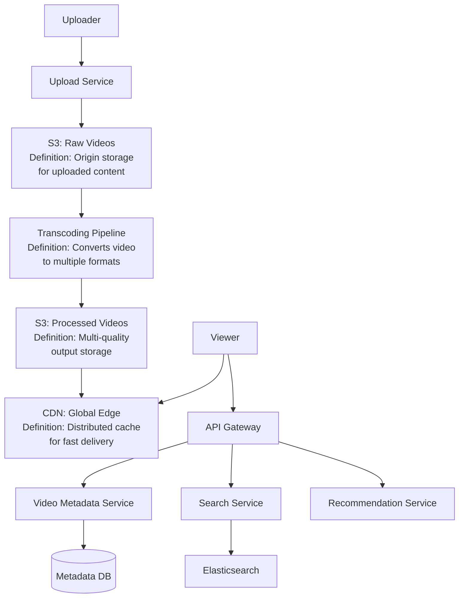
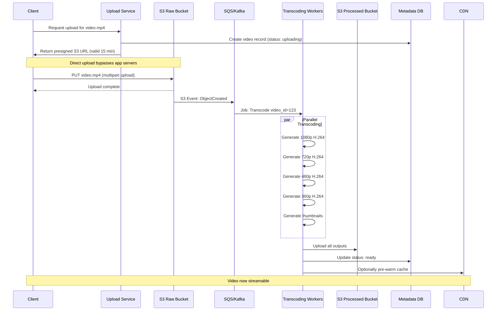
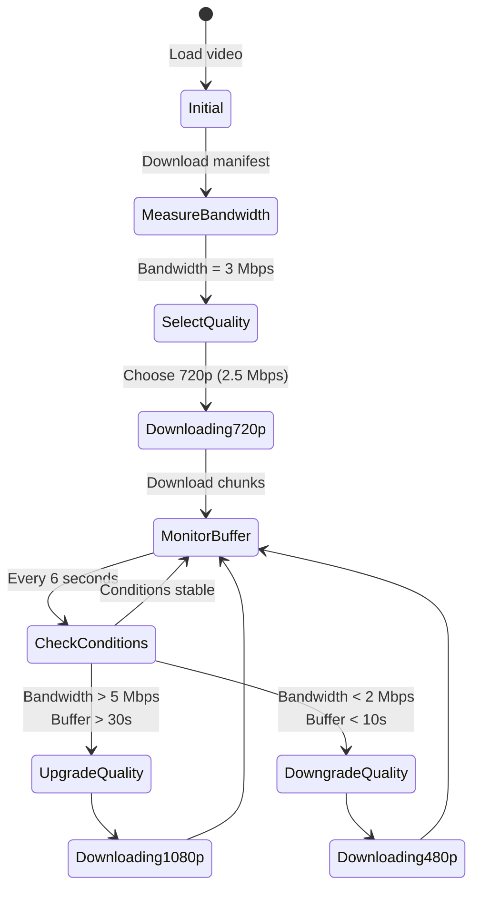
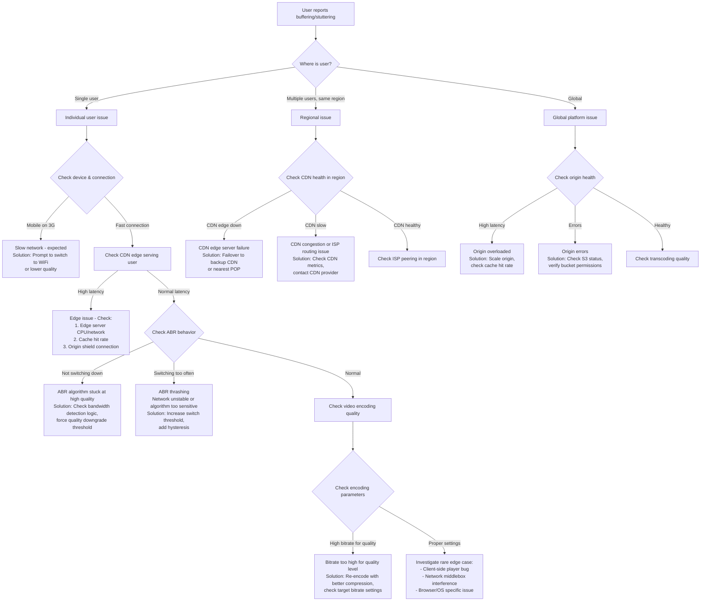
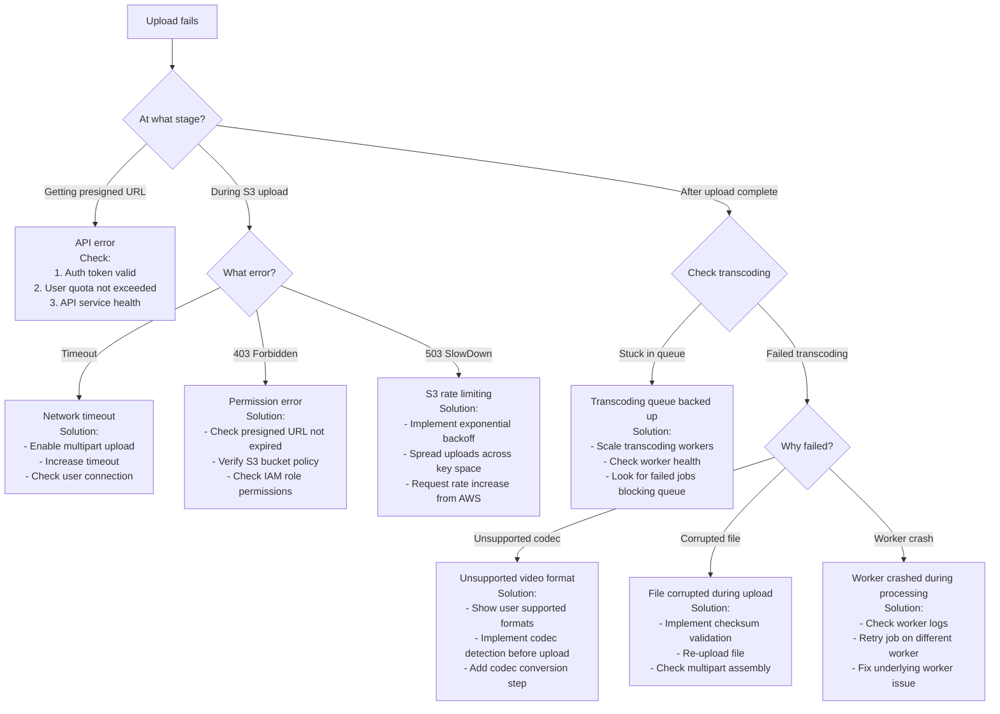
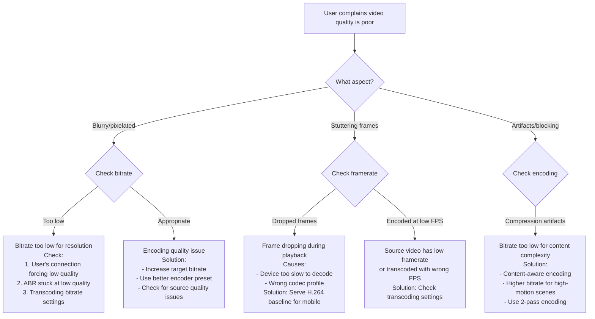

#system-design #case-study #advanced

# Design Video Streaming (YouTube / Netflix)

## Intuition (30 sec)

Think of video streaming like a smart TV network. Instead of broadcasting the same quality to everyone, it's like having multiple channels (360p, 720p, 1080p) broadcasting the same show. Your TV automatically switches channels based on your antenna strength. If the signal weakens, it drops to a lower quality channel to avoid interruption. Videos are split into 2-10 second chunks, so switching quality happens seamlessly between chunks, not mid-frame.

---

## Failure-First Scenario

**The Problem:** A startup builds a video platform where users upload videos to their web servers, which then stream them directly to viewers.

**What breaks:**
- **Week 1:** Server crashes during a popular upload - a 2GB video file floods the server's memory
- **Week 2:** Users in Europe complain about 10+ second buffering when loading videos stored in US servers
- **Week 3:** Upload of a single viral video costs thousands in bandwidth (streaming the same 500MB file to 100K users = 50TB transfer)
- **Week 4:** Mobile users on 3G can't watch videos - they're trying to stream 1080p over 2Mbps connections
- **Week 5:** Storage costs explode - storing every user's raw upload without compression or lifecycle management

**The lesson:** Video streaming requires specialized infrastructure (CDN, transcoding, adaptive bitrate, object storage) that's fundamentally different from traditional web applications.

---

## The Question

> "Design a video streaming platform like YouTube."

---

## Step 1: Requirements

**Functional:** Upload videos, stream videos (adaptive quality), search, recommendations, comments, likes
**Non-Functional:** Low buffering (<200ms startup), global delivery, handle large files (GBs), support various devices/bandwidths

---

## Step 2: Estimation

| Metric | Value |
|--------|-------|
| DAU | 200M |
| Videos watched/user/day | 5 |
| Total video views/day | 1B |
| Videos uploaded/day | 500K |
| Average video size (raw) | 500MB |
| Upload bandwidth | 500K × 500MB / 86400 ≈ **~2.9 TB/hr ingested** |
| Storage/day | 500K × 500MB × 3 formats ≈ **750TB/day** |

**Netflix Scale Reference:**
- 260M+ subscribers globally
- 15% of global internet bandwidth during peak hours
- 1 billion+ hours watched per week
- 100+ PB of video content stored

---

## Step 3: Core Definitions

Before diving into architecture, let's define the key technologies:

### Key Technologies

**HLS (HTTP Live Streaming):**
- **Definition:** A video streaming protocol developed by Apple that breaks video into small HTTP-based file segments
- **Purpose:** Enables adaptive bitrate streaming using standard web servers and CDNs
- **How it works:** Splits video into 2-10 second chunks (.ts files) with a manifest file (.m3u8) listing available quality levels

**DASH (Dynamic Adaptive Streaming over HTTP):**
- **Definition:** An international standard for adaptive bitrate streaming similar to HLS
- **Purpose:** Provides a codec-agnostic alternative to HLS with wider industry support
- **Difference from HLS:** Uses .mpd manifest files instead of .m3u8; supports more codecs out of the box

**ABR (Adaptive Bitrate Streaming):**
- **Definition:** A technique that dynamically adjusts video quality based on network conditions and device capabilities
- **Purpose:** Provides smooth playback without buffering by switching between quality levels
- **How it works:** Client measures bandwidth every few seconds and requests appropriate quality chunks from the CDN

**Transcoding:**
- **Definition:** The process of converting a video from one format/resolution/codec to another
- **Purpose:** Create multiple quality levels and formats for different devices and bandwidths
- **Typical outputs:** 360p, 480p, 720p, 1080p, 4K in H.264, VP9, AV1 codecs

**CDN (Content Delivery Network):**
- **Definition:** A geographically distributed network of proxy servers that cache and serve content from locations close to users
- **Purpose:** Reduce latency, decrease origin load, and improve reliability for content delivery
- **For video:** Caches popular video chunks at edge locations worldwide

**Video Codec:**
- **Definition:** An algorithm that compresses and decompresses video data
- **Purpose:** Reduce file sizes while maintaining quality (a 1080p raw video can be 1GB/min; H.264 compresses to ~50MB/min)
- **Common codecs:** H.264 (most compatible), H.265/HEVC (better compression), VP9 (Google), AV1 (open, best compression)

**Object Storage:**
- **Definition:** A storage architecture that manages data as objects (vs. file systems or blocks)
- **Purpose:** Highly scalable, durable, cost-effective storage for large amounts of unstructured data
- **For video:** Stores raw uploads and transcoded outputs (S3, Google Cloud Storage, Azure Blob)

---

## Step 3: High-Level Design



**Component Definitions:**
- **Upload Service:** Generates presigned URLs for direct S3 uploads, bypassing application servers
- **Transcoding Pipeline:** Asynchronous job system that processes videos in parallel
- **CDN:** Serves 90%+ of video traffic from edge caches
- **Metadata Service:** Stores video info, status, view counts (but not video files themselves)

---

## Step 4: Deep Dive

### Upload Pipeline - Visual Flow



**Step-by-step Upload Flow:**

1. **Request Presigned URL:**
   - **Definition:** A time-limited URL with embedded AWS credentials that allows direct uploads to S3
   - **Why:** Avoids proxying multi-GB files through application servers, saves bandwidth and compute
   - **Security:** URL expires after 15 minutes, includes specific object key and permissions

2. **Direct S3 Upload:**
   - **Multipart upload:** Splits large files into chunks (5MB-5GB each), uploads in parallel
   - **Resume capability:** Failed chunks can be retried without re-uploading entire file
   - **Client-side:** Mobile apps and web browsers upload directly to S3

3. **S3 Event Triggers Pipeline:**
   - **S3 Event Notification:** Automatic trigger when object is created in bucket
   - **Event contains:** Bucket name, object key, size, timestamp
   - **Sent to:** SQS queue or Kafka topic for durability and retry logic

4. **Parallel Transcoding:**
   - **Worker fleet:** Auto-scaling EC2 instances or containers pull jobs from queue
   - **Per-resolution jobs:** Each quality level is an independent job for parallelism
   - **Tools:** FFmpeg (open-source), AWS MediaConvert, or specialized hardware encoders
   - **Output:** HLS segments (.m3u8 manifest + .ts chunks) or DASH (.mpd + .m4s chunks)

5. **Generate Thumbnails:**
   - **Preview images:** Extract frames at 0%, 25%, 50%, 75%, 100% of video duration
   - **Animated previews:** Create sprite sheets or WebP animations for video hover previews
   - **Poster image:** First frame or manually selected thumbnail

6. **Update Metadata:**
   - **Status transition:** "uploading" → "processing" → "ready" or "failed"
   - **Store:** Duration, resolution, codec, file sizes, S3 paths for each quality
   - **Notify:** Uploader via webhook or WebSocket that video is ready

### Adaptive Bitrate Streaming (ABR) - Detailed Flow

**ABR Definition:**
- **What it is:** A streaming technique where the client dynamically selects video quality based on available bandwidth
- **Why it exists:** Prevents buffering on slow networks while maximizing quality on fast networks
- **Key principle:** Better to watch lower quality smoothly than buffer on high quality

**Video Structure for ABR:**

Video isn't streamed as one file. It's split into **chunks** (also called "segments"):
- **Chunk duration:** Typically 2-10 seconds each
- **Quality variants:** Each chunk available at 4-8 quality levels
- **Independence:** Each chunk is independently playable

```
Video Timeline:
┌────────┬────────┬────────┬────────┐
│ 0-6s   │ 6-12s  │ 12-18s │ 18-24s │
└────────┴────────┴────────┴────────┘

Each chunk exists in multiple qualities:
Chunk 1 (0-6s):
  ├── 360p  (800 KB)
  ├── 480p  (1.5 MB)
  ├── 720p  (3 MB)
  └── 1080p (6 MB)
```

**HLS (HTTP Live Streaming) Structure:**

```
manifest.m3u8 (master playlist):
──────────────────────────────────────
  #EXTM3U
  #EXT-X-VERSION:3

  # 1080p variant
  #EXT-X-STREAM-INF:BANDWIDTH=5000000,RESOLUTION=1920x1080,CODECS="avc1.64001f,mp4a.40.2"
  1080p/playlist.m3u8

  # 720p variant
  #EXT-X-STREAM-INF:BANDWIDTH=2500000,RESOLUTION=1280x720,CODECS="avc1.64001f,mp4a.40.2"
  720p/playlist.m3u8

  # 480p variant
  #EXT-X-STREAM-INF:BANDWIDTH=1000000,RESOLUTION=854x480,CODECS="avc1.64001f,mp4a.40.2"
  480p/playlist.m3u8

  # 360p variant
  #EXT-X-STREAM-INF:BANDWIDTH=600000,RESOLUTION=640x360,CODECS="avc1.64001f,mp4a.40.2"
  360p/playlist.m3u8


720p/playlist.m3u8 (media playlist):
──────────────────────────────────────
  #EXTM3U
  #EXT-X-VERSION:3
  #EXT-X-TARGETDURATION:6

  #EXTINF:6.0,
  segment_001.ts
  #EXTINF:6.0,
  segment_002.ts
  #EXTINF:6.0,
  segment_003.ts
  ...
```

**Key HLS Terms:**
- **BANDWIDTH:** Bitrate in bits/second needed for this variant
- **RESOLUTION:** Video dimensions (width x height)
- **CODECS:** Video and audio codec used (avc1 = H.264, mp4a = AAC)
- **TARGETDURATION:** Maximum segment duration in seconds
- **EXTINF:** Duration of the following segment

**ABR Algorithm Flow:**



**ABR Decision Logic:**

```
EVERY chunk download:
  1. Measure download time
     Download Speed = Chunk Size / Download Time
     Example: 3 MB / 0.8 sec = 3.75 MB/s = 30 Mbps

  2. Check buffer health
     Buffer = seconds of video already downloaded
     Safe: > 30 seconds buffered
     Warning: < 15 seconds buffered
     Critical: < 5 seconds buffered

  3. Decide quality for NEXT chunk
     IF download_speed > 1.5 × current_bitrate AND buffer > 30s:
       Upgrade to next quality level

     IF download_speed < current_bitrate OR buffer < 15s:
       Downgrade to lower quality level

     ELSE:
       Keep current quality
```

**Why Chunking Works:**

1. **Fast Quality Switching:**
   - Switching happens between chunks (every 6 seconds)
   - No need to re-download already-buffered content
   - Smooth transition without interruption

2. **CDN Cache Efficiency:**
   - Popular chunks cached at edge servers
   - Unpopular parts of videos only cached on-demand
   - Different users can request different quality levels from same cache

3. **HTTP Compatibility:**
   - Uses standard HTTP GET requests
   - Works with existing CDNs, load balancers, firewalls
   - No special streaming servers required (unlike RTMP)

**Playback Flow Example:**

```
User starts video on 4G connection (5 Mbps):

Time 0s:   Player downloads manifest.m3u8
           Sees qualities: 360p (0.6 Mbps), 480p (1 Mbps), 720p (2.5 Mbps), 1080p (5 Mbps)
           Measures bandwidth: ~5 Mbps
           Decides: Start with 720p (safe buffer margin)

Time 1s:   Downloads chunk_001.ts (720p, 3 MB)
           Download took 0.7s (fast)
           Buffer: 6 seconds of video

Time 7s:   Downloads chunk_002.ts (720p, 3 MB)
           Download took 0.6s (fast)
           Buffer: 12 seconds

Time 13s:  Bandwidth drops to 2 Mbps (user entering tunnel)
           Downloads chunk_003.ts (720p, 3 MB)
           Download took 1.5s (slow!)
           Buffer: 16.5 seconds
           Decision: Switch to 480p for next chunk

Time 19s:  Downloads chunk_004.ts (480p, 1.5 MB)
           Download took 0.6s (fast again)
           Buffer: 22.5 seconds
           Quality switch was seamless - happened between chunks

Quality changes are invisible to user if done between segments!
```

### CDN Strategy - Tiered Caching

**CDN Definitions:**

**Edge Server:**
- **Definition:** A cache server located geographically close to end users (e.g., in major cities)
- **Purpose:** Serve content with minimal latency (typically 10-50ms)
- **For video:** Caches popular video chunks, serves 70-90% of requests

**Origin Server:**
- **Definition:** The primary storage location where all content originally resides
- **Purpose:** Source of truth; edge servers fetch content from origin when not cached
- **For video:** S3 buckets containing all transcoded videos

**POP (Point of Presence):**
- **Definition:** A physical location with network equipment and servers (may contain multiple edge servers)
- **Purpose:** Regional presence for content delivery
- **Scale:** Large CDNs have 100-300+ POPs globally

**Cache Hit:**
- **Definition:** When requested content is found in the cache and served directly
- **Metric:** Cache Hit Rate = (hits / total requests) × 100%
- **Target:** 90%+ for video platforms (popular content cached)

**Cache Miss:**
- **Definition:** When content is not in cache and must be fetched from origin
- **Impact:** Higher latency, increased origin load
- **Mitigation:** Pre-warming cache for new popular content

**CDN Architecture for Video:**

```
┌─────────────────────────────────────────────────────────────┐
│                        INTERNET                             │
└─────────────────────────────────────────────────────────────┘
              │                │                │
              │                │                │
    ┌─────────▼─────┐  ┌───────▼──────┐  ┌─────▼───────┐
    │ Edge: New York │  │ Edge: London │  │ Edge: Tokyo │
    │                │  │              │  │             │
    │ Hot content:   │  │ Hot content: │  │ Hot content:│
    │ • Viral videos │  │ • UK popular │  │ • JP popular│
    │ • New uploads  │  │ • Global hit │  │ • Anime     │
    │                │  │              │  │             │
    │ Cache: 20 TB   │  │ Cache: 20 TB │  │ Cache: 20 TB│
    │ Hit rate: 92%  │  │ Hit rate: 89%│  │ Hit rate: 91%│
    └────────┬───────┘  └──────┬───────┘  └──────┬──────┘
             │                 │                  │
             │ Cache miss      │ Cache miss       │ Cache miss
             └────────┬────────┴──────────────────┘
                      │
                ┌─────▼──────────────┐
                │  Regional Origin   │
                │  (Mid-tier cache)  │
                │                    │
                │  Stores: Long-tail │
                │  Regional content  │
                │                    │
                │  Cache: 100 TB     │
                └─────┬──────────────┘
                      │ Final cache miss
                      │
                ┌─────▼──────────────┐
                │   Origin Storage   │
                │   (S3/GCS/Azure)   │
                │                    │
                │ All videos: 10 PB  │
                │ Hit rate: ~5%      │
                │ (Most served by    │
                │  edge caches)      │
                └────────────────────┘
```

**Caching Strategy by Content Type:**

| Content Type | Strategy | Cache Location | TTL | Example |
|--------------|----------|----------------|-----|---------|
| **Viral/Popular** | Pre-warm all edges | All edge servers | 7 days | Latest trending video |
| **New Uploads** | Cache on first request | First-access edge | 30 days | User's new upload |
| **Long-tail** | Regional caching | Regional POPs | 90 days | Old tutorial video |
| **Live Streaming** | Push to edges | All edges (real-time) | 30 sec | Live sports event |
| **VOD Library** | Pull on-demand | Origin → Edge on miss | 365 days | Old movie catalog |

**Cache Warming (Pre-population):**

```
When new popular content is uploaded:

1. Predict popularity:
   - Channel has 1M+ subscribers
   - Video premiere scheduled
   - Paid promotion active

2. Pre-warm strategy:
   - Push 360p, 480p to ALL edge servers (small files, wide reach)
   - Push 720p, 1080p to major metro edges only
   - Keep 4K at regional origins (niche audience)

3. Result:
   - First viewers get instant cache hits
   - No origin load spike
   - Smooth launch experience
```

**Real-World CDN Strategies:**

**Netflix Open Connect (OCA):**
- **Architecture:** Netflix builds custom storage servers and places them directly in ISP datacenters
- **Scale:** 1000+ locations globally, typically 100-200TB per server
- **How it works:**
  - During off-peak hours (2am-6am), OCA servers pre-fetch predicted content from AWS
  - During peak hours (7pm-11pm), 95%+ of streams served from ISP's own network
  - No internet transit costs for ISPs, faster for users
- **Content selection:** Predictive algorithm determines what to cache based on regional viewing patterns

**YouTube's Multi-CDN Approach:**
- **Strategy:** Uses own infrastructure + third-party CDNs (Akamai, Cloudflare, Fastly)
- **Load balancing:** Client receives manifest with multiple CDN URLs, selects fastest
- **Intelligent routing:**
  - Measures latency to each CDN
  - Prefers ISP-local caches when available
  - Falls back to alternative CDN if primary is slow
- **Geographic optimization:** Popular videos in India cached on Indian CDN nodes

**Cache Eviction Policy (LRU - Least Recently Used):**

```
Edge server has 20TB cache, now full:

┌──────────────────────────────────────┐
│  Video Chunk Cache (20TB / 20TB)    │
├──────────────────────────────────────┤
│  video_123_720p_chunk05  Last: 2min  │ ← Recently used, keep
│  video_456_1080p_chunk01 Last: 5min  │ ← Recently used, keep
│  video_789_480p_chunk10  Last: 1hr   │ ← Aging out
│  video_111_360p_chunk03  Last: 5hr   │ ← Candidate for eviction
│  video_222_1080p_chunk01 Last: 2day  │ ← Evict first
└──────────────────────────────────────┘

New video_999 requested:
1. Check cache: MISS
2. Need 3MB space
3. Evict oldest: video_222 (2 days since access)
4. Fetch from origin
5. Cache and serve
```

**Monitoring CDN Performance:**

```
┌───────────────────────────────────────────────┐
│          CDN Performance Dashboard            │
├───────────────────────────────────────────────┤
│                                               │
│ Cache Hit Rate: 91.5% ✓                       │
│ Definition: % of requests served from cache   │
│ Target: > 90%                                 │
│                                               │
│ Origin Shield Hit Rate: 97.2% ✓               │
│ Definition: % stopped at mid-tier cache       │
│ Why important: Protects origin from load      │
│                                               │
│ Edge Latency (P95): 45ms ✓                    │
│ Definition: 95% of requests < 45ms            │
│ Target: < 100ms                               │
│                                               │
│ Origin Latency (P95): 180ms ⚠                 │
│ Definition: Cache miss response time          │
│ Alert: > 200ms (only affects 8.5% of traffic) │
│                                               │
│ Bandwidth Saved: 89%                          │
│ Definition: Traffic served by CDN vs origin   │
│ Calculation: 1 - (origin_bytes/total_bytes)   │
│                                               │
└───────────────────────────────────────────────┘
```

### Storage Strategy - S3 Configuration

**Storage Tier Definitions:**

**S3 Standard:**
- **Definition:** Default storage class with immediate access and high durability
- **Latency:** Milliseconds for first-byte retrieval
- **Cost:** ~$0.023/GB/month
- **Use case:** Frequently accessed content (hot videos)

**S3 Standard-IA (Infrequent Access):**
- **Definition:** Storage for data accessed less than once per month
- **Latency:** Milliseconds (same as Standard)
- **Cost:** ~$0.0125/GB/month (45% cheaper) + retrieval fee
- **Use case:** Older videos with moderate view counts

**S3 Glacier:**
- **Definition:** Archive storage for rarely accessed data
- **Latency:** Minutes to hours for retrieval (expedited, standard, or bulk)
- **Cost:** ~$0.004/GB/month (83% cheaper than Standard)
- **Use case:** Old videos, deleted content retention, compliance archives

**S3 Intelligent-Tiering:**
- **Definition:** Automatically moves objects between tiers based on access patterns
- **How it works:** Monitors access; moves to IA after 30 days of no access, to Archive after 90 days
- **Cost:** Small monthly monitoring fee + storage cost of current tier
- **Use case:** Videos with unpredictable access patterns

**Storage Architecture:**

```
┌─────────────────────────────────────────────────────────────┐
│                    Video Storage Pipeline                    │
└─────────────────────────────────────────────────────────────┘

Upload → Raw Storage → Transcoding → Processed Storage → CDN
         (S3 Standard)              (Tiered Storage)

┌──────────────────────────────────────────────────────────────┐
│  S3 Bucket: video-raw                                        │
│  Class: Standard                                             │
│  Lifecycle: Delete after 7 days (after transcoding complete) │
│  Size: ~250 TB (rotating buffer)                             │
│  Cost: $5,750/month                                          │
└──────────────────────────────────────────────────────────────┘
                           │
                           ▼ Transcoding
┌──────────────────────────────────────────────────────────────┐
│  S3 Bucket: video-processed                                  │
│  Multi-tier with Lifecycle Policies:                         │
│                                                              │
│  Tier 1: S3 Standard (0-30 days)                             │
│    • New & trending videos                                   │
│    • Size: 500 TB                                            │
│    • Cost: $11,500/month                                     │
│                                                              │
│  Tier 2: S3 Standard-IA (30-365 days)                        │
│    • Older content, moderate views                           │
│    • Size: 5 PB                                              │
│    • Cost: $62,500/month                                     │
│                                                              │
│  Tier 3: S3 Glacier (365+ days)                              │
│    • Archive content, rare views                             │
│    • Size: 15 PB                                             │
│    • Cost: $60,000/month                                     │
│                                                              │
│  Total Storage: ~20.5 PB                                     │
│  Total Cost: ~$134,000/month                                 │
└──────────────────────────────────────────────────────────────┘
```

**S3 Lifecycle Policy Configuration:**

```json
{
  "Rules": [
    {
      "Id": "TransitionToIA",
      "Status": "Enabled",
      "Filter": {
        "Prefix": "videos/"
      },
      "Transitions": [
        {
          "Days": 30,
          "StorageClass": "STANDARD_IA"
        }
      ]
    },
    {
      "Id": "TransitionToGlacier",
      "Status": "Enabled",
      "Filter": {
        "Prefix": "videos/"
      },
      "Transitions": [
        {
          "Days": 365,
          "StorageClass": "GLACIER"
        }
      ]
    },
    {
      "Id": "DeleteRawUploads",
      "Status": "Enabled",
      "Filter": {
        "Prefix": "raw/"
      },
      "Expiration": {
        "Days": 7
      }
    }
  ]
}
```

**Policy Explanation:**
- **TransitionToIA:** After 30 days, move to Infrequent Access (saves 45% on storage)
- **TransitionToGlacier:** After 1 year, move to Glacier (saves 83% vs Standard)
- **DeleteRawUploads:** Delete source videos after 7 days (transcoded versions kept)

**Exception Handling:**

```
Videos to EXCLUDE from lifecycle policies:
┌────────────────────────────────────────────┐
│  1. Evergreen Content (Always Hot)         │
│     • Creator has premium tier             │
│     • Video has > 10K views/month          │
│     • Marked as "channel trailer"          │
│     → Tag: Lifecycle=Never                 │
│     → Keep in S3 Standard forever          │
│                                            │
│  2. Legally Required Retention             │
│     • User deletion requests (GDPR)        │
│     • Must keep for 30 days then delete    │
│     → Tag: Lifecycle=Compliance            │
│     → Separate bucket with 30-day policy   │
│                                            │
│  3. Live Event Replays                     │
│     • Popular for 48 hours post-event      │
│     • Then drops to archive                │
│     → Custom policy: IA after 3 days       │
└────────────────────────────────────────────┘
```

**S3 + CloudFront Integration:**

```
┌────────────────────────────────────────────────────────────┐
│                  CloudFront Distribution                   │
│                  (CDN for video delivery)                  │
├────────────────────────────────────────────────────────────┤
│                                                            │
│  Origin Configuration:                                     │
│  ┌──────────────────────────────────────────┐             │
│  │ Origin: video-processed.s3.amazonaws.com │             │
│  │ Origin Protocol: HTTPS only              │             │
│  │ Origin Shield: Enabled (us-east-1)       │             │
│  │   Definition: Additional caching layer   │             │
│  │   Purpose: Protect S3 from request spikes│             │
│  └──────────────────────────────────────────┘             │
│                                                            │
│  Cache Behavior:                                           │
│  ┌──────────────────────────────────────────┐             │
│  │ Path: /videos/*.m3u8                     │             │
│  │ TTL: 60 seconds (manifests change)       │             │
│  │                                          │             │
│  │ Path: /videos/*.ts                       │             │
│  │ TTL: 31536000 (1 year - chunks immutable)│             │
│  │                                          │             │
│  │ Compression: Gzip enabled (text files)   │             │
│  │ Query String Forwarding: None            │             │
│  └──────────────────────────────────────────┘             │
│                                                            │
│  Edge Locations: 450+ globally                             │
│  Price Class: All (maximum coverage)                       │
│                                                            │
└────────────────────────────────────────────────────────────┘
```

**CloudFront Cache Configuration Explained:**

```yaml
# Manifest files (.m3u8)
cache_behavior_manifests:
  path_pattern: "*.m3u8"
  ttl: 60  # seconds
  # Why short TTL:
  # - Manifests are small (~2KB)
  # - May update as video processing completes
  # - New qualities added dynamically
  # - Live streams update every few seconds

# Video segments (.ts files)
cache_behavior_segments:
  path_pattern: "*.ts"
  ttl: 31536000  # 1 year
  # Why long TTL:
  # - Segments never change (immutable)
  # - Each chunk has unique URL
  # - Safe to cache forever
  # - Maximizes cache hit rate

# Origin Shield
origin_shield:
  enabled: true
  region: "us-east-1"
  # What it does:
  # - Extra caching layer between CloudFront edges and S3
  # - Multiple edge servers fetch from Shield instead of S3
  # - Reduces S3 GET requests by ~60-80%
  # - Protects against thundering herd problem
```

**Cost Optimization Strategy:**

```
Netflix Scale Example (100 PB total storage):

Without tiering (all S3 Standard):
  100 PB × $0.023/GB = $2,300,000/month

With intelligent tiering:
  Hot (5 PB):    5 PB × $0.023/GB    = $115,000/month
  Warm (25 PB):  25 PB × $0.0125/GB  = $312,500/month
  Cold (70 PB):  70 PB × $0.004/GB   = $280,000/month
  ────────────────────────────────────────────────────
  Total:                               $707,500/month

Monthly savings: $1,592,500 (69% cost reduction)
Annual savings: $19,110,000
```

### Video Metadata Database Schema

```sql
-- Primary video information
CREATE TABLE videos (
  video_id          VARCHAR(36) PRIMARY KEY,     -- UUID
  title             VARCHAR(255) NOT NULL,
  description       TEXT,
  uploader_id       VARCHAR(36) NOT NULL,        -- Foreign key to users table
  duration          INTEGER NOT NULL,            -- Seconds
  status            VARCHAR(20) NOT NULL,        -- 'uploading', 'processing', 'ready', 'failed'

  -- File information
  raw_s3_key        VARCHAR(512),                -- Original upload location
  manifest_url      VARCHAR(512),                -- .m3u8 manifest URL

  -- Video specifications
  original_width    INTEGER,
  original_height   INTEGER,
  original_codec    VARCHAR(50),
  original_bitrate  INTEGER,                     -- Kbps

  -- Available qualities (JSON array)
  qualities         JSONB,                       -- ["360p", "480p", "720p", "1080p"]

  -- Counters (updated via batch jobs, not real-time)
  view_count        BIGINT DEFAULT 0,
  like_count        INTEGER DEFAULT 0,
  comment_count     INTEGER DEFAULT 0,

  -- Timestamps
  created_at        TIMESTAMP NOT NULL,
  published_at      TIMESTAMP,
  updated_at        TIMESTAMP,

  -- Indexes
  INDEX idx_uploader (uploader_id),
  INDEX idx_status (status),
  INDEX idx_published (published_at DESC),
  INDEX idx_views (view_count DESC)
);

-- Video quality variants
CREATE TABLE video_qualities (
  quality_id        SERIAL PRIMARY KEY,
  video_id          VARCHAR(36) NOT NULL,
  quality_label     VARCHAR(10) NOT NULL,        -- '360p', '720p', '1080p'
  width             INTEGER NOT NULL,
  height            INTEGER NOT NULL,
  bitrate           INTEGER NOT NULL,            -- Kbps
  codec             VARCHAR(50) NOT NULL,        -- 'H.264', 'VP9', 'AV1'
  file_size         BIGINT NOT NULL,             -- Bytes
  s3_bucket         VARCHAR(100) NOT NULL,
  s3_key            VARCHAR(512) NOT NULL,
  manifest_url      VARCHAR(512) NOT NULL,       -- HLS manifest for this quality
  created_at        TIMESTAMP NOT NULL,

  FOREIGN KEY (video_id) REFERENCES videos(video_id) ON DELETE CASCADE,
  UNIQUE (video_id, quality_label, codec)
);

-- View events (write-optimized, for analytics)
CREATE TABLE video_views (
  view_id           BIGSERIAL PRIMARY KEY,
  video_id          VARCHAR(36) NOT NULL,
  user_id           VARCHAR(36),                 -- NULL if anonymous
  session_id        VARCHAR(64) NOT NULL,

  -- View metrics
  watch_duration    INTEGER,                     -- Seconds watched
  quality_viewed    VARCHAR(10),                 -- Final quality watched
  completion_rate   DECIMAL(5,2),                -- Percentage watched

  -- Context
  device_type       VARCHAR(20),                 -- 'mobile', 'desktop', 'tv'
  country_code      CHAR(2),
  city              VARCHAR(100),

  -- Timestamps
  started_at        TIMESTAMP NOT NULL,
  ended_at          TIMESTAMP,

  -- Time-series partitioning (partition by month)
  -- This table grows very large (1B+ rows)
  INDEX idx_video_time (video_id, started_at DESC)
) PARTITION BY RANGE (started_at);

-- Create monthly partitions
CREATE TABLE video_views_2026_01 PARTITION OF video_views
  FOR VALUES FROM ('2026-01-01') TO ('2026-02-01');
```

**View Count Strategy - Why Not Real-Time:**

```
Problem: 1 billion views/day

If we UPDATE videos.view_count on every view:
  • 1B writes/day = 11,574 writes/second to videos table
  • Hot videos cause write contention (same row updated millions of times)
  • PostgreSQL row-level locks create bottlenecks
  • Replication lag on read replicas

Traditional approach:
  ❌ UPDATE videos SET view_count = view_count + 1 WHERE video_id = 'xyz'
```

**Solution 1: Redis Counter + Periodic Flush**

```
Architecture:
┌─────────────────────────────────────────────────────────┐
│                    View Event Flow                      │
└─────────────────────────────────────────────────────────┘

User watches video
       │
       ▼
┌─────────────────┐
│  Application    │  INCR views:video_123
│  Server         │  ────────────────────────────►
└─────────────────┘
                                                  ┌──────────────┐
                                                  │    Redis     │
                                                  │              │
                                                  │ views:v_123: │
                                                  │   1,234,567  │
                                                  │              │
                                                  │ Atomic, fast │
                                                  │ O(1) operation│
                                                  └───────┬──────┘
                                                          │
                                      Batch job every 1 minute
                                                          │
                                                          ▼
                                              ┌───────────────────┐
                                              │   PostgreSQL      │
                                              │   videos table    │
                                              │                   │
                                              │ Batch UPDATE:     │
                                              │ SET view_count =  │
                                              │   (select from    │
                                              │    Redis)         │
                                              │                   │
                                              │ Only hot videos   │
                                              │ updated           │
                                              └───────────────────┘

Benefits:
  • Redis INCR is atomic and extremely fast (~100K ops/sec per instance)
  • No database contention
  • View count accuracy: eventual consistency (1-minute lag acceptable)
  • DB writes reduced by 99.9% (batch updates every minute vs every view)
```

**Redis Counter Implementation:**

```python
# When user views video
def record_view(video_id: str, user_id: str):
    # Increment Redis counter (fast, atomic)
    redis.incr(f"views:{video_id}")

    # Also track unique viewers (approximate)
    redis.pfadd(f"unique_views:{video_id}", user_id)  # HyperLogLog

    # Log detailed event to analytics pipeline (async)
    kafka.produce("video_views", {
        "video_id": video_id,
        "user_id": user_id,
        "timestamp": now(),
        "quality": "720p",
        "watch_duration": 120
    })

# Background job (runs every minute)
def flush_view_counts_to_db():
    # Get all video IDs with recent views
    video_keys = redis.keys("views:*")

    for key in video_keys:
        video_id = key.split(":")[1]
        view_count = redis.get(key)

        # Batch UPDATE in PostgreSQL
        db.execute("""
            UPDATE videos
            SET view_count = view_count + %s,
                updated_at = NOW()
            WHERE video_id = %s
        """, (view_count, video_id))

        # Reset Redis counter (or use GETDEL in Redis 6.2+)
        redis.delete(key)
```

**Solution 2: Append-Only Table + Materialized View**

```sql
-- Write-optimized: just INSERT, never UPDATE
CREATE TABLE video_view_events (
  video_id VARCHAR(36),
  viewed_at TIMESTAMP,
  -- Partitioned by day for fast pruning
) PARTITION BY RANGE (viewed_at);

-- Batch job creates materialized view
CREATE MATERIALIZED VIEW video_view_counts AS
SELECT
  video_id,
  COUNT(*) as view_count,
  COUNT(DISTINCT user_id) as unique_viewers
FROM video_view_events
WHERE viewed_at >= NOW() - INTERVAL '30 days'
GROUP BY video_id;

-- Refresh every 5 minutes
REFRESH MATERIALIZED VIEW CONCURRENTLY video_view_counts;
```

**Comparison:**

| Approach | Write Speed | Read Speed | Accuracy | Cost |
|----------|-------------|------------|----------|------|
| **Direct DB UPDATE** | ⭐ 100 QPS | ⭐⭐⭐⭐⭐ Real-time | 100% | ⭐ High lock contention |
| **Redis + Flush** | ⭐⭐⭐⭐⭐ 100K QPS | ⭐⭐⭐⭐ Near real-time | 99.9% (1-min lag) | ⭐⭐⭐⭐ Redis memory cost |
| **Append + Mat View** | ⭐⭐⭐⭐ 10K QPS | ⭐⭐⭐ 5-min lag | 100% | ⭐⭐⭐ Storage for append log |

---

## Production Monitoring

### Key Metrics Dashboard

```
┌─────────────────────────────────────────────────────────────────┐
│              VIDEO STREAMING PLATFORM METRICS                   │
├─────────────────────────────────────────────────────────────────┤
│                                                                 │
│  PLAYBACK METRICS                                               │
│  ─────────────────────────────────────────────────────────────  │
│                                                                 │
│  ► Video Start Time (VST): 1.2s (P95)                     ✓    │
│    Definition: Time from click to first frame displayed         │
│    Target: < 2 seconds                                          │
│    Impact: #1 factor in user abandonment                        │
│                                                                 │
│  ► Rebuffering Ratio: 0.3%                                ✓    │
│    Definition: % of playback time spent buffering               │
│    Formula: (buffer_time / watch_time) × 100                    │
│    Target: < 1%                                                 │
│    Alert: > 2% indicates network or CDN issues                  │
│                                                                 │
│  ► Video Playback Failures: 0.05%                         ✓    │
│    Definition: % of play attempts that fail to start            │
│    Common causes: Transcoding errors, CDN misconfig             │
│    Target: < 0.1%                                               │
│                                                                 │
│  ► Average Bitrate: 2.8 Mbps                              ✓    │
│    Definition: Average quality level being streamed             │
│    Indicates: Network capacity of user base                     │
│    Trend: Rising = users have better internet                   │
│                                                                 │
│  UPLOAD METRICS                                                 │
│  ─────────────────────────────────────────────────────────────  │
│                                                                 │
│  ► Upload Success Rate: 98.5%                             ✓    │
│    Definition: % of uploads that complete successfully          │
│    Target: > 98%                                                │
│    Failure modes: Timeout, invalid format, quota exceeded       │
│                                                                 │
│  ► Transcoding Time (P95): 2.5 min                        ✓    │
│    Definition: Time from upload complete to video ready         │
│    For: 10-minute 1080p video                                   │
│    Target: < 3x video duration for 1080p                        │
│    Alert: > 30 min indicates worker backlog                     │
│                                                                 │
│  ► Transcoding Queue Depth: 1,234 jobs                    ✓    │
│    Definition: Number of videos waiting to be processed         │
│    Target: < 5,000 (< 10 min backlog)                          │
│    Alert: > 50,000 = need to scale workers                      │
│                                                                 │
│  INFRASTRUCTURE METRICS                                         │
│  ─────────────────────────────────────────────────────────────  │
│                                                                 │
│  ► CDN Bandwidth: 850 Gbps                                ✓    │
│    Definition: Total data being streamed to users               │
│    Peak: 1.2 Tbps (primetime 8-10pm)                           │
│    Cost: ~$0.02/GB = $5.4M/month at this rate                   │
│                                                                 │
│  ► Origin Requests: 12K QPS                               ✓    │
│    Definition: Cache misses hitting origin storage              │
│    Should be: < 10% of total requests (90%+ cache hit)          │
│    Alert: Sudden spike = cache misconfiguration                 │
│                                                                 │
│  ► S3 Storage Growth: +850 TB/day                         ✓    │
│    Definition: Net storage increase after lifecycle policies    │
│    Expected: 500K uploads × 1.7GB avg = 850 TB                 │
│    Monitor: Unexpected growth = lifecycle policy failure        │
│                                                                 │
│  ► Database Connections: 450 / 500                        ⚠    │
│    Definition: Active PostgreSQL connections                    │
│    Target: < 80% of max                                         │
│    Action: Nearing limit, consider connection pooling           │
│                                                                 │
│  USER EXPERIENCE METRICS                                        │
│  ─────────────────────────────────────────────────────────────  │
│                                                                 │
│  ► Engagement Rate: 68%                                   ✓    │
│    Definition: % of video watched on average                    │
│    Calculation: avg(watch_duration / video_duration)            │
│    Benchmark: YouTube ~55%, Netflix ~70%                        │
│                                                                 │
│  ► Quality Switches per Session: 2.1                      ✓    │
│    Definition: Avg ABR quality changes during playback          │
│    Target: < 3 (too many = unstable network)                    │
│    Too low: < 1 may indicate ABR not adapting                   │
│                                                                 │
└─────────────────────────────────────────────────────────────────┘
```

### Alerting Thresholds

```yaml
alerts:
  critical:
    # Impacts all users immediately
    - metric: video_start_time_p95
      threshold: "> 5s"
      action: "Page on-call engineer"
      reason: "Users abandoning before video starts"

    - metric: rebuffering_ratio
      threshold: "> 5%"
      action: "Page on-call + notify CDN team"
      reason: "Widespread buffering = network/CDN issue"

    - metric: upload_success_rate
      threshold: "< 90%"
      action: "Page on-call engineer"
      reason: "Creators can't upload content"

  warning:
    # Performance degradation
    - metric: transcoding_time_p95
      threshold: "> 5x video duration"
      action: "Slack alert to eng team"
      reason: "Processing backlog building up"

    - metric: cdn_cache_hit_rate
      threshold: "< 85%"
      action: "Alert DevOps team"
      reason: "Increased origin load and costs"

    - metric: database_connection_utilization
      threshold: "> 80%"
      action: "Alert database team"
      reason: "Risk of connection exhaustion"

  info:
    # Informational, no immediate action
    - metric: storage_growth
      threshold: "> 1 PB/day"
      action: "Daily report to finance"
      reason: "Cost tracking"
```

---

## Capacity Planning (Netflix Scale)

### Traffic Estimation

**Netflix-scale capacity planning:**

```
Given:
  • 260M active subscribers
  • Average 2 hours watched per day per subscriber
  • Average bitrate: 3 Mbps (mix of SD, HD, 4K)

Calculate bandwidth requirements:

Step 1: Total streaming hours per day
  260M users × 2 hours/day = 520M hours/day

Step 2: Peak concurrency
  • Peak time: 8-10pm in each timezone
  • ~15% of daily views happen in peak 2-hour window
  • 520M hours/day × 15% = 78M hours in 2-hour peak
  • Concurrent viewers: 78M hours / 2 hours = 39M concurrent

Step 3: Peak bandwidth required
  • 39M concurrent × 3 Mbps = 117M Mbps = 117 Tbps
  • This is ~15% of global internet traffic during peak!

Step 4: CDN capacity needed
  • Target: 90% served by edge cache
  • Need 450+ edge locations globally
  • Each location: 260 Gbps capacity (117 Tbps / 450)
  • Per location: ~100-200TB cache storage

Step 5: Origin capacity (10% cache miss)
  • 117 Tbps × 10% = 11.7 Tbps from origin
  • S3 request rate: ~5M requests/second (manifest + chunk requests)
  • Origin bandwidth cost: 11.7 Tbps × $0.05/GB = massive
  • This is why Netflix built Open Connect (ISP-direct delivery)
```

### Transcoding Capacity

```
Transcoding requirements:

Given:
  • 500K uploads per day
  • Average raw video: 10 minutes, 1080p, 500MB
  • Transcode to: 360p, 480p, 720p, 1080p (4 qualities)
  • Transcoding speed: 1x real-time per quality (10 min video = 10 min processing)

Calculate worker fleet size:

Step 1: Total processing time needed
  500K videos × 10 min × 4 qualities = 20M minutes/day
  = 333,333 minutes/hour = 5,556 hours/hour
  (This is the "hour-hours" of work per hour)

Step 2: Workers needed for real-time processing
  To process in real-time (no backlog):
  5,556 concurrent transcoding workers needed

Step 3: Account for peaks and failures
  • Uploads are not evenly distributed (peak during business hours)
  • Peak upload rate: 3x average = 16,668 workers needed during peak
  • Add 20% buffer for failures/maintenance: 20,000 workers

Step 4: Worker specifications
  • Each worker: 8 vCPU, 16 GB RAM (for 1080p transcoding)
  • Cost: ~$0.40/hour per worker (EC2 c5.2xlarge spot instances)
  • Daily cost: 20,000 workers × $0.40/hr × 24hr = $192,000/day
  • Monthly cost: ~$5.8M/month for transcoding infrastructure

Optimization:
  • Use GPU-accelerated transcoding: 10x faster, 50% cost savings
  • Use codec-specific hardware (NVENC, QuickSync): 20x faster
  • Revised cost with hardware acceleration: ~$300K/month
```

### Storage Capacity

```
Storage growth:

Daily uploads:
  • 500K videos/day
  • Average 500MB raw
  • Total raw: 250 TB/day

After transcoding (multiple qualities):
  • 360p: 50MB per video  = 25 TB/day
  • 480p: 100MB per video = 50 TB/day
  • 720p: 200MB per video = 100 TB/day
  • 1080p: 400MB per video = 200 TB/day
  • Total processed: 375 TB/day

Daily storage growth: 625 TB/day (raw + processed)
Monthly: 18.75 PB/month
Annual: 225 PB/year

Cost projection (with lifecycle policies):
  • Month 1: 18.75 PB × $0.023/GB = $431K (all in S3 Standard)
  • Month 12: Tiered storage
    - Hot (5%): 11.25 PB × $0.023 = $259K
    - Warm (20%): 45 PB × $0.0125 = $563K
    - Cold (75%): 168.75 PB × $0.004 = $675K
    Total: $1.5M/month for 225 PB
```

---

## Troubleshooting Decision Tree

### Problem: User Reports Buffering



### Problem: Upload Failure



### Problem: Poor Video Quality



---

## Real-World Architecture Examples

### Netflix Architecture

**Overview:**
- **Scale:** 260M+ subscribers, 15% of global internet bandwidth at peak
- **Philosophy:** Control entire stack from encoding to delivery for optimal quality

**Upload & Processing Pipeline:**

```
┌─────────────────────────────────────────────────────────┐
│            NETFLIX CONTENT INGESTION                    │
└─────────────────────────────────────────────────────────┘

Studio/Creator
      │
      ▼ Upload (often physical drives delivered)
┌─────────────────┐
│  AWS S3 Bucket  │  Raw master files (4K ProRes, 200+ GB)
└────────┬────────┘
         │
         ▼ Trigger
┌─────────────────────────────────────────┐
│     Content Processing Pipeline         │
│                                         │
│  1. Video Analysis:                     │
│     - Scene detection                   │
│     - Complexity scoring                │
│     - Optimal bitrate calculation       │
│                                         │
│  2. Per-Title Encoding:                 │
│     Definition: Custom encode settings  │
│     per video instead of fixed bitrates │
│                                         │
│     Example:                            │
│     - Action scene: 8 Mbps for 1080p    │
│     - Dialogue scene: 3 Mbps for 1080p  │
│                                         │
│     Benefit: 50% bandwidth savings      │
│     while maintaining quality           │
│                                         │
│  3. Multiple codecs:                    │
│     - H.264 (legacy devices)            │
│     - H.265/HEVC (modern, 50% smaller)  │
│     - VP9 (Chrome, 40% smaller)         │
│     - AV1 (newest, 50% smaller than VP9)│
│                                         │
│  4. Quality profiles:                   │
│     - 23 different versions per title!  │
│     - 240p through 4K                   │
│     - Multiple audio tracks/subtitles   │
└─────────────────────────────────────────┘
         │
         ▼
┌─────────────────────────────────────────┐
│    Open Connect CDN (OCA)               │
│                                         │
│    Custom-built servers placed in       │
│    ISP datacenters worldwide            │
│                                         │
│    • 1000+ locations                    │
│    • Each: 100-200TB SSD storage        │
│    • Pre-fetch content overnight        │
│    • 95%+ served from ISP's network     │
│                                         │
│    Location strategy:                   │
│    - Negotiate with ISPs for rack space │
│    - Free bandwidth for ISP             │
│    - Ultra-low latency for users        │
└─────────────────────────────────────────┘
```

**Netflix ABR Algorithm (Per-Title Optimization):**

```python
# Simplified Netflix per-title encoding logic

def netflix_encode_video(video_file):
    """
    Netflix doesn't use fixed bitrates like "2.5 Mbps for 720p"
    Instead, analyzes each video's complexity
    """

    # Step 1: Analyze video complexity
    complexity_score = analyze_content(video_file)
    # Returns 1-10, where 10 = high action/detail

    # Step 2: Determine bitrate ladder per scene
    if complexity_score > 8:  # Action movie
        bitrate_ladder = {
            "4K": 16_000,    # Kbps
            "1080p": 8_000,
            "720p": 5_000,
            "480p": 2_500
        }
    elif complexity_score < 3:  # Dialogue-heavy
        bitrate_ladder = {
            "4K": 10_000,
            "1080p": 4_000,
            "720p": 2_000,
            "480p": 1_000
        }
    else:  # Balanced content
        bitrate_ladder = {
            "4K": 13_000,
            "1080p": 6_000,
            "720p": 3_500,
            "480p": 1_500
        }

    # Step 3: Encode with optimized settings
    for resolution, bitrate in bitrate_ladder.items():
        encode_video(video_file, resolution, bitrate)

    # Result: 50% bandwidth savings vs fixed bitrates
    # while maintaining same perceived quality
```

**Netflix Client-Side ABR:**

```
Netflix player makes quality decisions based on:

1. Network throughput (measured continuously)
2. Device capability (CPU, screen size, codec support)
3. User preference (data saver mode, quality settings)
4. Buffer health (seconds of video pre-loaded)
5. Content type (prefer higher quality for cinematic content)

Algorithm:
  • Start with mid-quality (720p) for fast startup
  • Measure download speed every 2 chunks
  • If buffer > 30s and bandwidth high: upgrade
  • If buffer < 10s: immediately downgrade
  • Avoid "thrashing" (rapid quality switches) by adding 10s cooldown
```

**Key Innovations:**
- **Per-title encoding:** Saves 50% bandwidth while maintaining quality
- **Open Connect:** Eliminates internet transit costs, improves latency
- **AV1 codec:** Newest streams use AV1 for 50% smaller files vs H.265
- **Dynamic optimizer:** Continuously tests encode settings to find optimal quality/bitrate

---

### YouTube Architecture

**Overview:**
- **Scale:** 2.5B+ users, 500 hours of video uploaded per minute
- **Challenge:** Handle massive upload volume and long-tail content (billions of videos)

**Content Pipeline:**

```
┌─────────────────────────────────────────────────────────┐
│            YOUTUBE UPLOAD PIPELINE                      │
└─────────────────────────────────────────────────────────┘

User uploads video
      │
      ▼
┌─────────────────────┐
│  Edge Upload Server │  Nearest server to user (reduced latency)
│  (Google DC)        │
└──────────┬──────────┘
           │ Uploads to nearest datacenter first
           ▼
┌─────────────────────────────────────┐
│  Google Cloud Storage (origin)      │
└──────────┬──────────────────────────┘
           │
           ▼ Trigger Cloud Pub/Sub
┌──────────────────────────────────────────────┐
│       Distributed Transcoding Fleet          │
│                                              │
│  1. Parallel processing:                     │
│     - Split video into 30-second segments    │
│     - Each segment transcoded independently  │
│     - 10-min video = 20 parallel jobs        │
│     - Completes in ~1 minute vs 10 minutes   │
│                                              │
│  2. Progressive rendering:                   │
│     Definition: Make video playable BEFORE   │
│     all qualities finish transcoding         │
│                                              │
│     Timeline:                                │
│     t=30s:  360p ready → video goes live     │
│     t=60s:  480p ready → added to player     │
│     t=120s: 720p ready → added to player     │
│     t=300s: 1080p ready → added to player    │
│                                              │
│     Benefit: Video playable 5x faster        │
│                                              │
│  3. Codec priority:                          │
│     - H.264 first (universal compatibility)  │
│     - VP9 second (Chrome users, Google codec)│
│     - AV1 for popular videos only (expensive)│
└──────────────────────────────────────────────┘
           │
           ▼
┌────────────────────────────────────────────────┐
│      Multi-CDN Strategy                        │
│                                                │
│  YouTube uses 3-tier delivery:                 │
│                                                │
│  Tier 1: Google Global Cache (GGC)            │
│    - Google-owned edge servers in ISPs        │
│    - Serves 70% of traffic                    │
│    - Free for ISPs (similar to Netflix OCA)   │
│                                                │
│  Tier 2: Google CDN                           │
│    - Google's own CDN infrastructure          │
│    - Serves 20% of traffic                    │
│    - Backup when GGC not available            │
│                                                │
│  Tier 3: Partner CDNs                         │
│    - Akamai, Cloudflare, etc.                 │
│    - Serves 10% (hard-to-reach regions)       │
│    - Failover and geographic fill-in          │
└────────────────────────────────────────────────┘
```

**YouTube's Content-Aware Transcoding:**

```
YouTube analyzes content to optimize encoding:

Video Analysis:
1. Detect content type:
   - Gaming: High motion, high detail → need high bitrate
   - Vlog: Talking head, stable → low bitrate acceptable
   - Music video: Camera motion, effects → medium-high bitrate
   - Screen recording: Mostly static → very low bitrate

2. Adjust encoding:
   # Example for 1080p

   Gaming video:
     bitrate: 12 Mbps
     keyframe: every 2 seconds (frequent scene changes)
     profile: high

   Talking head vlog:
     bitrate: 4 Mbps
     keyframe: every 10 seconds (stable scene)
     profile: main

   Screen recording:
     bitrate: 2 Mbps
     keyframe: every 30 seconds (rare changes)
     profile: main

Result: 3x bitrate difference for same resolution, same perceived quality
```

**YouTube Recommendations Integration:**

```
Video metadata feeds recommendation system:

After transcoding completes:
1. Extract metadata:
   - Video duration
   - Thumbnail quality scores (AI-generated)
   - Audio language detection
   - Scene classifications
   - Visual similarity hash

2. Feed to recommendation engine:
   - "Videos like this one"
   - "Next video to watch"
   - "Home feed suggestions"

3. Engagement prediction:
   - Predict click-through rate based on thumbnail
   - Predict watch time based on content type
   - Adjust recommendations in real-time

This is why YouTube is sticky - content and discovery deeply integrated
```

**Key Innovations:**
- **Progressive rendering:** Video playable before all qualities ready (fast time-to-publish)
- **Segment-parallel transcoding:** 10x faster processing by splitting video
- **Multi-CDN:** Uses own + partner CDNs for maximum reach
- **VP9 codec:** Google's codec used for 70% of Chrome views (smaller than H.264)

---

## Decision Cheat Sheet

### When to Use Which Video Codec

```
IF device == iOS/Safari:
  THEN serve H.264 (only codec Safari supports well)

IF device == Chrome AND video_views > 100K:
  THEN serve VP9 (50% smaller than H.264, Google owns it)
  ELSE serve H.264 (VP9 encoding is expensive, not worth it for unpopular videos)

IF device == modern AND video_views > 1M:
  THEN serve AV1 (50% smaller than VP9)
  ELSE serve VP9 or H.264 (AV1 encoding very expensive)

IF device_age > 5 years:
  THEN serve H.264 baseline profile (guaranteed compatibility)
```

### When to Transcode vs On-Demand

```
IF upload_frequency > 100K/day:
  THEN transcode all qualities immediately (YouTube scale)
  REASON: Users expect all quality levels available

IF upload_frequency < 1K/day:
  THEN transcode 360p + 720p immediately, others on-demand
  REASON: Save on transcoding costs for videos that may never be watched

IF video_type == "live stream":
  THEN transcode in real-time (just-in-time transcoding)
  REASON: Can't pre-process live content

IF predicted_popularity == high:
  THEN transcode all + pre-warm CDN cache
  REASON: Prepare for traffic spike
```

### When to Use Which Storage Tier

```
IF video_age < 30 days OR views_per_day > 100:
  THEN S3 Standard
  REASON: Hot content, frequent access, retrieval cost matters

IF video_age > 30 days AND views_per_day < 10:
  THEN S3 Standard-IA
  REASON: Save 45% on storage, occasional access acceptable

IF video_age > 365 days AND views_per_day < 1:
  THEN S3 Glacier
  REASON: Save 83% on storage, rare access (minutes delay OK)

IF video == "user deleted" AND retention_required_by_law:
  THEN S3 Glacier Deep Archive (cheapest: $0.00099/GB/month)
  REASON: Legal retention only, no user access expected
```

### When to Scale Transcoding Workers

```
IF queue_depth > 10,000 OR queue_wait_time > 30 min:
  THEN scale_workers_up(factor=2)
  REASON: Backlog building, users waiting

IF queue_depth < 1,000 AND avg_cpu_utilization < 30%:
  THEN scale_workers_down(factor=0.5)
  REASON: Overcapacity, wasting money

IF time_of_day == peak_upload_hours (9am-5pm):
  THEN maintain_worker_count(high_capacity)
  REASON: Predictable load, don't react to queue depth

IF upload_spike_detected (2x normal rate):
  THEN scale_workers_up(preemptive, factor=1.5)
  REASON: Prevent queue buildup, proactive scaling
```

---

## Interview Simulation

### Round 1: High-Level Design

> **Interviewer:** Design a video streaming platform like YouTube.

> **Candidate:** Let me start by clarifying requirements and scale. Are we building this for user-generated content like YouTube, or curated content like Netflix?

> **Interviewer:** User-generated content. Think YouTube scale.

> **Candidate:** Got it. Let me outline the functional requirements:
> - Users can upload videos (potentially large files, up to several GB)
> - Users can watch videos with adaptive quality based on their bandwidth
> - Global audience requires low-latency delivery
> - We need to support various devices and network conditions
>
> For scale, let me estimate based on YouTube-like numbers:
> - 200M daily active users
> - 5 videos watched per user per day = 1 billion video views daily
> - 500K uploads per day
> - Average video size of 500MB
>
> This means we're ingesting ~2.9 TB per hour and storing 750TB per day after transcoding to multiple formats.

> **Interviewer:** That sounds right. How would you design this at a high level?

> **Candidate:** I'll split this into two main flows: **upload pipeline** and **streaming pipeline**.
>
> **For uploads:** The key insight is we never want to proxy multi-gigabyte files through our application servers. Instead:
> 1. Client requests upload, gets a presigned S3 URL from our API
> 2. Client uploads directly to S3 (bypasses our servers entirely)
> 3. S3 completion triggers an event to our transcoding pipeline
> 4. Async workers transcode video to multiple resolutions and formats
> 5. Metadata service updates status to "ready"
>
> **For streaming:** Videos are served entirely through CDN:
> 1. Client requests video, gets manifest URL
> 2. Client downloads manifest file (.m3u8) listing available quality levels
> 3. Client measures its bandwidth and chooses appropriate quality
> 4. Client fetches 2-10 second video chunks from CDN edge servers
> 5. Client continuously adapts quality based on network conditions

> **Interviewer:** Why do you chunk the video into 2-10 second segments?

> **Candidate:** Two critical reasons:
>
> **First, adaptive bitrate streaming (ABR):** The player can switch quality between chunks without interruption. If your network drops from 5 Mbps to 2 Mbps, the player can switch from 1080p to 480p at the next chunk boundary. This prevents buffering.
>
> **Second, CDN cache efficiency:** Different parts of a video have different popularity. Maybe everyone watches the first 30 seconds but only 20% watch to the end. By chunking, we can cache the popular beginning at all edge locations while keeping the end at regional caches only. Each chunk is independently cacheable.

> **Interviewer:** Makes sense. How do you handle the massive storage requirements - you said 750TB per day?

> **Candidate:** We use tiered storage with lifecycle policies:
>
> - **S3 Standard** (first 30 days or popular videos): Fast access, ~$23/TB/month
> - **S3 Standard-IA** (30-365 days, moderate views): 45% cheaper at ~$12.50/TB/month
> - **S3 Glacier** (365+ days, rarely viewed): 83% cheaper at ~$4/TB/month
>
> The lifecycle transitions happen automatically. For a platform storing 20 PB total, this saves ~$1.5M per month compared to keeping everything in Standard storage.
>
> We also delete raw uploaded files after 7 days once transcoding completes, keeping only the processed versions.

### Round 2: Deep Dive - Transcoding Pipeline

> **Interviewer:** Walk me through the transcoding pipeline in detail. What happens after a video is uploaded to S3?

> **Candidate:** Let me trace through the entire flow:
>
> 1. **S3 triggers an event** when the upload completes. This event goes to SQS or Kafka for durability.
>
> 2. **Worker fleet pulls jobs from queue.** These are EC2 instances or containers that auto-scale based on queue depth. Each worker runs FFmpeg or uses AWS MediaConvert.
>
> 3. **Parallel transcoding:** We create separate jobs for each quality level:
>    - 360p at 600 Kbps
>    - 480p at 1 Mbps
>    - 720p at 2.5 Mbps
>    - 1080p at 5 Mbps
>
>    These run in parallel, so a 10-minute video completes in ~10 minutes, not 40 minutes.
>
> 4. **HLS segment generation:** Each quality is split into 6-second .ts segments plus a .m3u8 manifest file.
>
> 5. **Upload to processed bucket:** All segments and manifests go to S3.
>
> 6. **Update metadata:** Status changes from "processing" to "ready" in our database.
>
> 7. **Optional: Pre-warm CDN** for predicted popular videos.

> **Interviewer:** How do you decide how many transcoding workers you need?

> **Candidate:** Let me calculate for 500K uploads per day:
>
> - 500K videos × 10 min average × 4 quality levels = 20M minutes of work per day
> - Per hour: 833K minutes of work
> - If transcoding runs at 1x real-time, we need 833K / 60 = ~14K workers
> - Account for peak hours (3x average): 42K workers at peak
> - Add 20% buffer for failures: **50K workers**
>
> We'd use auto-scaling with metrics:
> - **Scale up:** If queue depth > 10K jobs OR wait time > 30 minutes
> - **Scale down:** If queue depth < 1K jobs AND CPU utilization < 30%
>
> Using spot instances saves ~70% vs on-demand: $0.12/hr vs $0.40/hr per worker.

### Round 3: Deep Dive - CDN Strategy

> **Interviewer:** How does the CDN delivery work? What if a video goes viral?

> **Candidate:** The CDN strategy is multi-tiered:
>
> **Normal case (long-tail content):**
> 1. User requests video → routed to nearest edge server (e.g., New York)
> 2. Edge checks cache: MISS (unpopular video)
> 3. Edge fetches from origin (S3) → caches locally
> 4. Serves to user (subsequent users get cache HIT)
>
> **Viral video case:**
> 1. **Detect popularity:** Video getting 1K views/minute (unusual)
> 2. **Pre-warm cache:** Push all quality levels to top 100 edge locations
> 3. **Result:** Next million viewers all get cache hits, no origin load
>
> **Cache hierarchy:**
> ```
> Edge Servers (450+ locations)
>    ↓ miss (10% of traffic)
> Regional POPs (50 locations)
>    ↓ miss (1% of traffic)
> Origin Shield (3 locations)
>    ↓ miss (0.1% of traffic)
> Origin S3 (us-east-1)
> ```
>
> This means 99.9% of traffic never touches origin, only 0.1% does.

> **Interviewer:** How do you monitor if the CDN is working properly?

> **Candidate:** Key metrics I'd monitor:
>
> **CDN Health:**
> - **Cache hit rate:** Target >90%. Below 85% = investigate cache configuration
> - **Origin request rate:** Should be <10% of total requests
> - **Edge latency P95:** Target <100ms. Above 200ms = edge server issues
>
> **User Experience:**
> - **Video Start Time (VST):** Target <2 seconds. #1 factor in user abandonment
> - **Rebuffering ratio:** Target <1% of playback time spent buffering
> - **Playback failure rate:** Target <0.1%
>
> **Infrastructure:**
> - **Bandwidth usage:** Track cost, expect 850 Gbps average, 1.2 Tbps peak
> - **Storage growth:** Should match 750TB/day estimate
>
> I'd alert on:
> - CRITICAL: Video start time >5s OR rebuffering >5% (page on-call)
> - WARNING: Cache hit rate <85% OR transcoding backlog >5x video duration

### Round 4: Deep Dive - Adaptive Bitrate (ABR)

> **Interviewer:** Explain exactly how the player decides which quality to request.

> **Candidate:** Let me walk through the ABR algorithm step by step:
>
> **Initial quality selection:**
> 1. Player downloads the master manifest (.m3u8)
> 2. Sees available qualities: 360p (600 Kbps), 480p (1 Mbps), 720p (2.5 Mbps), 1080p (5 Mbps)
> 3. Performs a quick bandwidth test: downloads a small chunk, measures speed
> 4. Starts at a safe quality: if bandwidth is 4 Mbps, start at 720p (buffer margin)
>
> **Continuous adaptation:**
> ```
> EVERY chunk download:
>   1. Measure: chunk_size / download_time = current_bandwidth
>   2. Check buffer: seconds of video already downloaded
>   3. Decide next quality:
>
>      IF bandwidth > 1.5 × current_bitrate AND buffer > 30s:
>        Upgrade one level (720p → 1080p)
>
>      IF bandwidth < current_bitrate OR buffer < 15s:
>        Downgrade immediately (prevent buffering!)
>
>      IF buffer < 5s:
>        Emergency downgrade to 360p (avoid stall at all costs)
>
>      ELSE:
>        Keep current quality (stability)
> ```
>
> **Example timeline:**
> - t=0s: Start at 720p (3 MB chunks, 6s each)
> - t=6s: Downloaded in 0.7s (fast) → buffer at 6s → keep 720p
> - t=12s: Downloaded in 0.6s (fast) → buffer at 12s → keep 720p
> - t=18s: Downloaded in 2.5s (slow!) → buffer at 15.5s → downgrade to 480p
> - t=24s: 480p chunk (1.5 MB) downloaded in 0.6s → buffer recovering → keep 480p
>
> The key is: **Better to watch smooth 480p than constantly buffering 1080p.**

> **Interviewer:** What if the network is unstable and the player keeps switching qualities?

> **Candidate:** That's called "ABR thrashing" and it's a poor user experience. We prevent it with:
>
> 1. **Hysteresis:** Require quality to be stable for 3+ chunks before upgrading
> 2. **Cooldown period:** After a switch, wait 30 seconds before next switch
> 3. **Buffer threshold:** Only upgrade if buffer >30s (safe margin)
> 4. **Bandwidth averaging:** Use moving average of last 5 chunks, not instant speed
>
> This trades some responsiveness for stability. Users prefer stable quality over rapid switching.

### Round 5: Scaling Considerations

> **Interviewer:** You mentioned Netflix scale earlier. How would this design handle Netflix's 260M subscribers?

> **Candidate:** Netflix operates at massive scale - 15% of global internet traffic at peak. The design needs several enhancements:
>
> **1. Own CDN Infrastructure (Netflix Open Connect):**
> - Don't rely on public CDNs - build custom servers
> - Place servers directly in ISP datacenters (1000+ locations)
> - Pre-fetch content during off-peak hours (2-6am)
> - Serve 95%+ from ISP's own network (no internet transit cost)
>
> **2. Per-Title Encoding:**
> - Don't use fixed bitrates (e.g., "720p = 2.5 Mbps")
> - Analyze each video's complexity
> - Action movie: 8 Mbps for 1080p (high motion)
> - Dialogue show: 3 Mbps for 1080p (low motion)
> - **Result:** 50% bandwidth savings vs fixed bitrates
>
> **3. Advanced Codecs:**
> - H.264 for legacy devices
> - H.265/HEVC for modern devices (50% smaller)
> - AV1 for newest devices (50% smaller than HEVC)
> - **Result:** AV1 saves Netflix ~$50M/year in bandwidth
>
> **4. Predictive Caching:**
> - Machine learning predicts what users will watch
> - Pre-cache predicted content to edge servers
> - Example: New season of popular show → pre-cache all episodes globally
>
> **5. Database Sharding:**
> - Shard metadata by geographic region
> - US users → US database shard
> - EU users → EU database shard
> - Reduces cross-region latency

> **Interviewer:** What about costs? How expensive is this at scale?

> **Candidate:** Let me break down Netflix-scale costs:
>
> **Storage (100 PB):**
> - With tiered storage: ~$700K/month
>
> **Transcoding:**
> - With GPU acceleration: ~$300K/month
>
> **CDN Bandwidth (117 Tbps peak):**
> - Own infrastructure (Open Connect): ~$20M/month in hardware depreciation
> - Public CDN alternative: ~$500M/month (This is why they built their own!)
>
> **Compute (API servers, databases, etc.):**
> - ~$50M/month
>
> **Total infrastructure: ~$70M/month or $840M/year**
>
> Netflix's revenue: ~$33B/year, so infrastructure is ~2.5% of revenue.
>
> The biggest cost is content licensing ($17B/year), not infrastructure.

---

---

## Quick Reference Glossary

### Video Streaming Terminology

| Term | Definition | When You'll See It |
|------|------------|-------------------|
| **HLS** | HTTP Live Streaming - Apple's protocol for adaptive streaming using .m3u8 manifests | Choosing streaming protocol |
| **DASH** | Dynamic Adaptive Streaming over HTTP - international standard for adaptive streaming | Alternative to HLS |
| **ABR** | Adaptive Bitrate Streaming - dynamically adjusting video quality based on bandwidth | Player implementation |
| **Transcoding** | Converting video from one format/resolution to another | Upload pipeline design |
| **Codec** | Compression algorithm (H.264, H.265, VP9, AV1) | Encoding decisions |
| **Bitrate** | Data rate in bits per second (e.g., 2.5 Mbps for 720p) | Quality level configuration |
| **VST** | Video Start Time - latency from click to first frame | Performance metrics |
| **Rebuffering** | Playback pause to load more data | Quality of experience metrics |
| **Chunk/Segment** | Short video piece (2-10 seconds) used for ABR | Understanding streaming mechanics |
| **Manifest** | Playlist file listing available qualities and chunks | Client-side streaming |
| **Cache Hit Rate** | Percentage of requests served from cache vs origin | CDN optimization |
| **Edge Server** | Cache server close to users (low latency) | CDN architecture |
| **Origin** | Primary storage location (e.g., S3) | CDN terminology |
| **Presigned URL** | Time-limited URL with embedded credentials | Direct S3 uploads |
| **Multipart Upload** | Splitting large file uploads into chunks | Upload optimization |
| **Keyframe** | Full video frame (not dependent on other frames) | Codec internals |
| **P-frame** | Predicted frame (delta from previous frame) | Understanding compression |
| **GOP** | Group of Pictures - keyframe + following P/B frames | Encoding settings |

### Performance Targets

| Metric | Target | Critical Threshold | Why It Matters |
|--------|--------|-------------------|----------------|
| Video Start Time (VST) | <2s | >5s | #1 factor in user abandonment |
| Rebuffering Ratio | <1% | >5% | Indicates buffering problems |
| Cache Hit Rate | >90% | <80% | CDN cost and performance |
| Upload Success Rate | >98% | <95% | Creator experience |
| Transcoding Time | <3x duration | >10x duration | Time to publish |
| Playback Failure Rate | <0.1% | >1% | Core functionality broken |

### Bitrate Reference Table

| Resolution | Typical Bitrate | H.264 File Size (10 min) | H.265 File Size (10 min) | Use Case |
|------------|----------------|--------------------------|--------------------------|----------|
| 360p | 600 Kbps | 45 MB | 25 MB | Mobile 3G, low bandwidth |
| 480p | 1 Mbps | 75 MB | 40 MB | Mobile 4G, SD quality |
| 720p | 2.5 Mbps | 188 MB | 100 MB | Desktop, HD quality |
| 1080p | 5 Mbps | 375 MB | 200 MB | Desktop, Full HD |
| 1440p | 10 Mbps | 750 MB | 400 MB | High-end displays |
| 4K | 20 Mbps | 1.5 GB | 800 MB | Premium content |

---

## Building Blocks Used

| Component | Building Block |
|-----------|---------------|
| Video storage | [[02_building_blocks/blob_storage]] (S3) |
| Delivery | [[02_building_blocks/cdn]] |
| Transcoding | [[02_building_blocks/message_queues]] (async pipeline) |
| Metadata | [[02_building_blocks/databases_sql]] |
| Search | [[02_building_blocks/search_systems]] |
| View counts | [[02_building_blocks/caching]] (Redis counters) |

---

## Key Takeaways

### Critical Design Decisions

1. **Never proxy video files through application servers**
   - Use presigned URLs for direct S3 uploads
   - Saves bandwidth, compute, and enables multipart uploads

2. **Chunk videos for ABR and cache efficiency**
   - 2-10 second segments enable seamless quality switching
   - Independent caching of popular vs unpopular segments

3. **Use tiered storage aggressively**
   - Saves 69% on storage costs at scale
   - Automatic lifecycle policies based on age and popularity

4. **CDN is non-negotiable for video**
   - 90%+ cache hit rate reduces origin load by 10x
   - Multi-tier caching (edge → regional → origin)

5. **Batch counter updates, never real-time**
   - Direct DB updates don't scale to billions of views
   - Use Redis + periodic flush or append-only tables

6. **Parallel transcoding for speed**
   - Process multiple qualities simultaneously
   - Segment-level parallelism for 10x faster processing

7. **Content-aware encoding saves bandwidth**
   - Analyze video complexity before encoding
   - Can save 50% bandwidth vs fixed bitrates

### Common Pitfalls

- **Not accounting for peak traffic:** Average traffic ≠ peak traffic (3-5x difference)
- **Ignoring codec compatibility:** Safari only supports H.264, not VP9/AV1
- **Over-optimizing cold start:** 99% of views are repeat views (cached), not first view
- **Underestimating storage growth:** Raw + transcoded + multiple codecs = 3-5x upload size
- **Fixed bitrates for all content:** Dialogue and action scenes need different bitrates

### Interview Pro Tips

**When asked "Design YouTube":**
1. Start with scale estimation (shows you understand scope)
2. Split into upload and streaming flows
3. Emphasize ABR and why chunking is critical
4. Mention CDN strategy and cache hit rates
5. Discuss cost optimization (tiered storage, codec choice)

**Key phrases to use:**
- "Presigned URL for direct S3 upload"
- "Adaptive bitrate streaming using HLS"
- "90%+ CDN cache hit rate"
- "Tiered storage with lifecycle policies"
- "Content-aware per-title encoding"

**Deep dive topics they'll ask:**
- How ABR algorithm decides quality (be specific)
- How to handle viral videos (cache warming)
- How to scale transcoding (queue depth, auto-scaling)
- How to monitor video quality (VST, rebuffering ratio)
- Cost optimization strategies (storage tiers, codecs)

---

## Further Reading

### Academic Papers
- "Towards a Practical Perceptual Video Quality Metric" (Netflix)
- "Understanding the Impact of Video Quality on User Engagement" (YouTube)

### Industry Blogs
- Netflix Tech Blog: https://netflixtechblog.com/ (encoding, CDN, ABR algorithms)
- YouTube Engineering Blog: https://youtube-eng.googleblog.com/ (infrastructure scale)
- Bitmovin Blog: https://bitmovin.com/blog/ (video technology deep dives)

### Tools and Standards
- FFmpeg: https://ffmpeg.org/ (video transcoding)
- HLS Spec: https://datatracker.ietf.org/doc/html/rfc8216
- DASH Spec: https://www.iso.org/standard/79329.html
- AV1 Codec: https://aomedia.org/ (next-gen compression)
