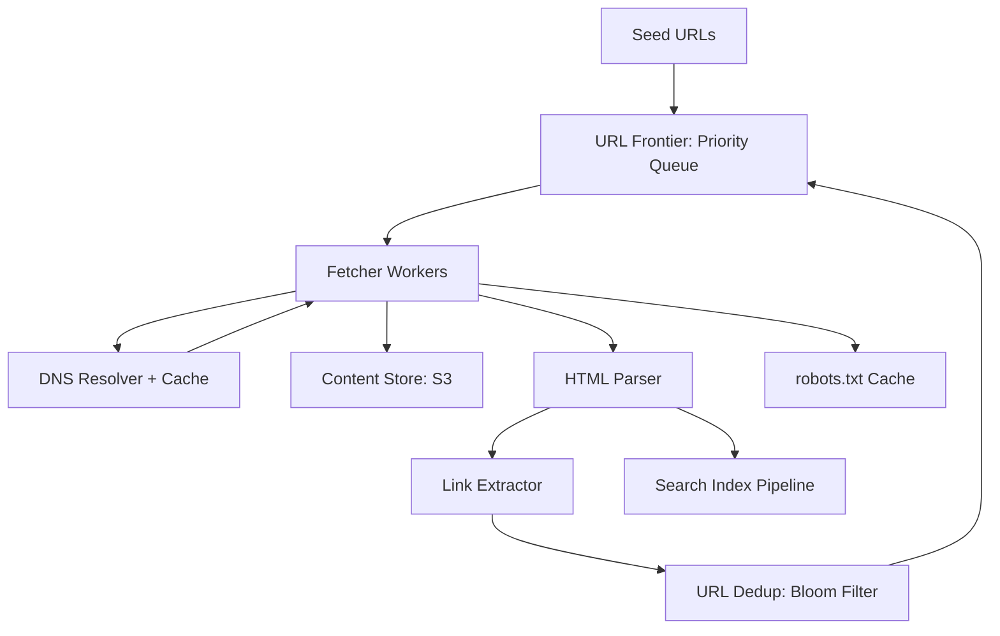

#system-design #case-study #advanced

# Design a Web Crawler (Google-scale)

## The Question

> "Design a web crawler that crawls billions of web pages."

---

## Step 1: Requirements

**Functional:** Crawl web pages starting from seed URLs, extract links, follow them, store page content, respect robots.txt, handle duplicates
**Non-Functional:** Crawl 1B pages/month, politeness (don't overload sites), fault-tolerant, distributed

---

## Step 2: Estimation

| Metric | Value |
|--------|-------|
| Pages/month | 1B |
| Pages/sec | ~400 |
| Avg page size | 500KB |
| Storage/month | 1B × 500KB = **500TB** |
| URLs discovered/page | ~50 links |
| Total URLs to track | 50B+ |

---

## Step 3: High-Level Design



---

## Step 4: Deep Dive

### URL Frontier (Priority Queue)

Not a simple queue — needs politeness and priority:

**Politeness:** Don't hit the same domain more than once per second. Per-domain queues with rate limiting.

**Priority:** Important pages first. Priority based on:
- PageRank / domain authority
- Freshness (news sites crawled more often)
- Depth from seed URL (shallower = more important)

```
Frontier:
  Priority Queue → selects next domain
  Per-domain Queue → selects next URL within domain
  Rate Limiter → enforces politeness per domain
```

### URL Deduplication (Bloom Filter)

With 50B URLs, can't store all in memory. Use a Bloom filter:
- Probabilistic: might have false positives (skip a URL we haven't seen) — acceptable
- No false negatives (never crawl same URL twice)
- 50B URLs × 10 bits/element = ~60GB — fits in memory across cluster

For exact dedup: hash the URL, check in distributed hash store (Redis cluster).

### Content Fingerprinting

Same content at different URLs (mirrors, syndication). Hash the content (SimHash for near-duplicate detection):
```
Page A: hash = "abc123"
Page B: hash = "abc124" (1 bit different — near-duplicate!)
Store only one copy, note both URLs.
```

### Fetcher Architecture

Distributed workers that:
1. Take URL from frontier
2. Check robots.txt (cached per domain)
3. Resolve DNS (cached)
4. HTTP GET with timeout (30s)
5. Store raw HTML in S3
6. Parse HTML, extract links
7. Send links to dedup → frontier

### robots.txt Handling

```
Download robots.txt for each domain
Cache for 24 hours
Respect Crawl-delay directive
Never crawl Disallow paths
```

---

## Interview Simulation

> **Interviewer:** Design a web crawler.

> **Candidate:** The core challenge is scale and politeness — crawling 1B pages monthly without overloading any single website. I'd design this as a distributed pipeline with a URL frontier at the center.

> **Candidate:** The frontier isn't a simple queue — it's a priority queue with per-domain rate limiting. Each domain gets its own sub-queue, and we enforce at most 1 request per second per domain. Priority is based on domain authority and freshness needs.

> **Interviewer:** How do you handle duplicate URLs?

> **Candidate:** A Bloom filter for approximate dedup — 50B URLs at 10 bits each is about 60GB, spread across a Redis cluster. False positives mean we might skip a rare URL, which is acceptable. For content-level dedup, I'd use SimHash to detect near-duplicate pages across different URLs.

---

## Building Blocks Used

| Component | Building Block |
|-----------|---------------|
| URL Frontier | Priority queue + per-domain rate limiting |
| Fetcher workers | [[02_building_blocks/message_queues]] distributed workers |
| Content storage | [[02_building_blocks/blob_storage]] (S3) |
| URL dedup | Bloom filter + Redis |
| DNS caching | [[02_building_blocks/caching]] |
| Politeness | [[02_building_blocks/rate_limiter]] per domain |
