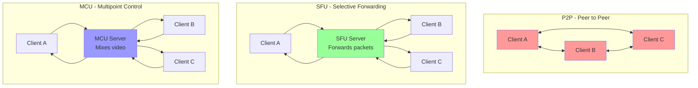
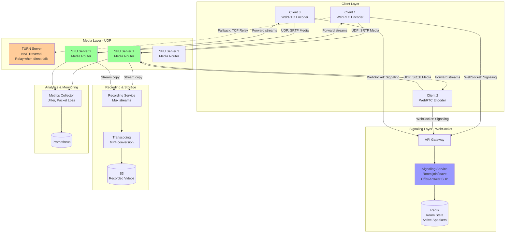
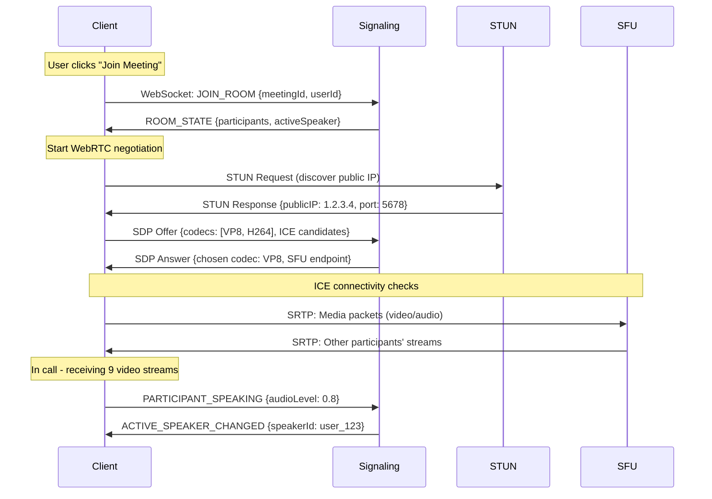
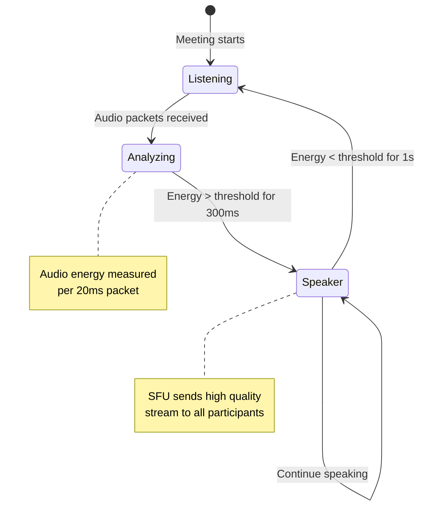
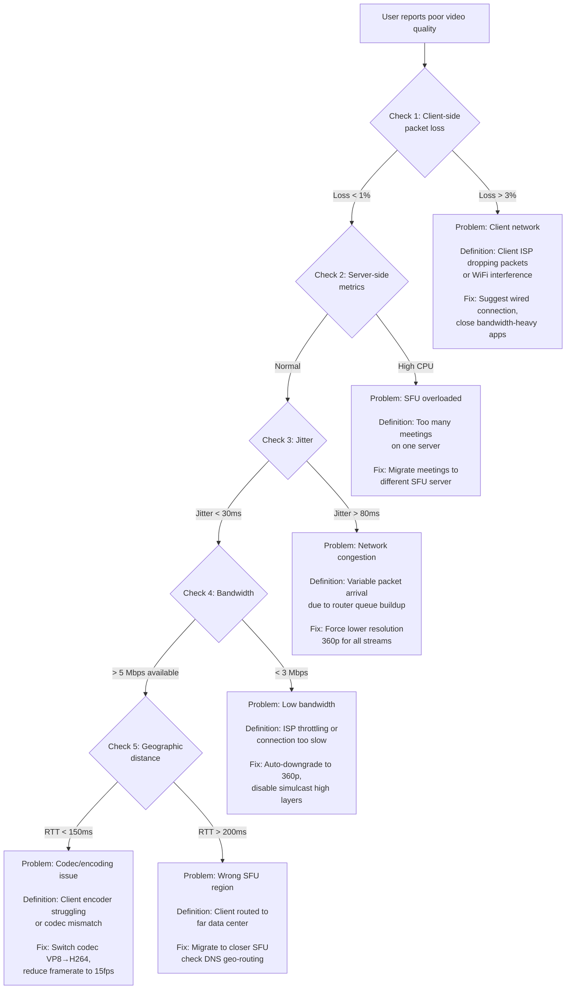

#system-design #case-study #advanced

# Design Zoom (Video Conferencing)

## The Question
> "Design a video conferencing system like Zoom that handles 300M daily participants with <150ms latency."

---

## Intuition (30 sec)

Think of a video conference like a phone call through an operator. In the old days, everyone calling at once would overwhelm the switchboard. Video conferencing is similar - you can't have everyone sending video directly to everyone else (50 people = 2,450 connections!). Instead, everyone sends to one smart router (SFU) that decides who needs to see what quality based on who's speaking and who has good internet.

---

## Failure-First Scenario

Your startup's video app works great with 3 people. You launch and 50 people join a call. Everyone's browser tries to send video to 49 other people simultaneously. Upload bandwidth maxes out at 245 Mbps (impossible on home internet). Calls freeze, videos stutter, and users immediately switch to Zoom. You needed a Selective Forwarding Unit (SFU) instead of peer-to-peer architecture.

---

## Requirements
**Functional:** 1-on-1 and group video calls (up to 1000), screen sharing, chat, recording, virtual backgrounds
**Non-Functional:** <150ms latency (real-time), handle packet loss gracefully, support varying bandwidths, 300M daily meeting participants

## Core Challenges

### Why Video Conferencing is Hard
- **Latency:** >300ms feels unnatural (can't have a normal conversation)
- **Bandwidth:** 1080p video = 3-5 Mbps per stream. 10 participants = 30-50 Mbps
- **Packet loss:** UDP means some packets are lost. Must handle gracefully.
- **Varying networks:** One participant on 5G, another on 2G

### Key Terms & Definitions

**WebRTC (Web Real-Time Communication):**
- **Definition:** WebRTC is a browser-based protocol that enables real-time audio/video communication over UDP without requiring plugins or third-party software
- **Purpose:** Solves the problem of standardized real-time media in browsers
- **How it works:** Uses SRTP for encrypted media, ICE for NAT traversal, and provides JavaScript APIs for peer connections
- **Key difference:** Unlike traditional video streaming (RTMP/HLS), WebRTC prioritizes low latency over perfect quality

**SFU (Selective Forwarding Unit):**
- **Definition:** SFU is a media router that receives video/audio streams from all participants and selectively forwards them to others without transcoding or mixing
- **Purpose:** Reduces client bandwidth requirements while maintaining low latency
- **How it works:** Each client uploads 1 stream, SFU forwards N-1 streams to each client (selecting quality/speaker based on policies)
- **vs P2P:** P2P requires N×(N-1) connections; SFU requires only N connections to the server

**MCU (Multipoint Control Unit):**
- **Definition:** MCU is a media server that receives all streams, decodes them, mixes/composes them into a single stream, and sends one stream back to each participant
- **Purpose:** Minimizes client bandwidth (only 1 upload + 1 download per client)
- **How it works:** Server CPU does heavy work - decodes all incoming streams, renders them into a grid, encodes the composite
- **Trade-off:** Lower client bandwidth but higher latency (encoding delay) and massive server CPU requirements

**SVC (Scalable Video Coding):**
- **Definition:** SVC is a video encoding technique where a single bitstream contains multiple quality layers (base + enhancement layers) that can be selectively transmitted
- **Purpose:** Enables adaptive streaming without requiring multiple separate encodings (Simulcast alternative)
- **How it works:** Encoder creates one stream with temporal/spatial layers; router drops enhancement packets for low-bandwidth clients
- **Status:** Not widely adopted (browser/codec support limited); Zoom uses Simulcast instead

**Simulcast:**
- **Definition:** Simulcast is a technique where the client encoder produces multiple independent streams of the same content at different resolutions/bitrates simultaneously
- **Purpose:** Allows SFU to forward appropriate quality to each receiver based on their bandwidth
- **How it works:** Client sends 3 streams (e.g., 1080p, 720p, 360p); SFU forwards high quality to good connections, low quality to poor connections
- **Trade-off:** 3× client upload bandwidth but enables perfect quality matching per receiver

**Jitter:**
- **Definition:** Jitter is the variation in packet arrival times for a continuous stream (e.g., packets arriving at 50ms, 53ms, 48ms, 55ms intervals instead of constant 50ms)
- **Purpose to measure:** High jitter causes choppy audio/video; indicates network instability
- **How it's handled:** Jitter buffer delays playback slightly to smooth out variations
- **Acceptable range:** <30ms for good quality; >100ms causes noticeable issues

### Architecture Types Comparison

| Architecture | Connections per Client | Server CPU | Latency | Client Bandwidth | Use Case |
|--------------|----------------------|------------|---------|------------------|----------|
| **P2P** | N-1 peer connections | None | Lowest (~50ms) | Highest (must upload to all) | 1-on-1 calls only |
| **SFU** | 1 upload + N-1 downloads | Low (forwarding only) | Low (~100ms) | Medium | **Zoom's choice** - scales to 1000s |
| **MCU** | 1 upload + 1 download | Very High (encode/decode) | Higher (~200ms) | Lowest | Legacy systems, low-bandwidth clients |

**Why Zoom Uses SFU:**
- Scales to 1000 participants (P2P impossible)
- Low latency vs MCU (no encoding delay)
- Server costs manageable (just forwarding packets, not processing video)
- Combined with Simulcast for quality adaptation

### Architecture Visual Comparison



**Connection Math:**
- **P2P:** 3 people = 3×2/2 = 3 connections, 10 people = 45 connections, 100 people = 4,950 connections (impossible)
- **SFU:** N people = N connections to server (linear scaling)
- **MCU:** N people = N connections to server (but server CPU cost is N×decode + 1×encode)

## High-Level Design

### Complete System Architecture



### Component Definitions

**API Gateway:**
- **Definition:** Entry point for all client WebSocket connections that handles authentication, rate limiting, and routing to signaling services
- **Role:** Validates meeting IDs, authenticates users, routes to appropriate signaling server based on meeting

**Signaling Service:**
- **Definition:** WebSocket server that coordinates connection establishment between clients without handling media itself
- **Purpose:** Exchanges SDP offers/answers, ICE candidates, room state updates
- **Why separate from media:** Signaling uses reliable TCP/WebSocket; media uses UDP for low latency

**SFU Server (Media Router):**
- **Definition:** Server that receives media packets via UDP and forwards them to other participants without decoding/encoding
- **How it works:** Maintains routing table (participant → IP:port), receives RTP packets, duplicates and forwards to N-1 recipients
- **Key optimization:** Doesn't decode video - just forwards packets at network layer

**TURN Server:**
- **Definition:** TURN (Traversal Using Relays around NAT) is a fallback relay server used when direct peer-to-SFU connection fails due to strict firewalls
- **When used:** ~5-10% of connections (corporate networks, symmetric NATs)
- **Trade-off:** Adds latency (~50ms) but ensures connectivity

**Recording Service:**
- **Definition:** Service that receives duplicate streams from SFU and muxes them into a single video file with layout (gallery/speaker view)
- **How it works:** Decodes all participant streams, renders them into a grid, encodes to H.264, saves to storage
- **Why separate:** Recording requires heavy CPU (MCU-like processing) but only for recorded meetings

### Protocols Deep Dive

**WebRTC (Web Real-Time Communication):**
- **Definition:** Collection of protocols and APIs enabling real-time media in browsers
- **Components:**
  - **SRTP:** Secure RTP for encrypted media packets
  - **SCTP:** Data channels for chat/file transfer
  - **ICE:** Interactive Connectivity Establishment for NAT traversal
- **Flow:** Browser negotiates connection via SDP (codec/resolution), establishes UDP connection, sends RTP packets

**SRTP (Secure Real-time Transport Protocol):**
- **Definition:** Extension of RTP that adds encryption (AES) and authentication to media packets
- **Purpose:** Prevent eavesdropping on video/audio streams
- **How it works:** Each RTP packet's payload is encrypted; keys exchanged via DTLS handshake

**ICE/STUN/TURN (NAT Traversal):**
- **ICE (Interactive Connectivity Establishment):** Framework that tries multiple methods to connect (direct, STUN, TURN)
- **STUN (Session Traversal Utilities for NAT):** Server that tells client its public IP:port (for direct connection through NAT)
- **TURN (Traversal Using Relays around NAT):** Relay server that forwards packets when direct connection impossible

**Flow:**
```
Client → STUN server: "What's my public IP?"
STUN → Client: "You are 1.2.3.4:5678"
Client → SFU: "Try connecting to 1.2.3.4:5678" (ICE candidate)
If direct fails → Use TURN relay
```

**SDP (Session Description Protocol):**
- **Definition:** Text format that describes multimedia session capabilities (codecs, resolution, bandwidth)
- **Purpose:** Negotiates what format both parties will use
- **Example:**
```
v=0
m=video 9 UDP/TLS/RTP/SAVPF 96 97
a=rtpmap:96 VP8/90000
a=rtpmap:97 H264/90000
a=framerate:30
```
- **Meaning:** Supports VP8 and H264 codecs at 30fps

### Call Flow - Connection Establishment



**Step-by-step breakdown:**
1. **Signaling handshake (TCP/WebSocket):** Client joins room, gets list of participants, room state
2. **WebRTC negotiation (SDP exchange):** Client sends supported codecs/resolutions (Offer), server responds with chosen parameters (Answer)
3. **NAT traversal (ICE/STUN):** Client discovers public IP via STUN, tries direct connection to SFU
4. **Media transmission (UDP/SRTP):** Once connected, media flows over UDP (no TCP handshakes for every packet)

### Media Routing Flow

```
┌─────────────────────────────────────────────────────────────┐
│                     SFU Media Router                        │
│                                                             │
│  ┌──────────────┐   ┌──────────────┐   ┌──────────────┐   │
│  │ Client A     │   │ Client B     │   │ Client C     │   │
│  │ 1080p (3Mbps)│   │ 720p (1.5Mbps)  │ 360p (0.5Mbps) │  │
│  └──────┬───────┘   └──────┬───────┘   └──────┬───────┘   │
│         │                  │                  │            │
│         │ Upload 1 stream  │ Upload 1 stream  │ Upload    │
│         ▼                  ▼                  ▼            │
│  ┌────────────────────────────────────────────────┐        │
│  │          SFU Routing Table                     │        │
│  │  A: 1.2.3.4:5000 (3 layers: 1080/720/360)     │        │
│  │  B: 5.6.7.8:6000 (3 layers: 1080/720/360)     │        │
│  │  C: 9.10.11.12:7000 (3 layers: 1080/720/360)  │        │
│  └────────────────────────────────────────────────┘        │
│                                                             │
│  ┌─────────────────────────────────────────┐               │
│  │    Forwarding Logic (per receiver)       │              │
│  │  • Measure receiver bandwidth             │              │
│  │  • Check active speaker status            │              │
│  │  • Select layer per stream                │              │
│  └─────────────────────────────────────────┘               │
│         │                  │                  │            │
│         ▼                  ▼                  ▼            │
│  Download 9 streams  Download 9 streams  Download 9       │
│  (quality varies)    (quality varies)    streams          │
│         │                  │                  │            │
└─────────┼──────────────────┼──────────────────┼────────────┘
          ▼                  ▼                  ▼
    Client A receives:  Client B receives:  Client C receives:
    • B: 1080p (active  • A: 1080p          • A: 360p (low bw)
      speaker)          • C: 360p           • B: 360p
    • C: 720p                               (all low quality)
    (Other 7: 360p)    (Other 7: 720p)     (Other 7: 360p)
```

**Forwarding Rules:**
- **Active speaker:** Always receive highest available layer (1080p)
- **Gallery view (visible tiles):** Receive medium layer (720p)
- **Off-screen participants:** Receive lowest layer (360p) or paused
- **Low bandwidth receiver:** Downgrade all incoming streams to 360p

### Adaptive Bitrate (Simulcast)

**Simulcast Definition:**
- **What it is:** Each client encodes and uploads the same video in 3 different resolutions simultaneously
- **Why:** Allows SFU to send appropriate quality to each receiver without server-side transcoding
- **Cost:** 3× upload bandwidth (client sends 1080p + 720p + 360p = ~5 Mbps total)

```
┌──────────────────────────────────────────────────┐
│         Client Encoder (Simulcast)               │
├──────────────────────────────────────────────────┤
│                                                  │
│  Camera (1080p) → VP8 Encoder                    │
│                        │                         │
│        ┌───────────────┼───────────────┐         │
│        ▼               ▼               ▼         │
│  Layer 1 (High)  Layer 2 (Med)  Layer 3 (Low)  │
│  1080p 30fps     720p 30fps     360p 15fps      │
│  3 Mbps          1.5 Mbps       0.5 Mbps        │
│        │               │               │         │
│        └───────────────┴───────────────┘         │
│                        │                         │
│         All 3 sent to SFU (5 Mbps upload)       │
└──────────────────────────────────────────────────┘

SFU receives 3 layers from each sender, forwards appropriate layer to each receiver:

Receiver with 10 Mbps available → Gets 1080p layer
Receiver with 3 Mbps available  → Gets 720p layer
Receiver with 1 Mbps available  → Gets 360p layer
```

**Bandwidth Calculation Example (10 person call):**
- **Upload:** 5 Mbps (3 simulcast layers)
- **Download (good connection):** 9 streams × 3 Mbps (1080p) = 27 Mbps
- **Download (medium connection):** 9 streams × 1.5 Mbps (720p) = 13.5 Mbps
- **Download (poor connection):** 9 streams × 0.5 Mbps (360p) = 4.5 Mbps

### Active Speaker Detection

**Definition:**
- **Active Speaker Detection (ASD):** Algorithm that identifies who is currently speaking based on audio energy levels and forwards their video at highest quality
- **Purpose:** Optimize bandwidth by prioritizing the speaker's video (most important in Speaker View)
- **How it works:** SFU monitors RTP audio packets' energy levels, applies smoothing (prevent rapid switching), notifies all clients of active speaker



**Algorithm:**
```
For each participant:
  1. Measure audio energy level (RMS of audio samples)
  2. Apply smoothing window (last 300ms average)
  3. If energy > threshold AND silent for >300ms:
       Mark as active speaker
  4. If current speaker silent for >1s:
       Mark as inactive, find new speaker
  5. Notify all clients via signaling: ACTIVE_SPEAKER_CHANGED
```

**Quality Allocation by Role:**

| Participant Role | Quality Received | Bandwidth | Rationale |
|------------------|------------------|-----------|-----------|
| Active speaker | 1080p | 3 Mbps | Users focus on speaker |
| Gallery view (visible) | 720p | 1.5 Mbps | Need clarity but not critical |
| Off-screen | 360p or paused | 0.5 Mbps or 0 | Not visible, save bandwidth |
| Screen share (active) | 1080p | 3 Mbps | Text must be readable |

## Capacity Planning - 300M Daily Participants

### Scale Requirements

**Given:**
- 300M daily active participants
- Average meeting duration: 45 minutes
- Peak hours: 9 AM - 11 AM (3× average traffic)
- Concurrent meeting ratio: ~10% of daily users

### Calculation: Concurrent Users

```
Step 1: Daily minutes of video
  Definition: Total video minutes consumed across all users
  300M users × 45 min/user = 13.5B minutes/day

Step 2: Average concurrent users
  Definition: Number of users in meetings at any given moment
  13.5B minutes ÷ 1,440 min/day = 9.375M average concurrent

Step 3: Peak concurrent users
  Definition: Maximum simultaneous users during peak hours
  Peak = Average × 3 = 28.1M concurrent users at 9-11 AM

Step 4: Average meeting size
  Assumption: 5 participants per meeting (mix of 1-on-1 and groups)
  Concurrent meetings = 28.1M ÷ 5 = 5.62M meetings
```

### SFU Server Capacity

**Single SFU Server Capacity:**
- **CPU:** Forwarding packets (minimal CPU) - 8 cores handles 1000 streams
- **Network:** Bottleneck is bandwidth, not CPU
- **Calculation:**
  - 10-person meeting: Each person uploads 5 Mbps (simulcast)
  - SFU receives: 10 × 5 = 50 Mbps
  - SFU forwards: Each person receives 9 streams × 1.5 Mbps avg = 13.5 Mbps
  - Total forwarding: 10 × 13.5 = 135 Mbps
  - **Bandwidth per meeting:** 50 Mbps in + 135 Mbps out = 185 Mbps

- **Server with 10 Gbps NIC:** 10,000 Mbps ÷ 185 Mbps = 54 meetings per server
- **Participants per server:** 54 × 10 = 540 participants

**SFU Servers Needed:**
```
Peak concurrent users: 28.1M
Users per SFU: 540
Servers needed: 28.1M ÷ 540 = 52,037 SFU servers

Add 30% redundancy: 52,037 × 1.3 = 67,648 SFU servers

Distributed across regions:
  US: 30,000 servers
  EU: 20,000 servers
  Asia: 17,648 servers
```

### Infrastructure Breakdown

```
┌─────────────────────────────────────────────────────────┐
│              Global Infrastructure                      │
├─────────────────────────────────────────────────────────┤
│                                                         │
│  Signaling Servers (WebSocket)                          │
│  • Much lighter than media servers                      │
│  • 1 server handles 50,000 connections                  │
│  • Needed: 28.1M ÷ 50,000 = 562 servers                │
│  • Geographic distribution: 200 US, 150 EU, 212 Asia   │
│                                                         │
│  SFU Media Servers (UDP)                                │
│  • Heavy bandwidth requirements                         │
│  • 1 server handles 540 participants                    │
│  • Needed: 67,648 servers (with redundancy)            │
│  • 10 Gbps NIC per server                              │
│                                                         │
│  TURN Relay Servers                                     │
│  • Fallback for 5-10% of connections                    │
│  • 2.8M users need TURN (10% of 28.1M)                 │
│  • 1 server handles 1,000 relays                        │
│  • Needed: 2,800 TURN servers                          │
│                                                         │
│  Recording Servers (optional)                           │
│  • Assume 5% of meetings recorded                       │
│  • 5.62M meetings × 5% = 281,000 concurrent recordings │
│  • Heavy CPU (MCU-like mixing)                          │
│  • 1 server handles 10 recordings (16-core)            │
│  • Needed: 28,100 recording servers                    │
│                                                         │
└─────────────────────────────────────────────────────────┘

Total Server Count:
  Signaling:   562
  SFU Media:   67,648
  TURN Relay:  2,800
  Recording:   28,100
  ────────────────────
  Total:       99,110 servers

Cloud Cost Estimate:
  SFU (c5n.4xlarge @ $0.77/hr): 67,648 × $0.77 × 730 = $38M/month
  Others: ~$12M/month
  ───────────────────────────────
  Total Infrastructure: ~$50M/month = $600M/year
```

### Bandwidth Requirements

**Per-user bandwidth:**
- **Upload:** 5 Mbps (simulcast: 3 + 1.5 + 0.5 Mbps)
- **Download:** 13.5 Mbps average (9 participants × 1.5 Mbps)

**Total peak bandwidth:**
```
28.1M concurrent users × 5 Mbps upload = 140.5 Tbps upload
28.1M concurrent users × 13.5 Mbps download = 379.35 Tbps download

Total: 519.85 Tbps peak bandwidth

ISP/Transit cost: ~$10/Mbps/month
519,850,000 Mbps × $10 = $5.2B/month (impossible!)

Reality: Peering agreements, CDN partnerships reduce costs to ~$100M/month
```

## Monitoring & Reliability

### Critical Metrics

```
┌──────────────────────────────────────────────────────────┐
│                 VIDEO QUALITY DASHBOARD                  │
├──────────────────────────────────────────────────────────┤
│                                                          │
│  Jitter: 28ms                                            │
│  Definition: Variation in packet arrival times          │
│  Why track: >50ms causes choppy video                   │
│  Alert when: >100ms for 30s                             │
│                                                          │
│  Packet Loss: 0.3%                                       │
│  Definition: Percentage of UDP packets not received     │
│  Why track: >3% causes visible artifacts               │
│  Alert when: >5% for 1 minute                          │
│                                                          │
│  Round-Trip Time (RTT): 94ms                             │
│  Definition: Time for packet to go client→server→client │
│  Why track: >200ms feels laggy                          │
│  Alert when: >300ms (unusable for conversation)         │
│                                                          │
│  Available Bandwidth: 8.2 Mbps                           │
│  Definition: Estimated throughput based on packet rate  │
│  Why track: Need 5 Mbps upload + 13.5 Mbps download   │
│  Alert when: <3 Mbps (force lower quality)             │
│                                                          │
│  Frame Rate: 28 fps                                      │
│  Definition: Video frames per second being received     │
│  Target: 30 fps for smooth video                        │
│  Alert when: <15 fps (visibly choppy)                  │
│                                                          │
│  Active Speaker Switches: 8/minute                       │
│  Definition: How often active speaker changes           │
│  Why track: >20/min indicates flapping (poor detection)│
│                                                          │
└──────────────────────────────────────────────────────────┘
```

**Metric Collection:**
```
Client → SFU: RTCP packets every 5 seconds
  {
    "jitter": 28,
    "packetLoss": 0.3,
    "rtt": 94,
    "framesReceived": 150,  // in last 5 seconds
    "bytesReceived": 1875000
  }

SFU → Metrics Service: Aggregated stats
  • Per-meeting averages
  • Per-region aggregates
  • Alerting on thresholds
```

### Monitoring Architecture

```
┌────────────┐   ┌────────────┐   ┌────────────┐
│  SFU 1     │   │  SFU 2     │   │  SFU N     │
│            │   │            │   │            │
│ Metrics:   │   │ Metrics:   │   │ Metrics:   │
│ • Jitter   │   │ • Jitter   │   │ • Jitter   │
│ • Loss     │   │ • Loss     │   │ • Loss     │
│ • RTT      │   │ • RTT      │   │ • RTT      │
└─────┬──────┘   └─────┬──────┘   └─────┬──────┘
      │                │                │
      └────────────────┼────────────────┘
                       │
                       ▼
         ┌─────────────────────────┐
         │  Metrics Aggregator     │
         │  (Prometheus/Grafana)   │
         │                         │
         │  • Per-region stats     │
         │  • Per-meeting stats    │
         │  • Global dashboard     │
         └────────┬────────────────┘
                  │
         ┌────────┴────────┐
         │                 │
         ▼                 ▼
    ┌─────────┐      ┌──────────┐
    │ Alerts  │      │ ML Model │
    │ (PagerDuty)    │ (Predict  │
    │         │      │ failures) │
    └─────────┘      └──────────┘
```

**Key Alerts:**
1. **High packet loss (>5%):** Route meeting to different SFU
2. **High jitter (>100ms):** Network congestion - reduce quality
3. **Server CPU >80%:** Load balance meetings to other servers
4. **RTT >300ms:** Client too far from SFU - use closer data center

## Troubleshooting Decision Tree



### Common Issues & Fixes

| Issue | Symptoms | Root Cause | Fix |
|-------|----------|------------|-----|
| **Choppy video** | Stuttering, freezing | Jitter >100ms or packet loss >3% | Force 360p, increase jitter buffer to 150ms |
| **Black screen** | No video received | Firewall blocking UDP | Fallback to TURN relay over TCP |
| **One-way audio** | Can't hear others | Symmetric NAT, ICE failure | Use TURN relay for that client |
| **High latency** | 2-3 second delay | Routed to wrong region | Migrate to geographically closer SFU |
| **CPU spike on client** | Fan running, browser slow | Simulcast encoding + 9 decodes | Disable simulcast, reduce participants in gallery |

## Real Zoom Architecture

### What Zoom Actually Uses

**Based on public information and engineering blogs:**

1. **Multimedia Router (MMR) - Zoom's SFU:**
   - Custom-built C++ media router (not open-source like Janus/Jitsi)
   - Handles routing, not transcoding (SFU architecture)
   - Runs on bare metal servers (not containers) for performance
   - Geographic distribution: 17+ data center regions globally

2. **Zoom's Protocol Stack:**
   - **Not pure WebRTC:** Uses proprietary protocol based on RTP/SRTP
   - **Why:** More control over codec selection, error correction, bandwidth estimation
   - **Web client:** Uses WebRTC (browser limitation)
   - **Desktop/mobile apps:** Direct UDP to MMR with custom protocol

3. **Codec Strategy:**
   - **Default:** H.264 (hardware-accelerated on most devices)
   - **Fallback:** VP8 for older devices or browsers
   - **Screen sharing:** Uses higher resolution, lower framerate (1080p @ 5fps)

4. **Virtual Background & AI:**
   - **Segmentation:** ML model runs on client (TensorFlow Lite on mobile, WebGL in browser)
   - **Why client-side:** Privacy (video never sent unencrypted to server), reduces latency
   - **Cost:** Adds 10-20% CPU overhead on client

5. **Recording Architecture:**
   - **Cloud recording:** Dedicated recording servers (MCU-style) mux streams into MP4
   - **Local recording:** Client records all incoming streams separately, combines locally
   - **Storage:** AWS S3 with CDN (CloudFront) for playback

6. **Scalability Tactics:**
   - **Overflow routing:** If SFU full, route new participants to different server, then rebalance
   - **Regional isolation:** Meetings stay in one region (US-East) unless participants in multiple regions
   - **Large meetings (>100):** Switch to webinar mode - only hosts send video, attendees watch (reduces SFU load)

### Zoom's Key Innovations

**What makes Zoom different:**

1. **Bandwidth adaptation speed:** Adjusts quality every 200ms (competitors: 2-3 seconds)
2. **CPU optimization:** Custom SIMD assembly for video encoding (2× faster than default H.264)
3. **Noise suppression:** ML-based audio filtering removes background noise (RTNoise model)
4. **Error concealment:** Advanced packet loss concealment (repeat frames, interpolate) keeps video smooth even at 5% loss

## Interview Tip
> "The key architecture decision is SFU vs MCU. SFU is preferred because it offloads encoding to clients, scales better, and has lower latency. Combined with Simulcast for adaptive quality and active speaker detection for bandwidth optimization. For Zoom scale (300M daily users = 28M concurrent at peak), you need ~68K SFU servers globally, with critical monitoring of jitter (<30ms), packet loss (<1%), and RTT (<150ms)."

## Decision Trees

### Architecture Decision: Choosing SFU vs MCU vs P2P

```
START: Design video conferencing system

├─ Q1: How many participants per call?
│  ├─ 1-on-1 only
│  │  └─ Use P2P (direct connection, lowest latency ~50ms)
│  │
│  ├─ 2-10 participants
│  │  ├─ Q2: Are clients resource-constrained? (old phones, slow CPU)
│  │  │  ├─ YES → Use MCU (server does mixing, client receives 1 stream)
│  │  │  └─ NO → Use SFU (clients handle decode, better quality)
│  │  │
│  │  └─ RECOMMENDATION: SFU + Simulcast
│  │
│  └─ 10+ participants
│     └─ Use SFU (only option that scales)
│        ├─ Add active speaker detection
│        └─ Add simulcast for quality adaptation

├─ Q3: Need recording?
│  ├─ YES → Add dedicated recording servers (MCU-style mixing)
│  └─ NO → Skip recording infrastructure

├─ Q4: Corporate clients (behind firewalls)?
│  ├─ YES → Deploy TURN servers (5-10% of traffic needs relay)
│  └─ NO → STUN sufficient for consumer use

└─ FINAL RECOMMENDATION:
   • SFU for media routing
   • Simulcast (3 layers: 1080p/720p/360p)
   • Active speaker detection
   • TURN fallback for NAT traversal
   • Separate recording service if needed
```

### Quality Degradation Decision Tree

```
IF available_bandwidth < 3 Mbps:
  THEN disable simulcast high layers (only send 360p)
  REASON: Not enough bandwidth for 1080p + 720p + 360p

IF jitter > 80ms:
  THEN increase jitter buffer to 150ms
  REASON: Need more buffering to smooth out packet arrival variance
  TRADE-OFF: Adds 50-100ms latency but prevents choppy video

IF packet_loss > 3%:
  THEN reduce framerate from 30fps to 15fps
  REASON: Fewer packets = lower loss probability
  AND enable Forward Error Correction (FEC)
  REASON: Send redundant data to recover lost packets

IF RTT > 300ms:
  THEN migrate client to closer SFU region
  REASON: Geographic distance too high, need lower latency

IF client_CPU > 90%:
  THEN disable simulcast (send only 1 layer)
  REASON: Encoding 3 layers simultaneously overloading client
  AND reduce gallery view to 4 participants
  REASON: Decoding 9+ streams overloading client
```

## Quick Reference

### Glossary

| Term | Definition | When You'll See It |
|------|------------|-------------------|
| **WebRTC** | Browser protocol for real-time media over UDP with built-in NAT traversal | Client-side video calls in web apps |
| **SFU** | Server that forwards media packets without decoding/encoding | Scalable architecture for 10+ participants |
| **MCU** | Server that decodes all streams, mixes them, and sends 1 composite stream | Legacy systems, low-bandwidth clients |
| **Simulcast** | Encoding same video in multiple resolutions (1080p/720p/360p) simultaneously | Adaptive quality without server transcoding |
| **SRTP** | Encrypted RTP for secure media transport | All production video calls |
| **TURN** | Relay server for clients behind strict NAT/firewalls | Corporate networks, 5-10% of connections |
| **Jitter** | Variation in packet arrival times | Quality monitoring, should be <30ms |
| **Packet Loss** | Percentage of UDP packets not received | Quality monitoring, acceptable <1% |
| **RTT** | Round-trip time for packet to go client→server→client | Latency monitoring, target <150ms |
| **Active Speaker** | Participant currently speaking (based on audio energy) | Quality optimization, receives highest bitrate |
| **ICE** | Framework for NAT traversal (tries STUN, then TURN) | Connection establishment phase |

### Key Numbers

```
LATENCY TARGETS:
  <150ms: Real-time conversation feels natural
  150-300ms: Noticeable lag but usable
  >300ms: Unnatural, users talk over each other

BANDWIDTH PER PARTICIPANT:
  Upload: 5 Mbps (simulcast: 3+1.5+0.5)
  Download: 1.5 Mbps × (N-1) participants

QUALITY THRESHOLDS:
  Jitter: <30ms good, 30-80ms acceptable, >100ms poor
  Packet Loss: <1% good, 1-3% acceptable, >5% unusable
  RTT: <150ms good, 150-300ms acceptable, >300ms poor

SCALE (300M daily users):
  Peak concurrent: 28.1M users
  SFU servers needed: 67,648
  Signaling servers: 562
  TURN servers: 2,800

SERVER CAPACITY:
  1 SFU server: 540 participants (10 Gbps NIC)
  1 signaling server: 50,000 WebSocket connections
  1 TURN server: 1,000 relays
```

### Architecture Cheat Sheet

```
CONNECTION ESTABLISHMENT:
  1. Client → Signaling (WebSocket): Join room, get participants
  2. Client → STUN: Discover public IP for NAT traversal
  3. Client ↔ Signaling: Exchange SDP (codecs/resolution)
  4. Client ↔ SFU: ICE connectivity checks
  5. Client → SFU: SRTP media packets (UDP)

SIMULCAST LAYERS:
  Layer 1: 1080p @ 30fps (3 Mbps) - for active speaker
  Layer 2: 720p @ 30fps (1.5 Mbps) - for gallery view
  Layer 3: 360p @ 15fps (0.5 Mbps) - for off-screen/low bandwidth

FORWARDING RULES:
  Active speaker → Always highest layer (1080p)
  Gallery visible → Medium layer (720p)
  Off-screen → Lowest layer (360p) or paused
  Low bandwidth receiver → All streams downgraded to 360p

MONITORING PRIORITIES:
  1. Packet loss (>5% = alert)
  2. Jitter (>100ms = degrade quality)
  3. RTT (>300ms = migrate to closer region)
  4. Server CPU (>80% = load balance)
```

### Interview Answer Template

**Q: How would you design Zoom?**

**Answer Structure (4 minutes):**

1. **Define (30 sec):**
   "Video conferencing needs to handle 1000+ simultaneous participants with <150ms latency. The core challenge is bandwidth: 10 people peer-to-peer would require 90 connections. We need a Selective Forwarding Unit (SFU) - a server that receives one stream from each participant and forwards it to others without decoding."

2. **Architecture (60 sec):**
   "Use SFU for media routing. Each client sends video to SFU via WebRTC/UDP. SFU maintains routing table and forwards packets. Signaling uses WebSocket for room management (TCP). TURN servers provide NAT traversal fallback for 5-10% of corporate users."

3. **Quality Adaptation (60 sec):**
   "Use Simulcast: clients encode 3 layers (1080p/720p/360p). SFU forwards appropriate layer based on receiver bandwidth. Active speaker detection ensures current speaker gets highest quality. Monitor jitter (<30ms), packet loss (<1%), RTT (<150ms)."

4. **Scale (60 sec):**
   "300M daily users = 28M peak concurrent. Each SFU handles 540 participants (10 Gbps NIC). Need ~68K SFU servers globally. Distribute across regions to minimize RTT. Add recording servers (MCU-style mixing) for cloud recording."

5. **Trade-offs (30 sec):**
   "SFU vs MCU: SFU scales better (no transcoding) but requires 3× client upload (simulcast). P2P impossible beyond 4 people. WebRTC standard for browsers but custom protocol for desktop apps (Zoom's approach) gives more control."

## Links
- [[../01_fundamentals/networking_basics]] — UDP, WebRTC
- [[../02_building_blocks/cdn]] — Media delivery for recordings
- [[../15_intermediate_topics/networking_advanced]] — UDP, latency optimization
- [[../02_building_blocks/load_balancer]] — Geographic routing for SFU selection
- [[../03_advanced_topics/monitoring]] — Jitter, packet loss metrics
