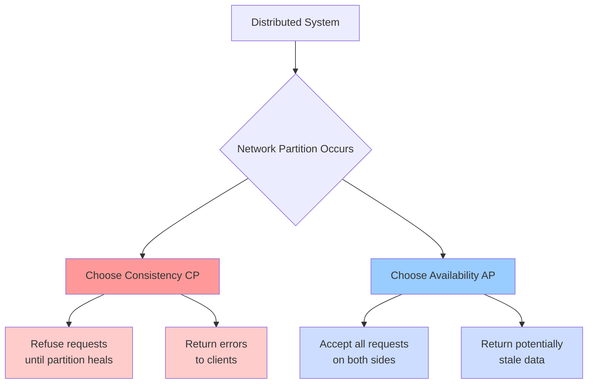
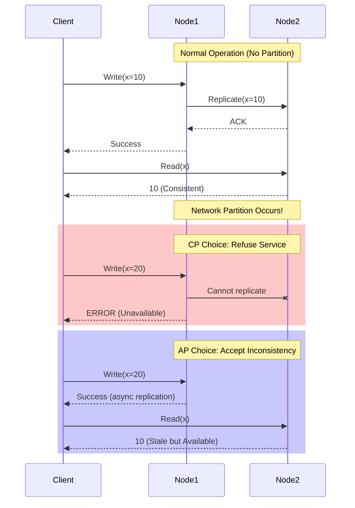
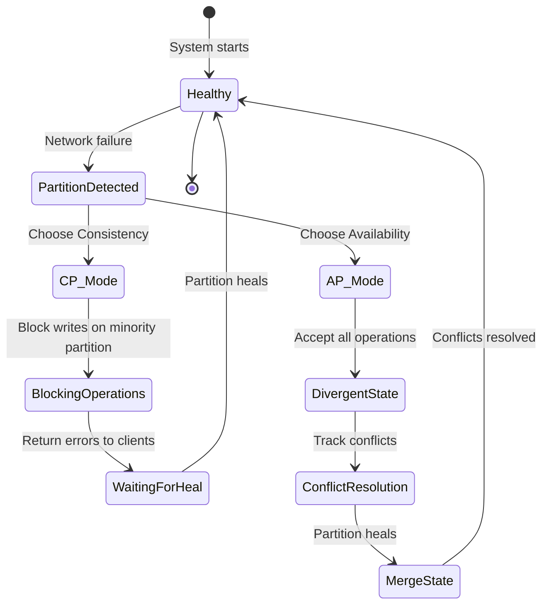
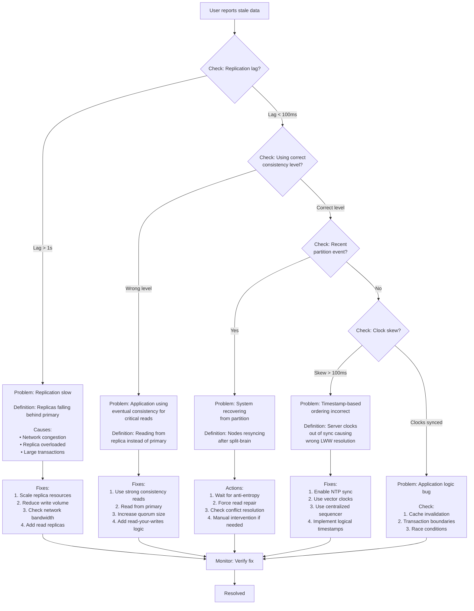

#system-design #trade-off

# Consistency vs Availability

## Intuition (30 sec)

Imagine a library with multiple checkout desks. **Consistency** is like having one master ledger that every desk must check before lending a book (accurate but slower). **Availability** is like each desk keeping its own ledger and syncing later (fast but might double-book). During a network outage between desks, you must choose: lock everything down until desks can communicate (consistent), or let each desk operate independently and fix conflicts later (available).

---

## Failure-First Scenario

Your e-commerce site goes viral during a flash sale. Network issues cause your database replicas to lose connection to the primary. If you choose **consistency**: the site goes down for 5 minutes, users can't browse or buy, you lose $500K in sales. If you choose **availability**: the site stays up, two users buy the last item, now you have an angry customer and a potential refund. The wrong choice for your business context is catastrophic.

---

## Working Knowledge (5 min)

### Core Concept - The CAP Theorem

**CAP Theorem:**
- **Definition:** In a distributed system during a network partition, you cannot simultaneously guarantee Consistency, Availability, and Partition tolerance - you must choose 2 of 3
- **Purpose:** Provides a formal framework for understanding trade-offs in distributed systems
- **How it works:** When network failures occur (partitions are unavoidable), systems must choose between returning potentially stale data (AP) or refusing requests until consistency can be guaranteed (CP)

**Key Terms:**
- **Consistency (C):** All nodes see the same data at the same time; every read receives the most recent write or an error
- **Availability (A):** Every request receives a response (success or failure) without guarantee that it contains the most recent write
- **Partition Tolerance (P):** The system continues to operate despite network partitions (message loss or delay between nodes)
- **Network Partition:** A break in communication between nodes in a distributed system, making some nodes unreachable

### Visual Model



### Consistency Models Spectrum

```
┌────────────────────────────────────────────────────────────────┐
│                   CONSISTENCY SPECTRUM                          │
├────────────────────────────────────────────────────────────────┤
│                                                                 │
│  Strongest                                              Weakest │
│  ────────────────────────────────────────────────────────────  │
│                                                                 │
│  Linearizable → Sequential → Causal → Read-Your-Writes → Eventual│
│  (Atomic)                                 (Session)             │
│                                                                 │
│  ↑                                                          ↑   │
│  Most consistent                               Most available  │
│  Lowest availability                           Lowest consistency│
│  Highest latency                               Lowest latency   │
│                                                                 │
└────────────────────────────────────────────────────────────────┘
```

### Comparison Table

| Aspect | Strong Consistency (CP) | Eventual Consistency (AP) |
|--------|------------------------|---------------------------|
| **Definition** | All nodes see same data simultaneously | Nodes converge to same state eventually |
| **Read Guarantee** | Always latest write or error | May return stale data |
| **Write Guarantee** | Confirmed only after all replicas updated | Confirmed immediately, propagates async |
| **Latency** | Higher (wait for coordination) | Lower (no coordination needed) |
| **Availability** | Lower (blocks during partition) | Higher (always responds) |
| **Use When** | Correctness is critical | Speed and uptime are critical |
| **Examples** | Bank balances, inventory | Social feeds, DNS, caches |

---

## Layer 1: Conceptual Precision (15 min)

### Strong Consistency - Deep Definitions

**Strong Consistency (Linearizability):**
- **Formal Definition:** A consistency model where operations appear to be instantaneous and atomic, maintaining a single, up-to-date copy of data across all nodes with a global real-time ordering
- **Simple Definition:** Every read gets the most recent write, as if there's only one copy of the data
- **Analogy:** Like having one whiteboard that everyone must walk to and update in person - everyone always sees the current state, but it takes time to coordinate
- **Related Terms:**
  - **Sequential Consistency:** Similar but relaxes real-time ordering (operations can be reordered as long as each client's operations stay in order)
  - **Serializability:** Used in databases, ensures transactions appear to execute in some serial order

**Why this matters:**
Strong consistency guarantees correctness but requires coordination. When a write happens, the system must ensure all replicas are updated before confirming success. During network partitions, this means blocking operations to prevent serving stale data - trading availability for correctness. Critical for financial systems, inventory management, and any scenario where showing incorrect data has serious consequences.

### Eventual Consistency - Deep Definitions

**Eventual Consistency:**
- **Formal Definition:** A consistency model where, given no new updates, all replicas will eventually converge to the same state, though reads may temporarily return stale values
- **Simple Definition:** Updates spread to all copies eventually, but there's a window where different copies show different values
- **Analogy:** Like email - when you send a message, it doesn't arrive everywhere instantly, but everyone eventually gets it
- **Related Terms:**
  - **Weak Consistency:** No guarantee when updates will be visible
  - **Causal Consistency:** Preserves cause-effect relationships (stronger than eventual, weaker than strong)
  - **Read-Your-Writes Consistency:** Users always see their own updates immediately

**Why this matters:**
Eventual consistency enables high availability and low latency by avoiding coordination. Writes are accepted immediately and propagated asynchronously. Systems remain available during partitions but may serve stale data. Perfect for scenarios where temporary inconsistency is acceptable: social media feeds, product catalogs, DNS, and read-heavy workloads.

### CAP Theorem - The Fundamental Trade-off

**CAP Theorem (Brewer's Theorem):**
- **Formal Definition:** In the presence of a network partition (P), a distributed system must choose between Consistency (C) and Availability (A)
- **Simple Definition:** When network breaks happen, you can't have both perfect consistency and 100% uptime - pick one
- **Proof:** If nodes can't communicate, serving requests means using potentially outdated data (violates consistency), while refusing requests means the system is unavailable (violates availability)

**The Three Guarantees:**

1. **Consistency (C):**
   - **Definition:** Every read receives the most recent write or returns an error
   - **Implementation:** Requires coordination protocols (Paxos, Raft, 2PC)
   - **Cost:** Higher latency, potential unavailability

2. **Availability (A):**
   - **Definition:** Every request receives a non-error response, regardless of the state of any individual node
   - **Implementation:** Each node can independently serve requests
   - **Cost:** Potential stale reads, conflict resolution complexity

3. **Partition Tolerance (P):**
   - **Definition:** System continues operating despite arbitrary message loss between nodes
   - **Reality:** Network partitions are inevitable in distributed systems (you MUST support P)
   - **Implication:** Forces choice between C and A when partitions occur

### How CAP Works (Visual Flow)



**Step-by-step breakdown:**

1. **Normal Operation:**
   - Writes are replicated synchronously
   - All nodes maintain consistent state
   - Both C and A are satisfied

2. **Partition Detected:**
   - Nodes lose communication
   - System must choose: wait for healing (CP) or continue independently (AP)

3. **CP Response:**
   - Affected nodes refuse requests
   - Return errors or timeouts
   - Maintains consistency at cost of availability

4. **AP Response:**
   - Both sides accept requests independently
   - Creates divergent state (split-brain)
   - Requires conflict resolution when partition heals

### State Diagram - System Modes



**State Definitions:**

- **Healthy:** All nodes communicate, both C and A satisfied
- **PartitionDetected:** Network split detected, must choose C or A
- **CP_Mode (Blocking):** Majority partition operates, minority refuses service
- **AP_Mode (Divergent):** All partitions operate independently
- **WaitingForHeal:** CP system waiting for network recovery
- **ConflictResolution:** AP system merging divergent states using CRDTs, LWW, or custom logic

### Architecture Patterns

**CP Architecture (Primary-Backup with Consensus):**

```
┌─────────────────────────────────────────────────────────────┐
│                    CP SYSTEM ARCHITECTURE                    │
│                                                              │
│  Definition: Strong consistency through leader election      │
│  and quorum-based replication                               │
│                                                              │
│                    ┌──────────────┐                         │
│                    │   Primary    │                         │
│                    │   (Leader)   │                         │
│                    │              │                         │
│                    │ Handles ALL  │                         │
│                    │   writes     │                         │
│                    └──────┬───────┘                         │
│                           │                                  │
│            Sync     ┌─────┼─────┐     Sync                  │
│         Replication │     │     │  Replication              │
│                     │     │     │                           │
│              ┌──────▼─┐ ┌─▼─────▼──┐                       │
│              │Replica1│ │ Replica2 │                       │
│              │        │ │          │                       │
│              │Read-   │ │ Read-    │                       │
│              │only    │ │ only     │                       │
│              └────────┘ └──────────┘                       │
│                                                              │
│  Quorum: Majority (N/2 + 1) must ACK writes                │
│  Network Partition: Minority partition goes unavailable     │
│                                                              │
└─────────────────────────────────────────────────────────────┘
```

**AP Architecture (Multi-Master with Eventual Sync):**

```
┌─────────────────────────────────────────────────────────────┐
│                    AP SYSTEM ARCHITECTURE                    │
│                                                              │
│  Definition: High availability through independent operation │
│  and asynchronous reconciliation                            │
│                                                              │
│     ┌──────────┐         ┌──────────┐         ┌──────────┐ │
│     │  Node 1  │         │  Node 2  │         │  Node 3  │ │
│     │          │         │          │         │          │ │
│     │ Accepts  │         │ Accepts  │         │ Accepts  │ │
│     │  Reads   │         │  Reads   │         │  Reads   │ │
│     │  Writes  │         │  Writes  │         │  Writes  │ │
│     └────┬─────┘         └────┬─────┘         └────┬─────┘ │
│          │                    │                    │        │
│          │    Async Gossip    │    Async Gossip   │        │
│          │◄──────────────────►│◄─────────────────►│        │
│          │                    │                    │        │
│          └────────────────────┴────────────────────┘        │
│                                                              │
│  All nodes are equal (no primary)                           │
│  Writes propagate via gossip protocol                       │
│  Network Partition: Both sides remain available             │
│  Conflict Resolution: Last-Write-Wins, CRDTs, or custom     │
│                                                              │
└─────────────────────────────────────────────────────────────┘
```

**Component Definitions:**

- **Primary (Leader):** Single node responsible for coordinating all writes and ensuring consistency
- **Replica:** Copy of data that can serve reads but forwards writes to primary
- **Quorum:** Minimum number of nodes that must agree for operation to succeed (typically majority)
- **Multi-Master:** Architecture where any node can accept writes without coordination
- **Gossip Protocol:** Peer-to-peer communication pattern where nodes randomly exchange state updates
- **CRDT (Conflict-free Replicated Data Type):** Data structure that guarantees eventual consistency by design

### Consistency Models - Detailed Hierarchy

**The Consistency Spectrum:**

1. **Linearizability (Strongest):**
   - **Definition:** Operations appear to execute instantaneously at some point between invocation and response
   - **Guarantee:** Global real-time ordering
   - **Example:** Read after write always returns the written value
   - **Cost:** Highest latency, requires coordination

2. **Sequential Consistency:**
   - **Definition:** Operations appear in same order to all nodes, but not necessarily real-time order
   - **Guarantee:** Per-process ordering preserved
   - **Example:** If process A writes X then Y, all processes see X before Y
   - **Cost:** Still requires coordination but more relaxed than linearizability

3. **Causal Consistency:**
   - **Definition:** Operations that are causally related must be seen in same order by all nodes
   - **Guarantee:** Cause happens before effect everywhere
   - **Example:** Replies always appear after the original post
   - **Cost:** Medium coordination, tracks causality

4. **Read-Your-Writes Consistency:**
   - **Definition:** Process always sees its own updates
   - **Guarantee:** Personal consistency only
   - **Example:** After posting a comment, you always see it (others might not yet)
   - **Cost:** Session stickiness or tracking

5. **Monotonic Read Consistency:**
   - **Definition:** Once a process reads a value, it never reads an older value
   - **Guarantee:** Time doesn't go backwards for a client
   - **Example:** Your feed doesn't show older version after refresh
   - **Cost:** Client session tracking

6. **Eventual Consistency (Weakest):**
   - **Definition:** All replicas converge given no new updates
   - **Guarantee:** Eventually consistent, but no time bound
   - **Example:** DNS updates propagate worldwide in hours
   - **Cost:** Lowest - no coordination needed

### Trade-offs Matrix (Detailed)

```
STRONG CONSISTENCY (CP)              EVENTUAL CONSISTENCY (AP)
═══════════════════════════════════════════════════════════════

Definition:                          Definition:
All nodes see same data at           Nodes converge to same state
same time through coordination       over time without coordination

─────────────────────────────────────────────────────────────

PROS:                                PROS:
• Correctness guaranteed             • Always available (99.99%+)
  (no stale reads ever)               (serves requests during partitions)

• Simpler application logic          • Lower latency (no coordination)
  (no conflict resolution)            (10-50ms vs 100-500ms)

• ACID transactions                  • Better scalability
  (strong guarantees)                 (add nodes without coordination)

• Easier to reason about             • Partition tolerant
  (single source of truth)            (both sides remain operational)

─────────────────────────────────────────────────────────────

CONS:                                CONS:
• Higher latency                     • Stale reads possible
  (wait for quorum ACKs)              (inconsistency window: ms to hours)

• Lower availability                 • Complex conflict resolution
  (minority partition unavailable)    (CRDTs, vector clocks, LWW)

• Doesn't scale as well              • Harder application logic
  (coordination overhead)             (must handle inconsistency)

• Single point of failure            • Weaker guarantees
  (leader bottleneck)                 (no ACID transactions)

─────────────────────────────────────────────────────────────

USE WHEN:                            USE WHEN:

• Financial transactions             • Social media feeds
  (payments, banking)                 (likes, comments)

• Inventory management               • Product catalogs
  (prevent overselling)               (descriptions, images)

• Booking systems                    • User profiles
  (seats, hotel rooms)                (bio, preferences)

• Access control                     • Content delivery
  (permissions, roles)                (CDN, caches)

• Correctness > availability         • Availability > correctness

─────────────────────────────────────────────────────────────

IMPLEMENTATION:                      IMPLEMENTATION:

• Leader election (Raft, Paxos)      • Gossip protocols
• Synchronous replication            • Asynchronous replication
• Quorum reads/writes                • Hinted handoff
• Two-phase commit (2PC)             • Read repair
                                     • Anti-entropy (Merkle trees)

─────────────────────────────────────────────────────────────

EXAMPLES:                            EXAMPLES:

• PostgreSQL (primary-replica)       • Cassandra (multi-master)
• MongoDB (with w=majority)          • DynamoDB (eventually)
• etcd (Raft consensus)              • Riak (configurable)
• ZooKeeper (Zab protocol)           • CouchDB (multi-master)
• Google Spanner (TrueTime)          • DNS (global eventually)
```

### The Math Behind Quorums

**Quorum Formula:**
```
For N replicas:
  Write quorum: W nodes
  Read quorum: R nodes

Strong consistency requires: W + R > N
Typical setup: W = R = (N/2 + 1)
```

**Term Definitions:**
- **N (Replication Factor):** Total number of replicas
- **W (Write Quorum):** Minimum replicas that must acknowledge a write
- **R (Read Quorum):** Minimum replicas that must be consulted for a read
- **Why W + R > N:** Guarantees read and write sets overlap, ensuring reads see latest write

**Example Calculation:**

```
Given: N = 5 replicas

Strong Consistency Setup:
  W = 3 (majority)
  R = 3 (majority)
  W + R = 6 > 5 ✓ (guarantees overlap)

Scenario:
  1. Write(x=10) succeeds after 3 replicas ACK
  2. Read(x) queries 3 replicas
  3. At least 1 replica in read set was in write set
  4. Read returns latest value (10)

High Availability Setup:
  W = 1 (faster writes)
  R = 1 (faster reads)
  W + R = 2 < 5 ✗ (no overlap guarantee)

Scenario:
  1. Write(x=10) succeeds after 1 replica ACKs
  2. Read(x) queries 1 different replica
  3. That replica might not have the update yet
  4. Read might return stale value
  5. Eventually consistent through async replication
```

**Tunable Consistency:**

```
┌─────────────────────────────────────────────────────────┐
│           CONSISTENCY vs LATENCY SPECTRUM               │
├─────────────────────────────────────────────────────────┤
│                                                         │
│  Configuration    W    R    W+R>N?   Consistency       │
│  ─────────────────────────────────────────────────────  │
│                                                         │
│  Strong           3    3    Yes      Always consistent │
│                                       Highest latency   │
│                                                         │
│  Balanced         2    2    No       Usually consistent│
│                                       Medium latency    │
│                                                         │
│  Fast Reads       2    1    No       May read stale    │
│                                       Low read latency  │
│                                                         │
│  Fast Writes      1    2    No       May read stale    │
│                                       Low write latency │
│                                                         │
│  Eventual         1    1    No       Eventually sync   │
│                                       Lowest latency    │
│                                                         │
└─────────────────────────────────────────────────────────┘
```

---

## Layer 2: Technology-Specific Examples (20 min)

### Technology Comparison (With Definitions)

**Tool Category:** Distributed Databases - How they implement the CAP trade-off

#### CP Systems (Consistency + Partition Tolerance)

| PostgreSQL | MongoDB | etcd |
|------------|---------|------|
| **Definition:** Traditional RDBMS with primary-replica replication | **Definition:** Document database with replica sets | **Definition:** Distributed key-value store using Raft consensus |
| **Consistency:** Synchronous replication to replicas | **Consistency:** Configurable (w=majority for strong) | **Consistency:** Linearizable through Raft |
| **Availability:** Replicas go read-only during partition | **Availability:** Secondary nodes can't accept writes | **Consistency:** Leader election during partition |
| **Best For:** Traditional apps requiring ACID | **Best For:** Document storage with strong consistency | **Best For:** Configuration management, service discovery |
| **Partition Behavior:** Minority partition rejects writes | **Partition Behavior:** Only primary partition available | **Partition Behavior:** Majority partition continues |

#### AP Systems (Availability + Partition Tolerance)

| Cassandra | DynamoDB | Riak |
|-----------|----------|------|
| **Definition:** Wide-column database with multi-master architecture | **Definition:** AWS managed key-value/document store | **Definition:** Distributed key-value database |
| **Consistency:** Tunable quorum (eventual by default) | **Consistency:** Eventually consistent (strongly consistent option available) | **Consistency:** Tunable with eventual default |
| **Availability:** All nodes accept reads/writes | **Availability:** Multiple availability zones | **Availability:** Gossip-based full replication |
| **Best For:** Time-series, high write throughput | **Best For:** Serverless applications, gaming | **Best For:** High availability key-value |
| **Conflict Resolution:** Last-write-wins (LWW) timestamp | **Conflict Resolution:** Vector clocks, application-level | **Conflict Resolution:** Vector clocks, siblings |

#### CA Systems (When P is Not Expected)

| Single-Node DB | Same-Rack Cluster |
|----------------|-------------------|
| **Definition:** Non-distributed system (PostgreSQL, MySQL single instance) | **Definition:** Cluster in same physical location |
| **Reality:** CA doesn't exist in distributed systems | **Reality:** Network partitions still possible |
| **Note:** If no network partition, both C and A possible | **Note:** Rare in production - always plan for P |

### Real-World Configuration Examples

#### Cassandra - Tunable Consistency

```yaml
# Cassandra Consistency Level Configuration

# Definition: Consistency level determines how many replicas
# must respond before operation is considered successful

# WRITE CONSISTENCY LEVELS:

consistency_level: ONE
# Definition: Write returns after 1 replica ACKs
# Latency: ~5ms
# Use when: Maximum write speed, eventual consistency acceptable
# Example: Logging, metrics, time-series data

consistency_level: QUORUM
# Definition: Write returns after majority ACKs (RF/2 + 1)
# Latency: ~20ms
# Use when: Balance between consistency and performance
# Example: User profiles, session data

consistency_level: ALL
# Definition: Write returns after ALL replicas ACK
# Latency: ~50ms (slowest replica)
# Use when: Critical data that must be durable immediately
# Example: Financial transactions (but consider CP system instead)

# READ CONSISTENCY LEVELS:

consistency_level: ONE
# Definition: Read from fastest responding replica
# Latency: ~2ms
# Staleness risk: High (may read old data)
# Use when: Acceptable to see stale data temporarily

consistency_level: QUORUM
# Definition: Read from majority of replicas, return latest
# Latency: ~10ms
# Staleness risk: Low (majority has latest data)
# Use when: Balance speed and consistency

# STRONG CONSISTENCY FORMULA:
# Write QUORUM + Read QUORUM = Strong consistency
# (ensures read/write overlap)

# Key Concepts:
# - Replication Factor (RF): Number of copies of data
# - Coordinator: Node receiving client request
# - Hinted Handoff: Store writes for offline nodes
# - Read Repair: Fix stale replicas during reads
# - Anti-Entropy: Background sync using Merkle trees
```

#### DynamoDB - Consistency Options

```python
# DynamoDB SDK Configuration

import boto3

dynamodb = boto3.resource('dynamodb')
table = dynamodb.Table('Orders')

# EVENTUALLY CONSISTENT READ (default)
response = table.get_item(
    Key={'order_id': '12345'},
    ConsistentRead=False  # Default: Eventually consistent
)
# Definition: Reads from any replica, may return stale data
# Latency: ~5ms
# Cost: 0.5 RCU per read
# Staleness window: Typically < 1 second
# Use when: High read throughput, stale data acceptable
# Example: Product catalogs, user profiles

# STRONGLY CONSISTENT READ
response = table.get_item(
    Key={'order_id': '12345'},
    ConsistentRead=True  # Strong consistency
)
# Definition: Reads from primary replica only
# Latency: ~10ms (slightly higher)
# Cost: 1 RCU per read (2x eventually consistent)
# Guarantee: Returns all writes received before the read
# Use when: Must have latest data (inventory, balances)
# Example: Order status, payment confirmation

# TRANSACTIONAL WRITES (Strong Consistency)
dynamodb.transact_write_items(
    TransactItems=[
        {
            'Update': {
                'TableName': 'Orders',
                'Key': {'order_id': '12345'},
                'UpdateExpression': 'SET status = :s',
                'ExpressionAttributeValues': {':s': 'confirmed'}
            }
        }
    ]
)
# Definition: ACID transaction across items/tables
# Guarantee: All-or-nothing, isolated execution
# Cost: 2x standard write cost
# Use when: Multi-item consistency required
# Example: Transfer between accounts, order + inventory update

# Key DynamoDB Concepts:
# - RCU (Read Capacity Unit): Measure of read throughput
# - WCU (Write Capacity Unit): Measure of write throughput
# - Global Tables: Multi-region eventual consistency
# - Point-in-Time Recovery: Backup/restore capability
```

#### MongoDB - Replica Set Configuration

```javascript
// MongoDB Replica Set Write Concerns

// Definition: Write concern specifies acknowledgment level
// for write operations

// w: 1 (Default) - Fast, eventual consistency
db.orders.insertOne(
  { order_id: 12345, status: "pending" },
  { writeConcern: { w: 1 } }
)
// Acknowledgment: Primary only
// Latency: ~5ms
// Durability risk: Data lost if primary fails before replication
// Use when: High throughput writes, data loss acceptable
// Example: Logs, metrics, caches

// w: "majority" - Strong consistency
db.orders.insertOne(
  { order_id: 12345, status: "confirmed" },
  { writeConcern: { w: "majority" } }
)
// Acknowledgment: Majority of replica set (primary + majority of secondaries)
// Latency: ~20ms (wait for replication)
// Durability: Survives primary failure
// Use when: Important data that must be durable
// Example: User data, orders, financial records

// w: "majority" + j: true - Durable + strong
db.orders.insertOne(
  { order_id: 12345, status: "confirmed" },
  { writeConcern: { w: "majority", j: true } }
)
// Acknowledgment: Majority + written to journal (on-disk log)
// Latency: ~30ms (disk write)
// Durability: Survives crash + primary failure
// Use when: Critical data, regulatory requirements
// Example: Payments, compliance data

// READ PREFERENCE - Where to read from

// primary (Default) - Strong consistency
db.orders.find().readPref("primary")
// Reads from: Primary replica only
// Consistency: Always latest data
// Use when: Must have up-to-date data

// primaryPreferred - CP with fallback
db.orders.find().readPref("primaryPreferred")
// Reads from: Primary if available, else secondary
// Consistency: Strong when primary available
// Use when: Want strong consistency but need availability during failover

// secondary - Eventual consistency
db.orders.find().readPref("secondary")
// Reads from: Any secondary replica
// Consistency: May be slightly stale (< 1s typically)
// Use when: Analytics, reporting, read scaling
// Benefit: Offloads reads from primary

// Key MongoDB Concepts:
// - Primary: Only node accepting writes
// - Secondary: Read-only replica
// - Arbiter: Voting-only member (breaks ties)
// - Replica Set: Group of MongoDB servers maintaining same data
// - Oplog: Operation log for replication
```

### Setup Flow - Cassandra Ring (AP System)

```
Step 1: Install Cassandra
┌────────────────────────────────────────────┐
│ apt-get install cassandra                  │
│                                            │
│ Definition: Installs distributed database  │
│ with no single point of failure           │
└────────────────────────────────────────────┘
      │
      ▼
Step 2: Configure cassandra.yaml
┌────────────────────────────────────────────┐
│ cluster_name: 'Production'                 │
│ seeds: "192.168.1.1,192.168.1.2"          │
│                                            │
│ Purpose: Seeds are initial contact points │
│ for gossip protocol to discover cluster   │
└────────────────────────────────────────────┘
      │
      ▼
Step 3: Create Keyspace (Database)
┌────────────────────────────────────────────┐
│ CREATE KEYSPACE ecommerce WITH             │
│   REPLICATION = {                          │
│     'class': 'SimpleStrategy',             │
│     'replication_factor': 3                │
│   };                                       │
│                                            │
│ Definition:                                │
│ - Keyspace: Top-level namespace           │
│ - Replication factor: Number of copies    │
│ - SimpleStrategy: All datacenters treated │
│   equally (use NetworkTopologyStrategy for│
│   multi-DC production)                     │
└────────────────────────────────────────────┘
      │
      ▼
Step 4: Create Table with Tunable Consistency
┌────────────────────────────────────────────┐
│ CREATE TABLE orders (                      │
│   order_id UUID PRIMARY KEY,               │
│   status TEXT,                             │
│   created_at TIMESTAMP                     │
│ );                                         │
│                                            │
│ -- Write with QUORUM consistency          │
│ INSERT INTO orders VALUES (...)            │
│   USING CONSISTENCY QUORUM;                │
│                                            │
│ Result: Each node can accept writes,      │
│ data replicated asynchronously            │
└────────────────────────────────────────────┘
```

### Decision Matrix - When to Choose What

```
┌─────────────────────────────────────────────────────────────────────┐
│              CONSISTENCY vs AVAILABILITY DECISION TREE               │
└─────────────────────────────────────────────────────────────────────┘

START: What happens if user sees stale data?

  ┌─► Money lost / Legal issue / Safety risk
  │   └─► CHOOSE: Strong Consistency (CP)
  │       ├─► Single region: PostgreSQL, MySQL
  │       ├─► Distributed: MongoDB (majority), etcd
  │       └─► Global: Google Spanner, CockroachDB
  │
  │
  ├─► User confusion / Poor UX / Minor inconvenience
  │   └─► CHOOSE: Eventual Consistency (AP)
  │       ├─► High writes: Cassandra
  │       ├─► Managed: DynamoDB
  │       └─► Global: CouchDB, Riak
  │
  │
  └─► Need both? Consider:
      ├─► Hybrid: Different consistency per operation
      │   Example: Orders (CP) + Product catalog (AP)
      │
      ├─► CQRS: Separate read/write models
      │   Example: Write to CP, replicate to AP for reads
      │
      └─► Compensating transactions
          Example: Eventually consistent + saga pattern

┌─────────────────────────────────────────────────────────────────────┐
│                      DETAILED DECISION MATRIX                        │
├─────────────────────────────────────────────────────────────────────┤

IF correctness is critical (wrong data = disaster)
  AND low latency is NOT critical
  THEN choose CP (Strong Consistency)
  EXAMPLES:
    • Banking transactions
    • Inventory reservation
    • Seat booking
    • Medical records
    • Access control

IF availability is critical (downtime = lost revenue)
  AND users tolerate stale data
  THEN choose AP (Eventual Consistency)
  EXAMPLES:
    • Social media feeds
    • Product catalogs
    • User profiles
    • Content delivery
    • Analytics dashboards

IF need low latency AND high availability
  AND can handle occasional conflicts
  THEN choose AP with conflict resolution
  EXAMPLES:
    • Shopping carts (merge items)
    • Document editing (CRDTs)
    • Counter increments (commutative)

IF need strong consistency AND high availability
  AND have budget for it
  THEN choose special solutions
  EXAMPLES:
    • Google Spanner (atomic clocks)
    • CockroachDB (distributed transactions)
    • YugabyteDB (Raft + sharding)
  NOTE: These reduce but don't eliminate trade-off

┌─────────────────────────────────────────────────────────────────────┐
│                     WORKLOAD-BASED DECISIONS                         │
├─────────────────────────────────────────────────────────────────────┤

READ-HEAVY WORKLOAD (90%+ reads):
  → Choose AP with fast reads
  → Cache aggressively
  → Eventual consistency acceptable
  → Example: News sites, blogs, documentation

WRITE-HEAVY WORKLOAD (50%+ writes):
  → If need consistency: CP with write optimization
  → If can be eventual: AP for write throughput
  → Example: Time-series (AP), Banking (CP)

BALANCED WORKLOAD:
  → Analyze criticality of each operation
  → Use tunable consistency (Cassandra, DynamoDB)
  → Strong for critical writes, eventual for reads
  → Example: E-commerce (orders CP, catalog AP)

┌─────────────────────────────────────────────────────────────────────┐
│                        SCALE CONSIDERATIONS                          │
├─────────────────────────────────────────────────────────────────────┤

SMALL SCALE (Single region, < 1M users):
  → CP is often fine
  → Latency acceptable
  → PostgreSQL/MySQL with replicas
  → Simpler to operate

LARGE SCALE (Multi-region, > 10M users):
  → AP becomes necessary
  → Latency across regions too high for CP
  → DynamoDB, Cassandra
  → Complex but required

GLOBAL SCALE (Worldwide, > 100M users):
  → Must use AP for most data
  → Regional consistency islands
  → CDN for static content
  → Eventual consistency with CRDTs
```

---

## Layer 3: Production-Ready Details (30 min)

### Production Architecture - E-commerce Hybrid Approach

```
                        ┌─────────────────────────────────────────┐
                        │         GLOBAL LOAD BALANCER            │
                        │                                         │
                        │ Definition: Routes users to nearest     │
                        │ region for lowest latency               │
                        └───────────────┬─────────────────────────┘
                                        │
                ┌───────────────────────┼───────────────────────┐
                │                       │                       │
        ┌───────▼────────┐     ┌───────▼────────┐     ┌───────▼────────┐
        │   US REGION    │     │   EU REGION    │     │  ASIA REGION   │
        └────────────────┘     └────────────────┘     └────────────────┘

        Each region contains:

┌─────────────────────────────────────────────────────────────────────┐
│                         REGION ARCHITECTURE                          │
├─────────────────────────────────────────────────────────────────────┤
│                                                                      │
│  ┌──────────────────┐                 ┌──────────────────┐         │
│  │   API Gateway    │                 │   API Gateway    │         │
│  │  (Availability   │                 │  (Availability   │         │
│  │    Zone 1)       │                 │    Zone 2)       │         │
│  └────────┬─────────┘                 └────────┬─────────┘         │
│           │                                     │                    │
│           └─────────────────┬───────────────────┘                   │
│                             │                                        │
│                    ┌────────▼─────────┐                             │
│                    │  Service Mesh    │                             │
│                    │  (Routing Layer) │                             │
│                    └────────┬─────────┘                             │
│                             │                                        │
│         ┌───────────────────┼───────────────────┐                  │
│         │                   │                   │                   │
│  ┌──────▼───────┐   ┌──────▼──────┐   ┌───────▼────────┐         │
│  │   Orders     │   │  Catalog    │   │  User Profile  │         │
│  │   Service    │   │  Service    │   │    Service     │         │
│  │              │   │             │   │                │         │
│  │  CP System   │   │  AP System  │   │   AP System    │         │
│  └──────┬───────┘   └──────┬──────┘   └───────┬────────┘         │
│         │                  │                   │                   │
│         │                  │                   │                   │
│  ┌──────▼─────────────────────────────────────▼─────────┐        │
│  │                                                        │        │
│  │             DATA LAYER (HYBRID CONSISTENCY)           │        │
│  │                                                        │        │
│  │  ┌──────────────────────┐  ┌──────────────────────┐ │        │
│  │  │   PostgreSQL         │  │   DynamoDB           │ │        │
│  │  │   (CP - Orders)      │  │   (AP - Catalog)     │ │        │
│  │  │                      │  │                      │ │        │
│  │  │ • Primary + 2 replicas│  │ • Global tables     │ │        │
│  │  │ • Sync replication   │  │ • Eventual sync     │ │        │
│  │  │ • Quorum reads       │  │ • Multi-region      │ │        │
│  │  │ • ACID transactions  │  │ • Auto-scaling      │ │        │
│  │  │                      │  │                      │ │        │
│  │  │ Used for:            │  │ Used for:           │ │        │
│  │  │ - Order processing   │  │ - Product catalog   │ │        │
│  │  │ - Inventory          │  │ - User profiles     │ │        │
│  │  │ - Payments           │  │ - Shopping carts    │ │        │
│  │  └──────────────────────┘  └──────────────────────┘ │        │
│  │                                                        │        │
│  │  ┌──────────────────────┐  ┌──────────────────────┐ │        │
│  │  │   Redis              │  │   Cassandra          │ │        │
│  │  │   (Cache - AP)       │  │   (AP - Time-series) │ │        │
│  │  │                      │  │                      │ │        │
│  │  │ • Read-through cache │  │ • Event logs        │ │        │
│  │  │ • TTL: 60s           │  │ • Analytics         │ │        │
│  │  │ • Eventual consistency│  │ • Audit trails     │ │        │
│  │  └──────────────────────┘  └──────────────────────┘ │        │
│  └────────────────────────────────────────────────────────┘        │
└─────────────────────────────────────────────────────────────────────┘

KEY ARCHITECTURAL DECISIONS:

┌─────────────────────────────────────────────────────────────────────┐
│  Component          Consistency   Reason                            │
├─────────────────────────────────────────────────────────────────────┤
│  Orders             CP            Can't double-sell, lose money     │
│  Inventory          CP            Must prevent overselling          │
│  Payments           CP            Financial accuracy required       │
│  Product Catalog    AP            Stale product info acceptable     │
│  User Profiles      AP            Slight delay in profile OK        │
│  Shopping Cart      AP            Can merge conflicts               │
│  Recommendations    AP            Stale recommendations fine        │
│  Analytics          AP            Not real-time critical            │
└─────────────────────────────────────────────────────────────────────┘
```

**Architecture Component Definitions:**

- **Service Mesh:** Infrastructure layer handling service-to-service communication, load balancing, and circuit breaking
- **Availability Zone:** Isolated location within region with independent power, cooling, and networking
- **Global Tables:** Multi-region DynamoDB tables with automatic cross-region replication
- **Read-through Cache:** Cache pattern where cache automatically loads from database on miss
- **Circuit Breaker:** Pattern preventing cascading failures by stopping requests to failing service

### Monitoring Metrics for Consistency/Availability Trade-offs

```
┌─────────────────────────────────────────────────────────────────────┐
│                    CONSISTENCY METRICS DASHBOARD                     │
├─────────────────────────────────────────────────────────────────────┤
│                                                                      │
│  REPLICATION LAG (Eventual Consistency Systems)                     │
│  ════════════════════════════════════════════════                   │
│  Current: 247ms                                                      │
│  P50: 180ms  │  P95: 450ms  │  P99: 890ms                          │
│  ▓▓▓▓▓▓▓▓▓▓▓▓▓▓▓░░░░░░░░░░░░░░░░░░░░░░░░                          │
│                                                                      │
│  Definition: Time delay between write on primary and                │
│             availability on replicas                                │
│  Why track: High lag = users see stale data longer                 │
│  Alert when: > 1 second (indicates replication issues)             │
│  Acceptable: < 100ms for user-facing data                          │
│                                                                      │
│ ─────────────────────────────────────────────────────────────────   │
│                                                                      │
│  WRITE AVAILABILITY                                                  │
│  ════════════════════════════════════════════════                   │
│  Current: 99.97%                                                     │
│  Failed writes (5m): 12 / 40,000                                    │
│  ▓▓▓▓▓▓▓▓▓▓▓▓▓▓▓▓▓▓▓▓▓▓▓▓▓▓▓▓▓▓▓▓▓▓▓▓▓▓▓                          │
│                                                                      │
│  Definition: Percentage of write requests that succeed              │
│  Why track: Measures system availability during issues             │
│  Alert when: < 99.9% (3 nines)                                     │
│  Target: 99.99% (4 nines) for production                           │
│                                                                      │
│ ─────────────────────────────────────────────────────────────────   │
│                                                                      │
│  READ STALENESS                                                      │
│  ════════════════════════════════════════════════                   │
│  Stale reads (last 5m): 342 / 500,000 (0.068%)                     │
│  Average staleness: 156ms                                           │
│  ▓▓░░░░░░░░░░░░░░░░░░░░░░░░░░░░░░░░░░░░░░                          │
│                                                                      │
│  Definition: Percentage of reads returning outdated data            │
│  Measurement: Compare read value with known latest write            │
│  Why track: Measures actual user-facing inconsistency               │
│  Acceptable: Depends on use case                                    │
│    • Banking: 0% (use strong consistency)                           │
│    • Social feed: < 5% (eventual is fine)                           │
│                                                                      │
│ ─────────────────────────────────────────────────────────────────   │
│                                                                      │
│  QUORUM RESPONSE TIME (CP Systems)                                  │
│  ════════════════════════════════════════════════                   │
│  Current: 23ms                                                       │
│  P50: 18ms  │  P95: 45ms  │  P99: 87ms                             │
│  ▓▓▓▓▓▓▓▓▓▓▓▓▓▓▓▓▓▓░░░░░░░░░░░░░░░░░░░░░                          │
│                                                                      │
│  Definition: Time to receive quorum acknowledgments                 │
│  Why track: High latency = slow user experience                    │
│  Alert when: P99 > 100ms (noticeable delay)                        │
│  Optimization: Add replicas closer to users                         │
│                                                                      │
│ ─────────────────────────────────────────────────────────────────   │
│                                                                      │
│  CONFLICT RATE (AP Systems)                                         │
│  ════════════════════════════════════════════════                   │
│  Conflicts detected (1h): 47                                        │
│  Conflicts auto-resolved: 45 (95.7%)                               │
│  Conflicts requiring manual resolution: 2 (4.3%)                   │
│  ▓▓▓▓▓▓▓▓▓▓▓▓▓▓▓▓▓▓▓▓▓▓▓▓▓▓▓▓▓▓▓▓▓▓▓▓▓▓▓                          │
│                                                                      │
│  Definition: Rate of write conflicts in multi-master systems        │
│  Why track: High conflicts = poor data model or hotspots           │
│  Resolution strategies:                                             │
│    • Last-Write-Wins (LWW): Use timestamp                           │
│    • CRDTs: Mathematically commutative merges                       │
│    • Application logic: Custom merge                                │
│  Alert when: > 1% conflicts OR manual resolution needed            │
│                                                                      │
│ ─────────────────────────────────────────────────────────────────   │
│                                                                      │
│  PARTITION EVENTS                                                    │
│  ════════════════════════════════════════════────                   │
│  Last 24h: 0 events                                                 │
│  Last 7d: 2 events (avg duration: 3.2 minutes)                     │
│  Last 30d: 9 events (avg duration: 4.7 minutes)                    │
│                                                                      │
│  Definition: Network partition detected between nodes               │
│  Why track: Triggers CP vs AP decision point                       │
│  Metrics during partition:                                          │
│    • CP system: Availability drop on minority side                  │
│    • AP system: Conflict rate spike                                 │
│  Recovery time: Time to heal and resync                             │
│                                                                      │
└─────────────────────────────────────────────────────────────────────┘
```

**Metric Definitions:**

- **Replication Lag:** Time delay between write and propagation to all replicas
- **Write Availability:** Success rate of write operations (available / total attempts)
- **Staleness:** Duration between write and when all nodes have consistent data
- **Quorum Response Time:** Latency to achieve majority acknowledgments
- **Conflict Rate:** Frequency of concurrent writes creating conflicts requiring resolution
- **Partition Event:** Period when subset of nodes cannot communicate with others

### Troubleshooting Flow for Consistency Issues



### Capacity Planning - Consistency Impact

**Capacity Planning for CP vs AP:**

- **Definition:** Process of sizing infrastructure to meet performance SLAs while accounting for consistency overhead
- **Goal:** Right-size for consistency choice without overspending or underperforming

**Key Metrics:**

- **Quorum Latency Tax:** Additional latency from waiting for multiple replicas
  - Formula: `Quorum Latency = Latency to slowest required replica`
  - CP systems: P99 latency matters (can't return until quorum)
  - AP systems: P50 latency matters (can return from fastest replica)

- **Replication Overhead:** Extra resources needed for copies
  - Formula: `Total Storage = Data Size × Replication Factor`
  - Formula: `Network Bandwidth = Write Rate × (Replication Factor - 1)`

**Calculation Example - CP System (Strong Consistency):**

```
Scenario: E-commerce order service

Requirements:
• 1,000 orders/second peak
• 3 replicas (RF=3) for durability
• Target P99 latency: < 50ms
• Strong consistency (quorum writes)

Step 1: Calculate quorum size
  Definition: Quorum = majority of replicas
  Quorum = (3 / 2) + 1 = 2 nodes must ACK

Step 2: Estimate quorum latency
  Definition: Must wait for 2nd-fastest replica
  Assume:
    • Single-region: Same-AZ latency = 5ms
    • Cross-AZ latency = 15ms (network + processing)
  Quorum latency ≈ 15ms (wait for cross-AZ replica)

Step 3: Calculate required throughput per node
  Definition: Each write goes to primary, then 2 replicas
  Write fanout = 1 primary + 2 replicas = 3 total writes
  Total writes/sec = 1,000 orders/sec × 3 = 3,000 writes/sec
  Per-node capacity needed: 3,000 / 3 = 1,000 writes/sec each

Step 4: Network bandwidth
  Assume: 10KB average order size
  Primary → Replica bandwidth = 1,000 orders/sec × 10KB × 2 replicas
                                = 20 MB/sec = 160 Mbps

Step 5: Account for partition scenario
  During partition: Minority partition unavailable
  Must handle 100% load on majority partition
  Overprovisioning: 2x capacity on majority side

Result:
  • 3 database nodes (primary + 2 replicas)
  • Each node: 2,000 writes/sec capacity (2x headroom)
  • Network: 250 Mbps (with headroom)
  • P99 latency: ~25ms (within target)
```

**Calculation Example - AP System (Eventual Consistency):**

```
Scenario: Social media feed service

Requirements:
• 50,000 posts/second peak
• 5 replicas (RF=5) for global distribution
• Target P99 latency: < 20ms
• Eventual consistency (ONE write)

Step 1: Calculate write acknowledgment
  Definition: Write returns after ANY 1 replica ACKs
  Acknowledgment latency = Latency to fastest replica
  Typically: 2-5ms (local datacenter)

Step 2: Calculate replication load
  Each write eventually replicates to all 5 nodes
  Total writes (eventual) = 50,000 × 5 = 250,000 writes/sec
  But: Asynchronous, spread over time window

  With 1-second replication window:
  Per-node capacity = 50,000 writes/sec (parallel async)

Step 3: Network bandwidth (async replication)
  Assume: 5KB average post size
  Background replication = 50,000 posts/sec × 5KB × 4 destinations
                         = 1 GB/sec = 8 Gbps
  Spread across 5 nodes: 1.6 Gbps per node

Step 4: Read scaling
  Reads can hit ANY replica (no quorum)
  Assume: 100:1 read:write ratio
  Read traffic: 5,000,000 reads/sec
  Distributed across 5 nodes: 1,000,000 reads/sec per node

Step 5: Partition scenario
  During partition: ALL partitions remain available
  Each side accepts writes independently
  Conflict resolution: Last-Write-Wins (timestamp)
  No capacity reduction needed during partition

Result:
  • 5 database nodes (all equal)
  • Each node: 50,000 writes/sec + 1M reads/sec
  • Network: 2 Gbps per node
  • P99 latency: ~8ms (faster than CP)
  • Partition impact: Zero (both sides operational)
```

**Key Takeaway:**

```
┌─────────────────────────────────────────────────────────────────┐
│         CAPACITY COMPARISON: CP vs AP                           │
├─────────────────────────────────────────────────────────────────┤
│                                                                 │
│  Metric              CP (Strong)        AP (Eventual)           │
│  ─────────────────────────────────────────────────────────────  │
│  Latency             3-5x higher       Baseline                 │
│  Throughput          Lower             Higher                   │
│  Cost                2x (oversized)    1x (right-sized)        │
│  Partition impact    50% unavailable   0% unavailable          │
│  Complexity          Medium             High (conflicts)        │
│                                                                 │
│  Rule of thumb:                                                 │
│  • CP systems: Provision 2x capacity for partition tolerance   │
│  • AP systems: Provision 1x + conflict resolution overhead     │
│                                                                 │
└─────────────────────────────────────────────────────────────────┘
```

---

## Real-World Examples

### Example 1: Amazon DynamoDB - The AP Choice

**Problem Definition:**
Amazon needed a database that could scale to millions of requests per second across global regions while maintaining high availability. Their shopping cart must ALWAYS work - if customers can't add items during Prime Day, Amazon loses millions per minute. Occasional stale data (showing old cart state) is acceptable, but downtime is not.

**Solution Definition:**
Built DynamoDB as an eventually consistent, highly available key-value store using consistent hashing and quorum-based replication with tunable consistency levels.

**Technical Terms Used:**

- **Consistent Hashing:** Hash function that minimally redistributes data when nodes are added/removed
- **Vector Clocks:** Logical timestamps tracking causality between writes to detect conflicts
- **Hinted Handoff:** When target node is down, another node temporarily stores writes and delivers them later
- **Merkle Trees:** Hash trees enabling efficient comparison of data across replicas to detect divergence
- **Read Repair:** During reads, compare replicas and update stale ones in background

**Architecture:**

**Before (Traditional DB):**
```
┌────────────────────────────────────┐
│         Primary Database           │
│                                    │
│  Problem: Single point of failure │
│  During partition: UNAVAILABLE     │
│                                    │
│  ┌──────────────────────────────┐ │
│  │  Primary (Master)            │ │
│  │  • All writes               │ │
│  │  • Bottleneck               │ │
│  └──────────┬───────────────────┘ │
│             │                      │
│             │ Replication lag      │
│             ▼                      │
│  ┌──────────────────────────────┐ │
│  │  Replicas (Read-only)        │ │
│  │  • Stale during lag         │ │
│  │  • Unavailable if primary   │ │
│  │    goes down                │ │
│  └──────────────────────────────┘ │
└────────────────────────────────────┘

Issues:
• Primary fails → System down
• Cross-region replication slow
• Can't scale writes
```

**After (DynamoDB):**
```
┌───────────────────────────────────────────────────────────┐
│               DYNAMODB ARCHITECTURE (AP)                  │
│                                                           │
│  All nodes are equal - no single primary                 │
│                                                           │
│  ┌──────────┐    ┌──────────┐    ┌──────────┐          │
│  │  Node 1  │    │  Node 2  │    │  Node 3  │          │
│  │  (AZ-1)  │    │  (AZ-2)  │    │  (AZ-3)  │          │
│  │          │    │          │    │          │          │
│  │ Accepts  │◄───┤ Accepts  │◄───┤ Accepts  │          │
│  │  writes  │───►│  writes  │───►│  writes  │          │
│  └──────────┘    └──────────┘    └──────────┘          │
│       │               │                │                 │
│       └───────────────┼────────────────┘                │
│                       │                                  │
│              Consistent Hashing Ring                     │
│              (determines data placement)                 │
│                                                           │
│  Key Features:                                           │
│  • ANY node can serve ANY request                        │
│  • Data replicated across 3 AZs automatically           │
│  • Partition tolerance: Both sides operational          │
│  • Writes: W=1 (fast), Reads: R=1 (fast)               │
│  • Background gossip syncs replicas                     │
│                                                           │
└───────────────────────────────────────────────────────────┘
```

**Consistency Model in Practice:**

```python
# Default: Eventually consistent (fast, may be stale)
response = table.get_item(
    Key={'user_id': '12345'}
)
# Latency: ~5ms
# Reads from closest replica
# May not see recent writes

# When consistency matters: Strongly consistent
response = table.get_item(
    Key={'user_id': '12345'},
    ConsistentRead=True
)
# Latency: ~10ms
# Reads from leader replica
# Always sees latest writes
# Higher cost (2x RCU)

# Real scenario: Shopping cart
# Adding item (eventual OK):
cart.put_item(Item={'user_id': '12345', 'items': ['book']})
# Returns immediately, replicates async

# Checking out (need consistency):
cart.get_item(
    Key={'user_id': '12345'},
    ConsistentRead=True  # Must see all items
)
```

**Results:**

- **Availability:** 99.99% (improved from 99.9%) - 4x reduction in downtime
  - Definition: System available 52.56 minutes more per year
- **Latency:** P99 < 10ms (improved from 50ms) - 5x faster
  - Definition: 99% of requests complete in under 10ms
- **Throughput:** Handles 20+ million requests/second during Prime Day
  - Definition: Peak load capacity without degradation
- **Partition Impact:** Zero downtime during network issues
  - Definition: Both sides of partition continue serving traffic

**Key Lesson:**
Amazon chose availability over consistency because the business cost of downtime (millions per minute) far exceeds the cost of occasional inconsistency (showing slightly stale cart). They accept that users might briefly see outdated cart state, but never experience "cart is down."

---

### Example 2: Stripe Payments - The CP Choice

**Problem Definition:**
Stripe processes billions of dollars in payments annually. Showing incorrect payment status (e.g., charging twice, showing "paid" when payment failed) would violate regulatory requirements, damage merchant trust, and create financial liability. They need strong consistency guarantees even if it means slightly higher latency or occasional unavailability during extreme failures.

**Solution Definition:**
Built payment processing on strongly consistent infrastructure using PostgreSQL with synchronous replication, distributed transactions, and comprehensive idempotency to ensure exactly-once payment semantics.

**Technical Terms Used:**

- **Idempotency Key:** Unique identifier allowing clients to safely retry requests without duplicating operations
- **Two-Phase Commit (2PC):** Distributed transaction protocol ensuring all-or-nothing updates across systems
- **Synchronous Replication:** Write returns only after replicas confirm persistence (vs async)
- **Distributed Locks:** Coordination primitive preventing concurrent conflicting operations
- **State Machine:** Explicit payment states with validated transitions preventing invalid states

**Architecture:**

**Payment State Machine (CP Guarantees):**
```
┌────────────────────────────────────────────────────────────┐
│            STRIPE PAYMENT STATE MACHINE                    │
│                                                            │
│  Definition: Each payment progresses through strict        │
│  states with atomic transitions                           │
│                                                            │
│  [Created] ──┐                                            │
│      │       │                                            │
│      │       │ (invalid)                                  │
│      │       │                                            │
│      ▼       ▼                                            │
│  [Processing] ──────► [Failed]                            │
│      │                                                     │
│      │                                                     │
│      ▼                                                     │
│  [Succeeded] ───────► [Refunded]                          │
│                                                            │
│  Strong Consistency Rules:                                 │
│  1. Each state change is atomic transaction                │
│  2. No concurrent updates (distributed lock on payment ID) │
│  3. Transitions validated before commit                    │
│  4. Synchronously replicated to 3 nodes before ACK        │
│  5. Idempotency key prevents duplicate processing          │
│                                                            │
└────────────────────────────────────────────────────────────┘
```

**Database Architecture:**

```
┌──────────────────────────────────────────────────────────────┐
│            STRIPE DATABASE ARCHITECTURE (CP)                 │
│                                                              │
│                    ┌─────────────────┐                      │
│                    │  Primary (AZ-1) │                      │
│                    │                 │                      │
│                    │  Handles ALL    │                      │
│                    │    writes       │                      │
│                    │                 │                      │
│                    │  PostgreSQL     │                      │
│                    │  with ACID      │                      │
│                    └────────┬────────┘                      │
│                             │                                │
│                 Synchronous │ Replication                    │
│                 (MUST wait  │ for ACK)                       │
│                             │                                │
│          ┌──────────────────┼──────────────────┐            │
│          │                  │                  │            │
│   ┌──────▼───────┐   ┌──────▼───────┐   ┌────▼──────┐     │
│   │Replica (AZ-2)│   │Replica (AZ-3)│   │Backup DC  │     │
│   │              │   │              │   │           │     │
│   │ Sync copy    │   │ Sync copy    │   │Async copy │     │
│   │ Can serve    │   │ Can serve    │   │DR only    │     │
│   │ reads        │   │ reads        │   │           │     │
│   └──────────────┘   └──────────────┘   └───────────┘     │
│                                                              │
│  Write Path:                                                │
│  1. Write to primary                                        │
│  2. Primary sends to replicas                               │
│  3. Wait for 2/3 ACKs (quorum)                             │
│  4. Commit transaction                                      │
│  5. Return success to client                                │
│                                                              │
│  Partition Handling:                                        │
│  • If primary loses quorum → REJECT WRITES                  │
│  • System unavailable until partition heals                 │
│  • No split-brain: Better unavailable than inconsistent     │
│                                                              │
└──────────────────────────────────────────────────────────────┘
```

**Idempotency Implementation:**

```ruby
# Stripe's approach to exactly-once payment processing

class Payment
  def self.create(amount:, idempotency_key:)
    # Definition: Idempotency key ensures request processed exactly once
    # even if client retries due to network issues

    # Step 1: Check if we've seen this idempotency key before
    existing = Payment.find_by(idempotency_key: idempotency_key)
    return existing if existing  # Already processed, return cached result

    # Step 2: Acquire distributed lock to prevent concurrent processing
    # Definition: Prevents two servers from processing same payment simultaneously
    lock_key = "payment:#{idempotency_key}"

    DistributedLock.with_lock(lock_key, timeout: 30.seconds) do
      # Step 3: Begin database transaction (ACID)
      Payment.transaction do
        # Create payment record
        payment = Payment.create!(
          amount: amount,
          status: 'processing',
          idempotency_key: idempotency_key
        )

        # Step 4: Call payment processor
        begin
          result = PaymentProcessor.charge(amount)

          # Step 5: Update status atomically
          payment.update!(
            status: 'succeeded',
            processor_id: result.id
          )
          # Note: This update is synchronously replicated to replicas
          # before transaction commits (CP guarantee)

        rescue PaymentProcessorError => e
          # Payment failed, update status
          payment.update!(status: 'failed', error: e.message)
          raise  # Rollback transaction
        end

        payment  # Return created payment
      end
      # Transaction commit waits for replication ACK
    end
  end
end

# Client usage:
# Generate unique idempotency key (e.g., UUID)
idempotency_key = SecureRandom.uuid

begin
  payment = Payment.create(
    amount: 5000,  # $50.00
    idempotency_key: idempotency_key
  )
rescue NetworkError
  # Safe to retry with same idempotency key
  # Will return existing payment if already processed
  payment = Payment.create(
    amount: 5000,
    idempotency_key: idempotency_key
  )
end
```

**Trade-offs Accepted:**

```
┌──────────────────────────────────────────────────────────────┐
│         STRIPE'S CP TRADE-OFFS (Consistency First)           │
├──────────────────────────────────────────────────────────────┤
│                                                              │
│  GAINED (Consistency):                                       │
│  • Zero double charges (critical for user trust)             │
│  • Always correct payment status                             │
│  • ACID transactions across operations                       │
│  • Regulatory compliance (PCI-DSS, SOC 2)                   │
│  • Simplified debugging (no eventual consistency bugs)       │
│                                                              │
│  GIVEN UP (Availability/Latency):                           │
│  • Higher latency: ~150ms vs ~50ms (3x slower)              │
│    (wait for synchronous replication)                        │
│  • Lower availability: 99.95% vs 99.99%                     │
│    (system unavailable during quorum loss)                   │
│  • Can't scale writes horizontally                           │
│    (single primary bottleneck)                               │
│  • More complex failover                                     │
│    (must elect new primary, verify consistency)              │
│                                                              │
│  WHY IT'S WORTH IT:                                          │
│  • Cost of double-charge >> Cost of latency                 │
│  • Financial regulations require strong consistency          │
│  • User trust depends on correctness                         │
│  • 150ms latency still acceptable for payments              │
│                                                              │
└──────────────────────────────────────────────────────────────┘
```

**Results:**

- **Zero Payment Duplicates:** Strong consistency prevents double-charging
  - Definition: No customer ever charged twice for same operation
- **99.95% Availability:** Slight decrease from eventual consistency systems
  - Definition: 4.38 hours downtime per year vs 52 minutes for 99.99%
- **Latency:** P99 of 150ms (acceptable for payment operations)
  - Definition: 99% of payments complete within 150ms
- **Compliance:** Meets all regulatory requirements for financial processing
  - Definition: PCI-DSS, SOC 2, and regional financial regulations

**Key Lesson:**
Stripe chose consistency over availability because the business cost of inconsistency (regulatory fines, lost trust, financial liability) far exceeds the cost of slightly higher latency or rare unavailability. For payments, being correct is more important than being fast.

---

### Example 3: Cassandra at Netflix - Tunable Consistency

**Problem Definition:**
Netflix streams to 200+ million subscribers globally. Different data has different consistency needs: viewing history can be eventually consistent (seeing "watched 50%" vs "watched 52%" is fine), but subscription status must be accurate (can't let unsubscribed users watch). Need flexible consistency per use case.

**Solution Definition:**
Deployed Cassandra with tunable consistency levels, allowing per-operation choice of consistency vs performance trade-off. Critical operations use quorum, non-critical use ONE for speed.

**Consistency Configuration by Use Case:**

```cql
-- Use Case 1: User viewing history (Eventual Consistency)
-- Definition: Track what user watched for recommendations
-- Consistency: Not critical (stale OK for recommendations)

INSERT INTO viewing_history (user_id, video_id, timestamp, position)
VALUES (12345, 'stranger-things-s4', '2024-01-15', 47)
USING CONSISTENCY ONE;
-- Write acknowledged by any 1 replica (~5ms)
-- Replicates async to other datacenters

SELECT * FROM viewing_history WHERE user_id = 12345
USING CONSISTENCY ONE;
-- Read from fastest replica (~2ms)
-- Might be slightly stale, acceptable for this use case

-- Why eventual is OK:
-- • Recommendations tolerate stale data
-- • Speed matters more (Netflix emphasizes quick loading)
-- • Inconsistency window is <1 second typically
-- • User rarely notices viewing position is 5 seconds off

-- ────────────────────────────────────────────────────────────

-- Use Case 2: Subscription status (Strong Consistency)
-- Definition: Whether user has active paid subscription
-- Consistency: CRITICAL (can't let non-payers watch)

INSERT INTO subscriptions (user_id, status, expires_at)
VALUES (12345, 'active', '2024-12-31')
USING CONSISTENCY QUORUM;
-- Write must be acknowledged by majority (~20ms)
-- Ensures replicas in multiple datacenters have data

SELECT status FROM subscriptions WHERE user_id = 12345
USING CONSISTENCY QUORUM;
-- Read from majority of replicas (~15ms)
-- Guarantees latest status (quorum overlap)

-- Why strong consistency is required:
-- • Legal/financial: Can't give free service
-- • Revenue protection: Millions lost if wrong
-- • User experience: Paying users expect immediate access
-- • Regulatory: Audit trail must be accurate

-- ────────────────────────────────────────────────────────────

-- Use Case 3: Video playback position (Read-Your-Writes)
-- Definition: Resume position when user switches devices
-- Consistency: Personal consistency (user's own writes)

-- Write on Device 1 (TV):
INSERT INTO playback_position (user_id, video_id, position, device_id)
VALUES (12345, 'movie-123', 3425, 'tv-living-room')
USING CONSISTENCY LOCAL_QUORUM;
-- Majority in same datacenter (~10ms)
-- Faster than global QUORUM

-- Read on Device 2 (Phone):
-- User expects to see position they just set
SELECT position FROM playback_position
WHERE user_id = 12345 AND video_id = 'movie-123'
USING CONSISTENCY LOCAL_QUORUM;
-- Majority in same datacenter ensures user sees own write

-- Why LOCAL_QUORUM:
-- • User switching devices expects continuity
-- • Don't need global consistency (other users don't care)
-- • Lower latency than global QUORUM
-- • Acceptable: Other users might see old position (doesn't matter)
```

**Multi-Datacenter Architecture:**

```
┌──────────────────────────────────────────────────────────────────┐
│           NETFLIX CASSANDRA MULTI-DC ARCHITECTURE                │
│                                                                  │
│   US-EAST Datacenter           EU-WEST Datacenter               │
│   ═══════════════════          ═══════════════════              │
│                                                                  │
│   ┌────┐ ┌────┐ ┌────┐        ┌────┐ ┌────┐ ┌────┐           │
│   │ C1 │ │ C2 │ │ C3 │        │ C4 │ │ C5 │ │ C6 │           │
│   └─┬──┘ └─┬──┘ └─┬──┘        └─┬──┘ └─┬──┘ └─┬──┘           │
│     │      │      │              │      │      │               │
│     └──────┼──────┘              └──────┼──────┘               │
│            │                            │                       │
│         Gossip                       Gossip                     │
│         (async)                      (async)                    │
│            │                            │                       │
│            │    Cross-DC Replication    │                       │
│            └────────────────────────────┘                       │
│                   (async, eventual)                             │
│                                                                  │
│  Consistency Levels Available:                                  │
│                                                                  │
│  ONE:          Any 1 replica ACKs                               │
│                Fastest, least consistent                         │
│                                                                  │
│  LOCAL_ONE:    Any 1 replica in same DC                         │
│                Fast, eventually consistent                       │
│                                                                  │
│  LOCAL_QUORUM: Majority in same DC                              │
│                Balanced: strong within DC, fast                 │
│                                                                  │
│  QUORUM:       Majority across ALL DCs                          │
│                Strong global consistency                         │
│                Slow (~100ms cross-ocean latency)                │
│                                                                  │
│  ALL:          All replicas must ACK                            │
│                Slowest, strongest                               │
│                                                                  │
└──────────────────────────────────────────────────────────────────┘
```

**Configuration Strategy:**

```yaml
# Netflix's Cassandra Consistency Strategy

# Default: Eventual (Performance First)
default_consistency: LOCAL_ONE

# Critical Operations: Strong
critical_operations:
  subscriptions:
    write: QUORUM          # Must replicate globally
    read: QUORUM           # Must be current

  billing:
    write: ALL             # Financial data, highest durability
    read: QUORUM

  access_control:
    write: QUORUM
    read: LOCAL_QUORUM     # Fast auth checks

# Non-Critical Operations: Eventual (Speed First)
relaxed_operations:
  viewing_history:
    write: LOCAL_ONE       # Fire and forget
    read: ONE              # From any replica

  search_history:
    write: LOCAL_ONE
    read: LOCAL_ONE

  recommendations:
    write: LOCAL_ONE
    read: LOCAL_ONE

  ui_preferences:
    write: LOCAL_ONE       # Theme, language, etc.
    read: LOCAL_ONE

# Replication Strategy
replication:
  strategy: NetworkTopologyStrategy
  us_east: 3              # 3 copies in US
  eu_west: 3              # 3 copies in EU
  ap_south: 3             # 3 copies in Asia
  # Total: 9 copies globally for availability

# Key Metrics
target_sla:
  critical_latency_p99: 50ms    # Subscription checks
  standard_latency_p99: 20ms    # Viewing history
  availability: 99.99%           # Four nines
```

**Results:**

- **Latency:** P99 of 5ms for viewing history (ONE), 20ms for subscriptions (QUORUM)
  - Definition: Fast reads for most operations, acceptable delay for critical ones
- **Availability:** 99.99% despite multi-datacenter failures
  - Definition: System continues operating even if entire datacenter goes down
- **Flexibility:** Different consistency per operation without separate databases
  - Definition: Single cluster handles both CP and AP workloads
- **Scalability:** Handles 1+ trillion requests per day
  - Definition: Linear scaling by adding nodes

**Key Lesson:**
Netflix demonstrates that consistency doesn't have to be binary. By using tunable consistency, they get strong guarantees where needed (billing, subscriptions) and high performance everywhere else (viewing history, recommendations). The same database cluster serves both CP and AP use cases.

---

## Interview Preparation

### Concept Glossary

Quick reference definitions for interview:

- **CAP Theorem:** During network partition, distributed system must choose between Consistency and Availability (can't have both)
- **Strong Consistency:** All nodes see same data at same time; every read gets latest write
- **Eventual Consistency:** Nodes converge to same state given no new updates; temporary inconsistency allowed
- **Partition Tolerance:** System continues operating despite network failures between nodes
- **Quorum:** Minimum number of nodes required to agree on operation (typically majority: N/2+1)
- **Linearizability:** Strongest consistency - operations appear instantaneous in real-time order
- **Replication Lag:** Time delay between write on primary and visibility on replicas
- **Split-Brain:** Scenario where partitioned nodes both believe they're the primary
- **Conflict Resolution:** Process of merging divergent writes in AP systems (LWW, CRDTs, etc.)
- **CRDT:** Conflict-free Replicated Data Type - mathematically guaranteed eventual consistency
- **Vector Clock:** Logical timestamp tracking causality between events in distributed system
- **Gossip Protocol:** Peer-to-peer communication where nodes randomly exchange state updates
- **Read-Your-Writes:** Consistency guarantee where process always sees its own updates
- **Monotonic Reads:** Once you read a value, you never read an older value (time doesn't go backward)

### Question Template

**Q: Explain the trade-off between consistency and availability in distributed systems.**

**Answer Structure:**

1. **Define (5-10 sec):**
   "The CAP theorem states that during a network partition, you must choose between consistency (all nodes see the same data) and availability (every request gets a response). You can't have both simultaneously when network failures occur."

2. **Explain How (15-20 sec):**
   "When nodes can't communicate, a CP system blocks requests to prevent serving stale data, while an AP system continues serving requests but may return outdated information. For example, a bank balance (CP) must be accurate even if it means rejecting reads during failures, whereas a social media feed (AP) can show slightly stale posts to keep the site up."

3. **State When (10 sec):**
   "Choose consistency (CP) when correctness is critical - financial transactions, inventory, bookings. Choose availability (AP) when uptime matters more - social feeds, product catalogs, content delivery."

4. **Mention Trade-off (10 sec):**
   "Pro: CP guarantees correctness. Con: higher latency and potential downtime. Pro: AP maintains uptime. Con: temporary inconsistency and conflict resolution complexity."

---

**Q: How would you design a system that needs both high consistency and high availability?**

**Answer Structure:**

1. **Define Challenge (5 sec):**
   "CAP theorem says you can't have perfect consistency and 100% availability during partitions, but we can minimize the trade-off."

2. **Explain Approaches (20 sec):**
   "Use hybrid architecture: Strong consistency for critical data (orders, payments) with CP datastores like PostgreSQL, and eventual consistency for non-critical data (catalog, profiles) with AP stores like DynamoDB. Within regions, use synchronous replication for consistency; across regions, use async replication and accept temporary lag."

3. **Real Example (10 sec):**
   "Amazon does this: shopping cart is AP (always available), but checkout and payment are CP (must be correct). Different databases for different consistency needs."

4. **Trade-offs (10 sec):**
   "This adds complexity (multiple databases, data synchronization) but provides right consistency level for each use case without over-engineering."

---

**Q: What's the difference between strong consistency and eventual consistency?**

**Answer Structure:**

1. **Define (10 sec):**
   "Strong consistency means every read returns the latest write or an error - all nodes always agree. Eventual consistency means replicas converge over time but may temporarily show different values."

2. **Explain How (15 sec):**
   "Strong uses synchronous replication and quorums - writes don't return until majority of replicas confirm. Eventual uses async replication - writes return immediately and propagate in background."

3. **When to Use (10 sec):**
   "Strong for financial data, inventory, anything where stale data costs money. Eventual for social feeds, caches, catalogs where speed matters and stale is acceptable."

4. **Trade-off (10 sec):**
   "Strong: correct but slow (50-150ms). Eventual: fast but may be stale (5-20ms)."

---

**Q: How do you handle network partitions in a distributed system?**

**Answer Structure:**

1. **Define (5 sec):**
   "Network partition is when nodes can't communicate, forcing choice between consistency and availability."

2. **Explain Strategies (20 sec):**
   "CP systems use leader election - majority partition continues, minority rejects requests until heal. AP systems use multi-master - all sides continue independently, then resolve conflicts when partition heals using last-write-wins, CRDTs, or application logic."

3. **Detection and Recovery (10 sec):**
   "Detect via heartbeats/gossip. CP systems elect new leader if needed. AP systems use anti-entropy (Merkle trees, read repair) to sync when partition heals."

4. **Trade-off (10 sec):**
   "CP: partial downtime but consistent. AP: stays up but needs conflict resolution."

---

**Q: What consistency model does Cassandra use?**

**Answer Structure:**

1. **Define (5 sec):**
   "Cassandra uses tunable consistency - you choose the level per operation, from ONE (eventual) to ALL (strong)."

2. **Explain How (15 sec):**
   "Each operation specifies consistency level. QUORUM reads/writes provide strong consistency (majority overlap). ONE provides eventual. You can mix levels: write QUORUM for durability, read ONE for speed."

3. **When to Use (10 sec):**
   "QUORUM for critical data (subscriptions, payments). ONE for high-throughput non-critical (logs, metrics). LOCAL_QUORUM for fast within-datacenter consistency."

4. **Trade-off (10 sec):**
   "Flexibility to optimize each operation, but complexity in choosing right level and reasoning about consistency."

---

## Quick Reference

### Glossary

| Term | Definition | When You'll See It |
|------|------------|-------------------|
| **CP System** | Chooses Consistency over Availability during partition | PostgreSQL, MongoDB, etcd, ZooKeeper |
| **AP System** | Chooses Availability over Consistency during partition | Cassandra, DynamoDB, CouchDB, Riak |
| **Quorum** | Majority of nodes (N/2+1) required for operation | Consistency protocols, replication |
| **Replication Factor** | Number of copies of data maintained | Database configuration (typically 3) |
| **Write Concern** | Level of acknowledgment required for write | MongoDB configuration |
| **Consistency Level** | Tunable consistency setting per operation | Cassandra queries |
| **Split-Brain** | Multiple nodes think they're primary | Partition failure scenario |
| **Hinted Handoff** | Temporary storage of writes for offline nodes | Cassandra availability |
| **Read Repair** | Fix stale replicas during read operations | Background consistency maintenance |
| **Anti-Entropy** | Background process syncing replicas | Merkle trees, gossip |
| **LWW** | Last-Write-Wins - resolve conflict by timestamp | Conflict resolution strategy |
| **Vector Clock** | Logical clock tracking causality | Conflict detection in AP systems |

### Decision Cheat Sheet

```
IF financial transaction OR inventory OR booking
  THEN use CP system (PostgreSQL, MongoDB with majority)
  REASON: Correctness critical, wrong data = money lost

IF social media feed OR product catalog OR user profile
  THEN use AP system (Cassandra, DynamoDB)
  REASON: Availability critical, stale data = acceptable

IF need both consistency AND availability within single region
  THEN use CP with quorum (majority replicas)
  REASON: Low latency enables strong consistency

IF global multi-region deployment
  THEN use AP with eventual consistency
  REASON: Cross-region latency too high for strong consistency

IF mixed workload (some critical, some not)
  THEN use hybrid: separate datastores OR tunable consistency
  REASON: Right consistency for each use case

IF read-heavy workload (90%+ reads)
  THEN use AP with aggressive caching
  REASON: Stale reads acceptable, optimize for speed

IF write-heavy workload AND need consistency
  THEN use CP with write optimization (batching, sharding)
  REASON: Consistency required, optimize write path

IF write-heavy workload AND can be eventual
  THEN use AP multi-master
  REASON: Maximize write throughput, handle conflicts

IF user must see own writes immediately
  THEN use read-your-writes consistency OR session stickiness
  REASON: Personal consistency without full strong consistency

IF building new system
  THEN start CP, move to AP only if needed
  REASON: CP simpler to reason about, avoid premature optimization
```

---

## Links

- [[01_fundamentals/cap_theorem]] - The theoretical foundation proving you can't have C+A+P
- [[01_fundamentals/acid_vs_base]] - ACID transactions (consistency) vs BASE (availability)
- [[01_fundamentals/consistency_models]] - Detailed spectrum from linearizable to eventual
- [[02_scalability/replication]] - How data copying enables consistency/availability trade-offs
- [[02_scalability/partitioning]] - Sharding strategies and their consistency implications
- [[03_reliability/fault_tolerance]] - Handling failures in CP vs AP systems
- [[04_databases/sql_vs_nosql]] - How database choice affects consistency guarantees
- [[07_patterns/cqrs]] - Command Query Responsibility Segregation for hybrid consistency
