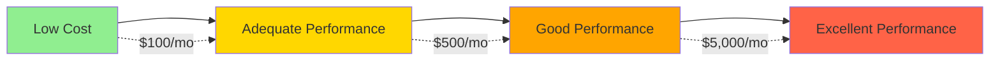
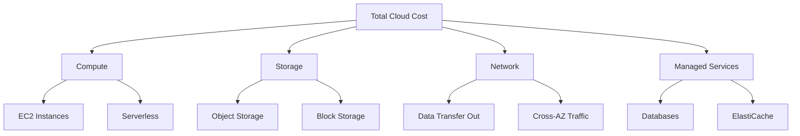
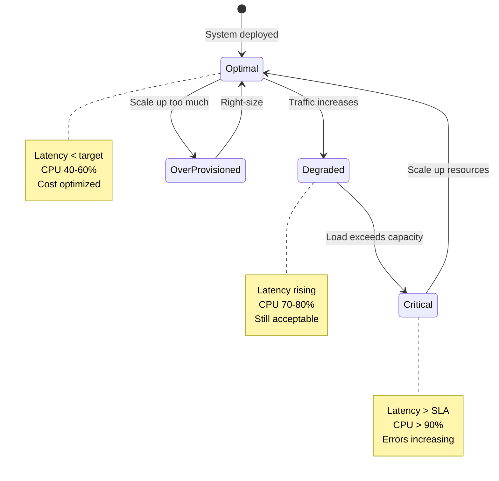
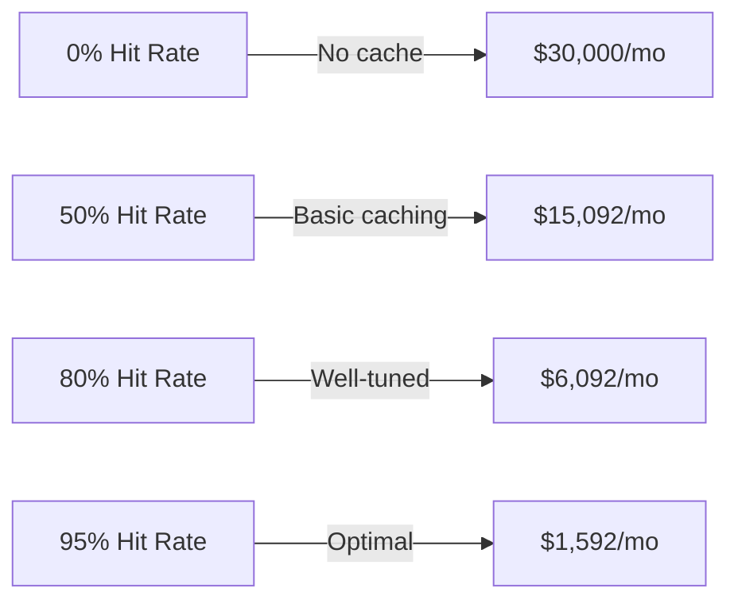
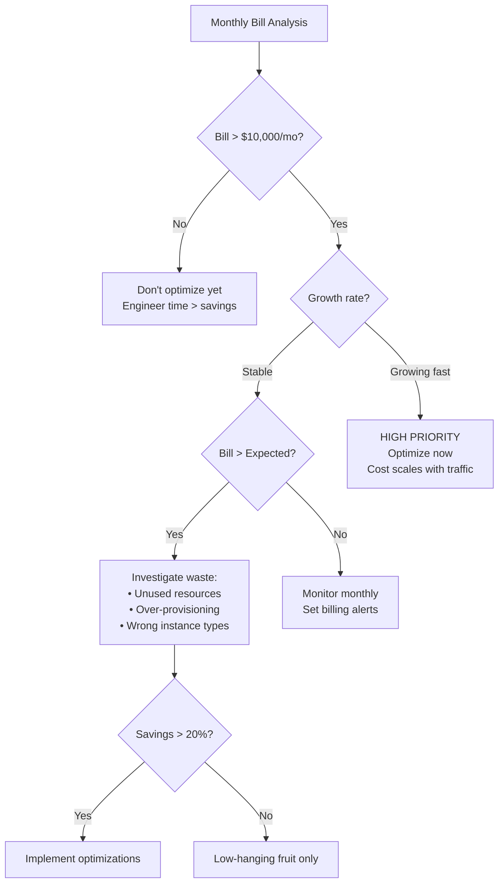

#system-design #trade-off

# Cost vs Performance

## Intuition (30 sec)

Buying a car: A Ferrari gets you there faster, but a Honda gets you there cheaper. The question isn't which is better—it's which matches your actual needs. Running late for work every day? Maybe the speed matters. Commuting 5 miles? The Honda wins.

Same with infrastructure: Netflix needs the Ferrari (low latency globally), but your weekend project needs the Honda.

---

## Failure-First Scenario

**The $45,000 Wake-Up Call:**

A startup launched with "best practices" from a FAANG blog:
- Multi-region deployment (3 regions)
- Over-provisioned instances (m5.8xlarge)
- Real-time replication everywhere
- Hot storage for all data

Traffic: 50 users/day
Monthly bill: $45,000

They burned through seed funding in 4 months before realizing their actual needs:
- Single region would serve all users (< 100ms latency)
- t3.medium instances at 5% CPU
- Eventual consistency was fine
- 95% of data never accessed after 30 days

Right-sized cost: $800/month

**Lesson:** Performance is expensive. Buy what you need, not what sounds impressive.

---

## Working Knowledge (5 min)

### Core Concept - Definition First

**Cost vs Performance Trade-off:**
- **Definition:** The balance between infrastructure expenses and system responsiveness, where better performance typically requires higher costs
- **Purpose:** To optimize spending by matching infrastructure capabilities to actual business requirements
- **How it works:** You pay more for faster processing, lower latency, higher availability, and greater capacity, but only need enough performance to meet user expectations and SLAs

**Key Terms:**
- **Cost:** Total infrastructure expenses including compute, storage, network, and operational overhead
- **Performance:** System's ability to handle load with acceptable latency and throughput
- **Over-provisioning:** Allocating more resources than needed to handle peak traffic and ensure reliability
- **Right-sizing:** Matching resource allocation to actual usage patterns to minimize waste

### Visual Model



### Comparison Table

| Cost Priority | Balanced | Performance Priority |
|--------------|----------|---------------------|
| Eventual consistency | Selective strong consistency | Strong consistency everywhere |
| Single-AZ deployment | Multi-AZ in one region | Multi-region |
| Standard instances | Memory-optimized for hot paths | Premium instances (i4i, X2) |
| Cold storage for archives | Tiered storage | All SSD/NVMe |
| Reactive scaling | Auto-scaling with buffer | Over-provisioned |
| **Use when:** Small scale, tight budget, tolerance for some downtime | **Use when:** Production apps, moderate scale, balanced SLAs | **Use when:** Mission-critical, low-latency requirements, high revenue per user |

---

## Layer 1: Conceptual Precision (15 min)

### Cost Optimization - Deep Definitions

**Cost Optimization:**
- **Formal Definition:** The systematic process of reducing infrastructure expenses while maintaining acceptable performance and availability levels
- **Simple Definition:** Getting the same job done for less money
- **Analogy:** Like buying generic medicine instead of brand-name—same active ingredient, lower price
- **Related Terms:** Right-sizing (adjusting resources), cost allocation (tracking spend), FinOps (continuous cost management)

**Why this matters:**
Cloud costs can spiral from $1,000 to $100,000/month without code changes—just traffic growth. A 30% reduction in AWS spend for a company spending $1M/year = $300k saved = 2 senior engineers' salaries.

### Performance Optimization - Deep Definitions

**Performance Optimization:**
- **Formal Definition:** Improving system responsiveness, throughput, and resource utilization through architectural and implementation changes
- **Simple Definition:** Making things faster with what you have
- **Analogy:** Like organizing your kitchen—you don't buy more space, you just arrange things so cooking is faster
- **Related Terms:** Latency reduction (speed), throughput improvement (capacity), efficiency (doing more with less)

**Why this matters:**
Amazon found every 100ms of latency cost them 1% in sales. Google found 500ms slower = 20% traffic drop. Performance directly impacts revenue.

### Cost Components (Visual Flow)



**Step-by-step breakdown:**
1. **Compute:** Processing power—charged per hour based on instance type (CPU, RAM)
2. **Storage:** Data persistence—charged per GB stored per month
3. **Network:** Data transfer—charged per GB transferred, especially outbound
4. **Managed Services:** Databases, caches, queues—convenience premium on top of base resources

### Performance Metrics State Diagram



**State Definitions:**
- **Optimal:** System meeting performance targets with efficient resource utilization (40-60% CPU)
- **Degraded:** Performance declining but within acceptable bounds (latency increases, CPU 70-80%)
- **Critical:** SLA violations occurring, immediate scaling needed (CPU > 90%, latency >> target)
- **Over-Provisioned:** Wasting money on unused capacity (CPU < 20%, paying for idle resources)

### Architecture Pattern: Cost Tiers

```
┌─────────────────────────────────────────────────────────┐
│                     HOT TIER                            │
│  Definition: Frequently accessed data and compute       │
│  Role: Handle real-time requests with low latency      │
│  Cost: High (SSD, premium instances, caching)          │
│  Examples: Current user sessions, today's data         │
└────────┬────────────────────────────────────────────────┘
         │
         │ Data ages
         │
    ┌────▼─────────────────────────────────────────────┐
    │              WARM TIER                           │
    │  Definition: Occasionally accessed data          │
    │  Role: Balance cost and access time              │
    │  Cost: Medium (standard storage, smaller compute)│
    │  Examples: Last 30 days logs, user history      │
    └────────┬─────────────────────────────────────────┘
             │
             │ Data ages further
             │
        ┌────▼─────────────────────────────────────┐
        │           COLD TIER                      │
        │  Definition: Rarely accessed archives    │
        │  Role: Long-term retention at min cost   │
        │  Cost: Very low (Glacier, tape backup)   │
        │  Examples: Compliance data, old backups  │
        └──────────────────────────────────────────┘
```

**Component Definitions:**
- **Hot Tier:** Data requiring < 10ms access time, serves active users, uses premium storage
- **Warm Tier:** Data needing < 1 second access, serves reporting/analytics, uses standard storage
- **Cold Tier:** Data accepting minutes to hours retrieval, serves audits/compliance, uses archival storage

### The Math: Cost-Performance Ratio

**Formula:** `Cost-Performance Ratio = (Cost per month) / (Requests per second handled)`

**Term Definitions:**
- **Cost per month:** Total infrastructure spend including compute, storage, network
- **Requests per second:** Peak QPS the system can sustain while meeting latency targets
- **Lower ratio = Better:** $1,000/month handling 1000 QPS = $1 per QPS (better than $10 per QPS)

**Example calculation:**
```
Scenario A: Over-engineered
Cost: $10,000/month
Peak QPS: 500
Ratio: $10,000 / 500 = $20 per QPS

Scenario B: Right-sized
Cost: $2,000/month
Peak QPS: 500
Ratio: $2,000 / 500 = $4 per QPS

What this means: Scenario B is 5x more cost-efficient while handling the same load
```

### Trade-offs Matrix

```
Cost Optimization                     Performance Optimization
════════════════════════════════════════════════════════════════════════
Definition: Minimize spend            Definition: Maximize responsiveness
            while meeting SLAs                    regardless of cost

Pros:                                 Pros:
• Lower monthly bills                 • Faster user experience
• Better unit economics               • Handle traffic spikes easily
• Sustainable at small scale          • Higher availability (redundancy)
• Forces efficient code               • Simpler ops (over-provisioned)

Cons:                                 Cons:
• Need monitoring/tuning              • Expensive at scale
• Complex auto-scaling                • Wasted resources when idle
• Risk of under-provisioning          • Hides performance issues
• More operational overhead           • Unsustainable burn rate

Use When:                             Use When:
• Early stage, validating product     • Revenue-critical path (checkout)
• Low traffic (< 100 QPS)            • High latency = lost revenue
• Clear usage patterns                • Mission-critical (healthcare)
• Budget-constrained                  • Temporary (Black Friday event)
```

---

## Layer 2: Cost Optimization Strategies (20 min)

### Strategy 1: Compute Cost Optimization

**Reserved Instances (RI):**
- **Definition:** Commitment to use specific instance types for 1-3 years in exchange for 30-60% discount
- **Best For:** Steady-state workloads with predictable usage

**Savings Plans:**
- **Definition:** Commitment to spend $X/hour for 1-3 years, flexible across instance types
- **Best For:** Workloads that might change instance types

**Spot Instances:**
- **Definition:** Unused EC2 capacity sold at 60-90% discount, but can be terminated with 2-minute notice
- **Best For:** Fault-tolerant workloads (batch processing, CI/CD, data analysis)

| Strategy | Savings | Commitment | Risk | Best Use Case |
|----------|---------|------------|------|---------------|
| **On-Demand** | 0% (baseline) | None | None | Development, spiky traffic |
| **Reserved Instances** | 30-60% | 1-3 years | Under-utilization | Web servers, databases (baseline) |
| **Savings Plans** | 30-50% | 1-3 years | Under-utilization | Variable workloads |
| **Spot Instances** | 60-90% | None | Interruption | Batch jobs, stateless workers |

**Real Cost Example:**
```
Baseline: m5.xlarge on-demand
• Cost: $0.192/hour = $140/month

With 1-year RI:
• Cost: $0.115/hour = $84/month
• Savings: $56/month (40%)

With Spot:
• Cost: $0.038/hour = $28/month
• Savings: $112/month (80%)
• Risk: Job interruption (acceptable for batch)

Decision: Use RI for web servers, Spot for data processing
```

### Strategy 2: Storage Tiering (S3 Storage Classes)

**S3 Storage Class Definitions:**

| Storage Class | Definition | Retrieval Time | Cost (per GB/month) | Use Case |
|--------------|------------|----------------|---------------------|----------|
| **S3 Standard** | Default, frequently accessed | Immediate | $0.023 | Active data, < 30 days old |
| **S3 Intelligent-Tiering** | Auto-moves between tiers | Immediate | $0.023 + $0.0025 monitoring | Unknown access patterns |
| **S3 Standard-IA** | Infrequent Access | Immediate | $0.0125 + retrieval fee | 30-90 days old, monthly access |
| **S3 One Zone-IA** | Single AZ, infrequent | Immediate | $0.01 + retrieval fee | Reproducible data, backups |
| **S3 Glacier Instant** | Archive, instant retrieval | Immediate | $0.004 + retrieval fee | Quarterly access, compliance |
| **S3 Glacier Flexible** | Archive, minutes-hours | 1-5 min / 3-5 hours | $0.0036 | Annual access, archives |
| **S3 Glacier Deep Archive** | Lowest cost, slowest | 12 hours | $0.00099 | 7-year retention, legal hold |

**Lifecycle Policy Example:**
```yaml
# Automated tiering based on age
lifecycle_rules:
  - name: "archive-old-data"
    transitions:
      - days: 30
        storage_class: STANDARD_IA     # After 30 days: Standard → IA
      - days: 90
        storage_class: GLACIER_IR       # After 90 days: IA → Glacier Instant
      - days: 365
        storage_class: DEEP_ARCHIVE     # After 1 year: Glacier → Deep Archive

  - name: "delete-temp-data"
    expiration:
      days: 7                            # Delete temp files after 7 days
```

**Real Cost Savings:**
```
Scenario: 10 TB of user uploads, 80% never accessed after 60 days

Without tiering:
• 10 TB × $0.023/GB = $230/month (all Standard)

With tiering:
• 2 TB hot (Standard): 2000 GB × $0.023 = $46
• 8 TB cold (Glacier): 8000 GB × $0.004 = $32
• Total: $78/month

Savings: $152/month (66% reduction)
Annual savings: $1,824
```

### Strategy 3: Caching ROI

**Cache Definition:**
- **Definition:** Temporary storage layer that holds frequently accessed data in fast memory (RAM) to reduce expensive operations like database queries or API calls
- **Purpose:** Improve performance AND reduce cost by avoiding redundant work

**Cost-Benefit Analysis:**

```
Scenario: E-commerce product catalog
• 10M API calls/day to database
• Each DB query costs $0.0001 (compute + I/O)
• Daily cost: 10M × $0.0001 = $1,000/day = $30,000/month

With Redis cache (80% hit rate):
• Cache hits: 8M × $0 = $0 (served from RAM)
• Cache misses: 2M × $0.0001 = $200/day = $6,000/month
• Redis cost: r6g.large ($0.126/hour) = $92/month
• Total: $6,092/month

Savings: $23,908/month (80% reduction)
ROI: 260x (saved $23,908 for $92 spent)
```

**Cache Hit Rate Impact:**



**When Caching Doesn't Pay:**
```
Low-traffic scenario:
• 100K API calls/day
• Database cost: 100K × $0.0001 = $10/day = $300/month
• Cache cost: $92/month
• Savings: $300 - $92 = $208/month

Still worth it, but ROI is lower (2.3x vs 260x)

Conclusion: Caching ROI scales with traffic
```

### Strategy 4: Auto-Scaling Configuration

**Auto-Scaling:**
- **Definition:** Automatically adjusting number of compute instances based on demand metrics (CPU, memory, request count)
- **Purpose:** Match capacity to actual load, avoiding both over-provisioning waste and under-provisioning failures

**Configuration Pattern (Annotated):**

```yaml
# Auto-scaling group configuration

scaling_policy:
  target_cpu: 60%              # Definition: Desired average CPU utilization
                               # Why 60%: Buffer for sudden spikes (40% headroom)

  min_instances: 2             # Definition: Minimum servers always running
                               # Purpose: High availability (survive 1 failure)

  max_instances: 20            # Definition: Maximum allowed servers
                               # Purpose: Cost ceiling + avoid cascading failures

  scale_up:
    threshold: 70%             # Definition: CPU % that triggers adding instances
    cooldown: 300              # Wait 5 minutes before next scale-up
                               # Reason: Prevent thrashing from temporary spikes

  scale_down:
    threshold: 40%             # Definition: CPU % that triggers removing instances
    cooldown: 600              # Wait 10 minutes before next scale-down
                               # Reason: Conservative—scaling down is risky
```

**Configuration Concepts:**
- **Target CPU 60%:** Sweet spot—enough utilization to save cost, enough headroom for bursts
- **Cooldown period:** Time to wait after scaling action to see effect before scaling again (prevents oscillation)
- **Asymmetric thresholds:** Scale up quickly (70%), scale down slowly (40%) to favor availability over cost

**Cost Impact:**
```
Before auto-scaling:
• Peak capacity: 20 instances × 24 hours × $0.192 = $92/day
• Cost: $2,760/month (always paying for peak)

With auto-scaling (average 6 instances):
• Variable capacity: 6 instances × 24 hours × $0.192 = $28/day
• Cost: $840/month (pay for average, not peak)

Savings: $1,920/month (70% reduction)
```

---

## Layer 3: Performance Optimization Strategies (20 min)

### Strategy 1: Instance Right-Sizing

**Right-Sizing:**
- **Definition:** Matching EC2 instance type (CPU, RAM, network) to actual workload requirements
- **Goal:** Eliminate waste from over-provisioned instances or bottlenecks from under-provisioned ones

**Performance vs Cost Matrix:**

| Workload Type | Wrong Instance | Why It's Wrong | Right Instance | Performance Gain | Cost Change |
|--------------|----------------|----------------|----------------|------------------|-------------|
| **CPU-bound** (video encoding) | m5.xlarge (4 vCPU) | Too few cores | c6i.2xlarge (8 vCPU) | 2x throughput | +30% cost, but 2x output = 35% cost per job |
| **Memory-bound** (in-memory cache) | m5.xlarge (16 GB) | Swapping to disk | r6i.xlarge (32 GB) | 10x faster (no swap) | +25% cost, but eliminates disk I/O |
| **Network-bound** (proxy server) | m5.large (10 Gbps) | Network saturated | m5n.large (25 Gbps) | 2.5x throughput | +10% cost |
| **Bursty workload** (web server) | m5.large (steady) | Paying for idle | t3.large (burstable) | Same performance | -20% cost |

**Real Example: Memory Optimization**
```
Problem: Python API server on m5.xlarge (16 GB RAM)
• Using 14 GB RAM + 2 GB swap
• Swap I/O causing 500ms P99 latency

Solution: Upgrade to r6i.xlarge (32 GB RAM)
• Using 14 GB RAM, no swap
• P99 latency drops to 50ms (10x improvement)

Cost analysis:
• m5.xlarge: $0.192/hour = $140/month
• r6i.xlarge: $0.252/hour = $184/month
• Cost increase: $44/month (31%)

Value: Latency 10x better for 31% more cost
Decision: Worth it—latency affects revenue
```

### Strategy 2: Multi-AZ vs Multi-Region

**Multi-AZ (Availability Zone):**
- **Definition:** Deploying redundant resources across isolated data centers within a single geographic region
- **Purpose:** Protect against data center failures (availability)
- **Latency:** < 1ms between AZs
- **Cost:** ~2x (need 2+ instances for redundancy)

**Multi-Region:**
- **Definition:** Deploying resources across geographically distant regions (e.g., US-East, EU-West, Asia-Pacific)
- **Purpose:** Reduce latency for global users AND disaster recovery
- **Latency:** 50-300ms between regions
- **Cost:** ~3x+ (infrastructure in multiple regions + cross-region data transfer)

```
Architecture: Single-AZ (Cheapest, Risky)
┌─────────────┐
│   us-east-1a│
│  ┌────────┐ │
│  │Server 1│ │
│  └────────┘ │
└─────────────┘

Cost: $200/month
Availability: 99.5% (AWS SLA)
Risk: One AZ fails = total outage

────────────────────────────────────────────

Architecture: Multi-AZ (Balanced)
┌─────────────┐    ┌─────────────┐
│   us-east-1a│    │   us-east-1b│
│  ┌────────┐ │    │  ┌────────┐ │
│  │Server 1│ │    │  │Server 2│ │
│  └────────┘ │    │  └────────┘ │
└─────────────┘    └─────────────┘

Cost: $400/month (+100%)
Availability: 99.99% (can lose 1 AZ)
Latency: No impact (< 1ms between AZs)

────────────────────────────────────────────

Architecture: Multi-Region (Expensive, Global)
┌─────────────┐    ┌─────────────┐    ┌─────────────┐
│   us-east-1 │    │   eu-west-1 │    │  ap-south-1 │
│  ┌────────┐ │    │  ┌────────┐ │    │  ┌────────┐ │
│  │Server 1│ │    │  │Server 2│ │    │  │Server 3│ │
│  └────────┘ │    │  └────────┘ │    │  └────────┘ │
└─────────────┘    └─────────────┘    └─────────────┘

Cost: $1,200/month (+500%)
Availability: 99.999% (can lose entire region)
Latency: Global users see 50-150ms (vs 200-500ms single region)
Bonus: Compliance (data residency in EU, Asia)
```

**Decision Matrix:**
| Requirement | Solution | Cost Multiplier |
|-------------|----------|----------------|
| Development, testing | Single-AZ | 1x |
| Production, US-only | Multi-AZ | 2x |
| Production, global users | Multi-Region active-active | 3-5x |
| Disaster recovery only | Multi-Region active-passive | 1.5x (second region idle) |

### Strategy 3: Database Performance Tuning

**Read Replicas:**
- **Definition:** Read-only copies of your primary database that handle SELECT queries
- **Purpose:** Scale read-heavy workloads without overloading primary database
- **Cost:** Additional RDS instance per replica

```
Without read replica:
┌─────────────┐
│   Primary   │
│   Database  │
│             │
│ Reads: 90%  │  ← Bottleneck: 1000 QPS reads + 100 QPS writes
│ Writes: 10% │     Primary at 100% CPU
└─────────────┘

Cost: $500/month (db.r6g.xlarge)
Performance: Overloaded, queries queuing

────────────────────────────────────────────

With read replicas:
┌─────────────┐         ┌─────────────┐
│   Primary   │────────▶│  Replica 1  │
│   Database  │  Async  │             │
│             │  replic │  Reads: 45% │  ← Load distributed
│ Writes: 100%│         └─────────────┘
│ Reads: 10%  │         ┌─────────────┐
└─────────────┘────────▶│  Replica 2  │
                  Async  │             │
                  replic │  Reads: 45% │
                         └─────────────┘

Cost: $1,500/month (1 primary + 2 replicas)
Performance: Each DB at 40% CPU, fast queries
Scalability: Can add more replicas

Cost increased 3x, but capacity increased 10x
```

**Connection Pooling:**
- **Definition:** Reusing database connections across requests instead of creating new connections
- **Purpose:** Reduce connection overhead (TCP handshake, auth, SSL) from ~50ms to ~0ms

```
Without pooling (every request opens new connection):
Request 1: Open (50ms) → Query (10ms) → Close (5ms) = 65ms
Request 2: Open (50ms) → Query (10ms) → Close (5ms) = 65ms
Request 3: Open (50ms) → Query (10ms) → Close (5ms) = 65ms

With pooling (reuse connections):
Request 1: Open (50ms) → Query (10ms) → Return to pool = 60ms
Request 2: Get from pool (0ms) → Query (10ms) → Return = 10ms
Request 3: Get from pool (0ms) → Query (10ms) → Return = 10ms

Result: 6x faster for cached connections
Cost: $0 (software configuration, not infrastructure)
```

### Strategy 4: CDN for Static Assets

**CDN (Content Delivery Network):**
- **Definition:** Geographically distributed cache servers that serve static content (images, CSS, JS) from locations near users
- **Purpose:** Reduce latency for static assets and reduce load on origin servers

**Performance + Cost Impact:**

```
Scenario: E-commerce site, 1M image requests/day

Without CDN:
• All requests hit origin server (us-east-1)
• User in Tokyo: 150ms latency
• User in London: 80ms latency
• Origin server load: 1M requests/day
• Data transfer out: 100 GB/day × $0.09/GB = $9/day = $270/month

With CloudFront CDN:
• 95% cache hit rate (served from edge)
• User in Tokyo: 20ms latency (from Tokyo edge)
• User in London: 15ms latency (from London edge)
• Origin server load: 50K requests/day (95% reduction)
• CDN cost: 100 GB × $0.085/GB = $8.50/day = $255/month

Performance: 5-7x faster for global users
Cost: Slightly cheaper ($255 vs $270)
Bonus: Origin server can handle 20x more traffic
```

---

## Layer 4: Decision Frameworks (30 min)

### Framework 1: When to Optimize for Cost

**Cost Optimization Decision Tree:**



**Cost Optimization Triggers:**

| Monthly Bill | Action | Reason |
|--------------|--------|--------|
| < $500 | Ignore | Engineer time costs more than savings |
| $500 - $5,000 | Low-hanging fruit only | Quick wins: delete unused resources, enable auto-scaling |
| $5,000 - $50,000 | Quarterly optimization | Right-size instances, reserved instances, storage tiering |
| > $50,000 | Continuous FinOps | Dedicated cost team, real-time monitoring, chargeback |

### Framework 2: When to Optimize for Performance

**Performance Optimization Decision Matrix:**

| Symptom | User Impact | Business Impact | Priority | Investment |
|---------|-------------|-----------------|----------|------------|
| **P99 latency > 1s** | Users notice slowness | 20% abandon checkout | **CRITICAL** | Spend liberally—revenue loss >> cost |
| **P95 latency 200-500ms** | Slight delay | 5% conversion drop | **HIGH** | Targeted optimizations (caching, CDN) |
| **CPU > 80%** | Risk of crashes | Potential outage | **HIGH** | Scale up immediately, optimize later |
| **Database slow queries** | Some pages slow | User complaints | **MEDIUM** | Add indexes, read replicas (low cost) |
| **Cold start latency** | First request slow | Minor annoyance | **LOW** | Pre-warming or accept trade-off |

**Performance ROI Calculator:**

```
Question: Is performance optimization worth the cost?

Formula: Value of improvement - Cost of improvement

Example: E-commerce checkout optimization
• Current: P99 = 2 seconds
• After optimization: P99 = 500ms
• Cost: $2,000/month (faster instances + CDN)

Revenue impact:
• 1M checkouts/month
• 2% abandon at 2s latency
• 0.5% abandon at 500ms latency
• Recovered: 1.5% × 1M = 15,000 checkouts
• Average order: $50
• Additional revenue: 15,000 × $50 = $750,000/month

ROI: $750,000 / $2,000 = 375x
Decision: ABSOLUTELY worth it
```

### Framework 3: The "3x Rule"

**The 3x Rule:**
- **Definition:** If you expect traffic to grow 3x in next 6 months, optimize for cost now—otherwise optimization won't keep up with growth
- **Purpose:** Prevent cost explosions during growth phases

```
Scenario A: Optimize early (Bill = $5,000/month)
Month 1: $5,000 → Optimize → $3,500 (save 30%)
Month 6: Traffic 3x → Bill = $10,500 (vs $15,000)
Savings: $4,500/month × 6 months = $27,000

Scenario B: Defer optimization
Month 1: $5,000 → No action
Month 6: Traffic 3x → Bill = $15,000
Month 7: Optimize → $10,500
Savings: Only last month, wasted $4,500 × 5 = $22,500

Lesson: Optimize before growth, not after
```

### Capacity Planning (Definitions + Math)

**Capacity Planning:**
- **Definition:** Process of determining infrastructure needed to meet performance targets under expected load
- **Goal:** Right-size resources—not too much waste, not too little capacity

**Key Metrics:**
- **QPS (Queries Per Second):** Rate of incoming requests
- **Latency:** Time to process one request
- **Concurrent Requests:** Number of requests being processed simultaneously
  - Formula: `Concurrent = QPS × Latency (in seconds)`
- **Throughput:** Maximum QPS a server can handle while meeting latency SLA

**Capacity Planning Calculation:**

```
Given:
• Expected traffic: 5M requests/day
• Peak:Average ratio: 4:1 (traffic spikes during business hours)
• Target P99 latency: 100ms
• One m5.large handles 200 concurrent requests

Step 1: Calculate average QPS
  Definition: QPS = requests per second
  5M requests ÷ 86,400 seconds = 58 QPS average

Step 2: Calculate peak QPS
  Definition: Peak = highest traffic moment (need to handle this)
  Peak = Average × 4 = 232 QPS

Step 3: Calculate concurrent requests at peak
  Definition: Requests in-flight at same time
  Concurrent = QPS × Latency
  = 232 × 0.1 = 23.2 concurrent

Step 4: Determine server count
  If 1 m5.large handles 200 concurrent:
  Servers needed = 23.2 ÷ 200 = 0.12 → 1 server

Step 5: Add redundancy and headroom
  • Multi-AZ: 2 servers minimum (1 per AZ)
  • Growth buffer: 2x for next 6 months
  • Total: 4 servers

Step 6: Calculate cost
  • 4 × m5.large × $0.096/hour = $0.384/hour
  • Monthly: $0.384 × 730 = $280/month

Step 7: Optimize with auto-scaling
  • Base: 2 servers always (multi-AZ)
  • Scale to: 4 servers at peak
  • Average usage: 2.5 servers
  • Cost: 2.5 × $70 = $175/month
  • Savings: $105/month (38%)
```

**Capacity Planning Matrix:**

| Traffic Level | QPS | Concurrent (100ms latency) | Servers (m5.large) | Monthly Cost | Optimization Strategy |
|---------------|-----|---------------------------|-------------------|--------------|----------------------|
| **Small** | 10 | 1 | 2 (multi-AZ) | $140 | t3.medium + auto-scale |
| **Medium** | 100 | 10 | 2 (multi-AZ) | $140 | m5.large + auto-scale |
| **Large** | 1,000 | 100 | 4-8 (auto-scale) | $280-560 | Reserved instances |
| **Very Large** | 10,000 | 1,000 | 40-80 (auto-scale) | $2,800-5,600 | Reserved + Spot |

---

## Real-World Examples

### Example 1: Netflix - Content Delivery Cost Optimization

**Problem Definition:**
Netflix streams 250M hours/day globally. Serving all video from AWS S3 would cost $375M/year in data transfer alone (10 PB/day × $0.09/GB × 30 days).

**Solution Definition:**
Multi-tier CDN strategy with Open Connect Appliances (OCAs)—caching servers placed directly in ISP data centers.

**Technical Terms Used:**
- **OCA (Open Connect Appliance):** Netflix-owned cache servers installed inside ISP networks
- **Edge caching:** Serving content from locations closest to users (ISP networks, not AWS regions)
- **Data transfer cost:** AWS charges $0.09/GB for outbound data; OCA reduces this to ~$0.02/GB (ISP peering)

**Before:**
```
User → ISP → Internet → AWS CloudFront → S3 Origin
                      ↑
                Cost: $0.09/GB data transfer out
                Latency: 50-100ms
```

**After:**
```
User → ISP → OCA (cache in ISP network) → (95% cache hit)
             ↑
       Cost: ~$0.02/GB (peering agreement)
       Latency: 5-10ms

       Cache miss (5%) → AWS S3
```

**Results:**
- **Data transfer cost:** Reduced from $0.09/GB to ~$0.02/GB (78% reduction)
- **Annual savings:** ~$300M (estimated)
- **Latency:** Reduced from 50-100ms to 5-10ms (10x improvement)
- **ISP benefit:** Reduced transit costs (Netflix traffic stays local)

**Why it worked:**
Volume justifies infrastructure—at Netflix scale, owning physical servers in ISPs is cheaper than cloud data transfer. Not viable for companies < 1 PB/month.

---

### Example 2: Dropbox - Storage Cost Repatriation

**Problem Definition:**
Dropbox was spending $200M+/year on AWS S3 storage for user files. At their scale (500+ PB), cloud storage economics didn't work.

**Solution Definition:**
Built custom data centers (2015-2017) and migrated 500 PB from S3 to self-hosted storage ("Magic Pocket" infrastructure).

**Technical Terms Used:**
- **Repatriation:** Moving workloads from cloud back to on-premise/self-managed
- **TCO (Total Cost of Ownership):** All costs including hardware, power, cooling, staff
- **Erasure coding:** Data redundancy technique (like RAID) that uses less space than replication

**Before:**
```
Dropbox → AWS S3
• 500 PB storage
• Cost: ~$0.023/GB/month = $11.5M/month = $138M/year
• Plus: Data transfer, API calls → ~$200M/year total
```

**After:**
```
Dropbox → Custom data centers (Magic Pocket)
• 500 PB on custom-built storage servers
• Cost: $100M/year (hardware, power, staff)
• Savings: $100M/year (50% reduction)
```

**Results:**
- **Storage cost:** Cut in half ($200M → $100M/year)
- **Performance:** Better control over hardware, improved throughput
- **Lock-in:** No longer dependent on single vendor
- **Risk:** Required 100+ person infrastructure team and $100M+ upfront investment

**Why it worked:**
Scale + stable workload—storage is predictable and grows steadily. Only makes sense at massive scale (100+ PB) with multi-year planning horizon.

---

### Example 3: Pinterest - Caching ROI

**Problem Definition:**
Pinterest's home feed generation was expensive: 1M+ database queries per second during peak, causing high latency (P99 > 500ms) and database CPU at 90%+.

**Solution Definition:**
Implemented multi-layer caching strategy with Redis and Memcached, caching user feeds and pin metadata.

**Technical Terms Used:**
- **Cache layering:** Multiple cache tiers (L1 = local memory, L2 = Redis)
- **TTL (Time To Live):** How long cached data remains valid before refresh
- **Cache hit rate:** Percentage of requests served from cache vs database

**Before:**
```
User request → API → Database (1M QPS)
• P99 latency: 500ms
• Database cost: $50,000/month (large RDS instances at high CPU)
• Limited headroom for growth
```

**After:**
```
User request → API → L1 Cache (local) → L2 Cache (Redis) → Database
                     95% hit ↑        4% hit ↑      1% miss ↑

• P99 latency: 50ms (10x improvement)
• Database QPS: 10K (99% reduction)
• Database cost: $5,000/month (smaller instances at low CPU)
• Redis cost: $2,000/month (r6g cluster)
• Total cost: $7,000/month
```

**Results:**
- **Cost savings:** $43,000/month = $516K/year (86% reduction)
- **Performance:** P99 latency 10x better (500ms → 50ms)
- **Scalability:** Can handle 10x traffic on same database infrastructure
- **ROI:** Redis cost ($2K/mo) saves $43K/mo → 21x ROI

**Why it worked:**
High read:write ratio (users view 100 pins for every 1 pin saved) and temporal locality (popular pins accessed frequently). Perfect caching use case.

---

## Interview Preparation

### Concept Glossary

Quick reference definitions for interview:

- **Cost optimization:** Reducing infrastructure expenses while maintaining performance targets
- **Performance optimization:** Improving speed/throughput through architectural changes
- **Right-sizing:** Matching instance type to workload requirements
- **Reserved Instance:** 1-3 year commitment for 30-60% discount
- **Spot Instance:** Unused capacity at 60-90% discount, can be interrupted
- **Auto-scaling:** Automatically adjusting capacity based on demand
- **Cache hit rate:** Percentage of requests served from cache
- **Multi-AZ:** Redundancy across data centers in one region (high availability)
- **Multi-region:** Deployment across geographic regions (low latency + disaster recovery)
- **Storage tiering:** Moving old data to cheaper storage classes
- **CDN:** Distributed cache for static content, reducing origin load and latency
- **Capacity planning:** Calculating infrastructure needed for expected load
- **QPS:** Queries per second, measure of request rate
- **P99 latency:** 99th percentile response time (99% of requests faster than this)

### Question Template

**Q: When would you optimize for cost vs performance?**

**Answer Structure:**

1. **Define (5-10 sec):**
   "Cost optimization means reducing spend while meeting SLAs. Performance optimization means improving speed regardless of cost. They're often at odds—faster usually costs more."

2. **Explain When (20 sec):**
   "Optimize for cost when: bills are high relative to value delivered, growth is stable, and current performance meets SLAs. Optimize for performance when: latency affects revenue (e-commerce checkout), you're at risk of outages (CPU > 80%), or you're in growth phase acquiring users.

   The '3x rule': if traffic will grow 3x in 6 months, optimize cost now before it scales. If bills are < $5,000/month, don't optimize—engineer time costs more."

3. **State Trade-off (10 sec):**
   "Pro of cost focus: sustainable economics, forces efficiency. Con: risk of under-provisioning. Pro of performance focus: better UX, handles spikes. Con: wastes money on idle resources."

4. **Give Example (15 sec):**
   "Pinterest cut database costs 86% by adding Redis caching—improved performance AND reduced cost. Netflix spends heavily on CDN infrastructure because latency directly impacts viewing time. Amazon found 100ms latency = 1% revenue loss, so they over-provision."

---

**Q: How do you calculate capacity needs?**

**Answer Structure:**

1. **Define (5-10 sec):**
   "Capacity planning is determining how many servers you need to handle expected traffic while meeting latency targets."

2. **Explain How (30 sec):**
   "Start with traffic estimates: QPS average and peak. Calculate concurrent requests: QPS times latency in seconds. For example, 100 QPS with 100ms latency = 10 concurrent requests. If one server handles 200 concurrent, you need 0.05 servers, so 1 server minimum.

   Then add redundancy: multi-AZ means 2 minimum. Add growth buffer: if traffic will double, provision 2x. Use auto-scaling to handle variable traffic: 2 baseline, scale to 4 at peak, average 2.5x cost."

3. **State Formula (5 sec):**
   "Concurrent = QPS times latency. Servers = Concurrent divided by capacity per server."

4. **Mention Optimization (10 sec):**
   "For cost: use auto-scaling and reserved instances for baseline. For performance: over-provision by 2x to handle spikes without latency degradation."

---

**Q: Explain cost-performance trade-offs with caching.**

**Answer Structure:**

1. **Define (5-10 sec):**
   "Caching stores frequently accessed data in fast memory (Redis) to avoid expensive database queries or API calls."

2. **Explain Trade-off (20 sec):**
   "Caching improves both cost AND performance—rare win-win. Example: 1M database queries at $0.0001 each = $100/day. With 80% cache hit rate, only 200K queries = $20/day. Redis costs $3/day, so save $77/day = $28K/year.

   Performance: latency drops from 50ms (database) to 1ms (cache)—50x faster."

3. **State When (10 sec):**
   "Use when: read-heavy workload, high read:write ratio, data has temporal locality (popular items accessed frequently). Don't use for: write-heavy, real-time data requiring strong consistency."

4. **Mention Downside (10 sec):**
   "Con: stale data if TTL too long, cache invalidation complexity, need to handle cache failures (fallback to database)."

---

## Quick Reference

### Cost Optimization Glossary

| Term | Definition | When You'll See It |
|------|------------|-------------------|
| **Reserved Instance** | 1-3 year commitment for 30-60% discount | Optimizing steady workloads |
| **Spot Instance** | 60-90% discount, interruptible | Batch jobs, fault-tolerant workloads |
| **Savings Plan** | Commitment to $X/hour for 1-3 years, flexible | Variable workload optimization |
| **Auto-scaling** | Adjust capacity based on demand | Handling traffic variability |
| **Right-sizing** | Match instance to workload | After analyzing CloudWatch metrics |
| **Storage tiering** | Move old data to cheaper storage | Reducing S3/EBS costs |
| **S3 Glacier** | Archive storage at $0.004/GB/month | 90+ day old data |
| **Multi-AZ** | Redundancy in one region | High availability requirement |
| **Multi-region** | Deployment across geographies | Global users, disaster recovery |
| **CDN** | Edge caching for static content | Image/video delivery |
| **Cache hit rate** | % requests served from cache | Evaluating cache effectiveness |
| **FinOps** | Continuous cost management practice | Organizations > $50K/month spend |

### Performance Optimization Glossary

| Term | Definition | When You'll See It |
|------|------------|-------------------|
| **P99 latency** | 99% of requests faster than this | SLA definitions |
| **QPS** | Queries per second | Capacity planning |
| **Throughput** | Max QPS system can handle | Load testing results |
| **Concurrent requests** | In-flight requests at same time | Calculating server needs |
| **Connection pooling** | Reuse database connections | Database optimization |
| **Read replica** | Read-only DB copy | Scaling read-heavy workloads |
| **Vertical scaling** | Bigger instance (more CPU/RAM) | Quick performance fix |
| **Horizontal scaling** | More instances | Sustainable scaling strategy |
| **Burstable instance** | t3/t4g with CPU credits | Variable workloads |
| **Memory-optimized** | r6i/r6g with high RAM | In-memory caching, big data |
| **Compute-optimized** | c6i/c6g with high CPU | CPU-bound workloads |

### Decision Cheat Sheet

```
IF Monthly bill < $5,000
  THEN Don't optimize cost—focus on product
  REASON: Engineer time > savings

IF P99 latency > 1 second AND revenue-critical page
  THEN Optimize performance regardless of cost
  REASON: Latency = lost revenue (Amazon: 100ms = 1% sales)

IF CPU consistently > 70%
  THEN Scale up or out immediately
  REASON: Risk of cascading failure (queue builds → timeout → retry storm)

IF Traffic growing 3x in 6 months
  THEN Optimize cost NOW before it scales
  REASON: Harder to optimize at scale, waste multiplies

IF Read:Write ratio > 10:1
  THEN Add caching (Redis/Memcached)
  REASON: High ROI—improves performance AND reduces cost

IF Global users AND latency matters
  THEN Multi-region deployment or CDN
  REASON: Physics—speed of light limits latency (US-Asia: 150ms minimum)

IF Data not accessed after 30 days
  THEN Implement storage tiering (S3 lifecycle)
  REASON: 50-80% cost reduction, no performance impact for old data

IF Workload fault-tolerant (batch, CI/CD)
  THEN Use Spot instances
  REASON: 60-90% savings, interruption acceptable

IF Workload steady and predictable
  THEN Buy Reserved Instances (1 year minimum)
  REASON: 30-60% savings with commitment
```

---

## Links

- [[02_building_blocks/blob_storage]] — S3 storage classes and tiering
- [[02_building_blocks/caching]] — Reduce expensive operations with Redis/Memcached
- [[02_building_blocks/cdn]] — Edge caching for global performance
- [[02_building_blocks/databases]] — Read replicas and connection pooling
- [[03_scaling_strategies/vertical_vs_horizontal]] — Instance sizing strategies
- [[03_scaling_strategies/auto_scaling]] — Dynamic capacity adjustment
- [[05_availability/multi_az_region]] — Redundancy costs and benefits

---

## Notes on Cost-Performance Decisions

**Key Principles:**

1. **Start cheap, scale smart:**
   - Don't over-engineer early—you're guessing at scale
   - Start single-region, scale to multi-AZ when revenue justifies it
   - Add multi-region only for global users or compliance

2. **Measure before optimizing:**
   - Cost: Set billing alerts, analyze CloudWatch metrics
   - Performance: Monitor P99 latency, CPU, memory
   - Without data, you're guessing (and probably wrong)

3. **ROI is king:**
   - Cost optimization: Savings > engineer time investment
   - Performance optimization: Revenue impact > infrastructure cost
   - Pinterest caching: $2K/month saves $43K/month = 21x ROI (do it)
   - Dropbox repatriation: $100M investment saves $100M/year (only at massive scale)

4. **Performance often enables cost savings:**
   - Faster code = need fewer servers
   - Better caching = cheaper database
   - Efficient queries = smaller instances
   - Don't assume performance costs more—it often costs less

5. **The "3x rule" for growth:**
   - If traffic will grow 3x in 6 months, optimize cost now
   - Waste multiplies with scale: $1K/month waste becomes $3K/month
   - Easier to optimize at low scale than high scale
