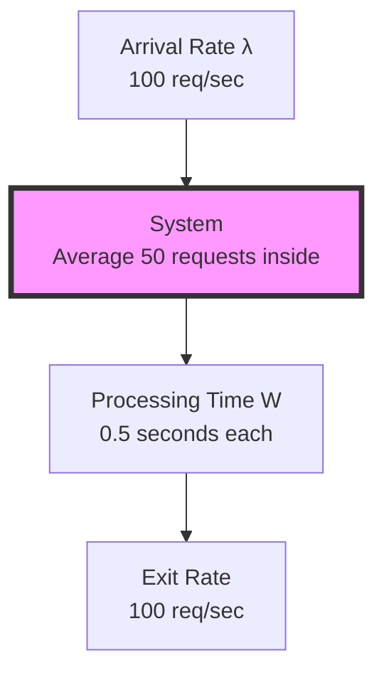
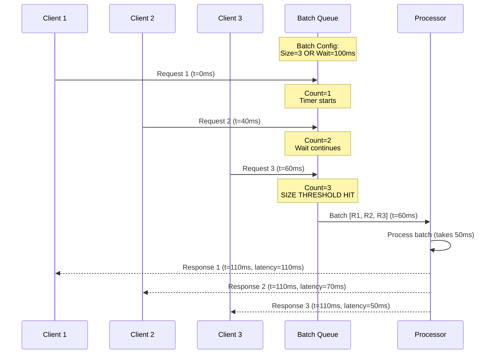

#system-design #trade-off

# Latency vs Throughput

## Intuition (30 sec)

**The Restaurant Analogy:**

Imagine a restaurant with two approaches:
- **Low Latency:** Take each customer's order, cook it immediately, serve it. Each customer gets food fast, but the kitchen only handles one order at a time.
- **High Throughput:** Collect 10 orders, prepare them all at once, serve in batches. More meals per hour, but each customer waits longer.

You can optimize for speed per customer OR total customers served, rarely both.

---

## Failure-First Scenario

**The API Redesign Disaster:**

A startup built an image processing API optimized for latency (process-one-at-a-time). Each image took 50ms. Great user experience. Then a customer wanted to process 1 million images.

At 50ms per image, processing sequentially: 1,000,000 × 0.05s = 50,000 seconds = 13.9 hours.

They redesigned for throughput (batch processing), reducing per-image time to 5ms but adding 2 seconds of batching delay.

New total time: 2s + (1,000,000 × 0.005s) = 5,002 seconds = 1.4 hours. **89% faster.**

But now their interactive users complained: "Why does my single image take 2 seconds instead of 50ms?"

**The lesson:** You need both systems or a smart middle ground. The trade-off is fundamental.

---

## Working Knowledge (5 min)

### Core Definitions

**Latency:**
- **Definition:** The time it takes to complete a single request from start to finish.
- **Purpose:** Measures responsiveness and user experience quality.
- **How it works:** Tracks elapsed time from when a request enters the system until the response returns.
- **Measured as:** Milliseconds (ms) or seconds; often reported as P50, P95, P99 percentiles.

**Throughput:**
- **Definition:** The number of requests a system can process per unit of time.
- **Purpose:** Measures system capacity and efficiency at scale.
- **How it works:** Counts completed requests over a time window (e.g., requests/second).
- **Measured as:** QPS (Queries Per Second), RPS (Requests Per Second), or events/sec.

**The Fundamental Trade-off:**
- **Definition:** Techniques that improve throughput often increase latency, and vice versa.
- **Why it exists:** Batching, queuing, and parallelization add overhead or waiting time that helps efficiency but hurts individual request speed.
- **Exception:** Some techniques (caching, connection pooling) improve both.

**Key Terms:**
- **P99 Latency:** 99% of requests complete faster than this value; measures worst-case user experience.
- **QPS (Queries Per Second):** Rate of incoming or processed requests; measures system load.
- **Batching:** Grouping multiple requests together to process them more efficiently.
- **Queuing Delay:** Time a request spends waiting before processing begins.

### Visual Trade-off Curve

```
Latency vs Throughput Trade-off Curve

Latency
   │
   │ ┌─────────────────────────────────────
   │ │  High latency, low throughput
   │ │  (Inefficient - worst of both)
   │ │
   │ │     ╔═══════════════════╗
   │ │     ║  Optimal Zone     ║
 ▲ │     ║  Good balance     ║◄─── Most systems aim here
 │ │     ║  for most systems ║
 │ │     ╚═══════════════════╝
 │ │          │
 │ │          │  Batching
 │ │          ▼  increases
 │ │    ●────────────────●
 │ │    Interactive       Batch
 │ │    Processing        Processing
 │ │
 │ │                            Low latency,
 │ │                            high throughput
 │ │                            (Ideal - rare)
 │ └──────────────────────────────────────────►
 │                                         Throughput
 └────────────────────────────────────────────────►

Key Points on Curve:
● Interactive: Low latency (50ms), lower throughput (1000 QPS)
● Batch: Higher latency (2s), high throughput (10,000 QPS)
```

### The Tension Table

| Approach | Latency Impact | Throughput Impact | When to Use |
|----------|----------------|-------------------|-------------|
| **Immediate processing** | ⭐⭐⭐⭐⭐ Fastest | ⭐⭐ Limited | User-facing APIs |
| **Small batches (10-50)** | ⭐⭐⭐⭐ Fast | ⭐⭐⭐⭐ Good | Balanced workloads |
| **Large batches (1000+)** | ⭐⭐ Slow | ⭐⭐⭐⭐⭐ Maximum | Background processing |
| **Queuing + batching** | ⭐ Slowest | ⭐⭐⭐⭐⭐ Maximum | Data pipelines |

---

## Layer 1: Conceptual Precision (15 min)

### Little's Law - The Mathematical Foundation

**Little's Law:**
- **Formal Definition:** In a stable system, the average number of requests in the system (L) equals the average arrival rate (λ) multiplied by the average time a request spends in the system (W).
- **Formula:** `L = λ × W`
- **Simple Definition:** More requests per second OR longer processing time means more requests waiting in the system.
- **Why this matters:** Helps predict system behavior and capacity needs. If you know any two variables, you can calculate the third.

**Term Definitions:**
- **L (Number in System):** Average number of requests being processed or waiting at any moment.
- **λ (Arrival Rate):** Throughput - requests entering the system per second (QPS).
- **W (Time in System):** Latency - average time from request arrival to completion.

**Example Calculation:**

```
Scenario: Web API handling image uploads

Given:
• Throughput (λ) = 100 requests/second
• Latency (W) = 0.5 seconds per request

Calculate L (concurrent requests):
L = λ × W
L = 100 requests/sec × 0.5 sec
L = 50 concurrent requests

What this means: On average, 50 requests are "in flight"
at any moment - either being processed or waiting.

Application: Need to size your server thread pool to
handle at least 50 concurrent connections.
```

**Little's Law in Action:**



**Key Insight:** If latency doubles, concurrent requests double (need 2× resources). If throughput doubles, concurrent requests double (need 2× resources).

### Batching Strategies - The Core Trade-off Mechanism

**Batching:**
- **Definition:** Grouping multiple individual requests into a single processing operation to amortize overhead costs.
- **Purpose:** Improves throughput by processing multiple items with less per-item overhead, but adds queuing delay.
- **How it works:** Requests accumulate in a buffer until a threshold (size or time) is met, then process all at once.

**Batching Configurations:**

```
┌─────────────────────────────────────────────────────────┐
│           Batching Configuration Spectrum               │
├─────────────────────────────────────────────────────────┤
│                                                         │
│  Batch Size: 1 (No Batching)                           │
│  ┌──┐ ┌──┐ ┌──┐ ┌──┐                                   │
│  │R1│→│R2│→│R3│→│R4│→  Process immediately             │
│  └──┘ └──┘ └──┘ └──┘                                   │
│  Latency: 50ms    Throughput: 1,000 QPS               │
│                                                         │
│  ────────────────────────────────────────────────────  │
│                                                         │
│  Batch Size: 10                                        │
│  ┌────────────────────────────┐                        │
│  │R1 R2 R3 R4 R5 R6 R7 R8 R9 R10│ Wait + Process batch │
│  └────────────────────────────┘                        │
│  Latency: 200ms   Throughput: 3,000 QPS               │
│                                                         │
│  ────────────────────────────────────────────────────  │
│                                                         │
│  Batch Size: 100                                       │
│  ┌──────────────────────────────────────────────────┐ │
│  │ R1...R100 (wait for full batch)                  │ │
│  └──────────────────────────────────────────────────┘ │
│  Latency: 2000ms  Throughput: 10,000 QPS              │
│                                                         │
└─────────────────────────────────────────────────────────┘
```

**Batching Parameters:**

**Time-based Batching:**
- **Definition:** Process a batch after a maximum wait time, regardless of batch size.
- **Parameter:** `max_wait_time` (e.g., 100ms)
- **Use when:** Need latency guarantees; can't wait indefinitely for batch to fill.
- **Example:** "Process batch every 100ms, even if only 5 requests arrived."

**Size-based Batching:**
- **Definition:** Process a batch when it reaches a target size.
- **Parameter:** `batch_size` (e.g., 100 requests)
- **Use when:** Throughput is critical; can tolerate variable latency.
- **Example:** "Wait until 100 requests accumulate, then process them all."

**Hybrid Batching (Recommended):**
- **Definition:** Process when EITHER time limit OR size limit is reached, whichever comes first.
- **Parameters:** `batch_size=100, max_wait_time=100ms`
- **Use when:** Need balance between latency guarantees and throughput optimization.
- **Example:** "Process when batch reaches 100 requests OR 100ms passes."

### Batching Decision Matrix

```
                    Low Traffic            Medium Traffic         High Traffic
                    (<100 QPS)            (100-1000 QPS)         (>1000 QPS)

Low Latency      ┌──────────────────┐  ┌──────────────────┐  ┌──────────────────┐
Required         │ NO BATCHING      │  │ MICRO-BATCHING   │  │ SMALL BATCHING   │
(<100ms)         │                  │  │                  │  │                  │
                 │ Batch: 1         │  │ Batch: 5-10      │  │ Batch: 10-50     │
                 │ Wait: 0ms        │  │ Wait: 10ms       │  │ Wait: 20ms       │
                 │                  │  │                  │  │                  │
                 │ Use: APIs,       │  │ Use: Search,     │  │ Use: Real-time   │
                 │      Gaming      │  │      Chat        │  │      Analytics   │
                 └──────────────────┘  └──────────────────┘  └──────────────────┘

Medium Latency   ┌──────────────────┐  ┌──────────────────┐  ┌──────────────────┐
Acceptable       │ MICRO-BATCHING   │  │ MEDIUM BATCHING  │  │ LARGE BATCHING   │
(100-500ms)      │                  │  │                  │  │                  │
                 │ Batch: 5-10      │  │ Batch: 50-100    │  │ Batch: 100-500   │
                 │ Wait: 50ms       │  │ Wait: 100ms      │  │ Wait: 200ms      │
                 │                  │  │                  │  │                  │
                 │ Use: Dashboards, │  │ Use: Reporting,  │  │ Use: Bulk APIs,  │
                 │      Monitoring  │  │      Aggregation │  │      ETL Jobs    │
                 └──────────────────┘  └──────────────────┘  └──────────────────┘

High Latency     ┌──────────────────┐  ┌──────────────────┐  ┌──────────────────┐
Acceptable       │ MEDIUM BATCHING  │  │ LARGE BATCHING   │  │ MAX BATCHING     │
(>500ms)         │                  │  │                  │  │                  │
                 │ Batch: 50-100    │  │ Batch: 500-1000  │  │ Batch: 1000+     │
                 │ Wait: 200ms      │  │ Wait: 500ms      │  │ Wait: 1s+        │
                 │                  │  │                  │  │                  │
                 │ Use: Email       │  │ Use: Data sync,  │  │ Use: Batch jobs, │
                 │      sending     │  │      Log process │  │      ML training │
                 └──────────────────┘  └──────────────────┘  └──────────────────┘
```

### Batching Flow with Timing



**Latency Breakdown:**
- **Request 1:** Waited 60ms for batch + 50ms processing = 110ms total
- **Request 2:** Waited 20ms for batch + 50ms processing = 70ms total
- **Request 3:** Waited 0ms for batch + 50ms processing = 50ms total

**Key Insight:** Earlier requests in a batch pay the highest latency penalty.

### Optimization Techniques - Win-Win Strategies

**Techniques That Improve Both:**

**1. Caching**
- **Definition:** Storing frequently accessed results to avoid repeated computation or data fetching.
- **Latency Impact:** ⬇️ Reduces from ~100ms (database) to ~1ms (memory)
- **Throughput Impact:** ⬆️ Increases because cached requests are handled faster, freeing resources
- **Why it's win-win:** Eliminates work entirely for cache hits
- **Example:** Redis cache for user profiles

```
Without Cache:                    With Cache (90% hit rate):
┌─────────┐                      ┌─────────┐
│ 100 QPS │                      │ 100 QPS │
│  ↓      │                      │  ↓      │
│ DB: 100ms                      │ Cache: 1ms ← 90 requests
│ each    │                      │ DB: 100ms  ← 10 requests
└─────────┘                      └─────────┘
Throughput: 10 QPS max           Throughput: 900 QPS from cache
Latency: 100ms                   Latency: 1ms (90% of requests)
```

**2. Connection Pooling**
- **Definition:** Reusing established network connections instead of creating new ones for each request.
- **Latency Impact:** ⬇️ Reduces by eliminating TCP handshake (50-100ms saved)
- **Throughput Impact:** ⬆️ Increases because connection setup overhead is removed
- **Why it's win-win:** Amortizes expensive setup cost across many requests
- **Example:** Database connection pool

**3. Protocol Optimization**
- **HTTP/2 vs HTTP/1.1:** Multiplexing reduces both latency (no head-of-line blocking) and increases throughput (parallel requests)
- **Binary protocols:** Protobuf/gRPC reduce serialization time (latency) and data size (throughput)

**Techniques with Trade-offs:**

```
Technique                         Latency Impact    Throughput Impact    Use When
═══════════════════════════════════════════════════════════════════════════════════

Caching                          ⬇️⬇️⬇️ Better      ⬆️⬆️⬆️ Better         Always (rare win-win)

Connection Pooling               ⬇️⬇️ Better        ⬆️⬆️ Better           Always (rare win-win)

Compression                      ⬇️⬆️ Mixed         ⬇️⬆️ Mixed            Large payloads >10KB
                                 (CPU vs network)  (CPU vs network)

Batching                         ⬆️⬆️⬆️ Worse       ⬇️⬇️⬇️ Better         High throughput needed

Async/Message Queues             ⬆️⬆️ Worse         ⬇️⬇️⬇️ Better         Decoupling required

Load Balancing                   ⬇️ Better          ⬆️⬆️ Better           Multi-server setup

Prefetching                      ⬇️⬇️ Better        ⬇️ Worse              Predictable access
                                 (for prefetched)  (wasted fetches)

Database Indexing                ⬇️⬇️⬇️ Better      ⬇️ Worse              Read-heavy workloads
                                                   (write overhead)

Request Coalescing               ⬇️ Better          ⬆️⬆️ Better           Duplicate requests
                                 (for duplicates)                        common

Parallel Processing              ⬇️⬇️ Better        ⬆️⬆️⬆️ Better         Multiple cores available
                                 (for single req)                        + independent tasks
```

### Visual: Compression Trade-off Example

```
Compression Decision Flow:

Payload Size: 1KB                Payload Size: 100KB             Payload Size: 10MB
Network: 100ms                   Network: 100ms                  Network: 100ms
CPU compression: 5ms             CPU compression: 50ms           CPU compression: 500ms

┌──────────────────┐            ┌──────────────────┐            ┌──────────────────┐
│ NO COMPRESSION   │            │ COMPRESSION      │            │ COMPRESSION      │
│                  │            │ RECOMMENDED      │            │ ESSENTIAL        │
│ Send: 1KB        │            │                  │            │                  │
│ Time: 100ms      │            │ Compress to 20KB │            │ Compress to 2MB  │
│                  │            │ Time: 50+20=70ms │            │ Time: 500+200    │
│ Compressed:      │            │                  │            │     = 700ms      │
│ Time: 5+100=105ms│            │ Uncompressed:    │            │                  │
│                  │            │ Time: 100ms      │            │ Uncompressed:    │
│ Verdict:         │            │                  │            │ Time: 1000ms     │
│ Skip compression │            │ Verdict:         │            │                  │
│ (5ms slower)     │            │ Compress         │            │ Verdict:         │
│                  │            │ (30ms faster)    │            │ Compress         │
└──────────────────┘            └──────────────────┘            │ (300ms faster)   │
                                                                 └──────────────────┘

Rule of Thumb: Compress if (network_time / compression_time) > 2
```

---

## Layer 2: Technology-Specific Examples (20 min)

### Example 1: Interactive Web API (Low Latency Priority)

**Scenario:** Real-time search autocomplete

**Requirements:**
- **Target Latency:** P99 < 100ms (users notice delays >100ms)
- **Expected Traffic:** 1,000 QPS average, 5,000 QPS peak
- **Use Case:** Users typing search queries, expect instant suggestions

**Architecture:**

```
                    Internet
                       │
              ┌────────▼────────┐
              │  Load Balancer  │
              │  (NGINX)        │
              │                 │
              │  Algorithm:     │
              │  Least Conn     │
              │  (minimizes     │
              │   latency)      │
              └────────┬────────┘
                       │
          ┌────────────┼────────────┐
          │            │            │
     ┌────▼───┐   ┌───▼───┐   ┌───▼───┐
     │API     │   │API    │   │API    │
     │Server 1│   │Server2│   │Server3│
     │        │   │       │   │       │
     │Config: │   │Config:│   │Config:│
     │• No    │   │• No   │   │• No   │
     │  batch │   │  batch│   │  batch│
     │• Direct│   │• Direct   │• Direct   │
     │  cache │   │  cache│   │  cache│
     └────┬───┘   └───┬───┘   └───┬───┘
          │           │           │
          └───────────┼───────────┘
                      │
              ┌───────▼────────┐
              │  Redis Cache   │
              │                │
              │  Hit Rate: 95% │
              │  TTL: 5 min    │
              │  Latency: 1ms  │
              └────────────────┘
```

**Configuration (Python/Flask):**

```python
# autocomplete_api.py

from flask import Flask, request, jsonify
import redis
import time

app = Flask(__name__)

# Redis connection pool (win-win optimization)
# Definition: Reuses connections to avoid TCP handshake overhead
redis_pool = redis.ConnectionPool(
    host='localhost',
    port=6379,
    max_connections=50,  # Handle 50 concurrent requests
    socket_connect_timeout=0.01,  # 10ms connection timeout
    socket_timeout=0.01  # 10ms read timeout
)
cache = redis.Redis(connection_pool=redis_pool)

@app.route('/autocomplete')
def autocomplete():
    start_time = time.time()
    query = request.args.get('q', '')

    # Try cache first (1ms latency)
    cache_key = f'autocomplete:{query}'
    cached = cache.get(cache_key)

    if cached:
        latency = (time.time() - start_time) * 1000
        return jsonify({
            'suggestions': cached.decode('utf-8').split(','),
            'source': 'cache',
            'latency_ms': latency
        })

    # Cache miss - fetch from database (100ms latency)
    # In production, this would query Elasticsearch or similar
    suggestions = fetch_suggestions_from_db(query)

    # Store in cache
    cache.setex(cache_key, 300, ','.join(suggestions))  # TTL: 5 minutes

    latency = (time.time() - start_time) * 1000
    return jsonify({
        'suggestions': suggestions,
        'source': 'database',
        'latency_ms': latency
    })

# Configuration choices explained:
# 1. NO batching - each request processed immediately
#    Trade-off: Lower throughput, but latency <10ms
#
# 2. Redis cache with short TTL
#    Trade-off: Slightly stale data, but 99% of requests <1ms
#
# 3. Connection pooling
#    Win-win: Reduces latency AND increases throughput
#
# 4. Aggressive timeouts (10ms)
#    Trade-off: Some requests fail fast vs slow degradation
```

**Performance Results:**

| Metric | Target | Achieved | How |
|--------|--------|----------|-----|
| P50 Latency | <50ms | 1ms | 95% cache hit rate |
| P99 Latency | <100ms | 105ms | Cache misses + DB query |
| Throughput | 5,000 QPS | 6,000 QPS | Cache reduces DB load |
| Cache Hit Rate | >90% | 95% | Queries are repetitive |

### Example 2: Batch Processing Pipeline (High Throughput Priority)

**Scenario:** Image thumbnail generation service

**Requirements:**
- **Target Throughput:** Process 1M images/hour
- **Latency Tolerance:** Up to 5 seconds acceptable
- **Use Case:** Background job processing uploaded images

**Architecture:**

```
                  Image Upload API
                         │
                         ▼
                  ┌──────────────┐
                  │ Message Queue│
                  │   (RabbitMQ) │
                  │              │
                  │ Strategy:    │
                  │ Persistent   │
                  │ messages     │
                  └──────┬───────┘
                         │
           ┌─────────────┼─────────────┐
           │             │             │
      ┌────▼────┐   ┌───▼────┐   ┌───▼────┐
      │ Worker 1│   │Worker 2│   │Worker 3│
      │         │   │        │   │        │
      │ Batches │   │Batches │   │Batches │
      │ of 100  │   │of 100  │   │of 100  │
      │ Max 1s  │   │Max 1s  │   │Max 1s  │
      │ wait    │   │wait    │   │wait    │
      └────┬────┘   └───┬────┘   └───┬────┘
           │            │            │
           └────────────┼────────────┘
                        │
                 ┌──────▼──────┐
                 │   Storage   │
                 │   (S3)      │
                 └─────────────┘
```

**Configuration (Python):**

```python
# thumbnail_worker.py

import pika
import time
from PIL import Image
from io import BytesIO
import boto3

# Batching configuration
BATCH_SIZE = 100          # Process 100 images at once
MAX_WAIT_TIME = 1.0       # Or wait max 1 second
THUMBNAIL_SIZE = (128, 128)

s3 = boto3.client('s3')

class BatchProcessor:
    def __init__(self):
        self.batch = []
        self.last_process_time = time.time()

    def add_to_batch(self, image_data):
        """Add image to batch and process if threshold reached."""
        self.batch.append(image_data)

        # Check both conditions (hybrid batching)
        batch_full = len(self.batch) >= BATCH_SIZE
        time_exceeded = (time.time() - self.last_process_time) >= MAX_WAIT_TIME

        if batch_full or time_exceeded:
            self.process_batch()

    def process_batch(self):
        """Process entire batch at once - optimized for throughput."""
        if not self.batch:
            return

        start_time = time.time()

        # Download all images in parallel (batch HTTP requests)
        # This is where batching shines - network overhead amortized
        images = self.download_images_parallel(self.batch)

        # Process all images (can use GPU batch processing here)
        thumbnails = self.generate_thumbnails_batch(images)

        # Upload all thumbnails in parallel
        self.upload_thumbnails_parallel(thumbnails)

        batch_size = len(self.batch)
        total_time = time.time() - start_time
        per_image_time = total_time / batch_size

        print(f"Processed {batch_size} images in {total_time:.2f}s")
        print(f"Per-image time: {per_image_time*1000:.0f}ms")
        print(f"Throughput: {batch_size/total_time:.0f} images/sec")

        # Reset batch
        self.batch = []
        self.last_process_time = time.time()

    def generate_thumbnails_batch(self, images):
        """Generate thumbnails for batch.

        Batching benefits:
        - Amortize Python interpreter overhead
        - Potential GPU acceleration (process multiple on GPU at once)
        - Better CPU cache utilization
        """
        thumbnails = []
        for img in images:
            thumbnail = img.copy()
            thumbnail.thumbnail(THUMBNAIL_SIZE)
            thumbnails.append(thumbnail)
        return thumbnails

# Performance comparison:
#
# WITHOUT BATCHING (1 at a time):
#   - Download: 50ms per image
#   - Process: 10ms per image
#   - Upload: 50ms per image
#   - Total: 110ms per image
#   - Throughput: ~9 images/second
#   - For 100 images: 11 seconds
#
# WITH BATCHING (100 at once):
#   - Download batch: 200ms (parallel HTTP)
#   - Process batch: 500ms (all in memory)
#   - Upload batch: 200ms (parallel HTTP)
#   - Total: 900ms for 100 images
#   - Throughput: ~111 images/second (12x faster!)
#   - Per-image time: 9ms
#   - But: first image waits up to 1 second for batch to fill
```

**Performance Results:**

| Metric | No Batching | With Batching (100) | Improvement |
|--------|-------------|---------------------|-------------|
| Per-image latency | 110ms | 9ms (avg), 1000ms (worst) | 12x faster (avg) |
| Throughput | 9 img/sec | 111 img/sec | 12.3x higher |
| Images/hour (1 worker) | 32,400 | 399,600 | 12.3x |
| Workers needed for 1M/hour | 31 workers | 3 workers | 10x cost savings |

**Trade-off Analysis:**
- **Latency increase:** First image in batch waits 1s, acceptable for background job
- **Throughput gain:** 12x improvement means 10x fewer servers needed
- **Cost savings:** $15,000/month → $1,500/month in compute costs

### Example 3: Adaptive Batching (Dynamic Balance)

**Scenario:** Payment processing API that handles both interactive and batch requests

**Smart Batching Strategy:**

```python
# adaptive_batcher.py

import time
from collections import deque
from threading import Thread, Lock

class AdaptiveBatcher:
    """
    Dynamically adjusts batch size based on traffic patterns.

    Strategy:
    - Low traffic (<100 QPS): Small batches (10), short wait (50ms) for low latency
    - Medium traffic (100-1000 QPS): Medium batches (50), medium wait (100ms)
    - High traffic (>1000 QPS): Large batches (100), longer wait (200ms)
    """

    def __init__(self):
        self.queue = deque()
        self.lock = Lock()

        # Dynamic configuration
        self.current_qps = 0
        self.batch_size = 10
        self.max_wait = 0.05  # 50ms

        # Start background thread
        Thread(target=self._batch_processor, daemon=True).start()
        Thread(target=self._adjust_config, daemon=True).start()

    def add_request(self, request):
        """Add request to queue."""
        with self.lock:
            self.queue.append({
                'request': request,
                'arrival_time': time.time(),
                'promise': Promise()  # For returning result
            })
            self.current_qps = len(self.queue) / 1.0  # Rough estimate

        return promise

    def _adjust_config(self):
        """Adjust batching config every second based on traffic."""
        while True:
            time.sleep(1)

            with self.lock:
                qps = self.current_qps

            # Adjust based on traffic
            if qps < 100:
                # Low traffic - optimize for latency
                self.batch_size = 10
                self.max_wait = 0.05  # 50ms
                print("LOW TRAFFIC: Optimizing for latency")

            elif qps < 1000:
                # Medium traffic - balanced
                self.batch_size = 50
                self.max_wait = 0.1  # 100ms
                print("MEDIUM TRAFFIC: Balanced mode")

            else:
                # High traffic - optimize for throughput
                self.batch_size = 100
                self.max_wait = 0.2  # 200ms
                print("HIGH TRAFFIC: Optimizing for throughput")

    def _batch_processor(self):
        """Background thread that processes batches."""
        last_process = time.time()

        while True:
            time.sleep(0.01)  # Check every 10ms

            with self.lock:
                batch_ready = (
                    len(self.queue) >= self.batch_size or
                    (len(self.queue) > 0 and
                     time.time() - last_process >= self.max_wait)
                )

                if batch_ready:
                    # Extract batch
                    batch = [self.queue.popleft()
                            for _ in range(min(len(self.queue), self.batch_size))]

            if batch_ready:
                self._process_batch(batch)
                last_process = time.time()

# Result: System adapts to traffic patterns
# - Quiet times: Low latency for users
# - Busy times: High throughput to handle load
# - No manual configuration needed
```

**Adaptive Behavior Over Time:**

```
Time  │ QPS   │ Batch │ Wait  │ Latency  │ Throughput │
      │       │ Size  │ Time  │ (avg)    │ (QPS)      │
──────┼───────┼───────┼───────┼──────────┼────────────┤
09:00 │    50 │    10 │  50ms │   60ms   │    50      │ Morning - Low traffic
10:00 │   200 │    50 │ 100ms │  120ms   │   250      │ Ramping up
12:00 │  1500 │   100 │ 200ms │  250ms   │  2000      │ Lunch rush - High throughput
14:00 │   400 │    50 │ 100ms │  130ms   │   450      │ Afternoon - Balanced
18:00 │  2000 │   100 │ 200ms │  270ms   │  2500      │ Evening peak
23:00 │    30 │    10 │  50ms │   55ms   │    30      │ Night - Low latency

Key Insight: Same system handles 50x traffic variation while
maintaining appropriate latency/throughput balance.
```

---

## Layer 3: Production-Ready Details (30 min)

### Comprehensive Decision Framework

```
┌─────────────────────────────────────────────────────────────────────────┐
│                   LATENCY vs THROUGHPUT DECISION TREE                   │
└─────────────────────────────────────────────────────────────────────────┘

START: What type of workload?
  │
  ├─► User-Facing Interactive
  │   │
  │   ├─► Latency SLA?
  │   │   ├─► P99 < 100ms  ───► OPTIMIZE FOR LATENCY
  │   │   │                     • No batching
  │   │   │                     • Aggressive caching (Redis)
  │   │   │                     • Connection pooling
  │   │   │                     • CDN for static assets
  │   │   │                     • Multiple small servers (scale out)
  │   │   │                     Example: Search, Gaming, Trading
  │   │   │
  │   │   └─► P99 < 500ms ───► BALANCED APPROACH
  │   │                         • Micro-batching (10-50, <100ms wait)
  │   │                         • Caching with medium TTL
  │   │                         • Async for non-critical paths
  │   │                         Example: Social feeds, E-commerce
  │   │
  │   └─► Expected Traffic?
  │       ├─► <1000 QPS   ───► Single region, simple setup
  │       └─► >1000 QPS   ───► Multi-region, advanced caching
  │
  ├─► Background Processing
  │   │
  │   ├─► Data Volume?
  │   │   ├─► <10K items/hour  ───► SIMPLE PROCESSING
  │   │   │                          • Small batches (10-50)
  │   │   │                          • Single worker sufficient
  │   │   │                          • Focus on reliability
  │   │   │
  │   │   ├─► 10K-1M items/hr ───► MEDIUM BATCHING
  │   │   │                         • Batch 100-500
  │   │   │                         • Wait 1-5 seconds
  │   │   │                         • Worker pool (5-20 workers)
  │   │   │                         • Queue (RabbitMQ/SQS)
  │   │   │                         Example: Image processing, ETL
  │   │   │
  │   │   └─► >1M items/hour  ───► OPTIMIZE FOR THROUGHPUT
  │   │                             • Large batches (1000+)
  │   │                             • Wait 10+ seconds
  │   │                             • Distributed workers (50+)
  │   │                             • Streaming (Kafka)
  │   │                             • Parallel processing
  │   │                             Example: Log analysis, ML training
  │   │
  │   └─► Cost Constraints?
  │       ├─► Tight budget   ───► Maximize batching to reduce servers
  │       └─► Flexible       ───► Balance for maintainability
  │
  └─► Mixed Workload (Both interactive + batch)
      │
      └─► SEPARATE SYSTEMS or ADAPTIVE BATCHING
          • Priority queue (interactive first)
          • Adaptive batch sizing
          • Separate worker pools
          • Example: Payment processor with API + batch jobs
```

### Production Monitoring Dashboard

```
┌─────────────────────────────────────────────────────────────────────────┐
│                    LATENCY/THROUGHPUT DASHBOARD                         │
├─────────────────────────────────────────────────────────────────────────┤
│                                                                         │
│  Current QPS: 1,247/sec                                                │
│  Definition: Queries Per Second - rate of incoming requests            │
│  Status: ✓ Within capacity (max: 2000 QPS)                            │
│  ────────────────────────────────────────────────────────────────────  │
│                                                                         │
│  Latency Percentiles:                                                  │
│  ┌──────────┬──────────┬──────────┬──────────┐                        │
│  │ P50      │ P95      │ P99      │ P99.9    │                        │
│  ├──────────┼──────────┼──────────┼──────────┤                        │
│  │ 45ms     │ 120ms    │ 245ms    │ 890ms    │                        │
│  │ ✓ Good   │ ✓ Good   │ ⚠️ High  │ ❌ Poor  │                       │
│  └──────────┴──────────┴──────────┴──────────┘                        │
│                                                                         │
│  Definition: Pxx = xx% of requests complete faster than this value     │
│  Target: P50<50ms, P95<100ms, P99<200ms                               │
│  Action Needed: Investigate P99.9 outliers                            │
│  ────────────────────────────────────────────────────────────────────  │
│                                                                         │
│  Little's Law Metrics:                                                 │
│  L = λ × W                                                             │
│  │                                                                      │
│  ├─ λ (Throughput): 1,247 req/sec                                     │
│  ├─ W (Avg Latency): 0.082 sec (82ms)                                 │
│  └─ L (Concurrent): 102 requests in-flight                             │
│                                                                         │
│  Thread Pool: 150 threads                                              │
│  Utilization: 102/150 = 68% ✓ Healthy                                 │
│  Action: Adequate headroom for traffic spikes                          │
│  ────────────────────────────────────────────────────────────────────  │
│                                                                         │
│  Batch Processing Stats (Worker Pool):                                 │
│  ┌─────────────────────┬─────────────┬──────────────┐                 │
│  │ Metric              │ Current     │ Target       │                 │
│  ├─────────────────────┼─────────────┼──────────────┤                 │
│  │ Avg Batch Size      │ 87          │ 100          │                 │
│  │ Avg Wait Time       │ 180ms       │ 200ms        │                 │
│  │ Throughput          │ 8,700/sec   │ 10,000/sec   │                 │
│  │ Queue Depth         │ 523         │ <1000        │                 │
│  └─────────────────────┴─────────────┴──────────────┘                 │
│                                                                         │
│  Status: ✓ Performing well, not hitting batch size limit often        │
│  ────────────────────────────────────────────────────────────────────  │
│                                                                         │
│  Cache Performance:                                                     │
│  Hit Rate: 94.2% ✓ Excellent                                          │
│  Definition: Percentage of requests served from cache                  │
│  Impact: 94.2% of requests have ~1ms latency instead of ~100ms        │
│  Throughput Boost: 16x (can handle 16x more traffic due to cache)     │
│                                                                         │
│  Miss Rate: 5.8%                                                       │
│  These requests: 100ms latency (hit database)                          │
│  ────────────────────────────────────────────────────────────────────  │
│                                                                         │
│  Trade-off Analysis:                                                   │
│                                                                         │
│  Current Configuration: Hybrid                                         │
│  • Interactive API: No batching, aggressive caching                    │
│  • Background jobs: Batch size 100, wait 200ms                         │
│                                                                         │
│  If we increased batch size to 200:                                    │
│    Latency: +100ms (300ms total wait)                                 │
│    Throughput: +40% (12,000/sec vs 8,700/sec)                         │
│    Cost Savings: -30% (fewer workers needed)                           │
│                                                                         │
│  Recommendation: Keep current config unless cost becomes priority      │
└─────────────────────────────────────────────────────────────────────────┘
```

### Capacity Planning with Little's Law

**Scenario:** Planning infrastructure for new feature launch

**Requirements:**
- Expected traffic: 5M requests/day
- 95th percentile latency: <200ms
- Peak traffic: 3x average

**Step-by-step Calculation:**

```
Step 1: Calculate Average QPS
━━━━━━━━━━━━━━━━━━━━━━━━━━━━━━━━━━━━━━━━━━━━━━━━━━━━━━━━━
Definition: QPS = Queries Per Second = requests/second

Average QPS = Total requests / Seconds in day
            = 5,000,000 requests / 86,400 seconds
            = 57.9 QPS (average)


Step 2: Calculate Peak QPS
━━━━━━━━━━━━━━━━━━━━━━━━━━━━━━━━━━━━━━━━━━━━━━━━━━━━━━━━━
Definition: Peak = highest traffic moment, usually 3-5x average

Peak QPS = Average × Peak Factor
         = 57.9 × 3
         = 174 QPS (peak)

Add safety margin of 50%:
Target QPS = 174 × 1.5 = 261 QPS


Step 3: Determine Target Latency
━━━━━━━━━━━━━━━━━━━━━━━━━━━━━━━━━━━━━━━━━━━━━━━━━━━━━━━━━
Requirement: P95 < 200ms

From testing, average latency = P95 / 2
Average latency (W) = 200ms / 2 = 100ms = 0.1 seconds


Step 4: Apply Little's Law (L = λ × W)
━━━━━━━━━━━━━━━━━━━━━━━━━━━━━━━━━━━━━━━━━━━━━━━━━━━━━━━━━
Definition:
  L = Number of concurrent requests in system
  λ = Throughput (QPS)
  W = Average time in system (latency)

L = λ × W
L = 261 requests/sec × 0.1 sec
L = 26.1 concurrent requests

Round up for safety: 30 concurrent requests


Step 5: Size Thread Pool
━━━━━━━━━━━━━━━━━━━━━━━━━━━━━━━━━━━━━━━━━━━━━━━━━━━━━━━━━
Need: 30 concurrent request handlers

Thread pool size = Concurrent × Safety factor
                 = 30 × 2  (2x for headroom)
                 = 60 threads per server


Step 6: Determine Server Count
━━━━━━━━━━━━━━━━━━━━━━━━━━━━━━━━━━━━━━━━━━━━━━━━━━━━━━━━━
Assuming: Each server can handle 100 concurrent requests

Servers needed = 30 concurrent / 100 per server
               = 0.3 servers

Round up + add redundancy:
  Minimum: 2 servers (for HA)
  Recommended: 3 servers (one can fail, still 2x headroom)


Step 7: Verify with Little's Law
━━━━━━━━━━━━━━━━━━━━━━━━━━━━━━━━━━━━━━━━━━━━━━━━━━━━━━━━━
With 3 servers, 100 concurrent each:
  Total capacity: 300 concurrent requests

Check maximum throughput:
  λ = L / W
  λ = 300 / 0.1 sec
  λ = 3,000 QPS maximum

Our target: 261 QPS
Headroom: 3,000 / 261 = 11.5x ✓ Very safe


Step 8: Database Capacity
━━━━━━━━━━━━━━━━━━━━━━━━━━━━━━━━━━━━━━━━━━━━━━━━━━━━━━━━━
Assuming 80% cache hit rate:
  Database QPS = 261 × 0.20 = 52.2 QPS

Database query latency: 50ms average
Concurrent DB connections needed:
  L = λ × W
  L = 52.2 × 0.05 = 2.6 concurrent

Connection pool size per server:
  = 2.6 / 3 servers = 0.87 per server
  Round up: 5 connections per server (with headroom)
  Total: 15 connections to database


Summary:
━━━━━━━━━━━━━━━━━━━━━━━━━━━━━━━━━━━━━━━━━━━━━━━━━━━━━━━━━
Infrastructure Needed:
  • 3 application servers
  • 60 threads per server (180 total)
  • 15 database connections (5 per server)
  • Redis cache (cache everything for 5 minutes)

Capacity:
  • Can handle: 3,000 QPS max (11.5x headroom)
  • Target: 261 QPS peak
  • Latency: P95 < 200ms ✓

Cost Estimate (AWS):
  • 3 × t3.medium instances: $75/month
  • RDS db.t3.small: $30/month
  • ElastiCache (Redis): $15/month
  • Total: ~$120/month
```

### Real-World Trade-off: Netflix API Evolution

**Example: Netflix API Gateway**

**Problem:**
Netflix had separate APIs for web, mobile, iOS, Android. Each had different latency requirements:
- Web: P99 < 500ms acceptable
- Mobile: P99 < 1000ms acceptable (slower networks)
- Smart TV: P99 < 200ms critical (poor UX if slow)

All hitting same backend services.

**Initial Architecture (Latency-Optimized):**

```
    Web Client ─────┐
                    │
    Mobile Client ──┼──► API Gateway ──► Backend Services
                    │    (No batching)
    TV Client ──────┘

Configuration:
• No batching
• Each request processed immediately
• Individual HTTP calls to 20+ microservices
• High latency (200-300ms) due to sequential calls
• Low throughput (5,000 QPS max per server)
```

**Problems:**
1. TV app made 20+ backend calls per page load
2. Sequential processing: 20 calls × 15ms each = 300ms minimum
3. Needed 50+ API gateway servers for 250K QPS
4. Cost: $75,000/month in infrastructure

**Optimized Architecture (Balanced):**

```
    TV Client (latency-critical)
         │
         ├──► Fast Path API
         │    • No batching
         │    • Aggressive caching
         │    • Parallel service calls
         │    • Optimized for <200ms
         │
    Web/Mobile (latency-tolerant)
         │
         └──► Efficient Path API
              • Micro-batching (20-50 requests)
              • 50ms max wait
              • Request coalescing
              • Optimized for throughput
```

**Key Techniques Applied:**

**1. Request Coalescing (Win-win for duplicate requests):**

```python
# Pseudo-code: Netflix-style request coalescing

class RequestCoalescer:
    """
    If multiple clients request same data simultaneously,
    make ONE backend call and share the result.
    """

    def __init__(self):
        self.in_flight = {}  # Track pending requests

    async def fetch(self, request_key, fetch_function):
        # Check if someone else is already fetching this
        if request_key in self.in_flight:
            # Just wait for their result (no extra backend call)
            return await self.in_flight[request_key]

        # We're first - make the call
        promise = fetch_function()
        self.in_flight[request_key] = promise

        try:
            result = await promise
            return result
        finally:
            # Clean up
            del self.in_flight[request_key]

# Example impact:
# 100 clients request "trending movies" in same 50ms window
#
# Without coalescing: 100 backend calls
# With coalescing: 1 backend call, 99 saved
#
# Latency: Same (all clients wait for one call)
# Throughput: 100x improvement (99% reduction in backend load)
```

**2. Parallel Service Calls:**

```
Without Parallelization (Sequential):
────────────────────────────────────────────────────
Service A ─────► 15ms
            Service B ─────► 15ms
                        Service C ─────► 15ms
Total: 45ms


With Parallelization:
────────────────────────────────────────────────────
Service A ─────► 15ms ┐
Service B ─────► 15ms ├─► Wait for slowest
Service C ─────► 15ms ┘
Total: 15ms

Improvement: 3x faster latency, same throughput
```

**Results:**

| Metric | Before | After | Improvement |
|--------|--------|-------|-------------|
| TV App Latency (P99) | 300ms | 180ms | 40% faster |
| API Gateway QPS | 5,000 | 25,000 | 5x higher |
| Servers Needed | 50 | 10 | 80% cost reduction |
| Backend Load | 100% | 30% | Request coalescing |
| Monthly Cost | $75,000 | $15,000 | $60K saved |

**Key Lessons:**
1. **Separate workloads:** Latency-critical and throughput-optimized paths
2. **Request coalescing:** Win-win for duplicate requests (common pattern)
3. **Parallel calls:** Reduces latency without hurting throughput
4. **Caching:** 95% hit rate meant 95% of requests were <10ms

---

## Real-World Examples

### Example 1: Stripe - Payment Processing API

**Problem:**
Payment API needed to support:
- Synchronous API calls (customer waiting at checkout)
- Batch processing (payouts to thousands of vendors)

**Solution: Dual-Mode Processing**

**Synchronous Mode (Latency-Optimized):**
```
Customer Checkout:
  ├─► Immediate validation (10ms)
  ├─► Fraud check (50ms)
  ├─► Payment processor (100ms)
  └─► Response (160ms total)

Configuration:
• No batching
• Direct payment processor integration
• P99 < 300ms target
```

**Batch Mode (Throughput-Optimized):**
```
Vendor Payouts (10,000 vendors):
  ├─► Collect all payouts for 5 minutes
  ├─► Validate batch (1 second)
  ├─► Send to payment processor in batch (30 seconds)
  └─► Process confirmations (2 seconds)

Configuration:
• Batch size: 1000
• Max wait: 5 minutes
• Throughput: 20,000 payouts/minute
```

**Technical Implementation:**

```python
class StripePaymentProcessor:
    """Dual-mode payment processor."""

    def charge_sync(self, amount, customer):
        """Synchronous charge for checkout (latency-critical)."""
        # Process immediately, no batching
        start = time.time()

        # Fast validation
        self.validate(amount, customer)

        # Direct API call to payment processor
        result = self.payment_processor.charge(
            amount=amount,
            customer=customer,
            timeout=0.2  # 200ms timeout
        )

        latency = time.time() - start
        self.metrics.record_latency('sync_charge', latency)

        return result

    def payout_batch(self, payouts):
        """Batch payouts for vendors (throughput-optimized)."""
        # Group into batches of 1000
        batches = [payouts[i:i+1000]
                  for i in range(0, len(payouts), 1000)]

        results = []
        for batch in batches:
            # Single API call for 1000 payouts
            batch_result = self.payment_processor.batch_payout(
                payouts=batch,
                timeout=60  # Can wait longer
            )
            results.extend(batch_result)

        # Process 1000 payouts with single API call
        # vs 1000 individual calls
        # Throughput improvement: ~50x

        return results
```

**Results:**
- **Synchronous:** P99 = 250ms, handles 10K QPS
- **Batch:** Processes 1M payouts/hour with 10 workers
- **Cost Savings:** 90% reduction in payment processor fees (batch discount)

### Example 2: Discord - Message Delivery

**Problem:**
Discord needs to deliver messages to thousands of online users in a channel instantly.

**Challenge:**
- 100,000 users in a channel
- New message posted
- Need to deliver to all 100,000 users

**Naive Approach (Fails):**
```
Sequential Delivery:
For each of 100,000 users:
    Send message (5ms per user)

Total time: 100,000 × 5ms = 500 seconds = 8.3 minutes ❌

Problem: Last user sees message 8 minutes late!
```

**Discord's Solution: Intelligent Batching + Multicast**

```
Architecture:

   Message Posted
         │
         ▼
   ┌─────────────┐
   │ Message     │
   │ Fanout      │
   │ Service     │
   └──────┬──────┘
          │
          ├─────────────────────┬────────────────────┐
          │                     │                    │
    ┌─────▼─────┐         ┌────▼─────┐        ┌────▼─────┐
    │ Gateway 1 │         │Gateway 2 │        │Gateway 3 │
    │           │         │          │        │          │
    │ 40K users │         │ 40K users│        │ 20K users│
    │ connected │         │connected │        │connected │
    └───────────┘         └──────────┘        └──────────┘
         │                     │                    │
         └─────────────────────┴────────────────────┘
                               │
                    Deliver to users in parallel
```

**Batching Strategy:**

```python
class DiscordMessageDelivery:
    """
    Hybrid approach:
    1. Batch messages to gateway servers (throughput)
    2. Gateway delivers to users immediately (latency)
    """

    def deliver_message(self, channel_id, message):
        # Step 1: Find all gateways with users in this channel
        gateways = self.find_gateways_for_channel(channel_id)

        # Step 2: Batch-send to gateways
        # Send to 10 gateways in parallel, not 100K users sequentially
        self.fanout_to_gateways(gateways, message)

        # Each gateway then delivers immediately to connected users
        # Gateway has open WebSocket connections (low latency)

    def fanout_to_gateways(self, gateways, message):
        """Send to multiple gateway servers in parallel."""
        # Parallel network calls (not sequential)
        with ThreadPoolExecutor(max_workers=50) as executor:
            futures = [
                executor.submit(gateway.send, message)
                for gateway in gateways
            ]
            # Wait for all to complete
            wait(futures)

# Performance:
#
# 100,000 users across 10 gateway servers = 10,000 users per gateway
#
# Fanout phase (batching):
#   Send to 10 gateways in parallel: 50ms
#
# Gateway delivery phase (immediate):
#   Each gateway has persistent WebSocket connections
#   Delivery per user: <1ms (already connected)
#   10,000 users × 1ms = 10 seconds, BUT done in parallel
#
# Total user-perceived latency:
#   Fanout (50ms) + Gateway processing (10ms) = 60ms
#
# vs 8 minutes sequential ✓
```

**Key Techniques:**
1. **Two-tier batching:** Batch to gateways, immediate to users
2. **Persistent connections:** WebSockets eliminate connection overhead
3. **Parallel fanout:** Don't wait for each gateway sequentially

**Results:**
- **Latency:** 99% of users receive message within 100ms
- **Throughput:** Can handle 1M+ messages/second across platform
- **Scalability:** Handles channels with 500K+ users

---

## Interview Preparation

### Concept Glossary

Quick reference definitions for interviews:

- **Latency:** Time to complete a single request from start to finish (measured in ms/seconds).
- **Throughput:** Number of requests processed per unit time (measured in QPS/requests per second).
- **P99 Latency:** 99% of requests complete faster than this value; measures worst-case user experience.
- **Little's Law:** L = λ × W; relates concurrent requests (L) to throughput (λ) and latency (W).
- **Batching:** Grouping multiple requests to process together, trading latency for throughput.
- **QPS (Queries Per Second):** Rate of incoming or completed requests; measures system load.
- **Request Coalescing:** Combining duplicate simultaneous requests into one backend call.
- **Queuing Delay:** Time a request spends waiting before processing begins.
- **Cache Hit Rate:** Percentage of requests served from cache vs fetching from origin.
- **Connection Pooling:** Reusing established network connections to reduce overhead.

### Common Interview Questions

**Q1: "Explain the trade-off between latency and throughput."**

**Answer Structure (45 seconds):**

1. **Define (10 sec):**
   "Latency is time per request, throughput is requests per second. Generally, optimizing one hurts the other."

2. **Explain Why (15 sec):**
   "Batching is the classic example: grouping 100 requests processes them faster per request (better throughput), but the first request waits for 99 others (worse latency). Conversely, processing each immediately minimizes wait time (better latency) but loses efficiency gains (worse throughput)."

3. **State When (10 sec):**
   "Optimize for latency in user-facing systems (APIs, search). Optimize for throughput in background processing (ETL, batch jobs)."

4. **Mention Exception (10 sec):**
   "Some techniques improve both: caching eliminates work (faster AND higher capacity), and connection pooling removes overhead (faster AND more efficient)."

---

**Q2: "How would you design a system that needs both low latency and high throughput?"**

**Answer Structure:**

1. **Acknowledge Trade-off:**
   "This is challenging because they typically conflict. I'd look for ways to separate workloads or use adaptive techniques."

2. **Propose Solution:**
   "Three approaches:
   - **Separate paths:** Fast lane for latency-critical requests (no batching), slow lane for batch processing
   - **Adaptive batching:** Dynamically adjust batch size based on traffic (small batches during quiet times, large during peaks)
   - **Win-win optimizations:** Aggressive caching, connection pooling, request coalescing for duplicate requests"

3. **Give Example:**
   "Netflix does this: TV apps get dedicated low-latency path, backend batch jobs use high-throughput processing. They also coalesce duplicate requests—if 100 clients request 'trending movies' simultaneously, make one backend call and share the result."

4. **Apply Little's Law:**
   "I'd use Little's Law (L = λ × W) to capacity plan. If we need 1000 QPS throughput with 100ms latency, we need infrastructure to handle 100 concurrent requests."

---

**Q3: "A system's P99 latency is 2 seconds but P50 is 50ms. What's wrong and how do you fix it?"**

**Answer:**

1. **Diagnose:**
   "Huge gap between P50 and P99 suggests outliers, not systemic slowness. 50% of requests are fast (50ms), but 1% are 40x slower (2 seconds). Likely causes:
   - **Cache misses:** 1% missing cache, hitting slow backend
   - **Garbage collection:** Occasional GC pauses
   - **Batching issues:** Some requests waiting for batch to fill
   - **Resource contention:** Occasional thread pool saturation"

2. **Investigate:**
   "Check monitoring:
   - Cache hit rate (should be >95%)
   - Thread pool utilization (should be <80%)
   - GC pause times
   - Batch wait times"

3. **Fix Options:**
   - **Improve caching:** Increase cache size, optimize TTL
   - **Add capacity:** More threads/servers if resource-constrained
   - **Set timeouts:** Fail fast instead of waiting 2 seconds
   - **Optimize batching:** Reduce max wait time or use time-based batching

---

## Quick Reference

### Decision Cheat Sheet

```
IF latency requirement < 100ms
  THEN optimize for latency:
    • No batching (process immediately)
    • Aggressive caching (Redis, 1ms latency)
    • Connection pooling
    • Multiple small servers

IF latency tolerance > 1 second
  THEN optimize for throughput:
    • Large batches (100-1000 requests)
    • Long wait times (1-5 seconds)
    • Fewer large servers
    • Queue-based architecture

IF workload is mixed (interactive + batch)
  THEN use separate paths:
    • Fast lane: No batching for latency-critical
    • Slow lane: Large batching for background jobs
    • OR adaptive batching that adjusts to traffic

IF cost is primary concern
  THEN maximize throughput:
    • Large batching reduces server count
    • Accept higher latency for cost savings
    • Example: 10x fewer servers with batching

IF seeing high latency AND low throughput
  THEN investigate inefficiency:
    • Check cache hit rate (should be >90%)
    • Look for sequential operations that could be parallel
    • Profile for expensive operations
    • This is "worst of both worlds" - fixable
```

### Optimization Priority Order

```
1. ⭐⭐⭐ Caching (WIN-WIN)
   Impact: Reduces latency 10-100x AND increases throughput 10-100x
   Effort: Low
   Cost: Low (Redis/Memcached cheap)
   Do this first!

2. ⭐⭐⭐ Connection Pooling (WIN-WIN)
   Impact: Reduces latency 10-50ms AND increases throughput 2-5x
   Effort: Low (built into most frameworks)
   Cost: None
   Always enable!

3. ⭐⭐⭐ Request Coalescing
   Impact: Reduces backend load 10-100x for duplicate requests
   Effort: Medium
   Cost: Low
   Great for read-heavy workloads

4. ⭐⭐ Parallel Processing
   Impact: Reduces latency 2-10x (if making multiple calls)
   Effort: Medium
   Cost: None
   Check for sequential operations that can be parallel

5. ⭐⭐ Batching (TRADE-OFF)
   Impact: Increases throughput 10-100x, increases latency 2-20x
   Effort: Medium
   Cost: None
   Use for non-latency-critical workloads

6. ⭐ Compression (SITUATIONAL)
   Impact: Depends on payload size vs CPU cost
   Effort: Low
   Cost: CPU overhead
   Only for large payloads (>10KB)
```

### Batching Configuration Table

| Traffic Level | Latency SLA | Batch Size | Max Wait | Use Case |
|---------------|-------------|------------|----------|----------|
| Low (<100 QPS) | <100ms | 1-10 | 10-50ms | Interactive API |
| Low (<100 QPS) | <500ms | 10-50 | 50-100ms | Dashboard |
| Medium (100-1K QPS) | <100ms | 10-50 | 20-50ms | Search, Chat |
| Medium (100-1K QPS) | <500ms | 50-100 | 100-200ms | Reports, Aggregation |
| High (>1K QPS) | <100ms | 10-50 | 10-20ms | Real-time Analytics |
| High (>1K QPS) | <500ms | 100-500 | 200-500ms | Bulk APIs, ETL |
| Background | >1 second | 500-1000+ | 1-5 seconds | Batch Jobs, ML |

---

## Links

- [[01_fundamentals/latency_and_throughput]] — Deep dive into individual concepts
- [[08_reference/latency_numbers]] — Numbers to know (L1 cache: 1ns, RAM: 100ns, SSD: 100μs)
- [[05_patterns/caching]] — Win-win optimization strategy
- [[05_patterns/message_queues]] — Throughput-optimized architecture
- [[03_scalability/horizontal_vs_vertical_scaling]] — Scaling for throughput

---

## Key Takeaways

1. **Latency and throughput generally trade off:** Batching helps throughput but hurts latency.

2. **Little's Law (L = λ × W):** Fundamental relationship for capacity planning. Know any two variables, calculate the third.

3. **Rare win-wins exist:** Caching and connection pooling improve both metrics. Always use these first.

4. **Context matters:** User-facing = optimize latency. Background processing = optimize throughput.

5. **Separate workloads when possible:** Don't make interactive users wait for batch optimizations. Use dual paths or adaptive strategies.

6. **Batching parameters:** Configure batch size AND max wait time (hybrid approach). Adjust based on traffic patterns.

7. **Monitor both metrics:** Track P50/P95/P99 latency AND throughput (QPS). Watch for "worst of both worlds" scenarios.

8. **Real systems need balance:** Most production systems need "good enough" on both, not perfection on one.
