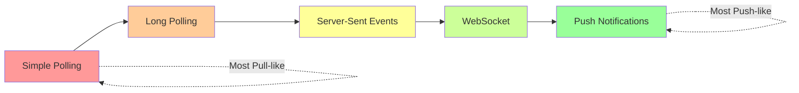
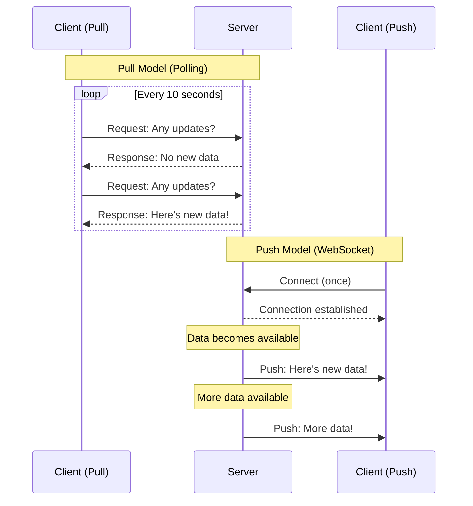
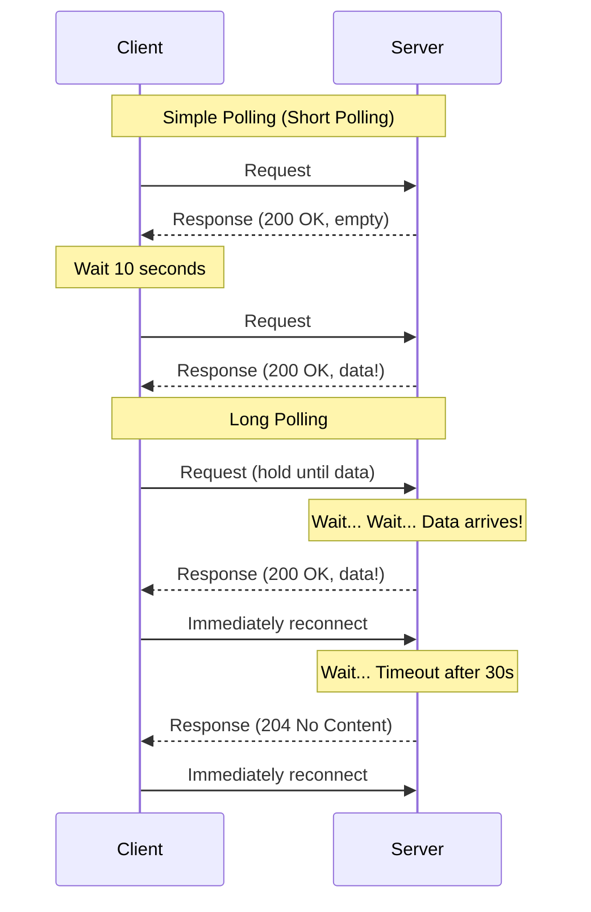
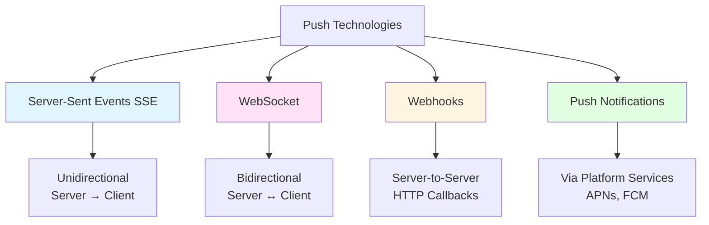
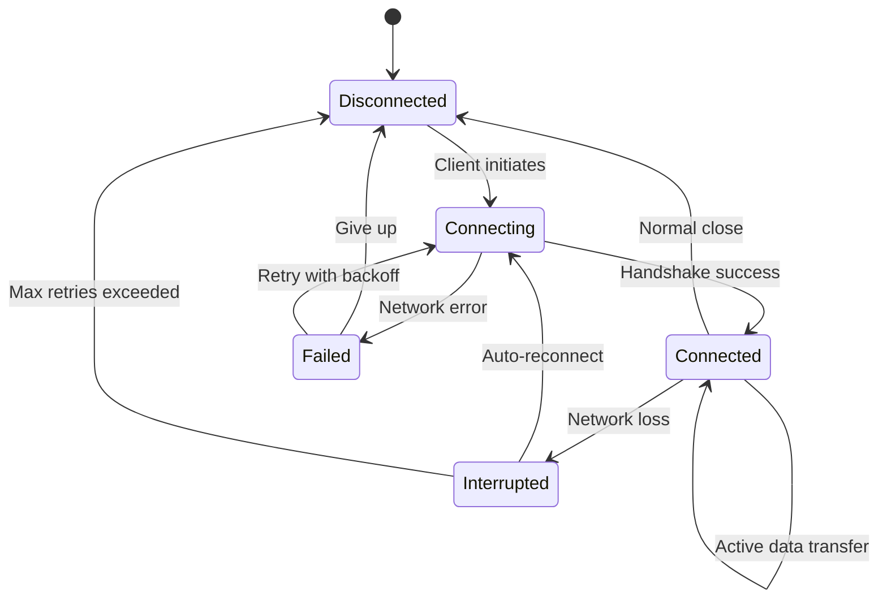
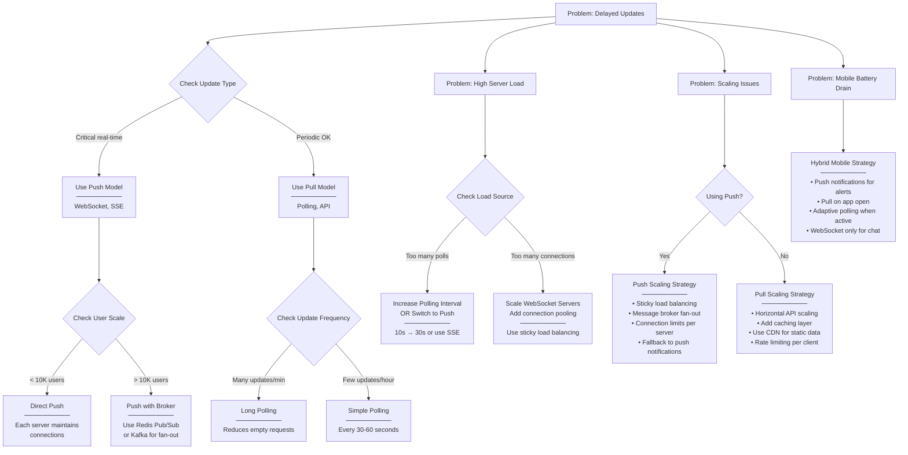

#system-design #trade-off

# Push vs Pull

## Intuition (30 sec)

**Newspaper delivery analogy:**
- **Push:** Newspaper is delivered to your door every morning automatically. You don't have to do anything - it just shows up when new information is available.
- **Pull:** You walk to the newsstand whenever you want to read the news. You decide when to check for updates.

Push gives you instant updates but requires maintaining the delivery route. Pull is simpler but you might miss breaking news between your visits.

---

## Failure-First Scenario

**The Email Explosion:**

Your team builds a notification system for a social media app. Initially, you use polling (pull model) - clients check for new notifications every 10 seconds. With 10 users, that's 1 request/second. No problem.

Six months later, you have 100,000 active users. Now you're handling 10,000 requests/second, but 99% return "no new data." Your servers are burning money checking empty mailboxes. Users complain notifications are delayed by up to 10 seconds.

You switch to WebSockets (push model) to push notifications instantly. Great! But now with 100,000 open connections, a celebrity posts and 50,000 fans need instant notifications. Your server crashes trying to fan-out writes to 50,000 simultaneous connections.

**The lesson:** Neither pure push nor pure pull scales well. You needed a hybrid approach from the start.

---

## Working Knowledge (5 min)

### Core Concepts - Definitions First

**Push Model:**
- **Definition:** A communication pattern where the server actively sends data to clients as soon as it becomes available, without the client requesting it.
- **Purpose:** Provides real-time updates with minimal latency, eliminating the need for clients to constantly check for changes.
- **How it works:** Server maintains persistent connections to clients and transmits data immediately when events occur.

**Pull Model:**
- **Definition:** A communication pattern where clients explicitly request data from the server when they need it.
- **Purpose:** Simplifies server architecture by making it stateless and allowing clients to control when they receive data.
- **How it works:** Clients periodically or on-demand send requests to the server, which responds with the current state of data.

**Key Terms:**

- **Polling:** A pull-based technique where clients repeatedly request data at regular intervals to check for updates.
- **Long Polling:** A hybrid technique where the server holds the client's request open until new data is available or a timeout occurs.
- **WebSocket:** A protocol providing full-duplex, bidirectional communication over a single TCP connection, enabling true push.
- **Server-Sent Events (SSE):** A push-based protocol where the server sends updates to the client over a single HTTP connection (unidirectional).
- **Webhooks:** A push-based pattern where a server sends HTTP POST requests to a client-provided URL when events occur.
- **Fan-out:** The process of distributing a single message or update to multiple recipients.
- **Connection Management:** The overhead of maintaining persistent connections including memory, CPU, and network resources.

### Visual Model - The Spectrum



### Push vs Pull Flow Comparison



### Comparison Table

| Aspect | Push | Pull | Hybrid |
|--------|------|------|--------|
| **Latency** | Instant (< 100ms) | Delayed (polling interval) | Instant for critical, delayed for bulk |
| **Server Load** | High (connection mgmt + fan-out) | High (frequent empty requests) | Optimized (push for alerts, pull for data) |
| **Complexity** | Complex (stateful, reconnection logic) | Simple (stateless, RESTful) | Medium (both patterns) |
| **Scalability** | Challenging (connection limits) | Easy (horizontal scaling) | Good (right tool for each job) |
| **Network Efficiency** | High (data only when needed) | Low (many empty responses) | High (minimal waste) |
| **Client Control** | Low (receives all updates) | High (request what you need) | High (subscribe to push, pull on demand) |
| **Use When** | Real-time requirements | Periodic updates fine | Most production systems |

---

## Layer 1: Conceptual Precision (15 min)

### Push Model - Deep Definitions

**Push Model (Server Push):**
- **Formal Definition:** A messaging paradigm where the server initiates data transmission to subscribed clients immediately upon the occurrence of relevant events, maintaining persistent or semi-persistent connections.
- **Simple Definition:** Like a news alert on your phone - information finds you automatically when something happens.
- **Analogy:** A personal assistant who interrupts you immediately when urgent mail arrives, rather than you checking the mailbox hourly.
- **Related Terms:**
  - **Server Push** (same as Push Model)
  - **Event-Driven** (push is typically event-driven)
  - **Pub/Sub** (often uses push to deliver messages)
  - Differs from **Pull** in that the server controls timing of data delivery

**Why this matters:**
Push models enable real-time experiences that users now expect - live sports scores, instant messaging, collaborative editing, and stock price updates. Without push, every real-time feature would require constant polling, wasting bandwidth and battery while still delivering delayed results. However, push requires careful management of connection state, reconnection logic, and fan-out at scale.

### Pull Model - Deep Definitions

**Pull Model (Client Pull):**
- **Formal Definition:** A request-response paradigm where clients explicitly initiate requests to retrieve data from the server, with the server responding synchronously without maintaining connection state between requests.
- **Simple Definition:** Like checking your mailbox - you decide when to walk out and look for mail.
- **Analogy:** Going to a restaurant and ordering food when you're hungry, rather than food being delivered to your home automatically.
- **Related Terms:**
  - **Request-Response** (the fundamental pattern of pull)
  - **Polling** (a specific pull technique with regular intervals)
  - **RESTful APIs** (typically use pull model)
  - Differs from **Push** in that the client controls timing and frequency

**Why this matters:**
Pull models are the foundation of the web (HTTP request-response) and remain the simplest way to build scalable systems. They're stateless, cacheable, and easy to understand. Pull is ideal when real-time updates aren't critical, when clients need control over data freshness, or when you're dealing with large numbers of clients where maintaining persistent connections would be prohibitively expensive.

### Polling Techniques - Detailed Breakdown



**Polling Definitions:**

**Simple Polling (Short Polling):**
- **Definition:** Client sends requests at fixed intervals and server responds immediately with current state
- **Interval:** Typically 1-60 seconds between requests
- **Pros:** Simple, stateless, works with standard HTTP
- **Cons:** Wasteful (many empty responses), delayed updates (up to polling interval)
- **Best for:** Infrequent updates, simple systems, low concurrency

**Long Polling:**
- **Definition:** Client sends request and server holds it open until new data arrives or timeout occurs
- **Timeout:** Typically 30-60 seconds before returning empty response
- **Pros:** Near real-time updates, reduces empty requests, HTTP-compatible
- **Cons:** Still somewhat wasteful, connection timeouts require reconnection, ties up server threads
- **Best for:** Real-time needs with HTTP-only infrastructure (firewall restrictions)

**Adaptive Polling:**
- **Definition:** Client adjusts polling interval based on update frequency
- **Mechanism:** Short intervals during active periods, longer intervals when quiet
- **Example:** Poll every 5s when user is active, every 60s when idle
- **Best for:** Balancing responsiveness with resource efficiency

### Push Technologies - Detailed Breakdown



**Server-Sent Events (SSE):**
- **Definition:** An HTTP-based protocol where the server pushes updates to the client over a single long-lived connection, with client automatically reconnecting on disconnect.
- **Protocol:** Uses `text/event-stream` content type over HTTP
- **Direction:** Unidirectional (server to client only)
- **Reconnection:** Built-in automatic reconnection with `Last-Event-ID`
- **Data Format:** Text-based, typically JSON
- **Browser Support:** Native EventSource API in all modern browsers
- **Pros:** Simple to implement, automatic reconnection, works through HTTP proxies, efficient for server-to-client streams
- **Cons:** Unidirectional only, limited to 6 connections per domain (HTTP/1.1), no binary data support
- **Best for:** Live feeds, notifications, stock tickers, progress updates
- **Example Use Cases:** Twitter timeline updates, live sports scores, monitoring dashboards

**WebSocket:**
- **Definition:** A protocol providing full-duplex bidirectional communication over a single TCP connection, upgraded from HTTP via handshake.
- **Protocol:** `ws://` or `wss://` (secure), RFC 6455
- **Direction:** Bidirectional (client and server can both send)
- **Handshake:** Begins as HTTP Upgrade request, then switches to WebSocket protocol
- **Data Format:** Supports both text and binary frames
- **Reconnection:** Must be manually implemented
- **Pros:** Full duplex, efficient binary protocol, no HTTP overhead after handshake, unlimited connections
- **Cons:** Complex to implement, manual reconnection needed, proxies may block, stateful (harder to scale)
- **Best for:** Chat applications, collaborative editing, gaming, bidirectional real-time data
- **Example Use Cases:** Slack messaging, Google Docs collaboration, multiplayer games

**Webhooks:**
- **Definition:** A push pattern where a service sends HTTP POST requests to a client-specified callback URL when events occur, enabling server-to-server communication.
- **Protocol:** Standard HTTP POST with event payload
- **Direction:** Server-to-server (not browser-based)
- **Setup:** Client registers a callback URL with the service
- **Delivery:** Best-effort, often with retry logic
- **Security:** Usually verified with signatures (HMAC) or tokens
- **Pros:** Simple integration, no persistent connection needed, widely supported, decoupled systems
- **Cons:** Requires publicly accessible URL, delivery not guaranteed without retries, difficult to debug
- **Best for:** System integration, event notifications between services, payment processing callbacks
- **Example Use Cases:** GitHub repository events, Stripe payment confirmations, Twilio SMS delivery status

**Push Notifications (Mobile/Web):**
- **Definition:** Platform-specific services that deliver messages to mobile apps or web browsers even when the app isn't running, using OS-level infrastructure.
- **Platforms:**
  - APNs (Apple Push Notification service) for iOS
  - FCM (Firebase Cloud Messaging) for Android
  - Web Push API for browsers
- **Architecture:** Your server → Platform service → User's device
- **Delivery:** Best-effort with platform-level queuing
- **Pros:** Works when app is closed, reaches mobile devices, managed infrastructure, battery efficient
- **Cons:** Platform-dependent, size limits (4KB iOS, 256KB Android), delivery delays possible, requires user permission
- **Best for:** Mobile app notifications, critical alerts, re-engagement messages
- **Example Use Cases:** New message alerts, breaking news, order status updates

### State Diagram - Connection Lifecycle



**State Definitions:**

- **Disconnected:** No connection exists. Client is in pull mode or not connected.
- **Connecting:** Connection establishment in progress (TCP handshake, HTTP upgrade, authentication).
- **Connected:** Active persistent connection. Server can push data, client can send requests (if bidirectional).
- **Interrupted:** Unexpected disconnection detected (network loss, server restart, timeout).
- **Failed:** Connection attempt failed. Implementing exponential backoff before retry.

**Key Transitions:**
- **Handshake success:** TCP connection established, protocol upgraded (for WebSocket), authentication completed
- **Network loss:** Connection dropped due to wifi switching, server failure, proxy timeout
- **Auto-reconnect:** Client attempts to re-establish connection, typically with exponential backoff (1s, 2s, 4s, 8s...)
- **Max retries exceeded:** After N failed reconnection attempts, give up and fall back to polling or notify user

### Architecture Pattern - Push vs Pull Systems

```
┌─────────────────────────────────────────────────────────────┐
│                    PULL ARCHITECTURE                         │
│  Definition: Stateless request-response model                │
│  Role: Client controls timing and frequency of updates       │
└────────────┬────────────────────────────────────────────────┘
             │
    ┌────────▼────────┐
    │   Load Balancer │
    │   (Stateless)   │
    └────────┬────────┘
             │
    ┌────────┴────────┐
    │                 │
┌───▼────┐      ┌────▼────┐
│Server 1│      │Server 2 │  ← Any server can handle any request
│        │      │         │
└───┬────┘      └────┬────┘
    │                │
    └────────┬───────┘
         ┌───▼────┐
         │Database│
         └────────┘


┌─────────────────────────────────────────────────────────────┐
│                    PUSH ARCHITECTURE                         │
│  Definition: Stateful persistent connection model            │
│  Role: Server controls timing, clients maintain connections  │
└────────────┬────────────────────────────────────────────────┘
             │
    ┌────────▼────────┐
    │   Load Balancer │
    │   (Sticky/Hash) │ ← Must route to same server
    └────────┬────────┘
             │
    ┌────────┴────────┐
    │                 │
┌───▼────┐      ┌────▼────┐
│Server 1│      │Server 2 │
│  ↓↓↓   │      │  ↓↓↓    │  ← Maintains active connections
│ 10K    │      │ 15K     │     to clients (memory/CPU cost)
│clients │      │clients  │
└───┬────┘      └────┬────┘
    │                │
    └────────┬───────┘
         ┌───▼────┐
         │Database│
         │   +    │
         │Message │  ← Often need message broker
         │ Broker │     for fan-out
         └────────┘
```

**Component Definitions:**

**Pull Architecture Components:**
- **Load Balancer (Stateless):** Can route any request to any server since no session state exists
- **Server Cluster:** Horizontally scalable - add more servers to handle more requests
- **Database:** Single source of truth; clients pull current state on each request
- **Scaling:** Linear - double servers to double capacity

**Push Architecture Components:**
- **Load Balancer (Sticky/Hash):** Must route client to same server to maintain connection state
- **Server Cluster:** Each server holds persistent connections in memory (limit ~10K-100K connections per server)
- **Message Broker:** Distributes events to all servers holding interested connections (Kafka, RabbitMQ, Redis Pub/Sub)
- **Scaling:** More complex - need to redistribute connections and synchronize state

### The Math/Logic - Resource Calculations

**Pull Model Calculations:**

**Request Rate Formula:**
```
Requests/Second = (Active Users × Polling Frequency) / 60

Where:
• Active Users: Number of clients currently polling
• Polling Frequency: Requests per minute (e.g., polling every 10s = 6/min)
```

**Example Calculation:**
```
Given:
• 100,000 active users
• Polling every 10 seconds (6 requests/minute per user)

Requests/Second = (100,000 × 6) / 60 = 10,000 req/s

If 95% have no new data:
• Wasted requests: 9,500/s
• Useful requests: 500/s
• Efficiency: 5%

Network cost per day (assuming 1KB request+response):
• 10,000 req/s × 86,400 seconds × 1KB = 864GB/day
```

**Push Model Calculations:**

**Connection Memory Formula:**
```
Memory Required = Active Connections × Memory Per Connection

Where:
• Memory Per Connection: Typically 50-100KB per WebSocket connection
• Active Connections: Number of simultaneous persistent connections
```

**Example Calculation:**
```
Given:
• 100,000 active connections
• 75KB per connection (socket buffer, app state)

Memory Required = 100,000 × 75KB = 7.5GB

Server capacity:
• Server with 32GB RAM, 50% for connections = 16GB available
• Connections per server = 16GB / 75KB ≈ 218,000
• Servers needed = 100,000 / 218,000 = 1 server
• With redundancy: 2-3 servers

Fan-out calculation:
If celebrity with 50,000 followers posts:
• 50,000 messages to fan-out
• At 10,000 messages/second = 5 seconds to complete
• If followers on 3 servers: coordinate fan-out across servers
```

**Comparative Cost Analysis:**
```
Scenario: 1M daily active users, 10% active simultaneously

PULL (10 second polling):
• Requests: 100,000 users × 6 req/min = 600,000 req/min = 10,000 req/s
• Server cost: 10,000 req/s ÷ 500 req/s per instance = 20 instances
• Network: ~864GB/day

PUSH (WebSocket):
• Connections: 100,000 simultaneous
• Server cost: 100,000 ÷ 50,000 per instance = 2 instances
• Network: Only when data changes (assume 100GB/day)

PUSH wins on:
• Cost: 2 instances vs 20 instances
• Network: 100GB vs 864GB
• Latency: Instant vs up to 10s delay

PULL wins on:
• Simplicity: Stateless, easier to scale
• Reliability: No reconnection logic needed
```

### Trade-offs Matrix

```
PUSH MODEL                           PULL MODEL
═══════════════════════════════════════════════════════════════
Definition: Server proactively       Definition: Client requests
sends data when available            data when needed

Pros:                                Pros:
• Instant updates (< 100ms)          • Simple, stateless architecture
  Real-time user experience          Easy to implement and debug

• Efficient network usage            • Horizontal scaling
  Data sent only when changes        Add more servers trivially

• Lower request volume               • Better caching
  No repeated "empty" requests       Standard HTTP caching works

• Supports streaming                 • Client control
  Continuous data flows              Client decides when to fetch

Cons:                                Cons:
• Complex connection management      • Higher latency
  Reconnection, keepalive, state     Updates delayed by polling interval

• Scaling challenges                 • Inefficient network usage
  Connection limits per server       Many requests return empty

• Higher memory usage                • Higher server load
  Each connection consumes RAM       Constant request processing

• No caching                         • Battery drain (mobile)
  Each message is fresh              Frequent polling drains battery

Use When:                            Use When:
• Real-time updates critical         • Periodic updates acceptable
  (chat, gaming, trading)            (email, RSS, dashboards)

• High update frequency              • Infrequent updates
  (many events per minute)           (once per hour or slower)

• Small user base per event          • Large user base
  (direct messages, notifications)   (public content, APIs)

• Bidirectional communication        • One-way data flow
  (collaborative editing)            (read-only APIs)
```

---

## Layer 2: Technology-Specific Examples (20 min)

### Technology Comparison

**Tool Category:** Real-time Communication Technologies

| WebSocket | Server-Sent Events (SSE) | Long Polling | Simple Polling |
|-----------|--------------------------|--------------|----------------|
| **Definition:** Full-duplex bidirectional protocol | **Definition:** Server-to-client event stream | **Definition:** Request held until data available | **Definition:** Regular interval requests |
| **Protocol:** `ws://` or `wss://` | **Protocol:** `text/event-stream` over HTTP | **Protocol:** Standard HTTP | **Protocol:** Standard HTTP |
| **Direction:** Bidirectional | **Direction:** Unidirectional (server→client) | **Direction:** Request-response | **Direction:** Request-response |
| **Latency:** ⭐⭐⭐⭐⭐ Instant (~50ms) | **Latency:** ⭐⭐⭐⭐⭐ Instant (~50ms) | **Latency:** ⭐⭐⭐⭐ Near-instant (~100ms) | **Latency:** ⭐⭐ Delayed (polling interval) |
| **Scalability:** ⭐⭐⭐ Good | **Scalability:** ⭐⭐⭐⭐ Better | **Scalability:** ⭐⭐ Limited | **Scalability:** ⭐⭐⭐⭐⭐ Excellent |
| **Simplicity:** ⭐⭐ Complex | **Simplicity:** ⭐⭐⭐⭐ Simple | **Simplicity:** ⭐⭐⭐ Moderate | **Simplicity:** ⭐⭐⭐⭐⭐ Very simple |
| **Network Efficiency:** ⭐⭐⭐⭐⭐ Excellent | **Network Efficiency:** ⭐⭐⭐⭐⭐ Excellent | **Network Efficiency:** ⭐⭐⭐ Moderate | **Network Efficiency:** ⭐ Poor |
| **Best For:** Chat, gaming, collaboration | **Best For:** Notifications, live feeds, logs | **Best For:** Real-time with HTTP-only | **Best For:** Infrequent updates, simple APIs |
| **Browser Support:** All modern browsers | **Browser Support:** All modern browsers (EventSource) | **Browser Support:** Universal | **Browser Support:** Universal |

### Real-World Implementation Examples

#### Example 1: WebSocket Chat Implementation

**Server (Node.js + ws):**
```javascript
const WebSocket = require('ws');
const wss = new WebSocket.Server({ port: 8080 });

// Connection pool - stores active connections
// Definition: Map of userId to WebSocket connection
const connections = new Map();

wss.on('connection', (ws, req) => {
  const userId = req.headers['user-id'];

  // Store connection
  // Purpose: Enable targeted message delivery
  connections.set(userId, ws);
  console.log(`User ${userId} connected. Total: ${connections.size}`);

  // Handle incoming messages
  ws.on('message', (data) => {
    const message = JSON.parse(data);

    // Fan-out: Send to recipient
    // Definition: Deliver message to specific user's connection
    const recipientWs = connections.get(message.to);
    if (recipientWs && recipientWs.readyState === WebSocket.OPEN) {
      recipientWs.send(JSON.stringify({
        from: userId,
        text: message.text,
        timestamp: Date.now()
      }));
    }
  });

  // Handle disconnection
  ws.on('close', () => {
    connections.delete(userId);
    console.log(`User ${userId} disconnected. Total: ${connections.size}`);
  });

  // Heartbeat to detect dead connections
  // Purpose: Prevent ghost connections from accumulating
  ws.isAlive = true;
  ws.on('pong', () => { ws.isAlive = true; });
});

// Ping all connections every 30 seconds
// Definition: Keepalive mechanism to detect disconnected clients
setInterval(() => {
  wss.clients.forEach((ws) => {
    if (ws.isAlive === false) return ws.terminate();
    ws.isAlive = false;
    ws.ping();
  });
}, 30000);
```

**Client (JavaScript):**
```javascript
class ChatClient {
  constructor(userId) {
    this.userId = userId;
    this.ws = null;
    this.reconnectDelay = 1000; // Exponential backoff
    this.maxReconnectDelay = 30000;
    this.connect();
  }

  connect() {
    this.ws = new WebSocket('ws://localhost:8080', {
      headers: { 'user-id': this.userId }
    });

    this.ws.onopen = () => {
      console.log('Connected');
      this.reconnectDelay = 1000; // Reset backoff
    };

    this.ws.onmessage = (event) => {
      const message = JSON.parse(event.data);
      this.displayMessage(message);
    };

    this.ws.onerror = (error) => {
      console.error('WebSocket error:', error);
    };

    this.ws.onclose = () => {
      console.log('Disconnected. Reconnecting...');
      // Exponential backoff reconnection
      // Definition: Increase delay between retries to avoid overwhelming server
      setTimeout(() => {
        this.reconnectDelay = Math.min(
          this.reconnectDelay * 2,
          this.maxReconnectDelay
        );
        this.connect();
      }, this.reconnectDelay);
    };
  }

  sendMessage(to, text) {
    if (this.ws.readyState === WebSocket.OPEN) {
      this.ws.send(JSON.stringify({ to, text }));
    } else {
      console.error('Not connected. Message queued.');
      // In production: Queue messages and send when reconnected
    }
  }

  displayMessage(message) {
    console.log(`${message.from}: ${message.text}`);
  }
}

// Usage
const chat = new ChatClient('user123');
chat.sendMessage('user456', 'Hello!');
```

#### Example 2: Server-Sent Events (SSE) Implementation

**Server (Node.js + Express):**
```javascript
const express = require('express');
const app = express();

// SSE connections storage
// Definition: Array of response objects for active SSE streams
const sseClients = [];

// SSE endpoint
// Definition: Establishes unidirectional server→client stream
app.get('/events', (req, res) => {
  // Set SSE headers
  // Purpose: Indicate event stream, prevent buffering, keep alive
  res.setHeader('Content-Type', 'text/event-stream');
  res.setHeader('Cache-Control', 'no-cache');
  res.setHeader('Connection', 'keep-alive');

  // Send initial connection success
  res.write('data: {"type":"connected"}\n\n');

  // Add to clients list
  sseClients.push(res);
  console.log(`SSE client connected. Total: ${sseClients.length}`);

  // Remove on disconnect
  req.on('close', () => {
    const index = sseClients.indexOf(res);
    sseClients.splice(index, 1);
    console.log(`SSE client disconnected. Total: ${sseClients.length}`);
  });
});

// Broadcast to all SSE clients
// Definition: Fan-out function to send event to all connected clients
function broadcastSSE(eventType, data) {
  const message = `event: ${eventType}\ndata: ${JSON.stringify(data)}\nid: ${Date.now()}\n\n`;

  sseClients.forEach((client) => {
    client.write(message);
  });
}

// Example: Broadcast stock price updates every 2 seconds
setInterval(() => {
  const stockPrice = {
    symbol: 'AAPL',
    price: (150 + Math.random() * 10).toFixed(2),
    timestamp: Date.now()
  };
  broadcastSSE('stockPrice', stockPrice);
}, 2000);

app.listen(3000, () => console.log('SSE server on port 3000'));
```

**Client (JavaScript):**
```javascript
// EventSource API - built-in browser support for SSE
// Definition: Native API for receiving server-sent events
const eventSource = new EventSource('http://localhost:3000/events');

// Handle generic messages
eventSource.onmessage = (event) => {
  const data = JSON.parse(event.data);
  console.log('Message:', data);
};

// Handle specific event types
// Definition: Typed event handlers for different message categories
eventSource.addEventListener('stockPrice', (event) => {
  const data = JSON.parse(event.data);
  console.log(`Stock Update: ${data.symbol} = $${data.price}`);
  updateStockDisplay(data);
});

// Handle errors and reconnection
// Note: EventSource automatically reconnects on disconnect
eventSource.onerror = (error) => {
  if (eventSource.readyState === EventSource.CLOSED) {
    console.log('Connection closed');
  } else {
    console.log('Connection error, will auto-reconnect');
  }
};

// Close connection when done
// eventSource.close();
```

#### Example 3: Webhooks Implementation

**Webhook Provider (Stripe-like payment service):**
```javascript
const express = require('express');
const crypto = require('crypto');
const axios = require('axios');

const app = express();
app.use(express.json());

// Webhook subscriptions storage
// Definition: Map of client IDs to their registered webhook URLs
const webhookSubscriptions = new Map();

// Register webhook endpoint
app.post('/webhooks/register', (req, res) => {
  const { clientId, url, events } = req.body;

  webhookSubscriptions.set(clientId, {
    url,
    events, // ['payment.success', 'payment.failed']
    secret: generateSecret() // For signature verification
  });

  res.json({
    success: true,
    secret: webhookSubscriptions.get(clientId).secret
  });
});

// Simulate payment event
app.post('/process-payment', async (req, res) => {
  const { clientId, amount } = req.body;

  // Process payment (simplified)
  const paymentResult = {
    paymentId: generateId(),
    clientId,
    amount,
    status: 'success',
    timestamp: Date.now()
  };

  // Send webhook
  await sendWebhook(clientId, 'payment.success', paymentResult);

  res.json(paymentResult);
});

// Send webhook with retries
// Definition: POST event data to client's callback URL with signature
async function sendWebhook(clientId, eventType, data) {
  const subscription = webhookSubscriptions.get(clientId);
  if (!subscription || !subscription.events.includes(eventType)) {
    return; // Not subscribed to this event
  }

  const payload = {
    event: eventType,
    data,
    timestamp: Date.now()
  };

  // Generate HMAC signature for verification
  // Definition: Hash-based message authentication code to prove authenticity
  const signature = crypto
    .createHmac('sha256', subscription.secret)
    .update(JSON.stringify(payload))
    .digest('hex');

  // Retry logic with exponential backoff
  let attempt = 0;
  const maxAttempts = 3;

  while (attempt < maxAttempts) {
    try {
      await axios.post(subscription.url, payload, {
        headers: {
          'X-Webhook-Signature': signature,
          'X-Webhook-Event': eventType
        },
        timeout: 5000
      });
      console.log(`Webhook sent to ${clientId}: ${eventType}`);
      return; // Success
    } catch (error) {
      attempt++;
      console.error(`Webhook attempt ${attempt} failed:`, error.message);

      if (attempt < maxAttempts) {
        // Exponential backoff: 1s, 2s, 4s
        await sleep(Math.pow(2, attempt) * 1000);
      }
    }
  }

  console.error(`Webhook failed after ${maxAttempts} attempts`);
  // In production: Store in dead letter queue for manual review
}

function generateSecret() {
  return crypto.randomBytes(32).toString('hex');
}

function generateId() {
  return crypto.randomBytes(16).toString('hex');
}

function sleep(ms) {
  return new Promise(resolve => setTimeout(resolve, ms));
}

app.listen(4000, () => console.log('Webhook provider on port 4000'));
```

**Webhook Consumer (Client receiving webhooks):**
```javascript
const express = require('express');
const crypto = require('crypto');

const app = express();
app.use(express.json());

// Store the secret received during registration
const WEBHOOK_SECRET = 'your-webhook-secret-from-registration';

// Webhook endpoint (must be publicly accessible)
app.post('/webhooks/payment', (req, res) => {
  const signature = req.headers['x-webhook-signature'];
  const eventType = req.headers['x-webhook-event'];

  // Verify signature
  // Definition: Confirm webhook came from trusted source
  const expectedSignature = crypto
    .createHmac('sha256', WEBHOOK_SECRET)
    .update(JSON.stringify(req.body))
    .digest('hex');

  if (signature !== expectedSignature) {
    console.error('Invalid webhook signature');
    return res.status(401).send('Invalid signature');
  }

  // Process event
  console.log(`Received webhook: ${eventType}`);
  console.log('Payload:', req.body);

  // Handle event
  if (eventType === 'payment.success') {
    // Update database, send confirmation email, etc.
    processPaymentSuccess(req.body.data);
  } else if (eventType === 'payment.failed') {
    processPaymentFailure(req.body.data);
  }

  // Respond quickly (< 5 seconds)
  // Definition: Acknowledge receipt so sender doesn't retry
  res.status(200).send('Webhook received');
});

function processPaymentSuccess(data) {
  console.log(`Payment ${data.paymentId} succeeded: $${data.amount}`);
  // Update database, trigger business logic
}

function processPaymentFailure(data) {
  console.log(`Payment ${data.paymentId} failed`);
  // Notify customer, log for review
}

app.listen(5000, () => console.log('Webhook consumer on port 5000'));
```

#### Example 4: Polling Implementation

**Simple Polling Client:**
```javascript
class PollingClient {
  constructor(apiUrl, interval = 10000) {
    this.apiUrl = apiUrl;
    this.interval = interval; // 10 seconds default
    this.timerId = null;
    this.lastData = null;
  }

  start() {
    // Initial fetch
    this.poll();

    // Set up recurring polling
    // Definition: Execute poll() every 'interval' milliseconds
    this.timerId = setInterval(() => this.poll(), this.interval);
  }

  async poll() {
    try {
      const response = await fetch(this.apiUrl);
      const data = await response.json();

      // Only notify if data changed
      // Definition: Avoid processing duplicate data
      if (JSON.stringify(data) !== JSON.stringify(this.lastData)) {
        this.onDataUpdate(data);
        this.lastData = data;
      }
    } catch (error) {
      console.error('Polling error:', error);
    }
  }

  onDataUpdate(data) {
    console.log('New data:', data);
    // Update UI, trigger callbacks, etc.
  }

  stop() {
    if (this.timerId) {
      clearInterval(this.timerId);
      this.timerId = null;
    }
  }
}

// Usage
const poller = new PollingClient('https://api.example.com/status', 5000);
poller.start();

// Stop when user leaves page
// window.addEventListener('beforeunload', () => poller.stop());
```

**Adaptive Polling (Adjusts interval based on activity):**
```javascript
class AdaptivePollingClient {
  constructor(apiUrl) {
    this.apiUrl = apiUrl;
    this.minInterval = 5000;   // 5 seconds when active
    this.maxInterval = 60000;  // 60 seconds when idle
    this.currentInterval = this.minInterval;
    this.noChangeCount = 0;
    this.timerId = null;
  }

  start() {
    this.scheduleNextPoll();
  }

  async poll() {
    try {
      const response = await fetch(this.apiUrl);
      const data = await response.json();

      if (JSON.stringify(data) !== JSON.stringify(this.lastData)) {
        // Data changed - reset to fast polling
        this.noChangeCount = 0;
        this.currentInterval = this.minInterval;
        this.onDataUpdate(data);
        this.lastData = data;
      } else {
        // No change - slow down polling
        // Definition: Increase interval to reduce server load
        this.noChangeCount++;
        if (this.noChangeCount > 3) {
          this.currentInterval = Math.min(
            this.currentInterval * 1.5,
            this.maxInterval
          );
        }
      }
    } catch (error) {
      console.error('Polling error:', error);
    }

    this.scheduleNextPoll();
  }

  scheduleNextPoll() {
    this.timerId = setTimeout(() => this.poll(), this.currentInterval);
  }

  onDataUpdate(data) {
    console.log('Data updated:', data);
  }

  stop() {
    if (this.timerId) {
      clearTimeout(this.timerId);
      this.timerId = null;
    }
  }
}
```

### Configuration Comparison

**WebSocket Configuration (Node.js):**
```javascript
const WebSocket = require('ws');

const wss = new WebSocket.Server({
  port: 8080,

  // Maximum payload size
  // Definition: Limit message size to prevent memory exhaustion
  maxPayload: 1024 * 1024, // 1MB

  // Backlog queue size
  // Definition: Number of pending connections to queue
  backlog: 100,

  // Verify client before accepting connection
  // Purpose: Authentication, rate limiting
  verifyClient: (info, callback) => {
    const token = info.req.headers['authorization'];
    if (isValidToken(token)) {
      callback(true);
    } else {
      callback(false, 401, 'Unauthorized');
    }
  },

  // Client tracking
  // Definition: Maintain list of all clients for broadcasting
  clientTracking: true,

  // Compression
  // Definition: Enable per-message deflate compression
  perMessageDeflate: {
    zlibDeflateOptions: {
      chunkSize: 1024,
      memLevel: 7,
      level: 3
    }
  }
});

// Key Terms:
// maxPayload - Maximum message size to accept
// backlog - Queue size for pending connections
// verifyClient - Authentication hook before connection
// clientTracking - Maintain wss.clients set
// perMessageDeflate - Compress messages to save bandwidth
```

**SSE Configuration (Express):**
```javascript
app.get('/events', (req, res) => {
  // SSE Headers
  res.setHeader('Content-Type', 'text/event-stream');
  // Definition: Indicates this is an event stream, not regular response

  res.setHeader('Cache-Control', 'no-cache');
  // Definition: Prevent proxies/CDNs from caching the stream

  res.setHeader('Connection', 'keep-alive');
  // Definition: Keep connection open for streaming

  res.setHeader('X-Accel-Buffering', 'no');
  // Definition: Disable nginx buffering for real-time delivery

  // Optional: Set retry interval for client reconnection
  res.write('retry: 10000\n\n');
  // Definition: Client waits 10s before reconnecting on disconnect
});

// Configuration Concepts:
// text/event-stream - MIME type for SSE
// no-cache - Prevent buffering/caching
// retry - Reconnection delay in milliseconds
```

---

## Layer 3: Production-Ready Details (30 min)

### Production Architecture - Hybrid Push/Pull System

```
                              Internet
                                 │
                    ┌────────────┴─────────────┐
                    │                          │
              ┌─────▼──────┐           ┌──────▼──────┐
              │  API Layer │           │  WebSocket  │
              │   (Pull)   │           │  Layer      │
              │            │           │  (Push)     │
              │ Definition:│           │ Definition: │
              │ Stateless  │           │ Stateful    │
              │ REST APIs  │           │ Real-time   │
              └─────┬──────┘           └──────┬──────┘
                    │                         │
        ┌───────────┼────────────┬───────────┼───────────┐
        │           │            │           │           │
    ┌───▼───┐   ┌──▼───┐    ┌───▼────┐  ┌──▼────┐  ┌───▼────┐
    │API    │   │API   │    │WebSock │  │WebSock│  │WebSock │
    │Server1│   │Server2│   │ Server1│  │Server2│  │ Server3│
    │       │   │       │   │        │  │       │  │        │
    │Role:  │   │Role:  │   │Role:   │  │Role:  │  │Role:   │
    │Handle │   │Handle │   │Maintain│  │15K    │  │12K     │
    │data   │   │data   │   │10K WS  │  │WS     │  │WS      │
    │queries│   │queries│   │conns   │  │conns  │  │conns   │
    └───┬───┘   └──┬───┘    └───┬────┘  └──┬────┘  └───┬────┘
        │          │            │          │          │
        └──────────┼────────────┴──────────┴──────────┘
                   │                       │
              ┌────▼────┐           ┌──────▼────────┐
              │Database │           │ Message Broker│
              │         │           │  (Redis/Kafka)│
              │Role:    │           │               │
              │Store    │           │Role:          │
              │state    │◄──────────│Fan-out events │
              │         │           │to WS servers  │
              └─────────┘           └───────────────┘


FLOW EXAMPLE:
1. User posts tweet (Pull): POST /api/tweets
2. API Server writes to Database
3. API Server publishes event to Message Broker
4. Message Broker fans out to all WebSocket Servers
5. WebSocket Servers push (Push) to connected followers
```

**Architecture Component Definitions:**

- **API Layer (Pull):** Stateless HTTP servers handling REST requests. Can be scaled horizontally without coordination. Use for: initial data load, bulk queries, non-real-time operations.

- **WebSocket Layer (Push):** Stateful servers maintaining persistent connections. Require session affinity (sticky load balancing). Use for: real-time notifications, live updates, bidirectional communication.

- **Message Broker:** Pub/Sub system for distributing events across WebSocket servers. Ensures all servers receive updates to push to their connected clients. Options: Redis Pub/Sub (simple), Kafka (durable, high throughput), RabbitMQ (flexible routing).

- **Hybrid Pattern Benefits:**
  - Pull for bulk data: GET /api/messages?since=timestamp
  - Push for notifications: "New message available"
  - Client pulls details when notified
  - Reduces fan-out cost while maintaining real-time UX

### Real-World Example: Kafka's Pull Model

**Kafka Consumer Architecture:**

```
┌─────────────────────────────────────────────────────────────┐
│                    KAFKA CLUSTER                             │
│  Definition: Distributed log storage system                  │
├─────────────────────────────────────────────────────────────┤
│                                                              │
│  Topic: "orders"                                             │
│  ┌──────────┬──────────┬──────────┬──────────┐             │
│  │Partition0│Partition1│Partition2│Partition3│             │
│  │  offset  │  offset  │  offset  │  offset  │             │
│  │  [0-999] │ [0-1500] │ [0-800]  │ [0-1200] │             │
│  └──────────┴──────────┴──────────┴──────────┘             │
│                                                              │
└────────────────┬────────────────────────────────────────────┘
                 │
        ┌────────┼────────┬────────────┐
        │        │        │            │
    ┌───▼───┐┌──▼───┐┌───▼────┐  ┌────▼────┐
    │Consumer││Consumer││Consumer│  │Consumer │
    │ Group A││Group A││Group A │  │ Group B │
    │        ││       ││        │  │         │
    │Pulls   ││Pulls  ││Pulls   │  │Pulls    │
    │Part 0,1││Part 2 ││Part 3  │  │Part 0-3 │
    └────────┘└───────┘└────────┘  └─────────┘
```

**Why Kafka Uses Pull (Consumer-Driven):**

**Pull Model Advantages in Kafka:**

1. **Consumer Control:**
   - **Definition:** Consumers fetch messages at their own pace
   - **Benefit:** Fast consumers don't wait; slow consumers don't get overwhelmed
   - **Example:** Batch processing consumer pulls 1000 messages at once; real-time consumer pulls 1 at a time

2. **Backpressure Handling:**
   - **Definition:** Consumer naturally limits its rate by pulling when ready
   - **Contrast with Push:** In push, server must track consumer speed and buffer
   - **Example:** If consumer is processing complex logic (5 sec/message), it simply pulls less frequently

3. **Replay Capability:**
   - **Definition:** Consumers can re-read old messages by resetting offset
   - **Use Case:** Bug fix requires reprocessing last hour's data
   - **Mechanism:** `consumer.seek(earlierOffset)` then continue pulling

4. **Load Balancing:**
   - **Definition:** Partitions assigned to consumers in a group
   - **Automatic:** Kafka rebalances on consumer add/remove
   - **Example:** 4 partitions, 2 consumers → each gets 2 partitions

**Kafka Consumer Code (Pull-Based):**

```java
Properties props = new Properties();
props.put("bootstrap.servers", "localhost:9092");
props.put("group.id", "order-processor");

// Definition: Consumer group shares partition ownership
// Multiple consumers in same group = parallel processing

KafkaConsumer<String, String> consumer = new KafkaConsumer<>(props);
consumer.subscribe(Arrays.asList("orders"));

// Pull loop - consumer controls timing
// Definition: Blocks up to timeout, returns available messages
while (true) {
  ConsumerRecords<String, String> records = consumer.poll(Duration.ofMillis(100));

  // Process at consumer's pace
  for (ConsumerRecord<String, String> record : records) {
    processOrder(record.value());

    // Consumer commits offset when ready
    // Definition: Mark message as processed
    consumer.commitSync();
  }

  // If processOrder() is slow, poll() is called less frequently
  // Natural backpressure - consumer pulls when ready
}

// Key Concepts:
// poll() - Pull messages from Kafka (pull model)
// consumer.commitSync() - Acknowledge processing
// Offset - Position in partition log
```

### Real-World Example: Webhooks at Stripe

**Problem:**
Millions of payment events need to reach merchant servers in real-time. Can't use polling (too slow for urgent fraud alerts), can't use WebSockets (merchants may not support them).

**Solution: Webhooks (Push via HTTP Callbacks)**

```
┌────────────────────────────────────────────────┐
│         STRIPE PAYMENT SYSTEM                  │
├────────────────────────────────────────────────┤
│                                                │
│  1. Payment Event Occurs                       │
│     payment.succeeded                          │
│          │                                     │
│          ▼                                     │
│  2. Event Queue (Kafka)                        │
│     ┌─────────────────┐                       │
│     │Event: pay_123   │                       │
│     │Type: success    │                       │
│     │Merchant: acme   │                       │
│     └────────┬────────┘                       │
│              │                                │
│              ▼                                │
│  3. Webhook Worker                            │
│     • Lookup merchant webhook URL             │
│     • Generate signature                      │
│     • POST to merchant                        │
│              │                                │
└──────────────┼────────────────────────────────┘
               │
               │ HTTP POST
               │
               ▼
┌──────────────────────────────────────────────┐
│      MERCHANT SERVER (You)                   │
├──────────────────────────────────────────────┤
│                                              │
│  POST /webhooks/stripe                       │
│  Headers:                                    │
│    Stripe-Signature: t=xxx,v1=yyy           │
│  Body:                                       │
│    {                                         │
│      "type": "payment.succeeded",           │
│      "data": {...}                          │
│    }                                         │
│                                              │
│  4. Merchant processes webhook               │
│     • Verify signature                       │
│     • Update database                        │
│     • Send confirmation email                │
│     • Return 200 OK (< 5 sec)               │
│                                              │
└──────────────────────────────────────────────┘
```

**Stripe Webhook Delivery Guarantees:**

- **At-least-once delivery:** May receive same event multiple times
- **Definition:** Same webhook can be sent 2+ times if first attempt times out
- **Handling:** Use idempotency keys to prevent duplicate processing
- **Retry Schedule:**
  - Immediate retry on failure
  - 1 hour later
  - 2 hours later
  - 6 hours later
  - 12 hours later
  - 24 hours later

**Stripe Signature Verification (Security):**

```javascript
const crypto = require('crypto');

function verifyStripeWebhook(payload, signature, secret) {
  // Signature format: "t=timestamp,v1=hash"
  // Definition: HMAC signature proves webhook authenticity

  const parts = signature.split(',');
  const timestamp = parts[0].split('=')[1];
  const hash = parts[1].split('=')[1];

  // Construct signed payload
  // Definition: timestamp + . + raw request body
  const signedPayload = `${timestamp}.${payload}`;

  // Compute expected signature
  const expectedHash = crypto
    .createHmac('sha256', secret)
    .update(signedPayload)
    .digest('hex');

  // Compare signatures
  if (hash !== expectedHash) {
    throw new Error('Invalid signature');
  }

  // Check timestamp (prevent replay attacks)
  // Definition: Reject webhooks older than 5 minutes
  const currentTime = Math.floor(Date.now() / 1000);
  if (currentTime - parseInt(timestamp) > 300) {
    throw new Error('Webhook too old');
  }

  return true;
}
```

**Why Webhooks Work for Stripe:**

- **Merchant-friendly:** Works with any HTTP server, no special infrastructure
- **Decoupled:** Merchants can be offline; webhooks retry automatically
- **Scalable:** Stripe controls retry logic and rate limiting
- **Reliable:** Events stored durably; can manually replay from dashboard

### Monitoring Metrics

```
┌──────────────────────────────────────────────────────────────┐
│                 PUSH/PULL METRICS DASHBOARD                   │
├──────────────────────────────────────────────────────────────┤
│                                                               │
│  PULL METRICS (API Layer)                                     │
│  ─────────────────────────                                    │
│  Request Rate: 15,247 req/sec                                 │
│  Definition: Number of HTTP requests per second               │
│  Alert when: > 20,000 req/sec (capacity limit)               │
│                                                               │
│  Cache Hit Rate: 87%                                          │
│  Definition: % of requests served from cache                  │
│  Why track: Higher = less DB load, lower costs               │
│  Target: > 80%                                                │
│                                                               │
│  P99 Latency: 45ms                                            │
│  Definition: 99% of requests complete within this time        │
│  Target: < 100ms for good UX                                  │
│                                                               │
│  ────────────────────────────────────────────────────────     │
│                                                               │
│  PUSH METRICS (WebSocket Layer)                               │
│  ───────────────────────────                                  │
│  Active Connections: 87,324                                   │
│  Definition: Number of open WebSocket connections             │
│  Alert when: > 90,000 (approaching server limit)             │
│                                                               │
│  Connection Churn: 45 connections/sec                         │
│  Definition: Rate of new connections + disconnections         │
│  Why track: High churn = reconnection storms, investigate    │
│                                                               │
│  Message Fan-out Rate: 5,432 msg/sec                          │
│  Definition: Total messages pushed to all clients per second  │
│  Cost: Each fan-out to 1000 users = 1000 write operations    │
│                                                               │
│  Push Latency: 125ms (P99)                                    │
│  Definition: Time from event to message delivered to client   │
│  Target: < 200ms for real-time feel                          │
│                                                               │
│  Failed Pushes: 23/sec (0.4%)                                 │
│  Definition: Messages that couldn't be delivered              │
│  Common causes: Client disconnected, network timeout          │
│  Alert when: > 2% (may need fallback to push notifications)  │
│                                                               │
│  ────────────────────────────────────────────────────────     │
│                                                               │
│  HYBRID METRICS                                               │
│  ──────────────                                               │
│  Push-to-Pull Ratio: 15:1                                     │
│  Definition: For every 15 pushes, clients make 1 pull request │
│  Ideal: High ratio = efficient (pushes avoid polling waste)   │
│                                                               │
│  Notification → Load Latency: 350ms                           │
│  Definition: Time from push notification to API data fetch    │
│  Flow: Push alert → Client pulls data details                │
│                                                               │
└──────────────────────────────────────────────────────────────┘
```

**Metric Definitions:**

- **Request Rate (QPS):** Queries Per Second - rate of incoming HTTP requests
- **Cache Hit Rate:** Percentage of requests served from cache without hitting database
- **Active Connections:** Current number of open persistent connections (WebSocket, SSE)
- **Connection Churn:** Rate of connections opening and closing (new + dropped per second)
- **Fan-out Rate:** Number of messages broadcasted per second across all connections
- **Push Latency:** End-to-end time from event occurrence to client receiving message
- **Failed Pushes:** Messages that couldn't be delivered (disconnected clients, timeouts)

### Troubleshooting Decision Tree



### Capacity Planning Example

**Scenario: Designing a Real-Time Sports Score System**

**Requirements:**
- 10 million daily active users (DAU)
- 500K simultaneous viewers during peak (major game)
- Score updates every 30 seconds during games
- 20 concurrent games on average

**Option 1: Pull Model (Polling)**

```
Calculations:

Active Pollers (Peak):
• 500,000 simultaneous users

Poll Frequency:
• Every 10 seconds (6 requests/minute)

Request Rate:
• 500,000 users × 6 req/min ÷ 60 sec = 50,000 req/sec

Server Capacity:
• Assume 1 server handles 1,000 req/sec
• Servers needed = 50,000 ÷ 1,000 = 50 servers
• With 2x redundancy = 100 servers

Network Bandwidth:
• Request size: ~500 bytes (headers + small payload)
• Response size: ~2KB (scores for all games)
• Per request: 2.5KB
• Total: 50,000 req/sec × 2.5KB = 125 MB/sec = 1 Gbps
• Daily: 1 Gbps × 10 hours peak = ~4.5 TB

Cost Estimate (AWS):
• EC2: 100 × c5.large @ $0.085/hr = $8.50/hr = $6,120/month
• Data transfer: 4.5 TB × 30 days = 135 TB @ $0.05/GB = $6,750/month
• Total: ~$13,000/month

Issues:
• 95% of requests return "no change" (wasteful)
• 10-second delay in score updates
• High data transfer costs
```

**Option 2: Push Model (WebSocket)**

```
Calculations:

Active Connections (Peak):
• 500,000 simultaneous users

Connection Memory:
• ~100KB per WebSocket connection
• 500,000 × 100KB = 50GB RAM needed

Server Capacity:
• Assume 1 server handles 10,000 connections (with 64GB RAM)
• Servers needed = 500,000 ÷ 10,000 = 50 servers
• With 2x redundancy = 100 servers

Message Fan-out:
• Update every 30 seconds = 2 updates/minute
• Per update: push to all 500K connected users
• Fan-out rate: 500,000 messages per update
• Total: 500,000 msg × 2 updates/min ÷ 60 sec = 16,667 msg/sec

Network Bandwidth:
• Message size: ~1KB (scores for all games)
• 16,667 msg/sec × 1KB = 16.7 MB/sec = 133 Mbps
• Daily: 133 Mbps × 10 hours = ~600 GB (much lower!)

Cost Estimate (AWS):
• EC2: 100 × c5.2xlarge @ $0.34/hr = $34/hr = $24,480/month
• Data transfer: 600GB × 30 days = 18TB @ $0.05/GB = $900/month
• Message broker (Redis): $500/month
• Total: ~$26,000/month

Benefits:
• Instant updates (< 100ms latency)
• Lower bandwidth (600GB vs 4.5TB daily)
• Better user experience

Issues:
• 2x more expensive on compute
• Complex connection management
• Need message broker for fan-out
```

**Option 3: Hybrid Model (Recommended)**

```
Architecture:

Push for Critical Events:
• Goal scored, game ended, major play → WebSocket push
• 5-10 critical events per game
• Only ~200 pushes/game × 20 games = 4,000 pushes total

Pull for Regular Updates:
• Score polling every 30 seconds
• But only ~100K users actively watching (others idle)
• 100,000 × 2 req/min ÷ 60 = 3,333 req/sec

Calculations:

Server Capacity:
• API servers: 3,333 req/sec ÷ 1,000 = 4 servers (×2 = 8 servers)
• WebSocket servers: 100K connections ÷ 10,000 = 10 servers (×2 = 20)
• Total: 28 servers vs 100 (pull-only) or 100 (push-only)

Network Bandwidth:
• Polling: 3,333 req/sec × 2.5KB = 8.3 MB/sec
• Push events: 4,000 pushes/hour × 1KB = negligible
• Daily: ~300GB (lowest of all options!)

Cost Estimate:
• API servers: 8 × c5.large @ $0.085/hr = $490/month
• WebSocket servers: 20 × c5.xlarge @ $0.17/hr = $2,448/month
• Data transfer: 300GB × 30 = 9TB @ $0.05/GB = $450/month
• Message broker: $200/month
• Total: ~$3,600/month

Results:
• 72% cheaper than pull-only
• 86% cheaper than push-only
• Best user experience (instant for critical, fresh for regular)
• Easier to scale (most users on simple pull)
```

**Decision: Hybrid Model**

**Implementation:**
1. **Pull:** Client polls `/api/scores` every 30 seconds for current state
2. **Push:** WebSocket connection subscribes to "goal" and "game_end" events
3. **Client behavior:** When push notification received, immediately poll for full update
4. **Fallback:** If WebSocket fails, degrade gracefully to pull-only with 10s interval

### Production Checklist

**Push Model Checklist:**

- [ ] **Connection Management:**
  - [ ] Implement heartbeat/ping-pong to detect dead connections
  - [ ] Exponential backoff for reconnection attempts
  - [ ] Connection timeout limits (don't hold forever)
  - [ ] Graceful degradation when connection limits reached

- [ ] **Scalability:**
  - [ ] Sticky load balancing (route same client to same server)
  - [ ] Message broker for cross-server fan-out (Redis, Kafka)
  - [ ] Monitor connections per server
  - [ ] Auto-scaling based on connection count

- [ ] **Reliability:**
  - [ ] Handle server restarts gracefully (drain connections)
  - [ ] Queue messages if client temporarily disconnected
  - [ ] Deduplication for at-least-once delivery
  - [ ] Fallback to push notifications if WebSocket fails

- [ ] **Security:**
  - [ ] Authentication before accepting connections
  - [ ] Rate limiting per connection
  - [ ] Message size limits
  - [ ] Validate all incoming messages

- [ ] **Monitoring:**
  - [ ] Active connection count
  - [ ] Connection churn rate
  - [ ] Message fan-out latency
  - [ ] Failed push attempts

**Pull Model Checklist:**

- [ ] **Caching:**
  - [ ] Implement aggressive caching (CDN, Redis)
  - [ ] Set appropriate TTL based on update frequency
  - [ ] Use ETags for conditional requests (304 Not Modified)
  - [ ] Cache at multiple layers (edge, app, database)

- [ ] **Rate Limiting:**
  - [ ] Per-client rate limits to prevent abuse
  - [ ] Exponential backoff for retry logic
  - [ ] Return 429 Too Many Requests with Retry-After header

- [ ] **Optimization:**
  - [ ] Batch multiple resource fetches
  - [ ] Use compression (gzip, brotli)
  - [ ] Minimize response payload size
  - [ ] Database query optimization for frequent polls

- [ ] **Reliability:**
  - [ ] Retry logic with backoff
  - [ ] Timeout handling
  - [ ] Circuit breaker for downstream failures

- [ ] **Monitoring:**
  - [ ] Request rate (QPS)
  - [ ] Cache hit rate
  - [ ] Empty response rate (polls with no new data)
  - [ ] P99 latency

**Hybrid Model Checklist:**

- [ ] **Coordination:**
  - [ ] Clear separation of push vs pull responsibilities
  - [ ] Push for notifications, pull for data details
  - [ ] Shared message broker between systems
  - [ ] Consistent client IDs across push/pull

- [ ] **Fallback:**
  - [ ] Graceful degradation from push to pull
  - [ ] Client-side retry logic
  - [ ] Feature flags to disable push if issues

- [ ] **Testing:**
  - [ ] Test reconnection scenarios
  - [ ] Test with push disabled (pull-only mode)
  - [ ] Load testing for both push and pull paths
  - [ ] Chaos engineering (disconnect random clients)

---

## Real-World Examples

### Example 1: Slack - Hybrid Push/Pull

**Problem Definition:**
Slack needs to deliver messages instantly to online users while ensuring offline users see messages when they return. With millions of simultaneous connections, pure push would be expensive, but pure pull would feel slow.

**Solution Definition:**
Hybrid approach using WebSockets for online users and polling fallback for degraded connections, with mobile push notifications for offline users.

**Technical Terms Used:**
- **RTM API (Real-Time Messaging):** WebSocket-based API for live message delivery
- **Web API:** REST API for polling and historical message retrieval
- **Presence:** Online/offline status tracking
- **Message Bus:** Internal pub/sub system for fan-out across servers

**Architecture:**

```
ONLINE USER FLOW (Push):
User A ─── WebSocket ───> Slack Server
                              │
                              ├──> Message Bus
                              │
User B ◄── WebSocket ────────┴───> Fan-out to recipients


OFFLINE USER FLOW (Mobile Push):
User C (offline mobile)
   │
   └──> Apple/Google Push Notification Service
             └──> "New message from Alice"
                    └──> User opens app
                           └──> Pull API: GET /messages?since=timestamp


DEGRADED CONNECTION FLOW (Pull Fallback):
User D (unstable connection)
   │
   └──> WebSocket keeps disconnecting
          └──> Client switches to polling
                 └──> GET /messages?since=timestamp every 3s
```

**Before:** Early Slack used pure polling - every client polled every 3 seconds, causing massive server load.

**After:** Implemented hybrid model:
- WebSocket for active users (99% of messages)
- Polling fallback for connection issues (<1%)
- Push notifications for mobile
- Pull API for message history

**Results:**
- **Server Load:** Reduced by 90% (fewer requests)
- **Message Latency:** Improved from 3s average to < 100ms
- **Connection Success:** 99.9% of users on WebSocket
- **Cost:** Lower infrastructure costs despite more users

**Key Insight:** "Push when you can, pull when you must."

### Example 2: Twitter - Fan-out Strategy Evolution

**Problem Definition:**
When a celebrity with 100M followers tweets, how do you show it in all those timelines instantly? Pure push (fan-out on write) would require 100M database writes. Pure pull (fan-out on read) would require scanning the celebrity's tweets for every timeline load.

**Solution Evolution:**

**Phase 1: Fan-out on Write (Push):**
- When user tweets, write to all followers' timelines
- Works great for normal users (few followers)
- Breaks for celebrities (millions of writes)

**Phase 2: Hybrid Model:**
- Normal users (< 10K followers): Fan-out on write
- Celebrities (> 10K followers): Fan-out on read
- Load timeline: merge personal timeline + celebrity tweets

**Phase 3: Optimized Hybrid:**
- Pre-compute celebrity tweets once
- Cache aggressively
- Use notification push for "X just tweeted" without data
- Client pulls to load actual tweet

**Architecture:**

```
NORMAL USER TWEETS (Push - Fan-out on Write):
────────────────────────────────────────────────
Alice tweets
    │
    ├──> Write to Bob's timeline (follower 1)
    ├──> Write to Charlie's timeline (follower 2)
    └──> Write to 500 followers' timelines

Timeline DB now contains tweet (instant for readers)


CELEBRITY TWEETS (Pull - Fan-out on Read):
────────────────────────────────────────────────
@TaylorSwift tweets
    │
    └──> Write to ONE table: celebrity_tweets

User loads timeline:
    │
    ├──> Query: personal timeline (fan-out writes)
    ├──> Query: celebrity_tweets (celebrities they follow)
    └──> Merge + sort by timestamp

Cache aggressively (millions of followers see same data)


PUSH NOTIFICATION (Hybrid):
────────────────────────────────────────────────
@TaylorSwift tweets
    │
    ├──> Write to celebrity_tweets table
    ├──> Push notification: "TaylorSwift tweeted"
    │       └──> Sent to active followers via WebSocket
    │
    └──> User receives notification
           └──> Client pulls: GET /tweets/12345
                  └──> Served from cache
```

**Technical Terms:**
- **Fan-out on Write:** Write to all followers' timelines when tweet is created (push model)
- **Fan-out on Read:** Compute timeline when user loads it (pull model)
- **Timeline:** Pre-computed list of tweets for a user
- **Merge:** Combine multiple tweet sources sorted by timestamp

**Results:**
- **Latency:** Sub-second for normal users, 1-2s for heavy celebrity follows
- **Scalability:** Can handle celebrities with 100M+ followers
- **Cost:** Reduced write volume by 95% for celebrity tweets
- **UX:** Push notifications make pull feel instant

**Key Insight:** Use different strategies based on data characteristics (follower count).

### Example 3: Netflix - Adaptive Streaming (Pull-Based)

**Problem Definition:**
Stream video to millions of concurrent users with varying network conditions. Can't use push (video is too large, bandwidth-intensive), but need smooth playback experience.

**Solution Definition:**
Adaptive pull-based streaming where client continuously pulls video chunks based on current buffer and bandwidth conditions.

**Architecture:**

```
┌────────────────────────────────────────────────┐
│              Netflix CDN (Edge Servers)        │
│                                                │
│  Video File: /movie/12345/                     │
│    ├── 360p_chunk_001.mp4 (1MB)               │
│    ├── 720p_chunk_001.mp4 (3MB)               │
│    ├── 1080p_chunk_001.mp4 (8MB)              │
│    └── 4K_chunk_001.mp4 (20MB)                │
│                                                │
└────────────┬───────────────────────────────────┘
             │
             │ Client pulls chunks
             │
     ┌───────▼──────────┐
     │ Netflix Client   │
     │                  │
     │ Adaptive Logic:  │
     │ • Monitor buffer │
     │ • Measure speed  │
     │ • Select quality │
     │                  │
     └──────────────────┘

CLIENT PULL LOGIC:
1. Start: Pull 360p_chunk_001.mp4
2. Measure download time: 0.5 seconds for 1MB = 2MB/s
3. Decision: Can handle higher quality
4. Next: Pull 720p_chunk_002.mp4
5. Network slows: 10 seconds for 3MB = 0.3MB/s
6. Decision: Reduce quality
7. Next: Pull 360p_chunk_003.mp4
8. Buffer ahead: Pull next 30 seconds of content
```

**Why Pull Works Here:**

- **Client Control:** Client knows its bandwidth, buffer state, screen size
- **Adaptive:** Can switch quality mid-stream based on conditions
- **Caching:** CDN caches popular content at edge (low latency)
- **Scalability:** Stateless - any CDN server can serve any chunk
- **Cost:** Only transfer what's watched (user stops = pull stops)

**Technical Implementation:**

```javascript
class VideoPlayer {
  constructor() {
    this.buffer = []; // Buffered chunks
    this.targetBufferSize = 30; // 30 seconds ahead
    this.currentQuality = '360p';
    this.downloadSpeed = 0; // MB/s
  }

  async pullNextChunk() {
    // Measure current download speed
    const startTime = Date.now();
    const chunk = await fetch(`/movie/12345/${this.currentQuality}_chunk_${this.nextChunk}.mp4`);
    const endTime = Date.now();

    const chunkSize = chunk.headers.get('content-length') / (1024 * 1024); // MB
    this.downloadSpeed = chunkSize / ((endTime - startTime) / 1000); // MB/s

    // Add to buffer
    this.buffer.push(chunk);

    // Adaptive quality selection
    this.selectQuality();

    // Pull next chunk if buffer not full
    if (this.buffer.length < this.targetBufferSize) {
      this.pullNextChunk();
    }
  }

  selectQuality() {
    // Decision: Based on download speed and buffer health
    if (this.buffer.length < 5) {
      // Buffer low - reduce quality for faster download
      this.currentQuality = '360p';
    } else if (this.downloadSpeed > 10) {
      // Fast connection + healthy buffer
      this.currentQuality = '4K';
    } else if (this.downloadSpeed > 5) {
      this.currentQuality = '1080p';
    } else if (this.downloadSpeed > 2) {
      this.currentQuality = '720p';
    } else {
      this.currentQuality = '360p';
    }
  }
}
```

**Results:**
- **Smooth Playback:** 99.9% buffer-free viewing
- **Efficient Bandwidth:** Stream quality matches user's connection
- **Scalable:** Served millions of concurrent streams via CDN pull model
- **Cost-Effective:** Only transfer actual viewed content

**Key Insight:** For large data transfers where client knows its capabilities better than server, pull is superior.

---

## Interview Preparation

### Concept Glossary

Quick reference definitions for interviews:

- **Push Model:** Server sends data to clients immediately when it becomes available
- **Pull Model:** Clients request data from server when they need it
- **Polling:** Client repeatedly requests data at regular intervals
- **Long Polling:** Server holds request open until new data is available
- **WebSocket:** Full-duplex bidirectional communication protocol
- **Server-Sent Events (SSE):** Unidirectional server-to-client event stream over HTTP
- **Webhooks:** HTTP callbacks where server POSTs to client URL on events
- **Fan-out:** Broadcasting a message to multiple recipients
- **Fan-out on Write:** Write data to all recipients when created (push)
- **Fan-out on Read:** Compute and deliver data when requested (pull)
- **Connection Management:** Overhead of maintaining persistent connections
- **Backpressure:** Mechanism to handle slow consumers without overwhelming them

### Question Templates

**Q1: Explain the difference between push and pull models. When would you use each?**

**Answer Structure:**

1. **Define (5-10 sec):**
   "Push is when the server sends data to clients as soon as it's available, like push notifications. Pull is when clients request data when they need it, like refreshing your email inbox."

2. **Explain How (15-20 sec):**
   "In push, the server maintains persistent connections (WebSocket, SSE) and transmits updates immediately. In pull, clients make HTTP requests periodically or on-demand, and the server responds with current state."

3. **State When (10 sec):**
   "Use push for real-time requirements like chat or live scores. Use pull for periodic updates like email or RSS feeds where some delay is acceptable."

4. **Mention Trade-off (10 sec):**
   "Pro of push: instant updates. Con: complex connection management. Pro of pull: simple and scalable. Con: delayed updates and wasted requests."

**Q2: How would you design a notification system for a social media app?**

**Answer Structure:**

1. **Clarify Requirements (5 sec):**
   "I'd ask: How many users? What types of notifications? How real-time must it be?"

2. **Propose Hybrid Model (20 sec):**
   "I'd use a hybrid approach:
   - Push notifications for mobile when app is closed (APNs/FCM)
   - WebSocket for instant in-app notifications when app is open
   - Pull API as fallback when WebSocket unavailable
   - Polling for web users who don't support WebSocket"

3. **Explain Architecture (20 sec):**
   "Architecture: notification service publishes events to message broker (Kafka). Fan-out workers consume events and:
   - For online users: push via WebSocket server
   - For offline users: send via push notification service
   - Store in database for pull API fallback"

4. **Discuss Scale (10 sec):**
   "To scale: horizontally scale WebSocket servers with sticky load balancing, use message broker for cross-server fan-out, implement backpressure to handle popular users with millions of followers."

**Q3: Explain how Kafka uses pull instead of push. Why?**

**Answer Structure:**

1. **Define (10 sec):**
   "Kafka consumers pull messages from topics rather than the broker pushing to them. Consumers call poll() to fetch batches of messages at their own pace."

2. **Explain Why (20 sec):**
   "Benefits: consumers control their processing rate (fast consumers don't wait, slow consumers aren't overwhelmed), consumers can replay messages by resetting offset, easier to add consumers without coordinating with broker, simpler broker implementation."

3. **Contrast with Push (10 sec):**
   "With push, the broker would need to track each consumer's speed, buffer for slow consumers, and handle backpressure. Pull eliminates this complexity."

4. **Give Example (10 sec):**
   "Example: consumer processing complex ML models pulls 1 message at a time. Consumer doing simple logging pulls 1000 messages in a batch. Each optimizes for its workload."

**Q4: Design Twitter's timeline system. Push or pull?**

**Answer Structure:**

1. **State the Problem (5 sec):**
   "Challenge: celebrity with 100M followers tweets. Can't write to 100M timelines instantly."

2. **Propose Hybrid (15 sec):**
   "Hybrid model:
   - Normal users (< 10K followers): fan-out on write (push to followers' timelines)
   - Celebrities (> 10K followers): fan-out on read (compute on timeline load)"

3. **Explain Timeline Load (15 sec):**
   "When user loads timeline: query pre-computed timeline (from follows with fan-out on write) + query celebrity tweets table (for celebrity follows) + merge sorted by timestamp."

4. **Add Push Notification (10 sec):**
   "For active users, push WebSocket notification 'X tweeted' without full data. Client then pulls tweet details from cache. This makes pull feel instant while avoiding expensive writes."

**Q5: When would you use SSE vs WebSocket?**

**Answer Structure:**

1. **Define Both (10 sec):**
   "SSE is unidirectional server-to-client event stream over HTTP. WebSocket is full-duplex bidirectional communication with its own protocol."

2. **SSE Advantages (15 sec):**
   "Use SSE when: only server needs to send to client, want automatic reconnection, need to work through HTTP proxies, want simplicity. Examples: live feeds, notifications, progress updates, monitoring dashboards."

3. **WebSocket Advantages (15 sec):**
   "Use WebSocket when: need bidirectional communication, want to send binary data, need lowest latency, require full duplex. Examples: chat applications, collaborative editing, multiplayer games, video calling signaling."

4. **Practical Consideration (10 sec):**
   "For most one-way real-time needs, SSE is simpler to implement and debug. WebSocket's complexity is only justified when you truly need bidirectional or have HTTP/1.1 connection limit issues."

---

## Quick Reference

### Glossary

| Term | Definition | When You'll See It |
|------|------------|-------------------|
| **Push** | Server sends data to client when available | Real-time systems, notifications |
| **Pull** | Client requests data from server | REST APIs, polling, batch jobs |
| **WebSocket** | Bidirectional protocol over single connection | Chat apps, live collaboration |
| **SSE** | Server-sent events over HTTP | Live feeds, dashboards |
| **Webhook** | HTTP callback to client URL on events | Payment systems, integrations |
| **Polling** | Repeated requests at intervals | Simple real-time needs |
| **Long Polling** | Server holds request until data ready | HTTP-only real-time |
| **Fan-out** | Send message to multiple recipients | Broadcasting, pub/sub |
| **Fan-out on Write** | Write to all recipients when created | Social media posts (push) |
| **Fan-out on Read** | Compute when recipient requests | Celebrity posts (pull) |
| **Backpressure** | Handle slow consumers gracefully | Stream processing, queues |
| **Connection Management** | Overhead of maintaining connections | WebSocket server design |
| **Idempotency** | Safe to process same message twice | Webhook delivery |

### Decision Cheat Sheet

```
IF updates needed in real-time (< 1 second latency)
  AND bidirectional communication required
  THEN use WebSocket
  REASON: Full duplex, lowest latency

IF updates needed in real-time (< 1 second latency)
  AND only server sends to client
  THEN use Server-Sent Events (SSE)
  REASON: Simpler than WebSocket, auto-reconnection

IF real-time needed but HTTP-only infrastructure
  THEN use Long Polling
  REASON: Works with standard HTTP, near real-time

IF periodic updates are acceptable (> 10 seconds delay)
  THEN use Simple Polling
  REASON: Simplest to implement, stateless, scales easily

IF integrating with external systems
  AND events need to trigger actions
  THEN use Webhooks
  REASON: Decoupled, works across organizations

IF building consumer-driven data processing
  AND consumers have varying speeds
  THEN use Pull Model (like Kafka)
  REASON: Consumer controls pace, can replay

IF user count > 100K simultaneous
  AND high update frequency
  THEN use Hybrid Model (push for alerts, pull for data)
  REASON: Balances real-time UX with cost/scalability

IF mobile app with background notifications
  THEN use Platform Push Notifications (APNs, FCM)
  REASON: Works when app closed, battery efficient

IF cost optimization is critical
  AND some latency tolerable
  THEN prefer Pull with aggressive caching
  REASON: Simpler to scale, leverage CDN/caching
```

### Architecture Pattern Selector

```
SCENARIO → RECOMMENDED PATTERN
─────────────────────────────────────────────────────────

Chat Application
└─> WebSocket (bidirectional, instant)

Live Sports Scores
└─> Hybrid: SSE for live updates + Pull for historical

Social Media Feed
└─> Hybrid: Fan-out on Write (normal users) + Fan-out on Read (celebrities)

Payment Notifications
└─> Webhooks (server-to-server, decoupled)

Stock Trading Platform
└─> WebSocket (real-time prices, instant order updates)

Email System
└─> Pull (IMAP polling, not time-critical)

Collaborative Document Editing
└─> WebSocket (bidirectional, operational transforms)

Monitoring Dashboard
└─> SSE (server streams metrics, one-way)

Mobile App Notifications
└─> Push Notifications (APNs/FCM) + Pull on app open

Video Streaming
└─> Pull (adaptive streaming, client controls quality)

IoT Sensor Data
└─> Pull (sensors publish, cloud polls) or MQTT (efficient push)

Audit Logging
└─> Pull (batch queries, not real-time)

System Integration (API to API)
└─> Webhooks (event-driven) or Polling (simple)
```

---

## Links

- [[01_fundamentals/api_design]] — WebSocket, SSE, polling protocols
- [[03_design_patterns/pub_sub]] — Push-based messaging pattern
- [[05_case_studies/design_twitter]] — Fan-out on write (push) vs read (pull)
- [[06_trade_offs/consistency_vs_availability]] — Trade-offs in distributed systems
- [[06_trade_offs/sync_vs_async]] — Related communication pattern trade-off

---

## Key Takeaways

1. **No Pure Solutions:** Most production systems use hybrid push/pull models, not pure approaches
2. **Context Matters:** User scale, update frequency, and latency requirements determine the right choice
3. **Push Complexity:** Push provides best UX but requires sophisticated connection management
4. **Pull Simplicity:** Pull is easier to build and scale but wastes resources and adds latency
5. **Hybrid Strategy:** Push for notifications/alerts, pull for data details - best of both worlds
6. **Technology Fit:** SSE for one-way streams, WebSocket for bidirectional, webhooks for integrations
7. **Scale Considerations:** Different strategies for different scales (celebrities vs normal users)
8. **Fallback Planning:** Always have pull fallback when push fails (network issues, connection limits)
9. **Consumer Control:** Pull models (like Kafka) give consumers control over processing pace
10. **Cost vs UX:** Push costs more in infrastructure but provides better user experience
