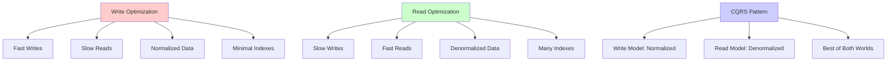
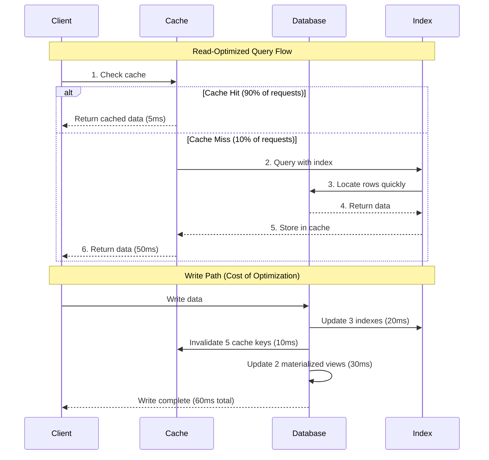
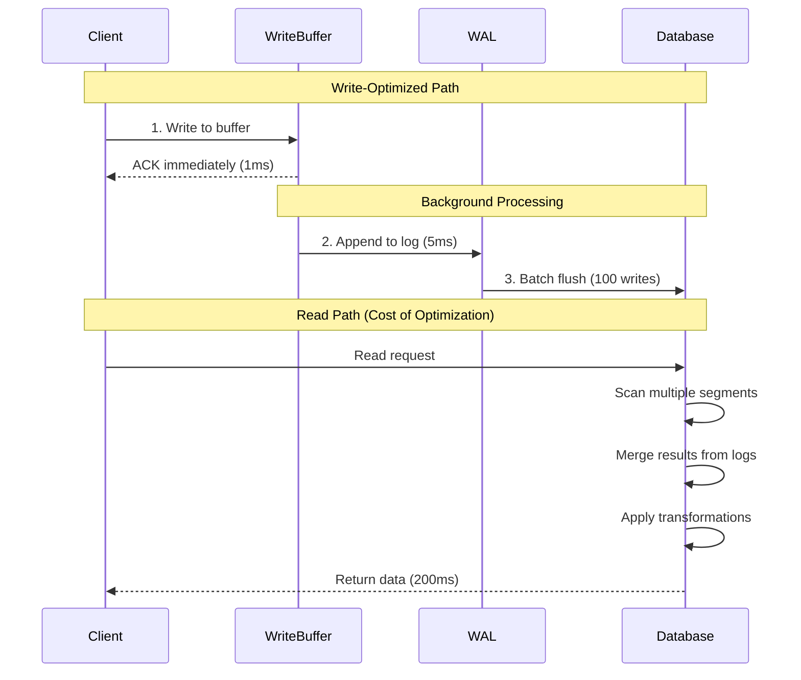
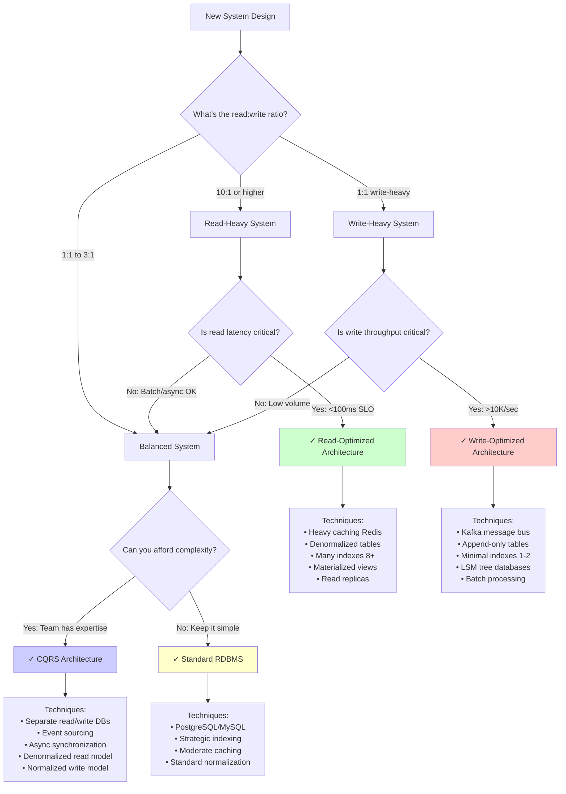

#system-design #trade-off

# Read vs Write Optimization

## Intuition (30 sec)

Think of a library. You can either:
- **Organize for readers** (books sorted by topic, author cards, multiple copies of popular books in different sections) - takes time to shelve books but readers find them instantly
- **Organize for writers** (books in a single append-only pile by arrival date) - super fast to add new books, but readers must search through everything

Most systems serve far more readers than writers (90%+ reads), so we optimize for reading by default. The trade-off is deciding how much write performance you'll sacrifice to make reads faster.

---

## Failure-First Scenario

Your analytics dashboard loads in 5 seconds showing user activity graphs. Users complain it's too slow. You denormalize tables, add caching, and create materialized views. Dashboard now loads in 200ms.

Success! But six months later, your event ingestion pipeline starts failing. Write throughput dropped from 50K events/sec to 5K events/sec. Every write now updates 12 indexes, invalidates 8 cache keys, and triggers 4 materialized view refreshes. Your read optimization accidentally killed write performance.

The lesson: Every index you add, every cache you maintain, and every denormalized copy you create makes writes slower. You must understand the read/write ratio before optimizing.

---

## Working Knowledge (5 min)

### Core Concept - Definition First

**Read vs Write Optimization:**
- **Definition:** A fundamental trade-off where techniques that speed up data retrieval (reads) typically slow down data insertion/modification (writes), and vice versa
- **Purpose:** To align system architecture with actual usage patterns (most systems are 90%+ reads)
- **How it works:** Read optimizations add redundancy (indexes, caches, denormalized copies) which must be maintained on every write. Write optimizations minimize redundancy but require more computation at read time.

**Key Terms:**
- **Read-Heavy System:** A system where read operations vastly outnumber write operations (typically 10:1 or higher ratio)
- **Write-Heavy System:** A system where writes occur at similar or higher frequency than reads (1:1 or higher write ratio)
- **Write Amplification:** The phenomenon where writing 1 byte of data causes multiple bytes to be written (to indexes, replicas, logs, etc.)
- **Denormalization:** Storing duplicate data in multiple places to avoid expensive JOIN operations at read time
- **Materialized View:** A pre-computed query result stored as a table, trading storage and write cost for fast reads

### Visual Model



### Comparison Table

| Read-Optimized | Balanced | Write-Optimized |
|----------------|----------|-----------------|
| **Pattern:** Denormalized, heavily cached | **Pattern:** Normalized with strategic indexes | **Pattern:** Append-only, minimal indexes |
| **Read:** <10ms (cache hit) | **Read:** 50-200ms (indexed queries) | **Read:** 500ms+ (full scans) |
| **Write:** 100-500ms (many updates) | **Write:** 10-50ms (moderate indexes) | **Write:** <5ms (simple append) |
| **Use When:** User-facing dashboards, product catalogs | **Use When:** Typical CRUD apps | **Use When:** Event logging, sensor data, audit trails |

---

## Layer 1: Conceptual Precision (15 min)

### Read Optimization - Deep Definitions

**Read Optimization:**
- **Formal Definition:** A set of techniques that pre-compute, duplicate, or index data to minimize computation and I/O required during read operations, at the cost of increased storage, memory, and write latency
- **Simple Definition:** Making reads fast by doing more work when you write data and storing multiple copies of it
- **Analogy:** Like having a restaurant menu in 5 languages. Translating once (write cost) so every customer reads in their native language instantly (read benefit)
- **Related Terms:**
  - **Caching:** Storing results in fast memory (differs in being temporary)
  - **Indexing:** Creating lookup structures (differs in not duplicating full data)
  - **Replication:** Copying to multiple servers (differs in purpose being availability)

**Why this matters:**
99% of user interactions are reads (loading pages, viewing data, searching). A slow read affects every user immediately. A slow write (like posting a comment) affects one user briefly. Optimizing for the common case (reads) delivers better overall user experience, even though it makes the uncommon case (writes) slower.

### Read Optimization Techniques (Visual Flow)



**Step-by-step breakdown:**

1. **Cache Check:** Client first checks in-memory cache (Redis/Memcached). Definition: A temporary storage layer holding recently accessed data for 5-10ms access time vs 50-100ms database access
2. **Index Lookup:** On cache miss, database uses index to locate data without scanning full table. Definition: A data structure (B-tree) that maps keys to disk locations for O(log n) vs O(n) lookup
3. **Write Amplification:** Single write updates original data plus all indexes, caches, and materialized views. Definition: The multiplier effect where 1KB write becomes 5KB of actual disk writes

### Write Optimization Techniques

**Write Optimization:**
- **Formal Definition:** Architecture patterns that minimize the number of storage operations, index updates, and data transformations required per write operation, typically by deferring computation until read time
- **Simple Definition:** Making writes fast by doing less work immediately and storing data in simple, append-only formats
- **Analogy:** Like throwing mail in a pile when it arrives (fast) vs immediately filing each letter in alphabetized folders (slow)
- **Related Terms:**
  - **Normalized Data:** Storing each fact once (differs from denormalization)
  - **Append-Only Log:** Writing sequentially without updates (differs from in-place updates)
  - **Eventual Consistency:** Accepting temporary staleness (differs from strong consistency)



**Write Optimization Components:**
- **Write Buffer:** In-memory structure accepting writes instantly before persisting
- **Write-Ahead Log (WAL):** Append-only log providing durability with sequential writes
- **Batch Processing:** Grouping many writes into single disk operation
- **LSM Trees:** Log-Structured Merge Trees optimized for write throughput

### Architecture Pattern (With Definitions)

```
READ-OPTIMIZED ARCHITECTURE
════════════════════════════════════════════════════════════

┌─────────────────────────────────────────────────────────┐
│                    Application Layer                    │
│                                                          │
│  Definition: Handles user requests                      │
│  Role: Routes reads to cache, writes to database        │
└───────────────┬──────────────────────┬──────────────────┘
                │                       │
        ┌───────▼────────┐      ┌──────▼──────────┐
        │  Cache Layer   │      │  Database       │
        │   (Redis)      │      │  (PostgreSQL)   │
        │                │      │                 │
        │  TTL: 5 min    │◄─────┤  Write updates  │
        │  Hit: 95%      │      │  3 indexes      │
        │  Latency: 5ms  │      │  2 mat views    │
        └────────────────┘      │  Latency: 50ms  │
                                 └─────────────────┘

WRITE-OPTIMIZED ARCHITECTURE
════════════════════════════════════════════════════════════

┌─────────────────────────────────────────────────────────┐
│                    Application Layer                    │
│                                                          │
│  Definition: Handles user requests                      │
│  Role: Writes to buffer, reads from database            │
└───────────────┬──────────────────────┬──────────────────┘
                │                       │
        ┌───────▼────────┐      ┌──────▼──────────┐
        │  Write Buffer  │      │  Database       │
        │   (Kafka)      │      │  (Cassandra)    │
        │                │      │                 │
        │  Batch: 100ms  │──────►  Append-only    │
        │  Throughput:   │      │  No indexes     │
        │  50K writes/s  │      │  LSM trees      │
        └────────────────┘      │  Write: 2ms     │
                                 │  Read: 200ms    │
                                 └─────────────────┘

CQRS ARCHITECTURE (BOTH WORLDS)
════════════════════════════════════════════════════════════

┌─────────────────────────────────────────────────────────┐
│                    Application Layer                    │
└───────────────┬──────────────────────┬──────────────────┘
                │                       │
        ┌───────▼────────┐      ┌──────▼──────────┐
        │  Command Side  │      │   Query Side    │
        │  (Write Model) │      │  (Read Model)   │
        │                │      │                 │
        │  Normalized    │      │  Denormalized   │
        │  Fast writes   │──────►  Fast reads     │
        │  PostgreSQL    │ Sync │  Redis + Views  │
        │  2ms writes    │      │  5ms reads      │
        └────────────────┘      └─────────────────┘
                 │
                 │ Event Stream
                 ▼
        ┌────────────────┐
        │  Event Bus     │
        │  (Kafka)       │
        │                │
        │  Decouples     │
        │  write/read    │
        └────────────────┘
```

**Component Definitions:**

**Read-Optimized Components:**
- **Cache Layer:** In-memory data store (Redis) holding frequently accessed data with TTL (Time To Live) expiration
- **Materialized Views:** Pre-computed query results stored as tables, updated on write
- **Indexes:** B-tree structures on frequently queried columns

**Write-Optimized Components:**
- **Write Buffer:** Message queue (Kafka) that accepts writes instantly and batches them
- **LSM Trees:** Log-Structured Merge Trees that convert random writes to sequential writes
- **Append-Only Log:** Write-Ahead Log (WAL) that never updates in place, only appends

**CQRS Components:**
- **Command Side:** Handles writes, uses normalized schema optimized for data integrity
- **Query Side:** Handles reads, uses denormalized schema optimized for query speed
- **Event Bus:** Asynchronous stream (Kafka) syncing write model changes to read model

### The Math/Logic (Explained)

**Write Amplification Formula:** `Total Writes = Original Write × Amplification Factor`

**Term Definitions:**
- **Original Write:** The size of data the application wants to persist (e.g., 1KB user record)
- **Amplification Factor:** Multiplier based on indexes, replicas, and logs (typically 3-10x)
- **Total Writes:** Actual bytes written to disk including all overhead

**Example calculation:**
```
Given: 1KB user profile update

Read-Optimized System:
• Original write: 1KB
• 3 indexes updated: 3 × 0.5KB = 1.5KB
• 2 materialized views: 2 × 1KB = 2KB
• Write-ahead log: 1KB
• Amplification Factor = (1 + 1.5 + 2 + 1) / 1 = 5.5x
• Total Writes = 1KB × 5.5 = 5.5KB

Write-Optimized System:
• Original write: 1KB
• Append to log: 1KB
• No indexes: 0KB
• Amplification Factor = 2x
• Total Writes = 1KB × 2 = 2KB

What this means: Read-optimized writes 2.75x more data per operation, but reads are 10x faster
```

**Read/Write Ratio Impact:**

```
System Load = (Read_Count × Read_Latency) + (Write_Count × Write_Latency)

Scenario 1: User Dashboard (Read-Heavy)
• Reads: 10,000/sec @ 5ms (cache) = 50,000ms
• Writes: 100/sec @ 50ms (indexes) = 5,000ms
• Total: 55,000ms
• Reads dominate: Optimize for reads!

Scenario 2: Event Logging (Write-Heavy)
• Reads: 100/sec @ 200ms (scan) = 20,000ms
• Writes: 10,000/sec @ 2ms (append) = 20,000ms
• Total: 40,000ms
• Writes equal reads: Optimize for writes!
```

### Trade-offs Matrix (With Definitions)

```
Read-Optimized                           Write-Optimized
════════════════════════════════════════════════════════════════════════
Definition: Architecture using           Definition: Architecture using
denormalization, caching, and            normalized data, minimal indexes,
indexing to minimize read latency        and append-only structures to
                                          maximize write throughput

Pros:                                    Pros:
• Fast reads (5-10ms cache hits)         • Fast writes (1-5ms appends)
  Reason: Data pre-computed              Reason: Sequential I/O only

• Low read latency (P99 < 50ms)          • High write throughput (50K/sec)
  Reason: No JOINs or computation        Reason: No index maintenance

• Predictable read performance           • Simple data model
  Reason: Cache hit rate is stable       Reason: Normalized = no duplication

Cons:                                    Cons:
• Slow writes (50-500ms)                 • Slow reads (100-500ms)
  Reason: Update many structures         Reason: Must JOIN/scan at read time

• Data duplication (3-10x storage)       • Complex read queries
  Reason: Multiple copies/indexes        Reason: No pre-computation

• Eventual consistency risk              • Read latency spikes
  Reason: Cache staleness                Reason: Compaction background process

• Cache invalidation complexity          • Limited query patterns
  Reason: Tracking dependencies          Reason: No indexes for ad-hoc queries

Use When:                                Use When:
• Read:write ratio > 10:1                • Write:read ratio > 1:1
  Example: Product catalogs              Example: Event logging

• User-facing applications               • Background analytics ingestion
  Reason: Latency affects UX             Reason: Throughput matters more

• Predictable query patterns             • Append-only workloads
  Reason: Can pre-compute                Reason: No updates/deletes

• Read latency SLO < 100ms               • Write throughput SLO > 10K/sec
  Example: E-commerce pages              Example: IoT sensor data
```

### Optimization Techniques Catalog

**Read Optimization Techniques:**

1. **Denormalization**
   - **Definition:** Storing redundant data to eliminate JOINs
   - **Example:** User info copied into each post record
   - **Cost:** Write amplification, storage increase
   - **Benefit:** Single-table reads (10ms vs 100ms JOINs)

2. **Caching Strategies**
   - **Cache-Aside:** App checks cache, loads on miss
   - **Write-Through:** App writes to cache and DB together
   - **Write-Behind:** App writes to cache, DB syncs async
   - **Definition:** Storing hot data in RAM (Redis) for <10ms access

3. **Materialized Views**
   - **Definition:** Pre-computed query results stored as tables
   - **Example:** Daily sales aggregates updated on each sale
   - **Cost:** Updated on every relevant write
   - **Benefit:** Complex aggregations return instantly

4. **Read Replicas**
   - **Definition:** Read-only database copies for load distribution
   - **Pattern:** Write to primary, read from replicas
   - **Cost:** Replication lag (100ms-5sec), storage duplication
   - **Benefit:** Horizontal read scaling

5. **Indexing Strategies**
   - **B-Tree Index:** For range queries (WHERE date > X)
   - **Hash Index:** For exact matches (WHERE id = 123)
   - **Composite Index:** For multi-column queries
   - **Covering Index:** Includes all queried columns (no table lookup)

**Write Optimization Techniques:**

1. **Write Buffering**
   - **Definition:** Accepting writes into memory queue before persistence
   - **Example:** Kafka buffering 100ms of writes before batch flush
   - **Cost:** Risk of data loss on crash (mitigated by replication)
   - **Benefit:** Converts random writes to sequential batches

2. **Append-Only Structures**
   - **Definition:** Never updating in-place, always appending new records
   - **Example:** Log file growing at end vs database updating middle
   - **Cost:** Requires compaction/garbage collection
   - **Benefit:** Sequential writes are 100x faster than random

3. **LSM Trees (Log-Structured Merge)**
   - **Definition:** Data structure writing to memory, flushing to immutable files
   - **Used in:** Cassandra, RocksDB, LevelDB
   - **Cost:** Read amplification (must check multiple files)
   - **Benefit:** Write throughput 10x higher than B-trees

4. **Batching/Bulk Inserts**
   - **Definition:** Grouping multiple writes into single transaction
   - **Example:** INSERT 1000 rows vs 1000 × INSERT 1 row
   - **Cost:** Higher latency per individual write
   - **Benefit:** 10-100x throughput improvement

5. **Minimal Indexing**
   - **Pattern:** Only index primary key and mandatory foreign keys
   - **Cost:** Full table scans on reads
   - **Benefit:** Minimal write amplification

---

## Layer 2: Technology-Specific Examples (20 min)

### Database Comparison (With Definitions)

**Database Category:** Optimization for read vs write workloads

| PostgreSQL (Balanced) | Redis (Read-Optimized) | Cassandra (Write-Optimized) |
|----------------------|------------------------|----------------------------|
| **Definition:** ACID relational database | **Definition:** In-memory key-value store | **Definition:** Distributed NoSQL with LSM trees |
| **Best For:** OLTP apps with mixed workload | **Best For:** Caching, sessions, real-time | **Best For:** Time-series, logs, sensors |
| **Read:** ⭐⭐⭐⭐ (50ms indexed) | **Read:** ⭐⭐⭐⭐⭐ (1ms RAM) | **Read:** ⭐⭐⭐ (100ms multi-file) |
| **Write:** ⭐⭐⭐ (10ms WAL) | **Write:** ⭐⭐⭐⭐ (5ms async) | **Write:** ⭐⭐⭐⭐⭐ (2ms append) |
| **Consistency:** Strong ACID | **Consistency:** Eventual (replication) | **Consistency:** Tunable (eventual to strong) |
| **Pattern:** B-tree indexes | **Pattern:** Hash tables in RAM | **Pattern:** LSM trees, memtable + SSTables |

### Read-Optimized Configuration (PostgreSQL)

```sql
-- Configuration for Read-Heavy Workload

-- 1. Aggressive Caching
-- Definition: shared_buffers holds frequently accessed pages in RAM
-- Impact: 50ms disk reads become 5ms RAM reads
ALTER SYSTEM SET shared_buffers = '8GB';  -- 25% of RAM

-- Definition: effective_cache_size hints optimizer about OS cache
-- Impact: Better query plans leveraging available memory
ALTER SYSTEM SET effective_cache_size = '24GB';  -- 75% of RAM

-- 2. Index Everything Important
-- Definition: Indexes speed up WHERE/JOIN clauses
-- Cost: Each index adds 20-50ms to INSERT/UPDATE

-- User lookup by email (login flows)
CREATE INDEX CONCURRENTLY idx_users_email ON users(email);

-- Posts by user (profile pages)
CREATE INDEX CONCURRENTLY idx_posts_user_id ON posts(user_id);

-- Posts with user data (feed queries) - covering index
CREATE INDEX CONCURRENTLY idx_posts_covering
  ON posts(user_id, created_at)
  INCLUDE (title, body);  -- No table lookup needed

-- 3. Denormalized Columns
-- Definition: Duplicate data to avoid JOINs
-- Example: Store username in posts table instead of JOINing users

ALTER TABLE posts ADD COLUMN username VARCHAR(50);

-- Update trigger keeps it in sync (write cost)
CREATE TRIGGER sync_username
  AFTER INSERT OR UPDATE ON posts
  FOR EACH ROW EXECUTE FUNCTION copy_username();

-- 4. Materialized Views
-- Definition: Pre-computed query results stored as tables
-- Cost: Must refresh on data changes

-- Dashboard: Top posts by engagement
CREATE MATERIALIZED VIEW top_posts AS
  SELECT
    p.id,
    p.title,
    COUNT(l.id) as likes,
    COUNT(c.id) as comments,
    (COUNT(l.id) + COUNT(c.id) * 2) as engagement_score
  FROM posts p
  LEFT JOIN likes l ON l.post_id = p.id
  LEFT JOIN comments c ON c.post_id = p.id
  GROUP BY p.id, p.title
  ORDER BY engagement_score DESC
  LIMIT 100;

-- Index the materialized view
CREATE INDEX idx_top_posts_score ON top_posts(engagement_score);

-- Refresh strategy (write cost)
-- Option A: Every write (slow but fresh)
CREATE TRIGGER refresh_top_posts_on_write
  AFTER INSERT ON likes
  FOR EACH STATEMENT
  EXECUTE FUNCTION refresh_materialized_view('top_posts');

-- Option B: Every 5 minutes (faster writes, stale reads)
SELECT cron.schedule('refresh-top-posts', '*/5 * * * *',
  'REFRESH MATERIALIZED VIEW CONCURRENTLY top_posts');
```

**Configuration Concepts:**
- **shared_buffers:** PostgreSQL's internal cache holding hot pages in memory
- **Covering Index:** Index containing all columns needed by query (no table lookup)
- **Materialized View:** Cached query result updated periodically or on-demand
- **CONCURRENTLY:** Index/refresh without locking table (slower but non-blocking)

### Write-Optimized Configuration (Cassandra)

```sql
-- Configuration for Write-Heavy Workload (CQL)

-- 1. Time-Series Table (Append-Only)
-- Definition: Partition by time bucket, no updates/deletes
-- Pattern: Optimized for LSM tree sequential writes

CREATE TABLE sensor_events (
    sensor_id UUID,
    bucket TEXT,          -- 'YYYY-MM-DD-HH' for hourly partitions
    timestamp TIMESTAMP,
    temperature DOUBLE,
    humidity DOUBLE,
    PRIMARY KEY ((sensor_id, bucket), timestamp)
) WITH CLUSTERING ORDER BY (timestamp DESC)
  AND compaction = {
    'class': 'TimeWindowCompactionStrategy',
    'compaction_window_unit': 'HOURS',
    'compaction_window_size': '1'
  };

-- Key Concepts:
-- • Partition key (sensor_id, bucket): Groups data on same node
-- • Clustering key (timestamp): Sorts within partition
-- • No secondary indexes: Would slow writes
-- • TimeWindowCompactionStrategy: Merges old time windows

-- 2. Write-Optimized Settings
-- Definition: Favor write throughput over read latency

-- Commitlog sync: Batch writes
-- Definition: Group writes to disk every 10sec vs per-write
-- Risk: 10sec of data loss on crash
-- Benefit: 10x write throughput
commitlog_sync: batch
commitlog_sync_batch_window_in_ms: 10000

-- Memtable size: Larger = fewer flushes
-- Definition: In-memory buffer before flushing to SSTable
-- Impact: Fewer disk writes, more memory usage
memtable_heap_space_in_mb: 2048

-- 3. Minimal Indexing
-- Definition: Only primary key indexed, no secondary indexes

-- AVOID: Secondary indexes slow writes
-- BAD (for write-heavy):
-- CREATE INDEX idx_temperature ON sensor_events(temperature);

-- GOOD: Query by partition key only
SELECT * FROM sensor_events
WHERE sensor_id = ? AND bucket = '2026-02-15-14';

-- 4. Batch Writes from Application
-- Definition: Group multiple inserts into single request
-- Benefit: Fewer network round-trips, batched commit

BEGIN BATCH
  INSERT INTO sensor_events (sensor_id, bucket, timestamp, temperature)
    VALUES (uuid1, '2026-02-15-14', '2026-02-15 14:32:01', 23.5);
  INSERT INTO sensor_events (sensor_id, bucket, timestamp, temperature)
    VALUES (uuid1, '2026-02-15-14', '2026-02-15 14:32:02', 23.6);
  -- ... 1000 more inserts
APPLY BATCH;

-- Single network call, single commitlog entry
```

**Write Optimization Patterns:**
- **Time Bucketing:** Partition by time window (hour/day) to limit partition size
- **Append-Only:** Never UPDATE or DELETE, only INSERT new versions
- **Batch Commitlog:** Trade durability for throughput (tune based on requirements)
- **No Secondary Indexes:** Avoid write amplification from index maintenance

---

## Layer 3: Production-Ready Details (30 min)

### Production Architecture: Read-Optimized E-Commerce

```
                              Internet
                                 │
                    ┌────────────▼────────────┐
                    │   CDN (CloudFront)      │
                    │                         │
                    │ Definition: Edge caches │
                    │ Purpose: Cache static   │
                    │ assets and API responses│
                    │ near users (10-50ms)    │
                    │                         │
                    │ Hit Rate: 85%           │
                    │ Cache: 1 hour for pages │
                    │        1 day for assets │
                    └────────────┬────────────┘
                                 │
                    ┌────────────▼────────────┐
                    │   Load Balancer (ALB)   │
                    │                         │
                    │ Definition: Distributes │
                    │ requests across servers │
                    │ Purpose: Horizontal     │
                    │ scaling + health checks │
                    └────────────┬────────────┘
                                 │
                ┌────────────────┼────────────────┐
                │                │                │
           ┌────▼───┐       ┌───▼───┐       ┌───▼───┐
           │ App    │       │ App   │       │ App   │
           │Server 1│       │Server2│       │Server3│
           │        │       │       │       │       │
           │ Role:  │       │ Role: │       │ Role: │
           │ Handle │       │ Handle│       │ Handle│
           │ API    │       │ API   │       │ API   │
           │requests│       │reqs   │       │reqs   │
           └───┬────┘       └───┬───┘       └───┬───┘
               │                │                │
               └────────────────┼────────────────┘
                                │
                     ┌──────────▼────────────┐
                     │   Redis Cluster       │
                     │   (Cache Layer)       │
                     │                       │
                     │ Definition: In-memory │
                     │ cache for hot data    │
                     │                       │
                     │ Contents:             │
                     │ • Product catalog     │
                     │ • User sessions       │
                     │ • Cart data           │
                     │ • Search results      │
                     │                       │
                     │ TTL: 5-60 min         │
                     │ Hit Rate: 95%         │
                     │ Latency: 1-5ms        │
                     │                       │
                     │ Eviction: LRU         │
                     │ Max Memory: 64GB      │
                     └──────────┬────────────┘
                                │
                                │ On cache miss
                                ▼
                     ┌──────────────────────┐
                     │  PostgreSQL Primary  │
                     │  (Write + Read)      │
                     │                      │
                     │ Indexes:             │
                     │ • products(id)       │
                     │ • products(category) │
                     │ • products(sku)      │
                     │ • orders(user_id)    │
                     │ • 8 total indexes    │
                     │                      │
                     │ Materialized Views:  │
                     │ • top_products       │
                     │ • category_stats     │
                     │                      │
                     │ Write: 50ms          │
                     │ Read: 20ms (indexed) │
                     └──────────┬───────────┘
                                │ Replication
                     ┌──────────┼───────────┐
                     │          │           │
                ┌────▼───┐ ┌───▼────┐ ┌───▼────┐
                │Replica1│ │Replica2│ │Replica3│
                │        │ │        │ │        │
                │ Read   │ │ Read   │ │ Read   │
                │ Only   │ │ Only   │ │ Only   │
                │        │ │        │ │        │
                │Analytics│ │Reports │ │Backups │
                └────────┘ └────────┘ └────────┘
```

**Architecture Component Definitions:**

- **CDN (Content Delivery Network):** Distributed cache servers at edge locations serving cached content with <50ms latency (vs 200ms from origin)
- **Redis Cluster:** Distributed in-memory cache with 1-5ms latency, 95% hit rate reducing database load by 20x
- **PostgreSQL Primary:** ACID database handling all writes and cache-miss reads with 8 indexes and 2 materialized views
- **Read Replicas:** Async copies of primary database (1-5 sec lag) serving analytics/reporting queries without impacting production

**Read Optimization Techniques Applied:**
1. **Three-tier caching:** CDN → Redis → Database (hit rate 85% → 95% → 100%)
2. **Denormalized product data:** Category name stored in products table (no JOIN needed)
3. **Materialized view:** top_products refreshed every 5 minutes for homepage
4. **Covering indexes:** Include frequently queried columns to avoid table lookups

### Production Architecture: Write-Optimized Event Logging

```
                        Application Servers
                                 │
                    ┌────────────┼────────────┐
                    │            │            │
               ┌────▼───┐   ┌───▼────┐  ┌───▼────┐
               │Producer│   │Producer│  │Producer│
               │        │   │        │  │        │
               │ Logs:  │   │ Logs:  │  │ Logs:  │
               │ • User │   │ • API  │  │ • Error│
               │ events │   │ calls  │  │ logs   │
               └───┬────┘   └───┬────┘  └───┬────┘
                   │            │            │
                   └────────────┼────────────┘
                                │
                     ┌──────────▼────────────┐
                     │   Kafka Cluster       │
                     │   (Event Stream)      │
                     │                       │
                     │ Definition: Distributed│
                     │ commit log for events │
                     │                       │
                     │ Throughput: 100K/sec  │
                     │ Latency: 2ms (ack)    │
                     │ Retention: 7 days     │
                     │                       │
                     │ Partitions: 12        │
                     │ Replication: 3x       │
                     │                       │
                     │ Producers batching:   │
                     │ • Buffer 100ms        │
                     │ • Compress (snappy)   │
                     │ • Batch 1000 messages │
                     └──────────┬────────────┘
                                │
                 ┌──────────────┼──────────────┐
                 │              │              │
            ┌────▼────┐    ┌───▼────┐    ┌───▼────┐
            │Consumer │    │Consumer│    │Consumer│
            │ Group 1 │    │ Group 2│    │ Group 3│
            │         │    │        │    │        │
            │Real-time│    │Batch   │    │Archive │
            │Analytics│    │Process │    │Storage │
            └────┬────┘    └───┬────┘    └───┬────┘
                 │             │             │
                 ▼             ▼             ▼
         ┌──────────┐  ┌─────────┐  ┌─────────────┐
         │ Druid    │  │ Spark   │  │ S3 + Parquet│
         │ OLAP DB  │  │ ETL Jobs│  │ Cold Storage│
         │          │  │         │  │             │
         │Real-time │  │Hourly   │  │Long-term    │
         │dashboards│  │aggreg.  │  │compliance   │
         └──────────┘  └─────────┘  └─────────────┘
                                             │
                                             ▼
                                    ┌─────────────────┐
                                    │  Cassandra      │
                                    │  (Event Store)  │
                                    │                 │
                                    │ Table Design:   │
                                    │ • Partitioned by│
                                    │   hour bucket   │
                                    │ • No indexes    │
                                    │ • Append-only   │
                                    │                 │
                                    │ Write: 2ms      │
                                    │ Throughput:     │
                                    │ 50K writes/sec  │
                                    │                 │
                                    │ TTL: 90 days    │
                                    │ Auto-delete old │
                                    └─────────────────┘
```

**Write Optimization Techniques Applied:**

1. **Kafka Buffering:**
   - Definition: Producers batch messages for 100ms before sending
   - Benefit: 1000 tiny writes become 1 large write (100x throughput)

2. **Append-Only Cassandra:**
   - Definition: LSM tree structure with memtable + SSTables
   - Pattern: No updates/deletes, only inserts (sequential writes)
   - Benefit: 50K writes/sec vs 5K with indexes

3. **Compression:**
   - Definition: Snappy compression reduces 1KB events to 200 bytes
   - Benefit: 5x less network I/O and storage

4. **Time-Bucketed Partitions:**
   - Definition: Partition key includes hour (sensor_id, '2026-02-15-14')
   - Benefit: Distributes writes across nodes, enables TTL cleanup

### Monitoring Metrics (With Definitions)

```
┌──────────────────────────────────────────────────────────┐
│  READ-OPTIMIZED SYSTEM DASHBOARD                         │
├──────────────────────────────────────────────────────────┤
│                                                           │
│ Cache Hit Rate: 94.7%                          [▓▓▓▓▓▓▓▓▓░]│
│ Definition: Percentage of reads served from cache         │
│ Why track: Each cache miss = 10x slower (5ms → 50ms)     │
│ Alert when: < 90% (indicates cache too small or bad TTL) │
│                                                           │
│ Read Latency P50: 8ms                         [▓▓░░░░░░░░]│
│ Read Latency P99: 45ms                        [▓▓▓▓▓▓▓░░░]│
│ Definition: 50%/99% of reads complete within this time    │
│ Target: P50 < 10ms (cache), P99 < 100ms (database)       │
│                                                           │
│ Write Latency P50: 35ms                       [▓▓▓▓▓▓░░░░]│
│ Write Latency P99: 120ms                      [▓▓▓▓▓▓▓▓▓▓]│
│ Definition: Time to persist data + update indexes/caches  │
│ Note: Higher than reads (expected for read-optimized)     │
│                                                           │
│ Database Connection Pool: 45/100 used         [▓▓▓▓▓░░░░░]│
│ Definition: Active database connections from app servers  │
│ Alert when: > 80% (need to scale)                        │
│                                                           │
│ Materialized View Freshness: 2 min            [▓▓░░░░░░░░]│
│ Definition: Age of cached materialized view data          │
│ Refresh interval: 5 min (acceptable staleness)            │
│                                                           │
├──────────────────────────────────────────────────────────┤
│  WRITE-OPTIMIZED SYSTEM DASHBOARD                        │
├──────────────────────────────────────────────────────────┤
│                                                           │
│ Write Throughput: 47,234 events/sec           [▓▓▓▓▓▓▓▓▓▓]│
│ Definition: Number of events successfully written         │
│ Why track: Primary metric for write-heavy systems         │
│ Target: > 50K/sec (system capacity)                      │
│                                                           │
│ Write Latency P99: 8ms                        [▓▓░░░░░░░░]│
│ Definition: Time from producer send to Kafka ack          │
│ Note: Much lower than read-optimized (no indexes)         │
│ Target: < 10ms                                           │
│                                                           │
│ Kafka Consumer Lag: 1,247 messages            [▓▓░░░░░░░░]│
│ Definition: Unprocessed messages in queue                 │
│ Alert when: > 10K (consumers falling behind)             │
│                                                           │
│ Cassandra Compaction: 3 pending tasks         [▓▓▓░░░░░░░]│
│ Definition: Background merging of LSM tree SSTables       │
│ Impact: Can cause temporary read slowdowns                │
│ Alert when: > 10 (falling behind on compaction)          │
│                                                           │
│ Write Amplification: 2.3x                     [▓▓▓░░░░░░░]│
│ Definition: Actual writes / logical writes                │
│ Calculation: (data + WAL + replication) / data           │
│ Note: Low amplification (append-only, no indexes)         │
│                                                           │
└──────────────────────────────────────────────────────────┘
```

**Critical Metrics by Pattern:**

**Read-Optimized:**
- **Cache Hit Rate:** Most important metric (goal: >90%)
- **Read Latency P99:** User-facing SLO (goal: <100ms)
- **Write Latency P99:** Expected to be higher (acceptable if <500ms)

**Write-Optimized:**
- **Write Throughput:** Primary metric (goal: meet peak load)
- **Consumer Lag:** Indicates if downstream can keep up
- **Write Amplification:** Monitor for unexpected increases

### Decision Framework: Read vs Write Optimization



### Troubleshooting Flow: Performance Issues

```mermaid
flowchart TD
    Problem[Performance Issue Reported] --> Type{What's slow?}

    Type -->|Reads slow| ReadIssue[Read Performance Problem]
    Type -->|Writes slow| WriteIssue[Write Performance Problem]

    ReadIssue --> RCheck1{Check: Cache Hit Rate}
    RCheck1 -->|< 80%| RFix1[Diagnose Cache Misses:<br/>Definition: Cache hit rate is %<br/>of reads served from cache<br/><br/>Actions:<br/>• Increase cache size<br/>• Increase TTL<br/>• Warm cache on deploy<br/>• Check cache key design]

    RCheck1 -->|> 90%| RCheck2{Check: Database Slow Query Log}
    RCheck2 -->|Queries > 100ms| RFix2[Diagnose Slow Queries:<br/>Definition: Queries taking >100ms<br/><br/>Actions:<br/>• EXPLAIN ANALYZE query<br/>• Add missing indexes<br/>• Denormalize hot tables<br/>• Create materialized view]

    RCheck2 -->|Queries fast| RCheck3{Check: Connection Pool}
    RCheck3 -->|Pool exhausted| RFix3[Connection Pool Saturated:<br/>Definition: All DB connections in use<br/><br/>Actions:<br/>• Increase pool size<br/>• Add read replicas<br/>• Reduce query frequency<br/>• Cache more aggressively]

    WriteIssue --> WCheck1{Check: Write Amplification}
    WCheck1 -->|> 5x| WFix1[Excessive Write Amplification:<br/>Definition: 1KB write causes >5KB<br/>actual writes indexes/logs<br/><br/>Actions:<br/>• Remove unused indexes<br/>• Reduce materialized views<br/>• Batch cache invalidations<br/>• Consider CQRS pattern]

    WCheck1 -->|< 5x| WCheck2{Check: Lock Contention}
    WCheck2 -->|High lock waits| WFix2[Database Lock Contention:<br/>Definition: Writes waiting for locks<br/><br/>Actions:<br/>• Reduce transaction scope<br/>• Use optimistic locking<br/>• Partition hot tables<br/>• Consider NoSQL for writes]

    WCheck2 -->|Low contention| WCheck3{Check: Disk I/O}
    WCheck3 -->|High latency| WFix3[Disk I/O Bottleneck:<br/>Definition: Storage can't keep up<br/><br/>Actions:<br/>• Upgrade to SSDs<br/>• Increase IOPS provisioned<br/>• Batch writes<br/>• Use write-ahead log]

    style RFix1 fill:#ffe6e6
    style RFix2 fill:#ffe6e6
    style RFix3 fill:#ffe6e6
    style WFix1 fill:#ffe6e6
    style WFix2 fill:#ffe6e6
    style WFix3 fill:#ffe6e6
```



### Capacity Planning (Definitions + Math)

**Capacity Planning:**
- **Definition:** Process of determining infrastructure resources needed to meet performance targets under expected load
- **Goal:** Right-size systems (not over-provisioned waste, not under-provisioned failures)

**Key Metrics:**
- **QPS (Queries Per Second):** Rate of incoming requests
- **Latency:** Time to process one request end-to-end
- **Concurrent Requests:** Number of requests being processed simultaneously
  - Formula: `Concurrent = QPS × Latency (in seconds)`
- **Throughput:** Maximum QPS a server can handle before degrading

**Read-Heavy System Sizing:**

```
E-Commerce Product Catalog

Given:
• Expected traffic: 10M page views/day
• Average read latency target: 50ms
• Peak traffic: 3x average
• Each page: 5 database queries

Step 1: Calculate average QPS
  Definition: QPS = requests per second
  10M requests ÷ 86,400 seconds = 116 QPS average

Step 2: Account for peak traffic
  Definition: Peak = highest traffic moment (typically 3-5x avg)
  Peak QPS = 116 × 3 = 348 QPS

Step 3: Calculate database query rate
  Definition: Some requests make multiple queries
  Query rate = 348 QPS × 5 queries = 1,740 queries/sec

Step 4: Calculate with cache hit rate
  Definition: Cache hit rate = % served from cache
  Cache hit rate target: 95%
  Database queries = 1,740 × 5% = 87 queries/sec to database
  Cache queries = 1,740 × 95% = 1,653 queries/sec to Redis

Step 5: Size Redis cluster
  Assumption: 1 Redis node handles 10K QPS
  Nodes needed = 1,653 ÷ 10,000 = 0.17 → 1 node
  With redundancy: 2 nodes (primary + replica)

  Memory sizing:
  • 1M products × 2KB each = 2GB product data
  • 10K sessions × 10KB each = 100MB session data
  • 20% overhead = 2.5GB total
  • Provision: 8GB (allows growth)

Step 6: Size database
  Assumption: PostgreSQL handles 1K QPS per server
  Servers needed = 87 ÷ 1,000 = 0.09 → 1 primary
  Add read replicas: 1 primary + 2 replicas = 3 servers

  Storage sizing:
  • 1M products × 10KB each = 10GB
  • 10M orders × 5KB each = 50GB
  • Indexes (8 indexes × 20% data size) = 12GB
  • Total: 72GB + 50% growth = 110GB

Step 7: Calculate cost of read optimization
  Write amplification: 5x (3 indexes, 1 mat view, 1 replica)
  Write traffic: 10K writes/day = 0.12 writes/sec
  Actual writes with amplification: 0.6 writes/sec

  Conclusion: Write overhead is negligible (<1 QPS)
              Read optimization is correct choice
```

**Write-Heavy System Sizing:**

```
IoT Sensor Data Ingestion

Given:
• 100,000 sensors
• Each sensor: 1 event per minute
• Event size: 500 bytes
• Retention: 90 days
• Read pattern: Batch analytics (not real-time)

Step 1: Calculate write throughput
  Definition: Events per second
  100,000 sensors × 1 event/min ÷ 60 sec = 1,667 writes/sec

Step 2: Calculate data volume
  Per day: 1,667 writes/sec × 86,400 sec × 500 bytes
         = 72 billion bytes = 72GB/day

  90 day retention: 72GB × 90 = 6.5TB total storage

Step 3: Size Kafka message bus
  Assumption: Kafka handles 100K writes/sec per broker
  Brokers needed = 1,667 ÷ 100,000 = 0.02 → 1 broker
  With replication (3x): 3 brokers

  Storage for 7-day buffer:
  72GB/day × 7 days = 504GB
  Per broker (3x replication): 504GB
  Provision: 1TB per broker

Step 4: Size Cassandra cluster
  Assumption: Cassandra handles 10K writes/sec per node
  Nodes needed = 1,667 ÷ 10,000 = 0.17 → 1 node
  With replication (3x): 3 nodes

  Storage per node:
  6.5TB ÷ 3 nodes = 2.2TB per node
  With compaction overhead (2x): 4.4TB
  Provision: 6TB per node

Step 5: Size for reads (batch analytics)
  Read pattern: Daily aggregation jobs
  Not real-time, so can tolerate 100-500ms latency

  Batch job: Scan 72GB once per day
  With Cassandra: 72GB ÷ 200MB/sec = 360 seconds
  Acceptable for batch workload

  Conclusion: Write-optimized architecture (append-only)
              No indexes needed (batch scans acceptable)
              Cost: $1,500/month vs $5,000 for read-optimized
```

---

## Real-World Examples

### Example 1: Twitter - Timeline Generation

**Problem Definition:**
Twitter needed to display personalized timelines for 300M users where each user follows 100-1,000 accounts. Naive approach: "SELECT tweets FROM users I follow ORDER BY time" takes 5-10 seconds with JOINs across 500M+ tweets.

**Solution Definition:**
Hybrid read/write optimization using "fanout-on-write" for most users and "fanout-on-read" for celebrities.

**Technical Terms Used:**
- **Fanout-on-Write:** When a user tweets, copy that tweet to all followers' timeline caches (write amplification but fast reads)
- **Fanout-on-Read:** For celebrity tweets (10M+ followers), don't fanout. Instead, merge celebrity tweets at read time
- **Timeline Cache:** Pre-computed list of tweets stored in Redis per user

**Before (Read-Optimized Only):**
```
User tweets (1 write)
  ↓
Fanout to ALL followers
  ↓
Lady Gaga tweets → Update 80M timelines
  ↓
Result: 80M writes = 30+ seconds
        System overloaded on celebrity tweets
```

**After (Hybrid Approach):**
```
Regular user tweets (< 10K followers)
  ↓
Fanout-on-Write: Copy to all followers' caches
  ↓
Write: 10K updates × 1ms = 10 seconds
Read: 5ms (cache hit)

Celebrity tweets (> 10K followers)
  ↓
Fanout-on-Read: Don't fanout, merge at read time
  ↓
Write: 1ms (just store tweet)
Read: 50ms (merge 50 celebrities into timeline)
```

**Results:**
- **Average Tweet Delivery:** Improved from 5-10sec to 50ms (100x faster)
- **Write Throughput:** Increased from 500 tweets/sec to 6,000 tweets/sec (12x improvement)
- **Timeline Load Time:** P99 latency dropped from 3sec to 200ms
- **Cache Hit Rate:** 98% of timeline requests served from Redis

**Key Insight:**
Pure read or write optimization fails. Twitter uses read-optimized for 99% of users (fanout-on-write) and write-optimized for 1% celebrities (fanout-on-read). This hybrid approach balances write cost with read speed.

---

### Example 2: Netflix - Viewing History

**Problem Definition:**
Netflix stores 200 billion viewing events (play, pause, seek, stop) from 200M users. Original MySQL design with normalized tables and indexes caused write bottlenecks at 100K events/sec, with P99 latency spiking to 5 seconds during peak hours.

**Solution Definition:**
Migrated to write-optimized architecture using Cassandra with time-bucketed partitions and EVCache (Memcached) for read optimization.

**Technical Terms Used:**
- **Time-Bucketed Partition:** Partition key includes date (user_id, YYYY-MM-DD) to distribute writes and enable TTL
- **EVCache:** Distributed memcached clusters providing <1ms read latency
- **Denormalized Events:** Each event contains full context (show title, episode, device) to avoid JOINs

**Before (Read-Optimized MySQL):**
```
┌──────────────────────────┐
│   MySQL (Primary)        │
│                          │
│  Tables:                 │
│  • viewing_events        │
│  • users (JOIN)          │
│  • shows (JOIN)          │
│  • devices (JOIN)        │
│                          │
│  Indexes: 12             │
│                          │
│  Write: 50-5000ms (P99)  │
│  Read: 20ms (indexed)    │
│                          │
│  Problem:                │
│  • Index maintenance     │
│  • Lock contention       │
│  • JOIN overhead         │
└──────────────────────────┘

Bottleneck: 100K events/sec → 5 sec write latency
```

**After (Write-Optimized Cassandra + Read Cache):**
```
Application
     │
     ├─► Write Path (Prioritized)
     │    ┌────────────────────────────┐
     │    │   Cassandra Cluster        │
     │    │                            │
     │    │  Table: viewing_events     │
     │    │  Key: (user, date, time)   │
     │    │  No secondary indexes      │
     │    │  TTL: 90 days              │
     │    │                            │
     │    │  Write: 2ms                │
     │    │  Throughput: 500K/sec      │
     │    └────────────────────────────┘
     │
     └─► Read Path (Cached)
          ┌────────────────────────────┐
          │   EVCache (Memcached)      │
          │                            │
          │  Cache:                    │
          │  • Last 50 events per user │
          │  • Aggregated stats        │
          │  • Continue watching list  │
          │                            │
          │  Hit Rate: 99%             │
          │  Read: <1ms                │
          │                            │
          │  On miss: Query Cassandra  │
          │  Cache result for 1 hour   │
          └────────────────────────────┘
```

**Schema Design:**
```sql
CREATE TABLE viewing_events (
    user_id UUID,
    date TEXT,              -- 'YYYY-MM-DD' partition key
    event_time TIMESTAMP,   -- Clustering key for sorting
    show_id UUID,
    show_title TEXT,        -- Denormalized (avoid JOIN)
    episode_title TEXT,     -- Denormalized
    device_type TEXT,       -- Denormalized
    action TEXT,            -- 'play', 'pause', 'seek', 'stop'
    position_seconds INT,
    PRIMARY KEY ((user_id, date), event_time)
) WITH CLUSTERING ORDER BY (event_time DESC)
  AND default_time_to_live = 7776000  -- 90 days
  AND compaction = {'class': 'TimeWindowCompactionStrategy'};
```

**Results:**
- **Write Latency P99:** Improved from 5,000ms to 3ms (1,666x faster)
- **Write Throughput:** Increased from 100K/sec to 500K/sec (5x improvement)
- **Read Latency P99:** <1ms for cached data, 50ms on cache miss (20x faster)
- **Cost Savings:** 60% reduction in database costs by using append-only storage
- **Scalability:** Linearly scalable by adding Cassandra nodes (10 nodes → 5M writes/sec)

**Key Insight:**
Viewing history is write-heavy (every user action logged) but reads are predictable (recent events only). Write-optimize storage with Cassandra, then read-optimize access patterns with aggressive caching. The combination handles massive scale cheaply.

---

### Example 3: Stripe - Payment Transaction Analytics

**Problem Definition:**
Stripe processes 100M+ payment transactions per day. Merchants need real-time dashboards showing revenue, top customers, and transaction trends. Single database can't handle both high-velocity writes (transactions) and complex analytical queries (dashboards) without impacting payment processing latency.

**Solution Definition:**
CQRS architecture separating write model (transactional ACID database) from read model (analytical column store).

**Technical Terms Used:**
- **CQRS (Command Query Responsibility Segregation):** Pattern using separate models for writes and reads
- **Event Sourcing:** Storing all changes as immutable events, then projecting into read models
- **Column Store:** Database optimized for analytical queries (Redshift, BigQuery)
- **Change Data Capture (CDC):** Streaming database changes to read model in real-time

**Architecture:**
```
┌──────────────────────────────────────────────────────────┐
│                    Stripe API                            │
└───────────┬─────────────────────────┬────────────────────┘
            │                         │
    ┌───────▼───────┐        ┌────────▼──────────┐
    │ Write Model   │        │   Read Model       │
    │ (Commands)    │        │   (Queries)        │
    │               │        │                    │
    │ PostgreSQL    │        │  Redshift          │
    │ (ACID)        │        │  (Column Store)    │
    │               │        │                    │
    │ Normalized:   │        │  Denormalized:     │
    │ • transactions│        │  • daily_revenue   │
    │ • customers   │        │  • customer_stats  │
    │ • accounts    │        │  • transaction_agg │
    │               │        │                    │
    │ Indexes: 3    │        │  Indexes: 20+      │
    │ (Primary keys)│        │  (Analytics)       │
    │               │        │                    │
    │ Write: 10ms   │        │  Write: N/A        │
    │ Read: 50ms    │        │  Read: 2-10sec     │
    │ Normalized    │        │  (Complex agg)     │
    └───────┬───────┘        └────────▲───────────┘
            │                         │
            │                         │
            │   ┌─────────────────┐   │
            └───►   Event Stream  ├───┘
                │   (Kafka)       │
                │                 │
                │  Events:        │
                │  • TransCreated │
                │  • PaymentDone  │
                │  • RefundIssued │
                │                 │
                │  Consumers:     │
                │  • CDC → Redshift
                │  • Fraud system │
                │  • Notifications│
                └─────────────────┘
```

**Write Model (Transactional):**
```sql
-- PostgreSQL: Optimized for ACID transactions
CREATE TABLE transactions (
    id UUID PRIMARY KEY,
    customer_id UUID REFERENCES customers(id),
    amount INTEGER,           -- Cents
    currency CHAR(3),
    status VARCHAR(20),
    created_at TIMESTAMP
);

-- Minimal indexes for transactions only
CREATE INDEX idx_trans_customer ON transactions(customer_id);
CREATE INDEX idx_trans_created ON transactions(created_at);

-- Write path: 10ms for ACID transaction
```

**Read Model (Analytical):**
```sql
-- Redshift: Optimized for analytical queries
CREATE TABLE daily_revenue (
    date DATE,
    currency CHAR(3),
    customer_id UUID,
    customer_name VARCHAR(255),    -- Denormalized
    country_code CHAR(2),          -- Denormalized
    transaction_count INTEGER,
    total_amount BIGINT,
    refund_amount BIGINT,
    net_revenue BIGINT,
    PRIMARY KEY (date, currency, customer_id)
)
DISTKEY(date)                      -- Distribute by date
SORTKEY(date, total_amount);       -- Sort for range queries

-- 20+ indexes on various dimensions
CREATE INDEX idx_revenue_country ON daily_revenue(country_code);
CREATE INDEX idx_revenue_customer ON daily_revenue(customer_name);
-- ... more indexes

-- Complex analytical query: 2-5 seconds
SELECT
    country_code,
    SUM(net_revenue) as revenue,
    COUNT(DISTINCT customer_id) as customers
FROM daily_revenue
WHERE date >= CURRENT_DATE - INTERVAL '30 days'
GROUP BY country_code
ORDER BY revenue DESC
LIMIT 10;
```

**Synchronization via Kafka:**
```python
# CDC Consumer: PostgreSQL → Kafka → Redshift
def process_transaction_event(event):
    if event.type == 'TransactionCreated':
        # Update denormalized aggregate tables
        update_daily_revenue(
            date=event.created_at.date(),
            customer_id=event.customer_id,
            customer_name=fetch_customer_name(event.customer_id),  # Denormalize
            amount=event.amount,
            currency=event.currency
        )

        update_customer_stats(
            customer_id=event.customer_id,
            transaction_count=+1,
            lifetime_value=+event.amount
        )
```

**Results:**
- **Payment Processing (Writes):** Maintained <10ms P99 latency (ACID guarantees preserved)
- **Dashboard Queries (Reads):** Complex analytics in 2-5sec (vs 30-60sec before)
- **Write Throughput:** 10K transactions/sec without impacting read queries
- **Read Queries:** 500 concurrent dashboard users without impacting writes
- **Data Freshness:** 5-10 second lag from write to read model (acceptable for dashboards)

**Key Insight:**
CQRS allows optimizing each side independently. Write model stays normalized for ACID integrity. Read model is heavily denormalized for query speed. Event stream decouples the two, allowing different technologies (PostgreSQL for writes, Redshift for reads) and different consistency models (strong consistency for writes, eventual consistency for reads).

---

## Interview Preparation

### Concept Glossary

Quick reference definitions for interview:

- **Read-Heavy System:** System where read operations outnumber writes by 10:1 or more (e.g., news sites, product catalogs)
- **Write-Heavy System:** System where writes occur at similar or higher rate than reads (e.g., logging, sensor data, audit trails)
- **Denormalization:** Storing duplicate data to eliminate JOINs and speed up reads at the cost of write complexity
- **Materialized View:** Pre-computed query result stored as a table, trading write cost for instant reads
- **Write Amplification:** Multiplier effect where 1 byte written causes N bytes of actual writes (indexes, logs, replicas)
- **LSM Tree:** Log-Structured Merge Tree optimized for write throughput via append-only memtable + sorted SSTables
- **CQRS:** Command Query Responsibility Segregation - using separate models for writes (normalized) and reads (denormalized)
- **Fanout-on-Write:** Copying data to all consumers at write time (high write cost, fast reads)
- **Fanout-on-Read:** Computing results at read time by merging sources (low write cost, slower reads)
- **Cache Hit Rate:** Percentage of reads served from cache vs database (goal: >90%)
- **Time-Bucketed Partition:** Partition key including time component (hour/day) to distribute load and enable TTL

### Question Template: "How would you design a system for [scenario]?"

**Q: Design a system for storing and displaying user activity feeds (like Facebook/Twitter timeline)**

**Answer Structure:**

1. **Define & Clarify (10-15 sec):**
   "An activity feed is a personalized stream of recent posts from users you follow. First, I need to clarify: What's the scale? How many users and posts per second? What's the read/write ratio?"

   *Interviewer provides: 100M users, 10K posts/sec, users read feed 10x more than posting*

2. **State Pattern Match (10 sec):**
   "This is a read-heavy system with a 10:1 read:write ratio, so I'll optimize for fast reads using denormalization and caching, accepting slower writes."

3. **Explain Architecture (45-60 sec):**
   ```
   "I'll use a hybrid fanout approach:

   For regular users (<10K followers):
   • Fanout-on-write: When user posts, copy to all followers' feed cache (Redis)
   • Write cost: 1 post → 1K cache updates (100ms)
   • Read benefit: Feed loads in 5ms from cache

   For celebrities (>10K followers):
   • Fanout-on-read: Don't fanout, merge at read time
   • Write cost: 1 post → 1 DB write (1ms)
   • Read cost: Merge 20 celebrities into feed (50ms)

   Components:
   • Redis: Timeline cache per user (last 100 posts)
   • PostgreSQL: Post storage with indexes on (user_id, created_at)
   • Kafka: Event stream to decouple post creation from fanout workers

   Read path: Check Redis (95% hit) → fallback to DB query
   Write path: Store in DB → Publish to Kafka → Workers fanout to Redis
   ```

4. **State Trade-offs (15-20 sec):**
   "Pro: Reads are 5-50ms (cache hit), excellent user experience
    Con: Writes are 100ms for fanout, but users tolerate this delay
    Alternative: Pure fanout-on-read would be 1ms writes but 500ms reads (bad UX)"

5. **Mention Scale Considerations (10 sec):**
   "This scales horizontally: Add Redis clusters by user ID sharding. Add Kafka partitions for write throughput. Add read replicas for DB queries on cache miss."

---

### Question Template: "When would you optimize for reads vs writes?"

**Answer Structure:**

1. **Define (5-10 sec):**
   "Read optimization uses techniques like caching, indexing, and denormalization to make reads fast, but these slow down writes. Write optimization uses append-only structures and minimal indexes for fast writes, but reads become slower."

2. **State Decision Framework (20-30 sec):**
   ```
   Optimize for reads when:
   • Read:write ratio > 10:1
   • User-facing applications where latency affects UX
   • Query patterns are predictable (can pre-compute)
   • Example: E-commerce product catalog

   Optimize for writes when:
   • Write:read ratio > 1:1
   • High-throughput ingestion (logging, sensors, events)
   • Reads are batch/analytical (not latency-sensitive)
   • Example: Application logging, IoT data collection

   Use CQRS when:
   • Both reads and writes are critical
   • Team can handle operational complexity
   • Example: Payment systems needing ACID writes + fast analytics
   ```

3. **Give Concrete Example (20-30 sec):**
   "For example, Twitter timelines are read-heavy (users scroll feeds 100x more than posting). They optimize reads by fanout-on-write: copying each tweet to followers' Redis caches. This makes reads instant (5ms cache hit) but writes take 100ms. That's acceptable because users read far more than they write."

4. **Mention Trade-off (10 sec):**
   "The key trade-off is write amplification: Each read optimization (index, cache, materialized view) adds 1-2x write overhead. In read-heavy systems, this is worth it because reads dominate."

---

## Quick Reference

### Glossary

| Term | Definition | When You'll See It |
|------|------------|-------------------|
| **Read-Heavy** | System with read:write ratio >10:1 | E-commerce, social feeds, news sites |
| **Write-Heavy** | System with write:read ratio >1:1 | Logging, sensors, event streams |
| **Denormalization** | Duplicate data to avoid JOINs | Optimizing read performance |
| **Materialized View** | Pre-computed query stored as table | Dashboard aggregations |
| **Write Amplification** | 1 write → N actual disk writes | Measuring cost of indexes/caches |
| **LSM Tree** | Log-Structured Merge Tree | Write-optimized databases (Cassandra) |
| **CQRS** | Separate read and write models | Systems needing both fast reads and writes |
| **Fanout-on-Write** | Copy data to consumers on write | Social feeds (fast reads) |
| **Fanout-on-Read** | Merge data on read | Celebrity posts (fast writes) |
| **Cache Hit Rate** | % reads served from cache | Measuring cache effectiveness (goal: >90%) |
| **Time Bucketing** | Partition by hour/day | Write-heavy time-series data |
| **Append-Only** | Never update in-place | Write-optimized storage (logs) |

### Decision Cheat Sheet

```
IF read:write ratio > 10:1 AND user-facing latency matters
  THEN read-optimize: Cache (Redis) + indexes + denormalization
  REASON: Reads dominate, users notice slow reads immediately

IF write:read ratio > 1:1 AND throughput > 10K/sec
  THEN write-optimize: Append-only (LSM) + minimal indexes + batching
  REASON: Write throughput is bottleneck, reads are batch/async

IF reads AND writes both critical AND budget allows complexity
  THEN CQRS: Separate models + event sourcing + async sync
  REASON: Can optimize each side independently

IF dealing with celebrity/influencer content
  THEN hybrid fanout: Fanout-on-write for most, fanout-on-read for top 1%
  REASON: Avoid write amplification on high-follower accounts

IF cache hit rate < 90%
  THEN investigate: Increase cache size, tune TTL, warm cache, or rethink cache keys
  REASON: Cache should handle 90%+ of reads for read-optimized systems

IF write amplification > 10x
  THEN remove unused indexes, reduce materialized views, or consider CQRS
  REASON: High amplification indicates over-optimization for reads

IF data is time-series (events, logs, sensors)
  THEN time-bucketed partitions + TTL + append-only
  REASON: Natural fit for LSM trees, enables cheap storage with auto-expiration
```

---

## Links

- [[03_design_patterns/cqrs]] — Pattern that bridges read/write optimization using separate models
- [[03_design_patterns/database_indexing]] — Read optimization technique that costs write performance
- [[05_components/caching_strategies]] — Critical read optimization using Redis/Memcached
- [[05_components/message_queues]] — Kafka for write buffering and async processing
- [[04_databases/nosql_databases]] — Cassandra/DynamoDB for write-optimized workloads
- [[04_databases/sql_databases]] — PostgreSQL/MySQL for balanced or read-optimized workloads
- [[06_trade_offs/consistency_vs_availability]] — Related trade-off affecting read/write patterns

---

## Key Takeaways

1. **Default to read optimization:** 90%+ of systems are read-heavy, so optimize for the common case
2. **Write amplification is the cost:** Each index, cache, and materialized view adds 1-2x write overhead
3. **Measure first:** Instrument your system to know actual read/write ratio before optimizing
4. **CQRS for both:** When both reads and writes are critical, separate them with event sourcing
5. **Hybrid approaches work:** Twitter's fanout strategy shows you don't need pure solutions
6. **Cache hit rate is king:** For read-optimized systems, >90% cache hit rate is the target metric
7. **Append-only for writes:** LSM trees and append-only logs are 10-100x faster for writes than B-trees
8. **Denormalize carefully:** Duplicate data strategically for hot queries, not everything
