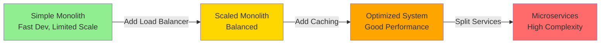
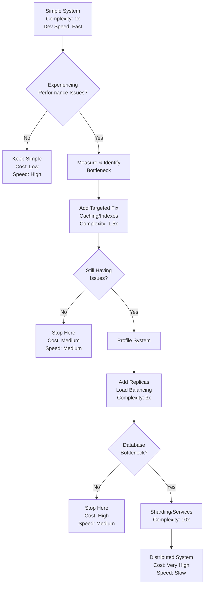
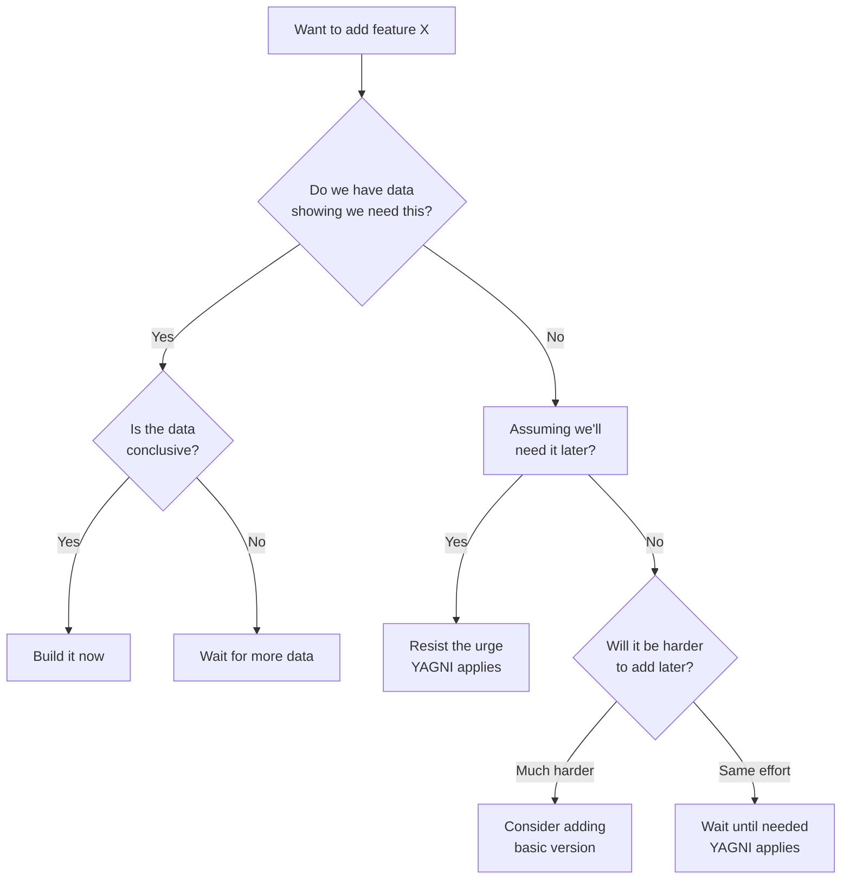
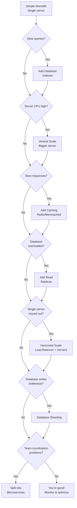

#system-design #trade-off

# Simplicity vs Scalability

## Intuition (30 sec)

Building a system is like building a house. You can start with a small, simple cabin that's quick to build and easy to maintain. Or you can plan for a mansion with separate wings, elevators, and complex plumbing. The cabin works perfectly for 1-2 people. The mansion can handle 50 guests but takes years to build and costs millions to maintain. Most people start with the cabin and add rooms only when they need them.

---

## Failure-First Scenario

**Company:** Startup builds microservices architecture on day one
**Problem:** 3 engineers spend 8 months building authentication service, user service, payment service, notification service, and API gateway. By launch, the codebase has 15 repositories, 8 databases, and a deployment pipeline that takes 2 hours.
**Reality:** They have 47 users. The entire system could run on a single $5/month server.
**Cost:** Burned $400K in funding and 8 months. Competitors with simple monoliths shipped in 6 weeks and captured the market.
**Lesson:** The complexity killed them before scalability mattered.

---

## Working Knowledge (5 min)

### Core Concepts - Definitions First

**Simplicity:**
- **Definition:** A system architecture where all components run in a single codebase with minimal external dependencies
- **Purpose:** Maximizes development speed and ease of debugging when user scale is unknown
- **How it works:** One application handles all requests, uses one database, deploys as one unit

**Scalability:**
- **Definition:** A system's ability to handle increasing load by adding resources (servers, databases, services)
- **Purpose:** Ensures performance remains acceptable as users and traffic grow beyond single-server capacity
- **How it works:** Distributes work across multiple machines through horizontal scaling, caching, and service separation

**Key Terms:**
- **Monolith:** Single unified application containing all business logic, deployed as one unit
- **Microservices:** Architecture pattern where application is split into independent services that communicate via APIs
- **Technical Debt:** The implied cost of additional rework caused by choosing an easy solution now instead of a better approach that would take longer
- **Premature Optimization:** Optimizing for scale before you have evidence you need it, wasting time and adding complexity
- **YAGNI Principle:** "You Aren't Gonna Need It" - don't add functionality until necessary

### The Complexity Curve



### Decision Matrix

| Factor | Choose Simplicity | Choose Scalability |
|--------|------------------|-------------------|
| **Team Size** | 1-10 engineers | 10+ engineers |
| **User Base** | < 10K users | 100K+ users |
| **Product Stage** | MVP, Pre-PMF | Proven product-market fit |
| **Requirements** | Changing weekly | Stable, well-understood |
| **Priority** | Speed to market | Reliability & performance |
| **Budget** | Limited runway | Funded for infrastructure |

---

## Layer 1: Conceptual Precision (15 min)

### Technical Debt - Deep Definition

**Technical Debt:**
- **Formal Definition:** The accumulation of suboptimal technical decisions that create future work, measured as the cost differential between current implementation and ideal implementation
- **Simple Definition:** Shortcuts you take now that you'll have to fix later, with interest
- **Analogy:** Like credit card debt - borrowing time now, paying back with interest (refactoring time) later
- **Related Terms:**
  - **Design Debt:** Debt from poor architectural choices
  - **Code Debt:** Debt from messy or duplicated code
  - **Testing Debt:** Debt from insufficient test coverage

**Why this matters:**
Technical debt is not inherently bad. Strategic debt (choosing a monolith for speed) accelerates learning. Accidental debt (poor code quality) just slows you down. The key is knowing which debt you're taking on and planning to pay it back.

### Premature Optimization - Deep Definition

**Premature Optimization:**
- **Formal Definition:** The practice of optimizing code or architecture for performance before establishing that such optimization is necessary through measurement
- **Simple Definition:** Solving problems you don't have yet
- **Analogy:** Buying a semi-truck when you need to move a couch once
- **Related Terms:**
  - **Over-engineering:** Building more than needed
  - **Speculative Generality:** Adding features "just in case"
  - **Gold Plating:** Unnecessary perfection

**Famous Quote:** "Premature optimization is the root of all evil" - Donald Knuth

**Why this matters:**
Engineers love solving hard problems. But optimizing for 1 million QPS when you have 10 users wastes precious time. Measure first, optimize second. The cost of premature optimization is opportunity cost - time not spent on features users actually need.

### The Complexity Growth Curve



**Complexity Definitions:**
- **1x Complexity:** Single codebase, one database, one server. Can debug by reading logs.
- **1.5x Complexity:** Added caching layer (Redis/Memcached). Two places to check for data.
- **3x Complexity:** Multiple servers, load balancer. Need to track which server handled request.
- **10x Complexity:** Multiple services, multiple databases. Need distributed tracing, service mesh, orchestration.

### Cost of Complexity - The Real Numbers

```
Simple Monolith (1-10K users)
═══════════════════════════════════════════
Infrastructure: $50/month
  • 1 application server ($20)
  • 1 database ($30)

Engineering Cost: $15K/month
  • 1 backend engineer ($15K)

Development Speed: 2 weeks per feature
Debugging Time: Minutes (single log file)
Deployment Time: 5 minutes

Total Monthly Burn: $15,050
━━━━━━━━━━━━━━━━━━━━━━━━━━━━━━━━━━━━━━━

Scaled Monolith (10K-100K users)
═══════════════════════════════════════════
Infrastructure: $500/month
  • 3 application servers ($60)
  • 1 load balancer ($30)
  • 1 primary DB + 1 read replica ($300)
  • 1 cache server (Redis) ($50)
  • Monitoring/Logging ($60)

Engineering Cost: $45K/month
  • 2 backend engineers ($30K)
  • 0.5 DevOps engineer ($15K)

Development Speed: 3 weeks per feature
Debugging Time: 10-30 minutes (multiple servers)
Deployment Time: 15 minutes

Total Monthly Burn: $45,500
━━━━━━━━━━━━━━━━━━━━━━━━━━━━━━━━━━━━━━━

Microservices (100K+ users)
═══════════════════════════════════════════
Infrastructure: $5,000/month
  • 20+ application servers ($800)
  • Load balancers ($200)
  • 5+ databases ($1,500)
  • Message queues ($300)
  • Service mesh ($500)
  • Kubernetes cluster ($1,000)
  • Monitoring/Tracing/Logs ($700)

Engineering Cost: $150K/month
  • 6 backend engineers ($90K)
  • 2 DevOps engineers ($30K)
  • 1 SRE ($15K)
  • 1 Platform engineer ($15K)

Development Speed: 6 weeks per feature
  • Cross-service coordination
  • API versioning
  • Integration testing

Debugging Time: 1-4 hours
  • Distributed tracing required
  • Multiple service logs
  • Service interaction issues

Deployment Time: 45-90 minutes
  • Multiple service deployments
  • Coordination between teams
  • Rollback complexity

Total Monthly Burn: $155,000
```

**Key Insight:** Microservices cost 10x more in engineering and 100x more in infrastructure, but only necessary when you've proven product-market fit.

### YAGNI Principle in Practice

**YAGNI: "You Aren't Gonna Need It"**

```
Premature Optimization                   YAGNI Approach
══════════════════════════════════════════════════════════
Day 1: Build API gateway            →   Day 1: Single Flask app
Day 3: Setup Kubernetes             →   Day 3: Deploy to Heroku
Day 10: Implement circuit breakers  →   Day 10: Launch to users
Day 30: Add service mesh            →   Day 30: Have 1,000 users
Day 60: Setup distributed tracing   →   Day 60: Add database indexes
Day 90: Launch with 12 users        →   Day 90: Have 10,000 users
                                          Day 120: Now add caching

Result: Over-engineered, late       →   Result: Shipped fast, iterated
```

**YAGNI Decision Framework:**



---

## Layer 2: Real-World Examples (20 min)

### Example 1: Instagram - Strategic Simplicity

**Problem Definition:**
Instagram needed to launch quickly in a competitive photo-sharing market (2010). The question was whether to build a distributed system from day one or start simple.

**Solution Definition:**
Built entire backend as a single Django monolith with PostgreSQL database. No microservices, no sharding, no complex architecture.

**Technical Terms Used:**
- **Monolithic Architecture:** All features (photo upload, filters, feed, authentication) in one Django application
- **Vertical Scaling:** When they hit limits, they upgraded to bigger servers first
- **Denormalization:** Strategically duplicated data in PostgreSQL to avoid joins

**Architecture Evolution:**

```
2010 Launch (Simple)
═════════════════════════════════════════════
┌─────────────────────────────────────────┐
│                                         │
│    Django Monolith on EC2              │
│    ┌─────────────────────────────┐    │
│    │  • Photo Upload             │    │
│    │  • User Auth                │    │
│    │  • Feed Generation          │    │
│    │  • Comments                 │    │
│    └─────────────────────────────┘    │
│                                         │
└─────────────┬───────────────────────────┘
              │
        ┌─────▼─────┐
        │ PostgreSQL│
        └───────────┘

Team: 3 engineers
Time to launch: 8 weeks
Initial cost: $200/month
Users at launch: 25,000 in first day

━━━━━━━━━━━━━━━━━━━━━━━━━━━━━━━━━━━━━━━━━

2012 After Facebook Acquisition
═════════════════════════════════════════════
Still mostly monolithic, but:
• Added memcached for feed caching
• Added PostgreSQL replicas for reads
• Split photos to S3/CDN
• But KEPT monolithic application code

Team: 13 engineers
Users: 100 million
Infrastructure: ~$100K/month
Still mostly simple!
```

**Results:**
- **Time to Market:** Launched in 8 weeks vs competitors taking 6+ months
- **Cost Efficiency:** Acquired by Facebook for $1B with only 13 engineers
- **Scalability:** Handled 100M users with monolith + caching
- **Key Lesson:** Simplicity let them iterate on features (filters, hashtags) that made them win

### Example 2: Amazon - From Monolith to Microservices

**Problem Definition:**
By 2001, Amazon's monolith had become a bottleneck. Every feature required coordinating dozens of teams. Deployments took hours and failed frequently. The system was TOO simple for their scale.

**Solution Definition:**
Gradually split monolith into services. Each team owned a service with its own database. Created what would become modern microservices architecture.

**Before (2000):**
```
Amazon Monolith
═════════════════════════════════════════════
┌───────────────────────────────────────────┐
│     Obidos - The Amazon Monolith          │
│                                           │
│  ┌─────────┬─────────┬─────────┬──────┐ │
│  │Catalog  │Cart     │Orders   │Search│ │
│  │         │         │         │      │ │
│  │Product  │Shopping │Payment  │Recs  │ │
│  │Pages    │Basket   │Process  │      │ │
│  └─────────┴─────────┴─────────┴──────┘ │
│                                           │
└─────────────────┬─────────────────────────┘
                  │
         ┌────────▼────────┐
         │  Oracle Database│
         └─────────────────┘

Problem: All teams touch same code
• Deploy requires full regression test
• One bug takes down entire site
• Features take months due to coordination
• Database locks cause cascading failures
```

**After (2006+):**
```
Amazon Microservices
═════════════════════════════════════════════

Internet
    │
┌───▼──────────────────────────────────┐
│      API Gateway / Load Balancer     │
└───┬──────────────┬───────────────┬───┘
    │              │               │
┌───▼────┐  ┌──────▼──────┐  ┌────▼────┐
│Catalog │  │Cart Service │  │Orders   │
│Service │  │             │  │Service  │
└───┬────┘  └──────┬──────┘  └────┬────┘
    │              │               │
┌───▼────┐  ┌──────▼──────┐  ┌────▼────┐
│Catalog │  │Cart DB      │  │Order DB │
│DB      │  │(DynamoDB)   │  │         │
└────────┘  └─────────────┘  └─────────┘

Benefits:
• Each team deploys independently
• Services scale independently
• Fault isolation (one service down ≠ site down)
• Teams move fast without coordination

Cost:
• 100+ services to manage
• Complex inter-service communication
• Distributed tracing required
• Much larger DevOps team
```

**Results:**
- **Deployment Frequency:** From once per week to 1000+ deploys per day
- **Team Velocity:** Teams ship features in days instead of months
- **Reliability:** Isolated failures (cart down, but checkout still works)
- **Cost:** Engineering headcount increased 10x, but worth it at scale

**Key Lesson:** Amazon earned the right to add complexity. With 1000+ engineers and millions of users, the benefits outweighed costs.

### Example 3: Stack Overflow - Staying Simple at Scale

**Problem Definition:**
Stack Overflow handles 5,000+ requests/second with only 9 web servers. Industry "best practices" say they should use microservices, NoSQL, and complex distributed systems.

**Solution Definition:**
Aggressively staying simple: monolithic ASP.NET application, SQL Server database, minimal services. Optimizes the monolith instead of breaking it apart.

**Architecture (Current):**
```
Stack Overflow - Simple at Scale
═════════════════════════════════════════════
Load Balancers
    │
    ├──────┬──────┬──────┬──────┬──────┐
    │      │      │      │      │      │
┌───▼──┐ ┌▼───┐ ┌▼───┐ ┌▼───┐ ┌▼───┐ ┌▼───┐
│Web 1 │ │Web2│ │Web3│ │Web4│ │...9│ │    │
│      │ │    │ │    │ │    │ │    │ │    │
│Same  │ │Same│ │Same│ │Same│ │All │ │Run │
│Code  │ │Code│ │Code│ │Code│ │Run │ │The │
│      │ │    │ │    │ │    │ │Same│ │Mono│
└──┬───┘ └─┬──┘ └─┬──┘ └─┬──┘ └─┬──┘ └─┬──┘
   │       │      │      │      │      │
   └───────┴──────┴──────┴──────┴──────┘
               │
        ┌──────▼──────┐
        │SQL Server   │
        │Cluster      │
        │(2 nodes)    │
        └─────────────┘

Stack:
• ASP.NET MVC (Monolith)
• SQL Server (Yes, SQL not NoSQL)
• Redis (Caching)
• Elasticsearch (Search only)

Team: ~30 engineers
Requests: 5,000/sec (peak)
Users: 100M per month
Uptime: 99.99%

Cost: ~$100K/month infrastructure
```

**Their Principles:**
1. **Vertical Scale First:** Use bigger servers before distributed systems
2. **Optimize SQL:** Spent years perfecting queries instead of moving to NoSQL
3. **Heavy Caching:** Cache aggressively with Redis
4. **Stay Boring:** Use proven, boring technology

**Results:**
- **Efficiency:** 100M users with 30 engineers (others need 300+)
- **Reliability:** Simpler system = fewer failure modes
- **Speed:** Deploy in minutes, debug in minutes
- **Cost:** $1 infrastructure cost per 1,000 users

**Key Lesson:** Staying simple is not just for startups. Even at scale, fighting complexity can be the right choice.

---

## Layer 3: Decision Framework (30 min)

### When to Stay Simple vs Optimize

```
Decision Matrix: Choose Your Architecture
═══════════════════════════════════════════════════════════

                    Stay Simple (Monolith)
                    ═════════════════════════
Current State:
├─ Users: < 50K
├─ Traffic: < 100 req/sec
├─ Team: < 10 engineers
├─ Revenue: < $100K/month
└─ Product: Still finding PMF

Symptoms You DON'T Have:
├─ Database CPU < 70%
├─ Response times < 500ms
├─ Can handle peak traffic
├─ Deployments work fine
└─ Team can coordinate easily

Action: Keep it simple
├─ Stay on monolith
├─ Add caching if needed
├─ Optimize database queries
├─ Vertical scale (bigger servers)
└─ Focus on features, not infrastructure

━━━━━━━━━━━━━━━━━━━━━━━━━━━━━━━━━━━━━━━━━━━━━━

                Start Optimizing (Add Complexity)
                ══════════════════════════════════
Current State:
├─ Users: 50K-500K
├─ Traffic: 100-1K req/sec
├─ Team: 10-30 engineers
├─ Revenue: $100K-$1M/month
└─ Product: Proven PMF

Symptoms You HAVE:
├─ Database CPU > 80% regularly
├─ Response times > 1 second
├─ Peak traffic causes outages
├─ Deployments risky/slow
└─ Team stepping on each other

Actions (In Order):
1. Add caching layer (Redis/Memcached)
2. Add database read replicas
3. Add load balancer + horizontal scale
4. Optimize/add database indexes
5. Add CDN for static assets

Cost: $2K-$10K/month
Team: Add 1-2 DevOps engineers

━━━━━━━━━━━━━━━━━━━━━━━━━━━━━━━━━━━━━━━━━━━━━━

           Go Distributed (Microservices)
           ════════════════════════════════
Current State:
├─ Users: > 500K
├─ Traffic: > 1K req/sec
├─ Team: > 30 engineers
├─ Revenue: > $1M/month
└─ Product: Multiple product lines

Symptoms You HAVE:
├─ Monolith deploy takes > 1 hour
├─ Teams blocked by each other
├─ Different parts need different scale
├─ Compliance requires data isolation
└─ Outages affect entire system

Actions:
1. Split critical path services first
   (Auth, Payments)
2. Add message queue (Kafka/RabbitMQ)
3. Implement service mesh
4. Setup distributed tracing
5. Create platform team

Cost: $20K-$100K+/month
Team: Add platform/SRE team (3-5 engineers)

Warning: Only do this when pain is acute
```

### The Scalability Ladder



**Key Principle:** Only climb to the next rung when you feel pain at current level.

### Cost-Benefit Analysis

```
Complexity Investment ROI Calculator
═════════════════════════════════════════════

Simple Monolith → Add Caching
────────────────────────────────────────────
Investment:
├─ Redis server: $50/month
├─ Implementation time: 1 week
├─ Learning curve: Low
└─ Maintenance: 1 hour/month

Benefit:
├─ Response time: 500ms → 50ms (10x faster)
├─ Database load: -70%
├─ Can handle 5x more traffic
└─ Better user experience

ROI: Excellent ✓✓✓
───────────────────────────────────────────────

Monolith → Microservices
────────────────────────────────────────────
Investment:
├─ Infrastructure: $2K → $10K/month
├─ Implementation time: 6-12 months
├─ Learning curve: High
├─ Team additions: +3-5 engineers
├─ Maintenance: 20+ hours/week
└─ Complexity: 10x increase

Benefit:
├─ Independent deployments
├─ Team autonomy
├─ Isolated failures
├─ Different scaling per service
└─ Technology diversity

ROI: Only if team > 30 and have
     specific organizational problems ⚠️

Cost of Premature Microservices:
├─ $500K+ in engineering cost
├─ 6-12 months delayed features
├─ Potential loss of market window
└─ Team frustration with complexity
```

---

## Interview Preparation

### Concept Glossary

Quick reference definitions for interview:

- **Monolith:** Single codebase containing all application logic, deployed as one unit
- **Microservices:** Architecture where application is split into independent services communicating via APIs
- **Technical Debt:** Cost of rework from choosing quick solution over better long-term approach
- **Premature Optimization:** Optimizing before measuring need, wasting time on non-problems
- **YAGNI:** "You Aren't Gonna Need It" - principle of not adding functionality until necessary
- **Horizontal Scaling:** Adding more servers to handle increased load
- **Vertical Scaling:** Upgrading to more powerful servers
- **Service-Oriented Architecture (SOA):** Architectural pattern organizing software as collection of services
- **Product-Market Fit (PMF):** When your product satisfies strong market demand
- **Sharding:** Splitting database across multiple servers, each holding subset of data

### Question Template

**Q: Should I use microservices or a monolith for my new project?**

**Answer Structure:**

1. **Define (5-10 sec):**
   "A monolith is a single application with all logic in one codebase. Microservices split functionality into independent services. The right choice depends on your team size and constraints."

2. **Explain Tradeoffs (15-20 sec):**
   "Monoliths are simple: fast development, easy debugging, one deployment. Microservices are complex but scale better organizationally: teams work independently, deploy separately, and scale services individually."

3. **State When (10 sec):**
   "Use monolith when: team < 10 engineers, pre-product-market fit, traffic < 100 req/sec. Use microservices when: team > 30 engineers, proven PMF, experiencing coordination problems."

4. **Mention Common Mistake (10 sec):**
   "Biggest mistake: premature microservices. Instagram reached 100M users with a monolith. Start simple, split when you feel organizational pain."

**Q: How do you know when it's time to scale?**

**Answer Structure:**

1. **Define (5-10 sec):**
   "Scaling means adding resources to handle increased load. But scale only when you're experiencing actual performance problems, not predicted ones."

2. **Explain Signals (15-20 sec):**
   "Scale when you measure: database CPU > 80%, response times > 1 second, or peak traffic causes outages. Not when you think you 'might' need it."

3. **State Approach (10 sec):**
   "Follow the scalability ladder: indexes → bigger servers → caching → read replicas → horizontal scaling → sharding → microservices. In that order."

4. **Mention Trade-off (10 sec):**
   "Each step adds complexity. Stack Overflow serves 100M users with 9 web servers by staying simple and optimizing aggressively."

---

## Quick Reference

### Glossary

| Term | Definition | When You'll See It |
|------|------------|-------------------|
| Monolith | Single unified application codebase | Early-stage systems, simple architectures |
| Microservices | Independent services communicating via APIs | Large organizations, distributed systems |
| Technical Debt | Future cost of taking shortcuts now | Code reviews, refactoring discussions |
| Premature Optimization | Optimizing before proving necessity | Architecture reviews, startup discussions |
| YAGNI | "You Aren't Gonna Need It" principle | Feature planning, architecture decisions |
| Horizontal Scaling | Adding more servers | Load balancing, cloud scaling discussions |
| Vertical Scaling | Upgrading to bigger servers | Initial scaling approaches |
| Sharding | Splitting database across multiple servers | High-scale database discussions |
| Service Mesh | Infrastructure layer for service communication | Microservices architectures |
| Product-Market Fit | Product satisfies strong market demand | Startup scaling discussions |

### Decision Cheat Sheet

```
IF team < 10 engineers
  THEN use monolith
  REASON: Don't have capacity to manage complexity

IF traffic < 100 requests/sec
  THEN stay on single server
  REASON: One server can handle 1K+ req/sec with optimization

IF database CPU < 70%
  THEN don't scale database yet
  REASON: Not experiencing pain, focus on features

IF response time < 500ms
  THEN don't add caching yet
  REASON: Performance is acceptable

IF pre-product-market fit
  THEN maximize development speed
  REASON: Learning > Scaling, might pivot anyway

IF experiencing deployment conflicts
  AND team > 30 engineers
  THEN consider splitting services
  REASON: Organizational scaling problem, not technical

IF considering microservices
  AND team < 15 engineers
  THEN DON'T DO IT
  REASON: Premature optimization, will slow you down

IF "we might need to scale"
  THEN measure first, don't assume
  REASON: Premature optimization kills more companies than scaling issues
```

---

## Links

- [[04_system_evolutions/scaling_a_web_app]] — When and how to scale
- [[04_system_evolutions/from_monolith_to_microservices]] — The migration journey
- [[01_core_concepts/horizontal_vs_vertical_scaling]] — Scaling approaches
- [[03_patterns/caching]] — Simple performance wins
- [[06_trade_offs/consistency_vs_availability]] — CAP theorem tradeoffs

---

## Key Takeaways

1. **Start simple, always.** Premature optimization is more dangerous than scalability issues.

2. **Measure before optimizing.** Don't solve problems you don't have. Use profiling and metrics.

3. **Follow the ladder.** Scale in stages: indexes → caching → replicas → horizontal → microservices.

4. **Complexity has real cost.** 10x infrastructure cost, 10x engineering time, slower development.

5. **YAGNI principle.** You aren't gonna need it. Build for today's problems, not tomorrow's hypotheticals.

6. **Examples matter.** Instagram: 100M users with monolith. Stack Overflow: 100M users with 9 servers. Simplicity wins.

7. **PMF first, scale second.** Product-market fit matters more than architectural beauty. Ship fast, iterate.

8. **Technical debt is strategic.** Some debt accelerates learning (monolith over microservices). Some just slows you down (bad code).

9. **Earn your complexity.** Only add complexity when the pain is acute and measurable. Not when it feels right.

10. **Most companies never need microservices.** They fail before reaching scale. Focus on customers, not architecture.
