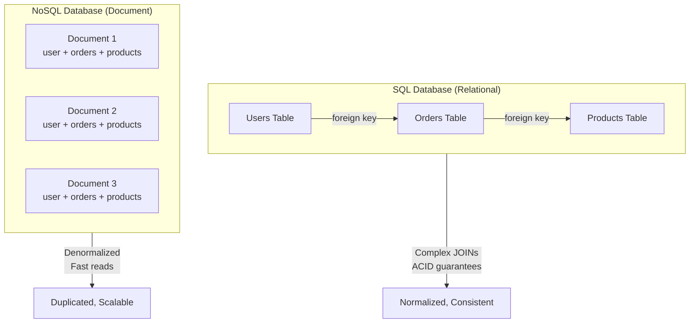
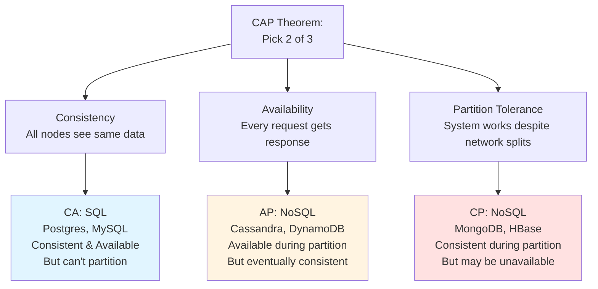
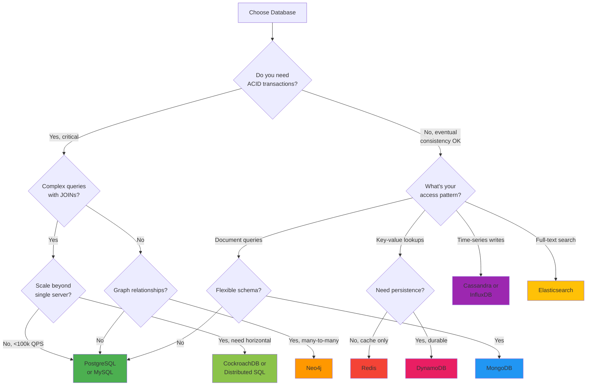

#system-design #trade-off

# SQL vs NoSQL

## Intuition (30 sec)

SQL is like a filing cabinet with strict folders and cross-references. Every document has the exact same fields, and you can easily find "all customers who bought product X in region Y." NoSQL is like a warehouse where you throw boxes on shelves. Each box can contain different things, you find them by shelf number (key), and you can add infinite shelves instantly.

---

## Failure-First Scenario

**The MongoDB disaster at startup X:**

Your social media app stores user posts in MongoDB. At first, it's great - deploy fast, schema changes are easy. Then you need to add "show posts from users this person follows."

In SQL: One JOIN query.
In MongoDB: You fetch user, fetch their 500 followers, make 500 separate queries for posts, filter/sort in application code. The page takes 8 seconds to load. You realize you chose flexibility over relationships, and relationships are exactly what social networks need.

**The PostgreSQL scaling wall:**

Your analytics app stores billions of events in PostgreSQL. Queries are fast with proper indexes. Then traffic 10x overnight. You need to scale writes horizontally, but PostgreSQL requires vertical scaling (bigger machines). You can't shard easily because your queries JOIN across user tables and event tables. Your $50k database server is maxed out. You realize you chose ACID and JOINs, but you needed horizontal scalability.

---

## Working Knowledge (5 min)

### Core Concepts - Definitions First

**SQL (Structured Query Language) Database:**
- **Definition:** A database management system that stores data in tables with predefined schemas, enforces relationships through foreign keys, and guarantees ACID transactions
- **Purpose:** To maintain data integrity and enable complex querying across related data sets
- **How it works:** Data is normalized into tables with fixed columns; queries can JOIN tables together; ACID transactions ensure consistency even during failures

**NoSQL (Not Only SQL) Database:**
- **Definition:** A category of database systems that use non-relational data models, prioritize horizontal scalability, and often trade consistency for availability/performance
- **Purpose:** To handle massive scale, flexible schemas, and specialized data access patterns that don't fit the relational model
- **How it works:** Data is stored in various formats (documents, key-value pairs, wide columns, graphs) optimized for specific access patterns; typically scales horizontally by adding more servers

**Key Terms:**

- **ACID (Atomicity, Consistency, Isolation, Durability):** A set of guarantees that ensure database transactions are processed reliably. All operations in a transaction succeed or all fail; data remains valid; concurrent transactions don't interfere; committed data survives crashes.

- **Schema:** The structure/blueprint of how data is organized. In SQL: rigid and predefined. In NoSQL: flexible and can vary per record.

- **JOIN:** An operation that combines rows from two or more tables based on related columns. Fundamental to SQL; expensive or impossible in most NoSQL systems.

- **Horizontal Scaling (Scale-Out):** Adding more machines to distribute load. NoSQL excels here.

- **Vertical Scaling (Scale-Up):** Adding more resources (CPU, RAM) to a single machine. SQL's traditional approach.

- **Normalization:** The process of organizing data to reduce redundancy by splitting into related tables. SQL best practice; NoSQL often denormalizes intentionally.

- **Eventual Consistency:** A consistency model where updates propagate to all nodes eventually, but reads might return stale data temporarily. Common in distributed NoSQL.

- **Strong Consistency:** Guarantee that reads always return the most recent write. SQL default; available but expensive in NoSQL.

### Visual Model - The Core Difference



### Comparison Table - SQL vs NoSQL Types

| Feature | SQL (Relational) | Document (MongoDB) | Key-Value (Redis) | Wide-Column (Cassandra) | Graph (Neo4j) |
|---------|------------------|-------------------|-------------------|------------------------|---------------|
| **Data Model** | Tables with rows/columns | JSON-like documents | Key → Value pairs | Column families | Nodes and edges |
| **Schema** | Fixed, enforced | Flexible, per-doc | No schema | Column-based schema | Property graph schema |
| **Relationships** | JOINs, foreign keys | Embedded or refs | None (flat) | Denormalized | Native graph traversal |
| **ACID** | Full ACID | Document-level ACID | Limited | Tunable (eventual) | ACID transactions |
| **Scale** | Vertical (mainly) | Horizontal | Horizontal | Horizontal (best) | Vertical to moderate horizontal |
| **Query Language** | SQL | MongoDB Query Language | Simple GET/SET | CQL (SQL-like) | Cypher |
| **Best For** | Complex queries, reporting | Flexible data, aggregations | Caching, sessions | Time-series, massive writes | Social graphs, recommendations |
| **Use When** | Data integrity critical | Schema evolves | Need microsecond reads | Write-heavy, can sacrifice consistency | Many-to-many relationships |

---

## Layer 1: Conceptual Precision (15 min)

### SQL Databases - Deep Definitions

**Relational Database:**
- **Formal Definition:** A database management system based on the relational model (E.F. Codd, 1970) where data is organized into relations (tables) and operations are performed using relational algebra
- **Simple Definition:** A system where data lives in interconnected tables, like multiple spreadsheets with cross-references
- **Analogy:** A library catalog system - books are in one table, authors in another, and you can look up "all books by this author" through the connection
- **Related Terms:**
  - **RDBMS (Relational Database Management System):** The software that implements relational databases (PostgreSQL, MySQL, Oracle)
  - **Relational Algebra:** Mathematical foundation for querying (project, select, join operations)

**ACID Transactions:**
- **Atomicity:** All operations in a transaction succeed or all fail. No partial updates.
  - Example: Transfer $100 from Account A to B. Either both debit and credit happen, or neither.
- **Consistency:** Database moves from one valid state to another. All constraints/rules are maintained.
  - Example: If a foreign key points to User ID 5, User 5 must exist.
- **Isolation:** Concurrent transactions don't interfere. Each sees a consistent snapshot.
  - Example: Two people booking the last seat see the seat as available until one commits.
- **Durability:** Once committed, data survives crashes, power failures.
  - Example: After "Commit" returns, data is on disk (write-ahead log), not just RAM.

**Why ACID matters:**
Critical for financial systems, e-commerce orders, inventory management - anywhere correctness trumps performance. You can't have "partial" money transfers or "lost" orders.

**Normalization:**
- **Definition:** The process of organizing data to minimize redundancy by splitting into related tables
- **Purpose:** Reduce storage, prevent update anomalies (where changing data in one place leaves inconsistent copies elsewhere)
- **Forms:**
  - **1NF (First Normal Form):** Each cell contains atomic (indivisible) values
  - **2NF:** No partial dependencies (non-key columns depend on entire primary key)
  - **3NF:** No transitive dependencies (non-key columns depend only on primary key)

**Denormalization:**
- **Definition:** Intentionally introducing redundancy to improve read performance
- **Trade-off:** Faster reads (no JOINs) vs slower writes (update multiple places) and storage cost
- **When to use:** Read-heavy workloads, reporting databases, after you've hit JOIN performance limits

### NoSQL Databases - Deep Definitions

**Document Store (MongoDB, CouchDB):**
- **Definition:** A database that stores data as self-contained documents (JSON, BSON, XML) where each document can have different fields
- **How it works:** Documents are grouped in collections (like tables), accessed by unique ID or indexed fields, can embed related data
- **Best for:** Content management, product catalogs, user profiles - where data naturally forms documents
- **Example document:**
```json
{
  "_id": "user123",
  "name": "Alice",
  "email": "alice@example.com",
  "orders": [
    { "orderId": "o1", "total": 50.00, "items": [...] },
    { "orderId": "o2", "total": 30.00, "items": [...] }
  ]
}
```

**Key-Value Store (Redis, DynamoDB, Riak):**
- **Definition:** A database that stores data as a hash map - each unique key maps to a value (string, number, blob)
- **How it works:** Simple PUT(key, value) and GET(key) operations; some support range queries on keys; often in-memory for speed
- **Best for:** Caching, session storage, real-time leaderboards, rate limiting
- **Trade-off:** Extremely fast, simple, scalable vs. can only query by key (no complex filters)

**Wide-Column Store (Cassandra, HBase, ScyllaDB):**
- **Definition:** A database that stores data in column families (groups of columns), where rows can have different columns and columns are stored together
- **How it works:** Data partitioned by row key across nodes; columns within a row are sorted; optimized for massive write throughput
- **Best for:** Time-series data, IoT sensor data, activity feeds, write-heavy logging
- **Key concept - Column Family:** A container for rows, similar to a table, but each row can have different columns

**Graph Database (Neo4j, Amazon Neptune, ArangoDB):**
- **Definition:** A database optimized for storing entities (nodes) and their relationships (edges), where relationships are first-class citizens
- **How it works:** Nodes store entities, edges store relationships with properties; graph traversal algorithms run directly on storage engine
- **Best for:** Social networks, recommendation engines, fraud detection, knowledge graphs
- **Why it exists:** Relational JOINs across many levels (friend-of-friend-of-friend) become exponentially expensive; graphs handle this natively

### The CAP Theorem - Visual



**CAP Theorem Definition:**
- **Theorem:** In a distributed system, you can only guarantee 2 of 3 properties when a network partition occurs
- **Consistency:** Every read receives the most recent write or an error
- **Availability:** Every request receives a (non-error) response
- **Partition Tolerance:** System continues operating despite network failures between nodes

**Real-world implications:**
- **SQL (CA):** Traditional single-server databases. Consistent and available, but can't survive network partitions (no horizontal scaling).
- **Cassandra (AP):** Chooses availability. During partition, nodes accept writes and sync later (eventual consistency).
- **MongoDB (CP):** Chooses consistency. During partition, minority nodes refuse writes to avoid conflicts.

**Modern reality:** All distributed systems must have partition tolerance (network failures happen). Real choice is **CP vs AP**.

### Decision Tree - Visual Flow



### Trade-offs Matrix

```
SQL (Relational)                    NoSQL (Varies by Type)
═══════════════════════════════════════════════════════════════════

Definition:                          Definition:
Database with fixed schema,          Database with flexible schema,
ACID transactions, JOINs             horizontal scalability, eventual
                                     consistency (typically)

Pros:                                Pros:
• ACID guarantees correctness        • Horizontal scaling (add servers)
• Complex JOINs for analytics        • Schema flexibility (rapid iteration)
• Mature tooling (50+ years)         • Specialized for access patterns
• Strong consistency by default      • High write throughput (billions/day)
• Ad-hoc queries (any filter/sort)   • Low latency (microsecond reads)

Cons:                                Cons:
• Vertical scaling limits            • No JOINs (denormalize or app logic)
• Schema changes are expensive       • Eventual consistency complexity
• Sharding is complex                • Limited query flexibility
• Write throughput limited           • ACID only within document/partition
• Connection overhead                • Tooling less mature

Use When:                            Use When:
• Financial transactions             • Need >100k writes/sec
• E-commerce orders/inventory        • Schema evolves rapidly
• User auth/permissions              • Known access patterns
• Complex reporting queries          • Geographic distribution
• Strong consistency required        • Caching/sessions (Redis)
• Data relationships central         • Time-series data (Cassandra)
                                     • Document storage (MongoDB)
                                     • Graph traversal (Neo4j)

Scaling Characteristics:             Scaling Characteristics:
• Vertical: $10k → $100k servers     • Horizontal: $5k × N servers
• Sharding possible but complex      • Auto-sharding built-in
• Replication for read scaling       • Replication + partitioning
• Single-server: ~50k writes/sec     • Cluster: millions writes/sec
```

---

## Layer 2: Technology-Specific Examples (20 min)

### SQL Database Comparison

**SQL Category:** Relational databases with ACID guarantees and SQL query language

| PostgreSQL | MySQL | SQL Server | CockroachDB |
|------------|-------|------------|-------------|
| **Definition:** Open-source ORDBMS (object-relational) with advanced features | **Definition:** Open-source RDBMS optimized for read-heavy web apps | **Definition:** Microsoft's enterprise RDBMS with Windows integration | **Definition:** Distributed SQL database with horizontal scaling |
| **Best For:** Complex queries, JSON support, geospatial | **Best For:** Web apps, WordPress, read replicas | **Best For:** Enterprise, .NET apps, BI tools | **Best For:** Global distribution, cloud-native |
| ⭐⭐⭐⭐ Performance | ⭐⭐⭐⭐⭐ Performance | ⭐⭐⭐⭐ Performance | ⭐⭐⭐ Performance |
| ⭐⭐⭐⭐⭐ Features | ⭐⭐⭐ Features | ⭐⭐⭐⭐⭐ Features | ⭐⭐⭐⭐ Features |
| ⭐⭐⭐ Scaling | ⭐⭐⭐ Scaling | ⭐⭐⭐ Scaling | ⭐⭐⭐⭐⭐ Scaling |
| Free, open-source | Free, open-source | Paid licenses | Free tier, paid clusters |

**When to use each:**
- **PostgreSQL:** Default choice for new projects. Advanced features (arrays, JSONB, full-text search).
- **MySQL:** High read throughput, mature replication, simpler operations.
- **SQL Server:** Existing Microsoft stack, need tight integration with .NET/Azure.
- **CockroachDB:** Need horizontal scaling with SQL semantics (hybrid SQL/NoSQL).

### NoSQL Database Comparison

**NoSQL Category:** Non-relational databases optimized for specific use cases

| MongoDB | Redis | Cassandra | Neo4j | Elasticsearch |
|---------|-------|-----------|-------|---------------|
| **Type:** Document | **Type:** Key-Value | **Type:** Wide-Column | **Type:** Graph | **Type:** Search Engine |
| **Definition:** JSON document store with rich querying | **Definition:** In-memory data structure store | **Definition:** Distributed wide-column store | **Definition:** Native graph database | **Definition:** Distributed search and analytics |
| **Best For:** Content management, catalogs | **Best For:** Cache, sessions, pub/sub | **Best For:** Time-series, IoT, logs | **Best For:** Social graphs, fraud detection | **Best For:** Full-text search, log analysis |
| ⭐⭐⭐⭐ Query Flexibility | ⭐⭐ Query Flexibility | ⭐⭐ Query Flexibility | ⭐⭐⭐⭐⭐ Graph Queries | ⭐⭐⭐⭐⭐ Search Queries |
| ⭐⭐⭐ Write Throughput | ⭐⭐⭐⭐⭐ Write Throughput | ⭐⭐⭐⭐⭐ Write Throughput | ⭐⭐⭐ Write Throughput | ⭐⭐⭐⭐ Write Throughput |
| ⭐⭐⭐⭐ Horizontal Scaling | ⭐⭐⭐⭐ Horizontal Scaling | ⭐⭐⭐⭐⭐ Horizontal Scaling | ⭐⭐⭐ Horizontal Scaling | ⭐⭐⭐⭐ Horizontal Scaling |
| ⭐⭐⭐ Consistency | ⭐⭐⭐⭐⭐ Consistency | ⭐⭐ Consistency (tunable) | ⭐⭐⭐⭐ Consistency | ⭐⭐⭐ Consistency |

**When to use each:**
- **MongoDB:** Flexible schema, need to query on multiple fields, aggregation pipelines.
- **Redis:** Caching, real-time leaderboards, rate limiting, pub/sub messaging.
- **Cassandra:** Massive write throughput, time-series data, can sacrifice consistency.
- **Neo4j:** Relationship-heavy queries (social networks, recommendations, knowledge graphs).
- **Elasticsearch:** Full-text search, log aggregation, real-time analytics dashboards.

### Configuration Pattern - PostgreSQL Example

```sql
-- PostgreSQL configuration (postgresql.conf)

-- Connection Settings
max_connections = 200              # Definition: Maximum concurrent client connections
                                   # Rule: Set to (RAM_GB × 30) for OLTP workloads
                                   # Higher values increase memory overhead

-- Memory Settings
shared_buffers = 4GB               # Definition: Memory for caching table data
                                   # Rule: Set to 25% of total RAM
                                   # Too low: Relies on OS cache (slower)
                                   # Too high: Leaves too little for OS

work_mem = 20MB                    # Definition: Memory per query operation (sort, hash)
                                   # Formula: (RAM - shared_buffers) / max_connections
                                   # If 16GB RAM, 4GB shared_buffers, 200 connections:
                                   # (16GB - 4GB) / 200 = 60MB, set to 1/3 = 20MB

effective_cache_size = 12GB        # Definition: Estimate of memory available for caching
                                   # Rule: Set to 50-75% of total RAM
                                   # Used by query planner to estimate costs

-- Write-Ahead Log (WAL) Settings
wal_buffers = 16MB                 # Definition: Memory for WAL before writing to disk
                                   # Rule: -1 (auto) or 16MB for most workloads

checkpoint_timeout = 15min         # Definition: Time between automatic checkpoints
checkpoint_completion_target = 0.9 # Definition: Spread checkpoint I/O over 90% of interval
                                   # Prevents I/O spikes

-- Query Performance
effective_io_concurrency = 200     # Definition: Number of concurrent I/O operations
                                   # Set to 200 for SSD, 2 for HDD

random_page_cost = 1.1             # Definition: Cost estimate for non-sequential reads
                                   # Set to 1.1 for SSD (almost as fast as sequential)
                                   # Set to 4.0 for HDD (much slower than sequential)

-- Autovacuum (Cleanup)
autovacuum = on                    # Definition: Automatically clean dead tuples
                                   # Critical for maintaining performance
```

**Configuration Concepts:**
- **shared_buffers:** PostgreSQL's internal cache. Data pages loaded here are served from RAM.
- **work_mem:** Temporary memory for each query operation. If exceeded, uses disk (slow).
- **WAL (Write-Ahead Log):** Transaction log written before data pages. Ensures durability.
- **Checkpoint:** Flush of dirty buffers from memory to disk. Expensive I/O operation.
- **Autovacuum:** Background process that reclaims storage from deleted rows (MVCC cleanup).

### Configuration Pattern - MongoDB Example

```javascript
// MongoDB configuration (mongod.conf in YAML)

storage:
  dbPath: /var/lib/mongodb         # Definition: Directory for data files
  journal:
    enabled: true                  # Definition: Write-ahead log for crash recovery
                                   # Always enable in production
  wiredTiger:
    engineConfig:
      cacheSizeGB: 8               # Definition: Internal cache size
                                   # Rule: 50% of (RAM - 1GB)
                                   # If 16GB RAM: (16 - 1) / 2 = 7.5GB
      journalCompressor: snappy    # Definition: Compression for journal files
      # Options: snappy (fast), zlib (smaller), none

    collectionConfig:
      blockCompressor: snappy      # Definition: Compression for data files
                                   # Snappy: 2-3x compression, fast
                                   # zlib: 5x compression, slower

replication:
  replSetName: "rs0"               # Definition: Replica set name
                                   # Required for production (high availability)

# Read/Write Concern (application-level config)
# writeConcern: { w: "majority" }  # Definition: Wait for majority of nodes to confirm write
                                   # Ensures durability across replica set
                                   # w: 1 (faster, less durable)
                                   # w: "majority" (slower, durable)

# readConcern: { level: "majority" } # Definition: Only read data replicated to majority
                                     # Prevents reading data that might rollback
                                     # Options: local, majority, linearizable
```

**MongoDB Concepts:**
- **WiredTiger:** Storage engine (component that manages data on disk). Replaced MMAPv1.
- **Replica Set:** Group of MongoDB servers maintaining same data set (for availability).
- **Write Concern:** Number of nodes that must acknowledge write before returning success.
- **Read Concern:** Guarantee about what data is visible (local, majority, linearizable).
- **Sharding:** Distributing data across multiple servers. Configured separately.

### Configuration Pattern - Redis Example

```conf
# Redis configuration (redis.conf)

# Memory Settings
maxmemory 4gb                      # Definition: Maximum memory Redis can use
                                   # When reached, eviction policy takes effect
                                   # Set to 75% of available RAM

maxmemory-policy allkeys-lru       # Definition: Which keys to evict when maxmemory reached
                                   # Options:
                                   # - allkeys-lru: Evict least recently used (cache)
                                   # - volatile-lru: Evict LRU with TTL (cache + persistent)
                                   # - noeviction: Return error (database mode)

# Persistence Settings
save 900 1                         # Definition: Save to disk if 1 key changed in 900 sec
save 300 10                        # Or if 10 keys changed in 300 sec
save 60 10000                      # Or if 10,000 keys changed in 60 sec
                                   # Trade-off: More frequent = safer but slower

appendonly yes                     # Definition: Enable AOF (Append-Only File) persistence
                                   # Logs every write command
                                   # More durable than snapshots

appendfsync everysec               # Definition: Sync AOF to disk every second
                                   # Options:
                                   # - always: Every write (slow, most durable)
                                   # - everysec: Every second (balanced)
                                   # - no: Let OS decide (fast, least durable)

# Replication
replica-read-only yes              # Definition: Replicas accept only reads
min-replicas-to-write 1            # Definition: Minimum replicas to accept writes
min-replicas-max-lag 10            # If replicas lag >10 sec, reject writes
                                   # Ensures data is replicated
```

**Redis Concepts:**
- **LRU (Least Recently Used):** Eviction algorithm. Removes keys not accessed recently.
- **RDB Snapshot:** Point-in-time copy of dataset saved to disk. Fast but can lose recent data.
- **AOF (Append-Only File):** Log of every write operation. More durable but larger files.
- **Replication:** Master-replica setup. Replicas sync data from master for read scaling.
- **TTL (Time To Live):** Expiration time on keys. Redis auto-deletes after TTL expires.

---

## Layer 3: Production-Ready Details (30 min)

### Capacity Planning - SQL Database

**SQL Capacity Planning:**
- **Definition:** Determining hardware and configuration to meet performance SLAs for SQL workloads
- **Goal:** Right-size database server for query latency, transaction throughput, and storage requirements

**Key Metrics for SQL:**

1. **Transactions Per Second (TPS):**
   - **Definition:** Number of transactions (BEGIN...COMMIT blocks) completed per second
   - **Measurement:** `SELECT count(*) FROM pg_stat_database WHERE datname = 'mydb';` (incremental)
   - **Typical values:**
     - Small app: 10-100 TPS
     - Medium app: 100-1,000 TPS
     - Large app: 1,000-10,000 TPS
     - Huge app: 10,000-100,000 TPS (requires sharding)

2. **Queries Per Second (QPS):**
   - **Definition:** Total queries (reads + writes) per second
   - **Formula:** `QPS = (Reads/sec + Writes/sec)`
   - **Rule of thumb:** Single PostgreSQL server: ~50,000 QPS with proper indexes and caching

3. **Connection Count:**
   - **Definition:** Number of simultaneous client connections
   - **Formula:** `Connections = Concurrent Users / 10` (with connection pooling)
   - **Limit:** PostgreSQL default: 100. Max practical: ~500. Use PgBouncer for 10,000+.

4. **Database Size:**
   - **Definition:** Total storage consumed by tables, indexes, and logs
   - **Growth rate:** Measure `pg_database_size()` weekly to project
   - **Rule:** Keep database at <50% of disk for writes, vacuum, backups

**Calculation Example - E-commerce Site:**

```
Requirements:
• 10,000 concurrent users (peak)
• 50,000 products
• 500,000 orders/day
• Average response time: <100ms

Step 1: Calculate Transaction Rate
  Orders/day = 500,000
  Orders/sec average = 500,000 / 86,400 = 5.8 TPS

  Peak multiplier: 3x (peak shopping hours)
  Peak TPS = 5.8 × 3 = 17.4 TPS

Step 2: Calculate Query Rate
  Each order: 1 write + 5 reads (user, inventory, price, shipping, tax)
  Queries per order = 6
  QPS = 17.4 TPS × 6 queries/transaction × 3 (peak) = 313 QPS

  Plus browsing: 10,000 users × 0.1 queries/sec = 1,000 QPS
  Total peak QPS = 313 + 1,000 = 1,313 QPS

Step 3: Determine Connection Pool Size
  Concurrent users = 10,000
  With connection pooling (1 conn per 50 users): 10,000 / 50 = 200 connections

  Set max_connections = 300 (buffer for admin, monitoring)

Step 4: Calculate Memory Requirements
  shared_buffers = 25% of RAM
  work_mem per connection = 10-50MB

  Assume 1,313 QPS, average query time 50ms:
  Concurrent queries = 1,313 × 0.05 = 65 queries at once

  Memory needed:
  - shared_buffers: 4GB (rule of thumb for medium DB)
  - work_mem: 65 concurrent × 20MB = 1.3GB
  - OS cache: 4GB
  - Total: ~10GB RAM minimum

  Recommendation: 16GB RAM server

Step 5: Calculate Storage
  Products: 50,000 × 5KB = 250MB
  Orders: 500,000/day × 365 days × 2KB = 365GB/year
  Indexes: ~30% of data = 110GB/year

  Total: 475GB first year
  Recommendation: 1TB SSD (room for growth)

Step 6: Choose Instance
  AWS RDS db.m5.xlarge: 4 vCPU, 16GB RAM, 1TB SSD
  Cost: ~$350/month

  Vertical scaling path:
  - db.m5.2xlarge: 8 vCPU, 32GB RAM ($700/month)
  - db.m5.4xlarge: 16 vCPU, 64GB RAM ($1,400/month)
```

**SQL Scaling Strategies:**

1. **Read Replicas:**
   - **Definition:** Copies of primary database that handle read-only queries
   - **Setup:** 1 primary (writes) + N replicas (reads)
   - **Scaling:** 5-10x read throughput with 2-3 replicas

2. **Connection Pooling (PgBouncer):**
   - **Definition:** Middleware that maintains a pool of database connections and reuses them
   - **Benefit:** Reduces connection overhead. 10,000 app connections → 200 DB connections.

3. **Vertical Scaling:**
   - **Definition:** Upgrading to larger server (more CPU, RAM, faster disk)
   - **Limit:** Physical limits (~256 cores, 4TB RAM) and cost ($10k+/month)

4. **Sharding:**
   - **Definition:** Splitting data across multiple databases by key (user_id, region, etc.)
   - **Complexity:** Application must route queries to correct shard. JOINs across shards difficult.

### Capacity Planning - NoSQL Database

**NoSQL Capacity Planning:**
- **Definition:** Determining cluster size to meet throughput, latency, and availability SLAs
- **Goal:** Design distributed system with appropriate replication factor and partition count

**Key Metrics for NoSQL:**

1. **Read/Write Operations Per Second:**
   - **Definition:** Number of GET/PUT operations completed per second
   - **Cassandra:** Can handle 1M+ writes/sec per cluster
   - **DynamoDB:** Auto-scales, but costs $0.25 per 1M WCU (write capacity units)

2. **Replication Factor (RF):**
   - **Definition:** Number of copies of each data partition
   - **Common values:** RF=3 (can survive 2 node failures)
   - **Trade-off:** Higher RF = more durability but 3x storage cost

3. **Partition Count:**
   - **Definition:** Number of shards/partitions data is split across
   - **Formula:** `Partitions = max(Data_Size / Max_Partition_Size, Throughput / Per_Node_Throughput)`

4. **Consistency Level:**
   - **Definition:** Number of replicas that must respond to consider operation successful
   - **Quorum:** `(RF / 2) + 1` → With RF=3, need 2/3 nodes for strong consistency

**Calculation Example - IoT Time-Series (Cassandra):**

```
Requirements:
• 100,000 IoT devices
• Each sends data every 10 seconds
• 1 year retention
• 99.9% availability
• Read:Write ratio 1:10 (write-heavy)

Step 1: Calculate Write Throughput
  Writes/sec = 100,000 devices / 10 sec = 10,000 writes/sec

  Peak multiplier: 2x (devices coming online)
  Peak writes = 20,000/sec

Step 2: Calculate Storage
  Data per write: 500 bytes (timestamp, deviceId, metrics)
  Writes/day = 10,000 × 86,400 = 864,000,000 writes/day

  Storage per day = 864M × 500 bytes = 432GB/day
  Storage per year = 432GB × 365 = 157TB/year

  With RF=3 (replication): 157TB × 3 = 471TB total cluster storage

Step 3: Calculate Read Throughput
  Read:Write = 1:10
  Reads/sec = 10,000 / 10 = 1,000 reads/sec

Step 4: Determine Node Count
  Cassandra node capacity:
  - Writes: 10,000/sec per node
  - Reads: 30,000/sec per node (faster)
  - Storage: 3TB per node (practical limit)

  Nodes for write throughput:
  20,000 writes/sec ÷ 10,000/sec/node = 2 nodes

  Nodes for storage:
  471TB ÷ 3TB/node = 157 nodes

  Nodes needed: 157 nodes (storage is limiting factor)

Step 5: Choose Replication Strategy
  Replication Factor: RF=3
  Consistency: QUORUM (2/3 replicas)

  With RF=3 and QUORUM:
  - Can lose 1 node and remain consistent
  - Write latency: ~10ms (wait for 2/3 nodes)

Step 6: Cost Estimation
  Instance: AWS i3.2xlarge (8 vCPU, 61GB RAM, 1.9TB NVMe SSD)
  Cost: $0.624/hour = ~$450/month

  Cluster cost: 157 nodes × $450 = $70,650/month

  Optimization: Use i3.large (half the size), need 314 nodes = still expensive

  Alternative: S3 + Athena for cold data (>30 days old)
  - Hot data: 30 days × 432GB = 13TB → 13 nodes × $450 = $5,850/month
  - Cold data: S3 $0.023/GB = 144TB × $0.023 = $3,312/month
  - Total: $9,162/month (87% savings)
```

**NoSQL Scaling Strategies:**

1. **Horizontal Scaling:**
   - **Definition:** Adding more nodes to cluster. Load distributes automatically.
   - **Cassandra:** Add node, data rebalances. Linear scalability to ~300 nodes.

2. **Tunable Consistency:**
   - **Definition:** Trade consistency for performance by lowering consistency level
   - **Options:**
     - ONE: Fast (wait for 1 replica), weak consistency
     - QUORUM: Balanced (wait for majority), strong consistency
     - ALL: Slow (wait for all replicas), strongest consistency

3. **Compaction:**
   - **Definition:** Background process that merges SSTables (data files) to reduce reads
   - **Trade-off:** Improves read performance but adds I/O and CPU load

4. **Hot Partition Prevention:**
   - **Definition:** Ensuring data distributes evenly across partitions
   - **Problem:** If partition key has skew (celebrity user), one partition gets all traffic
   - **Solution:** Compound partition key with high-cardinality column

### Production Architecture - Polyglot Persistence

```
                          Internet
                             │
                    ┌────────▼────────┐
                    │  Load Balancer  │
                    │   (NGINX)       │
                    │                 │
                    │ Definition:     │
                    │ Reverse proxy   │
                    │ distributing    │
                    │ traffic         │
                    └────────┬────────┘
                             │
              ┌──────────────┼──────────────┐
              │              │              │
         ┌────▼────┐    ┌───▼────┐    ┌───▼────┐
         │ API     │    │ API    │    │ API    │
         │ Server  │    │ Server │    │ Server │
         │ (Node.js│    │        │    │        │
         └─┬──┬─┬─┬┘    └────────┘    └────────┘
           │  │ │ │
           │  │ │ └─────────────────┐
           │  │ │                   │
           │  │ └─────────┐         │
┌──────────┘  │           │         │
│             │           │         │
│  ┌──────────▼─────────────┐      │
│  │  Redis (Cache)          │      │
│  │                         │      │
│  │  Definition:            │      │
│  │  In-memory cache        │      │
│  │  for hot data           │      │
│  │                         │      │
│  │  Data:                  │      │
│  │  • User sessions        │      │
│  │  • API rate limits      │      │
│  │  • Hot product cache    │      │
│  │                         │      │
│  │  TTL: 5-60 minutes      │      │
│  └─────────────────────────┘      │
│                                   │
│  ┌────────────────────────────┐  │
│  │  PostgreSQL (Primary DB)   │  │
│  │                            │  │
│  │  Definition:               │  │
│  │  ACID transactional        │  │
│  │  database                  │  │
│  │                            │  │
│  │  Data:                     │  │
│  │  • Users, auth             │  │
│  │  • Orders, payments        │  │
│  │  • Inventory               │  │
│  │  • Product catalog         │  │
│  │                            │  │
│  │  Why: Need ACID,           │  │
│  │  JOINs, consistency        │  │
│  └────────┬───────────────────┘  │
│           │                      │
│           │ Replication          │
│           │                      │
│  ┌────────▼───────────────────┐  │
│  │  PostgreSQL (Read Replica) │  │
│  │                            │  │
│  │  Purpose:                  │  │
│  │  Analytics, reporting      │  │
│  │  Heavy queries don't       │  │
│  │  impact production         │  │
│  └────────────────────────────┘  │
│                                  │
│  ┌──────────────────────────────▼────┐
│  │  MongoDB (Product Details)        │
│  │                                   │
│  │  Definition:                      │
│  │  Document store for               │
│  │  flexible schemas                 │
│  │                                   │
│  │  Data:                            │
│  │  • Product metadata (varying)     │
│  │  • User preferences               │
│  │  • Content/blog posts             │
│  │                                   │
│  │  Why: Schema varies by            │
│  │  product category                 │
│  └───────────────────────────────────┘
│
│  ┌─────────────────────────────────┐
└─►│  Cassandra (Activity Feed)      │
   │                                 │
   │  Definition:                    │
   │  Wide-column store for          │
   │  high write throughput          │
   │                                 │
   │  Data:                          │
   │  • User activity events         │
   │  • Clickstream                  │
   │  • Audit logs                   │
   │                                 │
   │  Why: Millions of writes/day,   │
   │  eventual consistency OK        │
   └─────────────┬───────────────────┘
                 │
                 │ Batch sync
                 │
   ┌─────────────▼───────────────────┐
   │  Elasticsearch (Search)         │
   │                                 │
   │  Definition:                    │
   │  Full-text search engine        │
   │                                 │
   │  Data:                          │
   │  • Product search index         │
   │  • Log aggregation              │
   │                                 │
   │  Why: Complex full-text         │
   │  queries, faceted search        │
   └─────────────────────────────────┘
```

**Architecture Component Definitions:**

- **Load Balancer:** Routes incoming requests across multiple servers. Provides failover if server dies.
- **Redis Cache:** In-memory store. 10-100x faster than database. Used for frequently accessed data.
- **PostgreSQL Primary:** Source of truth for critical data. Handles writes. ACID ensures correctness.
- **PostgreSQL Replica:** Read-only copy. Async replication. Used for reporting to avoid slowing production.
- **MongoDB:** Stores documents with varying schemas. Good for product attributes that differ by category.
- **Cassandra:** Write-optimized distributed database. Perfect for append-only event logs.
- **Elasticsearch:** Search engine built on Lucene. Indexes data for fast full-text search and analytics.

### Monitoring Metrics - SQL

```
┌─────────────────────────────────────────┐
│  POSTGRESQL METRICS DASHBOARD           │
├─────────────────────────────────────────┤
│                                         │
│ Transactions/sec: 1,247                 │
│ Definition: Committed transactions      │
│            per second                   │
│ Why track: Core throughput metric      │
│ Alert when: Sudden drop (app failure)  │
│            or spike (unusual load)     │
│                                         │
│ Active Connections: 78 / 200            │
│ Definition: Current client connections  │
│ Why track: Prevent exhaustion          │
│ Alert when: > 80% (scale up pool)      │
│                                         │
│ Cache Hit Ratio: 98.5%                  │
│ Definition: % of reads from             │
│            shared_buffers (RAM)         │
│ Formula: (hits / (hits + misses)) × 100│
│ Why track: Low ratio = slow queries    │
│ Alert when: < 90% (increase RAM or     │
│            add indexes)                 │
│                                         │
│ Query P95 Latency: 45ms                 │
│ Definition: 95% of queries complete     │
│            within this time             │
│ Why track: User experience metric      │
│ Alert when: > 100ms (investigate       │
│            slow queries)                │
│                                         │
│ Slow Queries (>1s): 3                   │
│ Definition: Queries taking > 1 second   │
│ Why track: Find optimization targets   │
│ Alert when: Any query > 5s             │
│                                         │
│ Replication Lag: 120ms                  │
│ Definition: How far behind replica is   │
│            from primary                 │
│ Why track: Replica serves stale data   │
│            if lagging                   │
│ Alert when: > 1 second (network issue  │
│            or replica overloaded)       │
│                                         │
│ Deadlocks: 0                            │
│ Definition: Transactions waiting for    │
│            each other (circular)        │
│ Why track: Causes transaction failures │
│ Alert when: > 0 (review app logic)     │
│                                         │
│ Database Size: 245 GB / 500 GB          │
│ Definition: Total storage used          │
│ Why track: Plan for growth             │
│ Alert when: > 80% (provision storage)  │
│                                         │
│ Checkpoint Write Time: 80ms             │
│ Definition: Time to flush dirty         │
│            buffers to disk              │
│ Why track: Long writes = I/O bottleneck│
│ Alert when: > 500ms (upgrade disk)     │
└─────────────────────────────────────────┘
```

### Monitoring Metrics - NoSQL (Cassandra)

```
┌─────────────────────────────────────────┐
│  CASSANDRA METRICS DASHBOARD            │
├─────────────────────────────────────────┤
│                                         │
│ Read Throughput: 12,450 ops/sec         │
│ Write Throughput: 24,900 ops/sec        │
│ Definition: Operations completed/sec    │
│ Why track: Ensure cluster keeping up   │
│ Alert when: Throughput drops (node     │
│            failure or saturation)       │
│                                         │
│ Read Latency P99: 8ms                   │
│ Write Latency P99: 12ms                 │
│ Definition: 99% of ops complete in      │
│            this time                    │
│ Why track: User experience             │
│ Alert when: Read > 50ms, Write > 100ms │
│                                         │
│ Pending Compactions: 5                  │
│ Definition: Number of compaction tasks  │
│            waiting to run               │
│ Why track: Backlog = degraded read     │
│            performance                  │
│ Alert when: > 20 (increase compaction  │
│            throughput)                  │
│                                         │
│ Memtable Size: 512 MB                   │
│ Definition: In-memory write buffer      │
│            before flush to disk         │
│ Why track: Flushing slows writes       │
│ Alert when: Frequent flushes (increase │
│            memtable size)               │
│                                         │
│ SSTable Count: 45                       │
│ Definition: Number of on-disk tables    │
│ Why track: Too many = slow reads       │
│            (need compaction)            │
│ Alert when: > 100 (compaction behind)  │
│                                         │
│ Heap Memory Usage: 6.2 GB / 8 GB        │
│ Definition: JVM heap memory used        │
│ Why track: GC pauses if near limit     │
│ Alert when: > 75% (increase heap or    │
│            scale out)                   │
│                                         │
│ Node Status: 3 UP / 3 Total             │
│ Definition: Number of healthy nodes     │
│ Why track: Cluster health              │
│ Alert when: Any node DOWN              │
│                                         │
│ Hinted Handoff: 0                       │
│ Definition: Writes queued for down      │
│            nodes                        │
│ Why track: Data consistency            │
│ Alert when: > 0 (investigate node)     │
└─────────────────────────────────────────┘
```

**Metric Definitions:**

- **Throughput (ops/sec):** Rate of completed operations. Different from QPS (queries can have multiple ops).
- **P99 Latency:** 99th percentile. 1% of requests are slower. More meaningful than average for user experience.
- **Compaction:** Merging SSTables to reduce read amplification. CPU and I/O intensive.
- **Memtable:** In-memory buffer for writes. Periodically flushed to disk as SSTable.
- **SSTable (Sorted String Table):** Immutable on-disk data structure. Reads scan multiple SSTables.
- **Hinted Handoff:** Mechanism to store writes for temporarily down nodes and replay when they recover.

---

## Real-World Examples

### Example 1: Instagram - Choosing PostgreSQL

**Problem Definition:**
Instagram needed a database for user profiles, photos, relationships (followers, likes, comments). Early 2010s decision when MongoDB was gaining hype.

**Why they chose SQL (PostgreSQL):**

**Technical Terms Used:**
- **Relational Integrity:** Foreign keys ensure users exist before adding photos, likes point to valid photos.
- **Sharding:** Split data across multiple PostgreSQL instances by user_id.
- **Materialized Views:** Pre-computed aggregates (follower counts) for performance.

**Decision Factors:**

1. **Relationships are Core:**
   - User → Photos: one-to-many
   - User → Followers: many-to-many
   - Photo → Likes/Comments: one-to-many
   - SQL's JOINs handle this naturally

2. **Data Integrity Critical:**
   - Can't have "orphan" likes pointing to deleted photos
   - Foreign key constraints prevent this
   - MongoDB would require application-level checks (error-prone)

3. **Mature Tooling:**
   - Needed proven reliability for rapid growth
   - PostgreSQL: 25+ years of production use
   - MongoDB: New (released 2009), unproven at scale

4. **Query Flexibility:**
   - Product team needs ad-hoc analytics
   - "Show photos by users in SF with >1000 followers who posted last week"
   - SQL: Easy. MongoDB: Complex aggregation pipeline or impossible.

**Architecture:**

```
Before (Early Instagram):
┌──────────────────┐
│   PostgreSQL     │
│   Single Server  │
│   (user_data DB) │
│                  │
│   All users,     │
│   photos, likes  │
└──────────────────┘

After (Instagram at Scale):
┌─────────────┐  ┌─────────────┐  ┌─────────────┐
│ PostgreSQL  │  │ PostgreSQL  │  │ PostgreSQL  │
│ Shard 1     │  │ Shard 2     │  │ Shard N     │
│             │  │             │  │             │
│ Users       │  │ Users       │  │ Users       │
│ 0-100M      │  │ 100M-200M   │  │ N-M         │
└─────────────┘  └─────────────┘  └─────────────┘

Sharding key: user_id % N
App routes queries to correct shard

Plus:
• Read replicas for each shard (analytics)
• Redis for feed cache
• Cassandra for activity logs
```

**Results:**
- **Scalability:** Scaled to 1+ billion users with sharded PostgreSQL
- **Development Speed:** SQL expertise is common, team could move fast
- **Data Integrity:** Zero data corruption incidents from database layer

**Quote from Instagram Engineering:**
"We use PostgreSQL because it works. [...] We run the world's largest deployment of Django and PostgreSQL - over a billion users and counting."

**Lesson:** Don't chase NoSQL hype. Choose SQL if your data has relationships and you need ACID.

---

### Example 2: Uber - Using Both SQL and NoSQL

**Problem Definition:**
Uber has diverse data needs: transactional (payments), real-time (driver locations), analytics (surge pricing).

**Solution Definition:**
Polyglot persistence - different databases for different use cases.

**Technical Terms Used:**
- **Polyglot Persistence:** Using multiple database technologies, each optimized for specific workloads.
- **Geospatial Index:** Data structure for efficiently querying "nearby" locations.
- **Event Sourcing:** Storing state changes as immutable events (all updates to trip status).

**Architecture:**

```
┌────────────────────────────────────────────────┐
│              Uber's Data Layer                 │
├────────────────────────────────────────────────┤

1. PostgreSQL → User accounts, drivers, payments
   Why: ACID for money. Relationships (user → trips).
   Scale: Sharded by city/region.

2. MySQL → Legacy data from early days
   Why: Existed before PostgreSQL migration.
   Scale: Being migrated to PostgreSQL.

3. Cassandra → Trip history, driver location logs
   Why: Billions of events/day. Write-heavy.
   Scale: 1000+ node clusters.

4. Redis → Driver location cache, session storage
   Why: Microsecond reads for "find nearby drivers."
   Scale: In-memory, replicated clusters.

5. Schemaless (MySQL + JSON) → Document-style data
   Why: Flexible schema for experiments.
   Scale: Custom-built layer on MySQL.

6. HDFS + Presto → Data warehouse
   Why: Analytics across all data sources.
   Scale: Petabyte-scale storage.

7. Google S3 → Backups, cold data
   Why: Cheap long-term storage.
   Scale: Multi-petabyte.
└────────────────────────────────────────────────┘
```

**Use Case Breakdown:**

| Use Case | Database | Why |
|----------|----------|-----|
| **Rider requests trip** | Redis | Check nearby drivers (cached locations, <1ms latency) |
| **Create trip** | PostgreSQL | ACID transaction (debit credit card, reserve driver) |
| **Update trip status** | Cassandra | High write throughput (status changes every few seconds) |
| **Calculate fare** | PostgreSQL | Read distance/time, apply pricing rules (ACID) |
| **Surge pricing** | Presto on HDFS | Analyze demand across city (aggregations on historical data) |
| **Driver location tracking** | Redis (write) → Cassandra (archive) | Real-time cache, long-term storage |

**Real Example - Trip Flow:**

1. **Rider opens app:**
   - Query: "Find drivers within 0.5 miles"
   - Database: **Redis** (geospatial index)
   - Why: Need <100ms response for good UX

2. **Rider requests ride:**
   - Write: Create trip record, debit payment method
   - Database: **PostgreSQL**
   - Why: ACID transaction (money must be debited correctly)

3. **Driver accepts:**
   - Write: Update trip status to "accepted"
   - Database: **Cassandra**
   - Why: High write volume (thousands of trips/sec)

4. **Trip in progress:**
   - Write: Driver location every 4 seconds
   - Database: **Redis** (cache) + **Cassandra** (durable log)
   - Why: Redis for real-time tracking, Cassandra for audit trail

5. **Trip completes:**
   - Write: Final fare, completion time
   - Database: **PostgreSQL**
   - Why: Financial record, needs ACID

6. **Analytics team:**
   - Query: "Average trip duration by city last month"
   - Database: **Presto** querying data from Cassandra + PostgreSQL
   - Why: Aggregate across billions of trips

**Results:**
- **Performance:** Each database optimized for its workload
- **Scalability:** Cassandra handles billions of writes/day, PostgreSQL stays focused on critical transactional data
- **Cost:** Right-sized storage (Redis for hot, Cassandra for warm, S3 for cold)

**Lesson:** No single database fits all use cases. Use specialized databases and accept the operational complexity.

---

### Example 3: Discord - Migrating from MongoDB to Cassandra

**Problem Definition:**
Discord stores billions of chat messages. Initially used MongoDB for flexibility. Hit scaling limits at 100M messages.

**Technical Terms Used:**
- **Partition Key:** Column used to distribute data across cluster nodes.
- **Clustering Key:** Column used to sort data within a partition.
- **Bucketing:** Splitting data into time-based buckets to prevent hot partitions.

**Before (MongoDB):**

```
Collection: messages
Documents:
{
  _id: ObjectId("..."),
  channel_id: "channel123",
  user_id: "user456",
  content: "Hello world",
  timestamp: ISODate("2024-01-01T12:00:00Z")
}

Index: { channel_id: 1, timestamp: 1 }

Query: db.messages.find({ channel_id: "channel123" })
       .sort({ timestamp: -1 })
       .limit(50)
```

**Problems:**

1. **RAM Exhaustion:**
   - MongoDB uses memory-mapped files
   - Working set (active data + indexes) must fit in RAM
   - At 100M+ messages, indexes exceeded available RAM
   - Queries started hitting disk → 100-1000x slower

2. **Latency Spikes:**
   - When index doesn't fit in RAM, random I/O to disk
   - P99 latency: 5 seconds (users see "loading...")
   - Large channels (millions of messages) worst affected

3. **Scaling Limits:**
   - MongoDB sharding is complex
   - Query router needs to know shard key
   - Sorting across shards requires coordination

**After (Cassandra):**

```
Table: messages
Schema:
CREATE TABLE messages (
  channel_id bigint,
  bucket int,                      -- Date bucket (2024-01-01 → 20240101)
  message_id bigint,               -- Snowflake ID (timestamp-based)
  user_id bigint,
  content text,
  PRIMARY KEY ((channel_id, bucket), message_id)
) WITH CLUSTERING ORDER BY (message_id DESC);

-- Definition of terms:
-- Partition key: (channel_id, bucket)
--   Determines which node stores the data
-- Clustering key: message_id
--   Determines sort order within partition
-- DESC: Messages sorted newest-first (matches query pattern)

Query: SELECT * FROM messages
       WHERE channel_id = 123 AND bucket = 20240101
       LIMIT 50;
```

**Design Decisions:**

1. **Compound Partition Key (channel_id, bucket):**
   - **Problem:** Using only `channel_id` creates hot partitions (popular channels get millions of messages)
   - **Solution:** Add `bucket` (date) to distribute across multiple partitions
   - **Example:**
     - `(channel123, 20240101)` → Node 1
     - `(channel123, 20240102)` → Node 2
     - `(channel123, 20240103)` → Node 3

2. **Clustering by message_id DESC:**
   - **Problem:** Users always want newest messages first
   - **Solution:** Store messages sorted newest-first on disk
   - **Benefit:** Query is sequential read, no sorting needed

3. **Snowflake IDs:**
   - **Definition:** 64-bit IDs with embedded timestamp (first 41 bits)
   - **Benefit:** IDs are naturally time-ordered, so clustering works
   - **Format:** `[timestamp][worker_id][sequence]`

**Results:**

| Metric | MongoDB (Before) | Cassandra (After) | Improvement |
|--------|------------------|-------------------|-------------|
| **P99 Read Latency** | 5,000ms | 5ms | 1000x faster |
| **Write Throughput** | 5,000/sec | 50,000/sec | 10x higher |
| **Storage** | 100GB RAM needed | Indexes fit in RAM | Infinite scale |
| **Cluster Size** | 12 nodes | 12 nodes | Same cost |
| **Downtime** | Minutes during backups | Zero (replication) | HA achieved |

**Migration Process:**

1. **Dual-write:** Write to both MongoDB and Cassandra for 1 week
2. **Backfill:** Copy historical data from MongoDB to Cassandra
3. **Verify:** Compare read results from both databases
4. **Cutover:** Switch reads to Cassandra
5. **Decommission:** Turn off MongoDB

**Quote from Discord Engineering:**
"The move from MongoDB to Cassandra was one of the best decisions we made. Read latency went from 5 seconds to 5 milliseconds."

**Lesson:** MongoDB is great for getting started, but doesn't scale to billions of records with complex query patterns. Wide-column stores (Cassandra) excel at append-heavy workloads with known access patterns.

---

### Example 4: Netflix - Polyglot Persistence at Scale

**Problem Definition:**
Netflix handles 200M+ subscribers, billions of streaming events, personalized recommendations - diverse data needs.

**Solution Definition:**
Polyglot persistence with 8+ different database technologies.

**Architecture:**

```
Netflix Data Stores (by Use Case)
═════════════════════════════════════════════════════════════

1. MySQL → Billing, subscriptions
   Why: ACID for financial data
   Scale: Sharded by customer_id

2. Cassandra → Viewing history, user activity
   Why: Billions of events/day, write-heavy
   Scale: 2,500+ node clusters, multi-region

3. ElasticSearch → Search (movies, actors)
   Why: Full-text search, faceted filtering
   Scale: Distributed clusters

4. EVCache (Memcached) → Hot data cache
   Why: Microsecond latency for popular content
   Scale: 30+ TB in-memory across regions

5. Amazon S3 → Video files, images, backups
   Why: Petabyte-scale object storage
   Scale: Exabytes of data

6. Apache Spark + HDFS → Big data analytics
   Why: Recommendation algorithms, ML training
   Scale: Process trillions of events

7. Druid → Real-time analytics dashboards
   Why: Sub-second aggregation queries
   Scale: Billions of rows

8. Presto → Ad-hoc SQL queries
   Why: Data scientists query across sources
   Scale: Federated queries on all data stores
```

**Use Case Examples:**

**Use Case 1: User Plays Video**

```
Event: User 123 plays "Stranger Things" S1E1

1. Record playback event
   → Cassandra (viewing_history table)
   Why: High write volume, eventual consistency OK

2. Update "Continue Watching"
   → EVCache (invalidate cache)
   Why: Next load needs fresh data

3. Increment view count
   → Cassandra (content_stats table)
   Why: Counter column (optimized for increments)

4. Check billing status
   → MySQL (subscriptions table)
   Why: Payment status must be accurate (ACID)

5. Log for analytics
   → Kafka → Spark → HDFS
   Why: Batch processing for recommendations
```

**Use Case 2: Personalized Homepage**

```
Request: Load homepage for User 123

1. Check cache
   → EVCache: GET user:123:homepage
   If hit: Return (5ms)
   If miss: Continue

2. Fetch viewing history
   → Cassandra: Last 100 watched titles
   Query: SELECT * FROM viewing_history
          WHERE user_id = 123
          LIMIT 100;

3. Fetch recommendations
   → Pre-computed by Spark, stored in Cassandra
   Query: SELECT * FROM recommendations
          WHERE user_id = 123;

4. Fetch trending titles
   → Druid: Real-time aggregation
   Query: Top 10 titles started in last 24h

5. Cache result
   → EVCache: SET user:123:homepage (TTL: 5 min)

Total latency: ~50ms (after cache miss)
```

**Results:**

| Metric | Value |
|--------|-------|
| **Cassandra Writes** | 1+ trillion/day |
| **Cassandra Clusters** | 2,500+ nodes |
| **EVCache Hit Rate** | >99% (most requests served from memory) |
| **Data Volume** | Petabytes in Cassandra, exabytes in S3 |
| **Availability** | 99.99% uptime (multi-region replication) |

**Polyglot Persistence Decision Framework (Netflix):**

| Question | Answer → Database |
|----------|------------------|
| Is money involved? | Yes → **MySQL** (ACID) |
| Need microsecond latency? | Yes → **EVCache** (in-memory) |
| Write-heavy time-series? | Yes → **Cassandra** |
| Need full-text search? | Yes → **ElasticSearch** |
| Complex aggregations? | Yes → **Druid** (real-time) or **Spark** (batch) |
| Ad-hoc queries? | Yes → **Presto** (federated SQL) |
| Object storage (videos)? | Yes → **S3** |

**Lesson:** At hyper-scale, you need multiple specialized databases. Accept operational complexity for performance and cost optimization.

---

## Interview Preparation

### Concept Glossary

Quick reference definitions for interview:

- **SQL:** Relational database with fixed schema, ACID transactions, and JOIN support
- **NoSQL:** Non-relational database optimized for scale, flexibility, or specialized access patterns
- **ACID:** Atomicity, Consistency, Isolation, Durability - guarantees for reliable transactions
- **CAP Theorem:** Can only have 2 of 3: Consistency, Availability, Partition Tolerance
- **Sharding:** Splitting database horizontally across multiple servers by key
- **Replication:** Copying data to multiple servers for availability and read scaling
- **Eventual Consistency:** Updates propagate eventually; reads may be stale temporarily
- **Strong Consistency:** Reads always return most recent write
- **Normalization:** Splitting data into tables to reduce redundancy
- **Denormalization:** Duplicating data for faster reads (avoid JOINs)
- **Partition Key:** Column that determines which node stores data in distributed DB
- **Clustering Key:** Column that determines sort order within partition

### Question Template

**Q: When would you choose SQL over NoSQL?**

**Answer Structure:**

1. **Define (5-10 sec):**
   "SQL databases provide ACID transactions and support complex JOINs across related tables. NoSQL databases sacrifice these for horizontal scalability and flexible schemas."

2. **Explain When (15-20 sec):**
   "Choose SQL when:
   - Your data has relationships (users, orders, products)
   - You need ACID guarantees (financial transactions)
   - You want ad-hoc query flexibility (analytics)
   - Scale is moderate (<100k writes/sec)

   Choose NoSQL when:
   - You need massive write throughput (millions/sec)
   - Schema changes frequently
   - Data access patterns are simple and known
   - You can accept eventual consistency"

3. **Give Example (10 sec):**
   "Instagram uses PostgreSQL for users and photos because relationships are core to social networks. Uber uses Cassandra for trip events because they log billions of writes per day."

4. **Mention Trade-off (10 sec):**
   "Trade-off is flexibility vs. guarantees. SQL gives you correctness and query flexibility. NoSQL gives you scale and schema flexibility."

---

**Q: Explain the CAP theorem and how it affects database choice.**

**Answer Structure:**

1. **Define (5-10 sec):**
   "CAP theorem states that in a distributed system, you can only guarantee 2 of 3: Consistency (all nodes see same data), Availability (every request gets response), Partition Tolerance (works despite network failures)."

2. **Explain How (15-20 sec):**
   "Since network partitions are inevitable, real choice is CP vs AP:
   - CP systems (MongoDB): Sacrifice availability to stay consistent. During partition, minority nodes reject writes.
   - AP systems (Cassandra): Sacrifice consistency for availability. During partition, accept writes everywhere, resolve conflicts later."

3. **State When (10 sec):**
   "Choose CP when correctness is critical (banking). Choose AP when availability is critical and eventual consistency is acceptable (social feeds)."

4. **Mention Trade-off (10 sec):**
   "Trade-off is correctness vs. availability. You can't have both during network failures."

---

**Q: How would you scale a SQL database to handle 10x traffic?**

**Answer Structure:**

1. **Define Problem (5 sec):**
   "Scaling SQL means increasing throughput while maintaining ACID guarantees."

2. **Explain Strategies (20-30 sec):**
   "Multiple approaches:
   1. **Vertical scaling:** Upgrade to bigger server (2x CPU, RAM). Works to ~100k QPS.
   2. **Read replicas:** Add read-only copies. Scales reads 5-10x.
   3. **Connection pooling:** PgBouncer reduces connection overhead. Handle 10x more clients.
   4. **Caching:** Redis in front of DB. 99% hit rate = 100x fewer DB queries.
   5. **Sharding:** Split data across multiple DBs. Linear scaling but complex."

3. **State Order (10 sec):**
   "Try in this order: 1) Caching (easiest, biggest impact), 2) Read replicas, 3) Connection pooling, 4) Vertical scaling, 5) Sharding (last resort - complex)."

4. **Give Numbers (10 sec):**
   "Real example: Instagram went from 1 PostgreSQL server → 100+ sharded servers to support 1B users."

---

**Q: What is polyglot persistence and when should you use it?**

**Answer Structure:**

1. **Define (5-10 sec):**
   "Polyglot persistence means using multiple database technologies in one application, each optimized for specific workloads."

2. **Explain Pattern (15-20 sec):**
   "Common pattern:
   - PostgreSQL for transactional data (users, orders)
   - Redis for caching and sessions
   - Cassandra for high-volume event logs
   - Elasticsearch for full-text search

   Each database does what it's best at."

3. **State When (10 sec):**
   "Use when you have diverse workloads and scale justifies operational complexity. Don't use for small apps - one database is simpler."

4. **Mention Trade-off (10 sec):**
   "Trade-off is performance optimization vs. operational complexity. More databases = more monitoring, backups, training."

---

## Quick Reference

### Glossary

| Term | Definition | When You'll See It |
|------|------------|-------------------|
| **ACID** | Atomicity, Consistency, Isolation, Durability | Describing transaction guarantees in SQL |
| **BASE** | Basically Available, Soft-state, Eventual consistency | Describing NoSQL consistency model |
| **Sharding** | Horizontal partitioning across servers | Scaling beyond single-server capacity |
| **Replication** | Copying data to multiple servers | High availability and read scaling |
| **Partition Key** | Column determining data distribution | Cassandra, DynamoDB table design |
| **Foreign Key** | Column referencing another table's primary key | SQL schema design |
| **JOIN** | Combining rows from multiple tables | SQL queries, not possible in most NoSQL |
| **Index** | Data structure for fast lookups | Query optimization in any database |
| **Consistency Level** | Number of replicas that must respond | Cassandra/DynamoDB queries |
| **TTL** | Time To Live - automatic expiration | Redis cache, DynamoDB items |
| **Materialized View** | Pre-computed query result | SQL performance optimization |
| **Eventual Consistency** | Replicas converge to same state over time | NoSQL replication |
| **Strong Consistency** | All reads see latest write immediately | SQL default, NoSQL option |
| **Read Replica** | Read-only copy of primary database | SQL read scaling |
| **Write-Ahead Log (WAL)** | Transaction log for durability | PostgreSQL, crash recovery |

### Decision Cheat Sheet

```
Choose SQL when:
├─ Need ACID transactions (money, inventory)
├─ Data has relationships (users → orders → products)
├─ Want ad-hoc query flexibility (analytics)
├─ Team knows SQL (common skill)
└─ Scale < 100k writes/sec (single server sufficient)

Choose Document DB (MongoDB) when:
├─ Schema varies per record (product attributes)
├─ Need flexible, rapid iteration
├─ Data naturally forms documents (blog posts, profiles)
└─ Query on multiple fields (not just key)

Choose Key-Value (Redis, DynamoDB) when:
├─ Access pattern is GET/PUT by key
├─ Need microsecond latency
├─ Data is simple (strings, numbers, blobs)
└─ Use case: cache, sessions, rate limiting

Choose Wide-Column (Cassandra) when:
├─ Write-heavy workload (billions/day)
├─ Time-series or event data
├─ Can accept eventual consistency
└─ Need linear horizontal scaling

Choose Graph DB (Neo4j) when:
├─ Many-to-many relationships dominant
├─ Queries traverse relationships (friend-of-friend)
├─ Use case: social network, fraud detection
└─ JOIN depth would be 3+ levels in SQL

Use Polyglot Persistence when:
├─ Diverse workloads (transactional + analytics + caching)
├─ Scale justifies complexity
├─ Different data has different requirements
└─ Team can manage multiple systems
```

---

## Links

- [[02_building_blocks/databases_sql]] — SQL deep dive
- [[02_building_blocks/databases_nosql]] — NoSQL deep dive
- [[02_building_blocks/caching]] — Redis and caching strategies
- [[06_trade_offs/consistency_vs_availability]] — CAP theorem details
- [[05_concepts/sharding]] — Horizontal partitioning strategies
- [[05_concepts/replication]] — Data replication patterns

---

## Summary

**Key Takeaways:**

1. **No Silver Bullet:** SQL and NoSQL solve different problems. Choose based on requirements, not hype.

2. **SQL Strengths:** ACID, relationships (JOINs), query flexibility, mature tooling. Weak at horizontal scaling.

3. **NoSQL Strengths:** Horizontal scaling, flexible schema, specialized performance. Weak at ad-hoc queries and consistency.

4. **CAP Theorem:** In distributed systems, choose CP (consistency) or AP (availability) during network partitions.

5. **Real-World Pattern:** Most large systems use polyglot persistence - SQL for critical transactional data, NoSQL for specialized workloads (cache, logs, search).

6. **Start Simple:** Begin with SQL (PostgreSQL). Add NoSQL when you have specific needs (massive scale, flexible schema, specialized access patterns).

7. **Instagram:** Chose SQL for relationships, scaled with sharding.

8. **Uber:** Polyglot persistence - SQL for transactions, Cassandra for events, Redis for real-time.

9. **Discord:** Migrated from MongoDB to Cassandra for write-heavy chat logs (1000x latency improvement).

10. **Netflix:** 8+ database types, each optimized for specific use case. Complexity justified by scale.
