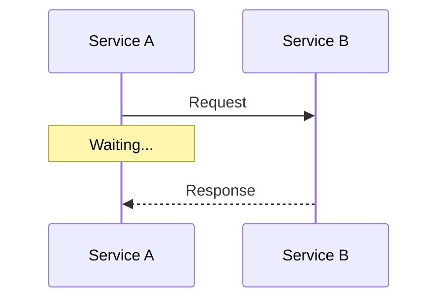
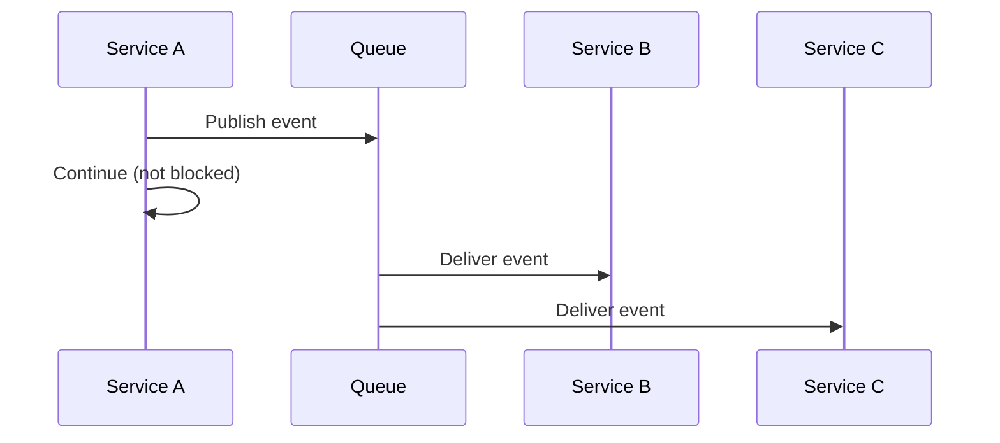
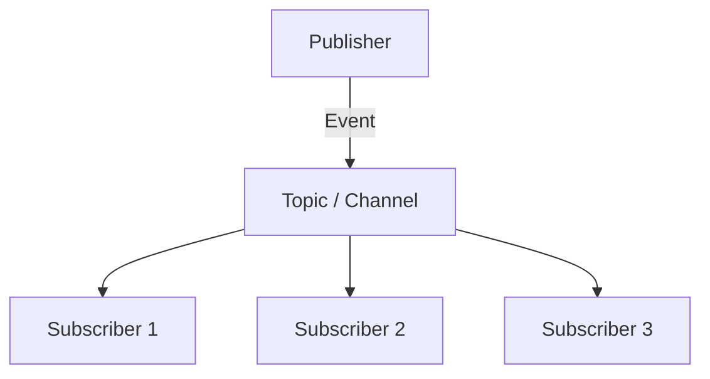

#system-design #hld #patterns #communication

# Component Interaction Patterns

## Intuition (30 sec)

People communicate differently: a phone call (synchronous — you wait for a response), a text message (asynchronous — you don't wait), a group email (broadcast — one to many). Services communicate the same ways, and picking the WRONG one causes cascading failures.

---

## The Three Communication Styles

### 1. Synchronous (Request-Response)



**When to use:**
- Caller NEEDS the response to continue (auth check, payment verification)
- Low latency required (< 100ms)
- Simple request-response flow

**Risks:**
- Caller is blocked while waiting → cascading latency
- If Service B is down → Service A fails too (tight coupling)
- Chain: A → B → C → D = latency accumulates, any failure kills the chain

**Protocols:** REST (HTTP), gRPC, GraphQL

---

### 2. Asynchronous (Fire-and-Forget / Event-Driven)



**When to use:**
- Caller doesn't need an immediate response (send email, process video)
- Work can be retried later (notifications, analytics)
- Decouple services (one service shouldn't know about another)

**Risks:**
- Harder to debug (no immediate response)
- Eventual consistency (subscriber might be behind)
- Need to handle duplicate messages (idempotent consumers)

**Protocols:** Kafka, SQS, RabbitMQ, Redis Pub/Sub

---

### 3. Broadcast (Pub/Sub)



**When to use:**
- One event triggers multiple independent actions
- Adding new consumers shouldn't require changing the publisher
- Event-driven architecture

---

## The Interaction Matrix

For any HLD, fill in this matrix. It makes component relationships explicit:

| Source → Target | Protocol | Sync/Async | Why |
|----------------|----------|------------|-----|
| Client → API Gateway | HTTPS | Sync | User expects response |
| API Gateway → Auth Service | gRPC | Sync | Must verify before proceeding |
| Order Service → Payment Service | gRPC | Sync | Must confirm payment before confirming order |
| Order Service → Notification Service | Kafka | Async | Notification can be delayed |
| Order Service → Analytics | Kafka | Async | Analytics is non-critical |
| Payment Service → Order Service | Kafka (callback) | Async | Payment confirmation event |

**When to draw this:** After your initial architecture diagram. This matrix VALIDATES your design — if you have too many synchronous chains, you've got a fragility problem.

---

## Anti-Patterns

### The Synchronous Chain of Death

```
Client → A → B → C → D → E
Latency: 50 + 50 + 50 + 50 + 50 = 250ms minimum
If C is slow (500ms): entire chain = 550ms
If C is down: everything fails
```

**Fix:** Break the chain. Make D and E async. Only keep sync where the caller truly needs the response.

### The Chatty Service

```
Service A calls Service B 50 times per request (N+1 problem at service level)
```

**Fix:** Batch API (`GET /users?ids=1,2,3,4,5`), or bring the data closer (cache, denormalize).

### The Distributed Monolith

Looks like microservices but every service calls every other service synchronously. All the complexity of microservices, none of the benefits.

**Fix:** Identify service boundaries. Use async events for cross-domain communication. Each service should be independently deployable and runnable.

---

## Decision Framework

```
"Does the caller NEED a response to continue?"
  ├── YES → Synchronous (REST/gRPC)
  │         "Is this in the critical path?"
  │         ├── YES → Add circuit breaker + timeout
  │         └── NO  → Consider making it async instead
  │
  └── NO  → Asynchronous (message queue)
            "Do multiple services need this event?"
            ├── YES → Pub/Sub (Kafka topic)
            └── NO  → Point-to-point queue (SQS)
```

## Links

- [[hld_thinking_system]] — Communication patterns flow from constraints
- [[../03_design_patterns/pub_sub]] — Pub/Sub deep dive
- [[../03_design_patterns/circuit_breaker]] — Protecting sync calls
- [[../03_design_patterns/saga_pattern]] — Coordinating async flows
- [[../02_building_blocks/message_queues]] — Queue technologies
