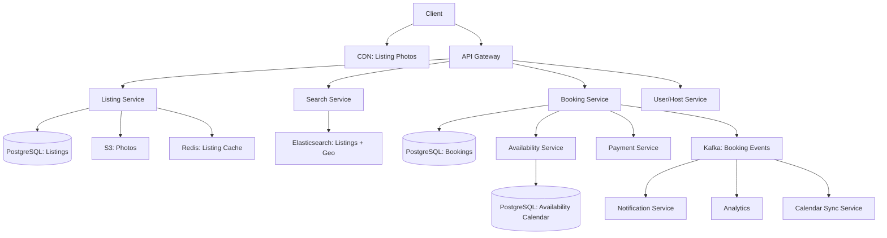

#system-design #hld #example #booking

# HLD: Booking System (Airbnb-like)

## Problem Type: CRUD Platform + Coordination System

---

## Architect's Playback

> "Booking is a CRUD platform with one critical challenge: preventing double-bookings. Two users trying to book the same property for the same dates — only one can win. This needs strong consistency for availability checking and booking confirmation, but search and browsing can be eventually consistent."

## Constraints

| Constraint | Value | Implication |
|-----------|-------|-------------|
| Double-booking prevention | Zero tolerance | Pessimistic/optimistic locking on availability |
| Search | Geo + date + filters | Elasticsearch with geo queries |
| Media | 20+ photos per listing | S3 + CDN |
| Read:write | 500:1 | Heavy caching for listing pages |
| Global | Multi-region users | CDN + multi-region search |

---

## Architecture



---

## Core Challenge: Preventing Double-Booking

### Approach: Pessimistic Locking with SELECT FOR UPDATE

```sql
BEGIN;
  -- Lock the availability rows for these dates
  SELECT * FROM availability
  WHERE listing_id = 123
    AND date BETWEEN '2024-06-01' AND '2024-06-05'
    AND status = 'available'
  FOR UPDATE;

  -- If all dates available, book them
  UPDATE availability SET status = 'booked', booking_id = 456
  WHERE listing_id = 123
    AND date BETWEEN '2024-06-01' AND '2024-06-05';

  INSERT INTO bookings (id, listing_id, guest_id, check_in, check_out, status)
  VALUES (456, 123, 789, '2024-06-01', '2024-06-05', 'CONFIRMED');
COMMIT;
```

`FOR UPDATE` locks the rows — any concurrent booking for the same dates blocks until this transaction completes. First one wins, second one sees dates are no longer available.

### Availability Calendar

```
listing_id | date       | status    | price  | booking_id
123        | 2024-06-01 | available | $150   | null
123        | 2024-06-02 | booked    | $150   | 456
123        | 2024-06-03 | booked    | $150   | 456
123        | 2024-06-04 | blocked   | null   | null  (host blocked)
```

One row per listing per date. Simple, queryable, lockable.

---

## Search Design

Elasticsearch index:
```json
{
  "listing_id": 123,
  "title": "Cozy apartment in Paris",
  "location": { "lat": 48.856, "lon": 2.352 },
  "price_per_night": 150,
  "bedrooms": 2,
  "amenities": ["wifi", "kitchen", "parking"],
  "available_dates": ["2024-06-01", "2024-06-02", "2024-06-03"],
  "rating": 4.8,
  "host_id": 789
}
```

Query: "2 bedrooms in Paris, June 1-3, under $200" → Elasticsearch handles geo + filter + availability.

---

## Stress Test

**"Two users book same dates simultaneously"** → PostgreSQL FOR UPDATE lock ensures only one succeeds. Second user gets "dates no longer available."

**"Host changes price for future dates"** → Update availability table + invalidate Elasticsearch index. Eventual consistency — search might show old price for a few seconds.

**"Add instant booking vs request-to-book"** → Booking Service checks listing's booking_mode. Instant: confirm immediately. Request: create pending booking, notify host, timeout after 24h.

---

## Links

- [[../../01_fundamentals/acid_vs_base]] — ACID for booking consistency
- [[../../02_building_blocks/search_systems]] — Geo search with Elasticsearch
- [[../../03_design_patterns/saga_pattern]] — Booking + payment coordination
