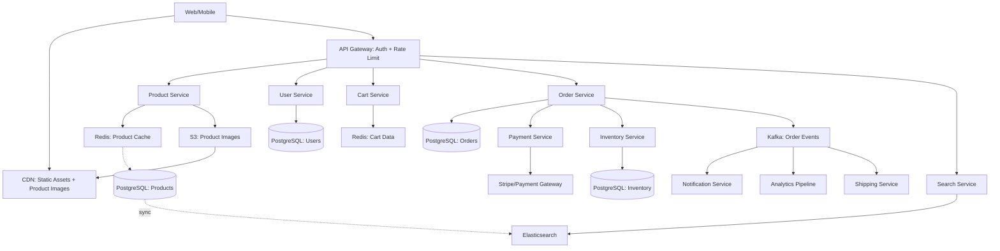

#system-design #hld #example #ecommerce

# HLD: E-Commerce Platform (Amazon-like)

## Problem Type: CRUD Platform + Coordination System (hybrid)

---

## Architect's Playback (The Thinking)

> "E-commerce is a CRUD platform with one critical coordination challenge: the order flow (payment + inventory + shipping must stay consistent). It's extremely read-heavy — users browse 1000x more than they buy. So caching and CDN are essential. Product catalog needs search. Inventory needs strong consistency. User profiles can be eventually consistent."

## Constraints Analysis

| Constraint | Value | Implication |
|-----------|-------|-------------|
| Read:write ratio | 1000:1 | Heavy caching, read replicas |
| Product search | Full-text + filters | Elasticsearch required |
| Payment consistency | Must be ACID | Saga pattern for order flow |
| Product images | Millions of images | S3 + CDN |
| Flash sales | 100x traffic spikes | Auto-scaling + queue buffering |
| Global users | Multi-region | CDN critical, consider multi-region DB |

---

## Architecture



---

## Key Architecture Decisions (ADRs)

### ADR-001: Product Catalog Database
**Decision:** PostgreSQL + Elasticsearch
**Reasoning:** Products have structured data with relationships (categories, variants, reviews). PostgreSQL handles CRUD with ACID. Elasticsearch handles full-text search, filters, and facets. Sync via change data capture events.

### ADR-002: Cart Storage
**Decision:** Redis (not PostgreSQL)
**Reasoning:** Cart is temporary, accessed frequently, needs sub-ms reads. Redis key-value fits perfectly. If Redis dies, cart is lost — acceptable trade-off (user can re-add items, like Amazon's approach).

### ADR-003: Order Flow Coordination
**Decision:** Saga pattern (orchestration)
**Reasoning:** Order placement involves: validate cart → reserve inventory → process payment → confirm order → trigger shipping. Can't use single DB transaction (different services). Saga with compensating actions handles partial failures.

```
Order Saga:
  1. Reserve Inventory → success
  2. Process Payment → success
  3. Confirm Order → done

  If Payment fails:
    Compensate: Release Inventory
    Mark Order: CANCELLED
```

### ADR-004: Flash Sale Strategy
**Decision:** Queue buffering + inventory pre-check
**Reasoning:** Flash sale = 100x traffic spike on one product. Pre-load inventory count in Redis. Decrement atomically (`DECR`). Only route to payment if Redis count > 0. This absorbs the spike without hitting the database.

---

## Data Model (Key Entities)

```
Users: id, email, name, address, created_at
Products: id, name, description, price, category_id, seller_id, image_urls
Inventory: product_id, warehouse_id, quantity, reserved_quantity
Cart: user_id → [{ product_id, quantity }]  (Redis hash)
Orders: id, user_id, status, total, created_at
OrderItems: order_id, product_id, quantity, price_at_purchase
Payments: id, order_id, amount, status, provider_ref
```

---

## Interaction Matrix

| Source → Target | Protocol | Sync/Async | Why |
|----------------|----------|------------|-----|
| Client → API Gateway | HTTPS | Sync | User request |
| Gateway → Product Service | gRPC | Sync | User browsing |
| Gateway → Cart Service | gRPC | Sync | Cart operations |
| Order Service → Inventory | gRPC | Sync | Must reserve before payment |
| Order Service → Payment | gRPC | Sync | Must confirm payment |
| Order Service → Kafka | Kafka | Async | Downstream notifications, analytics |
| Product DB → Elasticsearch | CDC | Async | Search index sync |

---

## Stress Test

**"Traffic spikes 10x during Black Friday"**
→ App servers: auto-scale (stateless). Cache handles read spike. Flash sale products use Redis counter to prevent DB overload.

**"Payment service is slow (5s response)"**
→ Circuit breaker opens after 3 failures. User sees "Payment processing, we'll email confirmation." Order goes to pending queue, retries when payment service recovers.

**"Add a recommendation engine"**
→ New service consumes Kafka order events + browsing events. Builds user-product affinity model. Product Service calls Recommendation Service for personalized results. Existing architecture supports this without changes.

---

## Links

- [[../12_hld_lld_bridge/zoom_ecommerce]] — LLD zoom into Order Service
- [[../../03_design_patterns/saga_pattern]] — Order flow coordination
- [[../../02_building_blocks/search_systems]] — Product search
- [[../../02_building_blocks/caching]] — Product cache strategy
