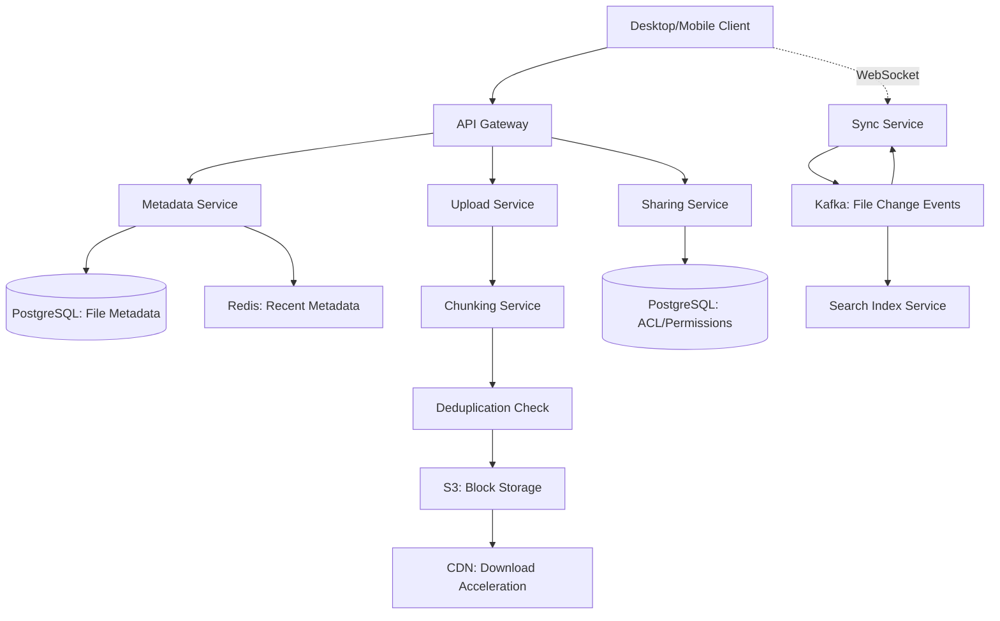

#system-design #hld #example #storage

# HLD: File Storage System (Google Drive / Dropbox)

## Problem Type: Storage System

---

## Architect's Playback

> "File storage has three hard problems: handling large files efficiently (chunking), syncing across devices (conflict resolution), and deduplication (same file uploaded by different users). The system is write-moderate, read-moderate, but storage-intensive. Bandwidth optimization through chunking and delta sync is the core challenge."

## Constraints

| Constraint | Value | Implication |
|-----------|-------|-------------|
| File sizes | 1KB to 10GB | Need chunking for large files |
| Multi-device sync | Real-time | WebSocket for push notifications, conflict resolution |
| Deduplication | Save storage costs | Content-based hashing (SHA-256) |
| Storage | Petabytes | S3/GCS with tiering |
| Bandwidth | Minimize transfers | Delta sync (only changed chunks) |
| Sharing | Files/folders shared with permissions | ACL system |

---

## Architecture



---

## Core Design: Chunking + Delta Sync

### File Chunking

Large files split into 4MB chunks. Each chunk identified by SHA-256 hash.

```
file.zip (100MB) → [chunk_1 (4MB), chunk_2 (4MB), ..., chunk_25 (4MB)]
                    hash: abc123   hash: def456       hash: xyz789
```

**Benefits:**
- Resume interrupted uploads/downloads (re-upload only missing chunks)
- Delta sync: only upload CHANGED chunks when file is modified
- Deduplication: two users upload same file → same chunk hashes → store once

### Delta Sync

```
Original file: [A] [B] [C] [D] [E]  (5 chunks)
Modified file: [A] [B] [C'] [D] [E] (chunk C changed to C')

Upload only: [C']  (1 chunk instead of 5)
```

Client computes chunk hashes locally, compares with server's hash list. Only uploads chunks with different hashes. **Saves ~80% bandwidth for small edits to large files.**

### Conflict Resolution

Two devices edit the same file offline:
```
Server version: v3
Device A edits: v3 → v4a
Device B edits: v3 → v4b

Both sync → CONFLICT
```

**Strategy:** Keep both versions. Show user: "Conflicting copy from Device B." User decides which to keep. (This is what Dropbox does.)

---

## Metadata Model

```
Files: file_id, name, parent_folder_id, owner_id, size, hash, version, status, created_at, updated_at
FileVersions: version_id, file_id, chunk_list, modified_by, created_at
Chunks: chunk_hash (PK), size, ref_count, storage_url
FileChunks: file_version_id, chunk_index, chunk_hash
Shares: file_id, user_id, permission (view/edit/owner)
```

---

## Stress Test

**"User uploads a 10GB video"** → Chunked upload (2,500 × 4MB chunks). Multipart upload to S3. Resume on failure. Progress tracking via metadata.

**"100 users share the same PDF"** → Deduplication: PDF stored once (same chunk hashes). 100 metadata entries pointing to same chunks. ref_count on chunks prevents deletion while any user references them.

**"User edits a file on phone and laptop simultaneously"** → Conflict detection on sync. Both versions saved. User notified of conflict on next sync.

---

## Links

- [[../../02_building_blocks/blob_storage]] — S3 storage layer
- [[../../02_building_blocks/cdn]] — Download acceleration
- [[../../04_system_evolutions/scaling_a_chat_system]] — Similar sync challenges
