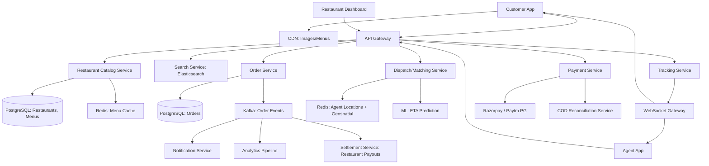

#system-design #hld #example #india #food-delivery

# HLD: Food Delivery Platform — Swiggy / Zomato

## Problem Type: CRUD + Real-time + Coordination

---

## Architect's Playback

> "Food delivery has THREE real-time coordination challenges happening simultaneously: (1) customer waiting for food, (2) restaurant preparing it, and (3) delivery agent navigating traffic. The core challenge is the dispatch algorithm — matching the right agent to the right order considering location, restaurant prep time, and agent load. India-specific: highly variable delivery times due to traffic, cash-on-delivery support, regional language UIs."

## India-Specific Constraints

| Constraint | India Reality | Implication |
|-----------|--------------|-------------|
| Payment | 40%+ COD (Cash on Delivery) | Must track cash reconciliation |
| Language | 22+ official languages | Multi-language support, regional menus |
| Location accuracy | Addresses often vague | GPS + landmarks + delivery instructions |
| Traffic | Highly variable | Dynamic ETA calculation, not static distance |
| Peak hours | Lunch 12-2, Dinner 7-10 | 10x traffic spikes, surge pricing |
| Internet | Variable connectivity | Offline mode for agents, lightweight app |

---

## Architecture



---

## Key Decisions

### Dispatch Algorithm

```
1. Order placed → estimate food prep time (ML model based on restaurant history)
2. When food ~5 min from ready → find agents within 3km of restaurant (Redis GEORADIUS)
3. Score agents: distance + current load + rating + vehicle type
4. Assign top-scored agent
5. If agent declines (15s timeout) → next agent
```

### Real-Time Tracking

Agent app sends GPS every 5 seconds → Location Service → Redis GEOADD → WebSocket push to customer.

### Payment: UPI + COD

```
Payment flow:
  Online (UPI/Card) → Razorpay → confirm order
  COD → Order confirmed immediately → agent collects cash → reconciled daily
```

COD reconciliation: Agent's daily collections matched against orders. Discrepancies flagged.

### ETA Prediction

Not just distance/speed. ML model considers:
- Historical delivery times for this restaurant
- Current traffic conditions (Google Maps API)
- Time of day (lunch rush vs off-peak)
- Weather (rain = slower)

---

## Stress Test

**"Lunch rush: 10x order spike"** → Order Service auto-scales. Kafka absorbs write spikes. Agent dispatch might have fewer agents than orders → queue orders, show "high demand" to customers, enable surge pricing.

**"Restaurant marks items as out-of-stock mid-day"** → Menu cache invalidated, Catalog Service updates. Active orders with that item → notify customer with alternatives or cancel.

**"Agent's phone loses connectivity"** → Last known GPS cached. ETA updated when reconnected. If offline > 10 min → reassign order to another agent.

## Links

- [[../../11_lld/examples/lld_food_delivery]] — LLD zoom: Order state machine in Java
- [[../../12_hld_lld_bridge/zoom_food_delivery]] — HLD → LLD bridge
- [[../../05_case_studies/design_ride_sharing]] — Similar dispatch problem
