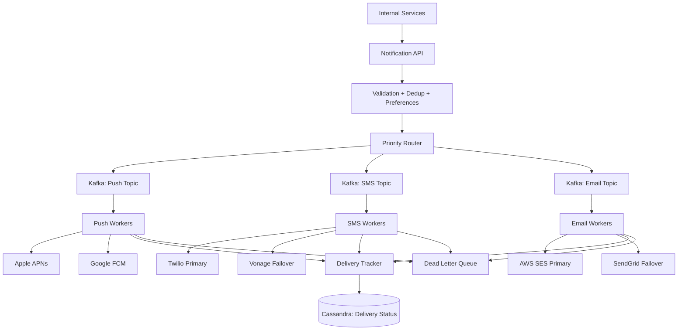

#system-design #hld #example #notifications

# HLD: Notification Platform (Multi-Channel)

## Problem Type: Data Pipeline + Coordination System

---

## Architect's Playback

> "A notification platform is essentially a high-throughput pipeline: events come in, get routed to the right channel (push/SMS/email), templated, rate-limited, and delivered. The core challenge is reliability at scale — 10B+ notifications/day with zero duplication and no lost messages. Provider failover is critical: if Twilio is down, switch to Vonage automatically."

## Architecture

## Key Decisions

**Kafka per channel per priority:** Separate topics allow independent scaling. High-priority push gets more consumers than low-priority email.

**Provider failover with circuit breaker:** If Twilio error rate > 5% for 30 seconds, circuit opens, traffic routes to Vonage. Half-open after 60 seconds: test with 1% of traffic.

**Idempotent delivery:** Every notification gets a unique ID. Workers check "already sent?" before delivering. At-least-once from Kafka + dedup at worker = effectively exactly-once.

**User preferences:** Check before sending: user opted out of marketing email? Don't send. User set quiet hours 10PM-8AM? Delay until 8AM.

**Rate limiting per user:** Max 3 push/hour, 1 SMS/day for marketing. No limit for transactional (OTP, receipts).

---

## Links

- [[../../05_case_studies/design_notification_system]] — Detailed case study
- [[../../02_building_blocks/message_queues]] — Kafka pipeline
- [[../../03_design_patterns/circuit_breaker]] — Provider failover
- [[../../02_building_blocks/rate_limiter]] — Per-user limits
