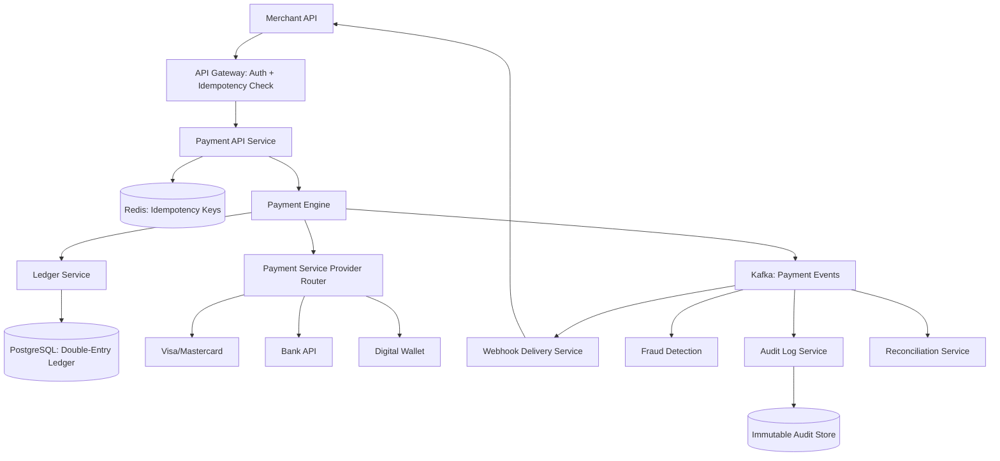
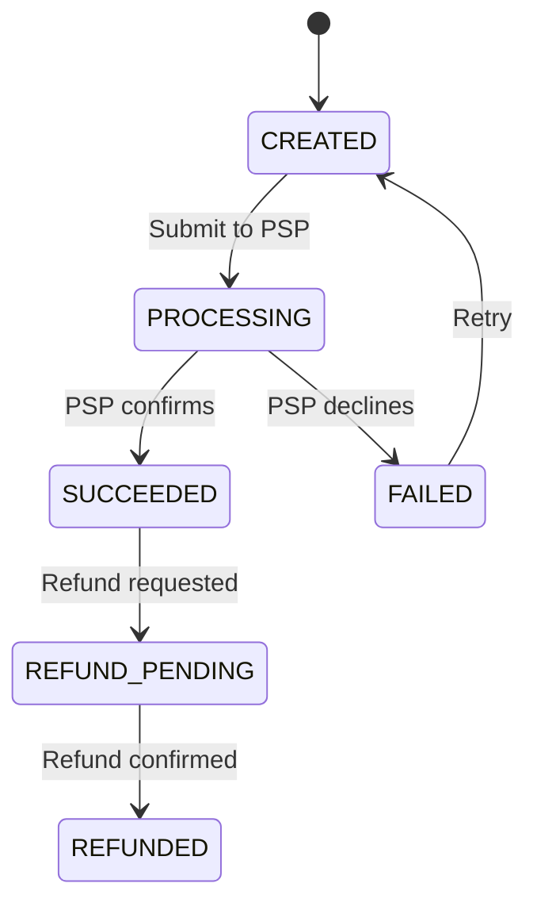

#system-design #hld #example #payments

# HLD: Payment System (Stripe-like)

## Problem Type: Coordination System

---

## Architect's Playback

> "Payments are the most consistency-critical system you can design. ZERO tolerance for data loss or double-charging. Every operation must be idempotent — network retries should never charge twice. Low throughput but extreme reliability requirements. I'll design for correctness first, performance second."

## Constraints

| Constraint | Value | Implication |
|-----------|-------|-------------|
| Consistency | MUST be strong | ACID database, no eventual consistency for money |
| Idempotency | Every operation | Idempotency keys on every write |
| Availability | 99.999% | Multi-AZ, active-passive failover |
| Throughput | ~1,000 TPS | Moderate — single DB is fine |
| Auditability | Every transaction logged | Event sourcing / immutable audit log |
| Compliance | PCI-DSS | Encrypt card data, limit access, audit trails |

---

## Architecture



---

## Key Decisions

### Double-Entry Ledger
Every transaction creates TWO entries (like accounting):
```
Charge $100:
  Debit:  merchant_receivable  +$100
  Credit: customer_payable     -$100

Net balance always equals zero. If entries don't balance → something is wrong → alert immediately.
```

### Idempotency (The Most Critical Pattern)
```
POST /v1/charges
Headers: Idempotency-Key: "order_abc_123"

1. Check Redis: "order_abc_123" exists?
   → YES: Return cached response (don't charge again)
   → NO: Process payment, store result with key, return response
```

Without this: network timeout → merchant retries → customer charged twice.

### Payment State Machine



Every state transition is an **event** stored in the audit log. Full history of every payment.

### Reconciliation
Daily batch job compares:
- Our ledger entries vs payment provider reports
- Finds discrepancies (charged but not recorded, recorded but not charged)
- Alerts for manual resolution

---

## Stress Test

**"Payment provider is down"** → Circuit breaker opens. Payments queue in Kafka. Retry with exponential backoff when provider recovers. Merchant gets webhook when payment completes.

**"Merchant retries the same payment 5 times"** → Idempotency key ensures only one charge. All 5 requests return the same result.

**"Need to add cryptocurrency payments"** → New PSP adapter implementing the PaymentProvider interface. Route based on payment method. Existing architecture unchanged.

---

## Links

- [[../12_hld_lld_bridge/zoom_payment]] — LLD zoom into Payment Engine
- [[../../03_design_patterns/saga_pattern]] — Multi-step payment coordination
- [[../../03_design_patterns/event_sourcing]] — Audit trail pattern
- [[../../01_fundamentals/acid_vs_base]] — Why ACID is non-negotiable here
