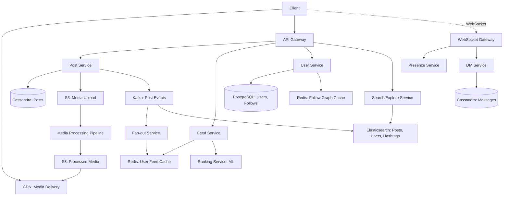

#system-design #hld #example #social-media

# HLD: Social Media Platform (Instagram-like)

## Problem Type: CRUD Platform + Real-Time + Search/Discovery (hybrid)

---

## Architect's Playback

> "Instagram is read-heavy (1000:1). The core challenge is the feed — how to assemble a personalized timeline from millions of posts. Secondary challenges: media processing (image/video uploads), real-time features (DMs, notifications), and discovery (explore page, search). I'll use a CQRS-like approach: write path for posting, separate read path for feed generation."

## Constraints

| Constraint | Value | Implication |
|-----------|-------|-------------|
| DAU | 100M | Massive read scale |
| Posts/day | 50M | ~580 writes/sec (moderate) |
| Feed reads/sec | 500K+ | Pre-computed feed + heavy caching |
| Media | Every post has image/video | S3 + CDN + processing pipeline |
| Real-time | Likes, comments, DMs | WebSocket + pub/sub |
| Ranking | Algorithmic feed | ML ranking service |

---

## Architecture



---

## Key Decisions

### Feed Strategy: Hybrid Fan-Out
- **Users with < 10K followers:** Fan-out on write. Post event → write post ID to each follower's feed cache.
- **Users with > 10K followers (celebrities):** Fan-out on read. Feed Service fetches their latest posts at read time.
- **Feed cache:** Redis sorted set per user, scored by timestamp. Capped at 500 posts.

### Media Pipeline
```
Upload → S3 (raw) → SQS → Workers:
  → Resize (thumbnail, medium, large)
  → Generate multiple formats (WebP, JPEG)
  → Content moderation (ML-based)
  → Extract metadata (EXIF, location)
  → Update post: media_status = "ready"
```

### Follow Graph
- PostgreSQL for source of truth (follows table: follower_id, following_id)
- Redis for cached follow lists (fast fan-out lookup)
- Eventual consistency between PG and Redis (few seconds delay)

### Ranking (Explore/Feed)
- Features: user affinity, post recency, engagement rate, content type
- ML model scores candidate posts
- Feed = ranked list of post IDs → batch fetch post content

---

## Stress Test

**"Celebrity with 50M followers posts"** → Fan-out on read. Their posts aren't pre-written to follower feeds. Feed Service fetches their latest posts and merges with pre-computed feed at read time.

**"Viral post — 1M likes in 1 minute"** → Like counter in Redis (INCR). Batch flush to Cassandra every 5 seconds. Don't update the counter per request in the DB.

**"Add Stories (24-hour expiring content)"** → New Stories Service. Store in Redis with 24h TTL. Stories feed is separate from main feed. CDN serves story media. Architecture supports this naturally.

---

## Links

- [[../../05_case_studies/design_twitter]] — Similar feed system design
- [[../../04_system_evolutions/scaling_a_web_app]] — Scaling path
- [[../../06_trade_offs/push_vs_pull]] — Fan-out decision
