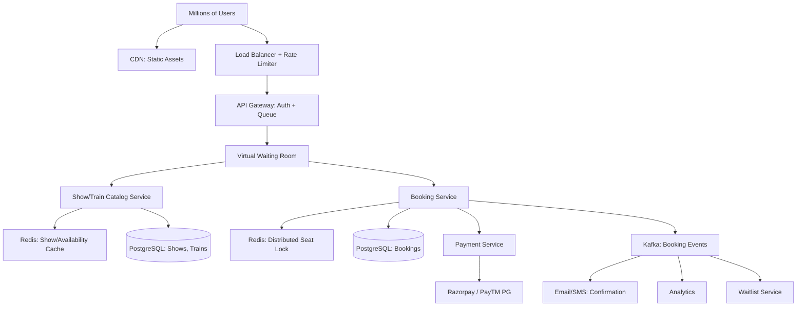

#system-design #hld #example #india #booking

# HLD: Ticket Booking — BookMyShow / IRCTC

## Problem Type: CRUD + Coordination (Extreme Concurrency)

---

## Architect's Playback

> "The defining challenge of IRCTC/BookMyShow is EXTREME concurrency — millions of users competing for limited inventory (train seats / movie seats) at the exact same moment. Tatkal booking on IRCTC sees 15 lakh+ requests in the first minute. The core challenge: prevent double-booking while handling massive concurrent requests without making users wait 30 seconds."

## India-Specific Scale

| Metric | BookMyShow | IRCTC |
|--------|-----------|-------|
| Peak concurrent users | 5M+ (blockbuster release) | 15M+ (Tatkal opening) |
| Inventory | 200-300 seats per screen | 500-1000 seats per train |
| Window | Hours | Seconds (Tatkal sells out in 30-60 sec) |
| Payment | Online | Online + wallets |

---

## Architecture



---

## Key Decisions

### Virtual Waiting Room (Handling Millions of Concurrent Users)

When 15M users hit the booking page at Tatkal opening time:
```
1. Users enter virtual queue (assigned queue position)
2. System admits users in batches (e.g., 10,000 at a time)
3. Admitted users have 5 minutes to complete booking
4. If they don't complete → slot released, next batch admitted
```

This prevents the backend from being overwhelmed. Like a concert ticket queue.

### Seat Locking (Preventing Double-Booking)

**Redis Distributed Lock:**
```
SETNX "seat:show123:A5" "user456" EX 300  // Lock seat A5 for 5 minutes
```

- `SETNX` — Set if Not eXists (atomic!)
- `EX 300` — Auto-expire in 300 seconds (lock timeout)
- Two users selecting same seat simultaneously: only one gets the lock

```
User A: SETNX seat:A5 userA → 1 (success — got the lock)
User B: SETNX seat:A5 userB → 0 (fail — already locked)
```

### Read Path Optimization

Availability check = most frequent operation (users browsing, selecting seats).
```
Availability cached in Redis (not hitting PostgreSQL):
  "availability:show123" → { "A1": "available", "A2": "locked", "A3": "booked" }
```

Updated on every lock/unlock/book event. 99.9% of reads served from Redis.

### Tatkal-Specific: Queue + Lottery

For extreme demand (IRCTC Tatkal):
```
10:00:00 - Window opens
10:00:00 to 10:00:30 - Collect all requests
10:00:30 - Random selection from collected requests
Selected users get 5 minutes to pay
Remaining users → waitlist
```

Fair + prevents "fastest internet wins" problem.

---

## Stress Test

**"15 million users at Tatkal opening"** → Virtual waiting room absorbs the crowd. Only 10K concurrent users actually interact with the booking system. Others see their queue position updating.

**"Payment fails after seat is locked"** → Lock auto-expires (5 min TTL). Seat becomes available again. User can retry.

**"Two users click same seat at exact same millisecond"** → Redis SETNX is atomic. Exactly one gets it. The other sees "seat no longer available."

**"Scalper bots"** → Rate limiting per IP/user, CAPTCHA at booking step, device fingerprinting, randomized queue (not FIFO).

## Links

- [[../../11_lld/examples/lld_booking_system]] — LLD: Seat locking in Java
- [[../../02_building_blocks/rate_limiter]] — Protecting from traffic spikes
- [[../../02_building_blocks/caching]] — Redis for availability
