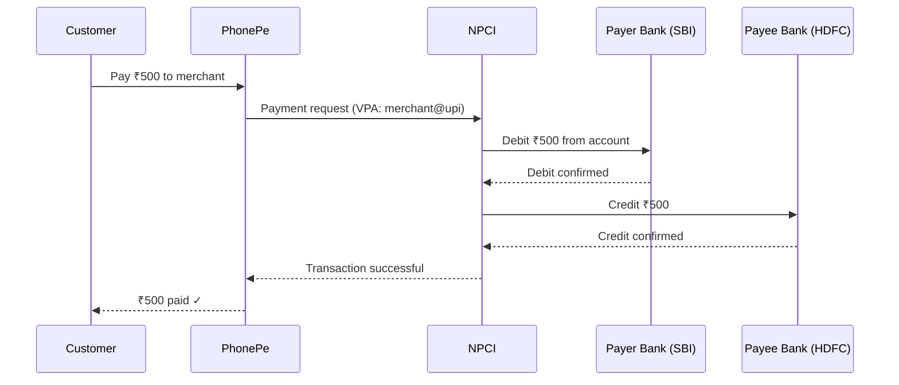
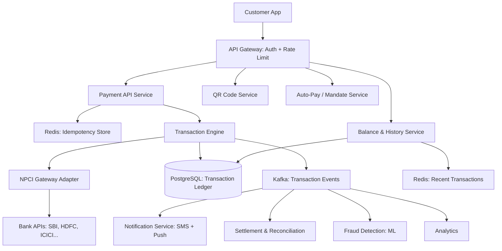

#system-design #hld #example #india #payments

# HLD: UPI Payment System — PhonePe / GPay / Paytm

## Problem Type: Coordination System (India-Specific)

---

## Architect's Playback

> "UPI (Unified Payments Interface) is India's most critical financial infrastructure — 10B+ transactions/month. The core challenge is real-time payment coordination across multiple banks with sub-2-second latency. Every transaction involves: payer's app → NPCI (central switch) → payer's bank → payee's bank → confirmation. Zero tolerance for double-debit or lost transactions. Idempotency is life-or-death."

## How UPI Actually Works



**NPCI** (National Payments Corporation of India) is the central switch routing all UPI transactions.

---

## Architecture (PhonePe-like PSP)



---

## Key Decisions

### Idempotency (Most Critical)

Every UPI transaction gets a unique transaction ID. If the network fails and the app retries:
```
Request 1: txn_id=ABC123 → processed → debit ₹500
Request 2: txn_id=ABC123 → Redis lookup → "already processed" → return cached result
```

Without this: retry = double debit = customer loses ₹500 = regulatory nightmare.

### Transaction State Machine

```
INITIATED → PENDING → SUCCESS / FAILED / TIMEOUT
                         ↓
                      REFUND_INITIATED → REFUNDED
```

Every state change is an immutable event in the ledger. Full audit trail for RBI compliance.

### Handling NPCI Timeouts

NPCI mandates 30-second timeout. If no response:
```
1. Mark transaction as TIMEOUT
2. Send "transaction status check" to NPCI
3. If NPCI says SUCCESS → update to SUCCESS
4. If NPCI says FAILED → update to FAILED, ensure no debit
5. If NPCI unreachable → schedule retry, show "pending" to user
```

### Fraud Detection

Real-time ML model scores every transaction:
- Unusual amount (₹50K when normal is ₹500)
- New device / new location
- Rapid successive transactions
- Time of day anomaly

High-risk → additional OTP verification or block.

### Reconciliation (Daily)

```
Our ledger says: 1,000,000 successful transactions worth ₹50 crore
NPCI report says: 999,998 transactions worth ₹49.99 crore
Discrepancy: 2 transactions worth ₹1000 → investigate manually
```

---

## Scale Numbers (India UPI Reality)

| Metric | Value |
|--------|-------|
| UPI transactions/month | 10B+ (2024) |
| Peak TPS | ~10,000 |
| Success rate target | > 99.5% |
| Latency target | < 2 seconds end-to-end |
| Apps on UPI | 50+ (PhonePe, GPay, Paytm, CRED...) |

---

## Stress Test

**"Bank API is slow (5s instead of 500ms)"** → Circuit breaker opens for that bank. Show "Payment via SBI is temporarily slow." Suggest alternative payment method.

**"UPI server processes same transaction twice"** → Idempotency key rejects duplicate. Ledger shows only one entry. If double-debit happened at bank level → automatic refund triggered.

**"10x spike during Diwali sales"** → Kafka absorbs spike. Auto-scale payment workers. Rate limit per user (max 20 txns/min). Show "high traffic" if queued.

## Links

- [[hld_payment_system]] — General payment system HLD
- [[../../03_design_patterns/saga_pattern]] — Transaction coordination
- [[../../01_fundamentals/acid_vs_base]] — Why ACID is non-negotiable for payments
