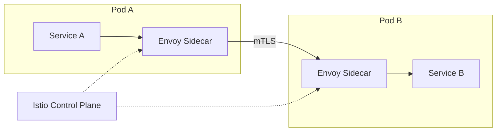

#system-design #hld #microservices #patterns

# Microservices Patterns — Beyond the Basics

## Intuition (30 sec)

Microservices are easy to draw on a whiteboard, hard to run in production. These patterns solve the operational problems that come with distributed services.

---

## Service Mesh (Sidecar Pattern)

**Problem:** Every service needs: mTLS, retries, circuit breaking, observability. Implementing in every service is duplicated effort.

**Solution:** Attach a sidecar proxy to every service. The proxy handles cross-cutting concerns.



**Tools:** Istio (most popular), Linkerd (simpler), Consul Connect

**What the mesh handles:** mTLS encryption, retries with backoff, circuit breaking, load balancing, distributed tracing, traffic splitting (canary deployments) — **zero code changes in your services**.

---

## API Gateway Patterns

### Backend for Frontend (BFF)

```
Mobile App → Mobile BFF → Lightweight JSON responses
Web App → Web BFF → Rich HTML/JSON responses
Admin → Admin BFF → Full data access
```

Each BFF tailored to its client. Prevents one-size-fits-all API bloat.

### API Composition

One client request → gateway fans out to multiple services → combines responses:
```
GET /user-dashboard →
  User Service: profile data
  Order Service: recent orders
  Recommendation Service: suggested products
  → Combine → Single response to client
```

---

## Deployment Patterns

### Blue-Green Deployment

```
Blue (current):  100% traffic → v1.0
Green (new):     0% traffic → v2.0

Switch:          0% → Blue, 100% → Green (instant cutback if issues)
```

**Pro:** Instant rollback. **Con:** Need 2x infrastructure during deployment.

### Canary Deployment

```
v1.0: 95% traffic
v2.0:  5% traffic (canary)

Monitor for 1 hour → errors? → rollback
No errors? → 10% → 25% → 50% → 100%
```

**Pro:** Gradual risk. **Con:** Need traffic splitting (service mesh or LB).

### Rolling Deployment

```
Server 1: v1.0 → v2.0 (update, then route traffic)
Server 2: v1.0 → v2.0
Server 3: v1.0 → v2.0
...
```

**Pro:** No extra infrastructure. **Con:** Slow, mixed versions during rollout.

---

## Data Patterns

### Database per Service

Each microservice owns its data. No direct database access from other services.

```
Order Service → Orders DB (PostgreSQL)
User Service → Users DB (PostgreSQL)
Product Service → Products DB (MongoDB)

Order needs user info? → Call User Service API, NOT query Users DB directly.
```

### Event-Driven Data Sync

Services communicate via events instead of API calls:
```
User Service publishes: UserUpdated { id: 123, name: "New Name" }
Order Service subscribes: updates its local copy of user name
Product Service subscribes: updates its local cache
```

[[03_design_patterns/pub_sub]] + [[03_design_patterns/event_sourcing]]

### Saga Pattern for Distributed Transactions

See [[03_design_patterns/saga_pattern]] — choreography vs orchestration.

---

## Resilience Patterns

| Pattern | What | When |
|---------|------|------|
| **Circuit Breaker** | Stop calling failing service | Downstream is unhealthy |
| **Bulkhead** | Isolate failure to one compartment | Prevent cascade |
| **Retry + Backoff** | Retry with exponential delay | Transient failures |
| **Timeout** | Fail fast if response too slow | Slow dependencies |
| **Fallback** | Return default/cached data on failure | Non-critical features |

### Bulkhead Pattern

```java
// Separate thread pools per dependency
@Bulkhead(name = "paymentService", type = Bulkhead.Type.THREADPOOL)
public PaymentResult processPayment(Order order) {
    return paymentClient.charge(order);
}

// Payment service can use max 10 threads
// Even if payment is slow, it can't consume all threads
// Other services (user, product) have their own pools
```

---

## Observability in Microservices

### Correlation ID (Distributed Tracing)

Every request gets a unique trace ID that flows through all services:
```
Client → [trace: abc-123] → API Gateway
  → [trace: abc-123] → Order Service
    → [trace: abc-123] → Payment Service
    → [trace: abc-123] → Inventory Service
```

In logs, filter by `trace: abc-123` → see the entire request journey across all services.

### The Three Pillars

1. **Metrics:** Prometheus + Grafana (RED: Rate, Errors, Duration per service)
2. **Logs:** Structured JSON, shipped to ELK/Loki, with trace ID
3. **Traces:** Jaeger/Zipkin, flame graph of request journey

---

## When NOT to Use Microservices

| Don't Use When | Why |
|---------------|-----|
| Team < 10 engineers | Overhead > benefit |
| Startup MVP | Ship speed matters more |
| Simple CRUD app | No independent scaling needs |
| Services always deploy together | Not actually independent |

## Links

- [[../04_system_evolutions/from_monolith_to_microservices]] — The full journey
- [[../03_design_patterns/circuit_breaker]] — Resilience
- [[../03_design_patterns/saga_pattern]] — Distributed transactions
- [[../02_building_blocks/api_gateway]] — API patterns
- [[../02_building_blocks/monitoring_and_logging]] — Observability
