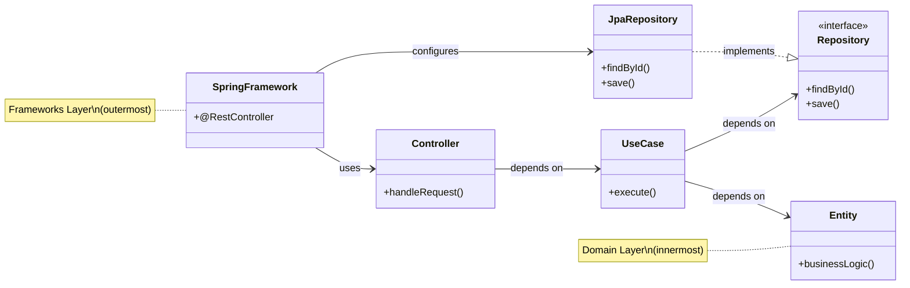

#system-design #lld #architecture

# Clean Architecture — Layers, Dependencies, and the Dependency Rule

## Intuition (30 sec)

Your business logic should NEVER know about your database, framework, or UI. If you swap PostgreSQL for MongoDB, your core logic doesn't change. If you swap Spring for Quarkus, your core logic doesn't change. Clean architecture enforces this separation.

---

## Architecture Overview



---

## The Dependency Rule

**Dependencies point INWARD. Inner layers NEVER know about outer layers.**

```
┌──────────────────────────────────────────┐
│           Frameworks & Drivers            │  ← Spring, PostgreSQL, REST controllers
│  ┌──────────────────────────────────┐    │
│  │      Interface Adapters           │    │  ← Controllers, Gateways, Presenters
│  │  ┌──────────────────────────┐    │    │
│  │  │    Application Layer      │    │    │  ← Use Cases / Service classes
│  │  │  ┌──────────────────┐    │    │    │
│  │  │  │  Domain Layer     │    │    │    │  ← Entities, Value Objects, Business Rules
│  │  │  └──────────────────┘    │    │    │
│  │  └──────────────────────────┘    │    │
│  └──────────────────────────────────┘    │
└──────────────────────────────────────────┘
```

## Java Project Structure

```
com.myapp/
├── domain/                    ← Innermost: pure business logic
│   ├── model/
│   │   ├── Order.java         ← Entity
│   │   ├── Money.java         ← Value Object
│   │   └── OrderStatus.java   ← Enum
│   └── repository/
│       └── OrderRepository.java  ← Interface (NOT implementation)
│
├── application/               ← Use cases / services
│   ├── PlaceOrderUseCase.java
│   └── dto/
│       ├── PlaceOrderRequest.java
│       └── PlaceOrderResponse.java
│
├── infrastructure/            ← Outer: frameworks, DB, external APIs
│   ├── persistence/
│   │   └── JpaOrderRepository.java  ← Implements OrderRepository
│   ├── payment/
│   │   └── StripePaymentGateway.java
│   └── messaging/
│       └── KafkaEventPublisher.java
│
└── api/                       ← Outer: REST controllers
    └── OrderController.java
```

## Key Code Example (Java)

```java
// DOMAIN LAYER — Pure business logic, NO framework imports
public class Order {
    private String id;
    private List<OrderItem> items;
    private OrderStatus status;
    private Money total;

    public void confirm() {
        if (this.status != OrderStatus.PENDING) {
            throw new IllegalStateException("Can only confirm pending orders");
        }
        this.status = OrderStatus.CONFIRMED;
    }

    public Money calculateTotal() {
        return items.stream()
            .map(OrderItem::getSubtotal)
            .reduce(Money.ZERO, Money::add);
    }
}

// Domain interface — infrastructure implements this
public interface OrderRepository {
    Order findById(String id);
    void save(Order order);
}

// APPLICATION LAYER — Orchestrates domain objects
public class PlaceOrderUseCase {
    private final OrderRepository orderRepo;
    private final PaymentGateway paymentGateway;
    private final EventPublisher eventPublisher;

    public PlaceOrderUseCase(OrderRepository repo, PaymentGateway pg, EventPublisher ep) {
        this.orderRepo = repo;        // Injected abstractions
        this.paymentGateway = pg;
        this.eventPublisher = ep;
    }

    public PlaceOrderResponse execute(PlaceOrderRequest request) {
        Order order = new Order(request.getItems());
        Money total = order.calculateTotal();

        paymentGateway.charge(request.getPaymentMethod(), total);
        order.confirm();
        orderRepo.save(order);
        eventPublisher.publish(new OrderPlacedEvent(order.getId()));

        return new PlaceOrderResponse(order.getId(), "CONFIRMED");
    }
}

// INFRASTRUCTURE LAYER — Implements domain interfaces
public class JpaOrderRepository implements OrderRepository {
    private final SpringDataOrderRepo springRepo; // Spring-specific

    public Order findById(String id) {
        OrderEntity entity = springRepo.findById(id).orElseThrow();
        return entity.toDomain(); // Convert to domain object
    }

    public void save(Order order) {
        springRepo.save(OrderEntity.fromDomain(order));
    }
}
```

**Notice:** Domain layer has ZERO imports from Spring, JPA, or any framework. If you swap databases, only `JpaOrderRepository` changes.

---

## The Benefit

| Without Clean Architecture | With Clean Architecture |
|---------------------------|------------------------|
| Business logic mixed with DB queries | Business logic is pure, testable |
| Changing DB requires changing business code | Changing DB only changes infrastructure |
| Can't unit test without database | Unit test with mock repositories |
| Framework upgrade breaks everything | Framework is an outer detail |

## When It's Overkill

- Small scripts, prototypes, MVPs with 1 developer
- CRUD-only apps with no business logic
- If your "domain" is just pass-through to the database

## Links

- [[dependency_injection]] — How to wire the layers together
- [[../patterns/structural]] — Adapter pattern connects layers
- [[../solid_with_refactoring]] — DIP is the foundation of clean architecture
