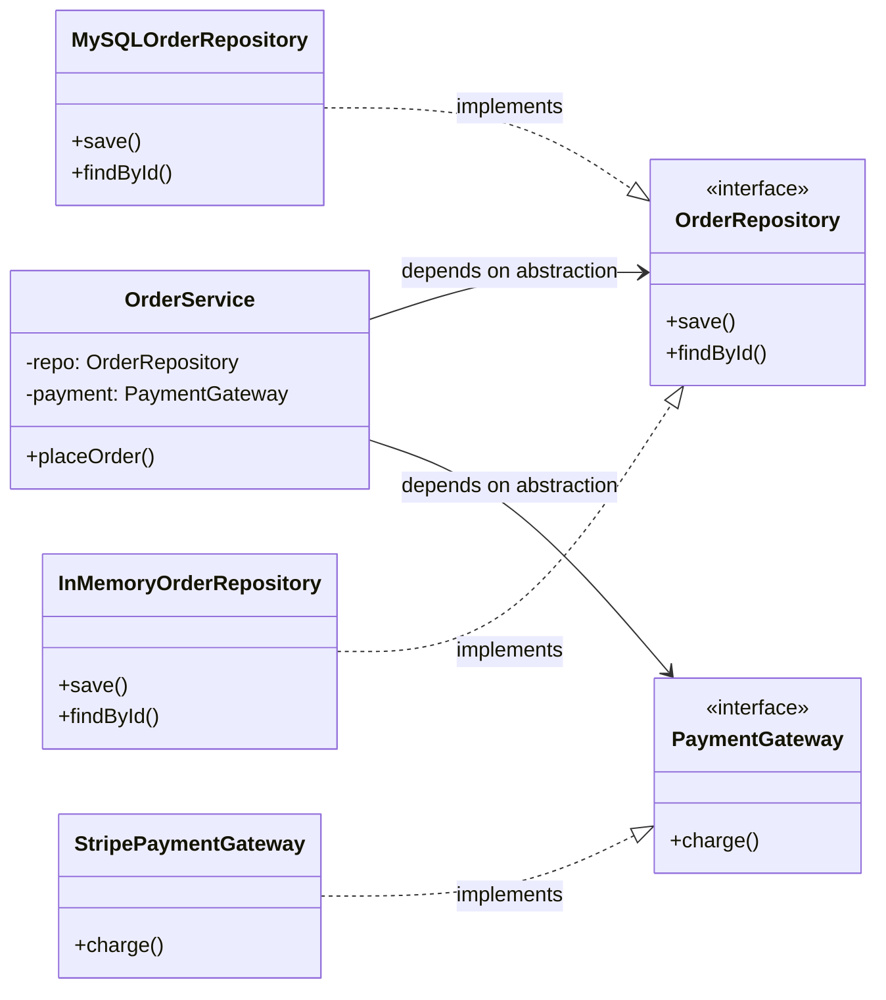

#system-design #lld #architecture #java

# Dependency Injection — Why and How (Java / Spring)

## Intuition (30 sec)

Instead of a class CREATING its own dependencies (cooking its own food), dependencies are GIVEN to it from outside (food delivered). The class says "I need a database" and someone provides it — could be a real database or a mock for testing.

## DI Concept Overview



---

## Without DI (Tightly Coupled)

```java
public class OrderService {
    private MySQLOrderRepository repo = new MySQLOrderRepository(); // Hardcoded!
    private StripePaymentGateway payment = new StripePaymentGateway(); // Hardcoded!

    public void placeOrder(Order order) {
        payment.charge(order.getTotal());
        repo.save(order);
    }
}
// Cannot test without MySQL and Stripe. Cannot swap implementations.
```

## With DI (Loosely Coupled)

```java
public class OrderService {
    private final OrderRepository repo;       // Interface, not implementation
    private final PaymentGateway payment;     // Interface, not implementation

    // Dependencies INJECTED via constructor
    public OrderService(OrderRepository repo, PaymentGateway payment) {
        this.repo = repo;
        this.payment = payment;
    }

    public void placeOrder(Order order) {
        payment.charge(order.getTotal());
        repo.save(order);
    }
}

// Production
OrderService service = new OrderService(
    new MySQLOrderRepository(),
    new StripePaymentGateway()
);

// Testing — zero external dependencies
OrderService testService = new OrderService(
    new InMemoryOrderRepository(),
    new MockPaymentGateway()
);
```

## Spring DI (The Standard in Java)

```java
@Service
public class OrderService {
    private final OrderRepository repo;
    private final PaymentGateway payment;

    @Autowired // Spring injects implementations automatically
    public OrderService(OrderRepository repo, PaymentGateway payment) {
        this.repo = repo;
        this.payment = payment;
    }
}

@Repository
public class JpaOrderRepository implements OrderRepository { ... }

@Component
public class RazorpayGateway implements PaymentGateway { ... }
```

Spring scans for `@Component`/`@Service`/`@Repository`, finds implementations, and wires them.

## Three Types of DI

| Type | How | When |
|------|-----|------|
| **Constructor** | Via constructor params | Default — prefer this always |
| **Setter** | Via setter methods | Optional dependencies |
| **Field** | `@Autowired` on field directly | Avoid — hard to test |

## Links

- [[clean_architecture]] — DI wires the architecture layers
- [[../solid_with_refactoring]] — DI implements Dependency Inversion Principle
- [[../patterns/creational]] — Factory pattern complements DI
