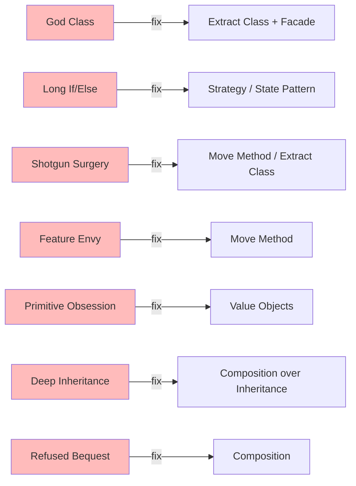

#system-design #lld #smells #refactoring

# Design Smell Catalog — Diagnose and Fix

> Like a doctor's reference: symptom → diagnosis → treatment.

---

## Smell-to-Fix Quick Map



---

## Smell 1: God Class

**Symptom:** One class has 20+ methods, 500+ lines, does everything.
**Diagnosis:** Violates Single Responsibility. Became a dumping ground.
**Treatment:** Identify distinct responsibilities. Extract into separate classes.
**Pattern:** Facade (if you need a unified interface to the split classes)

---

## Smell 2: Long If/Else or Switch Chain

**Symptom:** `if type == "A": ... elif type == "B": ... elif type == "C": ...`
**Diagnosis:** Violates Open/Closed. Adding a new type requires modifying this method.
**Treatment:** Replace conditional with polymorphism.
**Pattern:** Strategy (for interchangeable algorithms) or State (for state-dependent behavior)

---

## Smell 3: Shotgun Surgery

**Symptom:** Adding one feature requires changing 5+ files/classes.
**Diagnosis:** Related logic is scattered across the codebase.
**Treatment:** Group related logic into one class/module.
**Pattern:** Move Method, Extract Class

---

## Smell 4: Feature Envy

**Symptom:** A method in Class A mostly uses data from Class B.
```python
class OrderReport:
    def generate(self, order):
        total = order.subtotal + order.tax - order.discount  # All order's data!
        return f"Total: {total}"
```
**Diagnosis:** The method belongs in Class B, not Class A.
**Treatment:** Move method to the class whose data it uses.
**Fix:** `order.calculate_total()` — let Order own its own logic.

---

## Smell 5: Primitive Obsession

**Symptom:** Using strings/ints for domain concepts: `status = "active"`, `price = 19.99`
**Diagnosis:** No type safety, no behavior, easy to pass wrong values.
**Treatment:** Create value objects.
**Fix:** `Money(19.99, "USD")`, `OrderStatus.ACTIVE`

---

## Smell 6: Deep Inheritance

**Symptom:** `Animal → Mammal → DomesticAnimal → Pet → Dog → GoldenRetriever`
**Diagnosis:** Deep hierarchies are rigid and fragile. Changes at top cascade.
**Treatment:** Prefer composition over inheritance. Use interfaces.
**Fix:** `Dog` has behaviors via composition: `Walkable`, `Feedable`, `Trainable`

---

## Smell 7: Parallel Hierarchies

**Symptom:** Every time you add a class to hierarchy A, you must add one to hierarchy B.
```
Shape → Circle, Rectangle, Triangle
ShapeRenderer → CircleRenderer, RectangleRenderer, TriangleRenderer
```
**Diagnosis:** Two hierarchies are tightly coupled.
**Treatment:** Merge them or use Visitor pattern.

---

## Smell 8: Dead Code / Speculative Generality

**Symptom:** Abstract classes with one implementation. Unused parameters. "We might need this."
**Diagnosis:** YAGNI violation. Code for imaginary requirements.
**Treatment:** Delete it. Add when actually needed.

---

## Smell 9: Inappropriate Intimacy

**Symptom:** Class A directly accesses Class B's private fields or internal data.
**Diagnosis:** Tight coupling. Changes in B break A.
**Treatment:** Define a clean interface. A calls B's public methods.

---

## Smell 10: Refused Bequest

**Symptom:** Subclass inherits methods it doesn't need or overrides to do nothing.
```python
class Stack(ArrayList):  # Stack doesn't need get(index), set(index), etc.
    pass
```
**Diagnosis:** Wrong inheritance relationship. Stack is NOT a list.
**Treatment:** Use composition instead.
**Fix:** Stack HAS-A list (internally), exposes only push/pop/peek.

---

## Quick Lookup Table

| Smell | Key Indicator | Go-To Pattern |
|-------|--------------|---------------|
| God Class | Too many responsibilities | Extract Class |
| Long if/else | Type checking | Strategy / State |
| Shotgun Surgery | One change → many files | Move Method / Extract Class |
| Feature Envy | Method uses other class's data | Move Method |
| Primitive Obsession | Strings for domain concepts | Value Objects |
| Deep Inheritance | 4+ level hierarchy | Composition |
| Refused Bequest | Subclass ignores parent methods | Composition |

## Links

- [[solid_with_refactoring]] — Principles behind these fixes
- [[patterns/smell_to_pattern_map]] — Smell → pattern decision table
- [[one_change_test]] — Validate the fix worked
