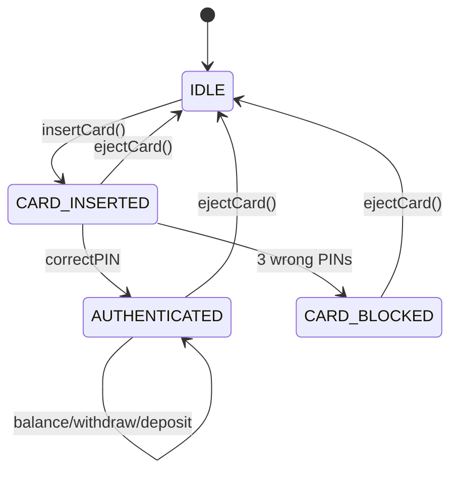
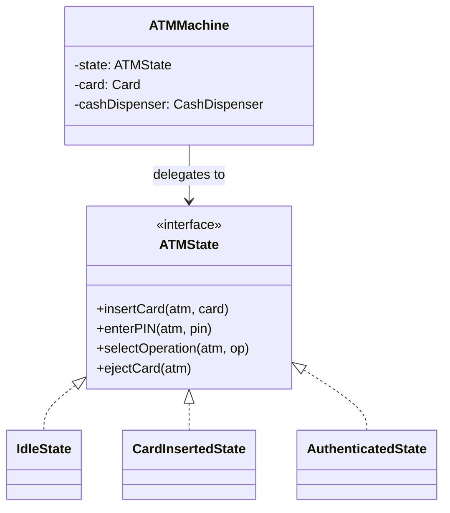

#system-design #lld #state-machine #fintech

# LLD: ATM System

**Type:** State Machine + Financial
**Difficulty:** Medium
**Asked at:** Banks, Fintech, Paytm, PhonePe, Goldman Sachs, JP Morgan

---

## Requirements Clarification

1. What operations? (Withdraw, Balance Check, Deposit, Transfer, PIN Change)
2. Daily withdrawal limit?
3. Multiple accounts per card?
4. Failed PIN attempts policy? (3 attempts then block)
5. Should the ATM dispense exact change with notes? (100s, 500s, 2000s)
6. Multiple ATMs networked to same bank? (Scope: single ATM for now)

**Scope:** Insert card → Enter PIN → Select operation → Execute → Eject card. PIN lock after 3 wrong attempts.

---

## Problem Type
**State Machine** — every user action only makes sense in a specific state. Key patterns: **State**, **Command** (operations), **Strategy** (cash dispensing).

---

## State Machine Diagram

```
IDLE
  │ insertCard()
  ▼
CARD_INSERTED
  │ enterPIN(correct)     enterPIN(wrong×3)
  ▼                       ▼
AUTHENTICATED           CARD_BLOCKED (→ IDLE after eject)
  │
  ├── checkBalance()  → AUTHENTICATED (no state change)
  ├── withdraw()      → DISPENSING_CASH → AUTHENTICATED
  ├── deposit()       → AUTHENTICATED
  ├── changePIN()     → PIN_CHANGE → AUTHENTICATED
  └── ejectCard()     → IDLE
```

---

## Class Diagram

```
ATMMachine
    ├── state: ATMState (interface)
    ├── card: Card
    ├── cashDispenser: CashDispenser
    └── bankService: BankService (interface)

ATMState (interface)
    ├── IdleState
    ├── CardInsertedState
    ├── AuthenticatedState
    └── DispensingState

CashDispenser
    └── uses → CashDispensingStrategy (interface)
               ├── GreedyDispensingStrategy
               └── ExactChangeStrategy

BankService (interface)
    └── MockBankService / RealBankService

Card
    ├── cardNumber: String
    └── account: Account
```

---

## Mermaid Diagrams





---

## Complete Java Implementation

```java
// Card entity
public class Card {
    private final String cardNumber;
    private final String maskedNumber;  // show last 4 digits only
    private int failedAttempts = 0;
    private boolean blocked = false;

    public Card(String cardNumber) {
        this.cardNumber   = cardNumber;
        this.maskedNumber = "****-****-****-" + cardNumber.substring(cardNumber.length() - 4);
    }

    public void recordFailedAttempt() {
        failedAttempts++;
        if (failedAttempts >= 3) blocked = true;
    }

    public void resetAttempts()   { failedAttempts = 0; }
    public boolean isBlocked()    { return blocked; }
    public String getCardNumber() { return cardNumber; }
    public String getMasked()     { return maskedNumber; }
}

// Bank service abstraction (testable)
public interface BankService {
    boolean validatePIN(String cardNumber, String pin);
    double getBalance(String cardNumber);
    boolean withdraw(String cardNumber, double amount);
    boolean deposit(String cardNumber, double amount);
    boolean transfer(String fromCard, String toCard, double amount);
    boolean changePin(String cardNumber, String oldPin, String newPin);
}

// Cash dispenser with strategy
public interface CashDispensingStrategy {
    Map<Integer, Integer> dispense(double amount);  // denomination → count
}

public class GreedyDispensingStrategy implements CashDispensingStrategy {
    private static final int[] DENOMINATIONS = {2000, 500, 200, 100, 50, 20, 10};

    public Map<Integer, Integer> dispense(double amount) {
        Map<Integer, Integer> notes = new LinkedHashMap<>();
        int remaining = (int) amount;
        for (int denom : DENOMINATIONS) {
            if (remaining >= denom) {
                int count = remaining / denom;
                notes.put(denom, count);
                remaining -= count * denom;
            }
        }
        if (remaining != 0)
            throw new InsufficientNotesException("Cannot dispense exact amount: ₹" + amount);
        return notes;
    }
}

public class CashDispenser {
    private double totalCash;
    private final CashDispensingStrategy strategy;

    public CashDispenser(double totalCash, CashDispensingStrategy strategy) {
        this.totalCash = totalCash;
        this.strategy  = strategy;
    }

    public Map<Integer, Integer> dispenseCash(double amount) {
        if (amount > totalCash)
            throw new InsufficientCashException("ATM has insufficient cash. Available: ₹" + totalCash);
        Map<Integer, Integer> notes = strategy.dispense(amount);
        totalCash -= amount;
        return notes;
    }

    public boolean hasSufficientCash(double amount) { return totalCash >= amount; }
    public double getAvailableCash() { return totalCash; }
}

// State interface
public interface ATMState {
    void insertCard(ATMMachine atm, Card card);
    void enterPIN(ATMMachine atm, String pin);
    void selectOperation(ATMMachine atm, String operation);
    void ejectCard(ATMMachine atm);
    String getStateName();
}

// ATM context
public class ATMMachine {
    private ATMState state;
    private Card currentCard;
    private final CashDispenser cashDispenser;
    private final BankService bankService;

    public ATMMachine(CashDispenser dispenser, BankService bankService) {
        this.cashDispenser = dispenser;
        this.bankService   = bankService;
        this.state         = new IdleState();
    }

    public void insertCard(Card card)          { state.insertCard(this, card); }
    public void enterPIN(String pin)           { state.enterPIN(this, pin); }
    public void selectOperation(String op)     { state.selectOperation(this, op); }
    public void ejectCard()                    { state.ejectCard(this); }

    // Getters/setters for states to use
    public void setState(ATMState state)       { this.state = state; }
    public void setCurrentCard(Card card)      { this.currentCard = card; }
    public Card getCurrentCard()               { return currentCard; }
    public CashDispenser getCashDispenser()    { return cashDispenser; }
    public BankService getBankService()        { return bankService; }
    public String getStateName()               { return state.getStateName(); }
}

// IDLE State
public class IdleState implements ATMState {
    public void insertCard(ATMMachine atm, Card card) {
        if (card.isBlocked()) {
            System.out.println("Card " + card.getMasked() + " is blocked. Contact your bank.");
            return;
        }
        atm.setCurrentCard(card);
        atm.setState(new CardInsertedState());
        System.out.println("Card accepted. Please enter your PIN.");
    }
    public void enterPIN(ATMMachine atm, String pin) { System.out.println("Please insert card first"); }
    public void selectOperation(ATMMachine atm, String op) { System.out.println("Please insert card first"); }
    public void ejectCard(ATMMachine atm) { System.out.println("No card inserted"); }
    public String getStateName() { return "IDLE"; }
}

// CARD_INSERTED State
public class CardInsertedState implements ATMState {
    public void insertCard(ATMMachine atm, Card card) { System.out.println("Card already inserted"); }

    public void enterPIN(ATMMachine atm, String pin) {
        Card card = atm.getCurrentCard();
        boolean valid = atm.getBankService().validatePIN(card.getCardNumber(), pin);

        if (valid) {
            card.resetAttempts();
            atm.setState(new AuthenticatedState());
            System.out.println("PIN correct. Select operation: BALANCE / WITHDRAW / DEPOSIT / TRANSFER / EXIT");
        } else {
            card.recordFailedAttempt();
            if (card.isBlocked()) {
                System.out.println("Too many wrong attempts. Card blocked. Please contact your bank.");
                atm.ejectCard();
            } else {
                System.out.printf("Wrong PIN. %d attempt(s) remaining.%n", 3 - card.failedAttempts);
            }
        }
    }

    public void selectOperation(ATMMachine atm, String op) { System.out.println("Enter PIN first"); }

    public void ejectCard(ATMMachine atm) {
        System.out.println("Card ejected: " + atm.getCurrentCard().getMasked());
        atm.setCurrentCard(null);
        atm.setState(new IdleState());
    }

    public String getStateName() { return "CARD_INSERTED"; }
}

// AUTHENTICATED State
public class AuthenticatedState implements ATMState {
    public void insertCard(ATMMachine atm, Card card) { System.out.println("Card already active"); }
    public void enterPIN(ATMMachine atm, String pin) { System.out.println("Already authenticated"); }

    public void selectOperation(ATMMachine atm, String op) {
        String cardNumber = atm.getCurrentCard().getCardNumber();

        switch (op.toUpperCase()) {
            case "BALANCE" -> {
                double balance = atm.getBankService().getBalance(cardNumber);
                System.out.printf("Available balance: ₹%.2f%n", balance);
            }
            case "EXIT" -> atm.ejectCard();
            default -> {
                // Parse operation like "WITHDRAW 5000" or "DEPOSIT 1000"
                String[] parts = op.split(" ");
                if (parts.length == 2) {
                    double amount = Double.parseDouble(parts[1]);
                    handleAmountOperation(atm, parts[0], amount, cardNumber);
                } else {
                    System.out.println("Unknown operation: " + op);
                }
            }
        }
    }

    private void handleAmountOperation(ATMMachine atm, String op, double amount, String cardNumber) {
        switch (op.toUpperCase()) {
            case "WITHDRAW" -> {
                if (!atm.getCashDispenser().hasSufficientCash(amount)) {
                    System.out.println("ATM has insufficient cash for this withdrawal");
                    return;
                }
                if (atm.getBankService().withdraw(cardNumber, amount)) {
                    Map<Integer, Integer> notes = atm.getCashDispenser().dispenseCash(amount);
                    System.out.println("Dispensing ₹" + amount + ":");
                    notes.forEach((denom, count) ->
                        System.out.printf("  ₹%d × %d%n", denom, count));
                } else {
                    System.out.println("Withdrawal failed (insufficient balance or daily limit)");
                }
            }
            case "DEPOSIT" -> {
                if (atm.getBankService().deposit(cardNumber, amount)) {
                    System.out.printf("₹%.0f deposited successfully%n", amount);
                }
            }
        }
    }

    public void ejectCard(ATMMachine atm) {
        System.out.println("Thank you. Card ejected: " + atm.getCurrentCard().getMasked());
        atm.setCurrentCard(null);
        atm.setState(new IdleState());
    }

    public String getStateName() { return "AUTHENTICATED"; }
}
```

---

## Design Patterns Used

| Pattern | Where | Why |
|---------|-------|-----|
| **State** | `ATMState` + state classes | State-specific behavior, clean transitions |
| **Strategy** | `CashDispensingStrategy` | Swap cash dispensing algorithms |
| **Command** | (Extension) `WithdrawCommand` | Support transaction rollback, logging |

---

## Concurrency Handling

```java
// Real ATMs: one user at a time (physical machine)
// For software simulation (e.g. online banking emulator):
public synchronized void insertCard(Card card) { state.insertCard(this, card); }
public synchronized void enterPIN(String pin)  { state.enterPIN(this, pin); }
// Synchronized on ATM instance — only one operation at a time
```

---

## Error Handling & Edge Cases

```java
// 1. Card blocked → reject immediately in IdleState
// 2. 3 wrong PINs → block card, eject
// 3. Insufficient ATM cash → check before deducting bank balance
// 4. Insufficient account balance → BankService returns false
// 5. Network failure to bank → throw BankServiceUnavailableException, do NOT dispense cash
// 6. Cash dispensed but bank deduction fails → this is the critical failure mode
//    Real ATMs: dispense cash FIRST, then deduct. If deduction fails, log for reconciliation
```

---

## One-Change Test

| Change | Impact |
|--------|--------|
| Add PIN change operation | Extend `AuthenticatedState.selectOperation()` case |
| Add daily withdrawal limit | Add check in `BankService.withdraw()` |
| Add multiple card types (credit/debit) | `Card` becomes abstract, `DebitCard`, `CreditCard` extend it |

---

## Follow-up Questions

| Question | Answer |
|----------|--------|
| How to handle network timeout to bank? | Timeout + retry (3 times), then show "Service unavailable" |
| How to support multiple accounts per card? | Add account selection state after authentication |
| How to add card swallow on 3 wrong PINs? | `CardInsertedState` triggers `swallowCard()` on 3rd failure |
| How to log all transactions? | Command pattern — every operation is a `TransactionCommand` logged to audit trail |

---

## Links

- [[../patterns/behavioral]] — State pattern
- [[lld_payment_system]] — Payment processing
- [[../lld_concurrency_patterns]] — Thread safety
- [[../lld_machine_coding_template]] — 90-min guide
