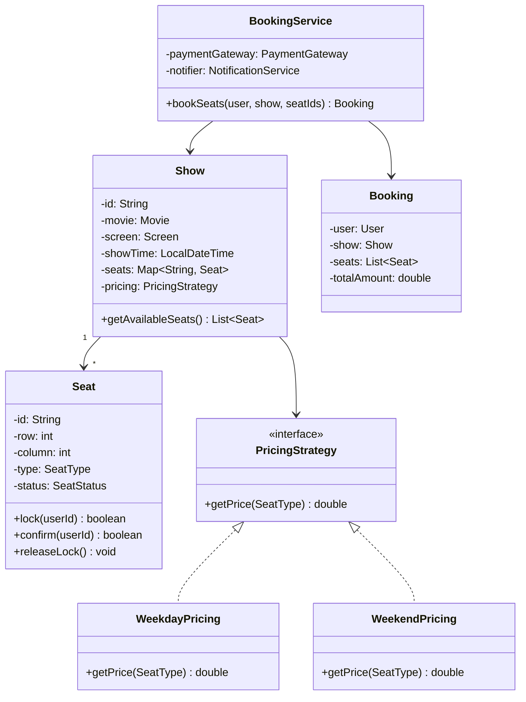
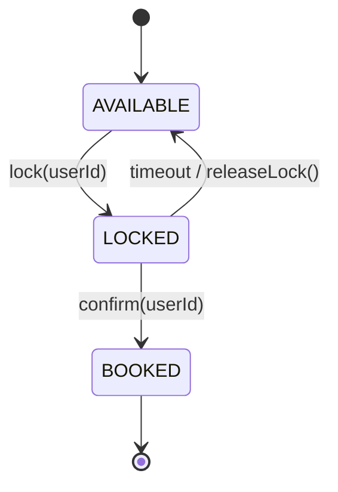

#system-design #lld #example #java #india #resource-management

# LLD: Movie Ticket Booking — BookMyShow (Java)

## Problem Type: Resource Management + Coordination

---

## Requirements

- Browse movies, theatres, showtimes
- Select seats from seat map
- Temporary seat lock during payment (5 min)
- Payment and confirmation
- Prevent double-booking (concurrent users selecting same seat)

---

## Key Java Implementation

```java
// === Seat ===
public enum SeatType { REGULAR, PREMIUM, VIP }
public enum SeatStatus { AVAILABLE, LOCKED, BOOKED }

public class Seat {
    private final String id;
    private final int row;
    private final int column;
    private final SeatType type;
    private volatile SeatStatus status;
    private String lockedByUserId;
    private LocalDateTime lockExpiry;

    public synchronized boolean lock(String userId) {
        if (status != SeatStatus.AVAILABLE) return false;
        this.status = SeatStatus.LOCKED;
        this.lockedByUserId = userId;
        this.lockExpiry = LocalDateTime.now().plusMinutes(5);
        return true;
    }

    public synchronized boolean confirm(String userId) {
        if (status != SeatStatus.LOCKED || !lockedByUserId.equals(userId)) return false;
        this.status = SeatStatus.BOOKED;
        return true;
    }

    public synchronized void releaseLock() {
        if (status == SeatStatus.LOCKED && LocalDateTime.now().isAfter(lockExpiry)) {
            this.status = SeatStatus.AVAILABLE;
            this.lockedByUserId = null;
        }
    }
}

// === Show ===
public class Show {
    private final String id;
    private final Movie movie;
    private final Theatre theatre;
    private final Screen screen;
    private final LocalDateTime showTime;
    private final Map<String, Seat> seats; // seatId -> Seat
    private final PricingStrategy pricing;

    public List<Seat> getAvailableSeats() {
        releaseExpiredLocks();
        return seats.values().stream()
            .filter(s -> s.getStatus() == SeatStatus.AVAILABLE)
            .collect(Collectors.toList());
    }

    private void releaseExpiredLocks() {
        seats.values().forEach(Seat::releaseLock);
    }
}

// === Booking Service ===
public class BookingService {
    private final PaymentGateway paymentGateway;
    private final NotificationService notifier;

    public Booking bookSeats(User user, Show show, List<String> seatIds) {
        // Step 1: Lock seats
        List<Seat> seats = new ArrayList<>();
        for (String seatId : seatIds) {
            Seat seat = show.getSeat(seatId);
            if (!seat.lock(user.getId())) {
                // Rollback already locked seats
                seats.forEach(Seat::releaseLock);
                throw new SeatUnavailableException("Seat " + seatId + " is not available");
            }
            seats.add(seat);
        }

        // Step 2: Calculate total
        double total = seats.stream()
            .mapToDouble(s -> show.getPricing().getPrice(s.getType()))
            .sum();

        // Step 3: Process payment
        PaymentResult result = paymentGateway.charge(user.getPaymentMethod(), total);
        if (!result.isSuccess()) {
            seats.forEach(Seat::releaseLock);
            throw new PaymentFailedException("Payment failed");
        }

        // Step 4: Confirm booking
        seats.forEach(s -> s.confirm(user.getId()));
        Booking booking = new Booking(user, show, seats, total);
        notifier.sendConfirmation(user, booking);
        return booking;
    }
}

// === Pricing Strategy ===
public interface PricingStrategy {
    double getPrice(SeatType type);
}

public class WeekdayPricing implements PricingStrategy {
    public double getPrice(SeatType type) {
        return switch(type) {
            case REGULAR -> 150.0;
            case PREMIUM -> 250.0;
            case VIP -> 500.0;
        };
    }
}

public class WeekendPricing implements PricingStrategy {
    public double getPrice(SeatType type) {
        return switch(type) {
            case REGULAR -> 250.0;
            case PREMIUM -> 400.0;
            case VIP -> 750.0;
        };
    }
}
```

## Mermaid Diagrams





---

## Concurrency: How Seat Lock Prevents Double-Booking

```
User A selects Seat 5A at 10:00:00 → lock(A) → SUCCESS (locked for 5 min)
User B selects Seat 5A at 10:00:02 → lock(B) → FAIL (already locked)
User A completes payment at 10:01:30 → confirm(A) → BOOKED
--- or ---
User A doesn't pay by 10:05:00 → releaseLock() → AVAILABLE again
```

The `synchronized` keyword on `lock()` and `confirm()` prevents race conditions.

---

## Error Handling & Edge Cases

```java
// 1. Show doesn't exist
Show show = showRepository.findById(showId)
    .orElseThrow(() -> new ShowNotFoundException("Show " + showId + " not found"));

// 2. Seat already booked (not just locked)
if (seat.getStatus() == SeatStatus.BOOKED)
    throw new SeatAlreadyBookedException("Seat " + seatId + " is already permanently booked");

// 3. Lock expired — seat available again
if (seat.getStatus() == SeatStatus.LOCKED && seat.getLockExpiry().isBefore(LocalDateTime.now())) {
    seat.setStatus(SeatStatus.AVAILABLE);
    seat.setLockedBy(null);
}

// 4. Different user trying to confirm with same ticket
if (!booking.getUserId().equals(currentUserId))
    throw new UnauthorizedBookingException("You are not the owner of this booking");

// 5. Payment timeout — auto-cancel booking
scheduledExecutor.schedule(() -> {
    if (booking.getStatus() == BookingStatus.PENDING) {
        booking.setStatus(BookingStatus.CANCELLED);
        releaseSeatLocks(booking);
    }
}, 10, TimeUnit.MINUTES);

// 6. Booking for past show
if (show.getShowTime().isBefore(LocalDateTime.now()))
    throw new ShowAlreadyStartedException("Cannot book for a show that has already started");
```

**Edge cases to mention:**
- User books, payment gateway timeout: keep lock for retry window (10 min)
- Show cancelled: auto-refund all bookings
- Seat number changes (seat reassignment): notify user

---

## Follow-up Questions

| Question | Answer Direction |
|----------|-----------------|
| How to handle 1 million concurrent Diwali sale bookings? | Distributed Redis lock per seat, queue-based booking with async confirmation |
| How to add waitlist? | `WaitlistQueue` per show, Observer notifies on cancellation |
| How to support group booking (10 seats together)? | All-or-nothing seat lock — lock all 10 or none (transactional) |
| How to add dynamic pricing (peak hours)? | `DynamicPricingStrategy` based on remaining capacity |
| How to prevent scalpers? | Per-user booking limit, phone verification, CAPTCHA |

---

## Company-Specific Variants

**BookMyShow:**
- Multiple show types: movies, concerts, sports events
- Seat categories: GOLD, SILVER, PLATINUM with different pricing
- Food pre-ordering tied to booking

**IRCTC (trains):**
- Quota-based seat allocation (general, ladies, senior citizen)
- Waitlist with auto-upgrade logic
- PNR generation and status tracking

**Ticketmaster (global):**
- Virtual waiting room for high-demand events
- Dynamic pricing based on demand
- Resale marketplace for tickets

---

## Links

- [[../patterns/behavioral]] — State pattern for seat status, Strategy for pricing
- [[../../10_hld/examples/hld_ticket_booking]] — HLD for BookMyShow/IRCTC
- [[../lld_concurrency_patterns]] — Seat locking patterns
- [[../lld_database_design]] — Full schema for booking system
