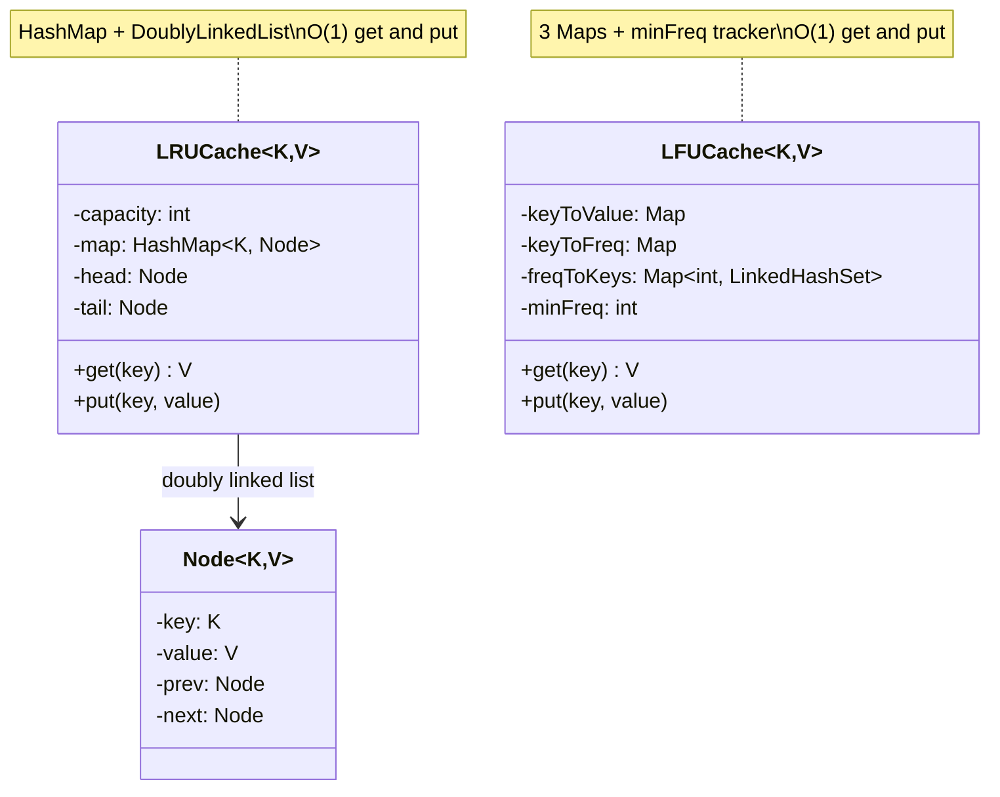

#system-design #lld #cache #data-structures

# LLD: Cache Design (LRU + LFU)

**Type:** Resource Management + Custom Data Structure
**Difficulty:** Medium-Hard
**Asked at:** Google, Meta, Amazon, Microsoft, Uber (very common)

---

## Requirements Clarification

1. What eviction policy? (LRU most common, LFU harder, interviewer may ask both)
2. Cache capacity?
3. Thread-safe?
4. Time complexity requirements? (O(1) for get/put is expected)
5. Expiry/TTL support?

---

## Mermaid Diagrams



---

## Part 1: LRU Cache (Least Recently Used)

**Eviction rule:** When cache is full, evict the item that was LEAST RECENTLY accessed.

### Data Structure: HashMap + Doubly Linked List

```
HashMap: key → Node (O(1) lookup)
DoublyLinkedList: maintains access order
  HEAD ←→ Node1 ←→ Node2 ←→ Node3 ←→ TAIL
  MRU (most recent)         LRU (least recent, evict from here)
```

```java
public class LRUCache<K, V> {
    private final int capacity;
    private final Map<K, Node<K, V>> map = new HashMap<>();

    // Doubly linked list — head = most recently used, tail = least recently used
    private final Node<K, V> head;  // dummy head
    private final Node<K, V> tail;  // dummy tail

    private static class Node<K, V> {
        K key;
        V value;
        Node<K, V> prev, next;

        Node(K key, V value) { this.key = key; this.value = value; }
    }

    public LRUCache(int capacity) {
        this.capacity = capacity;
        this.head     = new Node<>(null, null);
        this.tail     = new Node<>(null, null);
        head.next = tail;
        tail.prev = head;
    }

    // O(1)
    public V get(K key) {
        Node<K, V> node = map.get(key);
        if (node == null) return null;
        moveToFront(node);  // mark as recently used
        return node.value;
    }

    // O(1)
    public void put(K key, V value) {
        if (map.containsKey(key)) {
            Node<K, V> node = map.get(key);
            node.value = value;
            moveToFront(node);
        } else {
            if (map.size() >= capacity) {
                // Evict LRU — node just before tail
                Node<K, V> lru = tail.prev;
                removeNode(lru);
                map.remove(lru.key);
            }
            Node<K, V> newNode = new Node<>(key, value);
            addToFront(newNode);
            map.put(key, newNode);
        }
    }

    public boolean containsKey(K key) { return map.containsKey(key); }
    public int size()                  { return map.size(); }

    private void moveToFront(Node<K, V> node) {
        removeNode(node);
        addToFront(node);
    }

    private void removeNode(Node<K, V> node) {
        node.prev.next = node.next;
        node.next.prev = node.prev;
    }

    private void addToFront(Node<K, V> node) {
        node.next      = head.next;
        node.prev      = head;
        head.next.prev = node;
        head.next      = node;
    }
}
```

### Thread-Safe LRU Cache

```java
public class ConcurrentLRUCache<K, V> {
    private final int capacity;
    private final LinkedHashMap<K, V> cache;
    private final ReadWriteLock lock = new ReentrantReadWriteLock();

    public ConcurrentLRUCache(int capacity) {
        this.capacity = capacity;
        // LinkedHashMap with access-order = true
        this.cache = new LinkedHashMap<>(capacity, 0.75f, true) {
            @Override
            protected boolean removeEldestEntry(Map.Entry<K, V> eldest) {
                return size() > capacity;
            }
        };
    }

    public V get(K key) {
        lock.writeLock().lock();  // write lock because access-order updates modify structure
        try {
            return cache.get(key);
        } finally {
            lock.writeLock().unlock();
        }
    }

    public void put(K key, V value) {
        lock.writeLock().lock();
        try {
            cache.put(key, value);
        } finally {
            lock.writeLock().unlock();
        }
    }
}
```

---

## Part 2: LFU Cache (Least Frequently Used)

**Eviction rule:** When cache is full, evict the item with the LOWEST access frequency. Tie-break: evict the LEAST RECENTLY used among ties.

### Data Structure: HashMap + Frequency Map + Min Frequency Tracker

```
keyToValue: key → value
keyToFreq:  key → frequency
freqToKeys: frequency → LinkedHashSet<key>  (maintains insertion order for LRU tie-break)
minFreq:    tracks current minimum frequency (for O(1) eviction)
```

```java
public class LFUCache<K, V> {
    private final int capacity;
    private final Map<K, V> keyToValue    = new HashMap<>();
    private final Map<K, Integer> keyToFreq = new HashMap<>();
    private final Map<Integer, LinkedHashSet<K>> freqToKeys = new HashMap<>();
    private int minFreq = 0;

    public LFUCache(int capacity) {
        this.capacity = capacity;
    }

    // O(1)
    public V get(K key) {
        if (!keyToValue.containsKey(key)) return null;
        incrementFrequency(key);
        return keyToValue.get(key);
    }

    // O(1)
    public void put(K key, V value) {
        if (capacity <= 0) return;

        if (keyToValue.containsKey(key)) {
            keyToValue.put(key, value);
            incrementFrequency(key);
            return;
        }

        if (keyToValue.size() >= capacity) {
            evict();
        }

        keyToValue.put(key, value);
        keyToFreq.put(key, 1);
        freqToKeys.computeIfAbsent(1, k -> new LinkedHashSet<>()).add(key);
        minFreq = 1;
    }

    private void incrementFrequency(K key) {
        int freq = keyToFreq.get(key);
        keyToFreq.put(key, freq + 1);

        // Remove from current freq bucket
        freqToKeys.get(freq).remove(key);
        if (freqToKeys.get(freq).isEmpty()) {
            freqToKeys.remove(freq);
            if (minFreq == freq) minFreq++;  // update minFreq if bucket empty
        }

        // Add to new freq bucket
        freqToKeys.computeIfAbsent(freq + 1, k -> new LinkedHashSet<>()).add(key);
    }

    private void evict() {
        // Evict LFU entry — first entry in min freq bucket (LRU among ties)
        LinkedHashSet<K> minFreqKeys = freqToKeys.get(minFreq);
        K evictKey = minFreqKeys.iterator().next();
        minFreqKeys.remove(evictKey);
        if (minFreqKeys.isEmpty()) freqToKeys.remove(minFreq);

        keyToValue.remove(evictKey);
        keyToFreq.remove(evictKey);
    }

    public boolean containsKey(K key) { return keyToValue.containsKey(key); }
    public int size()                  { return keyToValue.size(); }
}
```

---

## Part 3: Cache with TTL (Time-To-Live)

```java
public class TTLCache<K, V> {
    private final LRUCache<K, CacheEntry<V>> inner;
    private final long defaultTTLMs;

    private static class CacheEntry<V> {
        final V value;
        final long expiresAt;

        CacheEntry(V value, long ttlMs) {
            this.value     = value;
            this.expiresAt = System.currentTimeMillis() + ttlMs;
        }

        boolean isExpired() { return System.currentTimeMillis() > expiresAt; }
    }

    public TTLCache(int capacity, long defaultTTLMs) {
        this.inner        = new LRUCache<>(capacity);
        this.defaultTTLMs = defaultTTLMs;
    }

    public V get(K key) {
        CacheEntry<V> entry = inner.get(key);
        if (entry == null) return null;
        if (entry.isExpired()) {
            // Lazy expiry — remove on access
            inner.put(key, null);  // or a proper remove method
            return null;
        }
        return entry.value;
    }

    public void put(K key, V value) {
        inner.put(key, new CacheEntry<>(value, defaultTTLMs));
    }

    public void put(K key, V value, long ttlMs) {
        inner.put(key, new CacheEntry<>(value, ttlMs));
    }
}
```

---

## Part 4: Generic Cache Service (Read-Through + Write-Through)

```java
public class CacheService<K, V> {
    private final LRUCache<K, V> cache;
    private final DataSource<K, V> dataSource;  // DB or API

    public interface DataSource<K, V> {
        V load(K key);
        void save(K key, V value);
    }

    public CacheService(int capacity, DataSource<K, V> dataSource) {
        this.cache      = new LRUCache<>(capacity);
        this.dataSource = dataSource;
    }

    // Read-through: cache miss → load from DB → cache → return
    public V get(K key) {
        V cached = cache.get(key);
        if (cached != null) return cached;

        V fromDB = dataSource.load(key);  // cache miss
        if (fromDB != null) cache.put(key, fromDB);
        return fromDB;
    }

    // Write-through: update DB AND cache atomically
    public void put(K key, V value) {
        dataSource.save(key, value);  // DB first
        cache.put(key, value);        // then cache
    }

    // Write-back: update cache immediately, DB asynchronously (risk: data loss on crash)
    public void putAsync(K key, V value) {
        cache.put(key, value);
        CompletableFuture.runAsync(() -> dataSource.save(key, value));
    }

    public void invalidate(K key) {
        cache.get(key);  // trigger eviction indirectly — or add explicit remove()
    }
}
```

---

## Design Patterns Used

| Pattern | Where | Why |
|---------|-------|-----|
| **Decorator** | `TTLCache` wraps `LRUCache` | Add TTL without changing LRU core |
| **Strategy** | `DataSource` interface | Swap DB backend without changing cache |
| **Template Method** | (Extension) `AbstractCache` | Share get/put skeleton, vary eviction |

---

## Complexity Summary

| Operation | LRU | LFU |
|-----------|-----|-----|
| get() | O(1) | O(1) |
| put() | O(1) | O(1) |
| evict() | O(1) | O(1) |
| Space | O(n) | O(n) |

---

## LRU vs LFU

| | LRU | LFU |
|--|--|--|
| Eviction rule | Least recently accessed | Least frequently accessed |
| Good for | Temporal locality (recently used likely used again) | Frequency locality (popular items stay) |
| Weakness | New items evicted if accessed once | Old frequent items stay even if no longer popular |
| Complexity | Simpler | Complex (extra frequency tracking) |
| Used in | Redis (default), CPU caches | Database buffer pools, CDN |

---

## One-Change Test

| Change | Impact |
|--------|--------|
| Add TTL support to LFU | `TTLLFUCache` — add expiry to `LFUCache` entries |
| Add cache statistics (hit rate) | Add `hits`, `misses` counters to `get()` |
| Swap eviction policy | `CacheFactory.create(EvictionPolicy, capacity)` |

---

## Links

- [[../lld_concurrency_patterns]] — Thread-safe cache
- [[../../02_building_blocks/caching]] — HLD caching concepts
- [[../lld_machine_coding_template]] — 90-min guide
