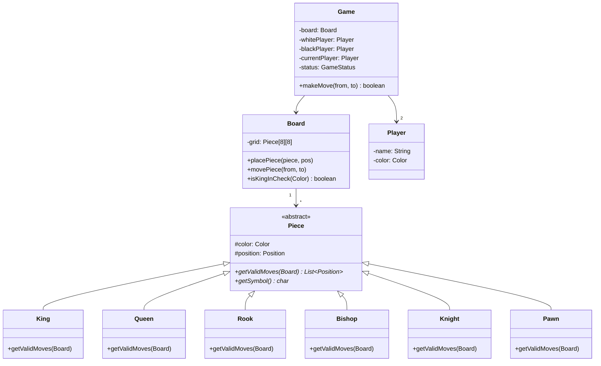

#system-design #lld #example #java #game

# LLD: Chess Game (Java)

## Problem Type: Game/Simulation

---

## Requirements

- Two players, standard 8x8 board
- All piece types with valid move logic
- Turn-based, alternating white/black
- Detect check, checkmate, stalemate
- Move validation (can't move into check)

---

## Key Classes (Java)

```java
// === Piece Hierarchy ===
public abstract class Piece {
    protected final Color color;
    protected Position position;

    public Piece(Color color, Position position) {
        this.color = color;
        this.position = position;
    }

    public abstract List<Position> getValidMoves(Board board);
    public abstract char getSymbol();

    public Color getColor() { return color; }
    public void setPosition(Position pos) { this.position = pos; }
}

public class King extends Piece {
    public King(Color c, Position p) { super(c, p); }
    public char getSymbol() { return color == Color.WHITE ? 'K' : 'k'; }

    public List<Position> getValidMoves(Board board) {
        List<Position> moves = new ArrayList<>();
        int[][] directions = {{-1,-1},{-1,0},{-1,1},{0,-1},{0,1},{1,-1},{1,0},{1,1}};
        for (int[] d : directions) {
            Position target = new Position(position.row + d[0], position.col + d[1]);
            if (board.isValid(target) && !board.hasFriendlyPiece(target, color)) {
                moves.add(target);
            }
        }
        return moves;
    }
}

public class Knight extends Piece {
    public Knight(Color c, Position p) { super(c, p); }
    public char getSymbol() { return color == Color.WHITE ? 'N' : 'n'; }

    public List<Position> getValidMoves(Board board) {
        List<Position> moves = new ArrayList<>();
        int[][] jumps = {{-2,-1},{-2,1},{-1,-2},{-1,2},{1,-2},{1,2},{2,-1},{2,1}};
        for (int[] j : jumps) {
            Position target = new Position(position.row + j[0], position.col + j[1]);
            if (board.isValid(target) && !board.hasFriendlyPiece(target, color)) {
                moves.add(target);
            }
        }
        return moves;
    }
}

// Rook, Bishop, Queen, Pawn follow similar pattern with their movement rules

// === Board ===
public class Board {
    private final Piece[][] grid = new Piece[8][8];

    public void placePiece(Piece piece, Position pos) {
        grid[pos.row][pos.col] = piece;
        piece.setPosition(pos);
    }

    public Piece getPiece(Position pos) { return grid[pos.row][pos.col]; }
    public boolean isValid(Position pos) {
        return pos.row >= 0 && pos.row < 8 && pos.col >= 0 && pos.col < 8;
    }
    public boolean hasFriendlyPiece(Position pos, Color color) {
        Piece p = getPiece(pos);
        return p != null && p.getColor() == color;
    }

    public boolean isKingInCheck(Color color) {
        Position kingPos = findKing(color);
        Color opponent = color == Color.WHITE ? Color.BLACK : Color.WHITE;
        return getAllPieces(opponent).stream()
            .anyMatch(p -> p.getValidMoves(this).contains(kingPos));
    }

    public void movePiece(Position from, Position to) {
        Piece piece = grid[from.row][from.col];
        grid[to.row][to.col] = piece;
        grid[from.row][from.col] = null;
        piece.setPosition(to);
    }

    // findKing(), getAllPieces() helpers...
}

// === Game ===
public class Game {
    private final Board board;
    private final Player whitePlayer;
    private final Player blackPlayer;
    private Player currentPlayer;
    private GameStatus status;

    public Game(Player white, Player black) {
        this.board = new Board();
        this.whitePlayer = white;
        this.blackPlayer = black;
        this.currentPlayer = white;
        this.status = GameStatus.ACTIVE;
        initializeBoard();
    }

    public boolean makeMove(Position from, Position to) {
        if (status != GameStatus.ACTIVE) return false;

        Piece piece = board.getPiece(from);
        if (piece == null || piece.getColor() != currentPlayer.getColor()) return false;
        if (!piece.getValidMoves(board).contains(to)) return false;

        // Simulate move, check if king would be in check
        Piece captured = board.getPiece(to);
        board.movePiece(from, to);
        if (board.isKingInCheck(currentPlayer.getColor())) {
            // Undo — can't move into check
            board.movePiece(to, from);
            if (captured != null) board.placePiece(captured, to);
            return false;
        }

        // Check for checkmate/stalemate
        switchTurn();
        updateGameStatus();
        return true;
    }

    private void switchTurn() {
        currentPlayer = (currentPlayer == whitePlayer) ? blackPlayer : whitePlayer;
    }

    private void updateGameStatus() {
        if (board.isKingInCheck(currentPlayer.getColor())) {
            if (hasNoLegalMoves(currentPlayer.getColor())) {
                status = GameStatus.CHECKMATE;
            }
        } else if (hasNoLegalMoves(currentPlayer.getColor())) {
            status = GameStatus.STALEMATE;
        }
    }
}
```

## Mermaid Class Diagram



---

## Design Patterns Used

| Pattern | Where |
|---------|-------|
| **Template Method** | Piece.getValidMoves() — each piece defines its own movement |
| **Command** | (Extension) MoveCommand for undo/redo |
| **Observer** | (Extension) Notify UI on board changes |

## One-Change Test

| Change | Impact |
|--------|--------|
| Add castling | Add logic in King.getValidMoves() + Game.makeMove() — 2 classes |
| Add move timer | New `GameTimer` class, `Game` checks before each move — 1 new, 1 modified |
| Add en passant | Modify Pawn.getValidMoves() — 1 class |

---

## Concurrency Handling

Chess is typically single-threaded (turns are sequential), but for an **online chess platform**:

**Race condition:** Two players submit moves simultaneously at the same time (network latency).

```java
public class Game {
    private final ReentrantLock moveLock = new ReentrantLock();

    public MoveResult makeMove(String playerId, Position from, Position to) {
        moveLock.lock();
        try {
            // Validate it's this player's turn
            if (!currentPlayer.getId().equals(playerId))
                throw new NotYourTurnException("It's not your turn");

            // Process move
            Piece piece = board.getPiece(from);
            if (piece == null || !piece.getColor().equals(currentPlayer.getColor()))
                throw new InvalidMoveException("No valid piece at " + from);

            List<Position> validMoves = piece.getValidMoves(board, from);
            if (!validMoves.contains(to))
                throw new InvalidMoveException("Invalid move: " + from + " → " + to);

            board.movePiece(from, to);
            switchTurn();
            return new MoveResult(from, to, checkGameStatus());
        } finally {
            moveLock.unlock();
        }
    }
}
```

---

## Error Handling & Edge Cases

```java
// 1. Move on opponent's piece
if (!piece.getColor().equals(currentPlayer.getColor()))
    throw new InvalidMoveException("Cannot move opponent's piece");

// 2. Move that leaves own king in check
board.movePiece(from, to);
if (isInCheck(currentPlayer.getColor())) {
    board.undoMove(from, to);  // rollback
    throw new InvalidMoveException("Move leaves your king in check");
}

// 3. Game already over
if (gameStatus != GameStatus.IN_PROGRESS)
    throw new GameOverException("Game is already " + gameStatus);

// 4. Invalid board position (off-board)
if (to.getRow() < 0 || to.getRow() > 7 || to.getCol() < 0 || to.getCol() > 7)
    throw new InvalidPositionException("Position " + to + " is off the board");

// 5. No piece at source position
if (piece == null) throw new InvalidMoveException("No piece at " + from);
```

**Checkmate detection:**
```java
private boolean isCheckmate(Color color) {
    if (!isInCheck(color)) return false;
    // Try every possible move for every piece — if none escapes check, it's checkmate
    for (Piece piece : board.getPiecesOfColor(color)) {
        for (Position to : piece.getValidMoves(board, piece.getPosition())) {
            board.movePiece(piece.getPosition(), to);
            boolean stillInCheck = isInCheck(color);
            board.undoMove(piece.getPosition(), to);
            if (!stillInCheck) return false;  // found escape
        }
    }
    return true;  // no escape — checkmate
}
```

---

## Follow-up Questions

| Question | Answer Direction |
|----------|-----------------|
| How to implement undo/redo? | Command pattern — `MoveCommand` with `execute()` / `undo()`, history stack |
| How to add move timer (blitz chess)? | `GameTimer` per player, Observer notifies `Game` on timeout |
| How to add castling? | Special move in `King.getValidMoves()` + `Board.performCastle()` |
| How to save/resume a game? | Memento pattern — serialize board state at each move |
| How to add AI opponent? | `AIPlayer implements Player` with `MiniMax` strategy |

---

## Company-Specific Variants

**Google (coding interview):**
- Focus: Clean piece hierarchy, Template Method for movements
- Often asked: "Design just the move validation, skip the full game"
- Watch for: Over-engineering (don't add AI unless asked)

**Microsoft:**
- Full game with game loop, winner detection
- Often extends to: "Now add support for 4-player chess" → discuss Board extension

---

## Links

- [[../patterns/behavioral]] — Template Method, Command patterns
- [[../problem_taxonomy_lld]] — Game/Simulation type
- [[../lld_concurrency_patterns]] — Locking for online multiplayer
- [[../patterns/behavioral]] — Memento for game state save/restore
