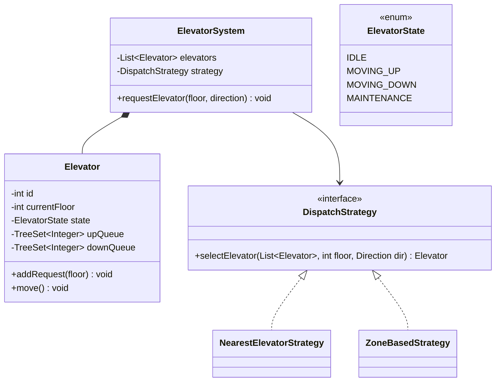

#system-design #lld #example #java #state-machine

# LLD: Elevator System (Java)

## Problem Type: State Machine + Scheduling

---

## Requirements

- Building with N floors and M elevators
- Users request elevator from any floor (up/down button)
- Elevator schedules requests efficiently
- Handle concurrent requests
- Display current floor and direction

---

## Class Diagram



---

## Java Implementation

```java
public enum Direction { UP, DOWN }
public enum ElevatorState { IDLE, MOVING_UP, MOVING_DOWN, MAINTENANCE }

public class Elevator {
    private final int id;
    private int currentFloor;
    private ElevatorState state;
    private final TreeSet<Integer> upQueue;    // Floors to visit going UP (sorted ascending)
    private final TreeSet<Integer> downQueue;  // Floors to visit going DOWN (sorted descending)

    public Elevator(int id) {
        this.id = id;
        this.currentFloor = 0;
        this.state = ElevatorState.IDLE;
        this.upQueue = new TreeSet<>();
        this.downQueue = new TreeSet<>(Collections.reverseOrder());
    }

    public synchronized void addRequest(int floor) {
        if (floor > currentFloor) upQueue.add(floor);
        else if (floor < currentFloor) downQueue.add(floor);
        // If floor == currentFloor, open doors (already here)
        if (state == ElevatorState.IDLE) {
            state = floor >= currentFloor ? ElevatorState.MOVING_UP : ElevatorState.MOVING_DOWN;
        }
    }

    public synchronized void move() {
        switch (state) {
            case MOVING_UP:
                if (!upQueue.isEmpty()) {
                    currentFloor = upQueue.first();
                    upQueue.remove(currentFloor);
                    System.out.println("Elevator " + id + " at floor " + currentFloor);
                } else if (!downQueue.isEmpty()) {
                    state = ElevatorState.MOVING_DOWN;
                } else {
                    state = ElevatorState.IDLE;
                }
                break;
            case MOVING_DOWN:
                if (!downQueue.isEmpty()) {
                    currentFloor = downQueue.first(); // highest in reverse order
                    downQueue.remove(currentFloor);
                    System.out.println("Elevator " + id + " at floor " + currentFloor);
                } else if (!upQueue.isEmpty()) {
                    state = ElevatorState.MOVING_UP;
                } else {
                    state = ElevatorState.IDLE;
                }
                break;
            case IDLE:
                break;
        }
    }

    public int getCurrentFloor() { return currentFloor; }
    public ElevatorState getState() { return state; }
    public int getId() { return id; }
}

// === Dispatch Strategy ===
public interface DispatchStrategy {
    Elevator selectElevator(List<Elevator> elevators, int floor, Direction direction);
}

public class NearestElevatorStrategy implements DispatchStrategy {
    public Elevator selectElevator(List<Elevator> elevators, int floor, Direction dir) {
        return elevators.stream()
            .filter(e -> e.getState() != ElevatorState.MAINTENANCE)
            .min(Comparator.comparingInt(e -> Math.abs(e.getCurrentFloor() - floor)))
            .orElseThrow(() -> new RuntimeException("No available elevator"));
    }
}

// === Elevator System ===
public class ElevatorSystem {
    private final List<Elevator> elevators;
    private final DispatchStrategy strategy;

    public ElevatorSystem(int numElevators, DispatchStrategy strategy) {
        this.strategy = strategy;
        this.elevators = IntStream.range(0, numElevators)
            .mapToObj(Elevator::new)
            .collect(Collectors.toList());
    }

    public void requestElevator(int floor, Direction direction) {
        Elevator elevator = strategy.selectElevator(elevators, floor, direction);
        elevator.addRequest(floor);
        System.out.println("Assigned elevator " + elevator.getId() + " for floor " + floor);
    }
}
```

---

## Scheduling Algorithm: SCAN (Elevator Algorithm)

Like a disk arm — go UP serving all requests, then DOWN serving all requests:
```
Current: Floor 5, going UP
UP queue: [7, 10, 15]
DOWN queue: [3, 1]

Sequence: 5 → 7 → 10 → 15 → (reverse) → 3 → 1
```

This is implemented via the two sorted TreeSets — upQueue (ascending) and downQueue (descending).

## One-Change Test

| Change | Classes Modified |
|--------|-----------------|
| Add VIP priority elevator | 1 new: `VIPDispatchStrategy implements DispatchStrategy` |
| Add weight limit | Add `weight` field to Elevator, check in `addRequest` |
| Add express elevator (skips floors) | 1 new: `ExpressElevator extends Elevator` |

---

## Concurrency Handling

**Race condition:** Multiple floors call the elevator simultaneously while it's moving.

```java
// Elevator's queues are accessed from multiple threads (floor button presses)
public class Elevator {
    private final TreeSet<Integer> upQueue   = new TreeSet<>();
    private final TreeSet<Integer> downQueue = new TreeSet<>(Collections.reverseOrder());
    private final ReentrantLock lock         = new ReentrantLock();

    public void addRequest(int floor) {
        lock.lock();
        try {
            if (floor > currentFloor) upQueue.add(floor);
            else downQueue.add(floor);
        } finally {
            lock.unlock();
        }
    }

    public synchronized int getNextFloor() {
        lock.lock();
        try {
            if (direction == Direction.UP && !upQueue.isEmpty()) return upQueue.first();
            if (upQueue.isEmpty() && !downQueue.isEmpty()) {
                direction = Direction.DOWN;
                return downQueue.first();
            }
            return currentFloor;  // idle
        } finally {
            lock.unlock();
        }
    }
}
```

---

## Error Handling & Edge Cases

```java
// 1. Invalid floor request
if (floor < 0 || floor >= totalFloors)
    throw new InvalidFloorException("Floor " + floor + " does not exist");

// 2. Elevator out of service (maintenance)
if (status == ElevatorStatus.MAINTENANCE)
    throw new ElevatorUnavailableException("Elevator " + id + " is under maintenance");

// 3. No elevators available in building
if (availableElevators.isEmpty())
    throw new NoElevatorAvailableException("All elevators are busy or in maintenance");

// 4. Weight limit exceeded (if implemented)
if (currentWeight + passenger.getWeight() > MAX_WEIGHT_KG)
    throw new WeightLimitExceededException("Elevator at capacity");
```

**Edge cases to mention:**
- Emergency stop: override all queues, go to ground floor
- Power outage: land at nearest floor, open doors
- Door stuck: retry 3 times, alert maintenance, mark out-of-service

---

## Follow-up Questions

| Question | Answer Direction |
|----------|-----------------|
| How to handle N elevators in a building? | `ElevatorController` managing a pool, dispatch strategy picks best one |
| How to minimize wait time? | `OptimalDispatchStrategy` — assign elevator with shortest estimated time |
| Add VIP floor (penthouse)? | `VIPElevator extends Elevator` — serves only certain floors |
| How to handle emergency? | Observer pattern — fire alarm subscriber triggers all elevators to ground |
| How to log all movements for maintenance? | Command pattern — every move is a logged Command |

---

## Company-Specific Variants

**Microsoft / Amazon (office building context):**
- Peak hour optimization (9am, 6pm)
- Badge-based floor access (not everyone can go to all floors)
- Meeting room floor priority

**Google (Googleplex style):**
- Bicycle-friendly elevators (larger capacity)
- Floor capacity limits (fire code)
- Integration with badge swipe — predict destination floor

---

## Links

- [[../patterns/behavioral]] — State pattern for elevator states
- [[../patterns/behavioral]] — Strategy pattern for dispatch
- [[../lld_thinking_system]] — Design pipeline
- [[../lld_concurrency_patterns]] — ReentrantLock usage
