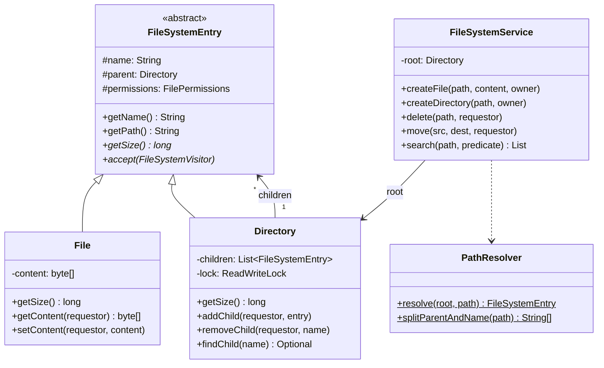

#system-design #lld #composite #tree

# LLD: In-Memory File System

**Type:** Hierarchical (Tree structure)
**Difficulty:** Medium-Hard
**Asked at:** Google, Dropbox, Box, Microsoft OneDrive, Adobe

---

## Requirements Clarification

1. In-memory or with persistence to disk? (in-memory for this design)
2. Are file permissions per-user? (yes — read/write/execute per owner/group/others)
3. Are symbolic links supported? (out of scope; mention it)
4. What is the max file size or directory depth limit?
5. Are search capabilities needed? (yes — search by name or content predicate)
6. Is version history needed? (out of scope; mention snapshotting as extension)

**Scope:** Create/read/delete/move/copy files and directories, enforce permissions, search by predicate, resolve absolute paths. Thread-safe for concurrent reads and exclusive writes.

---

## Problem Type

**Composite + Tree** — File and Directory are treated uniformly through a common abstraction. Key insight: `Directory.getSize()` = recursive sum of children; `File.getSize()` = its own byte count. Both support the same interface.

---

## Class Diagram

```
FileSystemEntry (abstract)
    ├── name: String
    ├── parent: Directory
    ├── permissions: FilePermissions
    ├── createdAt: LocalDateTime
    ├── + getName(): String
    ├── + getPath(): String
    ├── + getSize(): long          ← polymorphic
    └── + accept(Visitor): void   ← Visitor hook

         ┌─────────────┴──────────────┐
       File                       Directory
    ├── content: byte[]          ├── children: List<FileSystemEntry>
    └── getSize() = content.length└── getSize() = sum(children.getSize())

FilePermissions
    ├── owner: String
    ├── canRead: boolean
    ├── canWrite: boolean
    └── canExecute: boolean

FileSystemService
    ├── root: Directory
    ├── createFile(path, content, owner)
    ├── createDirectory(path, owner)
    ├── delete(path, requestor)
    ├── move(srcPath, destPath, requestor)
    ├── copy(srcPath, destPath, requestor)
    └── search(startPath, predicate): List<FileSystemEntry>

PathResolver
    └── resolve(root, absolutePath): FileSystemEntry
```

### Mermaid Class Diagram



---

## Core Interfaces & Abstractions

```java
// Visitor pattern — operations without modifying entry classes
public interface FileSystemVisitor {
    void visitFile(File file);
    void visitDirectory(Directory directory);
}

// Composite entry
public abstract class FileSystemEntry {
    public abstract long getSize();
    public abstract void accept(FileSystemVisitor visitor);
}

// Checked exception for all FS operations
public class FileSystemException extends RuntimeException {
    public FileSystemException(String message) { super(message); }
}

public class PermissionDeniedException extends FileSystemException {
    public PermissionDeniedException(String path) {
        super("Permission denied: " + path);
    }
}
```

---

## Complete Java Implementation

```java
import java.time.LocalDateTime;
import java.util.*;
import java.util.concurrent.locks.ReadWriteLock;
import java.util.concurrent.locks.ReentrantReadWriteLock;
import java.util.function.Predicate;
import java.util.stream.Collectors;

// ─── Exceptions ───────────────────────────────────────────────────────────────

class FileSystemException extends RuntimeException {
    public FileSystemException(String msg) { super(msg); }
}
class PermissionDeniedException extends FileSystemException {
    public PermissionDeniedException(String path) { super("Permission denied: " + path); }
}
class FileNotFoundException extends FileSystemException {
    public FileNotFoundException(String path) { super("Not found: " + path); }
}
class FileAlreadyExistsException extends FileSystemException {
    public FileAlreadyExistsException(String path) { super("Already exists: " + path); }
}

// ─── Permissions ──────────────────────────────────────────────────────────────

class FilePermissions {
    private final String owner;
    private final boolean canRead;
    private final boolean canWrite;
    private final boolean canExecute;

    public FilePermissions(String owner, boolean canRead, boolean canWrite, boolean canExecute) {
        this.owner = owner;
        this.canRead = canRead;
        this.canWrite = canWrite;
        this.canExecute = canExecute;
    }

    public static FilePermissions ownerFullAccess(String owner) {
        return new FilePermissions(owner, true, true, false);
    }

    public boolean checkRead(String requestor) {
        return requestor.equals(owner) && canRead;
    }
    public boolean checkWrite(String requestor) {
        return requestor.equals(owner) && canWrite;
    }
    public String getOwner() { return owner; }

    @Override
    public String toString() {
        return String.format("%s%s%s",
            canRead ? "r" : "-", canWrite ? "w" : "-", canExecute ? "x" : "-");
    }
}

// ─── Visitor ─────────────────────────────────────────────────────────────────

interface FileSystemVisitor {
    void visitFile(File file);
    void visitDirectory(Directory directory);
}

// ─── Abstract Entry (Component) ───────────────────────────────────────────────

abstract class FileSystemEntry {
    protected String name;
    protected Directory parent;
    protected FilePermissions permissions;
    protected final LocalDateTime createdAt;

    public FileSystemEntry(String name, FilePermissions permissions) {
        this.name = name;
        this.permissions = permissions;
        this.createdAt = LocalDateTime.now();
    }

    public abstract long getSize();
    public abstract void accept(FileSystemVisitor visitor);

    public String getName() { return name; }

    public String getPath() {
        if (parent == null) return "/";
        String parentPath = parent.getPath();
        return parentPath.equals("/") ? "/" + name : parentPath + "/" + name;
    }

    public FilePermissions getPermissions()        { return permissions; }
    public Directory getParent()                   { return parent; }
    public void setParent(Directory parent)        { this.parent = parent; }
    public LocalDateTime getCreatedAt()            { return createdAt; }
}

// ─── File (Leaf) ─────────────────────────────────────────────────────────────

class File extends FileSystemEntry {
    private byte[] content;

    public File(String name, byte[] content, FilePermissions permissions) {
        super(name, permissions);
        this.content = content != null ? content : new byte[0];
    }

    @Override
    public long getSize() { return content.length; }

    @Override
    public void accept(FileSystemVisitor visitor) { visitor.visitFile(this); }

    public byte[] getContent(String requestor) {
        if (!permissions.checkRead(requestor)) throw new PermissionDeniedException(getPath());
        return Arrays.copyOf(content, content.length);
    }

    public void setContent(String requestor, byte[] newContent) {
        if (!permissions.checkWrite(requestor)) throw new PermissionDeniedException(getPath());
        this.content = newContent != null ? newContent : new byte[0];
    }
}

// ─── Directory (Composite) ────────────────────────────────────────────────────

class Directory extends FileSystemEntry {
    private final List<FileSystemEntry> children = new ArrayList<>();
    private final ReadWriteLock lock = new ReentrantReadWriteLock();

    public Directory(String name, FilePermissions permissions) {
        super(name, permissions);
    }

    @Override
    public long getSize() {
        lock.readLock().lock();
        try {
            return children.stream().mapToLong(FileSystemEntry::getSize).sum();
        } finally {
            lock.readLock().unlock();
        }
    }

    @Override
    public void accept(FileSystemVisitor visitor) {
        visitor.visitDirectory(this);
        lock.readLock().lock();
        try {
            children.forEach(child -> child.accept(visitor));
        } finally {
            lock.readLock().unlock();
        }
    }

    public void addChild(String requestor, FileSystemEntry entry) {
        if (!permissions.checkWrite(requestor)) throw new PermissionDeniedException(getPath());
        lock.writeLock().lock();
        try {
            boolean exists = children.stream().anyMatch(c -> c.getName().equals(entry.getName()));
            if (exists) throw new FileAlreadyExistsException(getPath() + "/" + entry.getName());
            entry.setParent(this);
            children.add(entry);
        } finally {
            lock.writeLock().unlock();
        }
    }

    public void removeChild(String requestor, String childName) {
        if (!permissions.checkWrite(requestor)) throw new PermissionDeniedException(getPath());
        lock.writeLock().lock();
        try {
            boolean removed = children.removeIf(c -> c.getName().equals(childName));
            if (!removed) throw new FileNotFoundException(getPath() + "/" + childName);
        } finally {
            lock.writeLock().unlock();
        }
    }

    public Optional<FileSystemEntry> findChild(String name) {
        lock.readLock().lock();
        try {
            return children.stream().filter(c -> c.getName().equals(name)).findFirst();
        } finally {
            lock.readLock().unlock();
        }
    }

    // Returns snapshot — safe for iteration outside lock
    public List<FileSystemEntry> getChildren() {
        lock.readLock().lock();
        try {
            return new ArrayList<>(children);
        } finally {
            lock.readLock().unlock();
        }
    }
}

// ─── Path Resolver ────────────────────────────────────────────────────────────

class PathResolver {
    // Resolves "/home/user/docs/file.txt" into the corresponding FileSystemEntry
    public static FileSystemEntry resolve(Directory root, String absolutePath) {
        if (absolutePath == null || absolutePath.isEmpty() || absolutePath.equals("/")) return root;

        // Security: reject path traversal attacks
        if (absolutePath.contains("..")) {
            throw new FileSystemException("Path traversal not allowed: " + absolutePath);
        }

        String[] parts = absolutePath.replaceAll("^/+", "").split("/");
        FileSystemEntry current = root;

        for (String part : parts) {
            if (part.isEmpty()) continue;
            if (!(current instanceof Directory)) {
                throw new FileNotFoundException("Not a directory: " + current.getPath());
            }
            current = ((Directory) current).findChild(part)
                .orElseThrow(() -> new FileNotFoundException(current.getPath() + "/" + part));
        }
        return current;
    }

    // Returns the parent directory and the final name component
    public static String[] splitParentAndName(String absolutePath) {
        int lastSlash = absolutePath.lastIndexOf('/');
        if (lastSlash <= 0) return new String[]{"/", absolutePath.substring(lastSlash + 1)};
        return new String[]{absolutePath.substring(0, lastSlash), absolutePath.substring(lastSlash + 1)};
    }
}

// ─── Search Visitor ───────────────────────────────────────────────────────────

class SearchVisitor implements FileSystemVisitor {
    private final Predicate<FileSystemEntry> predicate;
    private final List<FileSystemEntry> results = new ArrayList<>();

    public SearchVisitor(Predicate<FileSystemEntry> predicate) {
        this.predicate = predicate;
    }

    @Override
    public void visitFile(File file) {
        if (predicate.test(file)) results.add(file);
    }

    @Override
    public void visitDirectory(Directory directory) {
        if (predicate.test(directory)) results.add(directory);
    }

    public List<FileSystemEntry> getResults() { return Collections.unmodifiableList(results); }
}

// ─── Size Calculator Visitor ──────────────────────────────────────────────────

class SizeVisitor implements FileSystemVisitor {
    private long totalSize = 0;
    private int fileCount  = 0;
    private int dirCount   = 0;

    @Override
    public void visitFile(File file)           { totalSize += file.getSize(); fileCount++; }
    @Override
    public void visitDirectory(Directory dir)  { dirCount++; }

    public long getTotalSize() { return totalSize; }
    public int getFileCount()  { return fileCount; }
    public int getDirCount()   { return dirCount; }
}

// ─── FileSystemService (Facade) ───────────────────────────────────────────────

class FileSystemService {
    private final Directory root;

    public FileSystemService() {
        this.root = new Directory("/", FilePermissions.ownerFullAccess("root"));
    }

    public void createFile(String absolutePath, byte[] content, String owner) {
        String[] parts = PathResolver.splitParentAndName(absolutePath);
        Directory parent = (Directory) PathResolver.resolve(root, parts[0]);
        File file = new File(parts[1], content, FilePermissions.ownerFullAccess(owner));
        parent.addChild(owner, file);
        System.out.println("Created file: " + absolutePath + " (" + content.length + " bytes)");
    }

    public void createDirectory(String absolutePath, String owner) {
        String[] parts = PathResolver.splitParentAndName(absolutePath);
        Directory parent = (Directory) PathResolver.resolve(root, parts[0]);
        Directory dir = new Directory(parts[1], FilePermissions.ownerFullAccess(owner));
        parent.addChild(owner, dir);
        System.out.println("Created directory: " + absolutePath);
    }

    public void delete(String absolutePath, String requestor) {
        String[] parts = PathResolver.splitParentAndName(absolutePath);
        Directory parent = (Directory) PathResolver.resolve(root, parts[0]);
        // Recursive delete handled by removeChild — Directory.getChildren() returns snapshot
        parent.removeChild(requestor, parts[1]);
        System.out.println("Deleted: " + absolutePath);
    }

    public void move(String srcPath, String destPath, String requestor) {
        // Circular path check: destPath must not be under srcPath
        if (destPath.startsWith(srcPath + "/")) {
            throw new FileSystemException("Cannot move a directory into its own subdirectory");
        }
        FileSystemEntry entry = PathResolver.resolve(root, srcPath);
        Directory oldParent = entry.getParent();

        String[] destParts = PathResolver.splitParentAndName(destPath);
        Directory newParent = (Directory) PathResolver.resolve(root, destParts[0]);

        oldParent.removeChild(requestor, entry.getName());
        entry.name = destParts[1];
        newParent.addChild(requestor, entry);
        System.out.println("Moved: " + srcPath + " → " + destPath);
    }

    public List<FileSystemEntry> search(String startPath, Predicate<FileSystemEntry> predicate) {
        FileSystemEntry start = PathResolver.resolve(root, startPath);
        SearchVisitor visitor = new SearchVisitor(predicate);
        start.accept(visitor);
        return visitor.getResults();
    }

    public long getSize(String path) {
        return PathResolver.resolve(root, path).getSize();
    }

    public byte[] readFile(String path, String requestor) {
        FileSystemEntry entry = PathResolver.resolve(root, path);
        if (!(entry instanceof File)) throw new FileSystemException("Not a file: " + path);
        return ((File) entry).getContent(requestor);
    }

    public Directory getRoot() { return root; }
}
```

---

## Usage Demo

```java
public class FileSystemDemo {
    public static void main(String[] args) {
        FileSystemService fs = new FileSystemService();

        // Build structure: /home/alice/docs/report.txt
        fs.createDirectory("/home", "root");
        fs.createDirectory("/home/alice", "root");
        fs.createDirectory("/home/alice/docs", "alice");
        fs.createFile("/home/alice/docs/report.txt", "Hello World".getBytes(), "alice");
        fs.createFile("/home/alice/docs/notes.txt",  "My notes".getBytes(), "alice");

        // Read
        byte[] content = fs.readFile("/home/alice/docs/report.txt", "alice");
        System.out.println("Content: " + new String(content));

        // Get size
        long size = fs.getSize("/home/alice");
        System.out.println("Directory size: " + size + " bytes");

        // Search by name
        List<FileSystemEntry> txtFiles = fs.search("/home/alice",
            entry -> entry instanceof File && entry.getName().endsWith(".txt"));
        txtFiles.forEach(f -> System.out.println("Found: " + f.getPath()));

        // Move
        fs.createDirectory("/home/alice/archive", "alice");
        fs.move("/home/alice/docs/notes.txt", "/home/alice/archive/notes.txt", "alice");

        // Delete
        fs.delete("/home/alice/docs/report.txt", "alice");
    }
}
```

---

## Design Patterns Used

| Pattern | Where | Why |
|---------|-------|-----|
| **Composite** | `FileSystemEntry` → `File` + `Directory` | Treat files and directories uniformly; `getSize()` recurses naturally |
| **Visitor** | `FileSystemVisitor` → `SearchVisitor`, `SizeVisitor` | Add new operations (search, size, permissions audit) without modifying entry classes |
| **Template Method** | `FileSystemEntry.accept()` | Defines traversal skeleton; concrete entries decide what the visitor does |
| **Facade** | `FileSystemService` | Single entry point; hides `PathResolver`, `Directory.addChild`, `Visitor` wiring |

---

## Concurrency Handling

```java
// Each Directory has its own ReadWriteLock.
// Concurrent reads are allowed; writes are exclusive.

class Directory extends FileSystemEntry {
    private final ReadWriteLock lock = new ReentrantReadWriteLock();

    public long getSize() {
        lock.readLock().lock();      // Multiple threads can read concurrently
        try {
            return children.stream().mapToLong(FileSystemEntry::getSize).sum();
        } finally {
            lock.readLock().unlock();
        }
    }

    public void addChild(String requestor, FileSystemEntry entry) {
        lock.writeLock().lock();     // Exclusive write — blocks all other readers/writers
        try {
            // check + insert is atomic under write lock
            boolean exists = children.stream().anyMatch(c -> c.getName().equals(entry.getName()));
            if (exists) throw new FileAlreadyExistsException(entry.getName());
            children.add(entry);
        } finally {
            lock.writeLock().unlock();
        }
    }

    // Returns a snapshot — caller iterates outside lock safely
    public List<FileSystemEntry> getChildren() {
        lock.readLock().lock();
        try {
            return new ArrayList<>(children);
        } finally {
            lock.readLock().unlock();
        }
    }
}
```

---

## Error Handling & Edge Cases

```java
// 1. Delete non-empty directory (recursive delete)
// Directory.removeChild removes the Directory node; its children are GC'd.
// For explicit recursive warning, add a check:
public void deleteRecursive(String absolutePath, String requestor) {
    FileSystemEntry entry = PathResolver.resolve(root, absolutePath);
    if (entry instanceof Directory && !((Directory) entry).getChildren().isEmpty()) {
        System.out.println("Warning: deleting non-empty directory " + absolutePath);
    }
    delete(absolutePath, requestor);
}

// 2. Move directory into its own subdirectory (circular path)
public void move(String srcPath, String destPath, String requestor) {
    if (destPath.startsWith(srcPath + "/")) {
        throw new FileSystemException(
            "Cannot move '" + srcPath + "' into its own subdirectory '" + destPath + "'");
    }
    // ... proceed
}

// 3. File with same name already exists
public void addChild(String requestor, FileSystemEntry entry) {
    lock.writeLock().lock();
    try {
        boolean exists = children.stream().anyMatch(c -> c.getName().equals(entry.getName()));
        if (exists) throw new FileAlreadyExistsException(getPath() + "/" + entry.getName());
        children.add(entry);
    } finally {
        lock.writeLock().unlock();
    }
}

// 4. Path traversal attack (../../etc/passwd)
public static FileSystemEntry resolve(Directory root, String absolutePath) {
    if (absolutePath.contains("..")) {
        throw new FileSystemException("Path traversal not allowed: " + absolutePath);
    }
    // ... proceed
}

// 5. Permission denied
public byte[] getContent(String requestor) {
    if (!permissions.checkRead(requestor))
        throw new PermissionDeniedException(getPath());
    return Arrays.copyOf(content, content.length);  // defensive copy
}
```

---

## One-Change Test

| Change | Impact |
|--------|--------|
| Add symbolic links | 1 new: `SymbolicLink extends FileSystemEntry` — `getSize()` delegates to target; `PathResolver` must detect cycles |
| Add file versioning | 1 change: `File` stores `List<byte[]> versions`; `setContent()` appends instead of replacing |
| Add permission groups (owner/group/others) | 1 change: expand `FilePermissions` with group fields; `checkRead()` logic updated |
| Add search by file content | 1 new: `ContentSearchVisitor` that reads `File.content` and matches byte pattern |

---

## Follow-up Questions

| Question | Answer |
|----------|--------|
| How to add persistence? | Serialize each `FileSystemEntry` to disk; use a WAL (write-ahead log) for crash recovery |
| How to handle very large files? | `File` stores a `FileHandle` + offset instead of `byte[]`; content chunked |
| How to add quotas per user? | `QuotaService` checks `user.usedBytes + newFileSize <= quota` before `createFile` |
| How to support multiple users with group permissions? | Expand `FilePermissions` with `groupName`, `groupCanRead/Write`; `checkRead()` checks group membership |
| How to detect hardlinks vs softlinks? | Track `inodeId` on each `File`; multiple `FileSystemEntry` nodes pointing to same inode = hardlink |

---

## Links

- [[../patterns/structural]] — Composite, Visitor patterns
- [[../problem_taxonomy_lld]] — Hierarchical / Tree type
- [[../lld_machine_coding_template]] — 90-min guide
