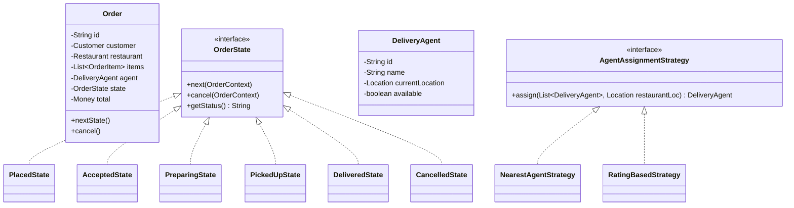

#system-design #lld #example #java #india

# LLD: Food Delivery System — Swiggy/Zomato (Java)

## Problem Type: Coordination + State Machine

---

## Requirements

- Customer browses restaurants, places order
- Restaurant accepts/rejects order
- Delivery agent assigned and tracks delivery
- Order lifecycle: placed → accepted → preparing → picked up → delivered
- Payment processing
- Rating system

---

## Class Diagram



---

## Java Implementation

```java
// === Order State Machine (State Pattern) ===
public interface OrderState {
    void next(Order order);
    void cancel(Order order);
    String getStatus();
}

public class PlacedState implements OrderState {
    public void next(Order order) { order.setState(new AcceptedState()); }
    public void cancel(Order order) { order.setState(new CancelledState()); }
    public String getStatus() { return "PLACED"; }
}

public class AcceptedState implements OrderState {
    public void next(Order order) { order.setState(new PreparingState()); }
    public void cancel(Order order) {
        // Refund logic
        order.setState(new CancelledState());
    }
    public String getStatus() { return "ACCEPTED"; }
}

public class PreparingState implements OrderState {
    public void next(Order order) { order.setState(new PickedUpState()); }
    public void cancel(Order order) {
        throw new IllegalStateException("Cannot cancel — food is being prepared");
    }
    public String getStatus() { return "PREPARING"; }
}

public class PickedUpState implements OrderState {
    public void next(Order order) { order.setState(new DeliveredState()); }
    public void cancel(Order order) {
        throw new IllegalStateException("Cannot cancel — agent has picked up food");
    }
    public String getStatus() { return "PICKED_UP"; }
}

public class DeliveredState implements OrderState {
    public void next(Order order) { /* terminal */ }
    public void cancel(Order order) {
        throw new IllegalStateException("Already delivered");
    }
    public String getStatus() { return "DELIVERED"; }
}

// === Order ===
public class Order {
    private final String id;
    private final Customer customer;
    private final Restaurant restaurant;
    private final List<OrderItem> items;
    private DeliveryAgent agent;
    private OrderState state;
    private final Money total;

    public Order(Customer customer, Restaurant restaurant, List<OrderItem> items) {
        this.id = UUID.randomUUID().toString();
        this.customer = customer;
        this.restaurant = restaurant;
        this.items = items;
        this.total = calculateTotal();
        this.state = new PlacedState();
    }

    public void setState(OrderState state) { this.state = state; }
    public void next() { state.next(this); }
    public void cancel() { state.cancel(this); }
    public String getStatus() { return state.getStatus(); }

    public void assignAgent(DeliveryAgent agent) {
        this.agent = agent;
        agent.setAvailable(false);
    }

    private Money calculateTotal() {
        double sum = items.stream().mapToDouble(i -> i.getPrice() * i.getQuantity()).sum();
        return new Money(sum, "INR");
    }
}

// === Agent Assignment Strategy ===
public interface AgentAssignmentStrategy {
    DeliveryAgent assign(List<DeliveryAgent> agents, Location restaurantLocation);
}

public class NearestAgentStrategy implements AgentAssignmentStrategy {
    public DeliveryAgent assign(List<DeliveryAgent> agents, Location restaurantLoc) {
        return agents.stream()
            .filter(DeliveryAgent::isAvailable)
            .min(Comparator.comparingDouble(a -> a.distanceTo(restaurantLoc)))
            .orElseThrow(() -> new RuntimeException("No agents available"));
    }
}

// === Order Service (Orchestrator) ===
public class OrderService {
    private final AgentAssignmentStrategy assignmentStrategy;
    private final PaymentGateway paymentGateway;
    private final NotificationService notificationService;

    public OrderService(AgentAssignmentStrategy strategy, PaymentGateway pg, NotificationService ns) {
        this.assignmentStrategy = strategy;
        this.paymentGateway = pg;
        this.notificationService = ns;
    }

    public Order placeOrder(Customer customer, Restaurant restaurant, List<OrderItem> items) {
        Order order = new Order(customer, restaurant, items);
        paymentGateway.charge(customer.getPaymentMethod(), order.getTotal());
        notificationService.notifyRestaurant(restaurant, order);
        return order;
    }

    public void assignAgent(Order order, List<DeliveryAgent> availableAgents) {
        DeliveryAgent agent = assignmentStrategy.assign(
            availableAgents, order.getRestaurant().getLocation());
        order.assignAgent(agent);
        notificationService.notifyAgent(agent, order);
    }
}
```

---

## Design Patterns Used

| Pattern | Where | Why |
|---------|-------|-----|
| **State** | OrderState | Order behavior changes with lifecycle stage |
| **Strategy** | AgentAssignmentStrategy | Swap nearest/rating-based assignment |
| **Observer** | NotificationService | Notify customer/restaurant/agent on state changes |
| **Factory** | (Extension) OrderFactory | Create orders for different types (delivery, pickup, dine-in) |

## One-Change Test

| Change | Impact |
|--------|--------|
| Add "scheduled delivery" | New `ScheduledState` in state machine |
| Add rating-based agent assignment | New `RatingBasedStrategy implements AgentAssignmentStrategy` |
| Add coupon/discount | New `DiscountStrategy` applied in `calculateTotal()` |

---

## Concurrency Handling

**Race condition 1:** Two orders simultaneously assigned to the same delivery agent.

```java
public class AgentPool {
    private final ConcurrentHashMap<String, DeliveryAgent> agents = new ConcurrentHashMap<>();

    // CAS-based assignment — only one order can claim an agent
    public DeliveryAgent tryAssign(String agentId) {
        DeliveryAgent agent = agents.get(agentId);
        if (agent == null) return null;

        // Atomic state transition — only succeeds for one caller
        if (agent.getStatus().compareAndSet(AgentStatus.AVAILABLE, AgentStatus.ASSIGNED)) {
            return agent;
        }
        return null;  // already assigned by another thread
    }
}
```

**Race condition 2:** Order state transitions (e.g., two drivers accept same order).

```java
public class Order {
    private final AtomicReference<OrderState> state;

    public boolean transitionTo(OrderState expected, OrderState newState) {
        return state.compareAndSet(expected, newState);  // atomic transition
    }
}
```

---

## Error Handling & Edge Cases

```java
// 1. No agents available in area
if (availableAgents.isEmpty())
    throw new NoAgentAvailableException("No delivery agents in " + order.getDeliveryArea());

// 2. Restaurant closed
if (!restaurant.isOpen())
    throw new RestaurantClosedException(restaurant.getName() + " is currently closed");

// 3. Invalid state transition (e.g., cancel after delivery)
if (order.getStatus() == OrderStatus.DELIVERED)
    throw new InvalidStateTransitionException("Cannot cancel a delivered order");

// 4. Payment failure on order placement
if (!paymentResult.isSuccess())
    throw new PaymentFailedException("Payment failed: " + paymentResult.getFailureReason());

// 5. Agent location unavailable
if (agent.getLocation() == null)
    throw new AgentLocationUnavailableException("Cannot determine agent location");
```

**Edge cases to mention:**
- Agent goes offline mid-delivery → reassign to new agent
- Restaurant cancels accepted order → notify customer, full refund, find alternative
- Address undeliverable → notify customer for correction

---

## Follow-up Questions

| Question | Answer Direction |
|----------|-----------------|
| How to track real-time agent location? | WebSocket / SSE, `driver_locations` table updated every 5s |
| How to handle agent cancellation mid-delivery? | State machine handles REASSIGNING state, Observer notifies customer |
| Add rating system? | `Rating` entity, `RatingStrategy` (weighted average), stored post-delivery |
| How to optimize delivery batching (one agent, multiple orders)? | `BatchAssignmentStrategy implements AgentAssignmentStrategy` |
| How to add surge pricing? | `SurgePricingDecorator` wraps `BasePricingStrategy`, triggers when demand/supply ratio > threshold |

---

## Company-Specific Variants

**Swiggy:**
- Hyperlocal delivery (2km radius)
- Kitchen queue visibility for delivery agent
- Dynamic time estimates using ML model

**Zomato:**
- Table booking + delivery in same system
- Gold membership free delivery logic
- Multi-restaurant orders in one cart

**Uber Eats:**
- Shared with ride-hailing driver pool
- Dropoff instruction handling (apartment, gate code)

---

## Links

- [[../patterns/behavioral]] — State + Strategy patterns
- [[../../10_hld/examples/hld_food_delivery]] — HLD for this system
- [[../lld_concurrency_patterns]] — CAS-based agent assignment
- [[../lld_database_design]] — Schema for orders, agents, states
