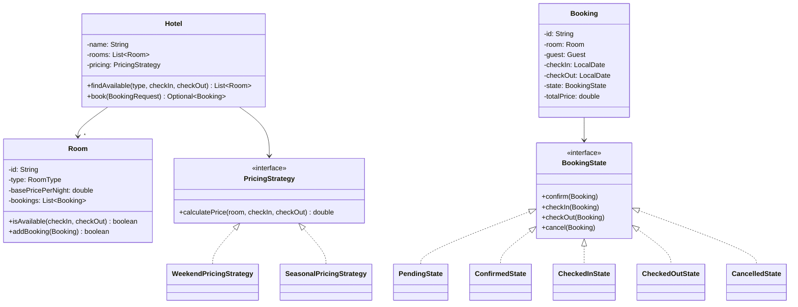
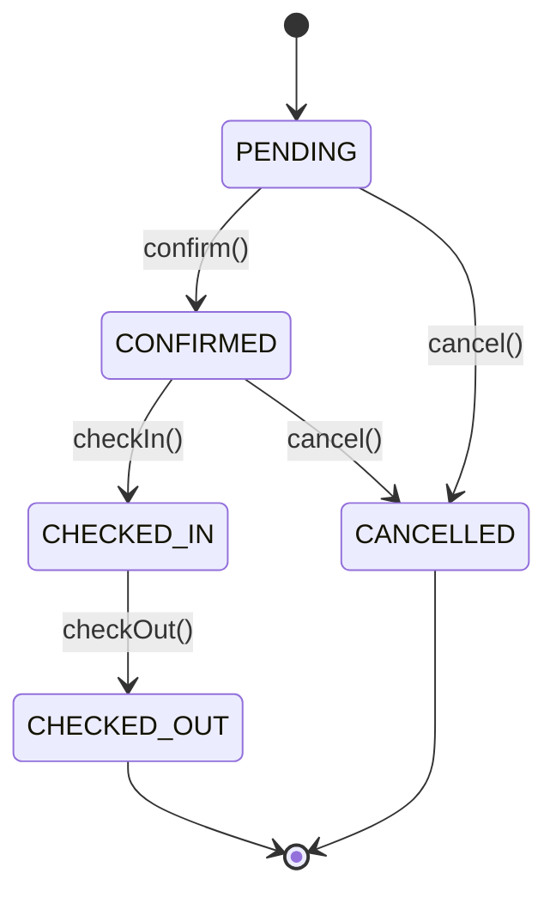

#system-design #lld #example #java #resource-management #state-machine #strategy #factory

# LLD: Hotel Booking System (Java)

**Problem Type:** Resource Management + State Machine
**Difficulty:** Medium
**Asked at:** OYO, Booking.com, Airbnb, MakeMyTrip

---

## Requirements Clarification

| # | Question | Answer |
|---|----------|--------|
| 1 | Can multiple room types be booked in one reservation? | No — one booking = one room for simplicity; group booking is a list of bookings |
| 2 | What are the valid booking state transitions? | PENDING → CONFIRMED → CHECKED_IN → CHECKED_OUT or CANCELLED |
| 3 | Is pricing per room static or dynamic? | Dynamic — weekday, weekend, seasonal multipliers |
| 4 | What is the no-show policy? | Booking auto-CANCELLED at 6 PM on check-in day if not checked in |
| 5 | Early checkout — do we refund unused nights? | Configurable refund policy (e.g., 50% refund for unused nights) |
| 6 | How do we prevent double booking? | Synchronized booking window per room; check overlapping dates atomically |

---

## Problem Type + Key Patterns

- **State Machine** — Booking lifecycle with guarded transitions (cannot skip states)
- **Strategy** — PricingStrategy (weekday/weekend/seasonal) and RoomAllocationStrategy
- **Factory** — RoomFactory creates typed rooms (SINGLE, DOUBLE, SUITE) with defaults
- **Synchronized booking window** — `synchronized(room)` during overlap check + save to prevent double booking

---

## Class Diagram (ASCII)

```
+-------------------+      +---------------------+      +-------------------+
|      Hotel        |      |       Room           |      |     Booking       |
|-------------------|      |---------------------|      |-------------------|
| -id: String       |      | -id: String          |      | -id: String       |
| -name: String     |      | -type: RoomType      |      | -room: Room       |
| -rooms: List      |      | -pricePerNight: double      | -guest: Guest     |
| +findAvailable()  |      | -amenities: List     |      | -checkIn: Date    |
| +book(req)        |      | -currentBookings:List|      | -checkOut: Date   |
+-------------------+      | +isAvailable(dates)  |      | -state: BookingState
                           +---------------------+      | +transition(event)|
                                    ^                   +-------------------+
                           +--------+--------+
                           | RoomFactory     |         +-------------------+
                           | create(type,id) |         |  BookingState     |
                           +-----------------+         |-------------------|
                                                       | <<interface>>     |
+----------------------------+                         | +confirm()        |
|     PricingStrategy        |                         | +checkIn()        |
|----------------------------|                         | +checkOut()       |
| <<interface>>              |                         | +cancel()         |
| +calculatePrice(room,dates)|                         +-------------------+
+----------------------------+                                 ^
         ^           ^                           +------------+----------+
+--------+--+  +-----+------+          +--------+--+  +------+-----+  +---------+
|WeekdayPric|  |SeasonalPric|          |PendingState|  |ConfirmedSt.|  |CheckedIn|
+-----------+  +------------+          +------------+  +------------+  +---------+
```

### Mermaid Diagrams





---

## Core Interfaces

```java
public interface PricingStrategy {
    double calculatePrice(Room room, LocalDate checkIn, LocalDate checkOut);
}

public interface RoomAllocationStrategy {
    Optional<Room> allocate(List<Room> availableRooms, BookingRequest request);
}

public interface BookingState {
    void confirm(Booking booking);
    void checkIn(Booking booking);
    void checkOut(Booking booking);
    void cancel(Booking booking);
    String getStateName();
}
```

---

## Complete Java Implementation

```java
import java.util.*;
import java.util.concurrent.*;
import java.time.*;
import java.time.temporal.ChronoUnit;

// === Enums ===
enum RoomType { SINGLE, DOUBLE, SUITE }

// === Guest ===
class Guest {
    private final String id;
    private final String name;
    private final String email;
    public Guest(String id, String name, String email) {
        this.id = id; this.name = name; this.email = email;
    }
    public String getId() { return id; }
    public String getName() { return name; }
}

// === Room ===
class Room {
    private final String id;
    private final RoomType type;
    private final double basePricePerNight;
    private final List<Booking> bookings = new ArrayList<>();

    public Room(String id, RoomType type, double basePricePerNight) {
        this.id = id; this.type = type; this.basePricePerNight = basePricePerNight;
    }

    // synchronized on room object to prevent double booking
    public synchronized boolean isAvailable(LocalDate checkIn, LocalDate checkOut) {
        return bookings.stream()
            .filter(b -> !b.getState().getStateName().equals("CANCELLED"))
            .noneMatch(b -> b.overlaps(checkIn, checkOut));
    }

    public synchronized boolean addBooking(Booking booking) {
        // Re-check inside lock — prevents TOCTOU race
        if (!isAvailable(booking.getCheckIn(), booking.getCheckOut())) return false;
        bookings.add(booking);
        return true;
    }

    public String getId() { return id; }
    public RoomType getType() { return type; }
    public double getBasePricePerNight() { return basePricePerNight; }
}

// === RoomFactory ===
class RoomFactory {
    public static Room create(String id, RoomType type) {
        double price = switch (type) {
            case SINGLE -> 1500.0;
            case DOUBLE -> 2500.0;
            case SUITE  -> 8000.0;
        };
        return new Room(id, type, price);
    }
}

// === BookingRequest ===
class BookingRequest {
    public final RoomType roomType;
    public final LocalDate checkIn;
    public final LocalDate checkOut;
    public final Guest guest;
    public BookingRequest(Guest guest, RoomType type, LocalDate checkIn, LocalDate checkOut) {
        this.guest = guest; this.roomType = type;
        this.checkIn = checkIn; this.checkOut = checkOut;
    }
}

// === Booking State Machine ===
interface BookingState {
    void confirm(Booking b);
    void checkIn(Booking b);
    void checkOut(Booking b);
    void cancel(Booking b);
    String getStateName();
}

class PendingState implements BookingState {
    public void confirm(Booking b) { b.setState(new ConfirmedState()); System.out.println("Booking CONFIRMED: " + b.getId()); }
    public void checkIn(Booking b) { throw new IllegalStateException("Must confirm before check-in"); }
    public void checkOut(Booking b) { throw new IllegalStateException("Not checked in"); }
    public void cancel(Booking b) { b.setState(new CancelledState()); System.out.println("Booking CANCELLED: " + b.getId()); }
    public String getStateName() { return "PENDING"; }
}

class ConfirmedState implements BookingState {
    public void confirm(Booking b) { throw new IllegalStateException("Already confirmed"); }
    public void checkIn(Booking b) {
        LocalDate today = LocalDate.now();
        if (today.isBefore(b.getCheckIn())) throw new IllegalStateException("Too early to check in");
        b.setState(new CheckedInState());
        System.out.println("CHECKED IN: " + b.getGuest().getName());
    }
    public void checkOut(Booking b) { throw new IllegalStateException("Not checked in yet"); }
    public void cancel(Booking b) { b.setState(new CancelledState()); System.out.println("Booking CANCELLED: " + b.getId()); }
    public String getStateName() { return "CONFIRMED"; }
}

class CheckedInState implements BookingState {
    public void confirm(Booking b) { throw new IllegalStateException("Already checked in"); }
    public void checkIn(Booking b) { throw new IllegalStateException("Already checked in"); }
    public void checkOut(Booking b) {
        b.setActualCheckOut(LocalDate.now());
        b.setState(new CheckedOutState());
        System.out.println("CHECKED OUT: " + b.getGuest().getName());
    }
    public void cancel(Booking b) { throw new IllegalStateException("Cannot cancel after check-in — use early checkout"); }
    public String getStateName() { return "CHECKED_IN"; }
}

class CheckedOutState implements BookingState {
    public void confirm(Booking b) { throw new IllegalStateException("Booking complete"); }
    public void checkIn(Booking b) { throw new IllegalStateException("Booking complete"); }
    public void checkOut(Booking b) { throw new IllegalStateException("Already checked out"); }
    public void cancel(Booking b) { throw new IllegalStateException("Cannot cancel completed booking"); }
    public String getStateName() { return "CHECKED_OUT"; }
}

class CancelledState implements BookingState {
    public void confirm(Booking b) { throw new IllegalStateException("Booking is cancelled"); }
    public void checkIn(Booking b) { throw new IllegalStateException("Booking is cancelled"); }
    public void checkOut(Booking b) { throw new IllegalStateException("Booking is cancelled"); }
    public void cancel(Booking b) { throw new IllegalStateException("Already cancelled"); }
    public String getStateName() { return "CANCELLED"; }
}

// === Booking ===
class Booking {
    private final String id;
    private final Room room;
    private final Guest guest;
    private final LocalDate checkIn;
    private final LocalDate checkOut;
    private LocalDate actualCheckOut;
    private BookingState state;
    private final double totalPrice;

    public Booking(Room room, Guest guest, LocalDate checkIn, LocalDate checkOut, double price) {
        this.id = UUID.randomUUID().toString().substring(0, 8).toUpperCase();
        this.room = room; this.guest = guest;
        this.checkIn = checkIn; this.checkOut = checkOut;
        this.totalPrice = price;
        this.state = new PendingState();
    }

    public boolean overlaps(LocalDate from, LocalDate to) {
        return !checkOut.isBefore(from) && !from.isAfter(checkOut)
            && !getState().getStateName().equals("CANCELLED");
    }

    public void confirm() { state.confirm(this); }
    public void checkIn() { state.checkIn(this); }
    public void checkOut() { state.checkOut(this); }
    public void cancel() { state.cancel(this); }

    public void setState(BookingState s) { this.state = s; }
    public BookingState getState() { return state; }
    public String getId() { return id; }
    public Guest getGuest() { return guest; }
    public LocalDate getCheckIn() { return checkIn; }
    public LocalDate getCheckOut() { return checkOut; }
    public void setActualCheckOut(LocalDate d) { this.actualCheckOut = d; }
    public double getTotalPrice() { return totalPrice; }
}

// === Pricing Strategies ===
class WeekendPricingStrategy implements PricingStrategy {
    public double calculatePrice(Room room, LocalDate checkIn, LocalDate checkOut) {
        long nights = ChronoUnit.DAYS.between(checkIn, checkOut);
        double total = 0;
        for (long i = 0; i < nights; i++) {
            LocalDate night = checkIn.plusDays(i);
            DayOfWeek day = night.getDayOfWeek();
            double rate = (day == DayOfWeek.FRIDAY || day == DayOfWeek.SATURDAY)
                ? room.getBasePricePerNight() * 1.5
                : room.getBasePricePerNight();
            total += rate;
        }
        return total;
    }
}

class SeasonalPricingStrategy implements PricingStrategy {
    public double calculatePrice(Room room, LocalDate checkIn, LocalDate checkOut) {
        long nights = ChronoUnit.DAYS.between(checkIn, checkOut);
        int month = checkIn.getMonthValue();
        double multiplier = (month == 12 || month == 1) ? 1.8 : 1.0; // peak season
        return nights * room.getBasePricePerNight() * multiplier;
    }
}

// === Hotel ===
class Hotel {
    private final String name;
    private final List<Room> rooms;
    private final PricingStrategy pricing;

    public Hotel(String name, List<Room> rooms, PricingStrategy pricing) {
        this.name = name; this.rooms = rooms; this.pricing = pricing;
    }

    public List<Room> findAvailable(RoomType type, LocalDate checkIn, LocalDate checkOut) {
        return rooms.stream()
            .filter(r -> r.getType() == type && r.isAvailable(checkIn, checkOut))
            .toList();
    }

    public Optional<Booking> book(BookingRequest req) {
        List<Room> available = findAvailable(req.roomType, req.checkIn, req.checkOut);
        if (available.isEmpty()) return Optional.empty();

        Room room = available.get(0);
        double price = pricing.calculatePrice(room, req.checkIn, req.checkOut);
        Booking booking = new Booking(room, req.guest, req.checkIn, req.checkOut, price);

        // Synchronized on room — atomic overlap-check + add
        if (!room.addBooking(booking)) return Optional.empty();
        return Optional.of(booking);
    }
}

// === Demo ===
public class HotelBookingDemo {
    public static void main(String[] args) {
        List<Room> rooms = List.of(
            RoomFactory.create("R101", RoomType.DOUBLE),
            RoomFactory.create("R102", RoomType.SUITE)
        );
        Hotel hotel = new Hotel("Grand Orchid", new ArrayList<>(rooms), new WeekendPricingStrategy());

        Guest g1 = new Guest("G1", "Alice", "alice@example.com");
        Guest g2 = new Guest("G2", "Bob", "bob@example.com");

        LocalDate ci = LocalDate.of(2026, 3, 6);  // Friday
        LocalDate co = LocalDate.of(2026, 3, 9);  // Monday

        // Concurrent booking race on same room
        BookingRequest req1 = new BookingRequest(g1, RoomType.DOUBLE, ci, co);
        BookingRequest req2 = new BookingRequest(g2, RoomType.DOUBLE, ci, co);

        Thread t1 = new Thread(() -> hotel.book(req1)
            .ifPresentOrElse(b -> { System.out.println("Alice booked: " + b.getId() + " ₹" + b.getTotalPrice()); b.confirm(); },
                             () -> System.out.println("Alice booking FAILED")), "Alice");
        Thread t2 = new Thread(() -> hotel.book(req2)
            .ifPresentOrElse(b -> { System.out.println("Bob booked: " + b.getId() + " ₹" + b.getTotalPrice()); b.confirm(); },
                             () -> System.out.println("Bob booking FAILED — room taken")), "Bob");
        t1.start(); t2.start();
    }
}
```

---

## Design Patterns Used

| Pattern | Class | Reason |
|---------|-------|--------|
| **State** | `BookingState` + `PendingState`, `ConfirmedState`, etc. | Guard invalid transitions (can't check out before checking in); each state owns its behavior |
| **Strategy** | `PricingStrategy` (Weekend vs Seasonal) | Swap pricing algorithm at hotel level; A/B test different pricing |
| **Factory** | `RoomFactory.create()` | Encapsulate default prices per room type |
| **Synchronized Object Lock** | `synchronized(room)` in `addBooking()` | Atomic overlap check + insert prevents double booking |

---

## Concurrency Handling

**Problem:** Two guests book the same room for same dates simultaneously — both pass the availability check, both add their bookings.

```java
// WRONG — TOCTOU race condition
if (room.isAvailable(checkIn, checkOut)) {   // Thread A: true
    bookings.add(booking);                    // Thread B also true → double book
}

// CORRECT — synchronized on room object; re-check inside lock
public synchronized boolean addBooking(Booking booking) {
    if (!isAvailable(booking.getCheckIn(), booking.getCheckOut())) return false;
    bookings.add(booking);   // Only one thread reaches here per room
    return true;
}
```

**Result:** One thread succeeds; other gets `false` → `Optional.empty()` → "room taken" response.

---

## Error Handling & Edge Cases

```java
// 1. Invalid state transition — guarded in each State class
b.checkIn();  // throws IllegalStateException if state is PENDING (not CONFIRMED)

// 2. Check-in before check-in date
if (today.isBefore(b.getCheckIn()))
    throw new IllegalStateException("Cannot check in before " + b.getCheckIn());

// 3. Overbooking prevented by synchronized addBooking()
if (!room.addBooking(booking)) return Optional.empty(); // caller shows "sold out"

// 4. No-show policy — scheduled job at 18:00 on check-in date
scheduler.schedule(() -> {
    if (booking.getState().getStateName().equals("CONFIRMED"))
        booking.cancel();
}, hoursUntil6PM, TimeUnit.HOURS);

// 5. Early checkout refund
long plannedNights = ChronoUnit.DAYS.between(booking.getCheckIn(), booking.getCheckOut());
long stayedNights  = ChronoUnit.DAYS.between(booking.getCheckIn(), LocalDate.now());
double refund = (plannedNights - stayedNights) * room.getBasePricePerNight() * 0.5;
```

---

## One-Change Test

| Change | Classes Modified |
|--------|-----------------|
| Add seasonal pricing | 1 new: `SeasonalPricingStrategy implements PricingStrategy` |
| Add HOSTEL room type | 1 change: `RoomType` enum + `RoomFactory` switch |
| Add CHECKED_IN → EXTENDED state | 1 new: `ExtendedStayState implements BookingState` |
| Nearest-available-room allocation | 1 new: `NearestFloorAllocationStrategy implements RoomAllocationStrategy` |

---

## Follow-up Questions

| Question | Answer Direction |
|----------|-----------------|
| How to handle group bookings (10 rooms)? | `GroupBookingService` calls `hotel.book()` in a loop; roll back partial bookings on failure |
| How to support room upgrades? | `UpgradeService.upgrade(booking, newRoomType)` — cancel + rebook atomically |
| How to handle hotel-wide full occupancy? | `WaitlistService` — queue guests, notify on cancellation (Observer) |
| How to show real-time availability on website? | Cache availability in Redis; invalidate on each booking/cancellation |
| How to implement dynamic pricing (surge)? | `SurgePricingDecorator` wraps any `PricingStrategy`; multiplier from occupancy % |

---

## Links

- [[../patterns/behavioral]] — State and Strategy pattern details
- [[../lld_machine_coding_template]] — Template this file follows
- [[../lld_concurrency_patterns]] — Synchronized object locks, TOCTOU race conditions
