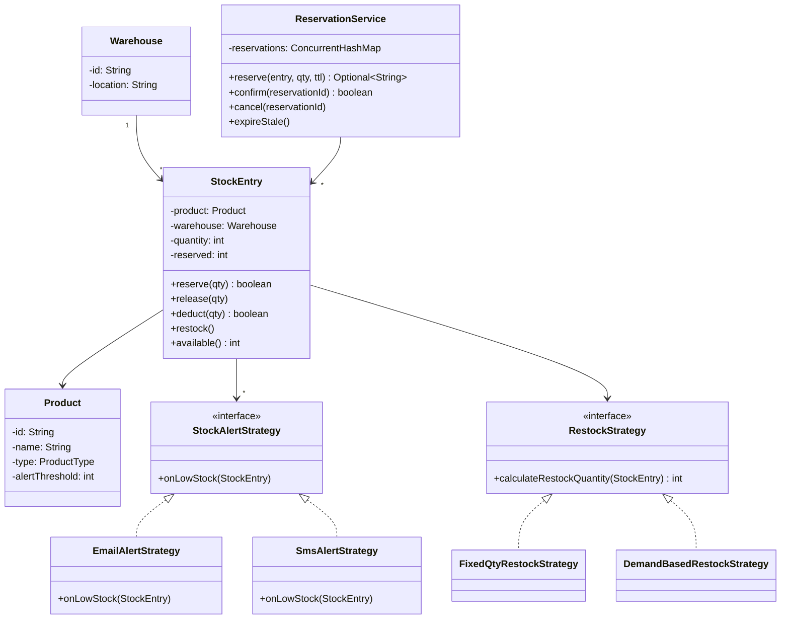

#system-design #lld #example #java #resource-management #observer #strategy #factory

# LLD: Inventory Management System (Java)

**Problem Type:** Resource Management
**Difficulty:** Medium
**Asked at:** Amazon, Flipkart, Walmart, Meesho

---

## Requirements Clarification

| # | Question | Answer |
|---|----------|--------|
| 1 | Do we support multiple warehouses per product? | Yes — stock is tracked per (product, warehouse) |
| 2 | What triggers a low-stock alert — absolute count or percentage? | Configurable threshold per product |
| 3 | Can a reservation expire without an order being placed? | Yes — reservations have a TTL (e.g., 15 min) |
| 4 | Is restock automatic or manual approval required? | Strategy-based — auto for FMCG, manual for electronics |
| 5 | Do we handle partial fulfillment from multiple warehouses? | Yes — split order across closest warehouses |
| 6 | What consistency model? Last-write-wins or strict ordering? | Strict — use optimistic locking to prevent oversell |

---

## Problem Type + Key Patterns

- **Resource Management** — track, reserve, and replenish finite stock units
- **Observer** — StockAlertObserver notified when quantity falls below threshold
- **Strategy** — RestockStrategy decides how much to reorder (fixed qty vs demand-based)
- **Factory** — ProductFactory creates typed products (PERISHABLE, ELECTRONICS, APPAREL)
- **Optimistic Locking** — ConcurrentHashMap.compute() ensures atomic decrement on last unit

---

## Class Diagram (ASCII)

```
+------------------+       +-------------------+       +------------------+
|    Product       |       |    Warehouse      |       |   StockEntry     |
|------------------|       |-------------------|       |------------------|
| -id: String      |       | -id: String       |       | -product: Product|
| -name: String    |       | -location: String |       | -warehouse: WH   |
| -type: ProductType       | -stockEntries: Map|       | -quantity: int   |
| -alertThreshold  |       +-------------------+       | -reserved: int   |
+------------------+               |                   | +reserve(int)    |
        |                          |                   | +release(int)    |
        +-------+------------------+                   | +deduct(int)     |
                |                                      +------------------+
                v
+---------------------------+     +------------------------+
| ReservationService        |     | StockAlertStrategy     |
|---------------------------|     |------------------------|
| -reservations: Map        |     | <<interface>>          |
| +reserve(prod,wh,qty,ttl) |     | +onLowStock(entry)     |
| +confirm(reservationId)   |     +------------------------+
| +cancel(reservationId)    |             ^
| +expireStale()            |     +-------+--------+
+---------------------------+     | EmailAlert     |
                                  | SmsAlert       |
+---------------------------+     +----------------+
| RestockStrategy           |
|---------------------------|
| <<interface>>             |
| +calculateRestock(entry)  |
+---------------------------+
        ^
+-------+---------+
| FixedQtyRestock |
| DemandBasedRestock
+-----------------+
```

### Mermaid Class Diagram



---

## Core Interfaces

```java
public interface StockAlertStrategy {
    void onLowStock(StockEntry entry);
}

public interface RestockStrategy {
    int calculateRestockQuantity(StockEntry entry);
}

public interface ReservationListener {
    void onReservationExpired(String reservationId);
}
```

---

## Complete Java Implementation

```java
import java.util.*;
import java.util.concurrent.*;
import java.time.*;

// === Enums ===
enum ProductType { PERISHABLE, ELECTRONICS, APPAREL, FMCG }

// === Product ===
class Product {
    private final String id;
    private final String name;
    private final ProductType type;
    private final int alertThreshold;

    public Product(String id, String name, ProductType type, int alertThreshold) {
        this.id = id; this.name = name;
        this.type = type; this.alertThreshold = alertThreshold;
    }
    public String getId() { return id; }
    public String getName() { return name; }
    public int getAlertThreshold() { return alertThreshold; }
}

// === ProductFactory ===
class ProductFactory {
    public static Product create(String id, String name, ProductType type) {
        int threshold = switch (type) {
            case PERISHABLE -> 50;
            case ELECTRONICS -> 10;
            case APPAREL -> 20;
            case FMCG -> 100;
        };
        return new Product(id, name, type, threshold);
    }
}

// === Warehouse ===
class Warehouse {
    private final String id;
    private final String location;

    public Warehouse(String id, String location) {
        this.id = id; this.location = location;
    }
    public String getId() { return id; }
    public String getLocation() { return location; }
}

// === StockEntry — tracks quantity per (product, warehouse) ===
class StockEntry {
    private final Product product;
    private final Warehouse warehouse;
    private int quantity;
    private int reserved;
    private final List<StockAlertStrategy> alertObservers = new CopyOnWriteArrayList<>();
    private RestockStrategy restockStrategy;

    public StockEntry(Product product, Warehouse warehouse, int quantity) {
        this.product = product; this.warehouse = warehouse; this.quantity = quantity;
    }

    public void addAlertObserver(StockAlertStrategy s) { alertObservers.add(s); }
    public void setRestockStrategy(RestockStrategy s) { this.restockStrategy = s; }

    public synchronized boolean reserve(int qty) {
        if (available() < qty) return false;
        reserved += qty;
        checkAlert();
        return true;
    }

    public synchronized void release(int qty) {
        reserved = Math.max(0, reserved - qty);
    }

    public synchronized boolean deduct(int qty) {
        if (available() < qty) return false;
        quantity -= qty;
        reserved = Math.max(0, reserved - qty);
        checkAlert();
        return true;
    }

    public synchronized void restock() {
        if (restockStrategy != null) {
            quantity += restockStrategy.calculateRestockQuantity(this);
        }
    }

    public int available() { return quantity - reserved; }
    public int getQuantity() { return quantity; }
    public int getReserved() { return reserved; }
    public Product getProduct() { return product; }
    public Warehouse getWarehouse() { return warehouse; }

    private void checkAlert() {
        if (available() <= product.getAlertThreshold()) {
            alertObservers.forEach(obs -> obs.onLowStock(this));
        }
    }
}

// === Alert Strategies (Observer) ===
class EmailAlertStrategy implements StockAlertStrategy {
    public void onLowStock(StockEntry entry) {
        System.out.printf("[EMAIL] LOW STOCK: %s at %s — available: %d%n",
            entry.getProduct().getName(),
            entry.getWarehouse().getLocation(),
            entry.available());
    }
}

class SmsAlertStrategy implements StockAlertStrategy {
    public void onLowStock(StockEntry entry) {
        System.out.printf("[SMS] Low stock alert for %s%n", entry.getProduct().getName());
    }
}

// === Restock Strategies ===
class FixedQtyRestockStrategy implements RestockStrategy {
    private final int fixedQty;
    public FixedQtyRestockStrategy(int qty) { this.fixedQty = qty; }
    public int calculateRestockQuantity(StockEntry entry) { return fixedQty; }
}

class DemandBasedRestockStrategy implements RestockStrategy {
    public int calculateRestockQuantity(StockEntry entry) {
        // Restock to 2x the alert threshold
        return entry.getProduct().getAlertThreshold() * 2 - entry.getQuantity();
    }
}

// === Reservation ===
class Reservation {
    private final String id;
    private final StockEntry entry;
    private final int qty;
    private final Instant expiresAt;
    private boolean active = true;

    public Reservation(StockEntry entry, int qty, Duration ttl) {
        this.id = UUID.randomUUID().toString();
        this.entry = entry; this.qty = qty;
        this.expiresAt = Instant.now().plus(ttl);
    }

    public boolean isExpired() { return Instant.now().isAfter(expiresAt); }
    public String getId() { return id; }
    public StockEntry getEntry() { return entry; }
    public int getQty() { return qty; }
    public boolean isActive() { return active; }
    public void deactivate() { this.active = false; }
}

// === ReservationService ===
class ReservationService {
    private final ConcurrentHashMap<String, Reservation> reservations = new ConcurrentHashMap<>();
    private final ScheduledExecutorService scheduler = Executors.newSingleThreadScheduledExecutor();

    public ReservationService() {
        // Periodically expire stale reservations
        scheduler.scheduleAtFixedRate(this::expireStale, 1, 1, TimeUnit.MINUTES);
    }

    public Optional<String> reserve(StockEntry entry, int qty, Duration ttl) {
        // ConcurrentHashMap.compute ensures atomic check-and-reserve
        boolean[] success = {false};
        reservations.compute(entry.getProduct().getId() + entry.getWarehouse().getId(), (k, v) -> {
            if (entry.reserve(qty)) {
                success[0] = true;
            }
            return v;
        });
        if (!success[0]) return Optional.empty();

        Reservation r = new Reservation(entry, qty, ttl);
        reservations.put(r.getId(), r);
        return Optional.of(r.getId());
    }

    public boolean confirm(String reservationId) {
        Reservation r = reservations.remove(reservationId);
        if (r == null || !r.isActive() || r.isExpired()) return false;
        r.deactivate();
        return r.getEntry().deduct(r.getQty());
    }

    public void cancel(String reservationId) {
        Reservation r = reservations.remove(reservationId);
        if (r != null && r.isActive()) {
            r.deactivate();
            r.getEntry().release(r.getQty());
        }
    }

    public void expireStale() {
        reservations.entrySet().removeIf(e -> {
            Reservation r = e.getValue();
            if (r.isActive() && r.isExpired()) {
                r.deactivate();
                r.getEntry().release(r.getQty());
                System.out.println("[EXPIRED] Reservation " + r.getId());
                return true;
            }
            return false;
        });
    }
}

// === Demo ===
public class InventorySystemDemo {
    public static void main(String[] args) {
        Product phone = ProductFactory.create("P1", "Phone X", ProductType.ELECTRONICS);
        Warehouse wh = new Warehouse("W1", "Mumbai");

        StockEntry entry = new StockEntry(phone, wh, 15);
        entry.addAlertObserver(new EmailAlertStrategy());
        entry.addAlertObserver(new SmsAlertStrategy());
        entry.setRestockStrategy(new DemandBasedRestockStrategy());

        ReservationService reservationSvc = new ReservationService();

        // Two threads racing to reserve last 5 units
        Runnable reserveTask = () -> {
            Optional<String> resId = reservationSvc.reserve(entry, 5, Duration.ofMinutes(15));
            resId.ifPresentOrElse(
                id -> System.out.println(Thread.currentThread().getName() + " reserved: " + id),
                ()  -> System.out.println(Thread.currentThread().getName() + " reservation FAILED — insufficient stock")
            );
        };

        // Simulate near-empty stock
        entry.reserve(10); // pre-reserve 10, leaving 5

        Thread t1 = new Thread(reserveTask, "Order-1");
        Thread t2 = new Thread(reserveTask, "Order-2");
        t1.start(); t2.start();

        System.out.println("Available after race: " + entry.available());
    }
}
```

---

## Design Patterns Used

| Pattern | Class | Reason |
|---------|-------|--------|
| **Observer** | `StockAlertStrategy` + `StockEntry.checkAlert()` | Decouple notification from stock logic; add Email/SMS/Slack without changing StockEntry |
| **Strategy** | `RestockStrategy` (Fixed vs Demand-based) | Swap restock algorithm per product type at runtime |
| **Factory** | `ProductFactory.create()` | Encapsulate threshold defaults by ProductType |
| **Optimistic Locking** | `ConcurrentHashMap.compute()` in ReservationService | Atomic check-and-reserve without global lock |

---

## Concurrency Handling

**Problem:** Two orders simultaneously reserve the last unit — both read `available=1`, both succeed, inventory goes negative.

```java
// WRONG — race condition
if (entry.available() >= qty) {   // Thread A reads true
    entry.reserve(qty);            // Thread B also reads true → both reserve
}

// CORRECT — synchronized reserve() inside StockEntry
public synchronized boolean reserve(int qty) {
    if (available() < qty) return false;  // re-check inside lock
    reserved += qty;
    checkAlert();
    return true;
}

// CORRECT — ConcurrentHashMap.compute() for atomic mapping-level operation
reservations.compute(key, (k, v) -> {
    if (entry.reserve(qty)) success[0] = true;
    return v;
});
```

**Result:** Only one thread succeeds; the other gets `false` and returns a "sold out" error.

---

## Error Handling & Edge Cases

```java
// 1. Negative inventory — guard in deduct()
public synchronized boolean deduct(int qty) {
    if (available() < qty) return false;  // never go negative
    ...
}

// 2. Reservation timeout — ScheduledExecutor releases reserved qty
scheduler.scheduleAtFixedRate(this::expireStale, 1, 1, TimeUnit.MINUTES);

// 3. Multi-warehouse fulfillment — split across warehouses
// InventoryService.fulfillFromMultipleWarehouses(product, totalQty, warehouses)

// 4. Invalid reservation confirm (already expired)
if (r == null || !r.isActive() || r.isExpired()) return false;

// 5. Restock resulting in overflow — cap at MAX_CAPACITY
quantity = Math.min(MAX_CAPACITY, quantity + restockQty);
```

**Edge cases to mention in interview:**
- What if warehouse goes offline mid-reservation? (Saga pattern — compensating transactions)
- Bulk import causing alert storm? (Debounce alerts with a cooldown window)

---

## One-Change Test

| Change | Classes Modified |
|--------|-----------------|
| Add Slack low-stock notification | 1 new: `SlackAlertStrategy implements StockAlertStrategy` |
| Add just-in-time restock strategy | 1 new: `JITRestockStrategy implements RestockStrategy` |
| Add new product type (FURNITURE) | 1 change: `ProductFactory` switch case + `ProductType` enum |
| Support reservation priority (VIP orders) | 1 new: `PriorityReservationService extends ReservationService` |

---

## Follow-up Questions

| Question | Answer Direction |
|----------|-----------------|
| How to handle multi-warehouse fulfillment for one order? | `InventoryService` iterates warehouses by proximity, partial reserves until qty met |
| How to prevent alert storm on bulk deduction? | Debounce — only fire alert if quiet for N seconds since last alert |
| How to support backorders? | Add `BackorderQueue` — when stock = 0, queue orders fulfilled on restock |
| How to audit all stock movements? | `StockMovementLog` — append-only event log on every reserve/deduct/restock |
| How to scale to distributed warehouses? | Kafka events for stock changes, distributed lock (Redis) per product-warehouse pair |

---

## Links

- [[../patterns/behavioral]] — Observer and Strategy pattern details
- [[../lld_machine_coding_template]] — Template this file follows
- [[../lld_concurrency_patterns]] — Optimistic locking, synchronized blocks, ConcurrentHashMap
