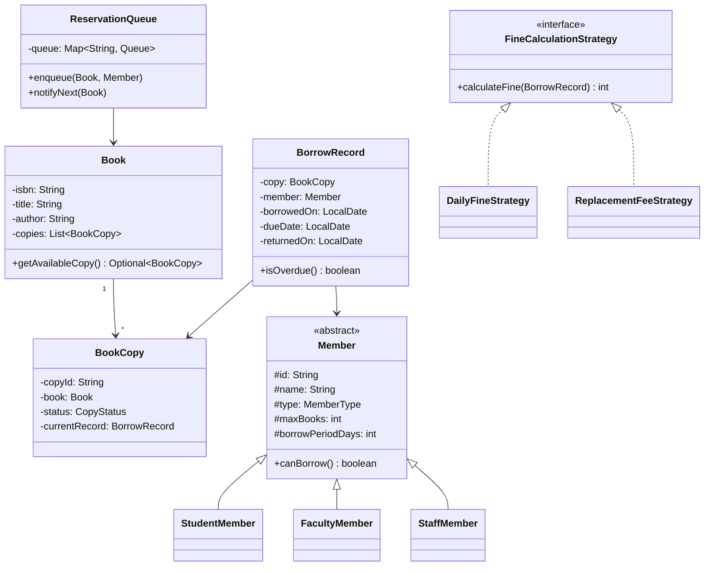

#system-design #lld #example #java #resource-management #observer #strategy #factory

# LLD: Library Management System (Java)

**Problem Type:** Resource Management
**Difficulty:** Easy
**Asked at:** Classic OOP warm-up, Amazon, Microsoft, Infosys, TCS

---

## Requirements Clarification

| # | Question | Answer |
|---|----------|--------|
| 1 | Can a member borrow multiple copies of the same book? | No — one copy per book per member at a time |
| 2 | How are fines calculated? | Daily flat rate after due date; rate differs by member type |
| 3 | What happens when a member reserves an unavailable book? | Added to a FIFO reservation queue; notified when a copy is returned |
| 4 | Can a member renew a borrowed book? | Yes — if no reservations pending for that book; extends due date by borrow period |
| 5 | What happens if a book is lost? | Member charged a replacement fee; copy marked LOST; account may be suspended |
| 6 | What are different member types and their borrow limits? | STUDENT: 3 books/14 days, FACULTY: 10 books/30 days, STAFF: 5 books/21 days |

---

## Problem Type + Key Patterns

- **Resource Management** — manage finite physical book copies
- **Strategy** — `FineCalculationStrategy` per member type (daily rate differs)
- **Observer** — `ReservationObserver` notified when reserved book becomes available
- **Factory** — `MemberFactory.create()` constructs typed members with correct borrow limits
- **synchronized borrowBook()** — prevent two members borrowing the last physical copy

---

## Class Diagram (ASCII)

```
+-------------------+      +--------------------+      +-------------------+
|      Book         |      |    BookCopy        |      |  BorrowRecord     |
|-------------------|      |--------------------|      |-------------------|
| -isbn: String     |      | -copyId: String    |      | -id: String       |
| -title: String    |      | -book: Book        |      | -copy: BookCopy   |
| -author: String   |      | -status: CopyStatus|      | -member: Member   |
| -copies: List     |      | -borrowRecord: BR  |      | -borrowedOn: Date |
| +getAvailableCopy |      +--------------------+      | -dueDate: Date    |
+-------------------+               ^                  | -returnedOn: Date |
                           +--------+------+           +-------------------+
                           | CopyStatus    |
                           | AVAILABLE     |      +-------------------+
                           | BORROWED      |      |     Member        |
                           | RESERVED      |      |-------------------|
                           | LOST          |      | -id: String       |
                           +---------------+      | -name: String     |
                                                  | -type: MemberType |
+----------------------------+                    | -maxBooks: int    |
| FineCalculationStrategy    |                    | -borrowPeriod: int|
|----------------------------|                    | +canBorrow(): bool |
| <<interface>>              |                    +-------------------+
| +calculateFine(record): int|                            ^
+----------------------------+             +-------------+----------+
         ^          ^                      | StudentMember          |
+--------+-+  +-----+-------+             | FacultyMember          |
|DailyRateF|  |ReplcmntFeeF |             | StaffMember            |
+----------+  +-------------+             +------------------------+

+----------------------------+
|  ReservationQueue          |
|----------------------------|
| -queue: LinkedList         |
| +enqueue(member, book)     |
| +notifyNext(book)          |  ← Observer
+----------------------------+
```

### Mermaid Class Diagram



---

## Core Interfaces

```java
public interface FineCalculationStrategy {
    int calculateFine(BorrowRecord record);  // returns fine in rupees
}

public interface ReservationObserver {
    void onBookAvailable(Book book, Member member);
}

public interface Searchable {
    List<Book> searchByTitle(String title);
    List<Book> searchByAuthor(String author);
    Optional<Book> searchByIsbn(String isbn);
}
```

---

## Complete Java Implementation

```java
import java.util.*;
import java.util.concurrent.*;
import java.time.*;
import java.time.temporal.ChronoUnit;

// === Enums ===
enum MemberType { STUDENT, FACULTY, STAFF }
enum CopyStatus { AVAILABLE, BORROWED, RESERVED, LOST }

// === Book ===
class Book {
    private final String isbn;
    private final String title;
    private final String author;
    private final List<BookCopy> copies = new ArrayList<>();

    public Book(String isbn, String title, String author) {
        this.isbn = isbn; this.title = title; this.author = author;
    }

    public void addCopy(BookCopy copy) { copies.add(copy); }

    public synchronized Optional<BookCopy> getAvailableCopy() {
        return copies.stream()
            .filter(c -> c.getStatus() == CopyStatus.AVAILABLE)
            .findFirst();
    }

    public long getAvailableCount() {
        return copies.stream().filter(c -> c.getStatus() == CopyStatus.AVAILABLE).count();
    }

    public String getIsbn() { return isbn; }
    public String getTitle() { return title; }
    public String getAuthor() { return author; }
    public List<BookCopy> getCopies() { return Collections.unmodifiableList(copies); }
}

// === BookCopy ===
class BookCopy {
    private final String copyId;
    private final Book book;
    private volatile CopyStatus status = CopyStatus.AVAILABLE;
    private BorrowRecord currentRecord;

    public BookCopy(String copyId, Book book) {
        this.copyId = copyId; this.book = book;
    }

    public String getCopyId() { return copyId; }
    public Book getBook() { return book; }
    public CopyStatus getStatus() { return status; }
    public void setStatus(CopyStatus s) { this.status = s; }
    public BorrowRecord getCurrentRecord() { return currentRecord; }
    public void setCurrentRecord(BorrowRecord r) { this.currentRecord = r; }
}

// === Member (abstract base) ===
abstract class Member {
    protected final String id;
    protected final String name;
    protected final MemberType type;
    protected final int maxBooks;
    protected final int borrowPeriodDays;
    protected final List<BorrowRecord> activeBorrows = new ArrayList<>();
    protected boolean suspended = false;

    protected Member(String id, String name, MemberType type, int maxBooks, int borrowPeriodDays) {
        this.id = id; this.name = name; this.type = type;
        this.maxBooks = maxBooks; this.borrowPeriodDays = borrowPeriodDays;
    }

    public boolean canBorrow() {
        return !suspended && activeBorrows.size() < maxBooks;
    }

    public void addActiveBorrow(BorrowRecord r) { activeBorrows.add(r); }
    public void removeActiveBorrow(BorrowRecord r) { activeBorrows.remove(r); }
    public void suspend() { this.suspended = true; System.out.println("[SUSPENDED] Member " + name); }
    public void reinstate() { this.suspended = false; }

    public String getId() { return id; }
    public String getName() { return name; }
    public MemberType getType() { return type; }
    public int getBorrowPeriodDays() { return borrowPeriodDays; }
    public boolean isSuspended() { return suspended; }
    public List<BorrowRecord> getActiveBorrows() { return Collections.unmodifiableList(activeBorrows); }
}

class StudentMember extends Member {
    public StudentMember(String id, String name) { super(id, name, MemberType.STUDENT, 3, 14); }
}
class FacultyMember extends Member {
    public FacultyMember(String id, String name) { super(id, name, MemberType.FACULTY, 10, 30); }
}
class StaffMember extends Member {
    public StaffMember(String id, String name) { super(id, name, MemberType.STAFF, 5, 21); }
}

// === MemberFactory ===
class MemberFactory {
    public static Member create(String id, String name, MemberType type) {
        return switch (type) {
            case STUDENT -> new StudentMember(id, name);
            case FACULTY -> new FacultyMember(id, name);
            case STAFF   -> new StaffMember(id, name);
        };
    }
}

// === BorrowRecord ===
class BorrowRecord {
    private final String id = UUID.randomUUID().toString().substring(0, 8);
    private final BookCopy copy;
    private final Member member;
    private final LocalDate borrowedOn;
    private LocalDate dueDate;
    private LocalDate returnedOn;
    private boolean lost = false;

    public BorrowRecord(BookCopy copy, Member member, int borrowDays) {
        this.copy = copy; this.member = member;
        this.borrowedOn = LocalDate.now();
        this.dueDate = borrowedOn.plusDays(borrowDays);
    }

    public boolean isOverdue() { return returnedOn == null && LocalDate.now().isAfter(dueDate); }
    public long getOverdueDays() { return Math.max(0, ChronoUnit.DAYS.between(dueDate, LocalDate.now())); }
    public void markReturned() { this.returnedOn = LocalDate.now(); }
    public void markLost() { this.lost = true; this.returnedOn = LocalDate.now(); }
    public void extend(int days) { this.dueDate = dueDate.plusDays(days); }
    public boolean isLost() { return lost; }

    public BookCopy getCopy() { return copy; }
    public Member getMember() { return member; }
    public LocalDate getDueDate() { return dueDate; }
    public LocalDate getReturnedOn() { return returnedOn; }
    public String getId() { return id; }
}

// === Fine Strategies ===
class DailyFineStrategy implements FineCalculationStrategy {
    private static final Map<MemberType, Integer> DAILY_RATE = Map.of(
        MemberType.STUDENT, 5,    // ₹5/day
        MemberType.FACULTY, 2,    // ₹2/day (subsidized)
        MemberType.STAFF,   3     // ₹3/day
    );
    public int calculateFine(BorrowRecord record) {
        int rate = DAILY_RATE.getOrDefault(record.getMember().getType(), 5);
        return (int)(record.getOverdueDays() * rate);
    }
}

class ReplacementFeeStrategy implements FineCalculationStrategy {
    private static final int REPLACEMENT_FEE = 500; // ₹500 flat
    public int calculateFine(BorrowRecord record) {
        return record.isLost() ? REPLACEMENT_FEE : 0;
    }
}

// === Reservation Queue (Observer) ===
class ReservationQueue {
    private final Map<String, Queue<Member>> queues = new ConcurrentHashMap<>();
    private final List<ReservationObserver> observers = new CopyOnWriteArrayList<>();

    public void addObserver(ReservationObserver obs) { observers.add(obs); }

    public void enqueue(Book book, Member member) {
        queues.computeIfAbsent(book.getIsbn(), k -> new LinkedList<>()).offer(member);
        System.out.printf("[QUEUE] %s added to reservation queue for '%s'%n",
            member.getName(), book.getTitle());
    }

    public void notifyNext(Book book) {
        Queue<Member> queue = queues.get(book.getIsbn());
        if (queue != null && !queue.isEmpty()) {
            Member next = queue.poll();
            observers.forEach(obs -> obs.onBookAvailable(book, next));
        }
    }

    public boolean hasReservations(Book book) {
        Queue<Member> q = queues.get(book.getIsbn());
        return q != null && !q.isEmpty();
    }
}

// === SearchCatalog ===
class SearchCatalog implements Searchable {
    private final List<Book> books;
    public SearchCatalog(List<Book> books) { this.books = books; }

    public List<Book> searchByTitle(String title) {
        return books.stream()
            .filter(b -> b.getTitle().toLowerCase().contains(title.toLowerCase()))
            .toList();
    }
    public List<Book> searchByAuthor(String author) {
        return books.stream()
            .filter(b -> b.getAuthor().equalsIgnoreCase(author))
            .toList();
    }
    public Optional<Book> searchByIsbn(String isbn) {
        return books.stream().filter(b -> b.getIsbn().equals(isbn)).findFirst();
    }
}

// === LibraryService ===
class LibraryService {
    private final List<Book> catalog = new CopyOnWriteArrayList<>();
    private final ReservationQueue reservationQueue = new ReservationQueue();
    private final FineCalculationStrategy fineStrategy;
    private final FineCalculationStrategy replacementStrategy = new ReplacementFeeStrategy();

    public LibraryService(FineCalculationStrategy fineStrategy) {
        this.fineStrategy = fineStrategy;
        reservationQueue.addObserver((book, member) ->
            System.out.printf("[NOTIFY] '%s' is now available for %s%n",
                book.getTitle(), member.getName()));
    }

    public void addBook(Book book) { catalog.add(book); }

    // synchronized to prevent two members borrowing the last copy
    public synchronized BorrowRecord borrowBook(Member member, Book book) {
        if (!member.canBorrow())
            throw new IllegalStateException(member.isSuspended()
                ? "Account suspended" : "Borrow limit reached (" + member.getActiveBorrows().size() + " active)");

        Optional<BookCopy> copyOpt = book.getAvailableCopy();
        if (copyOpt.isEmpty()) {
            reservationQueue.enqueue(book, member);
            throw new IllegalStateException("No copies available — added to reservation queue");
        }

        BookCopy copy = copyOpt.get();
        copy.setStatus(CopyStatus.BORROWED);
        BorrowRecord record = new BorrowRecord(copy, member, member.getBorrowPeriodDays());
        copy.setCurrentRecord(record);
        member.addActiveBorrow(record);

        System.out.printf("[BORROWED] %s borrowed '%s' — due: %s%n",
            member.getName(), book.getTitle(), record.getDueDate());
        return record;
    }

    public synchronized int returnBook(BorrowRecord record) {
        BookCopy copy = record.getCopy();
        record.markReturned();
        copy.setStatus(CopyStatus.AVAILABLE);
        copy.setCurrentRecord(null);
        record.getMember().removeActiveBorrow(record);

        int fine = fineStrategy.calculateFine(record);
        if (fine > 0) System.out.printf("[FINE] ₹%d charged to %s%n", fine, record.getMember().getName());

        // Notify next in reservation queue
        reservationQueue.notifyNext(record.getCopy().getBook());
        return fine;
    }

    public synchronized int reportLost(BorrowRecord record) {
        BookCopy copy = record.getCopy();
        record.markLost();
        copy.setStatus(CopyStatus.LOST);
        record.getMember().removeActiveBorrow(record);
        record.getMember().suspend(); // suspend on book loss
        return replacementStrategy.calculateFine(record);
    }

    public boolean renewBook(BorrowRecord record) {
        if (reservationQueue.hasReservations(record.getCopy().getBook())) {
            System.out.println("[RENEW DENIED] Others are waiting for this book");
            return false;
        }
        record.extend(record.getMember().getBorrowPeriodDays());
        System.out.printf("[RENEWED] Due date extended to %s%n", record.getDueDate());
        return true;
    }

    public SearchCatalog getSearchCatalog() { return new SearchCatalog(catalog); }
}

// === Demo ===
public class LibraryManagementDemo {
    public static void main(String[] args) {
        LibraryService library = new LibraryService(new DailyFineStrategy());

        Book book = new Book("978-0-13-110362-7", "The Pragmatic Programmer", "Hunt & Thomas");
        BookCopy copy1 = new BookCopy("C001", book);
        book.addCopy(copy1);
        library.addBook(book);

        Member alice = MemberFactory.create("M1", "Alice", MemberType.STUDENT);
        Member bob   = MemberFactory.create("M2", "Bob",   MemberType.FACULTY);

        // Concurrent borrow race on last copy
        Thread t1 = new Thread(() -> {
            try {
                BorrowRecord r = library.borrowBook(alice, book);
                System.out.println("Alice borrowed successfully");
                library.returnBook(r);
            } catch (Exception e) { System.out.println("Alice: " + e.getMessage()); }
        }, "Alice");

        Thread t2 = new Thread(() -> {
            try {
                library.borrowBook(bob, book);
                System.out.println("Bob borrowed successfully");
            } catch (Exception e) { System.out.println("Bob: " + e.getMessage()); }
        }, "Bob");

        t1.start(); t2.start();
    }
}
```

---

## Design Patterns Used

| Pattern | Class | Reason |
|---------|-------|--------|
| **Strategy** | `FineCalculationStrategy` (Daily vs Replacement) | Different fine rules per scenario; add seasonal amnesty strategy without touching LibraryService |
| **Observer** | `ReservationObserver` + `ReservationQueue.notifyNext()` | Decouple notification from return logic; add SMS/email notifier without changing return flow |
| **Factory** | `MemberFactory.create()` | Hide member subtype construction; enforce correct borrow limits per type |
| **synchronized** | `borrowBook()`, `returnBook()` | Prevent two members borrowing the last physical copy; atomic check + claim |

---

## Concurrency Handling

**Problem:** Two members simultaneously borrow the last copy — both see `AVAILABLE`, both succeed.

```java
// WRONG — TOCTOU race condition
Optional<BookCopy> copy = book.getAvailableCopy(); // Thread A: present
if (copy.isPresent()) {                             // Thread B: also present
    copy.get().setStatus(BORROWED);                 // Both claim same copy
}

// CORRECT — synchronized on LibraryService
public synchronized BorrowRecord borrowBook(Member member, Book book) {
    Optional<BookCopy> copyOpt = book.getAvailableCopy(); // re-checked inside lock
    if (copyOpt.isEmpty()) {
        reservationQueue.enqueue(book, member);
        throw new IllegalStateException("No copies available");
    }
    copyOpt.get().setStatus(CopyStatus.BORROWED);  // Only one thread claims it
    ...
}
```

**Result:** One member borrows; the other is queued and notified on return.

---

## Error Handling & Edge Cases

```java
// 1. Member borrow limit reached
if (activeBorrows.size() >= maxBooks)
    throw new IllegalStateException("Borrow limit reached");

// 2. Suspended member trying to borrow
if (suspended) throw new IllegalStateException("Account suspended");

// 3. No copies available — queue member
if (copyOpt.isEmpty()) { reservationQueue.enqueue(book, member); throw ... }

// 4. Book reported lost — charge + suspend
public int reportLost(BorrowRecord record) {
    record.markLost(); copy.setStatus(LOST);
    member.suspend();  // cannot borrow until reinstated
    return replacementStrategy.calculateFine(record); // ₹500 flat
}

// 5. Renewal denied if reservations pending
if (reservationQueue.hasReservations(book)) { System.out.println("RENEW DENIED"); return false; }

// 6. Overdue with no return — fine accrues daily, member may be auto-suspended
if (record.getOverdueDays() > 30) member.suspend();
```

---

## One-Change Test

| Change | Classes Modified |
|--------|-----------------|
| Add seasonal fine amnesty (no fines in exam week) | 1 new: `AmnestyFineStrategy implements FineCalculationStrategy` |
| Add PREMIUM member type (20 books, 60 days) | 1 new: `PremiumMember extends Member` + `MemberFactory` switch |
| Add SMS reservation notification | 1 new: `SmsReservationObserver implements ReservationObserver` |
| Add genre-based search | 1 change: `SearchCatalog.searchByGenre()` + `Book.genre` field |

---

## Follow-up Questions

| Question | Answer Direction |
|----------|-----------------|
| How to handle inter-library loans? | `InterLibraryLoanService` — requests copy from partner library catalog |
| How to track which librarian processed each transaction? | Add `processedBy: Librarian` field to `BorrowRecord`; Librarian entity with role |
| How to scale to a city-wide library network? | Distributed catalog with eventual consistency; each branch owns its copies |
| How to implement late fee auto-deduction? | `FineCollectionService` — scheduled job; integrates with payment gateway |
| How to support e-books (unlimited copies)? | `EBook extends Book` — override `getAvailableCopy()` to always return a virtual copy |

---

## Links

- [[../patterns/behavioral]] — Observer and Strategy pattern details
- [[../lld_machine_coding_template]] — Template this file follows
- [[../lld_concurrency_patterns]] — Synchronized methods, CopyOnWriteArrayList
