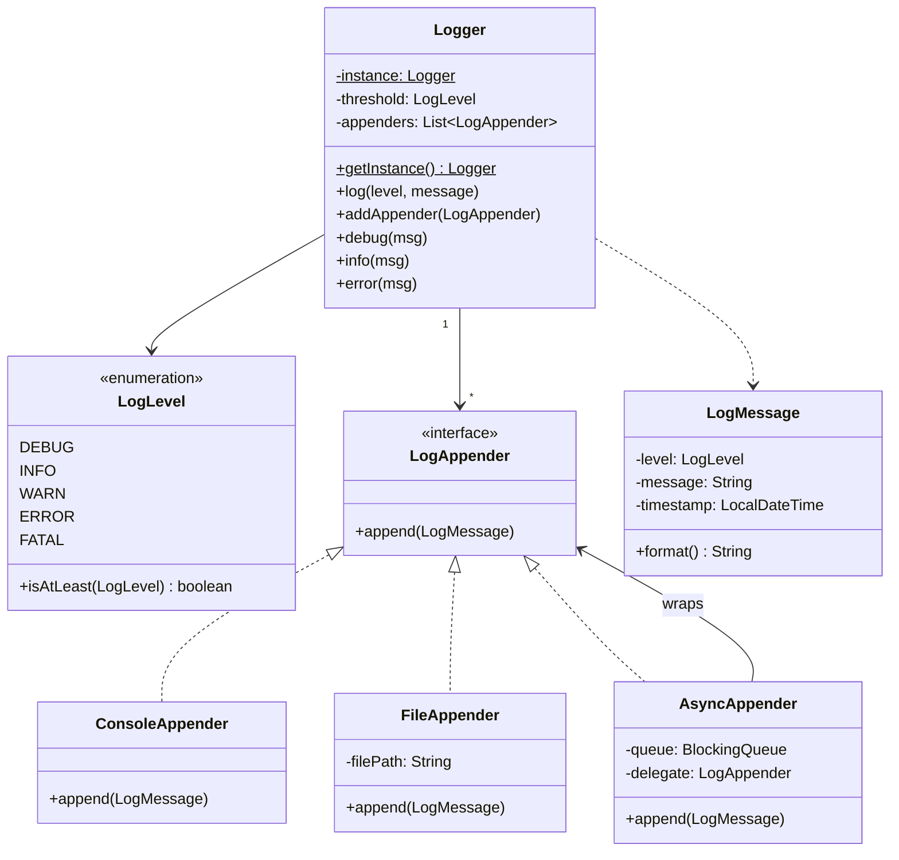

#system-design #lld #example #java #library

# LLD: Logger Framework (Java)

## Problem Type: Library/SDK Design

---

## Requirements

- Log messages with levels: DEBUG, INFO, WARN, ERROR, FATAL
- Multiple output destinations: console, file, database, remote
- Configurable log level threshold
- Thread-safe
- Extensible (add new destinations without modifying core)

---

## Java Implementation

```java
// === Log Level ===
public enum LogLevel {
    DEBUG(1), INFO(2), WARN(3), ERROR(4), FATAL(5);
    private final int severity;
    LogLevel(int s) { this.severity = s; }
    public boolean isAtLeast(LogLevel other) { return this.severity >= other.severity; }
}

// === Log Message ===
public class LogMessage {
    private final LogLevel level;
    private final String message;
    private final LocalDateTime timestamp;
    private final String threadName;

    public LogMessage(LogLevel level, String message) {
        this.level = level;
        this.message = message;
        this.timestamp = LocalDateTime.now();
        this.threadName = Thread.currentThread().getName();
    }

    public String format() {
        return String.format("[%s] [%s] [%s] %s",
            timestamp, level, threadName, message);
    }
    // getters...
}

// === Appender (Strategy Pattern) ===
public interface LogAppender {
    void append(LogMessage message);
}

public class ConsoleAppender implements LogAppender {
    public void append(LogMessage msg) {
        System.out.println(msg.format());
    }
}

public class FileAppender implements LogAppender {
    private final String filePath;
    private final BufferedWriter writer;

    public FileAppender(String filePath) throws IOException {
        this.filePath = filePath;
        this.writer = new BufferedWriter(new FileWriter(filePath, true));
    }

    public synchronized void append(LogMessage msg) {
        try {
            writer.write(msg.format());
            writer.newLine();
            writer.flush();
        } catch (IOException e) {
            System.err.println("Failed to write log: " + e.getMessage());
        }
    }
}

public class DatabaseAppender implements LogAppender {
    private final DataSource dataSource;

    public DatabaseAppender(DataSource ds) { this.dataSource = ds; }

    public void append(LogMessage msg) {
        // Insert into logs table
    }
}

// === Logger ===
public class Logger {
    private static volatile Logger instance;
    private LogLevel threshold;
    private final List<LogAppender> appenders;

    private Logger() {
        this.threshold = LogLevel.INFO;
        this.appenders = new CopyOnWriteArrayList<>();
    }

    public static Logger getInstance() {
        if (instance == null) {
            synchronized (Logger.class) {
                if (instance == null) {
                    instance = new Logger();
                }
            }
        }
        return instance;
    }

    public void setThreshold(LogLevel level) { this.threshold = level; }
    public void addAppender(LogAppender appender) { appenders.add(appender); }

    public void log(LogLevel level, String message) {
        if (!level.isAtLeast(threshold)) return;
        LogMessage logMsg = new LogMessage(level, message);
        appenders.forEach(a -> a.append(logMsg));
    }

    // Convenience methods
    public void debug(String msg) { log(LogLevel.DEBUG, msg); }
    public void info(String msg) { log(LogLevel.INFO, msg); }
    public void warn(String msg) { log(LogLevel.WARN, msg); }
    public void error(String msg) { log(LogLevel.ERROR, msg); }
    public void fatal(String msg) { log(LogLevel.FATAL, msg); }
}

// === Usage ===
Logger logger = Logger.getInstance();
logger.setThreshold(LogLevel.DEBUG);
logger.addAppender(new ConsoleAppender());
logger.addAppender(new FileAppender("/var/log/app.log"));

logger.info("Application started");
logger.error("Connection failed");
```

## Mermaid Class Diagram



---

## Design Patterns Used

| Pattern | Where | Why |
|---------|-------|-----|
| **Singleton** | Logger.getInstance() | One logger per app (with DI, this could be injected instead) |
| **Strategy** | LogAppender interface | Pluggable destinations |
| **Observer** | Logger → multiple Appenders | One log event → multiple outputs |
| **Builder** | (Extension) LoggerBuilder for config | Clean configuration API |

## One-Change Test

| Change | Impact |
|--------|--------|
| Add Kafka appender | 1 new: `KafkaAppender implements LogAppender` |
| Add JSON formatting | 1 new: `JsonFormatter` applied before appending |
| Add async logging | Wrap appenders with `AsyncAppender` using queue + worker thread |

---

## Concurrency Handling

**Race condition:** Multiple threads writing log messages simultaneously — logs get interleaved.

```java
// Option 1: Synchronized appender (simple, blocks on every log)
public class FileLogAppender implements LogAppender {
    private final Object writeLock = new Object();

    public void append(LogMessage message) {
        synchronized (writeLock) {
            writer.println(format(message));
            writer.flush();
        }
    }
}

// Option 2: Async appender (non-blocking, high throughput)
public class AsyncLogAppender implements LogAppender {
    private final BlockingQueue<LogMessage> queue = new LinkedBlockingQueue<>(10000);
    private final LogAppender delegate;

    public AsyncLogAppender(LogAppender delegate) {
        this.delegate = delegate;
        // Background worker thread consumes and writes
        Thread worker = new Thread(() -> {
            while (!Thread.currentThread().isInterrupted()) {
                try {
                    LogMessage message = queue.take();
                    delegate.append(message);
                } catch (InterruptedException e) {
                    Thread.currentThread().interrupt();
                }
            }
        });
        worker.setDaemon(true);
        worker.start();
    }

    // Non-blocking: puts in queue and returns immediately
    public void append(LogMessage message) {
        if (!queue.offer(message)) {
            // Queue full — drop log or use overflow strategy
            System.err.println("Log queue full, dropping: " + message.getMessage());
        }
    }
}

// One-change test: Add async → just wrap existing appender
Logger logger = Logger.getInstance();
logger.addAppender(new AsyncLogAppender(new FileLogAppender("app.log")));
```

---

## Error Handling & Edge Cases

```java
// 1. File not writable
try {
    writer = new PrintWriter(new FileWriter(filePath, true));
} catch (IOException e) {
    throw new AppenderInitializationException("Cannot write to log file: " + filePath, e);
}

// 2. Log message below minimum level — skip silently
public void log(LogLevel level, String message) {
    if (level.ordinal() < minimumLevel.ordinal()) return;  // silently ignore
    // proceed
}

// 3. Null message
if (message == null) message = "null";  // never throw on null log message

// 4. Appender failure — don't crash the application
for (LogAppender appender : appenders) {
    try {
        appender.append(logMessage);
    } catch (Exception e) {
        // Log failure to stderr, don't propagate — app must not crash due to logging
        System.err.println("Appender " + appender.getClass().getName() + " failed: " + e.getMessage());
    }
}

// 5. Log file rotation (file too large)
if (currentFile.length() > maxFileSizeBytes) {
    rotateFile();
}
```

**Edge cases to mention:**
- What if the disk is full? → Catch IOException, switch to console appender
- What if async queue overflows? → Drop oldest logs, emit a "logs dropped" warning
- What if the app crashes? → Flush queue in shutdown hook

---

## Follow-up Questions

| Question | Answer Direction |
|----------|-----------------|
| How to make logger async? | `AsyncLogAppender` decorator wrapping any appender with `BlockingQueue` |
| How to add structured logging (JSON)? | `JsonFormatter` strategy, each appender uses formatter |
| How to log to multiple destinations? | Multiple appenders already in design — composite pattern |
| How to add log sampling (log only 1% of DEBUG)? | `SamplingAppender` decorator with sampling rate |
| How to add distributed tracing (correlate logs across services)? | Add `correlationId` (trace ID) to `LogMessage` via `ThreadLocal` |

---

## Company-Specific Variants

**Any product company:**
- Standard: SLF4J interface, Logback/Log4j2 under the hood
- Production: Structured JSON logs → ELK stack or Datadog

**Stripe / Cloudflare (high throughput):**
- Async always (millions of log events/sec)
- Log sampling (DEBUG: 1%, INFO: 10%, ERROR: 100%)
- Correlation ID from HTTP request propagated through entire call chain

---

## Links

- [[../patterns/creational]] — Singleton, Builder
- [[../patterns/behavioral]] — Strategy, Observer
- [[../problem_taxonomy_lld]] — Library/SDK type
- [[../lld_concurrency_patterns]] — Async producer-consumer pattern
- [[../lld_testing_strategy]] — Testing logger with mock appenders
