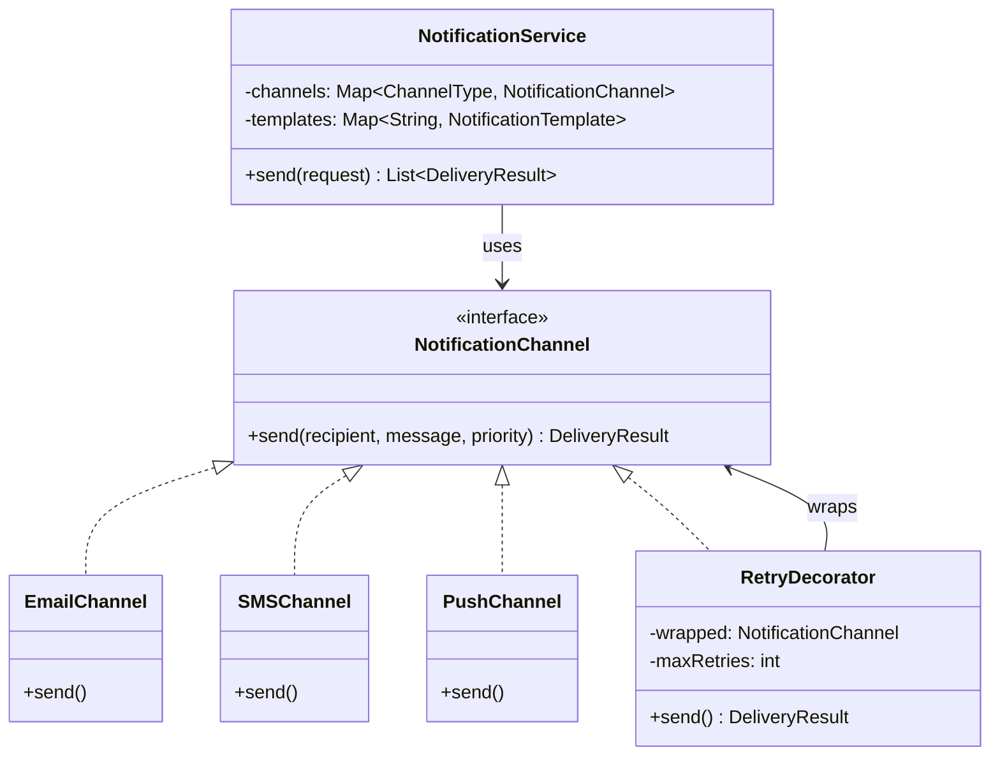
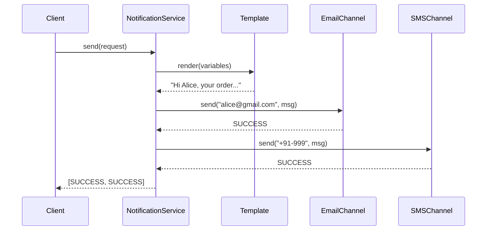

#system-design #lld #coordination #sdk

# LLD: Notification System

**Type:** SDK/Library + Coordination
**Difficulty:** Easy-Medium
**Asked at:** Almost every company — Amazon, Flipkart, Swiggy, Paytm, Razorpay, Atlassian

---

## Requirements Clarification

1. What channels? (Email, SMS, Push, WhatsApp, Slack)
2. Who configures which channel per user? (User preferences stored)
3. Should failed notifications retry? (Yes — 3 retries with backoff)
4. Template support? (Yes — variable substitution)
5. Bulk notifications? (Yes — 1000 users at once)
6. Priority levels? (HIGH, MEDIUM, LOW)
7. Delivery status tracking?

---

## Problem Type
**SDK/Library + Coordination** — notification routing = Strategy, retry logic = Chain of Responsibility, multi-channel = Decorator/Observer, bulk = Command + Queue.

---

## Class Diagram

```
NotificationService
    └── uses → NotificationRouter
                └── uses → NotificationChannel (interface)
                             ├── EmailChannel
                             ├── SMSChannel
                             ├── PushChannel
                             └── WhatsAppChannel

NotificationTemplate
    └── renders with → TemplateEngine

UserPreferences
    └── returns → List<ChannelType> (enabled channels)

RetryDecorator
    └── wraps → NotificationChannel

NotificationRequest
    └── has → templateId, userId, variables, priority
```

---

## Mermaid Diagrams





---

## Complete Java Implementation

```java
// Channel types
public enum ChannelType { EMAIL, SMS, PUSH, WHATSAPP, SLACK }

// Delivery status
public enum DeliveryStatus { SENT, FAILED, PENDING, RETRYING }

// Notification request
public class NotificationRequest {
    private final String userId;
    private final String templateId;
    private final Map<String, String> variables;
    private final NotificationPriority priority;
    private final Set<ChannelType> channels;  // null = use user preferences

    // Builder pattern for clean construction
    public static class Builder {
        private String userId;
        private String templateId;
        private Map<String, String> variables = new HashMap<>();
        private NotificationPriority priority = NotificationPriority.MEDIUM;
        private Set<ChannelType> channels;

        public Builder to(String userId)             { this.userId = userId; return this; }
        public Builder template(String id)           { this.templateId = id; return this; }
        public Builder var(String k, String v)       { variables.put(k, v); return this; }
        public Builder priority(NotificationPriority p) { this.priority = p; return this; }
        public Builder via(ChannelType... channels)  { this.channels = Set.of(channels); return this; }
        public NotificationRequest build()           { return new NotificationRequest(this); }
    }
}

// Channel interface — Strategy
public interface NotificationChannel {
    DeliveryResult send(String recipient, String message, NotificationPriority priority);
    ChannelType getType();
}

// Concrete channel implementations
public class EmailChannel implements NotificationChannel {
    private final EmailService emailService;

    public DeliveryResult send(String recipient, String message, NotificationPriority priority) {
        try {
            emailService.send(recipient, "Notification", message);
            return DeliveryResult.success(ChannelType.EMAIL);
        } catch (EmailException e) {
            return DeliveryResult.failure(ChannelType.EMAIL, e.getMessage());
        }
    }
    public ChannelType getType() { return ChannelType.EMAIL; }
}

public class SMSChannel implements NotificationChannel {
    private final SMSProvider smsProvider;

    public DeliveryResult send(String recipient, String message, NotificationPriority priority) {
        try {
            // SMS has character limit
            String truncated = message.length() > 160 ? message.substring(0, 157) + "..." : message;
            smsProvider.sendSMS(recipient, truncated);
            return DeliveryResult.success(ChannelType.SMS);
        } catch (SMSException e) {
            return DeliveryResult.failure(ChannelType.SMS, e.getMessage());
        }
    }
    public ChannelType getType() { return ChannelType.SMS; }
}

// Retry Decorator — wraps any channel with retry logic
public class RetryDecorator implements NotificationChannel {
    private final NotificationChannel wrapped;
    private final int maxRetries;
    private final long baseDelayMs;

    public RetryDecorator(NotificationChannel channel, int maxRetries, long baseDelayMs) {
        this.wrapped     = channel;
        this.maxRetries  = maxRetries;
        this.baseDelayMs = baseDelayMs;
    }

    public DeliveryResult send(String recipient, String message, NotificationPriority priority) {
        DeliveryResult result = null;
        for (int attempt = 0; attempt <= maxRetries; attempt++) {
            result = wrapped.send(recipient, message, priority);
            if (result.isSuccess()) return result;

            if (attempt < maxRetries) {
                // Exponential backoff: 1s, 2s, 4s
                long delay = baseDelayMs * (long) Math.pow(2, attempt);
                System.out.printf("Attempt %d failed. Retrying in %dms...%n", attempt + 1, delay);
                sleep(delay);
            }
        }
        return DeliveryResult.failure(wrapped.getType(), "Failed after " + maxRetries + " retries");
    }

    private void sleep(long ms) {
        try { Thread.sleep(ms); } catch (InterruptedException e) { Thread.currentThread().interrupt(); }
    }

    public ChannelType getType() { return wrapped.getType(); }
}

// Template engine
public class NotificationTemplate {
    private final String id;
    private final String bodyTemplate;  // "Hello {{name}}, your order {{orderId}} is confirmed"

    public String render(Map<String, String> variables) {
        String result = bodyTemplate;
        for (Map.Entry<String, String> entry : variables.entrySet()) {
            result = result.replace("{{" + entry.getKey() + "}}", entry.getValue());
        }
        return result;
    }
}

// User preferences
public class UserPreferences {
    private final String userId;
    private final Map<ChannelType, String> channelAddresses;  // EMAIL → "user@gmail.com"
    private final Set<ChannelType> enabledChannels;

    public boolean isChannelEnabled(ChannelType channel) {
        return enabledChannels.contains(channel);
    }

    public String getAddress(ChannelType channel) {
        return channelAddresses.get(channel);
    }
}

// Main notification service
public class NotificationService {
    private final Map<ChannelType, NotificationChannel> channels;
    private final Map<String, NotificationTemplate> templates;
    private final UserPreferencesRepository preferencesRepo;
    private final DeliveryTracker deliveryTracker;

    public NotificationService(UserPreferencesRepository repo) {
        this.preferencesRepo  = repo;
        this.deliveryTracker  = new DeliveryTracker();

        // Register channels with retry wrappers
        this.channels = Map.of(
            ChannelType.EMAIL,    new RetryDecorator(new EmailChannel(new SendGridEmailService()), 3, 1000),
            ChannelType.SMS,      new RetryDecorator(new SMSChannel(new TwilioSMSProvider()), 3, 500),
            ChannelType.PUSH,     new RetryDecorator(new PushChannel(new FCMPushService()), 2, 200),
            ChannelType.WHATSAPP, new RetryDecorator(new WhatsAppChannel(new WhatsAppAPI()), 3, 1000)
        );

        this.templates = new HashMap<>();
    }

    public List<DeliveryResult> send(NotificationRequest request) {
        // 1. Load user preferences
        UserPreferences prefs = preferencesRepo.findByUserId(request.getUserId());

        // 2. Determine target channels
        Set<ChannelType> targetChannels = request.getChannels() != null
            ? request.getChannels()
            : prefs.getEnabledChannels();

        // 3. Render template
        NotificationTemplate template = templates.get(request.getTemplateId());
        String message = template.render(request.getVariables());

        // 4. Send via each channel
        List<DeliveryResult> results = new ArrayList<>();
        for (ChannelType channelType : targetChannels) {
            NotificationChannel channel = channels.get(channelType);
            if (channel == null) continue;

            String address = prefs.getAddress(channelType);
            if (address == null) continue;

            DeliveryResult result = channel.send(address, message, request.getPriority());
            results.add(result);
            deliveryTracker.record(request.getUserId(), channelType, result);
        }

        return results;
    }

    // Bulk notification
    public void sendBulk(List<NotificationRequest> requests) {
        ExecutorService executor = Executors.newFixedThreadPool(10);
        requests.forEach(req -> executor.submit(() -> send(req)));
        executor.shutdown();
    }
}
```

---

## Usage

```java
NotificationService notificationService = new NotificationService(preferencesRepo);

// Register template
notificationService.addTemplate("order_confirmed",
    new NotificationTemplate("order_confirmed",
        "Hi {{name}}, your order #{{orderId}} of ₹{{amount}} is confirmed! Expected delivery: {{date}}"));

// Send single notification
NotificationRequest request = new NotificationRequest.Builder()
    .to("user-123")
    .template("order_confirmed")
    .var("name", "Alice")
    .var("orderId", "ORD-456")
    .var("amount", "1299")
    .var("date", "Apr 15")
    .priority(NotificationPriority.HIGH)
    .build();

List<DeliveryResult> results = notificationService.send(request);

// Send via specific channels only
NotificationRequest urgentRequest = new NotificationRequest.Builder()
    .to("user-123")
    .template("payment_failed")
    .var("amount", "5000")
    .via(ChannelType.SMS, ChannelType.PUSH)  // override user prefs
    .priority(NotificationPriority.HIGH)
    .build();
```

---

## Design Patterns Used

| Pattern | Where | Why |
|---------|-------|-----|
| **Strategy** | `NotificationChannel` | Each channel is interchangeable |
| **Decorator** | `RetryDecorator` | Add retry to any channel without changing it |
| **Builder** | `NotificationRequest.Builder` | Clean construction with many optional params |
| **Observer** | `DeliveryTracker` | Track delivery without coupling to channels |
| **Factory** | Channel registration map | Clean channel creation and lookup |

---

## Concurrency Handling

```java
// sendBulk uses thread pool — channels must be thread-safe
// Each channel instance is stateless — safe to share
// DeliveryTracker uses ConcurrentHashMap for concurrent writes
public class DeliveryTracker {
    private final ConcurrentHashMap<String, List<DeliveryResult>> records = new ConcurrentHashMap<>();

    public void record(String userId, ChannelType channel, DeliveryResult result) {
        records.computeIfAbsent(userId, k -> new CopyOnWriteArrayList<>()).add(result);
    }
}
```

---

## Error Handling & Edge Cases

```java
// 1. User has no preferences configured
if (prefs == null) throw new UserPreferencesNotFoundException("No preferences for " + userId);

// 2. Template not found
if (template == null) throw new TemplateNotFoundException("Template " + templateId + " not registered");

// 3. All channels fail
if (results.stream().noneMatch(DeliveryResult::isSuccess))
    log.error("All channels failed for user " + request.getUserId());

// 4. Variable substitution missing
if (message.contains("{{")) log.warn("Unreplaced variables in message for template " + templateId);

// 5. User opted out of all notifications
if (targetChannels.isEmpty()) {
    log.info("User " + userId + " has opted out of all notifications");
    return Collections.emptyList();
}
```

---

## One-Change Test

| Change | Impact |
|--------|--------|
| Add Slack channel | 1 new: `SlackChannel implements NotificationChannel` |
| Add priority-based routing (HIGH=SMS only, LOW=email only) | New `PriorityRouter` strategy |
| Add notification scheduling | New `ScheduledNotificationService` wrapping `NotificationService` |

---

## Follow-up Questions

| Question | Answer |
|----------|--------|
| How to add do-not-disturb hours? | Check `UserPreferences.isDNDActive()` before sending |
| How to track open rates? | Unique tracking URL in email, webhook from SMS provider |
| How to add notification preferences per category? | Extend `UserPreferences` with category-level settings |
| How to handle 1M notifications? | Kafka topic per channel, consumers scale independently |

---

## Links

- [[../patterns/behavioral]] — Strategy, Observer
- [[../patterns/structural]] — Decorator
- [[../patterns/creational]] — Builder
- [[../lld_machine_coding_template]] — 90-min guide
