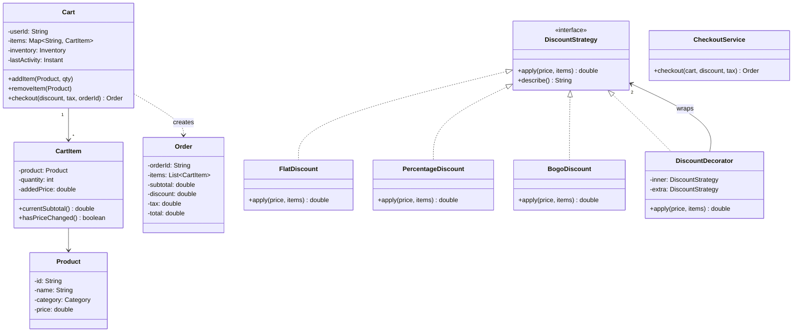

#system-design #lld #example #java #resource-management #financial

# LLD: Online Shopping Cart — Amazon/Flipkart (Java)

**Type:** Resource Management + Financial | **Difficulty:** Easy-Medium | **Companies:** Amazon, Flipkart, Meesho, Myntra

---

## 1. Requirements Clarification

| # | Question | Assumption |
|---|----------|------------|
| 1 | What discount types do we support? | FLAT_DISCOUNT, PERCENTAGE_DISCOUNT, BUY_ONE_GET_ONE (BOGO), COUPON — stackable via Decorator |
| 2 | How is tax calculated? | Per product category (e.g., Electronics 18%, Clothing 5%, Groceries 0%) |
| 3 | What happens if a product's price changes while it's in the cart? | Price is re-fetched from Inventory at checkout; cart item shows a "price changed" warning |
| 4 | Can two users add the last unit of an item simultaneously? | Inventory uses `AtomicInteger`; only one succeeds, other gets `OutOfStockException` |
| 5 | Do carts expire? | Yes — cart TTL of 30 minutes after last activity; expired carts cannot be checked out |
| 6 | Can coupons be used by multiple users concurrently? | No — coupon has `maxUses` and uses `AtomicInteger` for race-safe decrement |

---

## 2. Problem Type + Key Patterns

**Type:** Resource Management (inventory) + Financial (pricing, tax, discounts)

| Pattern | Where Used |
|---------|-----------|
| Strategy | `DiscountStrategy` — each discount type is interchangeable |
| Decorator | `DiscountDecorator` — stack multiple discounts on a base price |
| Builder | `Order.Builder` — construct immutable Order from Cart at checkout |
| Observer | `PriceChangeObserver` — notify cart when a product price changes |

---

## 3. Class Diagram (ASCII)

```
+------------------+       +------------------+       +------------------+
|      Cart        |<>-----|    CartItem      |------>|     Product      |
|------------------|       |------------------|       |------------------|
| - userId         |       | - product        |       | - id             |
| - items: Map     |       | - quantity       |       | - name           |
| - lastActivity   |       | - addedPrice     |       | - category       |
| - expiryMinutes  |       +------------------+       | - price          |
| + addItem()      |                                  +------------------+
| + removeItem()   |                                          |
| + checkout()     |                                  +------------------+
+------------------+                                  |   Inventory      |
        |                                             |------------------|
        v                                             | - stock: Map     |
+------------------+       +------------------+       |   AtomicInteger  |
|      Order       |       | DiscountStrategy |       | + reserve()      |
|------------------|       | <<interface>>    |       | + release()      |
| - orderId        |       | + apply(price)   |       +------------------+
| - items          |       +------------------+
| - totalAmount    |              ^
| - tax            |   FlatDiscount  PercentageDiscount
| - appliedCoupons |   BogoDiscount  DiscountDecorator (stackable)
+------------------+
```

### Mermaid Class Diagram



---

## 4. Core Interfaces

```java
interface DiscountStrategy {
    double apply(double price, List<CartItem> items);
    String describe();
}

interface PriceChangeObserver {
    void onPriceChanged(Product product, double oldPrice, double newPrice);
}

interface TaxStrategy {
    double calculateTax(Product product, double amount);
}
```

---

## 5. Complete Java Implementation

```java
import java.util.*;
import java.util.concurrent.*;
import java.util.concurrent.atomic.*;
import java.time.Instant;
import java.time.Duration;

// ── Enums ──────────────────────────────────────────────────────────────────

enum Category { ELECTRONICS, CLOTHING, GROCERIES, BOOKS }

// ── Product ────────────────────────────────────────────────────────────────

class Product {
    private final String id;
    private final String name;
    private final Category category;
    private volatile double price; // volatile — price can change at any time
    private final List<PriceChangeObserver> priceObservers = new CopyOnWriteArrayList<>();

    Product(String id, String name, Category cat, double price) {
        this.id = id; this.name = name; this.category = cat; this.price = price;
    }

    void addPriceObserver(PriceChangeObserver o) { priceObservers.add(o); }

    void updatePrice(double newPrice) {
        double old = this.price;
        this.price = newPrice;
        priceObservers.forEach(o -> o.onPriceChanged(this, old, newPrice));
    }

    String getId()       { return id; }
    String getName()     { return name; }
    Category getCategory() { return category; }
    double getPrice()    { return price; }

    @Override public String toString() {
        return String.format("%s (%s) @ INR %.2f", name, category, price);
    }
}

// ── Inventory ──────────────────────────────────────────────────────────────

class OutOfStockException extends RuntimeException {
    OutOfStockException(String productName) {
        super("Out of stock: " + productName);
    }
}

class Inventory {
    // Thread-safe stock count per product ID
    private final ConcurrentHashMap<String, AtomicInteger> stock = new ConcurrentHashMap<>();

    void addStock(Product p, int qty) {
        stock.computeIfAbsent(p.getId(), k -> new AtomicInteger(0)).addAndGet(qty);
    }

    /** Atomically reserve qty units; throws if insufficient stock */
    void reserve(Product p, int qty) {
        AtomicInteger available = stock.get(p.getId());
        if (available == null) throw new OutOfStockException(p.getName());
        int remaining = available.addAndGet(-qty); // subtract first (CAS loop alternative)
        if (remaining < 0) {
            available.addAndGet(qty); // rollback
            throw new OutOfStockException(p.getName());
        }
    }

    void release(Product p, int qty) {
        stock.getOrDefault(p.getId(), new AtomicInteger(0)).addAndGet(qty);
    }

    int getStock(Product p) {
        AtomicInteger s = stock.get(p.getId());
        return s == null ? 0 : s.get();
    }
}

// ── CartItem ───────────────────────────────────────────────────────────────

class CartItem {
    private final Product product;
    private int quantity;
    private final double addedPrice; // price at time of adding to cart

    CartItem(Product p, int qty) {
        this.product = p; this.quantity = qty; this.addedPrice = p.getPrice();
    }

    void increaseQty(int delta) { this.quantity += delta; }
    boolean hasPriceChanged()   { return product.getPrice() != addedPrice; }
    Product getProduct()        { return product; }
    int getQuantity()           { return quantity; }
    double getAddedPrice()      { return addedPrice; }
    double currentSubtotal()    { return product.getPrice() * quantity; }
    double addedSubtotal()      { return addedPrice * quantity; }
}

// ── Discount Strategies ────────────────────────────────────────────────────

interface DiscountStrategy {
    double apply(double totalPrice, List<CartItem> items);
    String describe();
}

class FlatDiscount implements DiscountStrategy {
    private final double amount;
    FlatDiscount(double amount) { this.amount = amount; }
    public double apply(double price, List<CartItem> items) { return Math.max(0, price - amount); }
    public String describe() { return "Flat INR " + amount + " off"; }
}

class PercentageDiscount implements DiscountStrategy {
    private final double pct;
    PercentageDiscount(double pct) { this.pct = pct; }
    public double apply(double price, List<CartItem> items) { return price * (1 - pct / 100); }
    public String describe() { return pct + "% off"; }
}

class BogoDiscount implements DiscountStrategy {
    // Buy one get one free — applies to cheapest identical item
    public double apply(double price, List<CartItem> items) {
        double saving = items.stream()
            .filter(i -> i.getQuantity() >= 2)
            .mapToDouble(i -> i.getProduct().getPrice()) // free unit = cheapest
            .sum();
        return Math.max(0, price - saving);
    }
    public String describe() { return "Buy 1 Get 1 Free"; }
}

/** Decorator — wraps another strategy to stack discounts */
class DiscountDecorator implements DiscountStrategy {
    private final DiscountStrategy inner;
    private final DiscountStrategy extra;

    DiscountDecorator(DiscountStrategy inner, DiscountStrategy extra) {
        this.inner = inner; this.extra = extra;
    }
    public double apply(double price, List<CartItem> items) {
        double afterFirst = inner.apply(price, items);
        return extra.apply(afterFirst, items);
    }
    public String describe() { return inner.describe() + " + " + extra.describe(); }
}

// ── Coupon ─────────────────────────────────────────────────────────────────

class CouponExpiredException extends RuntimeException {
    CouponExpiredException(String code) { super("Coupon expired or exhausted: " + code); }
}

class Coupon {
    private final String code;
    private final DiscountStrategy discount;
    private final AtomicInteger remainingUses;
    private final Instant expiry;

    Coupon(String code, DiscountStrategy discount, int maxUses, Instant expiry) {
        this.code = code; this.discount = discount;
        this.remainingUses = new AtomicInteger(maxUses); this.expiry = expiry;
    }

    DiscountStrategy redeem() {
        if (Instant.now().isAfter(expiry))      throw new CouponExpiredException(code);
        if (remainingUses.decrementAndGet() < 0) {
            remainingUses.incrementAndGet(); // rollback
            throw new CouponExpiredException(code);
        }
        return discount;
    }
    String getCode() { return code; }
}

// ── Tax Strategy ───────────────────────────────────────────────────────────

interface TaxStrategy {
    double calculateTax(Category category, double amount);
}

class CategoryTaxStrategy implements TaxStrategy {
    private static final Map<Category, Double> RATES = Map.of(
        Category.ELECTRONICS, 0.18,
        Category.CLOTHING,    0.05,
        Category.GROCERIES,   0.00,
        Category.BOOKS,       0.00
    );
    public double calculateTax(Category cat, double amount) {
        return amount * RATES.getOrDefault(cat, 0.05);
    }
}

// ── Order ──────────────────────────────────────────────────────────────────

class Order {
    private final String orderId;
    private final String userId;
    private final List<CartItem> items;
    private final double subtotal;
    private final double discount;
    private final double tax;
    private final double total;
    private final String appliedDiscount;

    private Order(Builder b) {
        this.orderId = b.orderId; this.userId = b.userId; this.items = b.items;
        this.subtotal = b.subtotal; this.discount = b.discount;
        this.tax = b.tax; this.total = b.total; this.appliedDiscount = b.appliedDiscount;
    }

    @Override public String toString() {
        return String.format("Order[%s] Subtotal=%.2f Discount=%.2f Tax=%.2f Total=%.2f (%s)",
            orderId, subtotal, discount, tax, total, appliedDiscount);
    }

    static class Builder {
        private String orderId, userId, appliedDiscount = "None";
        private List<CartItem> items;
        private double subtotal, discount, tax, total;

        Builder orderId(String id)         { this.orderId = id; return this; }
        Builder userId(String uid)         { this.userId = uid; return this; }
        Builder items(List<CartItem> it)   { this.items = it; return this; }
        Builder subtotal(double s)         { this.subtotal = s; return this; }
        Builder discount(double d)         { this.discount = d; return this; }
        Builder tax(double t)              { this.tax = t; return this; }
        Builder total(double t)            { this.total = t; return this; }
        Builder appliedDiscount(String d)  { this.appliedDiscount = d; return this; }
        Order build()                      { return new Order(this); }
    }
}

// ── Cart ───────────────────────────────────────────────────────────────────

class CartExpiredException extends RuntimeException {
    CartExpiredException() { super("Cart has expired. Please refresh your cart."); }
}

class Cart implements PriceChangeObserver {
    private final String userId;
    private final Map<String, CartItem> items = new LinkedHashMap<>();
    private final Inventory inventory;
    private Instant lastActivity = Instant.now();
    private static final long EXPIRY_MINUTES = 30;

    Cart(String userId, Inventory inventory) {
        this.userId = userId; this.inventory = inventory;
    }

    private void checkExpiry() {
        if (Duration.between(lastActivity, Instant.now()).toMinutes() >= EXPIRY_MINUTES)
            throw new CartExpiredException();
    }

    void addItem(Product p, int qty) {
        checkExpiry();
        inventory.reserve(p, qty); // throws OutOfStockException if unavailable
        items.merge(p.getId(), new CartItem(p, qty), (existing, newItem) -> {
            existing.increaseQty(qty); return existing;
        });
        p.addPriceObserver(this);
        lastActivity = Instant.now();
    }

    void removeItem(Product p) {
        checkExpiry();
        CartItem item = items.remove(p.getId());
        if (item != null) inventory.release(p, item.getQuantity());
        lastActivity = Instant.now();
    }

    Order checkout(DiscountStrategy discountStrategy, TaxStrategy taxStrategy, String orderId) {
        checkExpiry();
        if (items.isEmpty()) throw new IllegalStateException("Cart is empty");

        List<CartItem> itemList = new ArrayList<>(items.values());

        // Warn on price changes
        itemList.stream().filter(CartItem::hasPriceChanged).forEach(i ->
            System.out.printf("[WARNING] Price changed for '%s': was INR %.2f, now INR %.2f%n",
                i.getProduct().getName(), i.getAddedPrice(), i.getProduct().getPrice()));

        double subtotal = itemList.stream().mapToDouble(CartItem::currentSubtotal).sum();
        double afterDiscount = discountStrategy.apply(subtotal, itemList);
        double discountAmt = subtotal - afterDiscount;

        double tax = itemList.stream().mapToDouble(i ->
            taxStrategy.calculateTax(i.getProduct().getCategory(), i.currentSubtotal())).sum();

        double total = afterDiscount + tax;

        Order order = new Order.Builder()
            .orderId(orderId)
            .userId(userId)
            .items(itemList)
            .subtotal(subtotal)
            .discount(discountAmt)
            .tax(tax)
            .total(total)
            .appliedDiscount(discountStrategy.describe())
            .build();

        items.clear(); // cart is cleared after checkout
        return order;
    }

    public void onPriceChanged(Product p, double oldPrice, double newPrice) {
        if (items.containsKey(p.getId()))
            System.out.printf("[CART ALERT] '%s' price changed: INR %.2f → INR %.2f%n",
                p.getName(), oldPrice, newPrice);
    }

    List<CartItem> getItems() { return new ArrayList<>(items.values()); }
}

// ── Main (demo) ────────────────────────────────────────────────────────────

class ShoppingCartDemo {
    public static void main(String[] args) throws InterruptedException {
        Inventory inventory = new Inventory();
        Product phone  = new Product("P1", "Phone",  Category.ELECTRONICS, 15000.0);
        Product shirt  = new Product("P2", "Shirt",  Category.CLOTHING,     800.0);
        Product rice   = new Product("P3", "Rice",   Category.GROCERIES,    200.0);

        inventory.addStock(phone, 1); // only 1 left
        inventory.addStock(shirt, 5);
        inventory.addStock(rice,  10);

        // Concurrent users trying to grab last phone
        ExecutorService pool = Executors.newFixedThreadPool(2);
        Cart cartUser1 = new Cart("user-1", inventory);
        Cart cartUser2 = new Cart("user-2", inventory);

        pool.submit(() -> {
            try { cartUser1.addItem(phone, 1); System.out.println("User1 got the phone!"); }
            catch (OutOfStockException e) { System.out.println("User1: " + e.getMessage()); }
        });
        pool.submit(() -> {
            try { cartUser2.addItem(phone, 1); System.out.println("User2 got the phone!"); }
            catch (OutOfStockException e) { System.out.println("User2: " + e.getMessage()); }
        });
        pool.shutdown();
        pool.awaitTermination(2, TimeUnit.SECONDS);

        // Normal user checkout with stacked discounts
        Cart cart = new Cart("user-3", inventory);
        cart.addItem(shirt, 2);
        cart.addItem(rice, 3);

        // Price change while in cart
        shirt.updatePrice(750.0);

        // Stacked discount: 10% off then flat 50 off
        DiscountStrategy stacked = new DiscountDecorator(
            new PercentageDiscount(10),
            new FlatDiscount(50)
        );
        TaxStrategy tax = new CategoryTaxStrategy();

        Order order = cart.checkout(stacked, tax, "ORD-001");
        System.out.println(order);

        // Coupon with race condition — two users try to use last coupon slot
        Coupon coupon = new Coupon("SAVE100",
            new FlatDiscount(100), 1, Instant.now().plusSeconds(3600));
        ExecutorService pool2 = Executors.newFixedThreadPool(2);
        for (int i = 0; i < 2; i++) {
            final int userId = i;
            pool2.submit(() -> {
                try {
                    DiscountStrategy d = coupon.redeem();
                    System.out.println("User" + userId + " redeemed coupon: " + d.describe());
                } catch (CouponExpiredException e) {
                    System.out.println("User" + userId + " coupon failed: " + e.getMessage());
                }
            });
        }
        pool2.shutdown();
        pool2.awaitTermination(2, TimeUnit.SECONDS);

        // Expired coupon test
        Coupon expiredCoupon = new Coupon("OLD10",
            new PercentageDiscount(10), 100, Instant.now().minusSeconds(1));
        try { expiredCoupon.redeem(); }
        catch (CouponExpiredException e) { System.out.println("Caught: " + e.getMessage()); }
    }
}
```

---

## 6. Design Patterns Used

| Pattern | Class(es) | Why |
|---------|-----------|-----|
| Strategy | `FlatDiscount`, `PercentageDiscount`, `BogoDiscount`, `CategoryTaxStrategy` | Interchangeable discount/tax logic at checkout |
| Decorator | `DiscountDecorator` | Stack multiple discounts without creating combinatorial subclasses |
| Builder | `Order.Builder` | Immutable Order construction from Cart with many computed fields |
| Observer | `PriceChangeObserver`, `Cart.onPriceChanged()` | Cart is notified when any product's price changes |

---

## 7. Concurrency Handling

| Scenario | Problem | Solution |
|----------|---------|----------|
| Two users add last item simultaneously | Both see `stock=1` and both succeed | `AtomicInteger.addAndGet(-qty)` then check if result < 0; rollback on failure |
| Two users redeem same last coupon slot | Both decrement from `uses=1` → both see 0 | `AtomicInteger.decrementAndGet()` → if result < 0, rollback and throw |
| Price update during checkout | Checkout uses stale addedPrice | `volatile double price` on Product; `currentSubtotal()` reads live price; warn on mismatch |
| Cart items modified during checkout | Concurrent add + checkout race | `checkout()` takes a snapshot: `new ArrayList<>(items.values())` |

---

## 8. Error Handling & Edge Cases

| Edge Case | Handling |
|-----------|----------|
| Item goes out of stock while in cart | `inventory.reserve()` uses CAS; `OutOfStockException` with rollback |
| Price changes while item is in cart | `PriceChangeObserver` alerts cart; checkout uses current price and shows warning |
| Expired coupon applied | `Coupon.redeem()` checks `Instant.now().isAfter(expiry)` → `CouponExpiredException` |
| Cart abandoned (expires after 30 min) | `checkExpiry()` on every cart operation → `CartExpiredException` |
| Empty cart checkout | `checkout()` throws `IllegalStateException("Cart is empty")` |
| BOGO with quantity 1 | `BogoDiscount` filters `qty >= 2`; no discount applied for single items |

---

## 9. One-Change Test

| Change | What breaks | Fix |
|--------|-------------|-----|
| Replace `AtomicInteger` with `int` in Inventory | Two users both reserve last item | Restore `AtomicInteger` with addAndGet + rollback pattern |
| Remove rollback in `reserve()` | Stock goes negative permanently | Always rollback: `available.addAndGet(qty)` when `remaining < 0` |
| Skip `checkExpiry()` in `checkout()` | Expired carts successfully place orders | Always call `checkExpiry()` at entry to every cart mutation |
| Use `addedPrice` instead of `currentSubtotal()` in checkout | User pays stale price after price increase | Use `product.getPrice()` (live) at checkout; only use `addedPrice` for change detection |

---

## 10. Follow-up Questions

| Question | Direction |
|----------|-----------|
| How to support cart merge (guest → logged-in user)? | `CartService.merge(guestCart, userCart)` — union items, resolve conflicts by taking higher qty |
| How to persist cart across sessions? | Serialize cart to Redis with TTL; reload on login |
| How to handle flash sales (1000 users, 10 items)? | Use Redis atomic DECR; reserve in Redis before DB write |
| How to implement wish list vs cart? | `Wishlist` has no inventory reservation; `Cart` reserves on `addItem()` |
| How to support EMI / split payment? | `PaymentStrategy` — `FullPayment`, `EmiPayment(months)` applied at Order level |

---

## 11. Links

- [[../patterns/behavioral]]
- [[../lld_machine_coding_template]]
- [[../lld_concurrency_patterns]]
