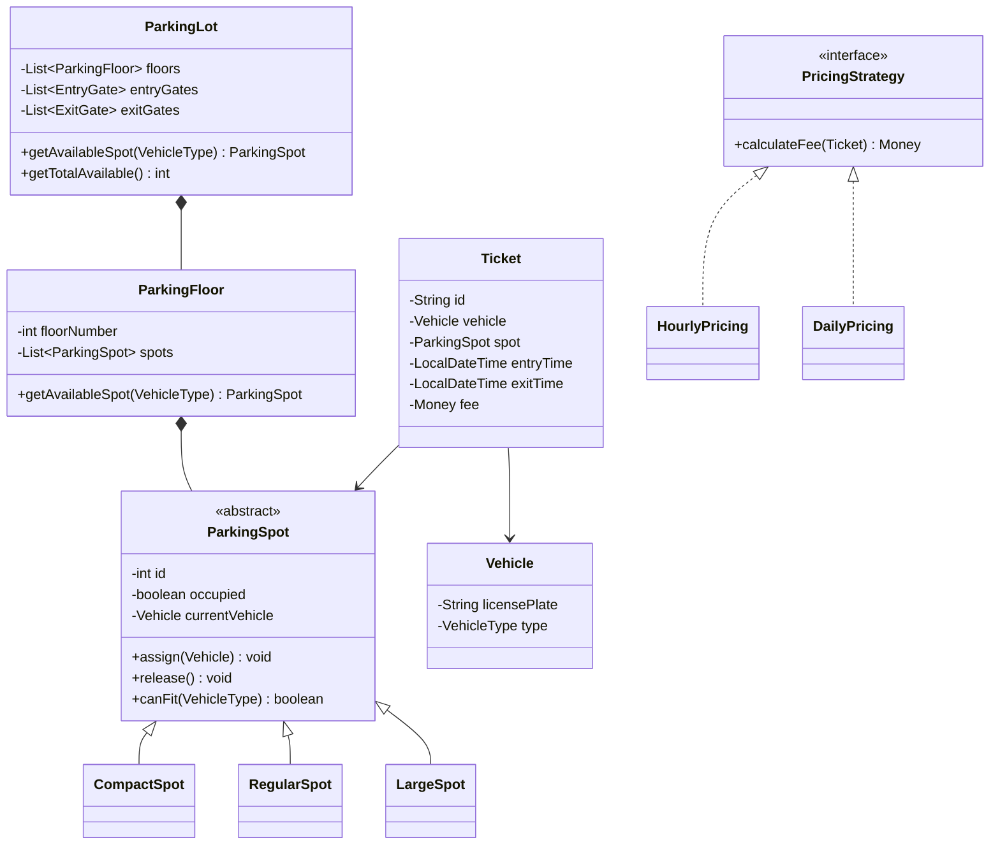

#system-design #lld #example #java #resource-management

# LLD: Parking Lot System (Java)

## Problem Type: Resource Management

---

## Requirements

- Multi-floor parking lot with different spot types (compact, regular, large)
- Support vehicle types: motorcycle, car, bus
- Assign nearest available spot matching vehicle type
- Ticket-based entry/exit with fee calculation
- Multiple entry/exit gates

---

## Class Diagram



---

## Java Implementation

```java
// === Enums ===
public enum VehicleType { MOTORCYCLE, CAR, BUS }

// === Vehicle ===
public class Vehicle {
    private final String licensePlate;
    private final VehicleType type;

    public Vehicle(String licensePlate, VehicleType type) {
        this.licensePlate = licensePlate;
        this.type = type;
    }
    public VehicleType getType() { return type; }
    public String getLicensePlate() { return licensePlate; }
}

// === Parking Spot (Abstract) ===
public abstract class ParkingSpot {
    private final int id;
    private boolean occupied;
    private Vehicle currentVehicle;

    public ParkingSpot(int id) { this.id = id; }

    public synchronized boolean assign(Vehicle vehicle) {
        if (occupied || !canFit(vehicle.getType())) return false;
        this.currentVehicle = vehicle;
        this.occupied = true;
        return true;
    }

    public synchronized void release() {
        this.currentVehicle = null;
        this.occupied = false;
    }

    public abstract boolean canFit(VehicleType type);
    public boolean isOccupied() { return occupied; }
    public int getId() { return id; }
}

public class CompactSpot extends ParkingSpot {
    public CompactSpot(int id) { super(id); }
    public boolean canFit(VehicleType type) {
        return type == VehicleType.MOTORCYCLE || type == VehicleType.CAR;
    }
}

public class RegularSpot extends ParkingSpot {
    public RegularSpot(int id) { super(id); }
    public boolean canFit(VehicleType type) {
        return type != VehicleType.BUS;
    }
}

public class LargeSpot extends ParkingSpot {
    public LargeSpot(int id) { super(id); }
    public boolean canFit(VehicleType type) { return true; } // fits all
}

// === Pricing Strategy ===
public interface PricingStrategy {
    double calculateFee(long hoursParked, VehicleType type);
}

public class HourlyPricing implements PricingStrategy {
    private static final Map<VehicleType, Double> RATES = Map.of(
        VehicleType.MOTORCYCLE, 20.0,
        VehicleType.CAR, 40.0,
        VehicleType.BUS, 80.0
    );

    public double calculateFee(long hours, VehicleType type) {
        return Math.max(1, hours) * RATES.getOrDefault(type, 40.0);
    }
}

// === Ticket ===
public class Ticket {
    private final String id;
    private final Vehicle vehicle;
    private final ParkingSpot spot;
    private final LocalDateTime entryTime;
    private LocalDateTime exitTime;
    private double fee;

    public Ticket(Vehicle vehicle, ParkingSpot spot) {
        this.id = UUID.randomUUID().toString();
        this.vehicle = vehicle;
        this.spot = spot;
        this.entryTime = LocalDateTime.now();
    }

    public void closeTicket(PricingStrategy pricing) {
        this.exitTime = LocalDateTime.now();
        long hours = ChronoUnit.HOURS.between(entryTime, exitTime);
        this.fee = pricing.calculateFee(hours, vehicle.getType());
        spot.release();
    }

    // getters...
}

// === Parking Lot ===
public class ParkingLot {
    private final List<ParkingFloor> floors;
    private final Map<String, Ticket> activeTickets = new ConcurrentHashMap<>();
    private final PricingStrategy pricing;

    public ParkingLot(List<ParkingFloor> floors, PricingStrategy pricing) {
        this.floors = floors;
        this.pricing = pricing;
    }

    public Ticket entry(Vehicle vehicle) {
        ParkingSpot spot = findAvailableSpot(vehicle.getType());
        if (spot == null) throw new RuntimeException("No available spot");
        spot.assign(vehicle);
        Ticket ticket = new Ticket(vehicle, spot);
        activeTickets.put(ticket.getId(), ticket);
        return ticket;
    }

    public double exit(String ticketId) {
        Ticket ticket = activeTickets.remove(ticketId);
        if (ticket == null) throw new RuntimeException("Invalid ticket");
        ticket.closeTicket(pricing);
        return ticket.getFee();
    }

    private ParkingSpot findAvailableSpot(VehicleType type) {
        return floors.stream()
            .flatMap(f -> f.getSpots().stream())
            .filter(s -> !s.isOccupied() && s.canFit(type))
            .findFirst()
            .orElse(null);
    }
}
```

---

## Design Patterns Used

| Pattern | Where | Why |
|---------|-------|-----|
| **Strategy** | PricingStrategy | Swap pricing algorithms (hourly/daily) without changing ParkingLot |
| **Factory** | Could add SpotFactory | Create spots based on configuration |
| **Template Method** | ParkingSpot.canFit() | Each spot type defines its own fit logic |

## One-Change Test

| Change | Classes Modified |
|--------|-----------------|
| Add EV charging spots | 1 new: `EVSpot extends ParkingSpot` |
| Add daily pricing | 1 new: `DailyPricing implements PricingStrategy` |
| Add valet parking | 1 new: `ValetService` using existing `ParkingLot` |

All pass — 1 new class per change, 0 modifications.

---

## Concurrency Handling

**Race condition:** Two cars enter simultaneously and both get assigned the same spot.

```java
// Critical section: find + assign must be atomic
public synchronized Ticket park(Vehicle vehicle) {
    ParkingSpot spot = findAvailableSpot(vehicle.getType());
    if (spot == null) throw new NoSpotAvailableException("Lot is full");
    spot.occupy(vehicle);
    Ticket ticket = new Ticket(UUID.randomUUID().toString(), spot, vehicle, LocalDateTime.now());
    activeTickets.put(ticket.getId(), ticket);
    return ticket;
}

public synchronized void unpark(String ticketId) {
    Ticket ticket = activeTickets.remove(ticketId);
    if (ticket == null) throw new InvalidTicketException("Ticket not found: " + ticketId);
    ticket.getSpot().vacate();
    ticket.setExitTime(LocalDateTime.now());
}
```

**Alternative — per-spot locking (higher throughput):**
```java
// Lock at spot level, not lot level — allows concurrent parking on different spots
public class ParkingSpot {
    private final AtomicBoolean occupied = new AtomicBoolean(false);

    public boolean tryOccupy(Vehicle vehicle) {
        if (occupied.compareAndSet(false, true)) {  // atomic CAS
            this.vehicle = vehicle;
            return true;
        }
        return false;  // already taken
    }
}
```

---

## Error Handling & Edge Cases

```java
// 1. Lot is full
if (spot == null) throw new NoSpotAvailableException("No " + type + " spots available");

// 2. Invalid ticket on exit
if (ticket == null) throw new InvalidTicketException("Ticket " + id + " not found or already used");

// 3. Wrong vehicle type for spot
if (!spot.canFit(vehicle.getType()))
    throw new InvalidVehicleTypeException("Spot " + spot.getId() + " cannot fit " + vehicle.getType());

// 4. Vehicle already parked (same vehicle entering twice)
if (parkedVehicles.containsKey(vehicle.getNumber()))
    throw new VehicleAlreadyParkedException(vehicle.getNumber() + " is already parked");

// 5. Negative hours (system clock issue)
double hours = Math.max(0, ChronoUnit.HOURS.between(entry, exit));
```

**Edge cases to mention in interview:**
- What if power goes out? (Ticket IDs in DB, spot status recoverable)
- Multiple entry/exit gates? (Distributed lock or DB-level locking)
- Monthly pass holders? (Add PassHolder strategy)

---

## Follow-up Questions

| Question | Answer Direction |
|----------|-----------------|
| How to handle multiple parking lots? | Add `ParkingLotManager` coordinating multiple `ParkingLot` instances |
| How to show real-time availability? | Observer pattern — subscribers notified on park/unpark |
| How to support pre-booking? | Add `Reservation` entity with future time slots |
| How to handle peak hour pricing? | `PeakHourPricingDecorator` wraps existing `PricingStrategy` |
| How to scale to 10 lots across the city? | Central `SpotRegistry` service, distributed locking per spot |

---

## Company-Specific Variants

**Amazon / Flipkart (warehouse context):**
- Replace vehicles with delivery packages (SMALL, MEDIUM, LARGE)
- Add weight capacity per spot
- Priority slots for urgent deliveries

**Uber / Ola:**
- Track driver vehicle type with parking spot preferences
- Integration with driver app — push notification when spot assigned

**Airport Parking (advanced):**
- Multiple terminals, long-term vs short-term lots
- Shuttle service integration
- Dynamic pricing (surge on holidays)

---

## Links

- [[../lld_thinking_system]] — The pipeline that produced this design
- [[../patterns/behavioral]] — Strategy pattern
- [[../one_change_test]] — Extensibility validation
- [[../lld_concurrency_patterns]] — Thread safety patterns
- [[../lld_database_design]] — Schema for persistence
