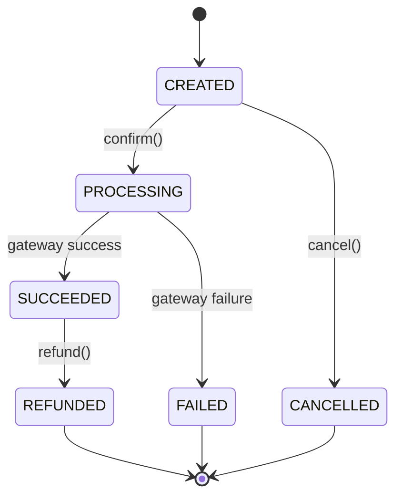
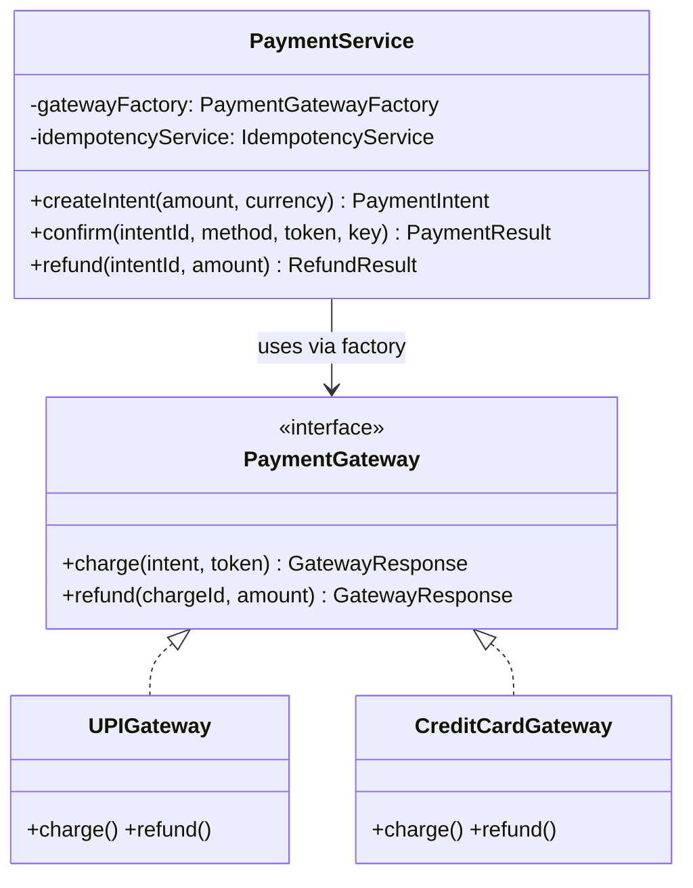

#system-design #lld #financial #stripe

# LLD: Payment System

**Type:** Financial + State Machine
**Difficulty:** Hard
**Asked at:** Stripe, Razorpay, PhonePe, CRED, Paytm, Goldman Sachs

---

## Requirements Clarification

1. What payment methods? (UPI, Credit Card, Net Banking, Wallet)
2. Synchronous or asynchronous processing?
3. Refunds supported?
4. Idempotency required? (Yes — critical for payments)
5. Retry on failure?
6. Multiple currencies?
7. Webhooks for status updates?

**Scope:** Create payment intent → add payment method → confirm → success/failure. Refunds, idempotency, retry.

---

## State Machine

```
CREATED → PROCESSING → SUCCEEDED
                    ↘ FAILED → REFUNDED (if already captured)
CREATED → CANCELLED (before processing)
```

---

## Class Diagram

```
PaymentService
    ├── uses → PaymentGateway (interface)
    │            ├── UPIGateway
    │            ├── CreditCardGateway
    │            └── NetBankingGateway
    ├── uses → IdempotencyService
    ├── uses → PaymentRepository
    └── uses → RefundService

PaymentIntent
    ├── id, amount, currency, status
    ├── paymentMethodId
    └── metadata

PaymentGatewayFactory
    └── creates → PaymentGateway by method type
```

---

## Mermaid Diagrams





---

## Complete Java Implementation

```java
// Payment status
public enum PaymentStatus {
    CREATED, PROCESSING, SUCCEEDED, FAILED, CANCELLED, REFUNDED
}

// Payment method types
public enum PaymentMethodType { UPI, CREDIT_CARD, NET_BANKING, WALLET }

// Payment intent — central entity
public class PaymentIntent {
    private final String id;
    private final double amount;
    private final String currency;
    private PaymentStatus status;
    private PaymentMethodType paymentMethod;
    private String failureReason;
    private final LocalDateTime createdAt;
    private LocalDateTime updatedAt;
    private final Map<String, String> metadata;

    public PaymentIntent(double amount, String currency) {
        this.id        = "pi_" + UUID.randomUUID().toString().replace("-", "").substring(0, 16);
        this.amount    = amount;
        this.currency  = currency;
        this.status    = PaymentStatus.CREATED;
        this.createdAt = LocalDateTime.now();
        this.metadata  = new HashMap<>();
    }

    public void transitionTo(PaymentStatus newStatus) {
        validateTransition(this.status, newStatus);
        this.status    = newStatus;
        this.updatedAt = LocalDateTime.now();
    }

    private void validateTransition(PaymentStatus from, PaymentStatus to) {
        Set<PaymentStatus> allowedFrom = switch (from) {
            case CREATED    -> Set.of(PaymentStatus.PROCESSING, PaymentStatus.CANCELLED);
            case PROCESSING -> Set.of(PaymentStatus.SUCCEEDED, PaymentStatus.FAILED);
            case FAILED     -> Set.of(PaymentStatus.REFUNDED);  // if partial capture
            case SUCCEEDED  -> Set.of(PaymentStatus.REFUNDED);
            default         -> Set.of();  // terminal states
        };
        if (!allowedFrom.contains(to))
            throw new InvalidStateTransitionException(
                "Cannot transition from " + from + " to " + to);
    }

    // Getters
    public String getId()             { return id; }
    public double getAmount()         { return amount; }
    public String getCurrency()       { return currency; }
    public PaymentStatus getStatus()  { return status; }
    public void setFailureReason(String r) { this.failureReason = r; }
}

// Gateway abstraction — Strategy pattern
public interface PaymentGateway {
    GatewayResponse charge(PaymentIntent intent, String paymentMethodToken);
    GatewayResponse refund(String chargeId, double amount);
    PaymentMethodType getSupportedMethod();
}

// Gateway response
public class GatewayResponse {
    private final boolean success;
    private final String gatewayChargeId;
    private final String failureCode;    // machine-readable
    private final String failureMessage; // human-readable

    public static GatewayResponse success(String chargeId) { ... }
    public static GatewayResponse failure(String code, String message) { ... }
    public boolean isSuccess()          { return success; }
    public String getGatewayChargeId()  { return gatewayChargeId; }
    public String getFailureCode()      { return failureCode; }
}

// Concrete gateways
public class UPIGateway implements PaymentGateway {
    private final RazorpayUPIClient client;

    public GatewayResponse charge(PaymentIntent intent, String upiId) {
        try {
            String chargeId = client.initiatePayment(upiId, intent.getAmount(), intent.getCurrency());
            return GatewayResponse.success(chargeId);
        } catch (UPIException e) {
            return GatewayResponse.failure(e.getErrorCode(), e.getMessage());
        }
    }

    public GatewayResponse refund(String chargeId, double amount) {
        try {
            client.refund(chargeId, amount);
            return GatewayResponse.success(chargeId);
        } catch (UPIException e) {
            return GatewayResponse.failure(e.getErrorCode(), e.getMessage());
        }
    }

    public PaymentMethodType getSupportedMethod() { return PaymentMethodType.UPI; }
}

// Gateway factory
public class PaymentGatewayFactory {
    private final Map<PaymentMethodType, PaymentGateway> gateways;

    public PaymentGatewayFactory() {
        gateways = Map.of(
            PaymentMethodType.UPI,         new UPIGateway(new RazorpayUPIClient()),
            PaymentMethodType.CREDIT_CARD, new CreditCardGateway(new StripeClient()),
            PaymentMethodType.NET_BANKING, new NetBankingGateway(new CCAvenuClient())
        );
    }

    public PaymentGateway get(PaymentMethodType type) {
        PaymentGateway gateway = gateways.get(type);
        if (gateway == null)
            throw new UnsupportedPaymentMethodException("No gateway for: " + type);
        return gateway;
    }
}

// Idempotency service
public class IdempotencyService {
    private final ConcurrentHashMap<String, PaymentResult> store = new ConcurrentHashMap<>();

    public Optional<PaymentResult> get(String key) {
        return Optional.ofNullable(store.get(key));
    }

    public void store(String key, PaymentResult result, Duration ttl) {
        store.put(key, result);
        // Schedule removal after TTL (simplified)
        scheduler.schedule(() -> store.remove(key), ttl.toMillis(), TimeUnit.MILLISECONDS);
    }
}

// Main payment service
public class PaymentService {
    private final PaymentGatewayFactory gatewayFactory;
    private final PaymentRepository repository;
    private final IdempotencyService idempotencyService;

    // Create payment intent
    public PaymentIntent createIntent(double amount, String currency, Map<String, String> metadata) {
        if (amount <= 0) throw new InvalidAmountException("Amount must be positive");
        if (!isSupportedCurrency(currency))
            throw new UnsupportedCurrencyException("Currency not supported: " + currency);

        PaymentIntent intent = new PaymentIntent(amount, currency);
        intent.getMetadata().putAll(metadata);
        repository.save(intent);
        return intent;
    }

    // Confirm payment (Stripe-style)
    public PaymentResult confirm(String intentId, PaymentMethodType method,
                                  String paymentToken, String idempotencyKey) {
        // Check idempotency — return cached result for duplicate requests
        Optional<PaymentResult> cached = idempotencyService.get(idempotencyKey);
        if (cached.isPresent()) return cached.get();

        PaymentIntent intent = repository.findById(intentId)
            .orElseThrow(() -> new PaymentNotFoundException(intentId));

        if (intent.getStatus() != PaymentStatus.CREATED)
            throw new PaymentAlreadyProcessedException("Payment " + intentId + " is " + intent.getStatus());

        // Process payment
        intent.transitionTo(PaymentStatus.PROCESSING);
        repository.save(intent);

        PaymentGateway gateway = gatewayFactory.get(method);
        GatewayResponse response = gateway.charge(intent, paymentToken);

        PaymentResult result;
        if (response.isSuccess()) {
            intent.transitionTo(PaymentStatus.SUCCEEDED);
            result = PaymentResult.success(intent, response.getGatewayChargeId());
        } else {
            intent.transitionTo(PaymentStatus.FAILED);
            intent.setFailureReason(response.getFailureMessage());
            result = PaymentResult.failure(intent, response.getFailureCode(), response.getFailureMessage());
        }

        repository.save(intent);
        idempotencyService.store(idempotencyKey, result, Duration.ofHours(24));
        return result;
    }

    // Refund
    public RefundResult refund(String intentId, double amount, String reason) {
        PaymentIntent intent = repository.findById(intentId)
            .orElseThrow(() -> new PaymentNotFoundException(intentId));

        if (intent.getStatus() != PaymentStatus.SUCCEEDED)
            throw new InvalidRefundException("Can only refund SUCCEEDED payments");

        if (amount > intent.getAmount())
            throw new InvalidRefundException("Refund amount " + amount + " exceeds payment " + intent.getAmount());

        // Process refund via same gateway
        PaymentGateway gateway = gatewayFactory.get(intent.getPaymentMethod());
        GatewayResponse response = gateway.refund(intent.getGatewayChargeId(), amount);

        if (response.isSuccess()) {
            intent.transitionTo(PaymentStatus.REFUNDED);
            repository.save(intent);
            return RefundResult.success(intentId, amount);
        }

        return RefundResult.failure(intentId, response.getFailureCode());
    }
}
```

---

## Design Patterns Used

| Pattern | Where | Why |
|---------|-------|-----|
| **Strategy** | `PaymentGateway` | Swap UPI/Card/NetBanking without changing service |
| **Factory** | `PaymentGatewayFactory` | Clean gateway creation |
| **State** | `PaymentIntent.transitionTo()` | Valid state transitions enforced |
| **Command** | (Extension) `PaymentCommand` | Audit trail, retry support |
| **Idempotency** | `IdempotencyService` | Prevent double charges on retry |

---

## Concurrency Handling

```java
// Critical: Two threads confirming same payment simultaneously
// Solution: Database-level optimistic lock

// PaymentIntent has version field
UPDATE payment_intents
SET status='PROCESSING', version=version+1
WHERE id=? AND status='CREATED' AND version=?

// If 0 rows affected → someone else got there first → throw ConcurrentPaymentException
```

---

## Error Handling & Edge Cases

```java
// 1. Gateway timeout (most critical edge case in payments)
// NEVER charge customer if gateway response is unknown
// Use idempotency key to safely retry

// 2. Partial capture followed by failed final capture
// Track captured vs authorized amount separately

// 3. Currency mismatch
// Validate currency at intent creation, not at confirmation

// 4. Expired payment intent (15 min window)
if (intent.getCreatedAt().plusMinutes(15).isBefore(LocalDateTime.now()))
    throw new PaymentIntentExpiredException("Payment window expired");

// 5. Negative refund amount
if (amount <= 0) throw new InvalidRefundException("Refund amount must be positive");
```

---

## One-Change Test

| Change | Impact |
|--------|--------|
| Add Wallet payment method | 1 new: `WalletGateway implements PaymentGateway` + register in factory |
| Add partial refunds | `RefundService` tracks total refunded per intent |
| Add webhook on status change | Observer: `PaymentEventPublisher.publish()` in `confirm()` |

---

## Links

- [[../patterns/behavioral]] — State, Strategy patterns
- [[../lld_concurrency_patterns]] — Optimistic locking for payments
- [[../lld_api_design]] — REST API for payments (Stripe-style)
- [[../../02_building_blocks/payment_systems]] — HLD payment systems
