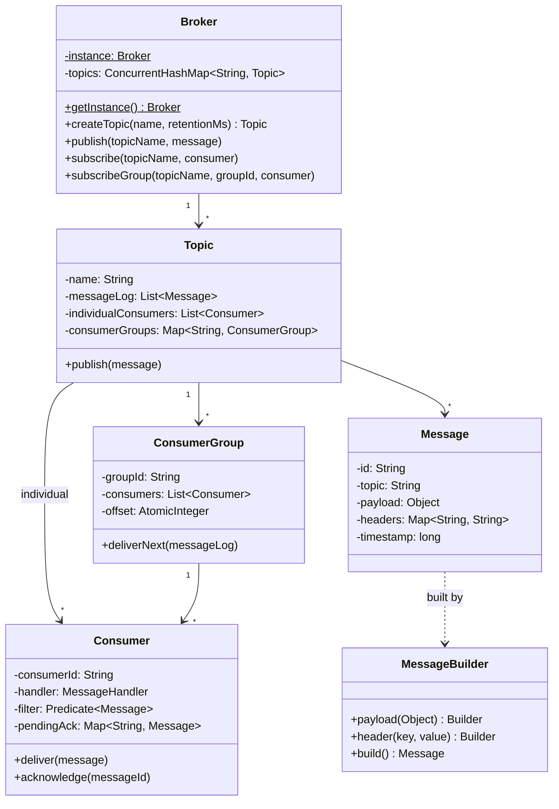

#system-design #lld #sdk #messaging

# LLD: Pub-Sub Messaging System

**Type:** SDK / Library
**Difficulty:** Medium
**Asked at:** Stripe, Google, Confluent, Kafka-like design, Amazon SNS/SQS design

---

## Requirements Clarification

1. Are named topics supported? (yes — publishers and consumers address by topic name)
2. Are consumer groups supported? (yes — multiple consumers share load round-robin within a group)
3. Is message persistence needed? (in-memory for this design; log is retained for replay)
4. Is message ordering guaranteed? (yes — within a topic, FIFO)
5. At-least-once or exactly-once delivery? (at-least-once — unacknowledged messages are re-delivered)
6. Can subscribers filter messages? (yes — per-consumer predicate filter)

**Scope:** In-process pub-sub library. Topics created on demand. Individual consumers receive all messages; consumer group consumers share load via round-robin offset. Messages expire after `retentionMs`. At-least-once delivery with explicit acknowledgement.

---

## Problem Type

**SDK / Library** — design an in-process message broker. Key patterns: **Observer** (push on publish), **Mediator** (Broker routes all messages), **Builder** (Message construction), **Factory** (Broker.createTopic).

---

## Class Diagram

```
Broker (Singleton)
    ├── topics: ConcurrentHashMap<String, Topic>
    ├── createTopic(name, retentionMs): Topic
    ├── publish(topicName, message): void
    ├── subscribe(topicName, consumer): void
    └── subscribeGroup(topicName, groupId, consumer): void

Topic
    ├── name: String
    ├── messageLog: List<Message>        ← guarded by ReadWriteLock
    ├── individualConsumers: List<Consumer>
    ├── consumerGroups: Map<String, ConsumerGroup>
    └── retentionMs: long

ConsumerGroup
    ├── groupId: String
    ├── consumers: List<Consumer>
    └── offset: AtomicInteger            ← round-robin delivery index into messageLog

Consumer
    ├── consumerId: String
    ├── handler: MessageHandler          ← @FunctionalInterface
    ├── filter: Predicate<Message>
    └── pendingAck: Map<String, Message> ← unacknowledged messages (at-least-once)

Message
    ├── id: String
    ├── topic: String
    ├── payload: Object
    ├── headers: Map<String, String>
    ├── timestamp: long
    └── retentionMs: long

MessageHandler (@FunctionalInterface)
    └── void handle(Message message)
```

### Mermaid Class Diagram



---

## Core Interfaces & Abstractions

```java
// Functional interface — consumers are lambdas or method references
@FunctionalInterface
public interface MessageHandler {
    void handle(Message message);
}

// Exception hierarchy
public class BrokerException extends RuntimeException {
    public BrokerException(String msg) { super(msg); }
}
public class TopicNotFoundException extends BrokerException {
    public TopicNotFoundException(String topic) { super("Topic not found: " + topic); }
}
public class MessageTooLargeException extends BrokerException {
    public MessageTooLargeException(int size, int max) {
        super("Message size " + size + " exceeds limit " + max);
    }
}
```

---

## Complete Java Implementation

```java
import java.util.*;
import java.util.concurrent.*;
import java.util.concurrent.atomic.*;
import java.util.concurrent.locks.*;
import java.util.function.Predicate;
import java.util.stream.Collectors;

// ─── Exceptions ───────────────────────────────────────────────────────────────

class BrokerException extends RuntimeException {
    public BrokerException(String msg) { super(msg); }
}
class TopicNotFoundException extends BrokerException {
    public TopicNotFoundException(String topic) { super("Topic not found: " + topic); }
}
class MessageTooLargeException extends BrokerException {
    public MessageTooLargeException(int size, int max) {
        super("Message size " + size + " bytes exceeds limit " + max + " bytes");
    }
}

// ─── Message (Builder Pattern) ───────────────────────────────────────────────

class Message {
    private final String id;
    private final String topic;
    private final Object payload;
    private final Map<String, String> headers;
    private final long timestamp;
    private final long retentionMs;

    private Message(Builder builder) {
        this.id          = builder.id;
        this.topic       = builder.topic;
        this.payload     = builder.payload;
        this.headers     = Collections.unmodifiableMap(new HashMap<>(builder.headers));
        this.timestamp   = System.currentTimeMillis();
        this.retentionMs = builder.retentionMs;
    }

    public boolean isExpired() {
        return retentionMs > 0 && (System.currentTimeMillis() - timestamp) > retentionMs;
    }

    public String getId()                    { return id; }
    public String getTopic()                 { return topic; }
    public Object getPayload()               { return payload; }
    public Map<String, String> getHeaders()  { return headers; }
    public long getTimestamp()               { return timestamp; }

    @Override
    public String toString() {
        return String.format("Message{id=%s, topic=%s, payload=%s}", id, topic, payload);
    }

    public static class Builder {
        private String id = UUID.randomUUID().toString();
        private final String topic;
        private Object payload;
        private final Map<String, String> headers = new HashMap<>();
        private long retentionMs = 0;  // 0 = never expire

        public Builder(String topic) { this.topic = topic; }

        public Builder id(String id)                     { this.id = id; return this; }
        public Builder payload(Object payload)           { this.payload = payload; return this; }
        public Builder header(String key, String value)  { this.headers.put(key, value); return this; }
        public Builder retentionMs(long ms)              { this.retentionMs = ms; return this; }
        public Message build()                           { return new Message(this); }
    }
}

// ─── MessageHandler ───────────────────────────────────────────────────────────

@FunctionalInterface
interface MessageHandler {
    void handle(Message message);
}

// ─── Consumer ─────────────────────────────────────────────────────────────────

class Consumer {
    private final String consumerId;
    private final MessageHandler handler;
    private final Predicate<Message> filter;
    // At-least-once: track unacknowledged messages
    private final Map<String, Message> pendingAck = new ConcurrentHashMap<>();

    public Consumer(String consumerId, MessageHandler handler, Predicate<Message> filter) {
        this.consumerId = consumerId;
        this.handler    = handler;
        this.filter     = filter != null ? filter : msg -> true;
    }

    public Consumer(String consumerId, MessageHandler handler) {
        this(consumerId, handler, null);
    }

    // Deliver message — only if it passes the filter
    public void deliver(Message message) {
        if (!filter.test(message)) return;
        if (message.isExpired()) {
            System.out.printf("  [%s] Skipping expired message %s%n", consumerId, message.getId());
            return;
        }
        pendingAck.put(message.getId(), message);
        try {
            handler.handle(message);
            // Auto-ack on successful handling
            pendingAck.remove(message.getId());
        } catch (Exception e) {
            // At-least-once: message stays in pendingAck for redelivery
            System.err.printf("  [%s] Handler failed for %s: %s — will redeliver%n",
                consumerId, message.getId(), e.getMessage());
        }
    }

    public void acknowledge(String messageId) {
        pendingAck.remove(messageId);
    }

    // Redeliver all unacknowledged messages (called on consumer reconnect)
    public void redeliverPending() {
        if (pendingAck.isEmpty()) return;
        System.out.printf("  [%s] Redelivering %d unacknowledged messages%n",
            consumerId, pendingAck.size());
        new ArrayList<>(pendingAck.values()).forEach(this::deliver);
    }

    public String getConsumerId()         { return consumerId; }
    public Map<String, Message> getPendingAck() { return Collections.unmodifiableMap(pendingAck); }
}

// ─── Consumer Group ───────────────────────────────────────────────────────────

class ConsumerGroup {
    private final String groupId;
    private final List<Consumer> consumers = new CopyOnWriteArrayList<>();
    // offset tracks the index in the topic's messageLog for this group
    private final AtomicInteger offset = new AtomicInteger(0);

    public ConsumerGroup(String groupId) {
        this.groupId = groupId;
    }

    public void addConsumer(Consumer consumer) {
        consumers.add(consumer);
        System.out.printf("  [GROUP:%s] Consumer %s joined (%d total)%n",
            groupId, consumer.getConsumerId(), consumers.size());
    }

    // Deliver next undelivered message to exactly one consumer (round-robin on consumers)
    public void deliverNext(List<Message> messageLog) {
        if (consumers.isEmpty()) return;
        int idx = offset.getAndIncrement();
        if (idx >= messageLog.size()) return;

        Message message = messageLog.get(idx);
        if (message.isExpired()) return;

        // Pick consumer round-robin by idx modulo consumer count
        Consumer consumer = consumers.get(idx % consumers.size());
        consumer.deliver(message);
    }

    // Replay from a stored offset (consumer group comes back online)
    public void replayFrom(int fromOffset, List<Message> messageLog) {
        System.out.printf("  [GROUP:%s] Replaying from offset %d%n", groupId, fromOffset);
        offset.set(fromOffset);
        for (int i = fromOffset; i < messageLog.size(); i++) {
            deliverNext(messageLog);
        }
    }

    public String getGroupId()  { return groupId; }
    public int getCurrentOffset() { return offset.get(); }
}

// ─── Topic ────────────────────────────────────────────────────────────────────

class Topic {
    private final String name;
    private final long retentionMs;
    private final List<Message> messageLog = new ArrayList<>();
    private final ReadWriteLock lock = new ReentrantReadWriteLock();

    // Individual consumers: all receive every message
    private final List<Consumer> individualConsumers = new CopyOnWriteArrayList<>();
    // Consumer groups: each group gets each message once, distributed round-robin
    private final Map<String, ConsumerGroup> consumerGroups = new ConcurrentHashMap<>();

    public Topic(String name, long retentionMs) {
        this.name        = name;
        this.retentionMs = retentionMs;
    }

    public void publish(Message message) {
        lock.writeLock().lock();
        try {
            messageLog.add(message);
            System.out.printf("[TOPIC:%s] Published %s%n", name, message);
        } finally {
            lock.writeLock().unlock();
        }

        // Deliver to all individual consumers (snapshot outside lock)
        individualConsumers.forEach(c -> c.deliver(message));

        // Deliver next pending message to each consumer group
        List<Message> snapshot = getMessageLogSnapshot();
        consumerGroups.values().forEach(group -> group.deliverNext(snapshot));
    }

    public void addIndividualConsumer(Consumer consumer) {
        individualConsumers.add(consumer);
        System.out.printf("[TOPIC:%s] Individual consumer %s subscribed%n",
            name, consumer.getConsumerId());
    }

    public ConsumerGroup getOrCreateGroup(String groupId) {
        return consumerGroups.computeIfAbsent(groupId, ConsumerGroup::new);
    }

    public List<Message> getMessageLogSnapshot() {
        lock.readLock().lock();
        try {
            return new ArrayList<>(messageLog);
        } finally {
            lock.readLock().unlock();
        }
    }

    // Remove expired messages to free memory
    public int purgeExpired() {
        lock.writeLock().lock();
        try {
            int before = messageLog.size();
            messageLog.removeIf(Message::isExpired);
            int removed = before - messageLog.size();
            if (removed > 0)
                System.out.printf("[TOPIC:%s] Purged %d expired messages%n", name, removed);
            return removed;
        } finally {
            lock.writeLock().unlock();
        }
    }

    public String getName()    { return name; }
    public long getRetentionMs() { return retentionMs; }
    public int getMessageCount() {
        lock.readLock().lock();
        try { return messageLog.size(); }
        finally { lock.readLock().unlock(); }
    }
}

// ─── Broker (Singleton + Mediator + Factory) ──────────────────────────────────

class Broker {
    private static final int MAX_MESSAGE_SIZE_BYTES = 1024 * 1024;  // 1 MB
    private static volatile Broker instance;
    private final ConcurrentHashMap<String, Topic> topics = new ConcurrentHashMap<>();
    private final boolean autoCreateTopics;

    private Broker(boolean autoCreateTopics) {
        this.autoCreateTopics = autoCreateTopics;
    }

    public static Broker getInstance() {
        if (instance == null) {
            synchronized (Broker.class) {
                if (instance == null) instance = new Broker(true);
            }
        }
        return instance;
    }

    // Factory method
    public Topic createTopic(String name, long retentionMs) {
        Topic topic = new Topic(name, retentionMs);
        if (topics.putIfAbsent(name, topic) != null) {
            System.out.println("[BROKER] Topic already exists: " + name);
            return topics.get(name);
        }
        System.out.println("[BROKER] Created topic: " + name + " (retention=" + retentionMs + "ms)");
        return topic;
    }

    public void publish(String topicName, Message message) {
        validateMessageSize(message);
        Topic topic = resolveTopic(topicName);
        topic.publish(message);
    }

    // Individual subscription — consumer gets all messages
    public void subscribe(String topicName, Consumer consumer) {
        Topic topic = resolveTopic(topicName);
        topic.addIndividualConsumer(consumer);
    }

    // Group subscription — consumers in the group share load
    public void subscribeGroup(String topicName, String groupId, Consumer consumer) {
        Topic topic = resolveTopic(topicName);
        ConsumerGroup group = topic.getOrCreateGroup(groupId);
        group.addConsumer(consumer);
    }

    // Replay group from a stored offset (after coming back online)
    public void replayGroup(String topicName, String groupId, int fromOffset) {
        Topic topic = getExistingTopic(topicName);
        ConsumerGroup group = topic.getOrCreateGroup(groupId);
        group.replayFrom(fromOffset, topic.getMessageLogSnapshot());
    }

    public void purgeExpired() {
        topics.values().forEach(Topic::purgeExpired);
    }

    public Map<String, Integer> getTopicStats() {
        return topics.entrySet().stream()
            .collect(Collectors.toMap(Map.Entry::getKey, e -> e.getValue().getMessageCount()));
    }

    private Topic resolveTopic(String topicName) {
        if (autoCreateTopics) {
            return topics.computeIfAbsent(topicName, name -> new Topic(name, 0));
        }
        return getExistingTopic(topicName);
    }

    private Topic getExistingTopic(String topicName) {
        Topic topic = topics.get(topicName);
        if (topic == null) throw new TopicNotFoundException(topicName);
        return topic;
    }

    private void validateMessageSize(Message message) {
        // Approximate size check on payload string representation
        String payloadStr = message.getPayload() != null ? message.getPayload().toString() : "";
        if (payloadStr.length() > MAX_MESSAGE_SIZE_BYTES) {
            throw new MessageTooLargeException(payloadStr.length(), MAX_MESSAGE_SIZE_BYTES);
        }
    }

    // For testing: reset singleton
    static void reset() { instance = null; }
}
```

---

## Usage Demo

```java
public class PubSubDemo {
    public static void main(String[] args) throws InterruptedException {
        Broker broker = Broker.getInstance();

        // Create topic with 5-second retention
        broker.createTopic("orders", 5000);

        // Individual consumer — receives ALL messages
        Consumer logger = new Consumer("logger",
            msg -> System.out.println("  [LOGGER] " + msg.getPayload()));

        // Individual consumer with filter — only PREMIUM orders
        Consumer premiumAlert = new Consumer("premium-alert",
            msg -> System.out.println("  [PREMIUM] High-value order: " + msg.getPayload()),
            msg -> {
                Object val = msg.getHeaders().get("amount");
                return val != null && Integer.parseInt(val.toString()) > 1000;
            });

        broker.subscribe("orders", logger);
        broker.subscribe("orders", premiumAlert);

        // Consumer group "fulfillment" — 2 workers share load round-robin
        Consumer worker1 = new Consumer("worker-1",
            msg -> System.out.println("  [WORKER-1] Processing: " + msg.getPayload()));
        Consumer worker2 = new Consumer("worker-2",
            msg -> System.out.println("  [WORKER-2] Processing: " + msg.getPayload()));

        broker.subscribeGroup("orders", "fulfillment", worker1);
        broker.subscribeGroup("orders", "fulfillment", worker2);

        // Publish messages
        broker.publish("orders", new Message.Builder("orders")
            .payload("Order#101 — Basic Widget")
            .header("amount", "200")
            .build());

        broker.publish("orders", new Message.Builder("orders")
            .payload("Order#102 — Premium Package")
            .header("amount", "1500")
            .build());

        broker.publish("orders", new Message.Builder("orders")
            .payload("Order#103 — Bulk Deal")
            .header("amount", "300")
            .build());

        // Stats
        System.out.println("\nTopic stats: " + broker.getTopicStats());

        // Replay group from offset 0 (simulate group coming back online)
        System.out.println("\n--- Replaying fulfillment group from offset 0 ---");
        broker.replayGroup("orders", "fulfillment", 0);
    }
}
```

---

## Design Patterns Used

| Pattern | Where | Why |
|---------|-------|-----|
| **Observer** | `Topic.publish()` → delivers to `individualConsumers` | Subscribers are notified on every publish without polling |
| **Mediator** | `Broker` routes all publish/subscribe calls | Decouples publishers from topics and consumers from each other |
| **Builder** | `Message.Builder` | Readable construction of messages with optional fields; immutable result |
| **Factory** | `Broker.createTopic()` | Centralised topic creation with retention config; prevents duplicates |
| **Singleton** | `Broker.getInstance()` | One broker per process; double-checked locking for thread safety |
| **Strategy** | `Predicate<Message> filter` on `Consumer` | Pluggable message filtering without changing delivery logic |

---

## Concurrency Handling

```java
// 1. Concurrent publishers writing to the same topic: ReadWriteLock on messageLog
class Topic {
    private final ReadWriteLock lock = new ReentrantReadWriteLock();

    public void publish(Message message) {
        lock.writeLock().lock();   // exclusive write
        try {
            messageLog.add(message);
        } finally {
            lock.writeLock().unlock();
        }
        // Deliver outside lock — delivery does not need to hold the log lock
        individualConsumers.forEach(c -> c.deliver(message));
    }

    public List<Message> getMessageLogSnapshot() {
        lock.readLock().lock();    // concurrent reads OK
        try {
            return new ArrayList<>(messageLog);  // snapshot for safe iteration
        } finally {
            lock.readLock().unlock();
        }
    }
}

// 2. Concurrent consumers in same group: AtomicInteger offset
class ConsumerGroup {
    private final AtomicInteger offset = new AtomicInteger(0);

    public void deliverNext(List<Message> messageLog) {
        // getAndIncrement is atomic — each consumer gets a unique index
        int idx = offset.getAndIncrement();
        if (idx >= messageLog.size()) return;
        Message message = messageLog.get(idx);
        // consumers.get(idx % consumers.size()) distributes round-robin
        Consumer consumer = consumers.get(idx % consumers.size());
        consumer.deliver(message);
    }
}

// 3. Broker topic registry: ConcurrentHashMap + computeIfAbsent (atomic get-or-create)
topics.computeIfAbsent(topicName, name -> new Topic(name, 0));

// 4. Consumer list on Topic: CopyOnWriteArrayList — safe iteration while consumers subscribe
private final List<Consumer> individualConsumers = new CopyOnWriteArrayList<>();
```

---

## Error Handling & Edge Cases

```java
// 1. Publishing to non-existent topic (autoCreate = false)
private Topic getExistingTopic(String topicName) {
    Topic topic = topics.get(topicName);
    if (topic == null) throw new TopicNotFoundException(topicName);
    return topic;
}
// With autoCreate = true: topics.computeIfAbsent(topicName, name -> new Topic(name, 0))

// 2. Consumer group replay after being offline (stored offset)
public void replayGroup(String topicName, String groupId, int fromOffset) {
    Topic topic = getExistingTopic(topicName);
    ConsumerGroup group = topic.getOrCreateGroup(groupId);
    group.replayFrom(fromOffset, topic.getMessageLogSnapshot());
}
// Store offset durably (e.g., in Redis/DB) for production use

// 3. Message too large
private void validateMessageSize(Message message) {
    int size = message.getPayload().toString().length();
    if (size > MAX_MESSAGE_SIZE_BYTES)
        throw new MessageTooLargeException(size, MAX_MESSAGE_SIZE_BYTES);
}

// 4. Consumer crashes mid-processing (at-least-once re-delivery)
public void deliver(Message message) {
    pendingAck.put(message.getId(), message);
    try {
        handler.handle(message);
        pendingAck.remove(message.getId());  // auto-ack on success
    } catch (Exception e) {
        // message stays in pendingAck — redelivered on redeliverPending()
    }
}

// 5. No consumers for a topic — messages are buffered in messageLog
// New consumers will see messages from offset 0 when they subscribe
// Expired messages are purged via broker.purgeExpired()

// 6. Message retention expiry
public boolean isExpired() {
    return retentionMs > 0 && (System.currentTimeMillis() - timestamp) > retentionMs;
}
public void deliver(Message message) {
    if (message.isExpired()) { /* skip */ return; }
    // ...
}
```

---

## One-Change Test

| Change | Impact |
|--------|--------|
| Add dead-letter queue (DLQ) for failed messages | 1 change: `Consumer.deliver()` publishes to `"DLQ_" + topicName` on handler exception |
| Add message priority | 1 change: `Message` gets a `priority` field; `Topic.messageLog` becomes `PriorityQueue` sorted by priority |
| Add topic-level throughput metrics | 1 new: `TopicMetrics` class tracking messages/sec; injected as observer into `Topic.publish()` |
| Add push notifications (HTTP webhook per consumer) | 1 new: `WebhookConsumer extends Consumer` overrides `deliver()` to POST payload to a URL |

---

## Follow-up Questions

| Question | Answer |
|----------|--------|
| How to make this distributed (multi-node)? | Each node manages a partition; `Broker` becomes a partition router; use consistent hashing by `message.key` |
| How to guarantee exactly-once delivery? | Assign sequence numbers to messages; consumers deduplicate by `(consumerId, messageId)` in a seen-set |
| How to handle a very large topic (millions of messages)? | Segment the `messageLog` into fixed-size files on disk (like Kafka); `offset` maps to `(segmentId, positionInSegment)` |
| How to add backpressure? | `Topic` has a max queue size; `publish()` blocks or throws when full; producers implement `flow control` |
| How to support schema validation on messages? | `SchemaRegistry` holds Avro/Protobuf schema per topic; `Broker.publish()` validates `payload` before appending |

---

## Links

- [[../patterns/behavioral]] — Observer, Mediator patterns
- [[../patterns/creational]] — Builder (Message), Singleton (Broker), Factory (createTopic)
- [[../problem_taxonomy_lld]] — SDK / Library type
- [[../lld_machine_coding_template]] — 90-min guide
