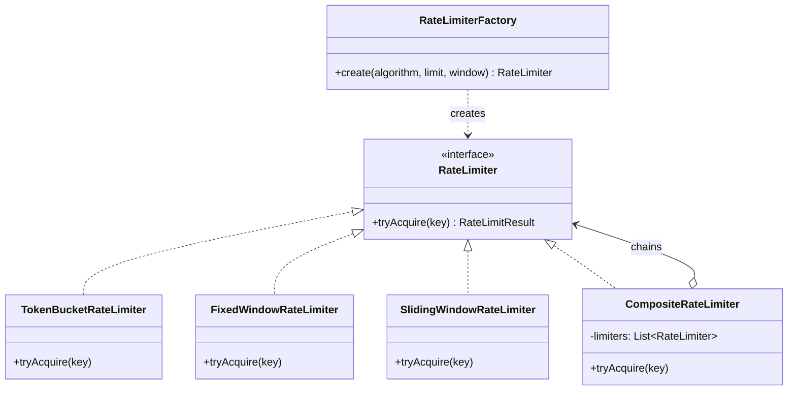

#system-design #lld #rate-limiting #sdk

# LLD: Rate Limiter

**Type:** SDK/Library
**Difficulty:** Medium
**Asked at:** Stripe, Cloudflare, Uber, Razorpay, Kong

---

## Requirements Clarification

**Ask these in interview:**
1. What algorithms to support? (Token Bucket, Fixed Window, Sliding Window?)
2. Limits per user, per API, or global?
3. Single server or distributed?
4. What happens on rate limit hit? (reject, queue, degrade?)
5. Should limits be configurable at runtime?
6. In-memory or Redis-backed?

**Scope for this design:**
- Support multiple algorithms (swappable)
- Per-user AND per-API limits
- Thread-safe, in-memory
- Returns standard rate limit headers

---

## Problem Type
**SDK/Library** — designing a reusable component. Key patterns: **Strategy** (algorithm), **Factory** (create limiter), **Decorator** (compose limits).

---

## Class Diagram

```
RateLimiterFactory
    └── creates → RateLimiter (interface)
                    ├── TokenBucketRateLimiter
                    ├── FixedWindowRateLimiter
                    └── SlidingWindowRateLimiter

CompositeRateLimiter   ← Decorator: chains per-user + per-API limits
    └── has-many → RateLimiter[]

RateLimitResult
    ├── allowed: boolean
    ├── remaining: int
    └── resetAt: Instant
```

---

## Mermaid Diagrams



---

## Core Interfaces & Abstractions

```java
// Core abstraction
public interface RateLimiter {
    RateLimitResult tryAcquire(String key);
    RateLimitResult tryAcquire(String key, int tokens);
}

// Result carries all info needed for HTTP headers
public class RateLimitResult {
    private final boolean allowed;
    private final int remaining;
    private final int limit;
    private final Instant resetAt;
    private final long retryAfterSeconds;

    public static RateLimitResult allow(int remaining, int limit, Instant resetAt) {
        return new RateLimitResult(true, remaining, limit, resetAt, 0);
    }

    public static RateLimitResult deny(int limit, Instant resetAt) {
        long retryAfter = ChronoUnit.SECONDS.between(Instant.now(), resetAt);
        return new RateLimitResult(false, 0, limit, resetAt, retryAfter);
    }
}
```

---

## Complete Java Implementation

```java
// Algorithm 1: Token Bucket
// Tokens refill continuously at a fixed rate. Burst-friendly.
public class TokenBucketRateLimiter implements RateLimiter {
    private final int capacity;           // max tokens
    private final double refillRate;      // tokens per second
    private final ConcurrentHashMap<String, TokenBucket> buckets = new ConcurrentHashMap<>();

    public TokenBucketRateLimiter(int capacity, double refillRatePerSecond) {
        this.capacity   = capacity;
        this.refillRate = refillRatePerSecond;
    }

    public RateLimitResult tryAcquire(String key) {
        TokenBucket bucket = buckets.computeIfAbsent(key, k -> new TokenBucket(capacity, refillRate));
        return bucket.consume(1);
    }

    public RateLimitResult tryAcquire(String key, int tokens) {
        TokenBucket bucket = buckets.computeIfAbsent(key, k -> new TokenBucket(capacity, refillRate));
        return bucket.consume(tokens);
    }

    private static class TokenBucket {
        private double tokens;
        private long lastRefillTime;
        private final int capacity;
        private final double refillRate;
        private final Object lock = new Object();

        TokenBucket(int capacity, double refillRate) {
            this.capacity      = capacity;
            this.refillRate    = refillRate;
            this.tokens        = capacity;
            this.lastRefillTime = System.nanoTime();
        }

        RateLimitResult consume(int requested) {
            synchronized (lock) {
                refill();
                if (tokens >= requested) {
                    tokens -= requested;
                    long resetAt = lastRefillTime + (long)((capacity - tokens) / refillRate * 1_000_000_000L);
                    return RateLimitResult.allow((int) tokens, capacity, Instant.ofEpochSecond(resetAt / 1_000_000_000L));
                }
                long resetAt = System.currentTimeMillis() / 1000 + (long)((requested - tokens) / refillRate);
                return RateLimitResult.deny(capacity, Instant.ofEpochSecond(resetAt));
            }
        }

        private void refill() {
            long now     = System.nanoTime();
            double elapsed = (now - lastRefillTime) / 1_000_000_000.0;  // seconds
            double added = elapsed * refillRate;
            tokens = Math.min(capacity, tokens + added);
            lastRefillTime = now;
        }
    }
}

// Algorithm 2: Fixed Window Counter
// Count requests in a fixed time window. Simple but has edge case at window boundary.
public class FixedWindowRateLimiter implements RateLimiter {
    private final int limit;
    private final long windowMs;
    private final ConcurrentHashMap<String, WindowCounter> counters = new ConcurrentHashMap<>();

    public FixedWindowRateLimiter(int limit, Duration windowDuration) {
        this.limit    = limit;
        this.windowMs = windowDuration.toMillis();
    }

    public RateLimitResult tryAcquire(String key) {
        WindowCounter counter = counters.computeIfAbsent(key, k -> new WindowCounter(limit, windowMs));
        return counter.increment();
    }

    public RateLimitResult tryAcquire(String key, int tokens) {
        return tryAcquire(key);  // simplified for this implementation
    }

    private static class WindowCounter {
        private final AtomicInteger count = new AtomicInteger(0);
        private volatile long windowStart = System.currentTimeMillis();
        private final int limit;
        private final long windowMs;

        WindowCounter(int limit, long windowMs) {
            this.limit    = limit;
            this.windowMs = windowMs;
        }

        synchronized RateLimitResult increment() {
            long now = System.currentTimeMillis();
            if (now - windowStart >= windowMs) {
                count.set(0);
                windowStart = now;
            }
            int current = count.incrementAndGet();
            Instant resetAt = Instant.ofEpochMilli(windowStart + windowMs);
            if (current <= limit) {
                return RateLimitResult.allow(limit - current, limit, resetAt);
            }
            count.decrementAndGet();
            return RateLimitResult.deny(limit, resetAt);
        }
    }
}

// Algorithm 3: Sliding Window Log
// Most accurate. Stores timestamps of all requests in the window.
public class SlidingWindowRateLimiter implements RateLimiter {
    private final int limit;
    private final long windowMs;
    private final ConcurrentHashMap<String, Deque<Long>> logs = new ConcurrentHashMap<>();

    public SlidingWindowRateLimiter(int limit, Duration windowDuration) {
        this.limit    = limit;
        this.windowMs = windowDuration.toMillis();
    }

    public synchronized RateLimitResult tryAcquire(String key) {
        long now = System.currentTimeMillis();
        Deque<Long> timestamps = logs.computeIfAbsent(key, k -> new ArrayDeque<>());

        // Remove old entries outside window
        while (!timestamps.isEmpty() && now - timestamps.peekFirst() > windowMs) {
            timestamps.pollFirst();
        }

        int current = timestamps.size();
        if (current < limit) {
            timestamps.addLast(now);
            return RateLimitResult.allow(limit - current - 1, limit,
                Instant.ofEpochMilli(now + windowMs));
        }
        return RateLimitResult.deny(limit, Instant.ofEpochMilli(timestamps.peekFirst() + windowMs));
    }

    public RateLimitResult tryAcquire(String key, int tokens) { return tryAcquire(key); }
}

// Factory — creates the right limiter
public class RateLimiterFactory {
    public enum Algorithm { TOKEN_BUCKET, FIXED_WINDOW, SLIDING_WINDOW }

    public static RateLimiter create(Algorithm algorithm, int limit, Duration window) {
        return switch (algorithm) {
            case TOKEN_BUCKET   -> new TokenBucketRateLimiter(limit, (double) limit / window.getSeconds());
            case FIXED_WINDOW   -> new FixedWindowRateLimiter(limit, window);
            case SLIDING_WINDOW -> new SlidingWindowRateLimiter(limit, window);
        };
    }
}

// Composite — chain multiple limiters (per-user AND per-API)
public class CompositeRateLimiter implements RateLimiter {
    private final List<RateLimiter> limiters;

    public CompositeRateLimiter(RateLimiter... limiters) {
        this.limiters = List.of(limiters);
    }

    public RateLimitResult tryAcquire(String key) {
        // All limiters must allow — most restrictive wins
        RateLimitResult mostRestrictive = null;
        for (RateLimiter limiter : limiters) {
            RateLimitResult result = limiter.tryAcquire(key);
            if (!result.isAllowed()) return result;
            if (mostRestrictive == null || result.getRemaining() < mostRestrictive.getRemaining()) {
                mostRestrictive = result;
            }
        }
        return mostRestrictive;
    }

    public RateLimitResult tryAcquire(String key, int tokens) { return tryAcquire(key); }
}
```

---

## Usage (Spring Boot Integration)

```java
@Component
public class RateLimitInterceptor implements HandlerInterceptor {
    private final RateLimiter userLimiter = RateLimiterFactory.create(
        Algorithm.TOKEN_BUCKET, 100, Duration.ofMinutes(1));

    private final RateLimiter apiLimiter = RateLimiterFactory.create(
        Algorithm.FIXED_WINDOW, 1000, Duration.ofMinutes(1));

    private final RateLimiter combined = new CompositeRateLimiter(userLimiter, apiLimiter);

    @Override
    public boolean preHandle(HttpServletRequest req, HttpServletResponse res, Object handler) {
        String userId = req.getHeader("X-User-Id");
        RateLimitResult result = combined.tryAcquire(userId);

        // Set standard headers
        res.setHeader("X-RateLimit-Limit",     String.valueOf(result.getLimit()));
        res.setHeader("X-RateLimit-Remaining", String.valueOf(result.getRemaining()));
        res.setHeader("X-RateLimit-Reset",     String.valueOf(result.getResetAt().getEpochSecond()));

        if (!result.isAllowed()) {
            res.setStatus(429);
            res.setHeader("Retry-After", String.valueOf(result.getRetryAfterSeconds()));
            return false;
        }
        return true;
    }
}
```

---

## Design Patterns Used

| Pattern | Where | Why |
|---------|-------|-----|
| **Strategy** | `RateLimiter` interface | Swap algorithms without changing callers |
| **Factory** | `RateLimiterFactory` | Clean creation with algorithm enum |
| **Composite** | `CompositeRateLimiter` | Chain per-user + per-API limits |
| **Template Method** | (Extension) `AbstractRateLimiter` | Share key extraction logic |

---

## Algorithm Comparison

| Algorithm | Accuracy | Memory | Burst Handling | Use When |
|-----------|---------|--------|---------------|---------|
| Token Bucket | Good | Low | Yes (burst allowed) | APIs, most common |
| Fixed Window | Low (boundary issue) | Very Low | No | Internal limits |
| Sliding Window Log | Excellent | High (stores all timestamps) | No | Payment APIs |
| Sliding Window Counter | Good | Low | No | Balance of accuracy + memory |

**Token Bucket boundary problem doesn't exist** because tokens refill continuously.
**Fixed Window boundary problem:** 100 requests at 11:59, 100 more at 12:00 → 200 requests in 2 seconds.

---

## Concurrency Handling

```java
// Each bucket has its own lock — no global bottleneck
// TokenBucket.consume() is synchronized on instance
// ConcurrentHashMap.computeIfAbsent() is atomic for bucket creation
// → High concurrency with minimal contention
```

---

## Error Handling & Edge Cases

```java
// 1. Null/empty key
if (key == null || key.isBlank()) throw new IllegalArgumentException("Rate limit key cannot be empty");

// 2. Tokens > capacity
if (requested > capacity) return RateLimitResult.deny(capacity, Instant.now().plusSeconds(1));

// 3. Very high refill rate (near-unlimited)
// Just set capacity = Integer.MAX_VALUE and high refillRate

// 4. Clock skew (system time goes backward)
long now = Math.max(System.nanoTime(), lastRefillTime);  // never go backward
```

---

## One-Change Test

| Change | Impact |
|--------|--------|
| Add Sliding Window Counter algorithm | 1 new: `SlidingWindowCounterRateLimiter` |
| Add Redis-backed distributed limiter | 1 new: `RedisRateLimiter implements RateLimiter` |
| Add per-IP limiting | New key strategy: use IP instead of userId |

---

## Follow-up Questions

| Question | Answer |
|----------|--------|
| Distributed rate limiting across servers? | Redis `INCR` + TTL — atomic counter shared across all servers |
| Rate limit by IP + userId + API combined? | `CompositeRateLimiter` with 3 limiters |
| Graceful degradation on Redis down? | Fallback to in-memory limiter, log warning |
| Fair queuing (not reject, but delay)? | Add request to delay queue, respond after token available |

---

## Links

- [[../lld_machine_coding_template]] — 90-min guide
- [[../lld_concurrency_patterns]] — Thread safety used here
- [[../patterns/behavioral]] — Strategy pattern
- [[../../02_building_blocks/rate_limiter]] — HLD rate limiting concepts
