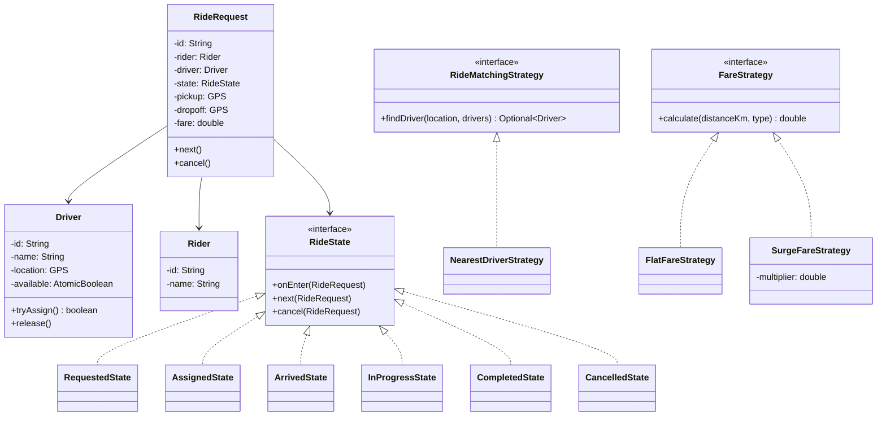
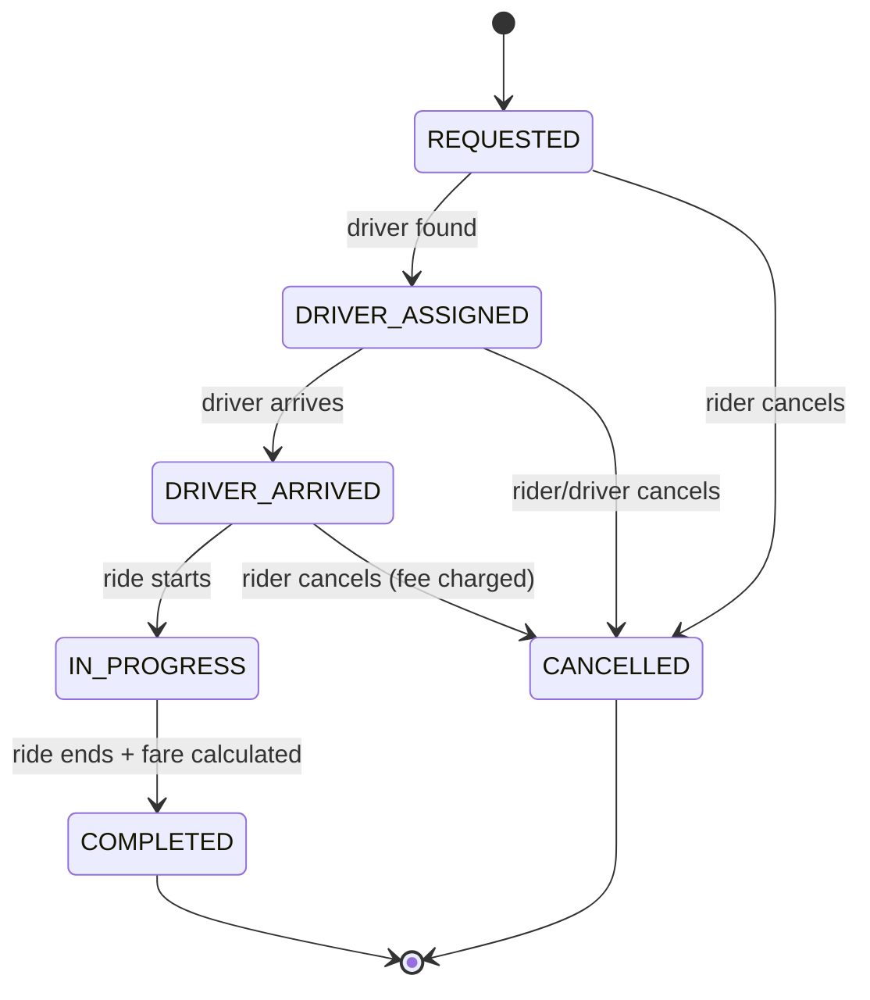

#system-design #lld #example #java #state-machine #coordination

# LLD: Ride Sharing System — Uber/Ola (Java)

**Type:** State Machine + Coordination | **Difficulty:** Hard | **Companies:** Uber, Ola, Rapido, Lyft

---

## 1. Requirements Clarification

| # | Question | Assumption |
|---|----------|------------|
| 1 | What ride states do we need to model? | REQUESTED → DRIVER_ASSIGNED → DRIVER_ARRIVED → IN_PROGRESS → COMPLETED / CANCELLED |
| 2 | How do we match a driver to a rider? | Nearest available driver by straight-line distance |
| 3 | Do we need surge pricing? | Yes — SurgeStrategy multiplier applied on top of base fare |
| 4 | How are riders notified of status changes? | Observer pattern — push notification on each state transition |
| 5 | Can a rider cancel after driver is assigned? | Yes, but a partial cancellation fee is charged |
| 6 | How do we handle two riders matching the same driver simultaneously? | CAS via `AtomicBoolean` on driver availability — only one succeeds |

---

## 2. Problem Type + Key Patterns

**Type:** State Machine (ride lifecycle) + Coordination (driver matching)

| Pattern | Where Used |
|---------|-----------|
| State | RideState transitions (each state is an object) |
| Strategy | RideMatchingStrategy (nearest), FareStrategy (surge vs flat) |
| Observer | Notify rider/driver on every state change |
| Factory | RideFactory creates Ride with correct initial state |

---

## 3. Class Diagram (ASCII)

```
+------------------+       +------------------+       +------------------+
|   RideRequest    |<>-----|    RideState      |       |     Driver        |
|------------------|       |  <<interface>>    |       |------------------|
| - id             |       | + onEnter()       |       | - id             |
| - rider: Rider   |       | + onExit()        |       | - location: GPS  |
| - driver: Driver |       | + next()          |       | - available:     |
| - state          |       | + cancel()        |       |   AtomicBoolean  |
| + transition()   |       +------------------+       | + tryAssign():bool|
| + cancel()       |              ^                    +------------------+
+------------------+    +---------+--------+
        |               |         |        |
        |         RequestedState  |   InProgressState
        |         AssignedState   |   CompletedState
        |         ArrivedState    |   CancelledState
        v
+------------------+       +----------------------+
| RideMatchingStrategy|     |    FareStrategy      |
| <<interface>>    |       |  <<interface>>       |
| + findDriver()   |       |  + calculate()       |
+------------------+       +----------------------+
        ^                          ^
 NearestDriverStrategy    SurgeFareStrategy
                          FlatFareStrategy
```

### Mermaid Diagrams





---

## 4. Core Interfaces

```java
interface RideState {
    void onEnter(RideRequest ride);
    void next(RideRequest ride);
    void cancel(RideRequest ride);
    String getStatus();
}

interface RideMatchingStrategy {
    Optional<Driver> findDriver(GPS riderLocation, List<Driver> availableDrivers);
}

interface FareStrategy {
    double calculate(double distanceKm, RideType type);
}

interface RideObserver {
    void onStatusChanged(RideRequest ride, String newStatus);
}
```

---

## 5. Complete Java Implementation

```java
import java.util.*;
import java.util.concurrent.*;
import java.util.concurrent.atomic.*;

// ── Enums ──────────────────────────────────────────────────────────────────

enum RideType { ECONOMY, PREMIUM, XL }

// ── GPS ────────────────────────────────────────────────────────────────────

class GPS {
    final double lat, lng;
    GPS(double lat, double lng) { this.lat = lat; this.lng = lng; }

    double distanceTo(GPS other) {
        double dLat = this.lat - other.lat;
        double dLng = this.lng - other.lng;
        return Math.sqrt(dLat * dLat + dLng * dLng) * 111; // approx km
    }
}

// ── Driver ─────────────────────────────────────────────────────────────────

class Driver {
    private final String id;
    private final String name;
    private volatile GPS location;
    private final AtomicBoolean available = new AtomicBoolean(true);

    Driver(String id, String name, GPS location) {
        this.id = id; this.name = name; this.location = location;
    }

    /** CAS-based assignment — only one thread wins */
    boolean tryAssign() { return available.compareAndSet(true, false); }
    void release()      { available.set(true); }
    boolean isAvailable() { return available.get(); }
    void updateLocation(GPS loc) { this.location = loc; }
    GPS getLocation() { return location; }
    String getId()    { return id; }
    String getName()  { return name; }
}

// ── Rider ──────────────────────────────────────────────────────────────────

class Rider {
    private final String id;
    private final String name;
    Rider(String id, String name) { this.id = id; this.name = name; }
    String getId()   { return id; }
    String getName() { return name; }
}

// ── RideState interface + concrete states ──────────────────────────────────

interface RideState {
    void onEnter(RideRequest ride);
    void next(RideRequest ride);
    void cancel(RideRequest ride);
    String getStatus();
}

class RequestedState implements RideState {
    public void onEnter(RideRequest r) { r.notifyObservers("REQUESTED"); }
    public void next(RideRequest r) {
        Driver d = r.getMatchingStrategy()
                    .findDriver(r.getRider_location(), r.getAvailableDrivers())
                    .orElseThrow(() -> new IllegalStateException("No drivers available"));
        if (!d.tryAssign()) throw new IllegalStateException("Driver just taken, retry");
        r.setDriver(d);
        r.setState(new AssignedState());
    }
    public void cancel(RideRequest r) { r.setState(new CancelledState()); }
    public String getStatus() { return "REQUESTED"; }
}

class AssignedState implements RideState {
    public void onEnter(RideRequest r) { r.notifyObservers("DRIVER_ASSIGNED"); }
    public void next(RideRequest r)    { r.setState(new ArrivedState()); }
    public void cancel(RideRequest r) {
        r.getDriver().release();
        r.setCancellationFee(0.0); // no fee before arrival
        r.setState(new CancelledState());
    }
    public String getStatus() { return "DRIVER_ASSIGNED"; }
}

class ArrivedState implements RideState {
    public void onEnter(RideRequest r) { r.notifyObservers("DRIVER_ARRIVED"); }
    public void next(RideRequest r)    { r.setState(new InProgressState()); }
    public void cancel(RideRequest r) {
        r.getDriver().release();
        r.setCancellationFee(50.0); // partial fee after driver arrived
        r.setState(new CancelledState());
    }
    public String getStatus() { return "DRIVER_ARRIVED"; }
}

class InProgressState implements RideState {
    public void onEnter(RideRequest r) { r.notifyObservers("IN_PROGRESS"); }
    public void next(RideRequest r) {
        double dist = r.getPickup().distanceTo(r.getDropoff());
        double fare = r.getFareStrategy().calculate(dist, r.getRideType());
        r.setFare(fare);
        r.getDriver().release();
        r.setState(new CompletedState());
    }
    public void cancel(RideRequest r) { throw new UnsupportedOperationException("Cannot cancel in-progress ride"); }
    public String getStatus() { return "IN_PROGRESS"; }
}

class CompletedState implements RideState {
    public void onEnter(RideRequest r) { r.notifyObservers("COMPLETED"); }
    public void next(RideRequest r)    { throw new UnsupportedOperationException("Ride already completed"); }
    public void cancel(RideRequest r)  { throw new UnsupportedOperationException("Ride already completed"); }
    public String getStatus() { return "COMPLETED"; }
}

class CancelledState implements RideState {
    public void onEnter(RideRequest r) { r.notifyObservers("CANCELLED"); }
    public void next(RideRequest r)    { throw new UnsupportedOperationException("Ride cancelled"); }
    public void cancel(RideRequest r)  { throw new UnsupportedOperationException("Already cancelled"); }
    public String getStatus() { return "CANCELLED"; }
}

// ── Strategies ─────────────────────────────────────────────────────────────

interface RideMatchingStrategy {
    Optional<Driver> findDriver(GPS riderLocation, List<Driver> drivers);
}

class NearestDriverStrategy implements RideMatchingStrategy {
    public Optional<Driver> findDriver(GPS loc, List<Driver> drivers) {
        return drivers.stream()
            .filter(Driver::isAvailable)
            .min(Comparator.comparingDouble(d -> d.getLocation().distanceTo(loc)));
    }
}

interface FareStrategy {
    double calculate(double distanceKm, RideType type);
}

class FlatFareStrategy implements FareStrategy {
    private static final Map<RideType, Double> RATE =
        Map.of(RideType.ECONOMY, 12.0, RideType.PREMIUM, 20.0, RideType.XL, 18.0);
    public double calculate(double km, RideType type) {
        return Math.max(50, km * RATE.getOrDefault(type, 12.0));
    }
}

class SurgeFareStrategy implements FareStrategy {
    private final FareStrategy base;
    private final double multiplier;
    SurgeFareStrategy(FareStrategy base, double multiplier) {
        this.base = base; this.multiplier = multiplier;
    }
    public double calculate(double km, RideType type) {
        return base.calculate(km, type) * multiplier;
    }
}

// ── Observer ───────────────────────────────────────────────────────────────

interface RideObserver {
    void onStatusChanged(RideRequest ride, String status);
}

class PushNotificationObserver implements RideObserver {
    public void onStatusChanged(RideRequest ride, String status) {
        System.out.printf("[NOTIFY] Ride %s → %s%n", ride.getId(), status);
    }
}

// ── RideRequest (Context) ──────────────────────────────────────────────────

class RideRequest {
    private final String id;
    private final Rider rider;
    private Driver driver;
    private RideState state;
    private final GPS pickup, dropoff;
    private final RideType rideType;
    private final RideMatchingStrategy matchingStrategy;
    private final FareStrategy fareStrategy;
    private final List<Driver> availableDrivers;
    private final List<RideObserver> observers = new ArrayList<>();
    private double fare = 0;
    private double cancellationFee = 0;

    RideRequest(String id, Rider rider, GPS pickup, GPS dropoff,
                RideType type, RideMatchingStrategy ms, FareStrategy fs,
                List<Driver> drivers) {
        this.id = id; this.rider = rider; this.pickup = pickup;
        this.dropoff = dropoff; this.rideType = type;
        this.matchingStrategy = ms; this.fareStrategy = fs;
        this.availableDrivers = drivers;
        this.state = new RequestedState();
        this.state.onEnter(this);
    }

    void addObserver(RideObserver o) { observers.add(o); }
    void notifyObservers(String status) { observers.forEach(o -> o.onStatusChanged(this, status)); }

    void setState(RideState s) { this.state = s; s.onEnter(this); }
    void next()   { state.next(this); }
    void cancel() { state.cancel(this); }

    // Getters / Setters
    String getId()                          { return id; }
    Rider getRider()                        { return rider; }
    Driver getDriver()                      { return driver; }
    void setDriver(Driver d)               { this.driver = d; }
    GPS getPickup()                         { return pickup; }
    GPS getDropoff()                        { return dropoff; }
    GPS getRider_location()                 { return pickup; }
    RideType getRideType()                  { return rideType; }
    RideMatchingStrategy getMatchingStrategy() { return matchingStrategy; }
    FareStrategy getFareStrategy()          { return fareStrategy; }
    List<Driver> getAvailableDrivers()      { return availableDrivers; }
    double getFare()                        { return fare; }
    void setFare(double f)                 { this.fare = f; }
    void setCancellationFee(double f)      { this.cancellationFee = f; }
    double getCancellationFee()             { return cancellationFee; }
    String getStatus()                      { return state.getStatus(); }
}

// ── Factory ────────────────────────────────────────────────────────────────

class RideFactory {
    static RideRequest create(String id, Rider rider, GPS pickup, GPS dropoff,
                               RideType type, List<Driver> drivers, boolean surge) {
        FareStrategy base = new FlatFareStrategy();
        FareStrategy fs   = surge ? new SurgeFareStrategy(base, 1.8) : base;
        RideMatchingStrategy ms = new NearestDriverStrategy();
        RideRequest ride = new RideRequest(id, rider, pickup, dropoff, type, ms, fs, drivers);
        ride.addObserver(new PushNotificationObserver());
        return ride;
    }
}

// ── Main (demo) ────────────────────────────────────────────────────────────

class RideSharingDemo {
    public static void main(String[] args) throws InterruptedException {
        List<Driver> drivers = List.of(
            new Driver("D1", "Ramesh", new GPS(12.97, 77.59)),
            new Driver("D2", "Suresh", new GPS(12.98, 77.60))
        );
        Rider r1 = new Rider("R1", "Alice");
        Rider r2 = new Rider("R2", "Bob");
        GPS pickup  = new GPS(12.971, 77.591);
        GPS dropoff = new GPS(12.990, 77.620);

        // Concurrent matching — two riders try to grab nearest driver
        ExecutorService pool = Executors.newFixedThreadPool(2);
        pool.submit(() -> {
            try {
                RideRequest ride = RideFactory.create("RIDE-1", r1, pickup, dropoff,
                                                       RideType.ECONOMY, new ArrayList<>(drivers), false);
                ride.next(); // assign driver
                System.out.println("R1 assigned: " + ride.getDriver().getName());
                ride.next(); // arrived
                ride.next(); // in progress → complete
                System.out.printf("R1 fare: INR %.2f%n", ride.getFare());
            } catch (Exception e) { System.out.println("R1 failed: " + e.getMessage()); }
        });
        pool.submit(() -> {
            try {
                RideRequest ride = RideFactory.create("RIDE-2", r2, pickup, dropoff,
                                                       RideType.PREMIUM, new ArrayList<>(drivers), true);
                ride.next(); // assign driver (may fail if D1 taken by CAS)
                System.out.println("R2 assigned: " + ride.getDriver().getName());
            } catch (Exception e) { System.out.println("R2 failed: " + e.getMessage()); }
        });
        pool.shutdown();
        pool.awaitTermination(5, TimeUnit.SECONDS);
    }
}
```

---

## 6. Design Patterns Used

| Pattern | Class(es) | Why |
|---------|-----------|-----|
| State | `RequestedState`, `AssignedState`, `ArrivedState`, `InProgressState`, `CompletedState`, `CancelledState` | Clean lifecycle without if-else chains |
| Strategy | `NearestDriverStrategy`, `FlatFareStrategy`, `SurgeFareStrategy` | Swap matching/pricing logic independently |
| Observer | `RideObserver`, `PushNotificationObserver` | Decouple notification from state transitions |
| Factory | `RideFactory` | Encapsulate wiring of strategies + observer |
| Decorator | `SurgeFareStrategy` wraps `FlatFareStrategy` | Stackable pricing modifiers |

---

## 7. Concurrency Handling

| Scenario | Problem | Solution |
|----------|---------|----------|
| Two riders grab same driver | Race condition on `available` flag | `AtomicBoolean.compareAndSet(true, false)` — only one thread wins |
| Driver location update | Stale GPS during matching | `volatile GPS location` on Driver |
| Concurrent state transitions | State corruption | Each `RideRequest` is per-rider; no shared mutable state across rides |

**CAS Assignment Flow:**
```
Thread 1: driver.tryAssign() → CAS(true→false) succeeds → assigned
Thread 2: driver.tryAssign() → CAS(true→false) fails   → IllegalStateException("Driver just taken, retry")
```

---

## 8. Error Handling & Edge Cases

| Edge Case | Handling |
|-----------|----------|
| No drivers available | `findDriver()` returns `Optional.empty()` → `IllegalStateException("No drivers available")` |
| Driver cancels after assignment | `driver.release()` sets `AtomicBoolean` back to `true`; ride moves to `CANCELLED` |
| Rider cancels after driver arrived | `ArrivedState.cancel()` charges `cancellationFee = 50.0` before releasing driver |
| GPS location unavailable | `GPS.distanceTo()` returns `Double.MAX_VALUE` — driver is ranked last in nearest-first sort |
| Cancel in-progress ride | `InProgressState.cancel()` throws `UnsupportedOperationException` |

---

## 9. One-Change Test

| Change | What breaks | Fix |
|--------|-------------|-----|
| Remove `AtomicBoolean` → use plain `boolean` | Two threads both read `available=true` and assign same driver | Restore `AtomicBoolean` with CAS |
| Skip `driver.release()` on cancel | Driver stays permanently unavailable | Always call `release()` in cancel paths |
| Use `==` instead of `compareAndSet` | Not atomic — race window between check and set | Must use `compareAndSet` for atomicity |
| Add new state (SCHEDULED) | All state classes need updating | Apply State pattern: add `ScheduledState` implementing `RideState` |

---

## 10. Follow-up Questions

| Question | Direction |
|----------|-----------|
| How to support ride pooling (shared rides)? | `RideRequest` holds `List<Rider>`; matching checks capacity |
| How to store ride history at scale? | Event-sourced store; each state transition is an immutable event |
| How to handle driver going offline mid-ride? | Heartbeat from driver app; if missed → re-assign from `InProgressState` |
| How to rank drivers beyond nearest? | Extend `RideMatchingStrategy` with rating/acceptance-rate scoring |
| How to handle payment failure at completion? | Add `PAYMENT_PENDING` state between `IN_PROGRESS` and `COMPLETED` |

---

## 11. Links

- [[../patterns/behavioral]]
- [[../lld_machine_coding_template]]
- [[../lld_concurrency_patterns]]
