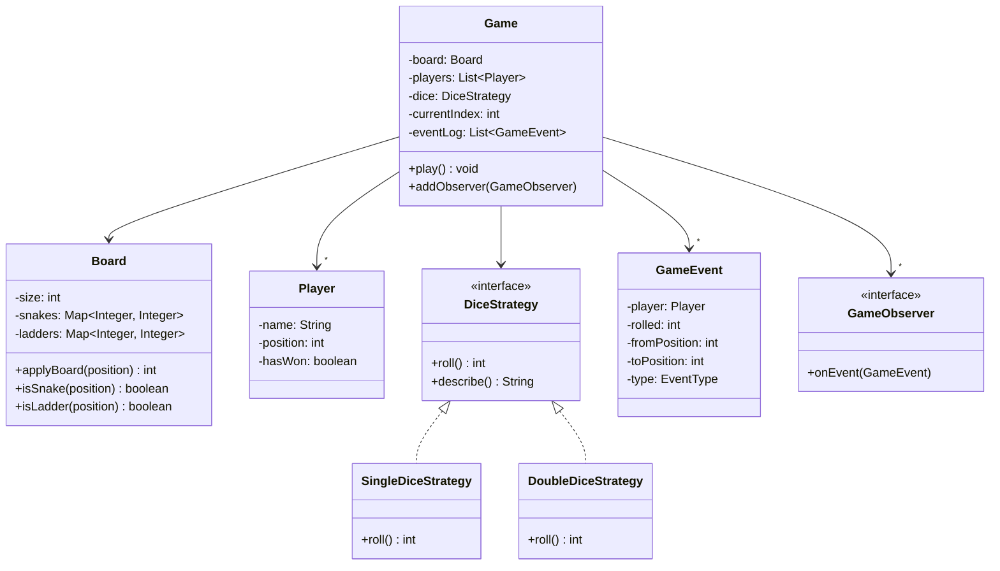

#system-design #lld #game

# LLD: Snake and Ladder

**Type:** Game / Simulation
**Difficulty:** Easy
**Asked at:** Startups, warm-up round at product companies, Directi, MakeMyTrip

---

## Requirements Clarification

1. How many players? (2–4 players, names configurable)
2. What is the board size? (default 100 squares)
3. Are snakes and ladders configurable at game start?
4. One dice or two? (configurable — SingleDice vs DoubleDice)
5. Win condition: must land exactly on 100, or is >= 100 a win?
6. What is the turn order? (sequential, starting from player 0)

**Scope:** Full game loop — players roll dice, move on the board, get affected by snakes/ladders, and the game ends when someone reaches or exceeds 100 (configurable exact vs overflow).

---

## Problem Type

**Game / Simulation** — controlled game loop with clear state transitions per turn. Key insight: represent game events explicitly (SNAKE / LADDER / NORMAL / WIN) rather than burying logic inside conditionals.

---

## Class Diagram

```
Game
    ├── board: Board
    ├── players: List<Player>
    ├── dice: DiceStrategy (interface)
    ├── currentPlayerIndex: int
    ├── eventLog: List<GameEvent>
    ├── observers: List<GameObserver>
    └── play(): void

Board
    ├── size: int
    ├── snakes: Map<Integer, Integer>   (head → tail)
    └── ladders: Map<Integer, Integer>  (bottom → top)

Player
    ├── name: String
    ├── position: int
    └── hasWon: boolean

DiceStrategy (interface)
    ├── SingleDiceStrategy
    └── DoubleDiceStrategy

GameEvent
    ├── player: Player
    ├── rolled: int
    ├── fromPosition: int
    ├── toPosition: int
    └── type: EventType (SNAKE / LADDER / NORMAL / WIN)

GameObserver (interface)
    └── ConsoleGameObserver
```

### Mermaid Class Diagram



---

## Core Interfaces & Abstractions

```java
// Strategy: pluggable dice behaviour
public interface DiceStrategy {
    int roll();
    String describe();
}

// Observer: UI or logging notified on every game event
public interface GameObserver {
    void onEvent(GameEvent event);
}

// Template Method: game loop skeleton in Game.play()
// subclasses (or config) override win condition, dice, board
```

---

## Complete Java Implementation

```java
import java.util.*;

// ─── Event Type ───────────────────────────────────────────────────────────────

enum EventType { NORMAL, SNAKE, LADDER, WIN, OVERSHOOT }

// ─── Game Event (record of each turn) ────────────────────────────────────────

class GameEvent {
    private final Player player;
    private final int rolled;
    private final int fromPosition;
    private final int toPosition;
    private final EventType type;

    public GameEvent(Player player, int rolled, int from, int to, EventType type) {
        this.player       = player;
        this.rolled       = rolled;
        this.fromPosition = from;
        this.toPosition   = to;
        this.type         = type;
    }

    public Player getPlayer()       { return player; }
    public int getRolled()          { return rolled; }
    public int getFromPosition()    { return fromPosition; }
    public int getToPosition()      { return toPosition; }
    public EventType getType()      { return type; }

    @Override
    public String toString() {
        String base = String.format("%s rolled %d: %d → %d [%s]",
            player.getName(), rolled, fromPosition, toPosition, type);
        return switch (type) {
            case SNAKE    -> base + " (bitten! slid down)";
            case LADDER   -> base + " (climbed up!)";
            case WIN      -> base + " ** WINS! **";
            case OVERSHOOT-> base + " (overshot, stays at " + fromPosition + ")";
            default       -> base;
        };
    }
}

// ─── Player ───────────────────────────────────────────────────────────────────

class Player {
    private final String name;
    private int position;
    private boolean hasWon;

    public Player(String name) {
        this.name     = name;
        this.position = 0;
        this.hasWon   = false;
    }

    public String getName()         { return name; }
    public int getPosition()        { return position; }
    public void setPosition(int p)  { this.position = p; }
    public boolean hasWon()         { return hasWon; }
    public void markWinner()        { this.hasWon = true; }

    @Override
    public String toString() { return name + "@" + position; }
}

// ─── Dice Strategies ─────────────────────────────────────────────────────────

interface DiceStrategy {
    int roll();
    String describe();
}

class SingleDiceStrategy implements DiceStrategy {
    private final Random random = new Random();

    @Override
    public int roll() { return random.nextInt(6) + 1; }

    @Override
    public String describe() { return "Single dice (1-6)"; }
}

class DoubleDiceStrategy implements DiceStrategy {
    private final Random random = new Random();

    @Override
    public int roll() { return random.nextInt(6) + 1 + random.nextInt(6) + 1; }

    @Override
    public String describe() { return "Double dice (2-12)"; }
}

// ─── Board ────────────────────────────────────────────────────────────────────

class Board {
    private final int size;
    private final Map<Integer, Integer> snakes;   // head → tail
    private final Map<Integer, Integer> ladders;  // bottom → top

    private Board(Builder builder) {
        this.size    = builder.size;
        this.snakes  = Collections.unmodifiableMap(new HashMap<>(builder.snakes));
        this.ladders = Collections.unmodifiableMap(new HashMap<>(builder.ladders));
        validateBoard();
    }

    private void validateBoard() {
        snakes.forEach((head, tail) -> {
            if (tail >= head) throw new IllegalArgumentException(
                "Snake head must be above tail: " + head + " → " + tail);
        });
        ladders.forEach((bottom, top) -> {
            if (top <= bottom) throw new IllegalArgumentException(
                "Ladder top must be above bottom: " + bottom + " → " + top);
        });
    }

    // Returns final position after applying any snake or ladder
    public int applyBoard(int position) {
        if (snakes.containsKey(position))  return snakes.get(position);
        if (ladders.containsKey(position)) return ladders.get(position);
        return position;
    }

    public boolean isSnake(int position)  { return snakes.containsKey(position); }
    public boolean isLadder(int position) { return ladders.containsKey(position); }
    public int getSize()                  { return size; }

    // ─── Builder ─────────────────────────────────────────────────────────────

    public static class Builder {
        private int size = 100;
        private final Map<Integer, Integer> snakes  = new HashMap<>();
        private final Map<Integer, Integer> ladders = new HashMap<>();

        public Builder size(int size)                        { this.size = size; return this; }
        public Builder addSnake(int head, int tail)          { snakes.put(head, tail); return this; }
        public Builder addLadder(int bottom, int top)        { ladders.put(bottom, top); return this; }
        public Board build()                                 { return new Board(this); }
    }
}

// ─── Observer ─────────────────────────────────────────────────────────────────

interface GameObserver {
    void onEvent(GameEvent event);
}

class ConsoleGameObserver implements GameObserver {
    @Override
    public void onEvent(GameEvent event) {
        System.out.println("  " + event);
    }
}

// ─── Game (Template Method for game loop) ────────────────────────────────────

class Game {
    private final Board board;
    private final List<Player> players;
    private final DiceStrategy dice;
    private final boolean exactWin;   // true = must land exactly on 100
    private int currentIndex = 0;
    private final List<GameEvent> eventLog = new ArrayList<>();
    private final List<GameObserver> observers = new ArrayList<>();
    private boolean gameOver = false;

    public Game(Board board, List<Player> players, DiceStrategy dice, boolean exactWin) {
        if (players == null || players.isEmpty())
            throw new IllegalArgumentException("Need at least one player");
        this.board     = board;
        this.players   = new ArrayList<>(players);
        this.dice      = dice;
        this.exactWin  = exactWin;
    }

    public void addObserver(GameObserver observer) { observers.add(observer); }

    // Template Method: game loop skeleton
    public void play() {
        System.out.println("=== Snake and Ladder — " + dice.describe() + " ===");
        players.forEach(p -> System.out.println("  Player: " + p.getName()));
        System.out.println();

        while (!gameOver) {
            Player current = players.get(currentIndex);
            if (!current.hasWon()) {
                takeTurn(current);
            }
            if (allPlayersWon()) { gameOver = true; break; }
            nextPlayer();
        }

        System.out.println("\n=== Game Over ===");
        players.stream().filter(Player::hasWon)
            .forEach(p -> System.out.println("Winner: " + p.getName()));
    }

    // One player's turn
    private void takeTurn(Player player) {
        int rolled       = dice.roll();
        int fromPosition = player.getPosition();
        int rawPosition  = fromPosition + rolled;

        System.out.printf("%s (pos=%d) rolls %d → raw=%d%n",
            player.getName(), fromPosition, rolled, rawPosition);

        GameEvent event;

        // Win condition
        if (rawPosition == board.getSize()) {
            player.setPosition(board.getSize());
            player.markWinner();
            event = new GameEvent(player, rolled, fromPosition, board.getSize(), EventType.WIN);

        } else if (rawPosition > board.getSize()) {
            if (exactWin) {
                // Overshoot: stay in place
                event = new GameEvent(player, rolled, fromPosition, fromPosition, EventType.OVERSHOOT);
            } else {
                // >= 100 counts as win
                player.setPosition(board.getSize());
                player.markWinner();
                event = new GameEvent(player, rolled, fromPosition, board.getSize(), EventType.WIN);
            }

        } else {
            // Normal move — then check snake/ladder
            int finalPosition = board.applyBoard(rawPosition);
            player.setPosition(finalPosition);

            EventType type;
            if (board.isSnake(rawPosition))       type = EventType.SNAKE;
            else if (board.isLadder(rawPosition))  type = EventType.LADDER;
            else                                   type = EventType.NORMAL;

            event = new GameEvent(player, rolled, fromPosition, finalPosition, type);
        }

        eventLog.add(event);
        notifyObservers(event);
    }

    private void nextPlayer() {
        currentIndex = (currentIndex + 1) % players.size();
    }

    private boolean allPlayersWon() {
        // Game ends when first player wins (standard rules)
        return players.stream().anyMatch(Player::hasWon);
    }

    private void notifyObservers(GameEvent event) {
        observers.forEach(o -> o.onEvent(event));
    }

    public List<GameEvent> getEventLog()   { return Collections.unmodifiableList(eventLog); }
    public List<Player>    getPlayers()    { return Collections.unmodifiableList(players); }
}
```

---

## Usage Demo

```java
public class SnakeAndLadderDemo {
    public static void main(String[] args) {
        Board board = new Board.Builder()
            .size(100)
            // Snakes: head → tail
            .addSnake(99, 10)
            .addSnake(70, 35)
            .addSnake(52, 14)
            .addSnake(25,  5)
            // Ladders: bottom → top
            .addLadder( 4, 56)
            .addLadder(13, 76)
            .addLadder(33, 88)
            .addLadder(50, 92)
            .build();

        List<Player> players = List.of(
            new Player("Alice"),
            new Player("Bob"),
            new Player("Charlie")
        );

        Game game = new Game(board, players, new SingleDiceStrategy(), true);
        game.addObserver(new ConsoleGameObserver());
        game.play();

        System.out.println("\nEvent log (" + game.getEventLog().size() + " turns total)");
    }
}
```

---

## Design Patterns Used

| Pattern | Where | Why |
|---------|-------|-----|
| **Template Method** | `Game.play()` → `takeTurn()` | Defines the fixed game loop skeleton; individual steps are overridable |
| **Strategy** | `DiceStrategy` → `SingleDiceStrategy`, `DoubleDiceStrategy` | Swap dice behaviour without changing `Game` |
| **Builder** | `Board.Builder` | Fluent, readable board configuration with validation at `build()` time |
| **Observer** | `GameObserver` → `ConsoleGameObserver` | Decouple UI / logging from game logic |

---

## Concurrency Handling

```java
// Snake and Ladder is inherently single-threaded (sequential turns).
// For a networked multiplayer version with concurrent players submitting rolls:

class Game {
    private final Object turnLock = new Object();

    public synchronized void submitRoll(String playerName, int rolled) {
        Player current = players.get(currentIndex);
        if (!current.getName().equals(playerName)) {
            throw new IllegalStateException("Not " + playerName + "'s turn");
        }
        // ... process turn atomically ...
    }
}

// For a lobby server accepting concurrent game creation:
// ConcurrentHashMap<String, Game> activeGames with game IDs as keys
```

---

## Error Handling & Edge Cases

```java
// 1. Player position exceeds 100 (overshoot with exactWin = true)
if (rawPosition > board.getSize() && exactWin) {
    // Stay in place — no movement
    event = new GameEvent(player, rolled, fromPosition, fromPosition, EventType.OVERSHOOT);
}

// 2. Player lands on snake after climbing ladder (chained effects)
// Board.applyBoard() only applies one effect.
// To support chains (rare rule variant), loop until stable:
private int applyBoardChained(int position) {
    Set<Integer> visited = new HashSet<>();
    while (snakes.containsKey(position) || ladders.containsKey(position)) {
        if (!visited.add(position)) throw new IllegalStateException("Cycle detected on board");
        position = applyBoard(position);
    }
    return position;
}

// 3. Board validation — snake head above tail, ladder top above bottom
private void validateBoard() {
    snakes.forEach((head, tail) -> {
        if (tail >= head) throw new IllegalArgumentException(
            "Snake head must be > tail: " + head + " → " + tail);
        if (head > size || tail < 1) throw new IllegalArgumentException(
            "Snake positions out of board bounds");
    });
}

// 4. No players supplied
if (players == null || players.isEmpty())
    throw new IllegalArgumentException("Need at least one player");

// 5. Multiple winners — first to reach 100 wins; others keep playing until all done
// Current impl ends at first winner (standard rules).
// To support all-finish: change allPlayersWon() to players.stream().allMatch(Player::hasWon)
```

---

## One-Change Test

| Change | Impact |
|--------|--------|
| Add two-dice support with doubles = extra turn | 1 change: `DoubleDiceStrategy.roll()` returns pair; `Game.takeTurn()` checks if both dice are equal |
| Add turn timeout (player must roll within N seconds) | 1 change: wrap `takeTurn()` with `ScheduledFuture`; auto-skip turn on timeout |
| Add power-up squares (e.g., swap positions with another player) | 1 change: `Board.applyBoard()` checks a third map `powerUps`; `Game.takeTurn()` handles `POWER_UP` event |
| Add audit trail export | 1 new: `CsvExportObserver implements GameObserver` — zero changes to `Game` |

---

## Follow-up Questions

| Question | Answer |
|----------|--------|
| How to make it networked multiplayer? | `GameServer` holds `Map<String, Game>`; players send HTTP/WebSocket moves; turns validated server-side |
| How to replay a game? | `EventLog` stores all `GameEvent`s; replay by reconstructing player positions from log |
| How to add an AI player? | `AIPlayer extends Player` with a `strategy: AIStrategy`; `chooseAction()` called instead of random dice |
| How to handle disconnected players in online game? | Mark player as `DISCONNECTED`; auto-skip turns until reconnect or timeout-based elimination |
| How to store game state? | Serialize `Game` (players + positions + eventLog) to JSON; restore via a `GameLoader` |

---

## Links

- [[../patterns/behavioral]] — Template Method, Strategy, Observer patterns
- [[../patterns/creational]] — Builder pattern (Board.Builder)
- [[../problem_taxonomy_lld]] — Game / Simulation type
- [[../lld_machine_coding_template]] — 90-min guide
