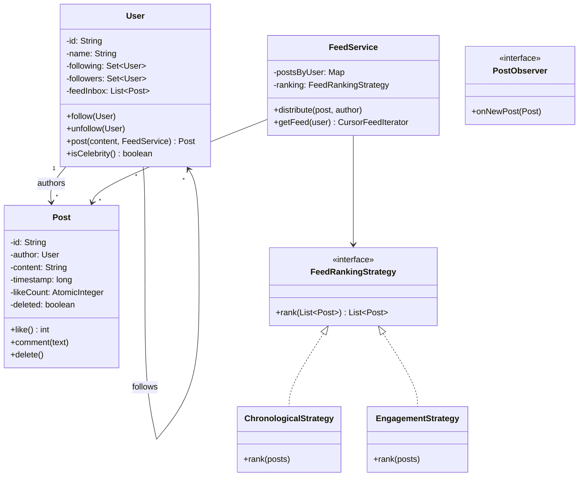

#system-design #lld #example #java #coordination #feed

# LLD: Social Media Feed — Meta/Twitter/LinkedIn (Java)

**Type:** Coordination | **Difficulty:** Hard | **Companies:** Meta, LinkedIn, Twitter/X, Instagram

---

## 1. Requirements Clarification

| # | Question | Assumption |
|---|----------|------------|
| 1 | Push (fanout-on-write) or Pull (fanout-on-read) model? | Push for normal users (<1K followers); Pull for celebrities (>1K followers) — hybrid |
| 2 | Is the feed ranked or chronological? | Strategy-based: default chronological; pluggable ranking strategy |
| 3 | Do we need pagination? | Yes — cursor-based pagination via Iterator pattern |
| 4 | What interactions do we support? | Post, Like, Comment, Follow, Unfollow |
| 5 | How do we handle deleted posts already in feeds? | Soft-delete flag on Post; feed iterator skips deleted posts |
| 6 | Are circular follows allowed? | Yes — A follows B and B follows A is valid (like Twitter) |

---

## 2. Problem Type + Key Patterns

**Type:** Coordination — users, posts, and followers interact through shared state

| Pattern | Where Used |
|---------|-----------|
| Observer | Follow = subscribe; post = notify all followers (push model) |
| Strategy | `FeedRankingStrategy` — swap chronological vs engagement-based |
| Iterator | `FeedIterator` — cursor-based paginated feed traversal |
| Factory | `PostFactory` — create Text, Image, Video post types |

**Key Design Decision — Push vs Pull:**
- **Push (fanout-on-write):** On post, write to every follower's feed inbox. Fast reads, expensive writes. Bad for celebrities.
- **Pull (fanout-on-read):** On feed load, merge posts from all followees. Cheap writes, expensive reads.
- **Hybrid:** Use Push for users with <1000 followers; Pull for celebrities. This system implements hybrid.

---

## 3. Class Diagram (ASCII)

```
+------------------+       +------------------+       +------------------+
|      User        |------>|      Post        |       |   FeedService    |
|------------------|  1..* |------------------|       |------------------|
| - id             |       | - id             |       | + getFeed()      |
| - following: Set |       | - author: User   |       | + pushToFeed()   |
| - feedInbox:     |       | - content        |       | + pullAndMerge() |
|   List<Post>     |       | - likeCount:     |       +------------------+
| + follow()       |       |   AtomicInteger  |
| + unfollow()     |       | - deleted: bool  |
| + post()         |       | - timestamp      |
+------------------+       | + like()         |
        |                  | + comment()      |
        v                  +------------------+
+------------------+       +------------------+
| FeedRankingStrategy|     |   FeedIterator   |
| <<interface>>    |       |------------------|
| + rank(List<Post>)|      | - posts: List    |
+------------------+       | - cursor: int    |
        ^                  | + hasNext()      |
 ChronoStrategy            | + nextPage()     |
 EngagementStrategy        +------------------+
```

### Mermaid Class Diagram



---

## 4. Core Interfaces

```java
interface FeedRankingStrategy {
    List<Post> rank(List<Post> posts);
}

interface PostObserver {
    void onNewPost(Post post);
}

interface FeedIterator {
    boolean hasNext();
    List<Post> nextPage(int pageSize);
}
```

---

## 5. Complete Java Implementation

```java
import java.util.*;
import java.util.concurrent.*;
import java.util.concurrent.atomic.*;
import java.util.stream.*;

// ── Post ───────────────────────────────────────────────────────────────────

class Post {
    private final String id;
    private final User author;
    private final String content;
    private final long timestamp;
    private final AtomicInteger likeCount = new AtomicInteger(0);
    private final List<String> comments   = new CopyOnWriteArrayList<>();
    private volatile boolean deleted      = false;

    Post(String id, User author, String content) {
        this.id = id; this.author = author;
        this.content = content; this.timestamp = System.currentTimeMillis();
    }

    /** Thread-safe like increment */
    int like()    { return likeCount.incrementAndGet(); }
    int unlike()  { return likeCount.decrementAndGet(); }
    void comment(String text) { comments.add(text); }
    void delete() { deleted = true; }

    boolean isDeleted()    { return deleted; }
    int getLikeCount()     { return likeCount.get(); }
    long getTimestamp()    { return timestamp; }
    String getId()         { return id; }
    User getAuthor()       { return author; }
    String getContent()    { return content; }
    List<String> getComments() { return Collections.unmodifiableList(comments); }

    @Override public String toString() {
        return String.format("[%s] %s: \"%s\" (%d likes)",
            id, author.getName(), content, likeCount.get());
    }
}

// ── PostFactory ────────────────────────────────────────────────────────────

class PostFactory {
    private static final AtomicInteger counter = new AtomicInteger(0);
    static Post createTextPost(User author, String content) {
        return new Post("POST-" + counter.incrementAndGet(), author, content);
    }
}

// ── FeedRankingStrategy ────────────────────────────────────────────────────

interface FeedRankingStrategy {
    List<Post> rank(List<Post> posts);
}

class ChronologicalStrategy implements FeedRankingStrategy {
    public List<Post> rank(List<Post> posts) {
        return posts.stream()
            .sorted(Comparator.comparingLong(Post::getTimestamp).reversed())
            .collect(Collectors.toList());
    }
}

class EngagementStrategy implements FeedRankingStrategy {
    public List<Post> rank(List<Post> posts) {
        return posts.stream()
            .sorted(Comparator.comparingInt(Post::getLikeCount).reversed())
            .collect(Collectors.toList());
    }
}

// ── FeedIterator ───────────────────────────────────────────────────────────

class CursorFeedIterator {
    private final List<Post> posts;
    private int cursor = 0;

    CursorFeedIterator(List<Post> posts) {
        // Skip deleted posts eagerly
        this.posts = posts.stream().filter(p -> !p.isDeleted()).collect(Collectors.toList());
    }

    boolean hasNext() { return cursor < posts.size(); }

    List<Post> nextPage(int pageSize) {
        int end = Math.min(cursor + pageSize, posts.size());
        List<Post> page = posts.subList(cursor, end);
        cursor = end;
        return page;
    }
}

// ── User ───────────────────────────────────────────────────────────────────

class User {
    private static final int CELEBRITY_THRESHOLD = 1000;

    private final String id;
    private final String name;
    private final Set<User> following    = ConcurrentHashMap.newKeySet();
    private final Set<User> followers    = ConcurrentHashMap.newKeySet();
    // Push model inbox — normal users only
    private final List<Post> feedInbox   = new CopyOnWriteArrayList<>();

    User(String id, String name) { this.id = id; this.name = name; }

    void follow(User other) {
        if (this.equals(other)) return; // no self-follow
        following.add(other);
        other.followers.add(this);
        // Push model: subscribe to their existing future posts
        System.out.printf("%s now follows %s%n", name, other.name);
    }

    void unfollow(User other) {
        following.remove(other);
        other.followers.remove(this);
    }

    Post post(String content, FeedService feedService) {
        Post p = PostFactory.createTextPost(this, content);
        feedService.distribute(p, this);
        return p;
    }

    /** Called by FeedService to push post into this user's inbox */
    void receivePost(Post post) { feedInbox.add(post); }

    boolean isCelebrity() { return followers.size() >= CELEBRITY_THRESHOLD; }

    List<Post> getInbox()       { return feedInbox; }
    Set<User> getFollowing()    { return Collections.unmodifiableSet(following); }
    Set<User> getFollowers()    { return Collections.unmodifiableSet(followers); }
    String getId()              { return id; }
    String getName()            { return name; }

    @Override public boolean equals(Object o) { return o instanceof User u && id.equals(u.id); }
    @Override public int hashCode()           { return id.hashCode(); }
}

// ── FeedService (Hybrid push/pull) ─────────────────────────────────────────

class FeedService {
    private final Map<String, List<Post>> postsByUser = new ConcurrentHashMap<>();
    private final FeedRankingStrategy ranking;

    FeedService(FeedRankingStrategy ranking) { this.ranking = ranking; }

    /** Distribute post: push to normal followers, store for celebrity pull */
    void distribute(Post post, User author) {
        postsByUser.computeIfAbsent(author.getId(), k -> new CopyOnWriteArrayList<>()).add(post);

        if (author.isCelebrity()) {
            System.out.println("[FeedService] Celebrity post — stored for pull");
        } else {
            // Push to each follower's inbox
            for (User follower : author.getFollowers()) {
                follower.receivePost(post);
            }
        }
    }

    /** Build feed for a user: merge push inbox + pull from celebrity followees */
    CursorFeedIterator getFeed(User user) {
        List<Post> all = new ArrayList<>(user.getInbox());

        // Pull from celebrity followees
        for (User followee : user.getFollowing()) {
            if (followee.isCelebrity()) {
                List<Post> celebPosts = postsByUser.getOrDefault(followee.getId(), List.of());
                all.addAll(celebPosts);
            }
        }
        List<Post> ranked = ranking.rank(all);
        return new CursorFeedIterator(ranked);
    }
}

// ── Main (demo) ────────────────────────────────────────────────────────────

class SocialMediaDemo {
    public static void main(String[] args) throws InterruptedException {
        FeedService feedService = new FeedService(new ChronologicalStrategy());

        User alice = new User("U1", "Alice");
        User bob   = new User("U2", "Bob");
        User carol = new User("U3", "Carol");

        alice.follow(bob);
        alice.follow(carol);

        Post p1 = bob.post("Hello from Bob!", feedService);
        Post p2 = carol.post("Carol's first post", feedService);
        bob.post("Bob's second post", feedService);

        // Concurrent likes on same post (AtomicInteger — thread-safe)
        ExecutorService pool = Executors.newFixedThreadPool(10);
        for (int i = 0; i < 10; i++) pool.submit(p1::like);
        pool.shutdown();
        pool.awaitTermination(2, TimeUnit.SECONDS);
        System.out.println("Likes on p1 (expect 10): " + p1.getLikeCount());

        // Soft delete a post
        p2.delete();

        // Paginated feed for Alice
        CursorFeedIterator it = feedService.getFeed(alice);
        System.out.println("--- Alice's Feed (page 1) ---");
        it.nextPage(2).forEach(System.out::println);
        if (it.hasNext()) {
            System.out.println("--- Alice's Feed (page 2) ---");
            it.nextPage(2).forEach(System.out::println);
        }
    }
}
```

---

## 6. Design Patterns Used

| Pattern | Class(es) | Why |
|---------|-----------|-----|
| Observer | `User.receivePost()`, `FeedService.distribute()` | Follow = subscribe; post = broadcast event |
| Strategy | `ChronologicalStrategy`, `EngagementStrategy` | Swap feed ranking without changing FeedService |
| Iterator | `CursorFeedIterator` | Paginated feed traversal with cursor; skips deleted posts |
| Factory | `PostFactory` | Centralize post creation and ID generation |

---

## 7. Concurrency Handling

| Scenario | Problem | Solution |
|----------|---------|----------|
| 10 users like same post simultaneously | Lost updates on `int likeCount` | `AtomicInteger.incrementAndGet()` — lock-free |
| Concurrent follow/unfollow | `ConcurrentModificationException` on follower sets | `ConcurrentHashMap.newKeySet()` for `following` and `followers` |
| Post written to inbox while feed being read | Stale feed snapshot | `CopyOnWriteArrayList` for inbox — readers see consistent snapshot |
| Celebrity post fanout to 1M followers | Thread exhaustion / slow writes | Skip push for celebrities; followers pull on demand |

---

## 8. Error Handling & Edge Cases

| Edge Case | Handling |
|-----------|----------|
| Celebrity problem (1M followers) | Hybrid model: celebrities skip push; `isCelebrity()` checks `followers.size() >= 1000` |
| Deleted post still in feed | `CursorFeedIterator` filters `post.isDeleted()` at construction time |
| Circular follows (A→B, B→A) | Allowed by design (Twitter model); no cycle detection needed |
| Self-follow | `follow()` returns early if `this.equals(other)` |
| User unfollows during feed generation | `getFollowing()` returns snapshot set; feed is point-in-time consistent |

---

## 9. One-Change Test

| Change | What breaks | Fix |
|--------|-------------|-----|
| Replace `AtomicInteger` with `int` for likes | Concurrent likes cause lost updates | Restore `AtomicInteger` |
| Remove deleted-post filter in `CursorFeedIterator` | Deleted posts appear in user's feed | Filter on `!p.isDeleted()` |
| Use `ArrayList` instead of `CopyOnWriteArrayList` for inbox | `ConcurrentModificationException` during push + read | Use `CopyOnWriteArrayList` or `Collections.synchronizedList` |
| Always push (no celebrity check) | 1M follower write amplification — system crawls | Implement celebrity threshold + pull for large accounts |

---

## 10. Follow-up Questions

| Question | Direction |
|----------|-----------|
| How to handle trending / viral posts? | Periodic background job scores posts; inject into feeds via ranking strategy |
| How to support stories (24h expiry)? | Add `expiryTime` to Post; iterator filters expired entries |
| How to scale feed storage? | Pre-computed feed per user in Redis sorted set (score = timestamp) |
| How to support mute/block? | Maintain `blocked` set on User; filter blocked authors in iterator |
| How to handle multi-media posts? | Extend `Post` with `PostType` enum + `mediaUrl`; `PostFactory` branches by type |

---

## 11. Links

- [[../patterns/behavioral]]
- [[../lld_machine_coding_template]]
- [[../lld_concurrency_patterns]]
