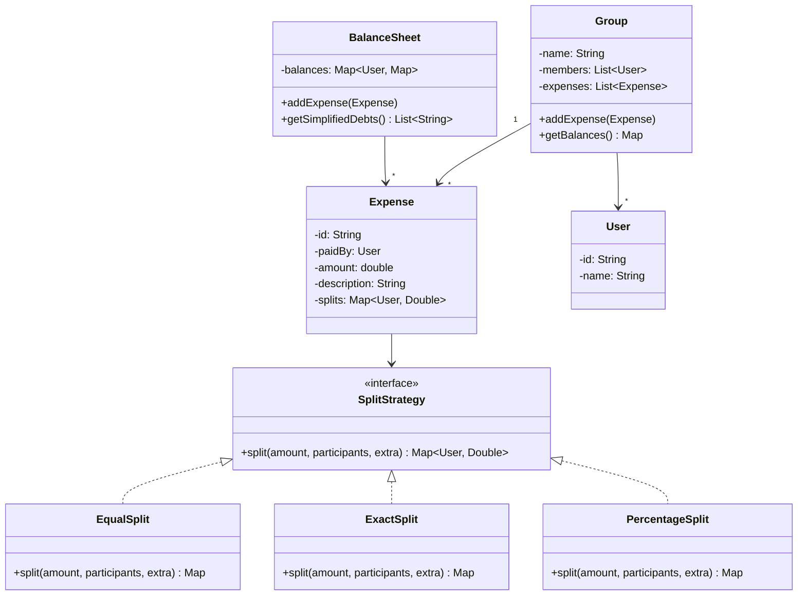

#system-design #lld #example #java #financial

# LLD: Splitwise — Expense Splitting (Java)

## Problem Type: Expense/Financial System

---

## Requirements

- Users create groups and add expenses
- Split types: equal, exact amounts, percentage
- Track balances between users (who owes whom)
- Simplify debts (minimize number of transactions)

---

## Java Implementation (Key Classes)

```java
// === Split Strategy ===
public interface SplitStrategy {
    Map<User, Double> split(double amount, List<User> participants, Map<User, Double> extra);
}

public class EqualSplit implements SplitStrategy {
    public Map<User, Double> split(double amount, List<User> participants, Map<User, Double> extra) {
        double perPerson = amount / participants.size();
        return participants.stream().collect(Collectors.toMap(u -> u, u -> perPerson));
    }
}

public class ExactSplit implements SplitStrategy {
    public Map<User, Double> split(double amount, List<User> participants, Map<User, Double> exactAmounts) {
        double total = exactAmounts.values().stream().mapToDouble(d -> d).sum();
        if (Math.abs(total - amount) > 0.01)
            throw new IllegalArgumentException("Exact amounts don't sum to total");
        return exactAmounts;
    }
}

public class PercentageSplit implements SplitStrategy {
    public Map<User, Double> split(double amount, List<User> participants, Map<User, Double> percentages) {
        double totalPct = percentages.values().stream().mapToDouble(d -> d).sum();
        if (Math.abs(totalPct - 100.0) > 0.01)
            throw new IllegalArgumentException("Percentages must sum to 100");
        Map<User, Double> result = new HashMap<>();
        percentages.forEach((user, pct) -> result.put(user, amount * pct / 100.0));
        return result;
    }
}

// === Expense ===
public class Expense {
    private final String id;
    private final User paidBy;
    private final double amount;
    private final String description;
    private final Map<User, Double> splits;
    private final LocalDateTime createdAt;

    public Expense(User paidBy, double amount, String description,
                   SplitStrategy strategy, List<User> participants, Map<User, Double> extra) {
        this.id = UUID.randomUUID().toString();
        this.paidBy = paidBy;
        this.amount = amount;
        this.description = description;
        this.splits = strategy.split(amount, participants, extra);
        this.createdAt = LocalDateTime.now();
    }
    // getters...
}

// === Balance Sheet ===
public class BalanceSheet {
    // balances[A][B] = amount A owes B (positive = A owes B)
    private final Map<User, Map<User, Double>> balances = new HashMap<>();

    public void addExpense(Expense expense) {
        User payer = expense.getPaidBy();
        expense.getSplits().forEach((user, share) -> {
            if (!user.equals(payer)) {
                addBalance(user, payer, share);  // user owes payer
            }
        });
    }

    private void addBalance(User from, User to, double amount) {
        balances.computeIfAbsent(from, k -> new HashMap<>())
                .merge(to, amount, Double::sum);
        balances.computeIfAbsent(to, k -> new HashMap<>())
                .merge(from, -amount, Double::sum);
    }

    public List<String> getSimplifiedDebts() {
        // Net balance per user
        Map<User, Double> netBalance = new HashMap<>();
        balances.forEach((user, owes) ->
            owes.forEach((other, amt) ->
                netBalance.merge(user, amt, Double::sum)));

        // Greedy simplification
        PriorityQueue<Map.Entry<User, Double>> creditors = new PriorityQueue<>(
            (a, b) -> Double.compare(b.getValue(), a.getValue()));
        PriorityQueue<Map.Entry<User, Double>> debtors = new PriorityQueue<>(
            Comparator.comparingDouble(Map.Entry::getValue));

        netBalance.entrySet().forEach(e -> {
            if (e.getValue() > 0.01) creditors.add(e);
            else if (e.getValue() < -0.01) debtors.add(e);
        });

        List<String> transactions = new ArrayList<>();
        while (!creditors.isEmpty() && !debtors.isEmpty()) {
            var creditor = creditors.poll();
            var debtor = debtors.poll();
            double settle = Math.min(creditor.getValue(), -debtor.getValue());
            transactions.add(String.format("%s pays %s ₹%.2f",
                debtor.getKey().getName(), creditor.getKey().getName(), settle));
        }
        return transactions;
    }
}
```

## Mermaid Class Diagram



---

## Design Patterns Used

| Pattern | Where | Why |
|---------|-------|-----|
| **Strategy** | SplitStrategy | Equal/exact/percentage splits are interchangeable |
| **Observer** | (Extension) Notify users when expense added | Decouple expense creation from notifications |

## One-Change Test

| Change | Impact |
|--------|--------|
| Add "by shares" split (e.g., 2:3:5) | 1 new: `ShareSplit implements SplitStrategy` |
| Add recurring expenses | New `RecurringExpense` wrapping `Expense` + scheduler |
| Add expense categories | Add `category` field to `Expense` — minimal change |

---

## Concurrency Handling

**Race condition:** Two people add expenses simultaneously in the same group — balance calculation may be inconsistent.

```java
public class Group {
    private final List<Expense> expenses = new ArrayList<>();
    private final ReentrantReadWriteLock lock = new ReentrantReadWriteLock();

    // Write lock — adding expense modifies shared state
    public void addExpense(Expense expense) {
        lock.writeLock().lock();
        try {
            expenses.add(expense);
        } finally {
            lock.writeLock().unlock();
        }
    }

    // Read lock — multiple threads can compute balances simultaneously
    public Map<String, Double> getBalances() {
        lock.readLock().lock();
        try {
            return calculateBalances();
        } finally {
            lock.readLock().unlock();
        }
    }
}
```

---

## Error Handling & Edge Cases

```java
// 1. Payer not in group
if (!group.getMembers().contains(expense.getPaidBy()))
    throw new UserNotInGroupException(expense.getPaidBy() + " is not a member of this group");

// 2. Split amounts don't add up to total
double splitTotal = splits.stream().mapToDouble(Split::getAmount).sum();
if (Math.abs(splitTotal - expense.getTotalAmount()) > 0.01)
    throw new InvalidSplitException("Split amounts " + splitTotal + " don't match total " + expense.getTotalAmount());

// 3. Percentage splits don't add up to 100
double totalPercent = splits.stream().mapToDouble(s -> ((PercentageSplit)s).getPercent()).sum();
if (Math.abs(totalPercent - 100.0) > 0.001)
    throw new InvalidSplitException("Percentages must add up to 100%, got " + totalPercent);

// 4. Negative expense amount
if (expense.getTotalAmount() <= 0)
    throw new InvalidAmountException("Expense amount must be positive");

// 5. Settling more than owed
if (settlementAmount > owedAmount)
    throw new OverSettlementException("Settlement amount exceeds balance");
```

**Edge cases to mention:**
- What if a user leaves the group with outstanding balance?
- Currency conversion for international groups
- Rounding (₹100 / 3 = 33.33, 33.33, 33.34)

---

## Follow-up Questions

| Question | Answer Direction |
|----------|-----------------|
| How to simplify debts (A→B ₹100, B→A ₹60 → A→B ₹40)? | Greedy debt simplification algorithm — net balances map |
| Add recurring expenses (monthly rent)? | `RecurringExpense` decorator with scheduler |
| Multi-currency groups? | Add `Currency` + `ExchangeRateService` to `Expense` |
| How to persist? | `expenses`, `splits`, `settlements` tables in DB |
| Add notifications when expense is added? | Observer — members subscribed to group events |

---

## Company-Specific Variants

**CRED / PhonePe (payments integration):**
- One-click UPI settlement within app
- Settlement history with payment screenshots
- Credit score based settlement reminders

**Atlassian (team expense tracking):**
- Integration with company expense policies
- Manager approval for large expenses
- Monthly report generation

---

## Links

- [[../patterns/behavioral]] — Strategy pattern
- [[../lld_thinking_system]] — CRC → class diagram → code
- [[../lld_concurrency_patterns]] — ReadWriteLock usage
- [[../lld_database_design]] — Expense, splits, settlements schema
